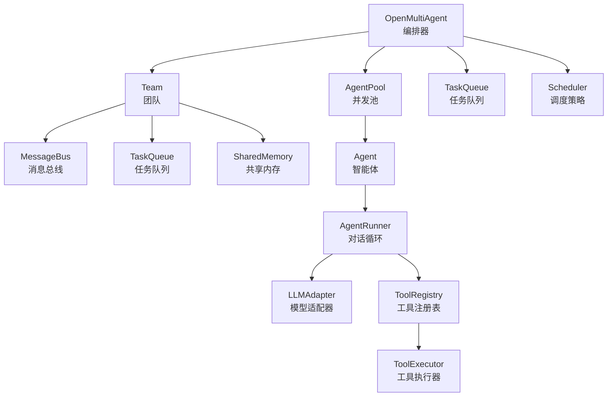
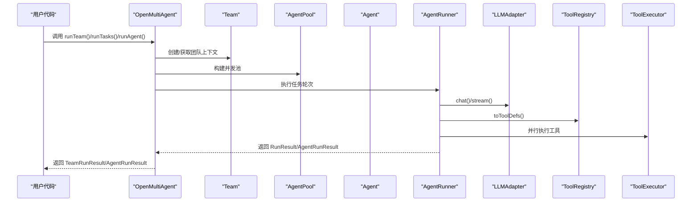
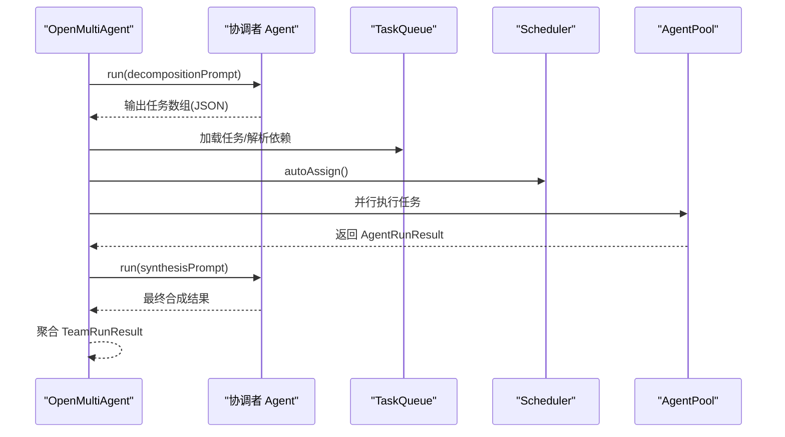
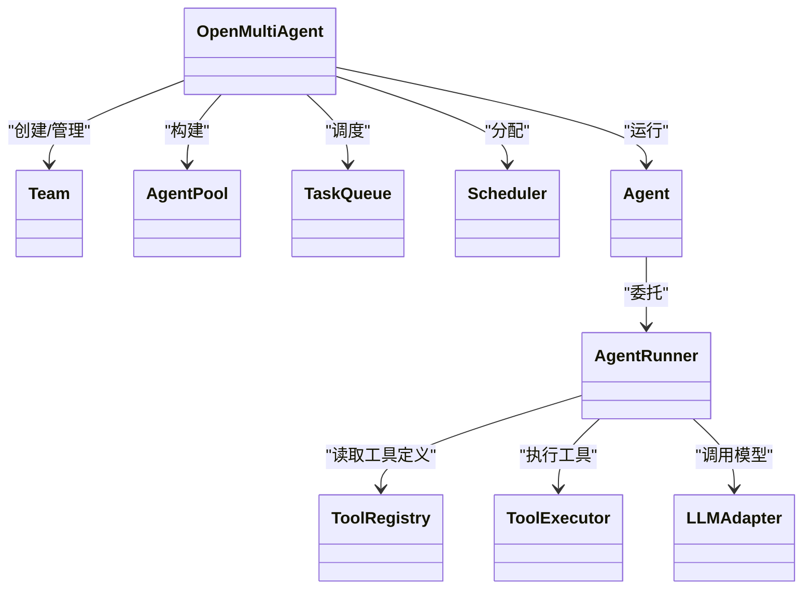

# API 参考

<cite>
**本文引用的文件**
- [src/index.ts](file://src/index.ts)
- [src/types.ts](file://src/types.ts)
- [src/orchestrator/orchestrator.ts](file://src/orchestrator/orchestrator.ts)
- [src/team/team.ts](file://src/team/team.ts)
- [src/agent/agent.ts](file://src/agent/agent.ts)
- [src/agent/runner.ts](file://src/agent/runner.ts)
- [src/tool/framework.ts](file://src/tool/framework.ts)
- [examples/01-single-agent.ts](file://examples/01-single-agent.ts)
- [examples/02-team-collaboration.ts](file://examples/02-team-collaboration.ts)
- [tests/approval.test.ts](file://tests/approval.test.ts)
- [tests/agent-hooks.test.ts](file://tests/agent-hooks.test.ts)
- [README.md](file://README.md)
</cite>

## 目录
1. [简介](#简介)
2. [项目结构](#项目结构)
3. [核心组件](#核心组件)
4. [架构总览](#架构总览)
5. [详细组件分析](#详细组件分析)
6. [依赖关系分析](#依赖关系分析)
7. [性能与并发](#性能与并发)
8. [故障排查指南](#故障排查指南)
9. [结论](#结论)
10. [附录：类型定义参考](#附录类型定义参考)

## 简介
本文件为 Open Multi-Agent 框架的完整 API 参考，覆盖公开类与接口、类型定义、事件回调系统、错误处理与异常类型，并提供使用示例路径与最佳实践。重点围绕以下公共 API：
- OpenMultiAgent 类及其方法：createTeam、runTeam、runTasks、runAgent
- 核心配置类型：AgentConfig、TeamConfig、TaskConfig
- 事件回调系统：onProgress、onTrace、onApproval
- 错误处理与异常类型说明

## 项目结构
框架采用模块化分层设计，主要模块如下：
- orchestrator：编排器，负责任务队列、调度、并发控制与进度/追踪回调
- team：团队协作，包含消息总线、任务队列与共享内存
- agent：智能体运行时，封装对话循环、工具执行、钩子与流式输出
- tool：工具注册与执行框架，支持自定义工具与内置工具
- llm：适配器层，统一不同模型提供商的聊天与流式接口
- memory：共享内存抽象
- types：公共类型定义与事件/追踪类型

图表来源
- [src/orchestrator/orchestrator.ts:508-1072](file://src/orchestrator/orchestrator.ts#L508-L1072)
- [src/team/team.ts:88-335](file://src/team/team.ts#L88-L335)
- [src/agent/agent.ts:81-623](file://src/agent/agent.ts#L81-L623)
- [src/agent/runner.ts:166-543](file://src/agent/runner.ts#L166-L543)
- [src/tool/framework.ts:93-203](file://src/tool/framework.ts#L93-L203)

章节来源
- [README.md:137-178](file://README.md#L137-L178)

## 核心组件
本节概述公开 API 的职责与调用入口。

- OpenMultiAgent：顶层编排器，提供 createTeam、runTeam、runTasks、runAgent、getStatus、shutdown 等方法；支持 onProgress、onTrace、onApproval 回调。
- Team：团队对象，管理代理清单、消息总线、任务队列与共享内存；提供任务增删改查、消息广播与订阅等能力。
- Agent：单个智能体，封装 run/prompt/stream、工具注册、钩子、状态跟踪与结构化输出验证。
- AgentRunner：对话循环引擎，负责 LLM 调用、工具提取与执行、循环控制、流式事件与追踪。
- ToolRegistry/ToolExecutor：工具定义、注册与执行框架。
- LLMAdapter：统一的模型适配器接口，屏蔽不同提供商差异。
- SharedMemory/MemoryStore：共享内存抽象，支持键值存取与命名空间摘要。

章节来源
- [src/index.ts:57-182](file://src/index.ts#L57-L182)
- [src/orchestrator/orchestrator.ts:514-1072](file://src/orchestrator/orchestrator.ts#L514-L1072)
- [src/team/team.ts:88-335](file://src/team/team.ts#L88-L335)
- [src/agent/agent.ts:81-623](file://src/agent/agent.ts#L81-L623)
- [src/agent/runner.ts:166-543](file://src/agent/runner.ts#L166-L543)
- [src/tool/framework.ts:93-203](file://src/tool/framework.ts#L93-L203)

## 架构总览
下图展示从高层 API 到底层实现的关键交互流程。

图表来源
- [src/orchestrator/orchestrator.ts:641-740](file://src/orchestrator/orchestrator.ts#L641-L740)
- [src/agent/runner.ts:191-522](file://src/agent/runner.ts#L191-L522)
- [src/agent/agent.ts:177-372](file://src/agent/agent.ts#L177-L372)
- [src/tool/framework.ts:162-202](file://src/tool/framework.ts#L162-L202)

## 详细组件分析

### OpenMultiAgent 类 API
- 方法概览
  - createTeam(name: string, config: TeamConfig): Team
  - runAgent(config: AgentConfig, prompt: string): Promise<AgentRunResult>
  - runTeam(team: Team, goal: string): Promise<TeamRunResult>
  - runTasks(team: Team, tasks: Task[]): Promise<TeamRunResult>
  - getStatus(): { teams: number; activeAgents: number; completedTasks: number }
  - shutdown(): Promise<void>
- 配置项
  - OrchestratorConfig：maxConcurrency、defaultModel、defaultProvider、defaultBaseURL、defaultApiKey、onProgress、onTrace、onApproval
- 关键行为
  - 自动协调：runTeam 内部通过“协调者”代理分解目标为任务，构建依赖图并调度执行。
  - 并发执行：独立任务在 maxConcurrency 下并行执行。
  - 进度回调：onProgress 接收 OrchestratorEvent 事件。
  - 追踪回调：onTrace 接收 TraceEvent，用于可观测性。
  - 审批门控：onApproval 在每轮任务完成后决定是否继续下一阶段。
  - 重试机制：executeWithRetry 支持任务级指数退避重试。
- 使用示例
  - 单智能体：参见 [examples/01-single-agent.ts:34-59](file://examples/01-single-agent.ts#L34-L59)
  - 团队协作：参见 [examples/02-team-collaboration.ts:128-167](file://examples/02-team-collaboration.ts#L128-L167)

章节来源
- [src/orchestrator/orchestrator.ts:514-1072](file://src/orchestrator/orchestrator.ts#L514-L1072)
- [src/types.ts:386-411](file://src/types.ts#L386-L411)
- [examples/01-single-agent.ts:34-59](file://examples/01-single-agent.ts#L34-L59)
- [examples/02-team-collaboration.ts:128-167](file://examples/02-team-collaboration.ts#L128-L167)

#### runTeam 流程时序

图表来源
- [src/orchestrator/orchestrator.ts:641-740](file://src/orchestrator/orchestrator.ts#L641-L740)
- [src/orchestrator/orchestrator.ts:893-936](file://src/orchestrator/orchestrator.ts#L893-L936)

### Team 类 API
- 方法概览
  - getAgents(): AgentConfig[]
  - getAgent(name: string): AgentConfig | undefined
  - sendMessage(from: string, to: string, content: string): void
  - broadcast(from: string, content: string): void
  - getMessages(agentName: string): Message[]
  - addTask(task: Omit<Task,'id'|'createdAt'|'updatedAt'>): Task
  - getTasks(): Task[]
  - getTasksByAssignee(agentName: string): Task[]
  - updateTask(taskId: string, update: Partial<Task>): Task
  - getNextTask(agentName: string): Task | undefined
  - getSharedMemory(): MemoryStore | undefined
  - getSharedMemoryInstance(): SharedMemory | undefined
  - on(event: string, handler: (data: unknown) => void): () => void
  - emit(event: string, data: unknown): void
- 事件系统
  - 内置事件：task:ready、task:complete、task:failed、all:complete、message、broadcast
  - 数据类型：unknown；建议转换为 OrchestratorEvent 获取结构化字段

章节来源
- [src/team/team.ts:88-335](file://src/team/team.ts#L88-L335)

### Agent 类 API
- 方法概览
  - run(prompt: string, runOptions?: Partial<RunOptions>): Promise<AgentRunResult>
  - prompt(message: string): Promise<AgentRunResult>
  - stream(prompt: string): AsyncGenerator<StreamEvent>
  - getState(): AgentState
  - getHistory(): LLMMessage[]
  - reset(): void
  - addTool(tool: ToolDefinition): void
  - removeTool(name: string): void
  - getTools(): string[]
  - buildToolContext(abortSignal?: AbortSignal): ToolUseContext
- 钩子
  - beforeRun(context: BeforeRunHookContext): BeforeRunHookContext | Promise<BeforeRunHookContext>
  - afterRun(result: AgentRunResult): AgentRunResult | Promise<AgentRunResult>
- 结构化输出
  - outputSchema: ZodSchema，自动解析与一次重试验证

章节来源
- [src/agent/agent.ts:81-623](file://src/agent/agent.ts#L81-L623)
- [src/agent/runner.ts:166-543](file://src/agent/runner.ts#L166-L543)

### AgentRunner 类 API
- 方法概览
  - run(messages: LLMMessage[], options?: RunOptions): Promise<RunResult>
  - stream(initialMessages: LLMMessage[], options?: RunOptions): AsyncGenerator<StreamEvent>
- 配置
  - RunnerOptions：model、systemPrompt、maxTurns、maxTokens、temperature、abortSignal、allowedTools、agentName、agentRole、loopDetection
  - RunOptions：onToolCall、onToolResult、onMessage、onWarning、onTrace、runId、taskId、traceAgent、abortSignal
- 行为
  - 工具并行执行、循环检测、流式事件、追踪上报

章节来源
- [src/agent/runner.ts:166-543](file://src/agent/runner.ts#L166-L543)

### 工具系统
- defineTool(config)：定义类型安全工具
- ToolRegistry：注册/注销/列出工具，导出 LLMToolDef
- ToolExecutor：按名称执行工具，收集 ToolResult

章节来源
- [src/tool/framework.ts:71-203](file://src/tool/framework.ts#L71-L203)

### 事件与追踪
- OrchestratorEvent：agent_start、agent_complete、task_start、task_complete、task_skipped、task_retry、message、error
- TraceEvent：llm_call、tool_call、task、agent，携带 runId、agent、taskId、时间戳与用量信息
- 回调
  - onProgress：接收 OrchestratorEvent
  - onTrace：接收 TraceEvent
  - onApproval：在每轮任务完成后决定是否继续

章节来源
- [src/types.ts:370-470](file://src/types.ts#L370-L470)
- [src/orchestrator/orchestrator.ts:280-464](file://src/orchestrator/orchestrator.ts#L280-L464)
- [tests/approval.test.ts:206-370](file://tests/approval.test.ts#L206-L370)

## 依赖关系分析
- 组件耦合
  - OpenMultiAgent 依赖 Team、AgentPool、TaskQueue、Scheduler、Agent、ToolRegistry、ToolExecutor、LLMAdapter
  - Agent 依赖 AgentRunner、ToolRegistry、ToolExecutor、LLMAdapter
  - AgentRunner 依赖 ToolRegistry、ToolExecutor、LLMAdapter
- 外部依赖
  - Zod 用于结构化输出校验与 JSON Schema 转换
  - 各大模型提供商 SDK 通过 LLMAdapter 抽象接入

图表来源
- [src/orchestrator/orchestrator.ts:514-1072](file://src/orchestrator/orchestrator.ts#L514-L1072)
- [src/agent/agent.ts:81-623](file://src/agent/agent.ts#L81-L623)
- [src/agent/runner.ts:166-543](file://src/agent/runner.ts#L166-L543)
- [src/tool/framework.ts:93-203](file://src/tool/framework.ts#L93-L203)

## 性能与并发
- 并发控制
  - maxConcurrency 控制 AgentPool 并发度，默认 5
  - 任务并行：无共享依赖的任务在一轮内并行执行
- 重试与退避
  - executeWithRetry 支持 maxRetries、retryDelayMs、retryBackoff
  - 重试延迟上限 30 秒，避免指数爆炸
- 循环检测
  - LoopDetectionConfig 提供重复工具调用/文本检测，支持 warn/terminate/custom 动作
- 超时保护
  - AgentConfig.timeoutMs 对单次 run/prompt/stream 设置超时信号

章节来源
- [src/orchestrator/orchestrator.ts:108-194](file://src/orchestrator/orchestrator.ts#L108-L194)
- [src/agent/agent.ts:312-326](file://src/agent/agent.ts#L312-L326)
- [src/agent/runner.ts:257-366](file://src/agent/runner.ts#L257-L366)

## 故障排查指南
- 审批门控 onApproval
  - 回调抛错会跳过剩余任务并标记 skipped
  - 仅在有成功完成任务且存在下一轮任务时触发
- 钩子 beforeRun/afterRun
  - beforeRun 抛错直接中止本次运行
  - afterRun 抛错将失败标记到最终结果
- 结构化输出
  - outputSchema 验证失败会自动重试一次，仍失败则返回失败结果
- 本地模型工具调用
  - 若模型不支持原生 tool_calls，框架会尝试从文本中提取
  - 建议设置 timeoutMs 防止长时间阻塞

章节来源
- [tests/approval.test.ts:304-317](file://tests/approval.test.ts#L304-L317)
- [tests/agent-hooks.test.ts:112-124](file://tests/agent-hooks.test.ts#L112-L124)
- [src/agent/agent.ts:400-477](file://src/agent/agent.ts#L400-L477)
- [README.md:206-232](file://README.md#L206-L232)

## 结论
Open Multi-Agent 提供了从单智能体到多智能体团队的全栈编排能力，通过统一的事件与追踪回调、灵活的工具系统与并发控制，满足复杂任务流水线与可观测性需求。推荐优先使用 runTeam 快速落地目标导向任务，或在需要精细控制时使用 runTasks 显式定义任务图。

## 附录：类型定义参考

### 公共类型导出
- 内容块与消息
  - TextBlock、ToolUseBlock、ToolResultBlock、ImageBlock、ContentBlock
  - LLMMessage、LLMResponse、TokenUsage
- LLM 适配器
  - LLMAdapter、LLMChatOptions、LLMStreamOptions、StreamEvent
- 工具
  - ToolDefinition、ToolResult、ToolUseContext、ToolRegistry、ToolExecutor、BatchToolCall
- 智能体
  - AgentConfig、AgentState、AgentRunResult、BeforeRunHookContext、ToolCallRecord、LoopDetectionConfig、LoopDetectionInfo
- 团队
  - TeamConfig、TeamRunResult、Message、MessageBus
- 任务
  - Task、TaskStatus、TaskQueue、TaskQueueEvent
- 编排器
  - OrchestratorConfig、OrchestratorEvent
- 追踪
  - TraceEventType、TraceEventBase、TraceEvent、LLMCallTrace、ToolCallTrace、TaskTrace、AgentTrace
- 内存
  - MemoryEntry、MemoryStore

章节来源
- [src/types.ts:14-543](file://src/types.ts#L14-L543)
- [src/index.ts:122-182](file://src/index.ts#L122-L182)

### 事件回调接口规范
- onProgress(OrchestratorEvent)
  - 触发时机：任务开始/完成、代理开始/完成、消息、错误、重试、跳过
  - 事件类型：agent_start、agent_complete、task_start、task_complete、task_skipped、task_retry、message、error
- onTrace(TraceEvent)
  - 触发时机：每次 LLM 调用、工具执行、任务完成、代理运行结束
  - 事件类型：llm_call、tool_call、task、agent
- onApproval(completedTasks: readonly Task[], nextTasks: readonly Task[]): Promise<boolean>
  - 触发时机：每轮任务完成后，存在下一轮任务时
  - 行为：返回 true 继续，false 中止并标记剩余任务为 skipped

章节来源
- [src/types.ts:370-411](file://src/types.ts#L370-L411)
- [src/orchestrator/orchestrator.ts:280-464](file://src/orchestrator/orchestrator.ts#L280-L464)
- [tests/approval.test.ts:283-302](file://tests/approval.test.ts#L283-L302)

### 错误处理与异常类型
- Agent 钩子
  - beforeRun 抛错：直接中止运行，返回失败结果
  - afterRun 抛错：标记运行失败
- 工具执行
  - 工具异常捕获为 ToolResult(isError: true)，不影响对话循环
- 审批门控
  - 回调抛错：跳过剩余任务，标记 skipped
- 循环检测
  - terminate：立即终止当前轮次
  - warn/inject：注入警告后继续，二次检测强制终止
- 超时与取消
  - timeoutMs：对单次 run/prompt/stream 设置 AbortSignal.timeout
  - abortSignal：支持外部取消

章节来源
- [src/agent/agent.ts:357-371](file://src/agent/agent.ts#L357-L371)
- [src/agent/runner.ts:495-498](file://src/agent/runner.ts#L495-L498)
- [tests/agent-hooks.test.ts:112-124](file://tests/agent-hooks.test.ts#L112-L124)
- [tests/approval.test.ts:304-317](file://tests/approval.test.ts#L304-L317)

### 使用示例路径
- 单智能体运行与流式输出：[examples/01-single-agent.ts:34-103](file://examples/01-single-agent.ts#L34-L103)
- 团队协作与进度回调：[examples/02-team-collaboration.ts:128-167](file://examples/02-team-collaboration.ts#L128-L167)

章节来源
- [examples/01-single-agent.ts:34-103](file://examples/01-single-agent.ts#L34-L103)
- [examples/02-team-collaboration.ts:128-167](file://examples/02-team-collaboration.ts#L128-L167)