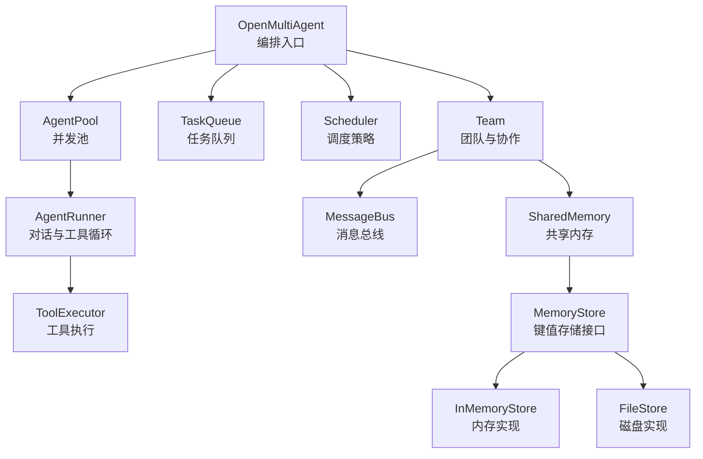
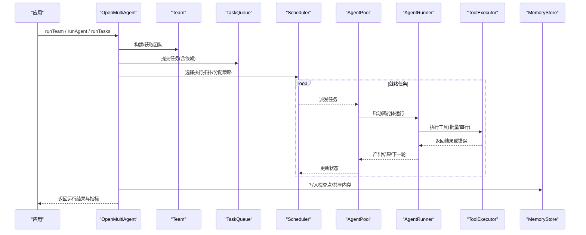
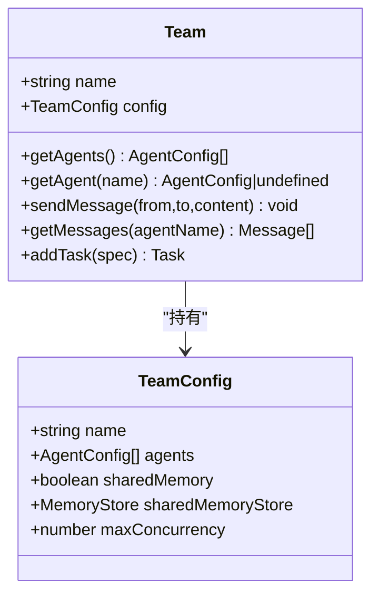
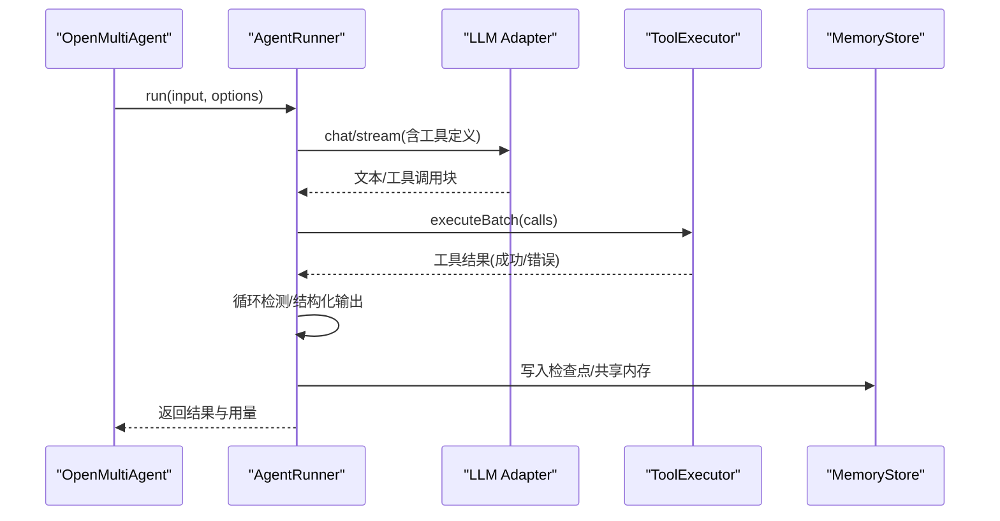
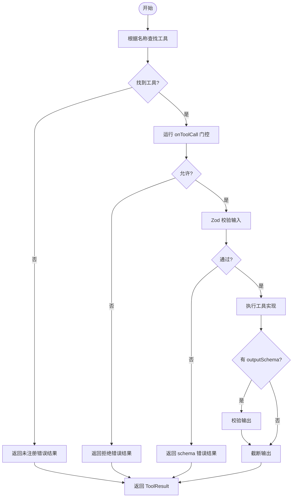
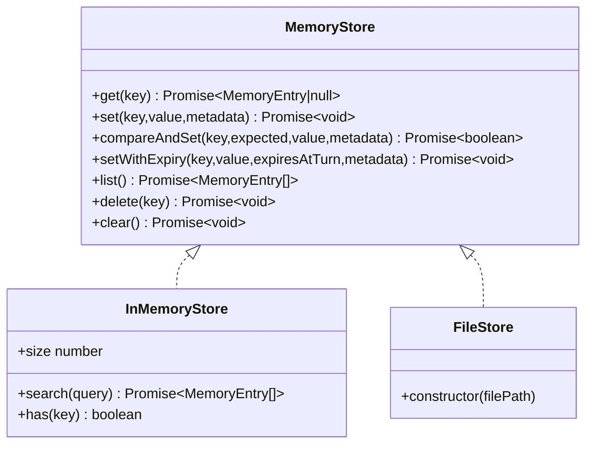
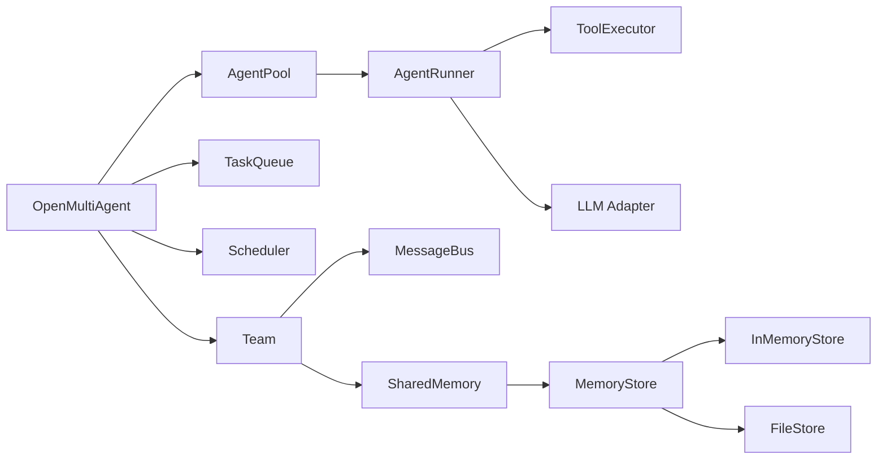

# API 参考

<cite>
**本文引用的文件**
- [packages/core/src/index.ts](file://packages/core/src/index.ts)
- [packages/core/src/orchestrator/orchestrator.ts](file://packages/core/src/orchestrator/orchestrator.ts)
- [packages/core/src/team/team.ts](file://packages/core/src/team/team.ts)
- [packages/core/src/agent/runner.ts](file://packages/core/src/agent/runner.ts)
- [packages/core/src/tool/executor.ts](file://packages/core/src/tool/executor.ts)
- [packages/core/src/memory/store.ts](file://packages/core/src/memory/store.ts)
- [packages/core/src/memory/file-store.ts](file://packages/core/src/memory/file-store.ts)
- [packages/core/src/types.ts](file://packages/core/src/types.ts)
</cite>

## 目录
1. [简介](#简介)
2. [项目结构](#项目结构)
3. [核心组件](#核心组件)
4. [架构总览](#架构总览)
5. [详细组件分析](#详细组件分析)
6. [依赖关系分析](#依赖关系分析)
7. [性能考量](#性能考量)
8. [故障排查指南](#故障排查指南)
9. [结论](#结论)
10. [附录](#附录)

## 简介
本参考文档面向使用 Open Multi-Agent（OMA）的开发者，系统化说明以下能力：
- OpenMultiAgent 类的所有方法与属性、构造函数参数、事件与恢复机制。
- Team 类的配置接口：团队配置、成员管理、协作模式（共享内存、消息总线）。
- Agent 配置接口：系统提示词、工具权限、上下文、采样参数等。
- ToolExecutor 接口的实现指南：工具注册、参数校验、结果处理、并发控制。
- 存储 API：MemoryStore 接口及 InMemoryStore、FileStore 等实现。
- 类型定义与接口规范：参数说明、返回值描述、异常与错误分类。

## 项目结构
Open Multi-Agent 的核心代码位于 packages/core/src，按职责分层组织：
- orchestrator：编排入口、任务执行、预算与治理、路由与调度。
- agent：单智能体对话循环、工具调用、结构化输出、池化与并发。
- team：团队对象、消息总线、任务队列、共享内存。
- tool：工具框架、内置工具、执行器。
- memory：共享内存抽象与持久化实现。
- llm：模型适配器与流式处理。
- observability：可观测性、追踪、审计。
- types：公共类型与接口定义。

图表来源
- [packages/core/src/orchestrator/orchestrator.ts:1-200](file://packages/core/src/orchestrator/orchestrator.ts#L1-L200)
- [packages/core/src/team/team.ts:1-200](file://packages/core/src/team/team.ts#L1-L200)
- [packages/core/src/agent/runner.ts:76-1811](file://packages/core/src/agent/runner.ts#L76-L1811)
- [packages/core/src/tool/executor.ts:1-200](file://packages/core/src/tool/executor.ts#L1-L200)
- [packages/core/src/memory/store.ts:1-167](file://packages/core/src/memory/store.ts#L1-L167)
- [packages/core/src/memory/file-store.ts:1-281](file://packages/core/src/memory/file-store.ts#L1-L281)

章节来源
- [packages/core/src/index.ts:1-477](file://packages/core/src/index.ts#L1-L477)

## 核心组件
- OpenMultiAgent：编排主入口，负责创建团队、运行单智能体、运行团队、运行显式任务、共识验证、检查点恢复、预算与治理、路由选择、可观测性集成等。
- Team：团队对象，维护智能体名册、消息总线、任务队列、共享内存，并提供事件总线。
- AgentRunner：驱动单个智能体的完整对话循环，包含 LLM 调用、工具调用、循环检测、结构化输出、断点续跑。
- ToolExecutor：工具执行器，负责工具注册查找、输入校验、并发控制、结果封装、错误隔离。
- MemoryStore：共享内存键值存储接口；InMemoryStore 为进程内实现；FileStore 为原子写入的磁盘实现。

章节来源
- [packages/core/src/orchestrator/orchestrator.ts:1-200](file://packages/core/src/orchestrator/orchestrator.ts#L1-L200)
- [packages/core/src/team/team.ts:1-200](file://packages/core/src/team/team.ts#L1-L200)
- [packages/core/src/agent/runner.ts:76-1811](file://packages/core/src/agent/runner.ts#L76-L1811)
- [packages/core/src/tool/executor.ts:1-200](file://packages/core/src/tool/executor.ts#L1-L200)
- [packages/core/src/memory/store.ts:1-167](file://packages/core/src/memory/store.ts#L1-L167)
- [packages/core/src/memory/file-store.ts:1-281](file://packages/core/src/memory/file-store.ts#L1-L281)

## 架构总览
下图展示从编排到执行的端到端流程：应用调用 OpenMultiAgent 的 runTeam/runAgent/runTasks，内部通过 Team、TaskQueue、Scheduler、AgentPool、AgentRunner、ToolExecutor 协同完成工作，并通过 MemoryStore 进行共享状态与检查点持久化。

图表来源
- [packages/core/src/orchestrator/orchestrator.ts:1-200](file://packages/core/src/orchestrator/orchestrator.ts#L1-L200)
- [packages/core/src/team/team.ts:1-200](file://packages/core/src/team/team.ts#L1-L200)
- [packages/core/src/agent/runner.ts:76-1811](file://packages/core/src/agent/runner.ts#L76-L1811)
- [packages/core/src/tool/executor.ts:1-200](file://packages/core/src/tool/executor.ts#L1-L200)
- [packages/core/src/memory/store.ts:1-167](file://packages/core/src/memory/store.ts#L1-L167)

## 详细组件分析

### OpenMultiAgent 类
- 职责
  - 编排入口：runAgent、runTeam、runTasks、restore、runConsensus。
  - 资源管理：创建/复用 Team、AgentPool、调度器、检查点、可观测性。
  - 治理与预算：执行路由、治理声明、成本/令牌预算上限、失败分类。
  - 事件与追踪：onProgress、traceRuntime、执行回执。
- 关键方法（概念说明）
  - runAgent：运行单个智能体，支持中止信号、身份与追踪。
  - runTeam：基于目标自动规划任务图并执行，支持模式切换、治理意图、执行路由。
  - runTasks：执行显式任务列表，支持依赖、优先级、重试、预算、检查点。
  - restore：从检查点恢复运行，必要时重新合成协调结果。
  - runConsensus：提议者+裁判验证，提升结果可靠性。
- 构造与配置
  - 默认模型、并发度、调度策略、严格指派、执行路由、预算上限、可观测性等。
- 事件
  - onProgress：任务开始/完成、跳过、重试、审批挂起、计划修订、恢复决策、预算超限、消息、警告、错误等。

章节来源
- [packages/core/src/orchestrator/orchestrator.ts:1-200](file://packages/core/src/orchestrator/orchestrator.ts#L1-L200)
- [packages/core/src/types.ts:1514-1540](file://packages/core/src/types.ts#L1514-L1540)
- [packages/core/src/types.ts:1731-1788](file://packages/core/src/types.ts#L1731-L1788)
- [packages/core/src/types.ts:2131-2180](file://packages/core/src/types.ts#L2131-L2180)
- [packages/core/src/types.ts:2349-2377](file://packages/core/src/types.ts#L2349-L2377)

### Team 类
- 职责
  - 维护智能体名册（按名称索引）、消息总线、任务队列、共享内存。
  - 暴露事件总线，桥接任务队列事件（task_start/complete/failed/all_complete）。
- 配置接口（TeamConfig）
  - name：团队名称。
  - agents：智能体配置数组。
  - sharedMemory：是否启用共享内存。
  - sharedMemoryStore：自定义存储实现（优先于布尔开关）。
  - maxConcurrency：最大并发度。
- 成员管理与协作
  - getAgents/getAgent：查询智能体配置。
  - sendMessage/getMessages：点对点消息与读取。
  - addTask：添加任务（标题、描述、依赖、角色、优先级、元数据、重试等）。
  - 事件：订阅 task:ready、task:complete、error、all:complete。

图表来源
- [packages/core/src/team/team.ts:1-200](file://packages/core/src/team/team.ts#L1-L200)
- [packages/core/src/types.ts:1295-1310](file://packages/core/src/types.ts#L1295-L1310)

章节来源
- [packages/core/src/team/team.ts:1-200](file://packages/core/src/team/team.ts#L1-L200)
- [packages/core/src/types.ts:1295-1310](file://packages/core/src/types.ts#L1295-L1310)

### Agent 配置与运行
- 配置要点（AgentConfig/RunnerOptions）
  - model：模型标识。
  - systemPrompt：系统提示词。
  - tools/disallowedTools：工具白名单/黑名单。
  - customTools：自定义工具定义（绕过 allowlist，仍受 disallowedTools 限制）。
  - onToolCall：每调用门控（允许/拒绝/挂起）。
  - sampling：temperature/topP/topK/minP、parallelToolCalls。
  - credentials：凭据注入（供工具使用）。
  - cwd：文件系统沙箱工作目录。
- 运行选项（RunAgentOptions/RunOptions）
  - abortSignal：中止信号。
  - runId/taskId：运行/任务标识。
  - traceRuntime/traceSpan：追踪上下文。
  - onMessage/onToolCall/onToolResult：回调。
- 运行流程（序列图）

图表来源
- [packages/core/src/agent/runner.ts:76-1811](file://packages/core/src/agent/runner.ts#L76-L1811)
- [packages/core/src/tool/executor.ts:1-200](file://packages/core/src/tool/executor.ts#L1-L200)
- [packages/core/src/types.ts:544-618](file://packages/core/src/types.ts#L544-L618)
- [packages/core/src/types.ts:958-985](file://packages/core/src/types.ts#L958-L985)

章节来源
- [packages/core/src/agent/runner.ts:76-1811](file://packages/core/src/agent/runner.ts#L76-L1811)
- [packages/core/src/types.ts:544-618](file://packages/core/src/types.ts#L544-L618)
- [packages/core/src/types.ts:958-985](file://packages/core/src/types.ts#L958-L985)

### ToolExecutor 实现指南
- 工具注册
  - 通过 defineTool 定义工具（name、description、inputSchema、execute），由 ToolRegistry 管理。
  - 内置工具可通过 registerBuiltInTools 注册。
- 参数验证
  - 使用 inputSchema（Zod）对输入进行强校验，失败返回错误 ToolResult。
- 执行与并发
  - execute：单次执行；executeBatch：批量并行执行，受 Semaphore 限流。
  - 支持 per-call gate（onToolCall）在验证后、执行前做决策（allow/deny/suspend）。
- 结果处理
  - 非错误结果可按 outputSchema 二次校验，再截断输出长度。
  - 所有异常被捕获为 ToolResult（isError=true），便于上层统一处理。
- 检查点与幂等
  - 结合 durableApproval 支持恢复时重放已批准的工具调用。
  - 提供 toolCallId 作为外部幂等键。

图表来源
- [packages/core/src/tool/executor.ts:1-200](file://packages/core/src/tool/executor.ts#L1-L200)
- [packages/core/src/types.ts:605-618](file://packages/core/src/types.ts#L605-L618)

章节来源
- [packages/core/src/tool/executor.ts:1-200](file://packages/core/src/tool/executor.ts#L1-L200)
- [packages/core/src/types.ts:605-618](file://packages/core/src/types.ts#L605-L618)

### 存储 API（MemoryStore 与实现）
- 接口（MemoryStore）
  - get/set/list/delete/clear：基本 CRUD。
  - compareAndSet：可选 CAS，用于耐久审批。
  - setWithExpiry：可选带“回合数”过期写入。
- InMemoryStore
  - 进程内 Map 实现，适合测试与单进程场景。
  - 提供 search 辅助方法（key/value 子串匹配）。
- FileStore
  - 单 JSON 文件持久化，内存镜像 Map，读写原子化（临时文件 + fsync + rename）。
  - 推荐用作检查点存储；若用作共享内存，每次写会刷新整个文件。
  - 版本兼容保护（FILE_FORMAT_VERSION）。

图表来源
- [packages/core/src/types.ts:2806-2872](file://packages/core/src/types.ts#L2806-L2872)
- [packages/core/src/memory/store.ts:1-167](file://packages/core/src/memory/store.ts#L1-L167)
- [packages/core/src/memory/file-store.ts:1-281](file://packages/core/src/memory/file-store.ts#L1-L281)

章节来源
- [packages/core/src/types.ts:2806-2872](file://packages/core/src/types.ts#L2806-L2872)
- [packages/core/src/memory/store.ts:1-167](file://packages/core/src/memory/store.ts#L1-L167)
- [packages/core/src/memory/file-store.ts:1-281](file://packages/core/src/memory/file-store.ts#L1-L281)

### 类型定义与接口规范
- 运行与状态
  - RunStatusCode：ok/error/cancelled/timeout/budget_exhausted/rejected/suspended/skipped。
  - RunStatus：code/message。
  - StructuredTraceError：kind/code/name/message/retryable/httpStatus/provider/attempt。
- 任务与计划
  - RunTaskSpec/Task：标题、描述、assignee、dependsOn、memoryScope、dependencyPayload、role、priority、metadata、maxRetries、retryDelayMs、retryBackoff、requires。
  - PlanArtifact/PlanTaskArtifact：可序列化计划产物。
- 团队与运行选项
  - TeamConfig：name、agents、sharedMemory、sharedMemoryStore、maxConcurrency。
  - RunTeamOptions：coordinator、mode、executionRouter、executionRouting、governanceIntent、requiredRoles、requiredOrder、preferredUnderBudget。
  - RunTasksOptions：abortSignal、maxTokenBudget、maxCostBudget、checkpoint、modelRouting。
- 编排与调度
  - OrchestratorConfig：maxConcurrency、schedulingStrategy、schedulingWeights、strictAssignees、executionRouter、modelRouting。
  - SchedulingStrategy：round-robin/least-busy/capability-match/dependency-first/composite。
- 检查点与恢复
  - CheckpointOptions：enabled、store、key、runId。
  - RestoreOptions：goal、coordinator。
- 共享内存
  - SharedMemoryValue：基础类型/数组/对象。
  - SharedMemoryEntry/MemoryEntry：键值、元数据、createdAt、expiresAtTurn。
  - SharedMemoryWriteOptions：schema 校验。
- 工具与上下文
  - ToolUseContext：agent、abortSignal、cwd、runId、taskId、team、credentials。
  - ToolCallGate：per-call 门控（allow/deny/suspend）。
  - ToolDefinition：name、description、inputSchema、execute、outputSchema、maxOutputChars。
- 可观测性与事件
  - OrchestratorEvent：type、agent、task、data。
  - TraceErrorKind：provider/tool/framework/callback/validation/timeout/cancellation/budget/store/exporter/unknown。

章节来源
- [packages/core/src/types.ts:277-321](file://packages/core/src/types.ts#L277-L321)
- [packages/core/src/types.ts:1386-1407](file://packages/core/src/types.ts#L1386-L1407)
- [packages/core/src/types.ts:1928-1951](file://packages/core/src/types.ts#L1928-L1951)
- [packages/core/src/types.ts:1731-1788](file://packages/core/src/types.ts#L1731-L1788)
- [packages/core/src/types.ts:1514-1540](file://packages/core/src/types.ts#L1514-L1540)
- [packages/core/src/types.ts:2131-2180](file://packages/core/src/types.ts#L2131-L2180)
- [packages/core/src/types.ts:2349-2377](file://packages/core/src/types.ts#L2349-L2377)
- [packages/core/src/types.ts:2806-2872](file://packages/core/src/types.ts#L2806-L2872)
- [packages/core/src/types.ts:544-618](file://packages/core/src/types.ts#L544-L618)
- [packages/core/src/types.ts:958-985](file://packages/core/src/types.ts#L958-L985)

## 依赖关系分析
- 模块耦合
  - OpenMultiAgent 依赖 Team、TaskQueue、Scheduler、AgentPool、AgentRunner、ToolExecutor、MemoryStore、可观测性子系统。
  - Team 依赖 MessageBus、TaskQueue、SharedMemory。
  - AgentRunner 依赖 LLM Adapter、ToolExecutor、LoopDetector、Structured Output。
  - ToolExecutor 依赖 ToolRegistry、Semaphore、Durable Approval。
  - MemoryStore 抽象解耦具体存储实现（内存/文件/远程）。
- 外部依赖
  - Zod 用于输入/输出校验。
  - Node 文件系统 API（FileStore）。
  - 可选 OpenTelemetry 集成（otel 包）。

图表来源
- [packages/core/src/orchestrator/orchestrator.ts:1-200](file://packages/core/src/orchestrator/orchestrator.ts#L1-L200)
- [packages/core/src/team/team.ts:1-200](file://packages/core/src/team/team.ts#L1-L200)
- [packages/core/src/agent/runner.ts:76-1811](file://packages/core/src/agent/runner.ts#L76-L1811)
- [packages/core/src/tool/executor.ts:1-200](file://packages/core/src/tool/executor.ts#L1-L200)
- [packages/core/src/memory/store.ts:1-167](file://packages/core/src/memory/store.ts#L1-L167)
- [packages/core/src/memory/file-store.ts:1-281](file://packages/core/src/memory/file-store.ts#L1-L281)

章节来源
- [packages/core/src/index.ts:1-477](file://packages/core/src/index.ts#L1-L477)

## 性能考量
- 并发控制
  - AgentPool 与 Scheduler 控制任务级并发；ToolExecutor 使用 Semaphore 控制工具级并发。
- 预算与节流
  - 支持 token 与 cost 预算上限；到达上限触发预算超限事件与终止。
- 检查点与恢复
  - 在安全边界（如工具调用提交、任务完成）写入检查点，降低 I/O 频率；FileStore 原子写入避免部分写入。
- 工具输出裁剪
  - 支持 maxToolOutputChars 与 outputSchema 校验，减少大响应对上下文的影响。
- 路由与调度
  - 多策略调度（round-robin、least-busy、capability-match、dependency-first、composite）适配不同负载与依赖结构。

[本节为通用指导，不直接分析具体文件]

## 故障排查指南
- 常见错误分类
  - 提供者错误、工具错误、框架错误、回调错误、校验错误、超时、取消、预算、存储、导出、未知。
- 典型问题定位
  - 工具未注册：ToolExecutor 返回未注册错误结果。
  - 输入校验失败：Zod 校验失败，返回 schema 错误结果。
  - 工具被拒绝：onToolCall 返回 deny，转为错误结果。
  - 预算耗尽：达到 token/cost 上限，触发预算超限事件并停止。
  - 检查点损坏：FileStore 版本不匹配或格式非法抛出错误。
- 建议步骤
  - 开启 onProgress 与 traceRuntime，观察事件与追踪记录。
  - 使用 structured error 字段（kind/code/message）快速定位。
  - 对于工具问题，先确认工具注册与权限（tools/disallowedTools）。
  - 对于存储问题，确认 MemoryStore 实现是否支持 compareAndSet/setWithExpiry。

章节来源
- [packages/core/src/types.ts:298-321](file://packages/core/src/types.ts#L298-L321)
- [packages/core/src/tool/executor.ts:1-200](file://packages/core/src/tool/executor.ts#L1-L200)
- [packages/core/src/memory/file-store.ts:1-281](file://packages/core/src/memory/file-store.ts#L1-L281)

## 结论
Open Multi-Agent 提供了以目标驱动的动态编排能力，将团队、任务、智能体、工具与存储有机整合。通过严格的类型与接口规范、可插拔的存储与工具执行器、完善的预算与治理机制，以及强大的检查点与可观测性，使多智能体系统从原型走向生产具备可控性与可靠性。

[本节为总结，不直接分析具体文件]

## 附录
- 快速上手
  - 单智能体：new OpenMultiAgent().runAgent(...)
  - 团队协作：createTeam(...).runTeam(...)
  - 显式任务：runTasks([...], {...})
- 扩展点
  - 自定义工具：defineTool + ToolRegistry
  - 自定义存储：实现 MemoryStore（InMemoryStore/FileStore 示例）
  - 自定义路由：实现 ExecutionRouter
  - 自定义调度：选择 SchedulingStrategy 或扩展权重

[本节为补充信息，不直接分析具体文件]