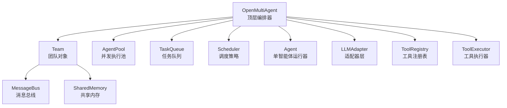
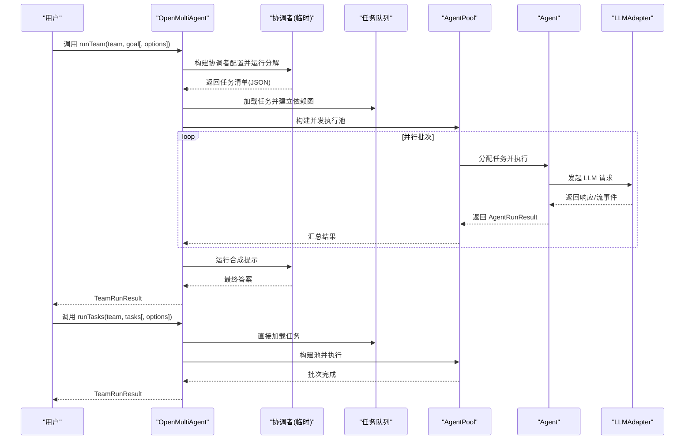
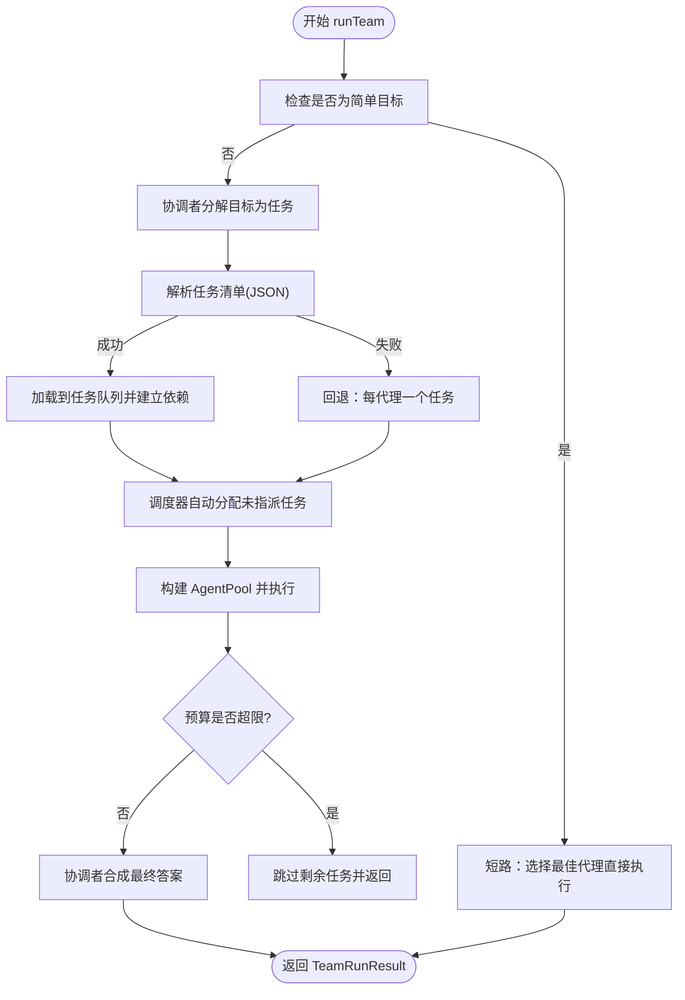

# API 参考

<cite>
**本文档引用的文件**
- [src/index.ts](file://src/index.ts)
- [src/orchestrator/orchestrator.ts](file://src/orchestrator/orchestrator.ts)
- [src/types.ts](file://src/types.ts)
- [src/team/team.ts](file://src/team/team.ts)
- [src/agent/agent.ts](file://src/agent/agent.ts)
- [package.json](file://package.json)
</cite>

## 目录
1. [简介](#简介)
2. [项目结构](#项目结构)
3. [核心组件](#核心组件)
4. [架构总览](#架构总览)
5. [详细组件分析](#详细组件分析)
6. [依赖分析](#依赖分析)
7. [性能考虑](#性能考虑)
8. [故障排查指南](#故障排查指南)
9. [结论](#结论)
10. [附录](#附录)

## 简介
本文件为 Open Multi-Agent 框架的完整 API 参考，聚焦于 OpenMultiAgent 主类及其公共接口，涵盖以下方法：
- createTeam()
- runTeam()
- runTasks()
- runAgent()
- getStatus()

同时，文档详细说明 AgentConfig 与 TeamConfig 的全部配置项、类型定义、接口规范、枚举值、方法间调用关系与使用模式，并提供与实际代码实现一致的版本兼容性信息与迁移建议。

## 项目结构
框架采用模块化分层设计，核心入口通过统一导出模块暴露公共 API；Orchestrator 作为顶层编排器协调 Team、AgentPool、TaskQueue、Scheduler 等子系统。

图表来源
- [src/orchestrator/orchestrator.ts:1-120](file://src/orchestrator/orchestrator.ts#L1-L120)
- [src/team/team.ts:1-120](file://src/team/team.ts#L1-L120)
- [src/agent/agent.ts:1-120](file://src/agent/agent.ts#L1-L120)

章节来源
- [src/index.ts:57-201](file://src/index.ts#L57-L201)
- [src/orchestrator/orchestrator.ts:1-120](file://src/orchestrator/orchestrator.ts#L1-L120)

## 核心组件
- OpenMultiAgent：顶层编排器，负责团队管理、自动编排（runTeam）、显式任务执行（runTasks）、单智能体便捷执行（runAgent）以及运行状态查询（getStatus）。
- Team：封装代理名单、消息总线、任务队列与可选共享内存，提供事件总线与任务管理能力。
- Agent：面向用户的高阶智能体包装，支持一次性对话（run）、持续对话（prompt）、流式输出（stream），并内置动态工具注册与生命周期状态跟踪。
- 类型系统：集中于 types.ts，定义内容块、LLM 协议、工具、代理、团队、任务、编排器、追踪等完整类型族。

章节来源
- [src/orchestrator/orchestrator.ts:900-1785](file://src/orchestrator/orchestrator.ts#L900-L1785)
- [src/team/team.ts:88-346](file://src/team/team.ts#L88-L346)
- [src/agent/agent.ts:94-670](file://src/agent/agent.ts#L94-L670)
- [src/types.ts:1-1106](file://src/types.ts#L1-L1106)

## 架构总览
下图展示 OpenMultiAgent 的关键方法与其内部协作关系，包括 runTeam 的“分解-执行-合成”三段式流程与 runTasks 的直接任务执行路径。

图表来源
- [src/orchestrator/orchestrator.ts:1061-1374](file://src/orchestrator/orchestrator.ts#L1061-L1374)
- [src/orchestrator/orchestrator.ts:1390-1454](file://src/orchestrator/orchestrator.ts#L1390-L1454)

## 详细组件分析

### OpenMultiAgent 主类 API

- 方法签名与行为概览
  - createTeam(name: string, config: TeamConfig): Team
    - 创建并注册团队，用于后续 runTeam/runTasks 使用。
    - 参数校验：重复名称抛出异常；TeamConfig 中可启用共享内存或自定义 MemoryStore。
  - runTeam(team: Team, goal: string, options?: RunTeamOptions): Promise<TeamRunResult>
    - 自动编排入口：协调者分解目标为任务，构建依赖图，调度执行，最终合成结果。
    - 支持计划仅模式（planOnly）、揭示协调者上下文（revealCoordinator）等选项。
  - runTasks(team: Team, tasks: TaskDescriptor[], options?: { abortSignal?: AbortSignal }): Promise<TeamRunResult>
    - 显式任务执行：直接加载任务列表，自动分配未指派任务，按依赖顺序执行。
  - runAgent(config: AgentConfig, prompt: string, options?: { abortSignal?: AbortSignal }): Promise<AgentRunResult>
    - 单智能体一次性执行：构建临时 Agent，运行单轮对话并返回结果。
  - getStatus(): { teams: number; activeAgents: number; completedTasks: number }
    - 轻量级运行状态快照：统计已注册团队数、累计成功任务数等。

- 参数与返回值要点
  - TeamConfig：包含团队名称、代理数组、共享内存开关或自定义存储、最大并发度等。
  - RunTeamOptions：可选覆盖协调者配置、是否仅生成计划、是否在工人提示中注入协调者上下文等。
  - TeamRunResult：包含整体成功标志、任务明细、各代理结果映射、总 token 消耗等。
  - AgentRunResult：包含成功标志、输出文本、消息历史、token 使用、工具调用记录、结构化输出等。

- 错误处理与取消
  - 支持 AbortSignal 在多处注入（runTeam、runTasks、runAgent、Agent.run/stream）。
  - Token 预算超限触发预算耗尽事件与相应标记。
  - onApproval/onPlanReady/onProgress/onTrace 等回调提供可观测性与控制点。

- 使用示例（参考）
  - 单智能体执行：参见 [examples/basics/single-agent.ts:31-36](file://examples/basics/single-agent.ts#L31-L36)。
  - 团队协作执行：参见 [examples/basics/team-collaboration.ts:127-127](file://examples/basics/team-collaboration.ts#L127-L127)。
  - 任务流水线执行：参见 [examples/basics/task-pipeline.ts:181-181](file://examples/basics/task-pipeline.ts#L181-L181)。

章节来源
- [src/orchestrator/orchestrator.ts:947-1474](file://src/orchestrator/orchestrator.ts#L947-L1474)
- [src/types.ts:609-730](file://src/types.ts#L609-L730)
- [src/types.ts:659-673](file://src/types.ts#L659-L673)
- [src/types.ts:815-875](file://src/types.ts#L815-L875)

#### runTeam 内部流程（算法）

图表来源
- [src/orchestrator/orchestrator.ts:1079-1374](file://src/orchestrator/orchestrator.ts#L1079-L1374)

### AgentConfig 与 TeamConfig 完整配置

- AgentConfig 关键字段
  - 基础：name、model、provider、apiKey、baseURL、region
  - 提示与推理：systemPrompt、thinking（含 enabled、budgetTokens、effort）
  - 工具：customTools、tools、disallowedTools、toolPreset、maxToolOutputChars
  - 上下文与节流：contextStrategy（滑动窗口/摘要/紧凑/自定义压缩）、compressToolResults、maxTurns、maxTokens、maxTokenBudget、timeoutMs
  - 推理采样：temperature、frequencyPenalty、presencePenalty、topP、topK、minP、parallelToolCalls、extraBody
  - 循环检测：loopDetection（maxRepetitions、loopDetectionWindow、onLoopDetected）
  - 结构化输出：outputSchema（Zod Schema，运行时验证最终 JSON）
  - 生命周期钩子：beforeRun、afterRun
  - 兼容性：adapter 可直接指定适配器实例以绕过默认工厂

- TeamConfig 关键字段
  - 基础：name、agents（AgentConfig 数组）
  - 共享内存：sharedMemory（布尔）或 sharedMemoryStore（MemoryStore 实例）
  - 并发：maxConcurrency

- 类型与枚举
  - ContextStrategy：支持滑动窗口、摘要、紧凑压缩与自定义压缩函数
  - TaskStatus：pending、in_progress、completed、failed、blocked、skipped
  - TraceEventType：llm_call、tool_call、task、agent、plan_ready、agent_stream
  - SupportedProvider：由 LLM 适配器层定义（通过类型导出）

章节来源
- [src/types.ts:367-531](file://src/types.ts#L367-L531)
- [src/types.ts:608-623](file://src/types.ts#L608-L623)
- [src/types.ts:124-152](file://src/types.ts#L124-L152)
- [src/types.ts:679-729](file://src/types.ts#L679-L729)
- [src/types.ts:882-968](file://src/types.ts#L882-L968)

### 类型与接口规范

- 内容块与消息
  - ContentBlock：TextBlock、ReasoningBlock、ToolUseBlock、ToolResultBlock、ImageBlock
  - LLMMessage：角色与内容块数组
  - LLMResponse：响应 ID、内容块、模型名、停止原因、token 使用

- 工具系统
  - ToolDefinition：name/description/inputSchema/outputSchema(llmInputSchema)、execute
  - ToolResult：data、isError、metadata(tokenUsage)
  - ToolUseContext：agent、team、abortSignal/abortController、cwd、metadata

- 代理运行结果
  - AgentRunResult：success、output、messages、tokenUsage、toolCalls、structured、loopDetected、budgetExceeded

- 团队与任务
  - TeamRunResult：success、goal、tasks、agentResults(Map)、totalTokenUsage
  - Task：id/title/description/status/assignee/dependsOn/memoryScope/result/时间戳与重试配置

- 编排器事件与追踪
  - OrchestratorEvent：agent_start/agent_complete/task_start/task_complete/task_retry/budget_exceeded/message/error
  - TraceEvent：LLMCallTrace、ToolCallTrace、TaskTrace、AgentTrace、PlanReadyTrace、AgentStreamTrace

章节来源
- [src/types.ts:15-110](file://src/types.ts#L15-L110)
- [src/types.ts:160-167](file://src/types.ts#L160-L167)
- [src/types.ts:184-187](file://src/types.ts#L184-L187)
- [src/types.ts:286-328](file://src/types.ts#L286-L328)
- [src/types.ts:585-602](file://src/types.ts#L585-L602)
- [src/types.ts:659-673](file://src/types.ts#L659-L673)
- [src/types.ts:704-729](file://src/types.ts#L704-L729)
- [src/types.ts:741-755](file://src/types.ts#L741-L755)
- [src/types.ts:907-968](file://src/types.ts#L907-L968)

### 方法间调用关系与使用模式

- createTeam() 与 Team 对象
  - 注册团队后，Team 提供 getAgents()/getAgent()、sendMessage()/broadcast()、addTask()/updateTask()/getNextTask()、getSharedMemory() 等能力。
  - Team 内部桥接 TaskQueue 事件到 Team 级事件总线，便于外部订阅。

- runTeam() 与 runTasks() 的差异
  - runTeam()：自动分解、依赖解析、调度、并发执行、合成；适合高层目标驱动的编排。
  - runTasks()：直接执行给定任务列表，适合已有明确任务规划的场景。

- runAgent() 与 Agent 的关系
  - runAgent() 是对单次 Agent.run() 的便捷封装，支持追踪与取消信号注入。

- 并发与预算
  - AgentPool 控制并发度；全局 OrchestratorConfig.maxTokenBudget 与单 AgentConfig.maxTokenBudget 可叠加生效。
  - 执行过程中通过 onProgress/onTrace/onApproval/onPlanReady 提供可观测性与控制。

章节来源
- [src/team/team.ts:88-346](file://src/team/team.ts#L88-L346)
- [src/orchestrator/orchestrator.ts:947-1474](file://src/orchestrator/orchestrator.ts#L947-L1474)
- [src/agent/agent.ts:205-251](file://src/agent/agent.ts#L205-L251)

## 依赖分析
- 外部依赖
  - @anthropic-ai/sdk、openai、zod：核心 LLM 适配与数据校验
  - 可选 peerDependencies：@aws-sdk/client-bedrock-runtime、@google/genai、@modelcontextprotocol/sdk、ai
- Node.js 版本要求：>= 18.0.0
- 包导出：主入口 dist/index.js，CLI 二进制 oma

章节来源
- [package.json:69-107](file://package.json#L69-L107)

## 性能考虑
- 并发与吞吐
  - 通过 OrchestratorConfig.maxConcurrency 与 AgentPool 控制并发；合理设置避免模型侧限流与内存压力。
- 上下文与成本
  - 合理使用 contextStrategy（滑动窗口/摘要/紧凑）与 compressToolResults，降低 token 消耗。
- 重试与稳定性
  - 任务级重试（maxRetries/retryDelayMs/retryBackoff）提升鲁棒性；结合 onApproval 实现人工审批门控。
- 预算控制
  - 合理设置 maxTokenBudget 与单轮 maxTokens，防止意外超额；利用 budgetExceeded 标记进行降级处理。

## 故障排查指南
- 常见问题与定位
  - 重复团队名：createTeam 抛出异常，需更换唯一名称或调用 shutdown 清理。
  - 任务无分配代理：executeQueue 将失败并上报错误事件；检查调度与任务描述。
  - 预算超限：onProgress 触发 budget_exceeded 事件；检查 OrchestratorConfig.maxTokenBudget 与单 AgentConfig.maxTokenBudget 设置。
  - 循环检测：loopDetection 触发 warn/terminate 或自定义回调；调整系统提示或工具调用策略。
- 观测与调试
  - 使用 onProgress/onTrace/onAgentStream 获取运行时事件与追踪数据，辅助定位瓶颈与异常。
  - 使用 Team.on(...) 订阅任务/消息事件，观察队列状态变化。

章节来源
- [src/orchestrator/orchestrator.ts:561-818](file://src/orchestrator/orchestrator.ts#L561-L818)
- [src/team/team.ts:316-344](file://src/team/team.ts#L316-L344)

## 结论
OpenMultiAgent 提供从单智能体到多智能体团队的全栈编排能力，通过清晰的类型系统与丰富的配置项，兼顾易用性与可控性。推荐在生产环境中结合预算控制、可观测性与审批门控，确保稳定与高效。

## 附录

### 版本兼容性与迁移指南
- 版本：当前发布版本为 1.4.1
- Node.js：要求 >= 18.0.0
- 迁移建议
  - 从旧版升级：关注 OrchestratorEvent 新增的 task_skipped 字段，补充对应处理逻辑。
  - 配置迁移：将原全局默认值迁移到 OrchestratorConfig.defaultXxx 与 AgentConfig.xxxx 的组合使用。
  - 工具与适配器：如需自定义 LLMAdapter，请遵循 LLMAdapter 接口规范，确保 capabilities.echoesReasoning 正确声明。

章节来源
- [package.json:1-108](file://package.json#L1-L108)
- [src/types.ts:741-755](file://src/types.ts#L741-L755)