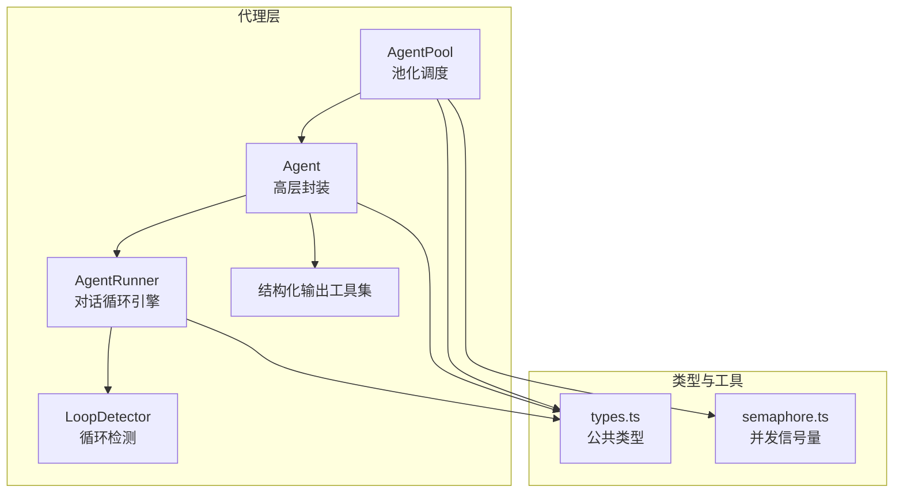
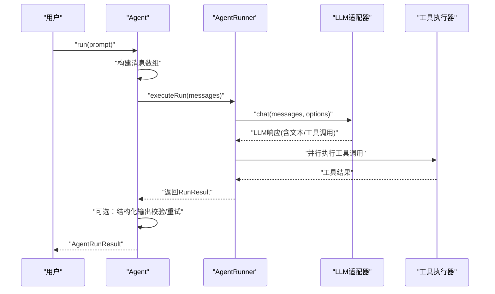
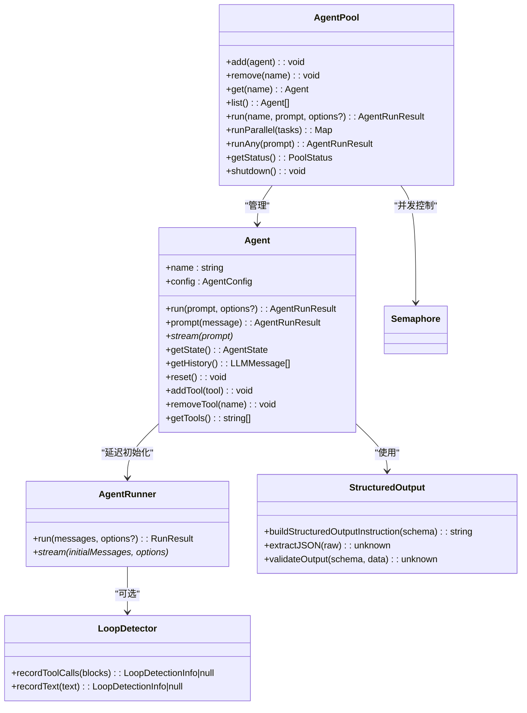

# 代理 API

<cite>
**本文引用的文件**
- [agent.ts](file://src/agent/agent.ts)
- [runner.ts](file://src/agent/runner.ts)
- [pool.ts](file://src/agent/pool.ts)
- [loop-detector.ts](file://src/agent/loop-detector.ts)
- [structured-output.ts](file://src/agent/structured-output.ts)
- [types.ts](file://src/types.ts)
- [semaphore.ts](file://src/utils/semaphore.ts)
- [01-single-agent.ts](file://examples/01-single-agent.ts)
- [09-structured-output.ts](file://examples/09-structured-output.ts)
- [10-task-retry.ts](file://examples/10-task-retry.ts)
- [agent-pool.test.ts](file://tests/agent-pool.test.ts)
- [structured-output.test.ts](file://tests/structured-output.test.ts)
- [loop-detection.test.ts](file://tests/loop-detection.test.ts)
</cite>

## 目录
1. [简介](#简介)
2. [项目结构](#项目结构)
3. [核心组件](#核心组件)
4. [架构总览](#架构总览)
5. [详细组件分析](#详细组件分析)
6. [依赖关系分析](#依赖关系分析)
7. [性能考量](#性能考量)
8. [故障排查指南](#故障排查指南)
9. [结论](#结论)
10. [附录：使用示例与最佳实践](#附录使用示例与最佳实践)

## 简介
本文件为 Agent 类及代理系统提供完整的 API 文档，涵盖：
- Agent 类的构造与运行接口（run、prompt、stream、reset、getState、getHistory、addTool、removeTool、getTools）
- AgentConfig 配置项详解（name、model、provider、baseURL、apiKey、systemPrompt、tools、maxTurns、maxTokens、temperature、timeoutMs、loopDetection、outputSchema、beforeRun、afterRun）
- AgentRunResult 返回类型结构与语义
- AgentPool 并发与资源管理能力
- LoopDetector 循环检测机制与 LoopDetectionConfig 配置
- 结构化输出工具函数（buildStructuredOutputInstruction、extractJSON、validateOutput）及其在 Agent 中的集成
- 使用示例与最佳实践

## 项目结构
代理系统位于 src/agent 目录，核心模块包括：
- agent.ts：高层 Agent 类封装，负责对话历史、生命周期状态、工具注册与结构化输出验证
- runner.ts：AgentRunner 核心对话循环引擎，处理 LLM 调用、工具执行、流式事件与循环检测
- pool.ts：AgentPool 池化调度器，支持并发限制、轮询派发与健康状态统计
- loop-detector.ts：滑动窗口循环检测器，识别工具调用与文本重复
- structured-output.ts：结构化输出工具集，包含系统提示注入、JSON 提取与 Zod 校验
- types.ts：公共类型定义，包括 AgentConfig、AgentRunResult、LoopDetectionConfig、StreamEvent 等
- utils/semaphore.ts：轻量计数信号量，用于并发控制



图表来源
- [agent.ts:1-623](file://src/agent/agent.ts#L1-L623)
- [runner.ts:1-543](file://src/agent/runner.ts#L1-L543)
- [pool.ts:1-286](file://src/agent/pool.ts#L1-L286)
- [loop-detector.ts:1-138](file://src/agent/loop-detector.ts#L1-L138)
- [structured-output.ts:1-127](file://src/agent/structured-output.ts#L1-L127)
- [types.ts:1-543](file://src/types.ts#L1-L543)
- [semaphore.ts:1-90](file://src/utils/semaphore.ts#L1-L90)

章节来源
- [agent.ts:1-623](file://src/agent/agent.ts#L1-L623)
- [runner.ts:1-543](file://src/agent/runner.ts#L1-L543)
- [pool.ts:1-286](file://src/agent/pool.ts#L1-L286)
- [loop-detector.ts:1-138](file://src/agent/loop-detector.ts#L1-L138)
- [structured-output.ts:1-127](file://src/agent/structured-output.ts#L1-L127)
- [types.ts:1-543](file://src/types.ts#L1-L543)
- [semaphore.ts:1-90](file://src/utils/semaphore.ts#L1-L90)

## 核心组件
- Agent：面向用户的高层代理类，封装对话历史、状态管理、工具动态注册、结构化输出验证与生命周期追踪
- AgentRunner：底层对话循环引擎，负责与 LLM 适配器交互、工具调用执行、流式事件产出与循环检测
- AgentPool：代理池，提供并发控制、任务派发（run、runParallel、runAny）、健康状态统计与优雅关闭
- LoopDetector：循环检测器，基于滑动窗口识别工具调用签名或文本重复
- 结构化输出工具集：构建系统提示、提取 JSON、Zod 校验，并在 Agent 中自动重试一次

章节来源
- [agent.ts:81-623](file://src/agent/agent.ts#L81-L623)
- [runner.ts:166-543](file://src/agent/runner.ts#L166-L543)
- [pool.ts:58-286](file://src/agent/pool.ts#L58-L286)
- [loop-detector.ts:33-138](file://src/agent/loop-detector.ts#L33-L138)
- [structured-output.ts:21-127](file://src/agent/structured-output.ts#L21-L127)

## 架构总览
Agent 通过延迟初始化 AgentRunner，结合工具注册表与执行器，实现“一次性配置、多轮对话”的能力。Runner 负责与 LLM 适配器通信，按回合处理工具调用与结果回传；LoopDetector 在需要时参与循环检测；结构化输出在 Agent 层自动注入系统提示并在失败时进行一次重试。



图表来源
- [agent.ts:177-372](file://src/agent/agent.ts#L177-L372)
- [runner.ts:191-211](file://src/agent/runner.ts#L191-L211)
- [runner.ts:223-522](file://src/agent/runner.ts#L223-L522)

章节来源
- [agent.ts:177-372](file://src/agent/agent.ts#L177-L372)
- [runner.ts:191-522](file://src/agent/runner.ts#L191-L522)

## 详细组件分析

### Agent 类 API
- 构造函数
  - 参数：config（AgentConfig）、toolRegistry（ToolRegistry）、toolExecutor（ToolExecutor）
  - 行为：保存配置与注入的注册表/执行器；初始化空的历史消息与状态
- 运行接口
  - run(prompt, runOptions?)：一次性对话，不修改持久历史
  - prompt(message)：多轮对话，追加用户消息到历史并更新
  - stream(prompt)：一次性对话流式输出，返回异步迭代器
- 状态与历史
  - getState()：返回当前状态快照（浅拷贝）
  - getHistory()：返回持久历史副本
  - reset()：清空历史并重置状态为 idle
- 工具管理
  - addTool(tool)：动态注册工具
  - removeTool(name)：注销工具
  - getTools()：列出已注册工具名
- 生命周期与钩子
  - beforeRun 钩子：在每次 run/prompt 前接收上下文，可修改 prompt 后应用
  - afterRun 钩子：在成功完成后接收结果，可修改后返回
- 结构化输出
  - 当配置了 outputSchema：自动注入系统提示、解析 JSON、校验并通过后将结构化数据放入 result.structured；失败时尝试一次重试
- 流式事件与追踪
  - 支持 onMessage/onTrace 回调，emitAgentTrace 输出 agent 类型追踪事件

章节来源
- [agent.ts:99-114](file://src/agent/agent.ts#L99-L114)
- [agent.ts:177-224](file://src/agent/agent.ts#L177-L224)
- [agent.ts:231-251](file://src/agent/agent.ts#L231-L251)
- [agent.ts:262-277](file://src/agent/agent.ts#L262-L277)
- [agent.ts:297-372](file://src/agent/agent.ts#L297-L372)
- [agent.ts:332-477](file://src/agent/agent.ts#L332-L477)
- [agent.ts:375-394](file://src/agent/agent.ts#L375-L394)

### AgentConfig 配置类型
- 必填字段
  - name: 字符串，代理名称
  - model: 字符串，模型标识
- 可选字段
  - provider: 提供商枚举（anthropic/copilot/grok/openai/gemini），默认 anthropic
  - baseURL: 自定义 OpenAI 兼容服务地址（如 Ollama/vLLM/LM Studio）
  - apiKey: API 密钥覆盖，若为空则使用提供商标准环境变量
  - systemPrompt: 系统提示
  - tools: 工具名数组，限定允许使用的工具
  - maxTurns/maxTokens/temperature: 控制对话轮次、输出长度与采样温度
  - timeoutMs: 整体运行超时（毫秒），内部以 AbortSignal.timeout 实现
  - loopDetection: LoopDetectionConfig，启用循环检测
  - outputSchema: ZodSchema，开启结构化输出与自动校验
  - beforeRun/afterRun: 钩子函数，分别在 run 前后执行
- 作用范围
  - 作为 Agent 的静态配置，影响 AgentRunner 初始化与行为

章节来源
- [types.ts:194-241](file://src/types.ts#L194-L241)

### AgentRunResult 返回类型
- 字段
  - success: 布尔，是否成功
  - output: 字符串，最终文本输出
  - messages: LLMMessage[]，本次运行产生的消息序列
  - tokenUsage: TokenUsage，累计令牌用量
  - toolCalls: ToolCallRecord[]，按执行顺序记录的工具调用
  - structured?: 未设置或校验失败时为 undefined，否则为结构化数据
  - loopDetected?: 当因循环检测被终止或警告时存在
- 语义
  - 若配置了 outputSchema 且首次校验失败，Agent 会尝试一次重试；两次均失败时 success=false，structured 为 undefined

章节来源
- [types.ts:296-310](file://src/types.ts#L296-L310)

### AgentPool 类与并发控制
- 并发控制
  - 内部使用 Semaphore 控制最大并发数，默认 5
  - run/runParallel/runAny 均通过 acquire/release 保证并发上限
- 注册与查询
  - add/remove/get/list：注册与查询代理实例
- 执行 API
  - run(agentName, prompt, runOptions?)：按名称运行单个代理
  - runParallel(tasks)：并发运行多个任务，返回 Map<agentName, AgentRunResult>
  - runAny(prompt)：轮询选择可用代理运行
- 观测与生命周期
  - getStatus()：统计各状态数量
  - shutdown()：重置池内所有代理的历史与状态
- 错误处理
  - 未知代理名抛出错误
  - runParallel 中单个任务失败以错误 AgentRunResult 形式返回，便于上层聚合处理

章节来源
- [pool.ts:58-286](file://src/agent/pool.ts#L58-L286)
- [semaphore.ts:24-90](file://src/utils/semaphore.ts#L24-L90)

### LoopDetector 循环检测机制与配置
- 滑动窗口策略
  - 记录工具调用签名（排序后的 name+input 键值对）与文本输出（空白归一化）
  - 窗口大小至少等于最大重复阈值，避免无法触发
- 检测触发
  - 连续重复次数达到阈值时返回 LoopDetectionInfo，包含 kind（tool_repetition/text_repetition）、repetitions、detail
- 处理动作
  - onLoopDetected 支持 'warn'/'terminate'/自定义回调
  - 'warn'：注入警告文本块到工具结果消息中，第二次检测强制终止
  - 'terminate'：立即终止
  - 自定义回调：返回 'continue'/'inject'/'terminate'
- Runner 集成
  - Runner 在每回合结束后检查检测结果，必要时注入警告并根据策略决定是否继续

章节来源
- [loop-detector.ts:33-138](file://src/agent/loop-detector.ts#L33-L138)
- [runner.ts:257-366](file://src/agent/runner.ts#L257-L366)
- [types.ts:248-276](file://src/types.ts#L248-L276)

### 结构化输出工具集
- buildStructuredOutputInstruction(schema)
  - 将 ZodSchema 转换为 JSON Schema 并生成系统提示指令，要求模型仅输出符合该模式的有效 JSON
- extractJSON(raw)
  - 从原始文本中提取 JSON，支持直接 JSON、带 ```json 标记的围栏、裸围栏以及嵌入式对象/数组
  - 失败抛出错误
- validateOutput(schema, data)
  - 使用 Zod.safeParse 对数据进行校验，返回转换后的数据或抛出人类可读的错误信息
- Agent 集成
  - Agent 在配置 outputSchema 时，自动注入系统提示；首次校验失败后重试一次，合并 tokenUsage 与消息序列

章节来源
- [structured-output.ts:21-127](file://src/agent/structured-output.ts#L21-L127)
- [agent.ts:136-141](file://src/agent/agent.ts#L136-L141)
- [agent.ts:400-477](file://src/agent/agent.ts#L400-L477)

## 依赖关系分析



图表来源
- [agent.ts:81-623](file://src/agent/agent.ts#L81-L623)
- [runner.ts:166-543](file://src/agent/runner.ts#L166-L543)
- [pool.ts:58-286](file://src/agent/pool.ts#L58-L286)
- [loop-detector.ts:33-138](file://src/agent/loop-detector.ts#L33-L138)
- [structured-output.ts:21-127](file://src/agent/structured-output.ts#L21-L127)
- [semaphore.ts:24-90](file://src/utils/semaphore.ts#L24-L90)

章节来源
- [agent.ts:81-623](file://src/agent/agent.ts#L81-L623)
- [runner.ts:166-543](file://src/agent/runner.ts#L166-L543)
- [pool.ts:58-286](file://src/agent/pool.ts#L58-L286)
- [loop-detector.ts:33-138](file://src/agent/loop-detector.ts#L33-L138)
- [structured-output.ts:21-127](file://src/agent/structured-output.ts#L21-L127)
- [semaphore.ts:24-90](file://src/utils/semaphore.ts#L24-L90)

## 性能考量
- 并发控制
  - AgentPool 默认并发上限为 5；可通过构造参数调整
  - Semaphore 采用队列 FIFO，避免饥饿；active/pending 可观测当前负载
- 流式输出
  - Runner stream 提供增量事件，适合实时渲染；注意 onMessage/onToolCall/onToolResult 的开销
- 循环检测
  - 滑动窗口大小与阈值影响检测灵敏度；合理设置可减少无效轮次
- 结构化输出
  - 首次失败的重试会增加 tokenUsage；建议在 outputSchema 中明确约束，提高成功率

[本节为通用指导，无需特定文件来源]

## 故障排查指南
- AgentPool
  - 重复添加同名代理会抛错；移除不存在代理会抛错
  - runAny 在空池上调用会抛错
  - runParallel 中单个任务失败会被包装为错误 AgentRunResult，便于聚合处理
- 循环检测
  - 未配置 loopDetection 时不触发；配置不当（window 过小）可能无法触发
  - 'warn' 模式下，第二次检测会强制终止；自定义回调需正确返回 'terminate'/'continue'/'inject'
- 结构化输出
  - extractJSON 失败会抛错；validateOutput 抛出包含路径与原因的错误信息
  - Agent 在首次校验失败后会尝试一次重试，若仍失败 success=false，structured 为 undefined
- 超时与取消
  - AgentConfig.timeoutMs 与 runOptions.abortSignal 会合并为有效信号；超时或取消会导致提前终止

章节来源
- [pool.ts:82-101](file://src/agent/pool.ts#L82-L101)
- [pool.ts:194-196](file://src/agent/pool.ts#L194-L196)
- [pool.ts:171-177](file://src/agent/pool.ts#L171-L177)
- [runner.ts:340-366](file://src/agent/runner.ts#L340-L366)
- [structured-output.ts:102-105](file://src/agent/structured-output.ts#L102-L105)
- [agent.ts:415-417](file://src/agent/agent.ts#L415-L417)

## 结论
本代理系统通过 Agent/Runner 分层设计，结合结构化输出与循环检测，提供了稳定、可观测且易于扩展的多代理协作框架。AgentPool 与 Semaphore 提供可靠的并发控制，适用于本地与云端模型的混合场景。建议在生产环境中：
- 明确配置 outputSchema 以获得强类型输出
- 合理设置 loopDetection 与 maxTurns，避免无限轮次
- 使用 AgentPool 控制并发，结合监控指标优化吞吐

[本节为总结性内容，无需特定文件来源]

## 附录：使用示例与最佳实践

### 示例一：单代理运行与流式输出
- 场景：使用 OpenMultiAgent.runAgent() 与 Agent.stream() 进行一次性任务与增量输出
- 关键点：stream 事件类型包含 text/tool_use/tool_result/done/error；done 事件携带 RunResult

章节来源
- [01-single-agent.ts:34-103](file://examples/01-single-agent.ts#L34-L103)

### 示例二：结构化输出
- 场景：通过 AgentConfig.outputSchema 定义期望输出结构，Agent 自动注入系统提示并进行校验与重试
- 关键点：result.structured 为校验后的数据；失败时 success=false，structured 为 undefined

章节来源
- [09-structured-output.ts:38-73](file://examples/09-structured-output.ts#L38-L73)
- [structured-output.test.ts:204-246](file://tests/structured-output.test.ts#L204-L246)

### 示例三：任务重试与进度观察
- 场景：通过 Orchestrator 的 onProgress 监听 task_retry 事件，实现可观察的重试流程
- 关键点：maxRetries/retryDelayMs/retryBackoff 控制重试策略

章节来源
- [10-task-retry.ts:47-67](file://examples/10-task-retry.ts#L47-L67)
- [10-task-retry.ts:88-105](file://examples/10-task-retry.ts#L88-L105)

### 最佳实践
- 配置与调试
  - 使用 beforeRun/afterRun 钩子进行上下文注入与结果后处理
  - 设置合理的 maxTurns 与 maxTokens，避免长尾请求
  - 在本地模型场景设置 timeoutMs，防止推理卡顿
- 并发与资源
  - 使用 AgentPool 控制并发；根据硬件与模型特性调整最大并发数
  - 监控 PoolStatus 与 Semaphore.active/pending，及时扩容或限流
- 输出质量
  - 明确 outputSchema，细化字段描述，提升校验准确性
  - 在复杂场景下启用 loopDetection，避免重复工具调用或文本重复
- 可观测性
  - 使用 onTrace 输出 LLM 调用与工具调用追踪事件
  - 在 Runner 的 onWarning 中记录循环检测告警，辅助定位问题

[本节为通用指导，无需特定文件来源]