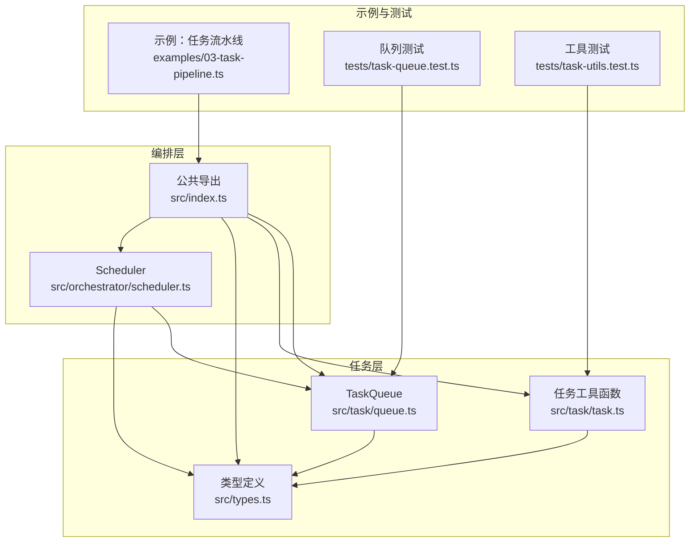
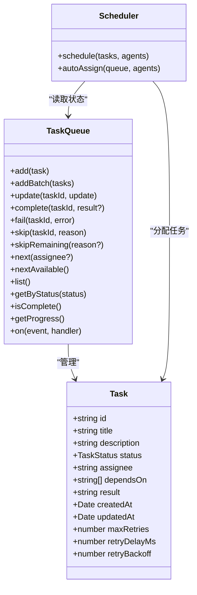
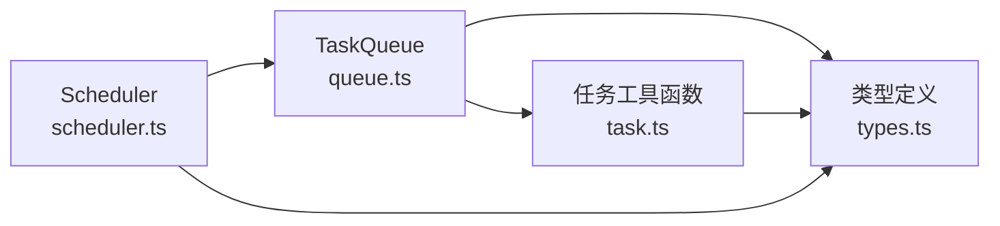
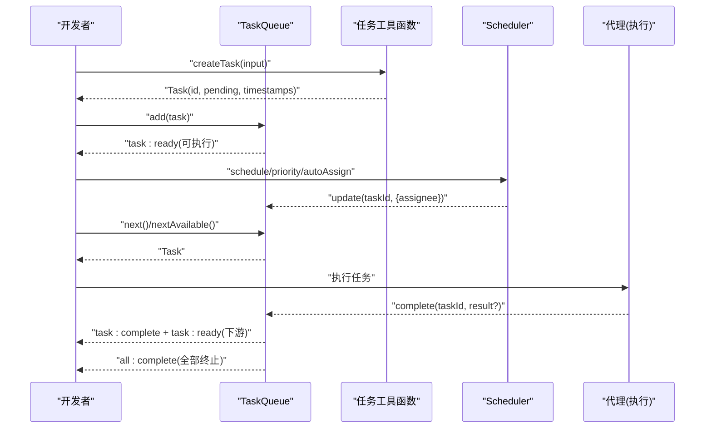

# 任务 API

<cite>
**本文引用的文件**
- [src/task/queue.ts](file://src/task/queue.ts)
- [src/task/task.ts](file://src/task/task.ts)
- [src/types.ts](file://src/types.ts)
- [src/orchestrator/scheduler.ts](file://src/orchestrator/scheduler.ts)
- [src/index.ts](file://src/index.ts)
- [examples/03-task-pipeline.ts](file://examples/03-task-pipeline.ts)
- [tests/task-queue.test.ts](file://tests/task-queue.test.ts)
- [tests/task-utils.test.ts](file://tests/task-utils.test.ts)
</cite>

## 目录
1. [简介](#简介)
2. [项目结构](#项目结构)
3. [核心组件](#核心组件)
4. [架构总览](#架构总览)
5. [详细组件分析](#详细组件分析)
6. [依赖分析](#依赖分析)
7. [性能考虑](#性能考虑)
8. [故障排查指南](#故障排查指南)
9. [结论](#结论)
10. [附录：完整示例与最佳实践](#附录完整示例与最佳实践)

## 简介
本文件为任务管理系统（Task Management）的完整 API 文档，聚焦以下目标：
- 详尽记录 TaskQueue 类的所有方法与事件，包括 enqueue（通过 add）、dequeue（通过 next/nextAvailable）、complete、fail、skip、skipRemaining、getStatus（通过 getProgress）、进度查询等。
- 说明 Task 类型定义的所有属性，包括 id、title、description、status、assignee、dependsOn、result、createdAt、updatedAt、maxRetries、retryDelayMs、retryBackoff 等。
- 记录 createTask 工厂函数的使用方式与参数要求。
- 详细说明任务依赖关系的管理机制，包括 isTaskReady、getTaskDependencyOrder、validateTaskDependencies 等辅助函数。
- 记录 TaskQueueEvent 事件类型与任务状态变更的监听机制。
- 提供任务队列的性能优化建议与并发控制策略。
- 包含完整的任务创建、调度、执行与完成的示例路径与流程图。

## 项目结构
任务系统由以下模块组成：
- 类型定义：在 types.ts 中定义 Task、TaskStatus、OrchestratorEvent 等核心类型。
- 工具函数：在 task.ts 中提供 createTask、isTaskReady、getTaskDependencyOrder、validateTaskDependencies 等纯函数工具。
- 队列类：在 queue.ts 中实现 TaskQueue，负责任务生命周期、依赖解析、事件分发与批量操作。
- 调度器：在 scheduler.ts 中提供多种调度策略，用于将待执行任务分配给可用代理。
- 公共导出：在 index.ts 中统一导出任务相关 API，便于外部消费。
- 示例与测试：examples/03-task-pipeline.ts 展示端到端流水线；tests 下的单元测试覆盖关键行为。

图表来源
- [src/task/queue.ts:1-465](file://src/task/queue.ts#L1-L465)
- [src/task/task.ts:1-240](file://src/task/task.ts#L1-L240)
- [src/types.ts:336-358](file://src/types.ts#L336-L358)
- [src/orchestrator/scheduler.ts:1-353](file://src/orchestrator/scheduler.ts#L1-L353)
- [src/index.ts:83-85](file://src/index.ts#L83-L85)
- [examples/03-task-pipeline.ts:1-202](file://examples/03-task-pipeline.ts#L1-L202)
- [tests/task-queue.test.ts:1-245](file://tests/task-queue.test.ts#L1-L245)
- [tests/task-utils.test.ts:1-156](file://tests/task-utils.test.ts#L1-L156)

章节来源
- [src/index.ts:83-85](file://src/index.ts#L83-L85)
- [src/types.ts:336-358](file://src/types.ts#L336-L358)

## 核心组件
- TaskQueue：事件驱动的任务队列，支持添加任务、更新状态、完成/失败/跳过、级联传播、查询下一个可执行任务、统计进度、事件订阅与取消订阅。
- 任务工具函数：createTask 工厂函数；isTaskReady 判断任务是否可执行；getTaskDependencyOrder 获取拓扑排序；validateTaskDependencies 校验依赖图合法性。
- 类型定义：Task、TaskStatus、TaskQueueEvent 等。

章节来源
- [src/task/queue.ts:55-465](file://src/task/queue.ts#L55-L465)
- [src/task/task.ts:16-53](file://src/task/task.ts#L16-L53)
- [src/task/task.ts:76-92](file://src/task/task.ts#L76-L92)
- [src/task/task.ts:115-160](file://src/task/task.ts#L115-L160)
- [src/task/task.ts:184-239](file://src/task/task.ts#L184-L239)
- [src/types.ts:336-358](file://src/types.ts#L336-L358)

## 架构总览
任务系统围绕 TaskQueue 展开，配合任务工具函数进行依赖解析与校验，并通过 Scheduler 将待执行任务分配给可用代理。外部通过公共导出入口访问 API。

图表来源
- [src/types.ts:340-358](file://src/types.ts#L340-L358)
- [src/task/queue.ts:55-465](file://src/task/queue.ts#L55-L465)
- [src/orchestrator/scheduler.ts:127-353](file://src/orchestrator/scheduler.ts#L127-L353)

## 详细组件分析

### TaskQueue 类 API 详解
- 添加任务
  - add(task)：根据当前队列状态决定初始状态（pending 或 blocked），若为 pending 则触发 task:ready 事件。
  - addBatch(tasks)：批量添加，内部逐个调用 add。
- 更新与完成
  - update(taskId, update)：仅允许更新 status、result、assignee 字段，返回新任务对象。
  - complete(taskId, result?)：标记为 completed 并记录结果，触发 task:complete；随后扫描所有被阻塞任务，对满足条件者提升为 pending 并触发 task:ready；若全部终止则触发 all:complete。
  - fail(taskId, error)：标记为 failed 并记录错误，触发 task:failed；对所有下游（直接或传递）依赖该任务的任务进行级联失败处理，最后检查是否全部终止。
  - skip(taskId, reason)：标记为 skipped 并记录原因，触发 task:skipped；对所有下游（直接或传递）依赖该任务的任务进行级联跳过处理，最后检查是否全部终止。
  - skipRemaining(reason?)：将未终止任务全部标记为 skipped（需确保无活动任务）。
- 查询与统计
  - next(assignee?)：返回指定代理的下一个 pending 任务；未指定时等价于 nextAvailable。
  - nextAvailable()：优先返回未分配的 pending 任务，否则返回任意 pending 任务。
  - list()：返回当前队列快照。
  - getByStatus(status)：按状态筛选。
  - isComplete()：当所有任务均处于终端态（completed、failed、skipped）或队列为空时返回 true。
  - getProgress()：返回 total/completed/failed/skipped/inProgress/pending/blocked 的计数快照。
- 事件系统
  - on(event, handler)：订阅事件，返回取消订阅函数。支持的事件类型见下节。
  - 内部事件：emit('task:ready'|'task:complete'|'task:failed'|'task:skipped', task)、emitAllComplete()。

章节来源
- [src/task/queue.ts:74-94](file://src/task/queue.ts#L74-L94)
- [src/task/queue.ts:108-120](file://src/task/queue.ts#L108-L120)
- [src/task/queue.ts:131-139](file://src/task/queue.ts#L131-L139)
- [src/task/queue.ts:150-158](file://src/task/queue.ts#L150-L158)
- [src/task/queue.ts:170-178](file://src/task/queue.ts#L170-L178)
- [src/task/queue.ts:191-203](file://src/task/queue.ts#L191-L203)
- [src/task/queue.ts:255-280](file://src/task/queue.ts#L255-L280)
- [src/task/queue.ts:283-290](file://src/task/queue.ts#L283-L290)
- [src/task/queue.ts:296-301](file://src/task/queue.ts#L296-L301)
- [src/task/queue.ts:312-360](file://src/task/queue.ts#L312-L360)
- [src/task/queue.ts:378-392](file://src/task/queue.ts#L378-L392)
- [src/task/queue.ts:419-441](file://src/task/queue.ts#L419-L441)
- [src/task/queue.ts:443-457](file://src/task/queue.ts#L443-L457)

### 任务工具函数
- createTask(input)
  - 参数：title、description、assignee（可选）、dependsOn（可选）、maxRetries（可选）、retryDelayMs（可选）、retryBackoff（可选）。
  - 行为：生成 UUID 作为 id，初始化 status 为 pending，createdAt/updatedAt 为当前时间，复制 dependsOn 数组避免共享引用。
- isTaskReady(task, allTasks, taskById?)
  - 条件：task.status 必须为 pending；且所有 dependsOn 指向的任务状态均为 completed；缺失依赖视为不可达。
  - 优化：支持传入预构建的 id→task 映射以降低复杂度。
- getTaskDependencyOrder(tasks)
  - 使用 Kahn 算法返回拓扑序；存在环时返回部分结果；建议在生产路径中先用 validateTaskDependencies 校验。
- validateTaskDependencies(tasks)
  - 校验：未知依赖、自依赖、环依赖；返回 valid 与错误列表。

章节来源
- [src/task/task.ts:29-53](file://src/task/task.ts#L29-L53)
- [src/task/task.ts:76-92](file://src/task/task.ts#L76-L92)
- [src/task/task.ts:115-160](file://src/task/task.ts#L115-L160)
- [src/task/task.ts:184-239](file://src/task/task.ts#L184-L239)

### 类型定义
- TaskStatus：'pending' | 'in_progress' | 'completed' | 'failed' | 'blocked' | 'skipped'
- Task：包含 id、title、description、status、assignee、dependsOn、result、createdAt、updatedAt、maxRetries、retryDelayMs、retryBackoff 等字段。

章节来源
- [src/types.ts:336-337](file://src/types.ts#L336-L337)
- [src/types.ts:340-358](file://src/types.ts#L340-L358)

### 事件类型与监听机制
- TaskQueueEvent：'task:ready' | 'task:complete' | 'task:failed' | 'task:skipped' | 'all:complete'
- 订阅方式：queue.on('task:ready', handler) 返回取消订阅函数；支持同时订阅多个事件。
- 触发时机：add/addBatch 完成后可能触发 task:ready；complete/fail/skip 后分别触发对应事件；级联传播会重复触发；当所有任务进入终端态时触发 all:complete。

章节来源
- [src/task/queue.ts:17-22](file://src/task/queue.ts#L17-L22)
- [src/task/queue.ts:378-392](file://src/task/queue.ts#L378-L392)

### 调度策略（与队列协作）
- Scheduler 提供四种策略：round-robin、least-busy、capability-match、dependency-first。
- autoAssign(queue, agents)：根据策略自动为未分配的 pending 任务设置 assignee。
- 与 TaskQueue 协作：仅对 pending 且未分配的任务进行赋值；若任务状态变化则忽略。

章节来源
- [src/orchestrator/scheduler.ts:127-198](file://src/orchestrator/scheduler.ts#L127-L198)

## 依赖分析
- TaskQueue 依赖：
  - types.ts 中的 Task、TaskStatus。
  - task.ts 中的 isTaskReady 辅助函数。
- 任务工具函数依赖：
  - types.ts 中的 Task、TaskStatus。
  - node:crypto 的 randomUUID 生成唯一 ID。
- Scheduler 依赖：
  - types.ts 中的 Task、AgentConfig。
  - 依赖 TaskQueue 的 list() 快照进行分配。

图表来源
- [src/task/queue.ts:9-10](file://src/task/queue.ts#L9-L10)
- [src/task/queue.ts:55-465](file://src/task/queue.ts#L55-L465)
- [src/task/task.ts:9-10](file://src/task/task.ts#L9-L10)
- [src/task/task.ts:16-53](file://src/task/task.ts#L16-L53)
- [src/orchestrator/scheduler.ts:16-17](file://src/orchestrator/scheduler.ts#L16-L17)
- [src/orchestrator/scheduler.ts:127-353](file://src/orchestrator/scheduler.ts#L127-L353)

章节来源
- [src/task/queue.ts:9-10](file://src/task/queue.ts#L9-L10)
- [src/task/task.ts:9-10](file://src/task/task.ts#L9-L10)
- [src/orchestrator/scheduler.ts:16-17](file://src/orchestrator/scheduler.ts#L16-L17)

## 性能考虑
- 依赖解析优化
  - isTaskReady 支持传入预构建的 taskById 映射，避免在循环中重复构建映射，将复杂度从 O(n^2) 降为 O(n)。
  - unblockDependents 在一次扫描中构建并复用 taskById，保证 O(n) 扫描。
- 事件分发
  - 事件监听器存储为 Map<symbol, handler>，取消订阅为 O(1) 删除。
- 批量操作
  - addBatch 逐个 add，但每次 add 仅做 O(1) 查找与状态判断；整体为 O(n)。
- 级联传播
  - fail/skip 的递归传播在最坏情况下为 O(n)，但通常只影响下游子树，实际开销可控。
- 并发控制策略
  - 使用 Scheduler 的 least-busy 或 dependency-first 策略，结合外部并发限制（如 AgentPool/Semaphore）控制同时执行的任务数量，避免资源争用。
  - 对于长耗时任务，合理设置 retryDelayMs 与 retryBackoff，避免频繁重试造成抖动。

[本节为通用性能建议，不直接分析具体文件]

## 故障排查指南
- 常见错误
  - 访问不存在的任务：complete/fail/skip/update 若传入 taskId 不存在，将抛出“not found”错误。请确保任务已添加至队列且未被提前删除。
  - 级联失败/跳过：fail/skip 会对下游传递依赖的任务进行级联处理，确认依赖链是否正确。
  - 未终止队列：skipRemaining 仅在无活动任务时调用，否则可能导致误判。
- 单元测试参考
  - 队列行为：任务添加、依赖阻塞与解阻、级联失败、进度统计、事件订阅与取消、完成判定等。
  - 工具函数：createTask 的默认值与数组拷贝、isTaskReady 的边界条件、拓扑排序与环检测、依赖校验。

章节来源
- [tests/task-queue.test.ts:235-244](file://tests/task-queue.test.ts#L235-L244)
- [tests/task-utils.test.ts:23-38](file://tests/task-utils.test.ts#L23-L38)
- [tests/task-utils.test.ts:44-71](file://tests/task-utils.test.ts#L44-L71)
- [tests/task-utils.test.ts:77-113](file://tests/task-utils.test.ts#L77-L113)
- [tests/task-utils.test.ts:119-155](file://tests/task-utils.test.ts#L119-L155)

## 结论
TaskQueue 提供了事件驱动、依赖感知的任务管理能力，配合任务工具函数与调度器，能够高效地支撑多阶段、多代理的复杂工作流。通过合理的依赖建模、事件监听与并发控制，可在保证正确性的同时获得良好的性能表现。

[本节为总结性内容，不直接分析具体文件]

## 附录：完整示例与最佳实践

### 示例：任务流水线（设计 → 实现 → 测试 + 复审）
- 示例文件展示了如何定义带依赖的任务序列，并通过 runTasks 自动执行。
- 关键点：使用稳定的任务标题作为 dependsOn 引用；通过 onProgress 观察 task_start/task_complete 等事件；maxConcurrency 控制并行度。

章节来源
- [examples/03-task-pipeline.ts:114-166](file://examples/03-task-pipeline.ts#L114-L166)
- [examples/03-task-pipeline.ts:64-92](file://examples/03-task-pipeline.ts#L64-L92)
- [examples/03-task-pipeline.ts:176-186](file://examples/03-task-pipeline.ts#L176-L186)

### API 使用流程图（创建 → 调度 → 执行 → 完成）

图表来源
- [src/task/task.ts:29-53](file://src/task/task.ts#L29-L53)
- [src/task/queue.ts:74-94](file://src/task/queue.ts#L74-L94)
- [src/task/queue.ts:131-139](file://src/task/queue.ts#L131-L139)
- [src/task/queue.ts:255-280](file://src/task/queue.ts#L255-L280)
- [src/orchestrator/scheduler.ts:157-198](file://src/orchestrator/scheduler.ts#L157-L198)

### 最佳实践清单
- 依赖建模
  - 使用稳定标识（如标题或 UUID）作为 dependsOn 引用；避免自依赖与未知依赖。
  - 在批量添加前，使用 getTaskDependencyOrder 进行拓扑排序，减少初始阻塞。
- 事件驱动
  - 通过 on('task:ready', ...) 订阅可执行任务；通过 on('all:complete', ...) 统一收尾。
- 并发控制
  - 使用 Scheduler 的 least-busy 或 dependency-first 策略；结合外部并发限制（如 AgentPool/Semaphore）。
- 错误处理
  - 对 fail/skip 的级联传播保持预期；必要时在 on('task:failed') 中记录诊断信息。
- 性能优化
  - 在 isTaskReady 与 getTaskDependencyOrder 中复用 taskById 映射；避免重复构建。
  - 批量操作时注意队列状态变化，防止竞态。

[本节为通用最佳实践，不直接分析具体文件]