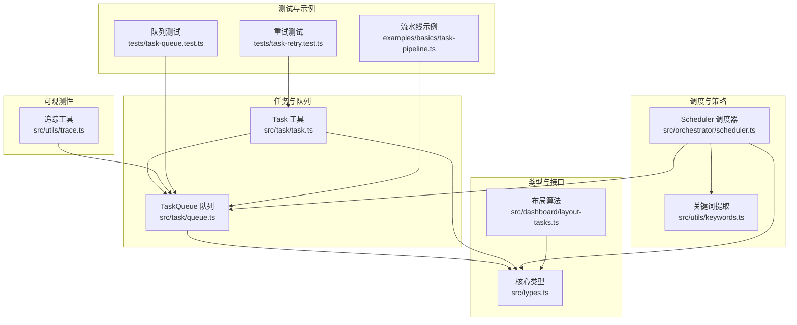
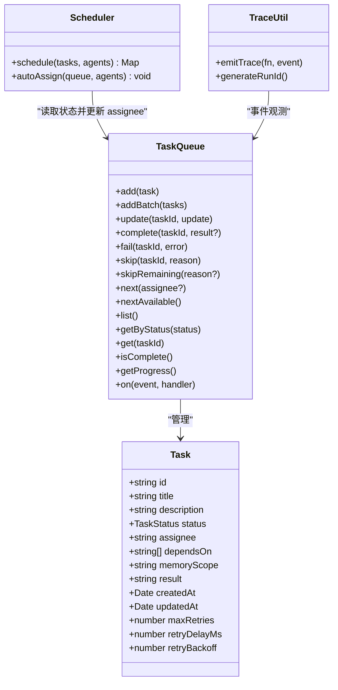
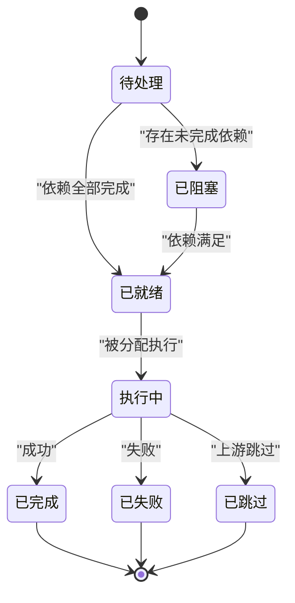
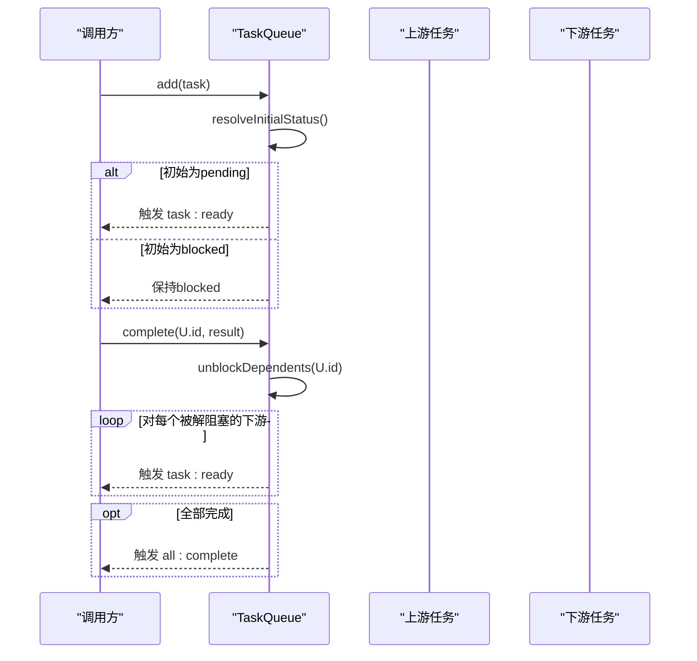
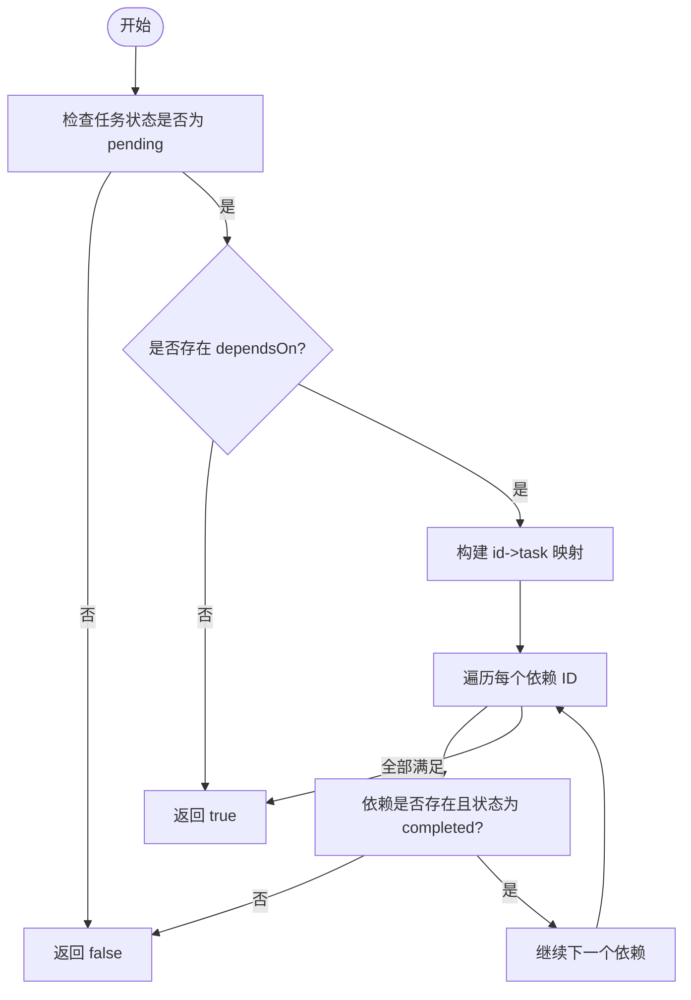
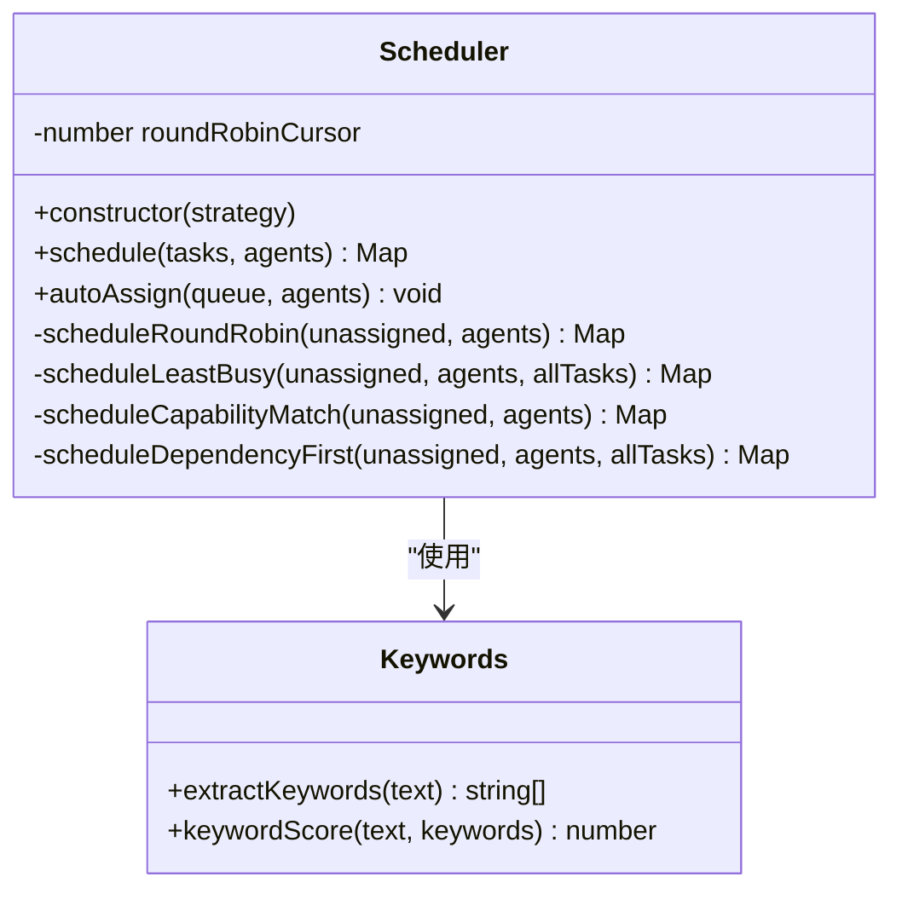
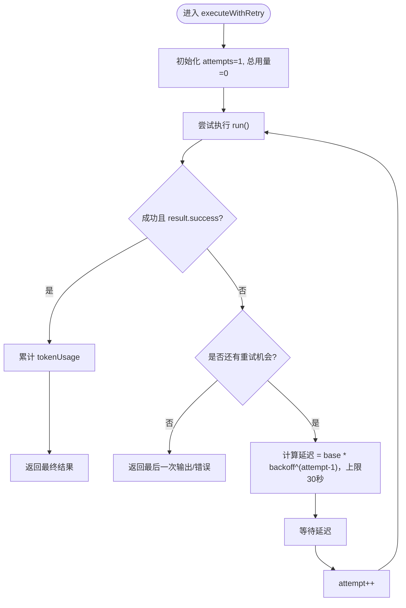
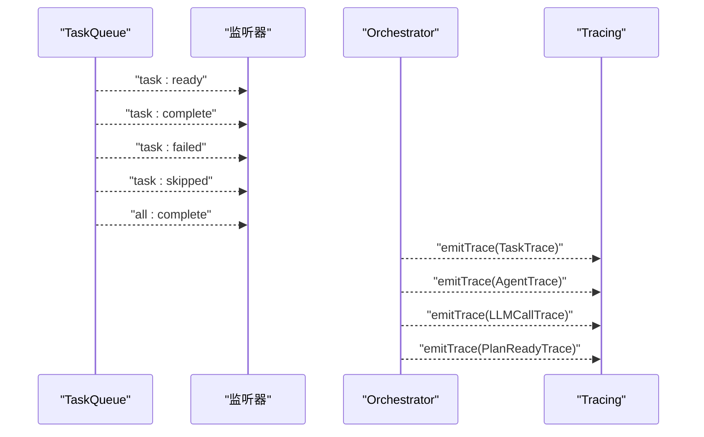
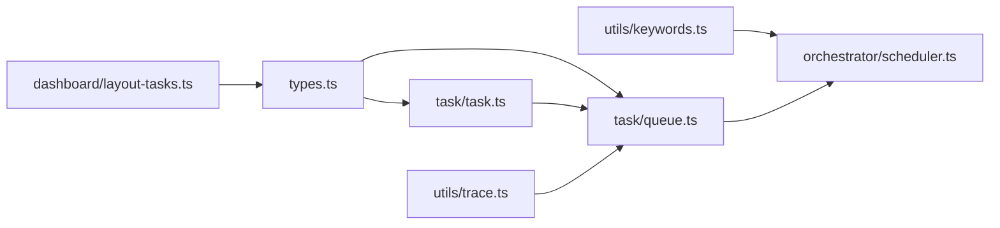

# 任务 API

<cite>
**本文引用的文件**
- [src/task/task.ts](file://src/task/task.ts)
- [src/task/queue.ts](file://src/task/queue.ts)
- [src/types.ts](file://src/types.ts)
- [src/orchestrator/scheduler.ts](file://src/orchestrator/scheduler.ts)
- [src/utils/keywords.ts](file://src/utils/keywords.ts)
- [src/utils/trace.ts](file://src/utils/trace.ts)
- [src/dashboard/layout-tasks.ts](file://src/dashboard/layout-tasks.ts)
- [tests/task-queue.test.ts](file://tests/task-queue.test.ts)
- [tests/task-retry.test.ts](file://tests/task-retry.test.ts)
- [examples/basics/task-pipeline.ts](file://examples/basics/task-pipeline.ts)
</cite>

## 目录
1. [简介](#简介)
2. [项目结构](#项目结构)
3. [核心组件](#核心组件)
4. [架构总览](#架构总览)
5. [详细组件分析](#详细组件分析)
6. [依赖分析](#依赖分析)
7. [性能考虑](#性能考虑)
8. [故障排查指南](#故障排查指南)
9. [结论](#结论)
10. [附录](#附录)

## 简介
本文件为任务管理系统提供完整的 API 文档，覆盖以下主题：
- Task 数据结构与生命周期管理
- TaskQueue 任务队列接口：enqueue/add、dequeue/next、getReadyTasks（通过 next/nextAvailable）、complete/fail/skip 等
- 任务依赖关系的定义与解析：createTask() 参数与返回值；依赖验证与拓扑排序
- 任务状态管理：TaskStatus 枚举与状态转换规则
- 任务优先级与调度：Scheduler 四种策略（轮询、最少忙碌、能力匹配、关键路径优先）
- 并发控制与重试机制：maxRetries、retryDelayMs、retryBackoff 及执行重试流程
- 任务执行监控、进度跟踪与性能分析：事件系统、进度统计、追踪事件
- 任务序列化、持久化与恢复：可序列化数据模型与共享内存集成

## 项目结构
任务系统由纯函数工具、队列状态机、调度器与类型定义组成，并通过事件系统与可观测性模块协同工作。

图表来源
- [src/task/task.ts:1-242](file://src/task/task.ts#L1-L242)
- [src/task/queue.ts:1-470](file://src/task/queue.ts#L1-L470)
- [src/orchestrator/scheduler.ts:1-322](file://src/orchestrator/scheduler.ts#L1-L322)
- [src/utils/keywords.ts:1-40](file://src/utils/keywords.ts#L1-L40)
- [src/types.ts:679-729](file://src/types.ts#L679-L729)
- [src/dashboard/layout-tasks.ts:18-98](file://src/dashboard/layout-tasks.ts#L18-L98)
- [src/utils/trace.ts:12-35](file://src/utils/trace.ts#L12-L35)
- [tests/task-queue.test.ts:1-246](file://tests/task-queue.test.ts#L1-L246)
- [tests/task-retry.test.ts:1-369](file://tests/task-retry.test.ts#L1-L369)
- [examples/basics/task-pipeline.ts:100-182](file://examples/basics/task-pipeline.ts#L100-L182)

章节来源
- [src/task/task.ts:1-242](file://src/task/task.ts#L1-L242)
- [src/task/queue.ts:1-470](file://src/task/queue.ts#L1-L470)
- [src/orchestrator/scheduler.ts:1-322](file://src/orchestrator/scheduler.ts#L1-L322)
- [src/types.ts:679-729](file://src/types.ts#L679-L729)
- [src/utils/keywords.ts:1-40](file://src/utils/keywords.ts#L1-L40)
- [src/dashboard/layout-tasks.ts:18-98](file://src/dashboard/layout-tasks.ts#L18-L98)
- [src/utils/trace.ts:12-35](file://src/utils/trace.ts#L12-L35)
- [tests/task-queue.test.ts:1-246](file://tests/task-queue.test.ts#L1-L246)
- [tests/task-retry.test.ts:1-369](file://tests/task-retry.test.ts#L1-L369)
- [examples/basics/task-pipeline.ts:100-182](file://examples/basics/task-pipeline.ts#L100-L182)

## 核心组件
- Task 数据模型：描述单个任务的标识、标题、描述、状态、分配者、依赖、记忆范围、结果与重试配置等字段。
- TaskStatus 枚举：pending、in_progress、completed、failed、blocked、skipped。
- Task 工具函数：createTask() 创建任务；isTaskReady() 判断就绪；getTaskDependencyOrder() 拓扑排序；validateTaskDependencies() 依赖校验。
- TaskQueue 队列：add/addBatch、update、complete/fail/skip、next/nextAvailable、getByStatus/list/get/isComplete、getProgress、事件订阅 on()。
- Scheduler 调度器：四种策略（round-robin、least-busy、capability-match、dependency-first），autoAssign() 自动分配 assignee。
- 关键词工具：extractKeywords()、keywordScore() 支持能力匹配策略。
- 追踪与可观测性：emitTrace() 安全发出 TraceEvent，generateRunId() 生成运行 ID。
- 布局与可视化：layoutTasks() 用于仪表盘任务图布局。

章节来源
- [src/types.ts:679-729](file://src/types.ts#L679-L729)
- [src/task/task.ts:29-55](file://src/task/task.ts#L29-L55)
- [src/task/task.ts:78-94](file://src/task/task.ts#L78-L94)
- [src/task/task.ts:117-162](file://src/task/task.ts#L117-L162)
- [src/task/task.ts:186-241](file://src/task/task.ts#L186-L241)
- [src/task/queue.ts:55-470](file://src/task/queue.ts#L55-L470)
- [src/orchestrator/scheduler.ts:96-322](file://src/orchestrator/scheduler.ts#L96-L322)
- [src/utils/keywords.ts:18-39](file://src/utils/keywords.ts#L18-L39)
- [src/utils/trace.ts:12-35](file://src/utils/trace.ts#L12-L35)
- [src/dashboard/layout-tasks.ts:22-98](file://src/dashboard/layout-tasks.ts#L22-L98)

## 架构总览
任务系统围绕 Task 与 TaskQueue 展开，通过依赖解析与事件驱动实现自动阻塞/解阻塞；Scheduler 将待执行任务映射到可用代理；Tracing 提供跨组件的轻量观测。

图表来源
- [src/types.ts:705-729](file://src/types.ts#L705-L729)
- [src/task/queue.ts:55-470](file://src/task/queue.ts#L55-L470)
- [src/orchestrator/scheduler.ts:96-167](file://src/orchestrator/scheduler.ts#L96-L167)
- [src/utils/trace.ts:12-35](file://src/utils/trace.ts#L12-L35)

## 详细组件分析

### Task 数据结构与生命周期
- 字段说明
  - 标识与元数据：id、title、description、createdAt、updatedAt
  - 执行与状态：status（TaskStatus）、assignee、result
  - 依赖与上下文：dependsOn（上游任务 ID 数组）、memoryScope（dependencies/all）
  - 重试配置：maxRetries、retryDelayMs、retryBackoff
- 生命周期
  - 创建：createTask() 生成 pending 状态任务
  - 入队：TaskQueue.add()/addBatch() 决定初始状态（pending 或 blocked）
  - 执行：next()/nextAvailable() 获取下一个可执行任务；完成时 complete()/fail()/skip() 更新状态并触发事件
  - 结束：所有任务进入 terminal 状态（completed/failed/skipped）或空队列即 isComplete()

图表来源
- [src/task/queue.ts:407-446](file://src/task/queue.ts#L407-L446)
- [src/task/queue.ts:131-178](file://src/task/queue.ts#L131-L178)
- [src/types.ts:679-680](file://src/types.ts#L679-L680)

章节来源
- [src/types.ts:705-729](file://src/types.ts#L705-L729)
- [src/task/task.ts:29-55](file://src/task/task.ts#L29-L55)
- [src/task/queue.ts:74-80](file://src/task/queue.ts#L74-L80)
- [src/task/queue.ts:131-178](file://src/task/queue.ts#L131-L178)
- [src/task/queue.ts:407-446](file://src/task/queue.ts#L407-L446)

### TaskQueue 接口与行为
- 添加与批处理
  - add(task)：根据依赖解析初始状态，pending 即触发 task:ready
  - addBatch(tasks)：逐个添加，支持依赖满足顺序
- 更新与完成
  - update(taskId, partial)：仅允许 status/result/assignee 更新
  - complete(taskId, result?)：标记完成并解阻塞下游
  - fail(taskId, error)：级联失败下游
  - skip(taskId, reason)：级联跳过下游
  - skipRemaining(reason?)：对剩余非终端任务统一跳过
- 查询与状态
  - next(assignee?) / nextAvailable()：按代理或无代理优先选择
  - list()/getByStatus()/get()/isComplete()/getProgress()
- 事件系统
  - on('task:ready'|'task:complete'|'task:failed'|'task:skipped'|'all:complete', handler)
- 私有辅助
  - resolveInitialStatus()：基于当前队列判断初始状态
  - unblockDependents()：扫描并提升满足条件的任务
  - cascadeFailure()/cascadeSkip()：递归传播失败/跳过

图表来源
- [src/task/queue.ts:74-80](file://src/task/queue.ts#L74-L80)
- [src/task/queue.ts:407-446](file://src/task/queue.ts#L407-L446)
- [src/task/queue.ts:131-178](file://src/task/queue.ts#L131-L178)

章节来源
- [src/task/queue.ts:55-470](file://src/task/queue.ts#L55-L470)
- [tests/task-queue.test.ts:25-90](file://tests/task-queue.test.ts#L25-L90)
- [tests/task-queue.test.ts:96-132](file://tests/task-queue.test.ts#L96-L132)
- [tests/task-queue.test.ts:138-163](file://tests/task-queue.test.ts#L138-L163)
- [tests/task-queue.test.ts:174-194](file://tests/task-queue.test.ts#L174-L194)
- [tests/task-queue.test.ts:200-213](file://tests/task-queue.test.ts#L200-L213)
- [tests/task-queue.test.ts:219-230](file://tests/task-queue.test.ts#L219-L230)
- [tests/task-queue.test.ts:236-244](file://tests/task-queue.test.ts#L236-L244)

### 任务依赖关系：定义与解析
- 定义
  - dependsOn：字符串数组，引用上游任务 ID
  - memoryScope：'dependencies'（默认，仅直接依赖结果）或 'all'（全共享内存摘要）
- 解析
  - isTaskReady(task, allTasks, taskById?)：当 status='pending' 且所有依赖均为 'completed' 时为真
  - getTaskDependencyOrder(tasks)：Kahn 拓扑排序，保证依赖在前
  - validateTaskDependencies(tasks)：检测未知依赖、自依赖与环依赖
- 测试验证
  - 多依赖需全部完成才解阻塞
  - 级联失败/跳过传播

图表来源
- [src/task/task.ts:78-94](file://src/task/task.ts#L78-L94)
- [src/task/task.ts:117-162](file://src/task/task.ts#L117-L162)
- [src/task/task.ts:186-241](file://src/task/task.ts#L186-L241)

章节来源
- [src/task/task.ts:78-94](file://src/task/task.ts#L78-L94)
- [src/task/task.ts:117-162](file://src/task/task.ts#L117-L162)
- [src/task/task.ts:186-241](file://src/task/task.ts#L186-L241)
- [tests/task-queue.test.ts:75-90](file://tests/task-queue.test.ts#L75-L90)
- [tests/task-queue.test.ts:96-132](file://tests/task-queue.test.ts#L96-L132)

### 任务状态管理与转换规则
- TaskStatus：pending、in_progress、completed、failed、blocked、skipped
- 转换规则
  - pending 可转 blocked（依赖未满足）或已就绪（依赖满足）
  - 已就绪可转 in_progress（分配执行）
  - in_progress 可转 completed/failed/skipped
  - blocked 可转 pending（依赖满足）或 failed/skipped（上游失败/跳过）
- 事件触发
  - complete/fail/skip 后会触发相应事件并可能触发 all:complete

章节来源
- [src/types.ts:679-680](file://src/types.ts#L679-L680)
- [src/task/queue.ts:407-446](file://src/task/queue.ts#L407-L446)
- [src/task/queue.ts:131-178](file://src/task/queue.ts#L131-L178)

### 任务优先级与并发控制
- 优先级策略（Scheduler）
  - round-robin：按代理索引轮询分配
  - least-busy：选择当前 in_progress 最少的代理
  - capability-match：基于关键词匹配评分选择最合适的代理
  - dependency-first：按“被多少下游等待”（critical path）优先分配
- 并发控制
  - next()/nextAvailable() 选择下一个可执行任务
  - maxConcurrency 由上层配置控制（如 runTeam/runTasks 的 OrchestratorConfig）

图表来源
- [src/orchestrator/scheduler.ts:96-322](file://src/orchestrator/scheduler.ts#L96-L322)
- [src/utils/keywords.ts:18-39](file://src/utils/keywords.ts#L18-L39)

章节来源
- [src/orchestrator/scheduler.ts:96-322](file://src/orchestrator/scheduler.ts#L96-L322)
- [src/utils/keywords.ts:18-39](file://src/utils/keywords.ts#L18-L39)

### 重试机制
- 重试配置
  - maxRetries：最大重试次数（默认 0，即不重试）
  - retryDelayMs：基础延迟毫秒数（默认 1000）
  - retryBackoff：指数退避系数（默认 2）
- 执行流程
  - executeWithRetry()：计算每次延迟（上限 30 秒），累积 tokenUsage，支持异常与失败两种重试场景
  - createTask() 透传重试字段
- 行为验证
  - 正常退避延迟序列
  - 成功/失败均支持重试
  - 令牌用量累加
  - 负数/异常 backoff 被钳制

图表来源
- [src/orchestrator/orchestrator.ts:266-297](file://src/orchestrator/orchestrator.ts#L266-L297)
- [tests/task-retry.test.ts:33-49](file://tests/task-retry.test.ts#L33-L49)
- [tests/task-retry.test.ts:107-137](file://tests/task-retry.test.ts#L107-L137)
- [tests/task-retry.test.ts:139-155](file://tests/task-retry.test.ts#L139-L155)
- [tests/task-retry.test.ts:157-180](file://tests/task-retry.test.ts#L157-L180)
- [tests/task-retry.test.ts:198-221](file://tests/task-retry.test.ts#L198-L221)
- [tests/task-retry.test.ts:223-238](file://tests/task-retry.test.ts#L223-L238)
- [tests/task-retry.test.ts:240-258](file://tests/task-retry.test.ts#L240-L258)
- [tests/task-retry.test.ts:260-277](file://tests/task-retry.test.ts#L260-L277)
- [tests/task-retry.test.ts:279-307](file://tests/task-retry.test.ts#L279-L307)
- [tests/task-retry.test.ts:309-329](file://tests/task-retry.test.ts#L309-L329)
- [tests/task-retry.test.ts:331-346](file://tests/task-retry.test.ts#L331-L346)
- [tests/task-retry.test.ts:348-367](file://tests/task-retry.test.ts#L348-L367)

章节来源
- [src/task/task.ts:29-55](file://src/task/task.ts#L29-L55)
- [src/orchestrator/orchestrator.ts:266-297](file://src/orchestrator/orchestrator.ts#L266-L297)
- [tests/task-retry.test.ts:55-75](file://tests/task-retry.test.ts#L55-L75)
- [tests/task-retry.test.ts:107-137](file://tests/task-retry.test.ts#L107-L137)
- [tests/task-retry.test.ts:139-155](file://tests/task-retry.test.ts#L139-L155)
- [tests/task-retry.test.ts:157-180](file://tests/task-retry.test.ts#L157-L180)
- [tests/task-retry.test.ts:198-221](file://tests/task-retry.test.ts#L198-L221)
- [tests/task-retry.test.ts:223-238](file://tests/task-retry.test.ts#L223-L238)
- [tests/task-retry.test.ts:240-258](file://tests/task-retry.test.ts#L240-L258)
- [tests/task-retry.test.ts:260-277](file://tests/task-retry.test.ts#L260-L277)
- [tests/task-retry.test.ts:279-307](file://tests/task-retry.test.ts#L279-L307)
- [tests/task-retry.test.ts:309-329](file://tests/task-retry.test.ts#L309-L329)
- [tests/task-retry.test.ts:331-346](file://tests/task-retry.test.ts#L331-L346)
- [tests/task-retry.test.ts:348-367](file://tests/task-retry.test.ts#L348-L367)

### 执行监控、进度跟踪与性能分析
- 事件系统
  - TaskQueue.on('task:ready'|'task:complete'|'task:failed'|'task:skipped'|'all:complete', handler)
  - OrchestratorEvent：agent_start/complete、task_start/complete、task_retry、budget_exceeded、message、error
- 进度统计
  - getProgress() 返回 total/completed/failed/skipped/inProgress/pending/blocked 计数
- 追踪事件
  - TraceEvent：llm_call、tool_call、task、agent、plan_ready、agent_stream
  - emitTrace() 安全发出事件，吞回调异常避免影响执行
  - generateRunId() 生成运行 ID 用于关联

图表来源
- [src/task/queue.ts:383-397](file://src/task/queue.ts#L383-L397)
- [src/types.ts:741-755](file://src/types.ts#L741-L755)
- [src/types.ts:928-935](file://src/types.ts#L928-L935)
- [src/types.ts:937-943](file://src/types.ts#L937-L943)
- [src/types.ts:907-915](file://src/types.ts#L907-L915)
- [src/types.ts:945-952](file://src/types.ts#L945-L952)
- [src/utils/trace.ts:12-35](file://src/utils/trace.ts#L12-L35)

章节来源
- [src/task/queue.ts:317-365](file://src/task/queue.ts#L317-L365)
- [src/types.ts:741-755](file://src/types.ts#L741-L755)
- [src/types.ts:928-935](file://src/types.ts#L928-L935)
- [src/types.ts:937-943](file://src/types.ts#L937-L943)
- [src/types.ts:907-915](file://src/types.ts#L907-L915)
- [src/types.ts:945-952](file://src/types.ts#L945-L952)
- [src/utils/trace.ts:12-35](file://src/utils/trace.ts#L12-L35)

### 任务序列化、持久化与恢复
- 可序列化模型
  - TaskExecutionRecord：id、title、assignee、status、dependsOn、metrics
  - 用于静态 HTML 仪表盘快照
- 共享内存
  - memoryScope='all' 时，任务可访问全团队共享内存摘要
  - writeExpiring() 支持按“回合计数”过期写入
- 恢复与布局
  - layoutTasks() 用于可视化布局，内部进行拓扑层级计算
- 示例
  - task-pipeline.ts 展示了依赖链式任务的执行与进度输出

章节来源
- [src/types.ts:686-702](file://src/types.ts#L686-L702)
- [src/types.ts:718-719](file://src/types.ts#L718-L719)
- [src/memory/shared.ts:131-163](file://src/memory/shared.ts#L131-L163)
- [src/dashboard/layout-tasks.ts:22-98](file://src/dashboard/layout-tasks.ts#L22-L98)
- [examples/basics/task-pipeline.ts:100-182](file://examples/basics/task-pipeline.ts#L100-L182)

## 依赖分析
- 组件耦合
  - TaskQueue 依赖 Task 类型与 isTaskReady() 工具
  - Scheduler 依赖 Task、AgentConfig、关键词工具
  - Tracing 与事件系统解耦，安全包装回调
- 外部依赖
  - 事件系统使用 Map 存储监听器，Symbol 作为唯一键
  - 依赖验证与拓扑排序采用标准算法（Kahn、DFS）

图表来源
- [src/types.ts:679-729](file://src/types.ts#L679-L729)
- [src/task/queue.ts:55-470](file://src/task/queue.ts#L55-L470)
- [src/task/task.ts:1-242](file://src/task/task.ts#L1-L242)
- [src/orchestrator/scheduler.ts:96-322](file://src/orchestrator/scheduler.ts#L96-L322)
- [src/utils/keywords.ts:18-39](file://src/utils/keywords.ts#L18-L39)
- [src/utils/trace.ts:12-35](file://src/utils/trace.ts#L12-L35)
- [src/dashboard/layout-tasks.ts:22-98](file://src/dashboard/layout-tasks.ts#L22-L98)

章节来源
- [src/task/queue.ts:55-470](file://src/task/queue.ts#L55-L470)
- [src/task/task.ts:1-242](file://src/task/task.ts#L1-L242)
- [src/orchestrator/scheduler.ts:96-322](file://src/orchestrator/scheduler.ts#L96-L322)
- [src/utils/keywords.ts:18-39](file://src/utils/keywords.ts#L18-L39)
- [src/utils/trace.ts:12-35](file://src/utils/trace.ts#L12-L35)
- [src/dashboard/layout-tasks.ts:22-98](file://src/dashboard/layout-tasks.ts#L22-L98)

## 性能考虑
- 依赖解析
  - isTaskReady() 支持传入预构建的 id->task 映射以降低复杂度
  - Kahn 拓扑排序与 DFS 环检测的时间复杂度分别为 O(V+E) 与 O(V+E)
- 队列扫描
  - unblockDependents() 在一次扫描中构建并复用映射，避免 O(n^2)
- 重试延迟
  - 指数退避上限 30 秒，防止抖动放大
- 关键词评分
  - 提前构建代理关键词集合，减少重复计算

[本节为通用指导，无需列出章节来源]

## 故障排查指南
- 任务无法解阻塞
  - 检查 dependsOn 是否引用了不存在的 ID
  - 使用 validateTaskDependencies() 检测环依赖
- 级联失败/跳过
  - fail()/skip() 会递归传播至下游，确认上游状态
- 事件未触发
  - 确认 on() 订阅正确，且任务确实进入对应状态
- 重试未生效
  - 检查 maxRetries/retryDelayMs/retryBackoff 设置
  - 确认 run() 返回的 AgentRunResult.success 字段

章节来源
- [src/task/task.ts:186-241](file://src/task/task.ts#L186-L241)
- [src/task/queue.ts:212-243](file://src/task/queue.ts#L212-L243)
- [tests/task-queue.test.ts:96-132](file://tests/task-queue.test.ts#L96-L132)
- [tests/task-retry.test.ts:157-180](file://tests/task-retry.test.ts#L157-L180)
- [tests/task-retry.test.ts:182-196](file://tests/task-retry.test.ts#L182-L196)

## 结论
该任务系统通过清晰的数据模型、事件驱动的队列状态机、可插拔的调度策略与完善的重试/追踪机制，提供了从任务定义、依赖解析、并发调度到执行监控与可视化的完整能力。配合共享内存与布局算法，可支撑复杂多步骤的多智能体协作流水线。

[本节为总结性内容，无需列出章节来源]

## 附录
- API 快速参考
  - createTask(input)：创建任务，支持重试与依赖配置
  - TaskQueue.add()/addBatch()：入队并解析初始状态
  - TaskQueue.next()/nextAvailable()：获取下一个可执行任务
  - TaskQueue.complete()/fail()/skip()：完成/失败/跳过任务并触发事件
  - TaskQueue.getProgress()：获取进度统计
  - Scheduler.schedule()/autoAssign()：按策略分配代理
  - emitTrace()/generateRunId()：追踪事件与运行 ID

[本节为概览性内容，无需列出章节来源]