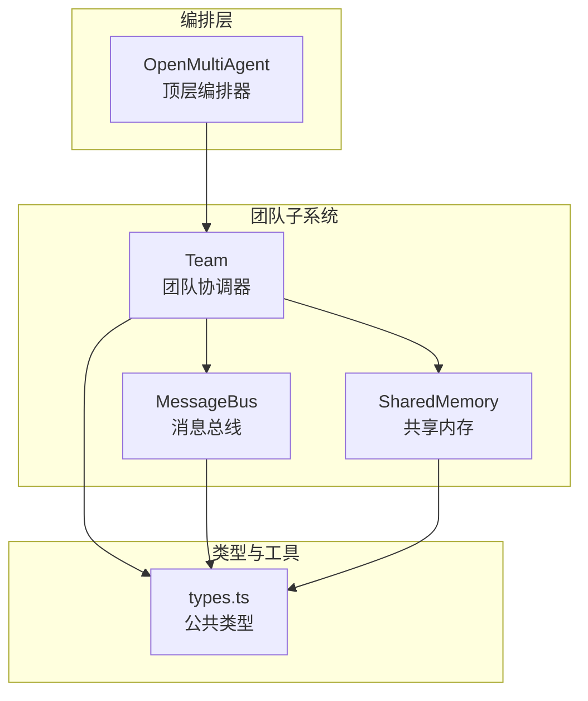
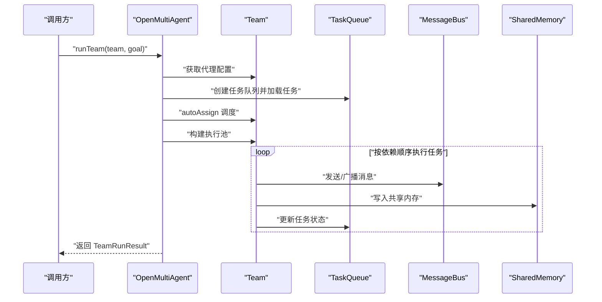
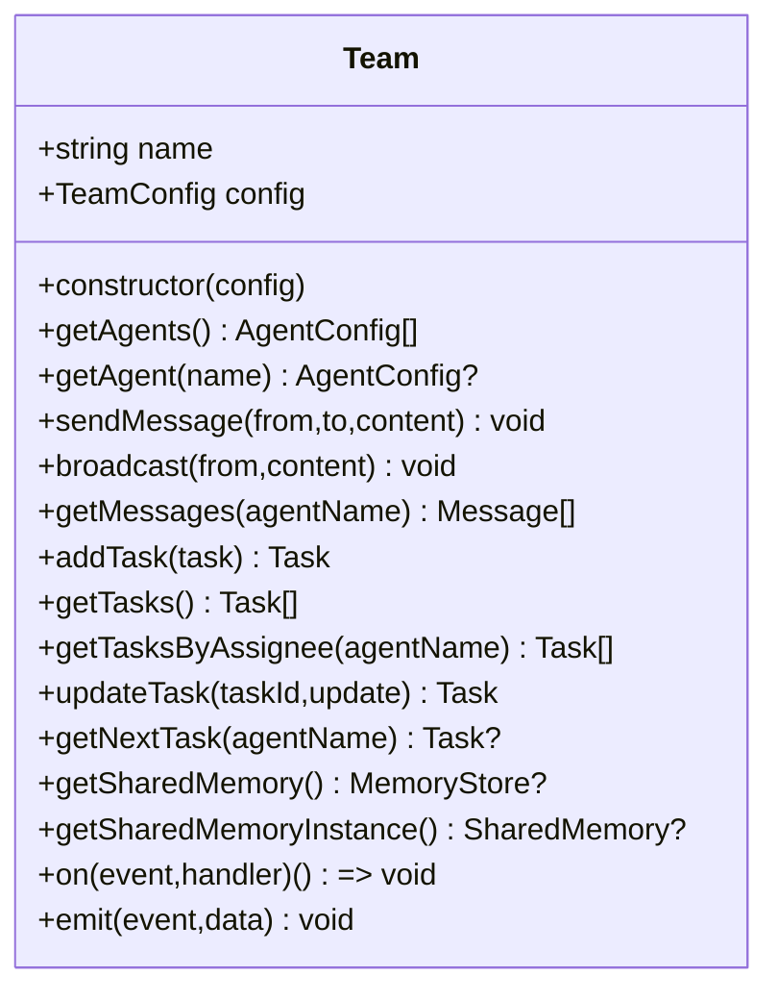
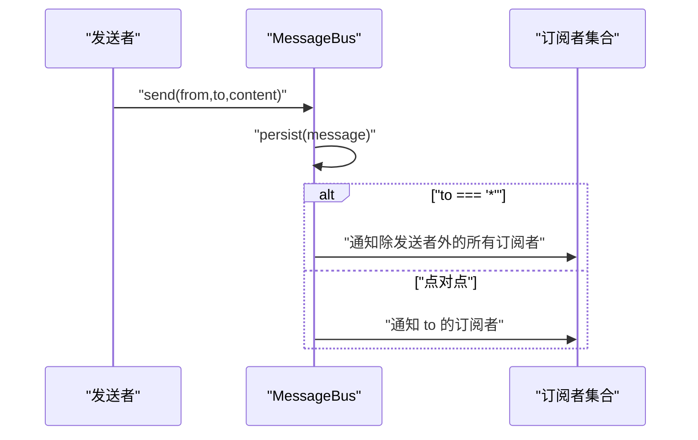
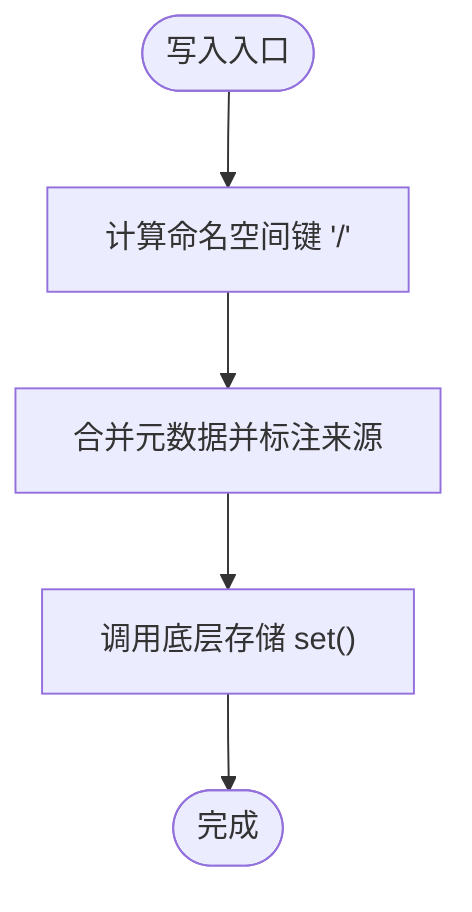
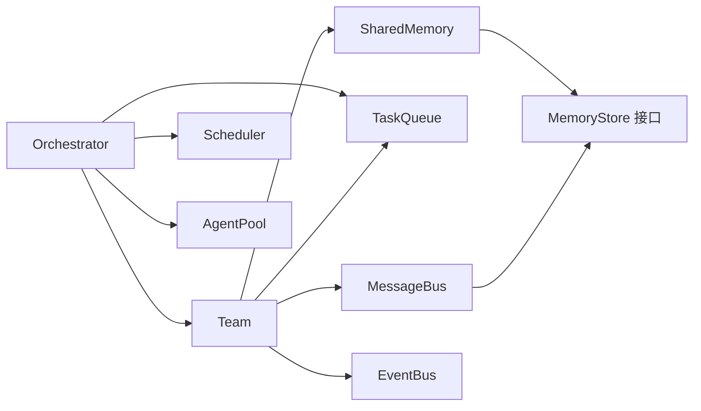

# 团队 API

<cite>
**本文引用的文件列表**
- [team.ts](file://src/team/team.ts)
- [messaging.ts](file://src/team/messaging.ts)
- [types.ts](file://src/types.ts)
- [shared.ts](file://src/memory/shared.ts)
- [02-team-collaboration.ts](file://examples/02-team-collaboration.ts)
- [team-messaging.test.ts](file://tests/team-messaging.test.ts)
- [orchestrator.ts](file://src/orchestrator/orchestrator.ts)
</cite>

## 目录
1. [简介](#简介)
2. [项目结构](#项目结构)
3. [核心组件](#核心组件)
4. [架构总览](#架构总览)
5. [详细组件分析](#详细组件分析)
6. [依赖关系分析](#依赖关系分析)
7. [性能与并发特性](#性能与并发特性)
8. [故障排查指南](#故障排查指南)
9. [结论](#结论)
10. [附录：使用示例与最佳实践](#附录使用示例与最佳实践)

## 简介
本文件为 Team 类与团队协作系统的详细 API 文档，覆盖以下主题：
- Team 类的构造函数与核心方法（构造函数、getAgents、getAgent、sendMessage、broadcast、addTask、getTasks、getTasksByAssignee、updateTask、getNextTask、getSharedMemory、getSharedMemoryInstance、on、emit）
- TeamConfig 配置类型（name、agents、sharedMemory、maxConcurrency）
- TeamRunResult 返回类型（success、agentResults、totalTokenUsage）
- MessageBus 消息总线的通信机制（消息格式、订阅/通知、广播、未读状态管理）
- 团队内部通信协议与消息路由策略
- 团队协作最佳实践与常见使用模式
- 完整的代码示例路径（展示团队创建、任务分配与结果收集）

## 项目结构
团队协作系统由以下关键模块组成：
- Team：团队协调器，负责代理名单、消息总线、任务队列与可选共享内存，并提供事件总线
- MessageBus：点对点与广播消息的内存存储与订阅分发
- SharedMemory：按代理命名空间的共享键值存储，支持摘要生成
- Orchestrator：顶层编排器，负责将高层目标分解为任务、调度执行并聚合结果
- Types：公共类型定义，包括 TeamConfig、TeamRunResult、Task、OrchestratorEvent 等

图表来源
- [team.ts:88-334](file://src/team/team.ts#L88-L334)
- [messaging.ts:68-232](file://src/team/messaging.ts#L68-L232)
- [shared.ts:36-181](file://src/memory/shared.ts#L36-L181)
- [types.ts:316-330](file://src/types.ts#L316-L330)
- [orchestrator.ts:641-802](file://src/orchestrator/orchestrator.ts#L641-L802)

章节来源
- [team.ts:1-335](file://src/team/team.ts#L1-L335)
- [messaging.ts:1-233](file://src/team/messaging.ts#L1-L233)
- [shared.ts:1-182](file://src/memory/shared.ts#L1-L182)
- [types.ts:316-330](file://src/types.ts#L316-L330)
- [orchestrator.ts:641-802](file://src/orchestrator/orchestrator.ts#L641-L802)

## 核心组件
- Team 类：封装代理名单、消息总线、任务队列与共享内存；提供事件总线以响应生命周期事件
- MessageBus 类：内存中持久化消息，按代理订阅分发；支持点对点与广播；维护未读状态
- SharedMemory 类：命名空间化的共享键值存储，支持摘要生成
- TeamConfig 接口：团队静态配置（名称、代理数组、是否启用共享内存、最大并发）
- TeamRunResult 接口：一次团队运行的聚合结果（成功标志、按代理的结果映射、总用量统计）

章节来源
- [team.ts:88-334](file://src/team/team.ts#L88-L334)
- [messaging.ts:68-232](file://src/team/messaging.ts#L68-L232)
- [shared.ts:36-181](file://src/memory/shared.ts#L36-L181)
- [types.ts:316-330](file://src/types.ts#L316-L330)

## 架构总览
Team 将代理、消息、任务与共享内存整合为统一的协作单元，并通过事件总线对外暴露生命周期事件。编排器在顶层将高层目标分解为任务，调度执行并汇总结果。

图表来源
- [orchestrator.ts:641-802](file://src/orchestrator/orchestrator.ts#L641-L802)
- [team.ts:213-273](file://src/team/team.ts#L213-L273)
- [messaging.ts:96-115](file://src/team/messaging.ts#L96-L115)
- [shared.ts:58-69](file://src/memory/shared.ts#L58-L69)

## 详细组件分析

### Team 类 API
- 构造函数
  - 参数：TeamConfig
  - 行为：初始化代理索引、消息总线、任务队列、可选共享内存；桥接队列事件到团队事件总线
  - 示例路径：[team.ts:98-140](file://src/team/team.ts#L98-L140)
- 代理管理
  - getAgents()：返回注册顺序的代理配置副本
  - getAgent(name)：按名称查找代理配置
  - 示例路径：[team.ts:147-158](file://src/team/team.ts#L147-L158)
- 消息通信
  - sendMessage(from, to, content)：点对点发送消息，持久化并同步通知订阅者，同时发出 message 事件
  - broadcast(from, content)：广播消息至所有其他代理，发出 broadcast 事件
  - getMessages(agentName)：按时间顺序返回某代理收到的所有消息（含未读）
  - 示例路径：[team.ts:170-201](file://src/team/team.ts#L170-L201)
- 任务管理
  - addTask(task)：创建并添加任务，保留非默认状态（如 blocked），返回带生成字段的任务对象
  - getTasks()：返回队列中所有任务快照
  - getTasksByAssignee(agentName)：返回指定代理负责的任务
  - updateTask(taskId, update)：部分更新任务（status/result/assignee）
  - getNextTask(agentName)：优先返回该代理已指派的任务，否则返回首个未分配的待处理任务
  - 示例路径：[team.ts:213-273](file://src/team/team.ts#L213-L273)
- 共享内存
  - getSharedMemory()：返回 MemoryStore 接口（若启用共享内存）
  - getSharedMemoryInstance()：返回 SharedMemory 实例（内部访问）
  - 示例路径：[team.ts:287-299](file://src/team/team.ts#L287-L299)
- 事件总线
  - on(event, handler)：订阅团队事件（task:ready、task:complete、task:failed、all:complete、message、broadcast）
  - emit(event, data)：发出自定义事件
  - 示例路径：[team.ts:321-333](file://src/team/team.ts#L321-L333)

图表来源
- [team.ts:88-334](file://src/team/team.ts#L88-L334)

章节来源
- [team.ts:88-334](file://src/team/team.ts#L88-L334)

### MessageBus 类 API
- 消息类型
  - Message：包含 id、from、to、content、timestamp
  - 示例路径：[messaging.ts:16-28](file://src/team/messaging.ts#L16-L28)
- 写操作
  - send(from, to, content)：生成唯一 ID、时间戳并持久化消息，返回消息对象
  - broadcast(from, content)：to 设为 "*" 的广播消息
  - 示例路径：[messaging.ts:96-115](file://src/team/messaging.ts#L96-L115)
- 读操作
  - getUnread(agentName)：返回未读消息（按地址过滤）
  - getAll(agentName)：返回某代理收到的所有消息
  - markRead(agentName, messageIds)：标记消息为已读
  - getConversation(agent1, agent2)：返回双向对话历史
  - 示例路径：[messaging.ts:125-166](file://src/team/messaging.ts#L125-L166)
- 订阅与通知
  - subscribe(agentName, callback)：订阅新消息，返回取消订阅函数
  - 内部通知逻辑：点对点直接通知；广播通知除发送者外的所有订阅者
  - 示例路径：[messaging.ts:185-231](file://src/team/messaging.ts#L185-L231)

图表来源
- [messaging.ts:205-231](file://src/team/messaging.ts#L205-L231)

章节来源
- [messaging.ts:68-232](file://src/team/messaging.ts#L68-L232)

### SharedMemory 类 API
- 写入
  - write(agentName, key, value, metadata?)：按 "<agentName>/<key>" 命名空间写入，合并元数据并标注来源
  - 示例路径：[shared.ts:58-69](file://src/memory/shared.ts#L58-L69)
- 读取与列举
  - read(key)：按完全限定键读取
  - listAll()：返回全部条目
  - listByAgent(agentName)：返回某代理写入的所有条目
  - 示例路径：[shared.ts:80-101](file://src/memory/shared.ts#L80-L101)
- 摘要
  - getSummary()：生成人类可读的摘要文本，按代理分组显示，适合注入到系统提示或用户回合
  - 示例路径：[shared.ts:127-159](file://src/memory/shared.ts#L127-L159)
- 存储接口
  - getStore()：返回底层 MemoryStore 接口
  - 示例路径：[shared.ts:170-172](file://src/memory/shared.ts#L170-L172)

图表来源
- [shared.ts:58-69](file://src/memory/shared.ts#L58-L69)

章节来源
- [shared.ts:36-181](file://src/memory/shared.ts#L36-L181)

### TeamConfig 与 TeamRunResult 类型
- TeamConfig
  - name: 团队名称
  - agents: 代理配置数组
  - sharedMemory?: 是否启用共享内存
  - maxConcurrency?: 最大并发数
  - 示例路径：[types.ts:316-322](file://src/types.ts#L316-L322)
- TeamRunResult
  - success: 是否整体成功
  - agentResults: Map<string, AgentRunResult>
  - totalTokenUsage: TokenUsage
  - 示例路径：[types.ts:324-330](file://src/types.ts#L324-L330)

章节来源
- [types.ts:316-330](file://src/types.ts#L316-L330)

## 依赖关系分析
- Team 依赖
  - MessageBus：用于代理间通信
  - TaskQueue：用于任务编排与调度
  - SharedMemory：可选的共享状态
  - EventBus：内部事件桥接
- MessageBus 依赖
  - Message 接口
  - 订阅者映射与未读状态映射
- SharedMemory 依赖
  - MemoryStore 接口
  - InMemoryStore 实现
- Orchestrator 依赖
  - Team：创建与运行团队
  - TaskQueue/Scheduler/AgentPool：执行与调度
  - AgentRunResult：聚合结果

图表来源
- [team.ts:10-22](file://src/team/team.ts#L10-L22)
- [messaging.ts:9-28](file://src/team/messaging.ts#L9-L28)
- [shared.ts:10-11](file://src/memory/shared.ts#L10-L11)
- [orchestrator.ts:44-65](file://src/orchestrator/orchestrator.ts#L44-L65)

章节来源
- [team.ts:10-22](file://src/team/team.ts#L10-L22)
- [messaging.ts:9-28](file://src/team/messaging.ts#L9-L28)
- [shared.ts:10-11](file://src/memory/shared.ts#L10-L11)
- [orchestrator.ts:44-65](file://src/orchestrator/orchestrator.ts#L44-L65)

## 性能与并发特性
- 并发控制
  - TeamConfig.maxConcurrency 控制团队最大并发
  - Orchestrator.runTeam 中通过 AgentPool 与 Scheduler 实现并行执行
- 任务重试
  - Task 支持 maxRetries、retryDelayMs、retryBackoff
  - executeWithRetry 提供指数退避与累计用量统计
- 内存模型
  - MessageBus 与 SharedMemory 均为内存实现，适合本地与小规模场景
  - 大规模或跨进程场景建议替换为持久化后端

章节来源
- [types.ts:340-358](file://src/types.ts#L340-L358)
- [orchestrator.ts:108-194](file://src/orchestrator/orchestrator.ts#L108-L194)

## 故障排查指南
- 事件未触发
  - 确认订阅事件名称正确（task:ready、task:complete、task:failed、all:complete、message、broadcast）
  - 检查事件桥接是否生效（队列事件到团队事件的桥接）
  - 参考测试用例验证行为
  - 示例路径：[team-messaging.test.ts:280-328](file://tests/team-messaging.test.ts#L280-L328)
- 消息未送达
  - 点对点消息 to 必须为目标代理名称；广播消息 to 应为 "*"
  - 发送者不会收到自己的广播
  - 使用 getAll/getUnread 验证消息是否被持久化与标记
  - 示例路径：[messaging.ts:96-115](file://src/team/messaging.ts#L96-L115)
- 任务状态异常
  - 确认任务依赖解析与调度逻辑
  - 使用 updateTask 更新状态；检查 getNextTask 的优先级策略
  - 示例路径：[team.ts:248-273](file://src/team/team.ts#L248-L273)
- 共享内存不可用
  - sharedMemory 需在 TeamConfig 中启用；否则 getSharedMemory 返回 undefined
  - 示例路径：[team.ts:287-299](file://src/team/team.ts#L287-L299)

章节来源
- [team-messaging.test.ts:26-143](file://tests/team-messaging.test.ts#L26-L143)
- [messaging.ts:96-115](file://src/team/messaging.ts#L96-L115)
- [team.ts:287-299](file://src/team/team.ts#L287-L299)

## 结论
Team 类与消息总线构成了团队协作的核心基础设施：前者负责代理、任务与共享状态的统一管理，后者提供轻量、可审计的代理间通信。结合编排器的任务分解与调度能力，可以高效地完成复杂多步骤的团队任务。建议在生产环境中根据规模选择持久化存储与可观测性方案，并遵循本文的最佳实践以获得稳定可靠的运行效果。

## 附录：使用示例与最佳实践

### 示例一：团队创建、任务分配与结果收集
- 示例路径：[02-team-collaboration.ts:109-148](file://examples/02-team-collaboration.ts#L109-L148)
- 关键步骤
  - 创建 Orchestrator
  - 使用 createTeam 创建 Team（启用 sharedMemory）
  - 调用 runTeam(goal) 获取 TeamRunResult
  - 遍历 agentResults 输出每个代理的执行情况与工具调用次数

### 示例二：消息总线使用
- 示例路径：[team-messaging.test.ts:165-187](file://tests/team-messaging.test.ts#L165-L187)
- 关键步骤
  - Team.sendMessage 发送点对点消息并触发 message 事件
  - Team.broadcast 广播消息并触发 broadcast 事件
  - 使用 getMessages 获取接收方消息

### 示例三：任务管理与调度
- 示例路径：[team-messaging.test.ts:189-254](file://tests/team-messaging.test.ts#L189-L254)
- 关键步骤
  - addTask 添加任务
  - getTasksByAssignee 过滤任务
  - updateTask 更新状态
  - getNextTask 优先分配已指派任务

### 最佳实践
- 明确代理角色与工具集，避免过度耦合
- 合理设置任务依赖，减少阻塞传播
- 使用共享内存进行阶段性结果沉淀，便于后续代理复用
- 通过事件回调观察进度，及时发现失败与循环
- 对长耗时任务配置合理的重试参数与超时上限
- 在需要跨进程或高可用场景下，考虑替换为持久化存储与分布式消息总线