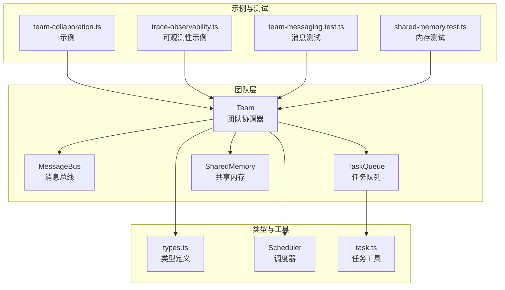
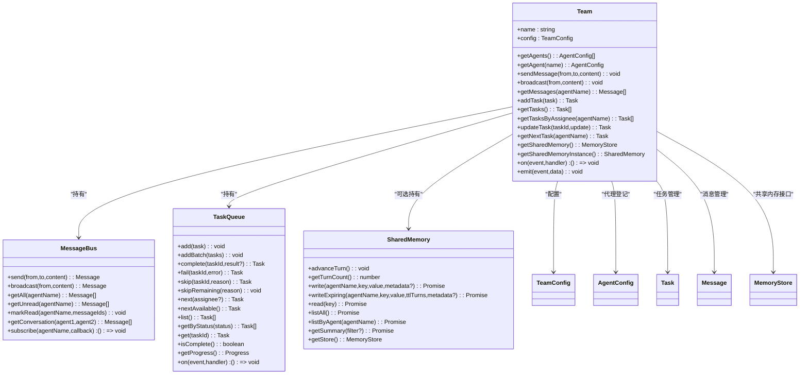
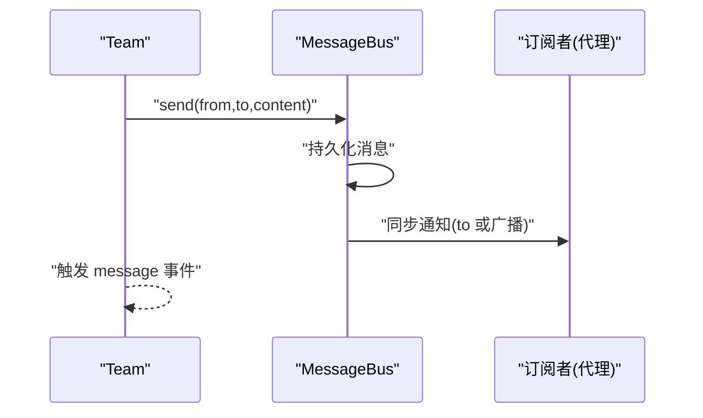
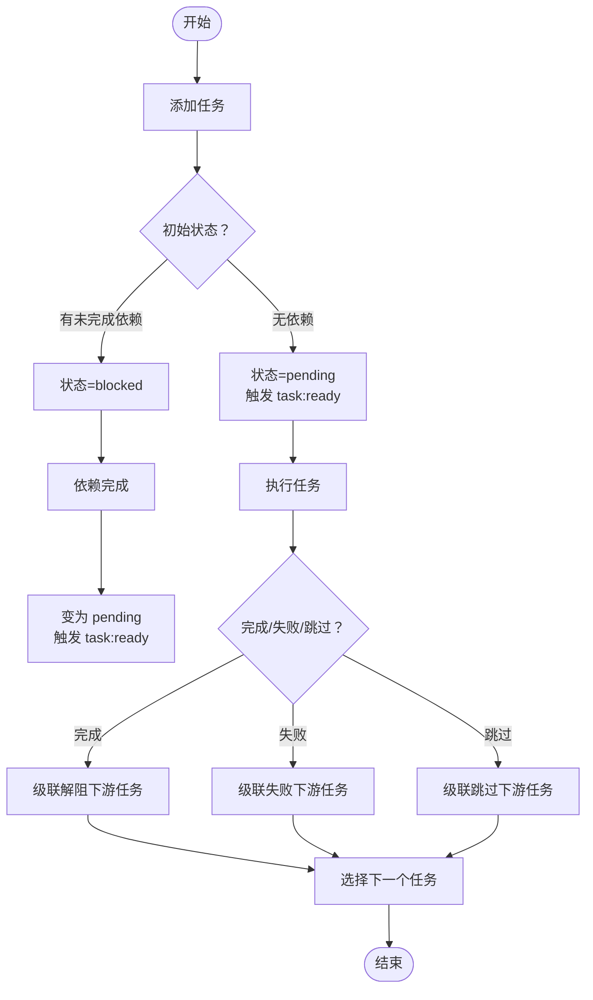
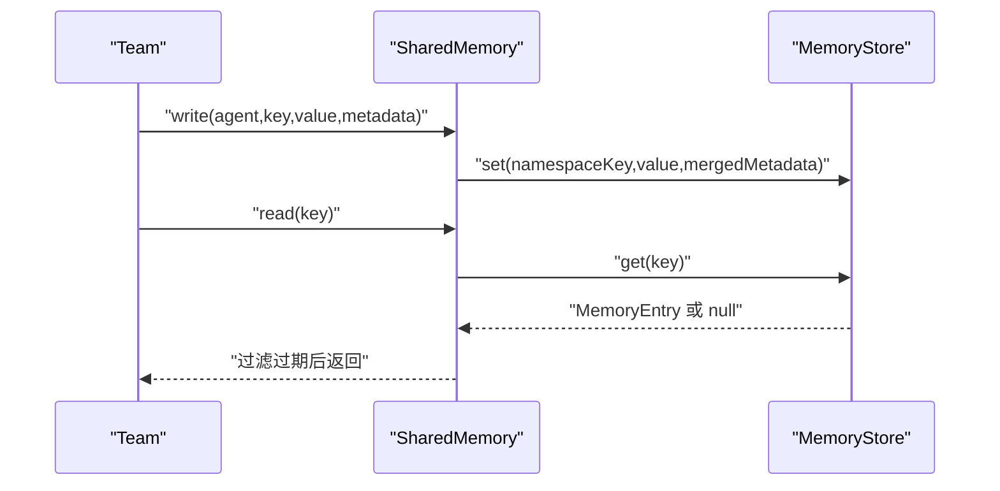
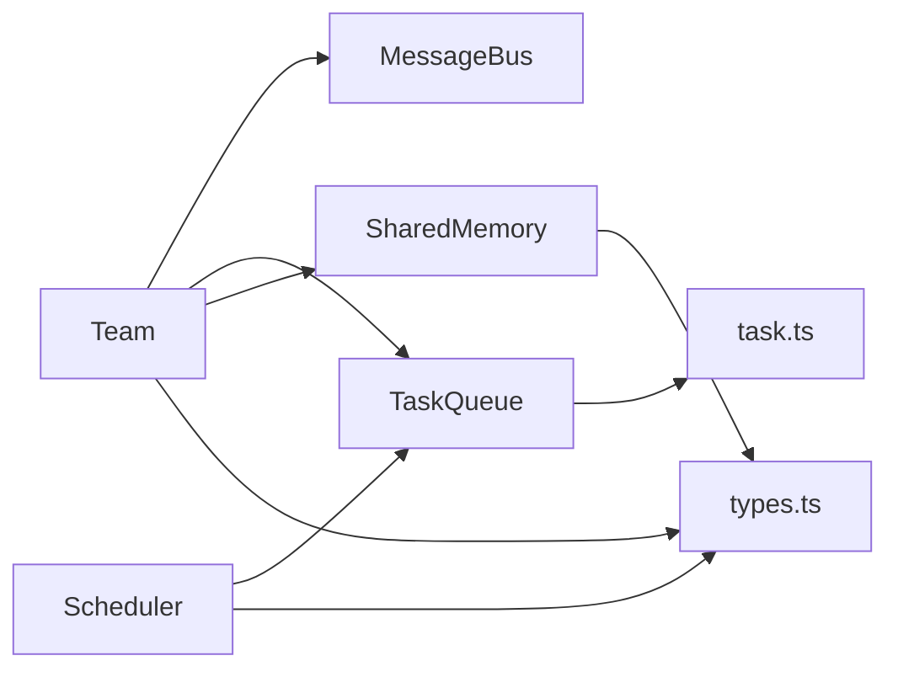

# 团队 API

<cite>
**本文引用的文件**
- [src/team/team.ts](file://src/team/team.ts)
- [src/team/messaging.ts](file://src/team/messaging.ts)
- [src/types.ts](file://src/types.ts)
- [src/memory/shared.ts](file://src/memory/shared.ts)
- [src/task/queue.ts](file://src/task/queue.ts)
- [src/task/task.ts](file://src/task/task.ts)
- [src/orchestrator/scheduler.ts](file://src/orchestrator/scheduler.ts)
- [examples/basics/team-collaboration.ts](file://examples/basics/team-collaboration.ts)
- [examples/integrations/trace-observability.ts](file://examples/integrations/trace-observability.ts)
- [tests/team-messaging.test.ts](file://tests/team-messaging.test.ts)
- [tests/shared-memory.test.ts](file://tests/shared-memory.test.ts)
</cite>

## 目录
1. [简介](#简介)
2. [项目结构](#项目结构)
3. [核心组件](#核心组件)
4. [架构总览](#架构总览)
5. [详细组件分析](#详细组件分析)
6. [依赖关系分析](#依赖关系分析)
7. [性能与并发特性](#性能与并发特性)
8. [故障排查指南](#故障排查指南)
9. [结论](#结论)
10. [附录](#附录)

## 简介
本文件为团队协作系统的 Team API 详细文档，覆盖团队创建、成员管理、任务编排、消息总线、共享内存、事件与可观测性、以及结果聚合与输出格式。重点说明 TeamConfig 的配置项（agents 数组、sharedMemory 设置、可选的 sharedMemoryStore），MessageBus 的消息发送/接收/订阅/路由机制，并给出团队运行时状态监控、性能指标采集与调试信息获取的方法。同时补充团队内智能体通信协议、消息格式规范与冲突处理策略，以及团队执行结果的聚合方式与输出格式。

## 项目结构
该系统围绕 Team 核心对象组织，Team 聚合了消息总线、任务队列、共享内存与内部事件总线；类型定义集中在 types.ts 中；调度器负责任务分配策略；示例与测试展示了典型用法与行为边界。

图表来源
- [src/team/team.ts:88-345](file://src/team/team.ts#L88-L345)
- [src/team/messaging.ts:68-232](file://src/team/messaging.ts#L68-L232)
- [src/task/queue.ts:55-469](file://src/task/queue.ts#L55-L469)
- [src/memory/shared.ts:55-334](file://src/memory/shared.ts#L55-L334)
- [src/orchestrator/scheduler.ts:96-321](file://src/orchestrator/scheduler.ts#L96-L321)
- [src/task/task.ts:29-94](file://src/task/task.ts#L29-L94)
- [examples/basics/team-collaboration.ts:103-128](file://examples/basics/team-collaboration.ts#L103-L128)
- [examples/integrations/trace-observability.ts:90-129](file://examples/integrations/trace-observability.ts#L90-L129)
- [tests/team-messaging.test.ts:149-328](file://tests/team-messaging.test.ts#L149-L328)
- [tests/shared-memory.test.ts:6-407](file://tests/shared-memory.test.ts#L6-L407)

章节来源
- [src/team/team.ts:88-345](file://src/team/team.ts#L88-L345)
- [src/types.ts:608-623](file://src/types.ts#L608-L623)

## 核心组件
- Team：团队协调器，负责代理登记、消息总线、任务队列、共享内存接入与内部事件桥接。
- MessageBus：轻量级点对点/广播消息总线，支持订阅、未读标记、对话检索与持久化。
- TaskQueue：拓扑依赖的任务队列，支持 ready/complete/failed/skipped/all:complete 等事件。
- SharedMemory：命名空间化的共享内存，支持 TTL 过期、摘要生成、自定义存储注入。
- Scheduler：任务自动分配策略（轮询、最少忙碌、能力匹配、关键路径优先）。
- types.ts：统一的类型定义，包括 TeamConfig、Task、AgentConfig、OrchestratorEvent 等。

章节来源
- [src/team/team.ts:88-345](file://src/team/team.ts#L88-L345)
- [src/team/messaging.ts:68-232](file://src/team/messaging.ts#L68-L232)
- [src/task/queue.ts:55-469](file://src/task/queue.ts#L55-L469)
- [src/memory/shared.ts:55-334](file://src/memory/shared.ts#L55-L334)
- [src/orchestrator/scheduler.ts:96-321](file://src/orchestrator/scheduler.ts#L96-L321)
- [src/types.ts:608-623](file://src/types.ts#L608-L623)

## 架构总览
下图展示 Team 与各子系统的交互关系与数据流。

图表来源
- [src/team/team.ts:88-345](file://src/team/team.ts#L88-L345)
- [src/team/messaging.ts:68-232](file://src/team/messaging.ts#L68-L232)
- [src/task/queue.ts:55-469](file://src/task/queue.ts#L55-L469)
- [src/memory/shared.ts:55-334](file://src/memory/shared.ts#L55-L334)
- [src/types.ts:608-623](file://src/types.ts#L608-L623)

## 详细组件分析

### Team 类 API
- 团队创建与配置
  - 构造函数接收 TeamConfig，内部索引代理、初始化消息总线、任务队列与共享内存。
  - 支持两种共享内存启用方式：
    - sharedMemory: true 使用默认内存存储；
    - sharedMemoryStore: MemoryStore 注入自定义存储（优先级高于布尔值）。
- 成员管理
  - getAgents() 返回注册顺序的代理配置副本；
  - getAgent(name) 按名称查找代理。
- 消息总线
  - sendMessage(from,to,content) 发送点对点消息并触发 message 事件；
  - broadcast(from,content) 广播消息并触发 broadcast 事件；
  - getMessages(agentName) 获取某代理收到的所有消息（按时间排序）。
- 任务管理
  - addTask(task) 创建并入队任务，保留非默认状态（如 blocked）；
  - getTasks() / getTasksByAssignee(agentName) 查询任务；
  - updateTask(taskId, update) 更新任务状态/结果/负责人；
  - getNextTask(agentName) 优先返回该代理已指派的任务，否则返回首个未分配的待处理任务。
- 共享内存
  - getSharedMemory() 返回 MemoryStore 接口；
  - getSharedMemoryInstance() 返回 SharedMemory 实例（用于命名空间与摘要）。
- 事件系统
  - on(event, handler) 订阅内置事件：task:ready、task:complete、task:failed、all:complete、message、broadcast；
  - emit(event, data) 触发自定义事件。

章节来源
- [src/team/team.ts:88-345](file://src/team/team.ts#L88-L345)
- [src/types.ts:608-623](file://src/types.ts#L608-L623)

### MessageBus 消息总线
- 消息模型
  - Message 包含 id、from、to、content、timestamp；
  - to 为 "*" 表示广播（除发送者外所有订阅者都会收到）。
- 写操作
  - send(from,to,content) 持久化消息并同步通知订阅者；
  - broadcast(from,content) 等价于 send(to='*')。
- 读操作
  - getAll(agentName) 返回该代理收到的所有消息；
  - getUnread(agentName) 返回未读消息（基于 per-agent 已读集合）；
  - markRead(agentName, ids) 将指定消息标记为已读；
  - getConversation(agent1, agent2) 返回双向对话历史。
- 订阅
  - subscribe(agentName, callback) 订阅新消息，返回取消订阅函数；
  - 通知在消息持久化后同步触发，确保回调在同微任务内执行。

图表来源
- [src/team/team.ts:181-189](file://src/team/team.ts#L181-L189)
- [src/team/messaging.ts:96-115](file://src/team/messaging.ts#L96-L115)
- [src/team/messaging.ts:205-231](file://src/team/messaging.ts#L205-L231)

章节来源
- [src/team/messaging.ts:68-232](file://src/team/messaging.ts#L68-L232)
- [tests/team-messaging.test.ts:26-143](file://tests/team-messaging.test.ts#L26-L143)

### 任务队列与调度
- 任务生命周期与事件
  - add/addBatch 添加任务，根据依赖解析初始状态（pending/blocked）；
  - complete/fail/skip 更新状态并级联影响下游任务；
  - next/nextAvailable 提供任务选取策略；
  - getProgress 统计各类状态数量。
- 调度策略
  - round-robin：按代理索引轮询分配；
  - least-busy：选择当前 in_progress 最少的代理；
  - capability-match：基于关键词匹配评分选择最合适的代理；
  - dependency-first：优先分配能解阻最多下游任务的任务。
- 关键路径算法
  - 通过反向邻接表统计每个任务被多少下游任务阻塞，作为分配优先级。

图表来源
- [src/task/queue.ts:74-190](file://src/task/queue.ts#L74-L190)
- [src/task/queue.ts:212-243](file://src/task/queue.ts#L212-L243)
- [src/task/queue.ts:255-280](file://src/task/queue.ts#L255-L280)
- [src/orchestrator/scheduler.ts:51-76](file://src/orchestrator/scheduler.ts#L51-L76)
- [src/orchestrator/scheduler.ts:294-320](file://src/orchestrator/scheduler.ts#L294-L320)

章节来源
- [src/task/queue.ts:55-469](file://src/task/queue.ts#L55-L469)
- [src/task/task.ts:78-94](file://src/task/task.ts#L78-L94)
- [src/orchestrator/scheduler.ts:96-321](file://src/orchestrator/scheduler.ts#L96-L321)

### 共享内存
- 命名空间与读写
  - 写入以 "<agentName>/<key>" 命名空间隔离，元数据包含 agent 标记；
  - 读取支持完全限定键或跨代理读取，过滤过期条目。
- TTL 与回合计数
  - writeExpiring 支持按回合数过期（advanceTurn 控制）；
  - 自定义存储若不实现 setWithExpiry，则降级为普通写入。
- 摘要与过滤
  - getSummary 生成人类可读摘要，支持按任务 ID 过滤仅显示任务结果；
  - listAll/listByAgent 过滤过期条目。
- 存储注入与校验
  - 支持注入自定义 MemoryStore，构造时进行接口形状校验，防止误用。

图表来源
- [src/memory/shared.ts:124-135](file://src/memory/shared.ts#L124-L135)
- [src/memory/shared.ts:200-205](file://src/memory/shared.ts#L200-L205)
- [src/memory/shared.ts:251-294](file://src/memory/shared.ts#L251-L294)

章节来源
- [src/memory/shared.ts:55-334](file://src/memory/shared.ts#L55-L334)
- [tests/shared-memory.test.ts:6-407](file://tests/shared-memory.test.ts#L6-L407)

### 协调者与执行流程
- 协调者模式
  - runTeam 会先尝试短路单代理执行；否则由协调者分解目标为任务数组，加载到 TaskQueue；
  - Scheduler 根据策略自动分配未指派任务；
  - 执行完成后，协调者合成最终结果并返回 TeamRunResult。
- 输出格式
  - TeamRunResult 包含 success、goal、tasks、agentResults、totalTokenUsage 等字段；
  - agentResults 以代理名为键，值为 AgentRunResult（包含 success、output、messages、tokenUsage、toolCalls 等）。

章节来源
- [src/orchestrator/scheduler.ts:96-321](file://src/orchestrator/scheduler.ts#L96-L321)
- [src/types.ts:659-673](file://src/types.ts#L659-L673)
- [examples/basics/team-collaboration.ts:120-167](file://examples/basics/team-collaboration.ts#L120-L167)

## 依赖关系分析
- Team 对 MessageBus、TaskQueue、SharedMemory 的组合使用，形成“消息—任务—记忆”的协作闭环；
- Scheduler 与 TaskQueue 解耦，仅依赖任务快照与代理配置；
- types.ts 作为单一公共类型源，避免循环依赖；
- 示例与测试验证了消息传递、任务状态流转、共享内存读写与摘要生成等关键路径。

图表来源
- [src/team/team.ts:88-345](file://src/team/team.ts#L88-L345)
- [src/task/queue.ts:55-469](file://src/task/queue.ts#L55-L469)
- [src/memory/shared.ts:55-334](file://src/memory/shared.ts#L55-L334)
- [src/orchestrator/scheduler.ts:96-321](file://src/orchestrator/scheduler.ts#L96-L321)
- [src/task/task.ts:29-94](file://src/task/task.ts#L29-L94)
- [src/types.ts:608-623](file://src/types.ts#L608-L623)

章节来源
- [src/team/team.ts:88-345](file://src/team/team.ts#L88-L345)
- [src/types.ts:608-623](file://src/types.ts#L608-L623)

## 性能与并发特性
- 并发控制
  - TeamConfig.maxConcurrency 与 OrchestratorConfig.maxConcurrency 控制并发上限；
  - Scheduler 的 least-busy 与 dependency-first 可降低拥塞与长尾。
- 事件驱动
  - TaskQueue 在任务状态变更时发出事件，避免轮询；
  - Team 将队列事件桥接到团队事件总线上，便于外部观察。
- 内存与 IO
  - SharedMemory 默认内存存储适合单进程；注入自定义存储可满足分布式场景；
  - TTL 与回合计数避免无限增长，提升可维护性。

[本节为通用指导，无需特定文件引用]

## 故障排查指南
- 消息未送达
  - 检查订阅是否正确（subscribe）、是否广播（to='*'）、是否被标记为已读（markRead）；
  - 使用 getConversation 快速定位双向对话。
- 任务无法推进
  - 使用 getProgress 查看 pending/blocked/in_progress 状态分布；
  - 检查依赖 ID 是否存在且已完成（validateTaskDependencies）。
- 共享内存异常
  - 确认 sharedMemoryStore 注入成功且具备必要方法；
  - 检查 TTL 参数是否为正整数，回合计数是否正确推进。
- 观测性
  - 使用 onProgress/onTrace 获取任务/代理/工具/LLM 调用的详细时间与用量；
  - 在示例中参考 trace-observability.ts 的日志格式。

章节来源
- [tests/team-messaging.test.ts:26-143](file://tests/team-messaging.test.ts#L26-L143)
- [tests/shared-memory.test.ts:255-301](file://tests/shared-memory.test.ts#L255-L301)
- [examples/integrations/trace-observability.ts:50-84](file://examples/integrations/trace-observability.ts#L50-L84)

## 结论
Team API 提供了完整的团队协作基础设施：以 Team 为中心整合消息、任务与记忆；通过 MessageBus 实现松耦合通信；借助 TaskQueue 与 Scheduler 实现可靠的多步任务编排；通过 SharedMemory 支持跨代理知识共享与摘要；配合事件与可观测性接口，便于监控与调试。遵循本文档的配置与使用方式，可在复杂协作场景中获得稳定、可扩展的执行效果。

[本节为总结，无需特定文件引用]

## 附录

### TeamConfig 配置项详解
- name: 团队名称
- agents: 代理配置数组（AgentConfig[]）
- sharedMemory: boolean（启用默认内存存储）
- sharedMemoryStore: MemoryStore（自定义存储注入，优先级更高）
- maxConcurrency: number（并发上限）

章节来源
- [src/types.ts:608-623](file://src/types.ts#L608-L623)

### 消息格式与通信协议
- Message 字段：id、from、to、content、timestamp；
- 广播规则：to='*'，除发送者外所有订阅者收到；
- 未读跟踪：按代理维护已读集合；
- 对话检索：getConversation 返回双向消息。

章节来源
- [src/team/messaging.ts:15-28](file://src/team/messaging.ts#L15-L28)
- [src/team/messaging.ts:34-41](file://src/team/messaging.ts#L34-L41)

### 冲突解决策略
- 任务依赖冲突：通过 validateTaskDependencies 检测未知依赖与环形依赖；
- 任务状态冲突：complete/fail/skip 的级联传播保证一致性；
- 分配冲突：Scheduler 的 least-busy/capability-match/dependency-first 提供不同权衡。

章节来源
- [src/task/task.ts:186-241](file://src/task/task.ts#L186-L241)
- [src/task/queue.ts:212-243](file://src/task/queue.ts#L212-L243)
- [src/orchestrator/scheduler.ts:133-143](file://src/orchestrator/scheduler.ts#L133-L143)

### 执行结果聚合与输出格式
- TeamRunResult 字段：success、goal、tasks、agentResults、totalTokenUsage；
- agentResults 键为代理名，值为 AgentRunResult（success、output、messages、tokenUsage、toolCalls 等）。

章节来源
- [src/types.ts:659-673](file://src/types.ts#L659-L673)
- [examples/basics/team-collaboration.ts:136-167](file://examples/basics/team-collaboration.ts#L136-L167)