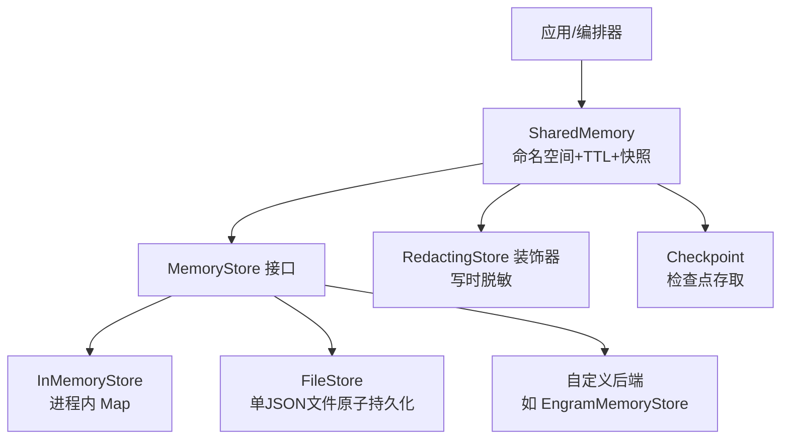
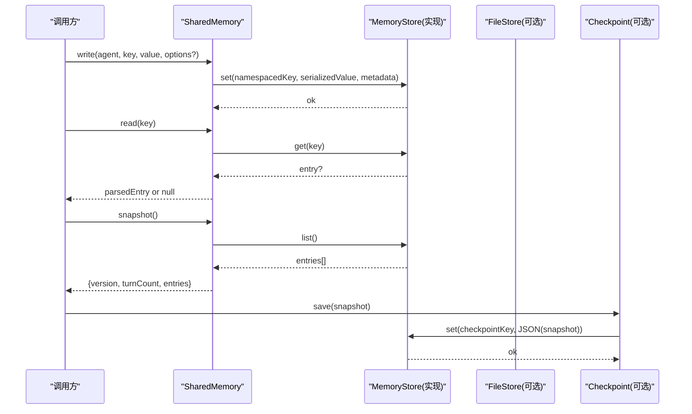
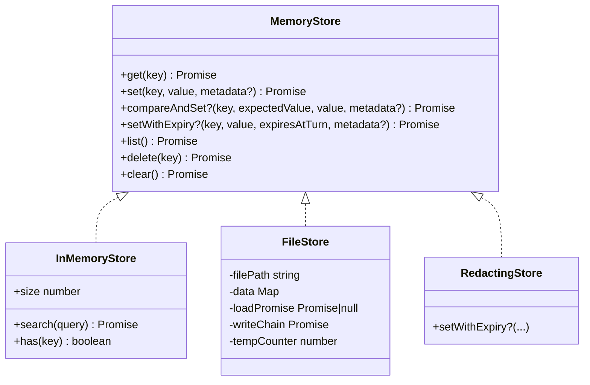
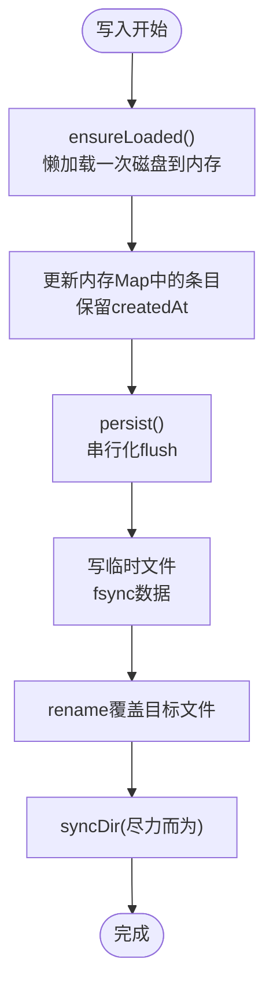
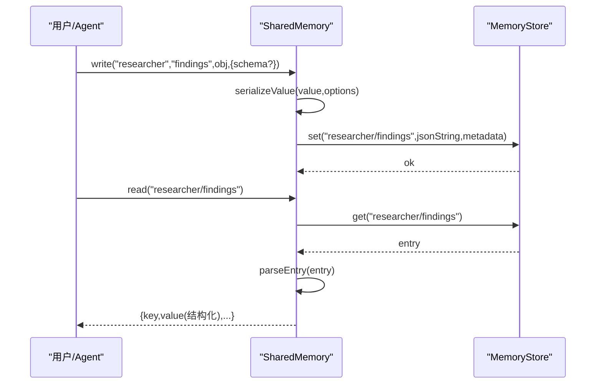
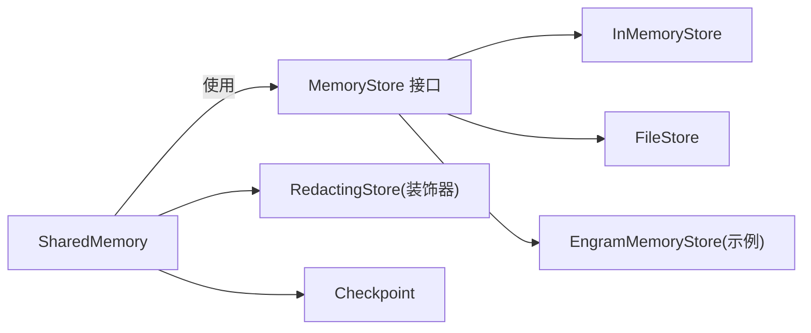

# 存储 API

<cite>
**本文引用的文件**
- [types.ts](file://packages/core/src/types.ts)
- [store.ts](file://packages/core/src/memory/store.ts)
- [file-store.ts](file://packages/core/src/memory/file-store.ts)
- [shared.ts](file://packages/core/src/memory/shared.ts)
- [redacting-store.ts](file://packages/core/src/memory/redacting-store.ts)
- [checkpoint.ts](file://packages/core/src/memory/checkpoint.ts)
- [engram-store.ts](file://packages/core/examples/integrations/with-engram/engram-store.ts)
- [shared-memory.md](file://docs/shared-memory.md)
</cite>

## 目录
1. [简介](#简介)
2. [项目结构](#项目结构)
3. [核心组件](#核心组件)
4. [架构总览](#架构总览)
5. [详细组件分析](#详细组件分析)
6. [依赖关系分析](#依赖关系分析)
7. [性能考量](#性能考量)
8. [故障排查指南](#故障排查指南)
9. [结论](#结论)
10. [附录](#附录)

## 简介
本参考文档面向需要实现或集成“共享内存”与“持久化检查点”的开发者，系统性地介绍存储系统的 API 与实现要点：
- MemoryStore 接口定义、数据读写、查询、删除、可选的 CAS 与 TTL 写入。
- InMemoryStore（进程内 Map）与 FileStore（单 JSON 文件原子持久化）两种内置实现的特点与适用场景。
- SharedMemory 的使用方法：命名空间键、结构化值序列化/反序列化、TTL 过期、快照与恢复、摘要生成。
- 自定义存储后端实现指南：接口契约、并发与一致性、错误处理、性能优化建议。
- 存储迁移与备份恢复最佳实践：版本兼容、校验、回滚策略。

## 项目结构
存储相关代码集中在 core 包的 memory 子模块与类型定义中，并通过示例展示如何对接外部后端。

图表来源
- [shared.ts:68-98](file://packages/core/src/memory/shared.ts#L68-L98)
- [store.ts:31-122](file://packages/core/src/memory/store.ts#L31-L122)
- [file-store.ts:80-206](file://packages/core/src/memory/file-store.ts#L80-L206)
- [redacting-store.ts:48-95](file://packages/core/src/memory/redacting-store.ts#L48-L95)
- [checkpoint.ts:45-102](file://packages/core/src/memory/checkpoint.ts#L45-L102)
- [engram-store.ts:48-73](file://packages/core/examples/integrations/with-engram/engram-store.ts#L48-L73)

章节来源
- [shared-memory.md:1-47](file://docs/shared-memory.md#L1-L47)
- [types.ts:2806-2872](file://packages/core/src/types.ts#L2806-L2872)

## 核心组件
- MemoryStore 接口：统一的键值存储抽象，支持 get/set/list/delete/clear，以及可选的 compareAndSet 与 setWithExpiry。
- InMemoryStore：基于 Map 的进程内实现，适合测试与单进程快速读写；提供 search 扩展与 size/has 便捷方法。
- FileStore：基于单个 JSON 文件的持久化实现，读路径走内存镜像，写路径原子落盘（临时文件 + fsync + rename），保证崩溃一致性与顺序写入。
- SharedMemory：在 MemoryStore 之上提供命名空间键、结构化值序列化/反序列化、TTL 过期、快照/恢复、按 Agent 列表与摘要输出等能力。
- RedactingStore：对任意 MemoryStore 进行装饰，在写时对 value 进行敏感信息脱敏，可选择性透传 setWithExpiry。
- Checkpoint：将运行状态以 JSON 形式存入 MemoryStore 的保留命名空间，支持保存、加载、删除与严格的快照格式校验。

章节来源
- [types.ts:2806-2872](file://packages/core/src/types.ts#L2806-L2872)
- [store.ts:31-166](file://packages/core/src/memory/store.ts#L31-L166)
- [file-store.ts:80-206](file://packages/core/src/memory/file-store.ts#L80-L206)
- [shared.ts:68-186](file://packages/core/src/memory/shared.ts#L68-L186)
- [redacting-store.ts:48-109](file://packages/core/src/memory/redacting-store.ts#L48-L109)
- [checkpoint.ts:45-102](file://packages/core/src/memory/checkpoint.ts#L45-L102)

## 架构总览
SharedMemory 作为统一入口，负责：
- 键命名空间：<agentName>/<key>，避免冲突并保留来源。
- 结构化值：write 时将对象序列化为 JSON 并附带编码元数据；read 时根据元数据还原为结构化值。
- TTL 过期：通过 turnCount 与 expiresAtTurn 控制条目可见性；不实现 setWithExpiry 的后端会退化为永久存储。
- 快照与恢复：snapshot/fromSnapshot/restore 用于跨进程/重启后的状态重建。
- 摘要：getSummary 生成按 Agent 分组的可读摘要，便于注入上下文。

图表来源
- [shared.ts:204-268](file://packages/core/src/memory/shared.ts#L204-L268)
- [shared.ts:285-311](file://packages/core/src/memory/shared.ts#L285-L311)
- [shared.ts:137-186](file://packages/core/src/memory/shared.ts#L137-L186)
- [checkpoint.ts:57-102](file://packages/core/src/memory/checkpoint.ts#L57-L102)
- [file-store.ts:102-206](file://packages/core/src/memory/file-store.ts#L102-L206)

## 详细组件分析

### MemoryStore 接口与数据模型
- 基本操作
  - get(key): 读取条目，不存在返回 null。
  - set(key, value, metadata?): 写入字符串值与可选元数据；更新时保留 createdAt。
  - list(): 按插入顺序返回所有条目快照。
  - delete(key): 删除指定键；不存在为幂等。
  - clear(): 清空全部条目。
- 可选能力
  - compareAndSet(key, expectedValue, value, metadata?): 原子比较并设置，用于可挂起审批等强一致场景。
  - setWithExpiry(key, value, expiresAtTurn, metadata?): 带“回合数”过期的写入；未实现则退化为普通 set。
- 数据模型
  - MemoryEntry：包含 key/value/metadata/createdAt/expiresAtTurn。
  - SharedMemoryEntry：value 为结构化类型（string/number/boolean/null/数组/对象）。
  - SharedMemoryWriteOptions：可选 schema 校验。

章节来源
- [types.ts:2806-2872](file://packages/core/src/types.ts#L2806-L2872)

#### 类图（MemoryStore 及其实现）

图表来源
- [types.ts:2842-2872](file://packages/core/src/types.ts#L2842-L2872)
- [store.ts:31-166](file://packages/core/src/memory/store.ts#L31-L166)
- [file-store.ts:80-206](file://packages/core/src/memory/file-store.ts#L80-L206)
- [redacting-store.ts:48-109](file://packages/core/src/memory/redacting-store.ts#L48-L109)

### InMemoryStore（进程内存储）
- 特点
  - 基于 Map，无 IO，适合测试与单进程使用。
  - 保持 createdAt 语义，支持 compareAndSet 与 setWithExpiry。
  - 额外提供 search(size/has) 辅助能力。
- 适用场景
  - 单元测试、本地调试、无需持久化的短期共享状态。

章节来源
- [store.ts:31-166](file://packages/core/src/memory/store.ts#L31-L166)

### FileStore（文件持久化存储）
- 设计要点
  - 单 JSON 文件承载全部条目，内存 Map 镜像以提升读性能。
  - 原子写入：写临时文件 -> fsync -> rename 覆盖目标，确保崩溃一致性。
  - 写入串行化：通过写链保证并发写入顺序与最终一致性。
  - 只读路径不触盘，仅变更路径落盘。
- 数据格式
  - 文件头 version 字段用于版本校验；entries 数组按插入顺序保存。
  - createdAt 以 ISO 字符串持久化，载入时恢复为 Date。
- 错误处理
  - 非 JSON 或非法结构直接抛出错误，防止静默丢弃数据。
  - 目录不存在时自动创建；目录 fsync 失败被忽略（不影响主流程）。
- 适用场景
  - 检查点存储首选；也可作为 sharedMemoryStore 使用（但每次写入都会落盘整表）。

图表来源
- [file-store.ts:112-126](file://packages/core/src/memory/file-store.ts#L112-L126)
- [file-store.ts:315-351](file://packages/core/src/memory/file-store.ts#L315-L351)
- [file-store.ts:220-246](file://packages/core/src/memory/file-store.ts#L220-L246)

章节来源
- [file-store.ts:1-381](file://packages/core/src/memory/file-store.ts#L1-L381)

### SharedMemory（共享内存层）
- 命名空间
  - 写入键形如 <agentName>/<key>，读取支持全限定键。
- 结构化值
  - write 时若 value 非字符串，则序列化为 JSON 并在 metadata 中标记编码方式；read 时根据标记还原为结构化值。
  - 支持可选 schema 校验，失败抛 TypeError。
- TTL 过期
  - writeExpiring 记录 expiresAtTurn = turnCount + ttlTurns；read/list 过滤已过期项但不删除底层数据。
  - 未实现 setWithExpiry 的后端会退化为永久存储。
- 快照与恢复
  - snapshot 返回 {version, turnCount, entries}；fromSnapshot/restore 可重建实例并恢复 turnCount。
- 摘要
  - getSummary 按 Agent 分组生成 Markdown 风格摘要，支持按任务 ID 过滤。

图表来源
- [shared.ts:204-268](file://packages/core/src/memory/shared.ts#L204-L268)
- [shared.ts:285-311](file://packages/core/src/memory/shared.ts#L285-L311)
- [shared.ts:418-463](file://packages/core/src/memory/shared.ts#L418-L463)

章节来源
- [shared.ts:68-531](file://packages/core/src/memory/shared.ts#L68-L531)

### RedactingStore（写时脱敏装饰器）
- 功能
  - 拦截 set/setWithExpiry 的 value，尝试解析为 JSON 对象/数组后进行结构感知脱敏；否则按文本脱敏。
  - 透传 setWithExpiry 能力，以便 SharedMemory 的 TTL 探测正确。
  - 不暴露 compareAndSet，避免与内容哈希相关的强一致逻辑冲突。
- 使用建议
  - 当使用 FileStore 作为检查点或共享存储时，包裹 RedactingStore 可在写入时即擦除敏感信息。

章节来源
- [redacting-store.ts:1-129](file://packages/core/src/memory/redacting-store.ts#L1-L129)
- [shared-memory.md:29-47](file://docs/shared-memory.md#L29-L47)

### Checkpoint（检查点）
- 功能
  - 将运行快照保存到 MemoryStore 的保留命名空间（__oma_checkpoint__/...）。
  - 提供 save/load/latest/delete 等方法，并对快照结构进行严格校验。
- 与 SharedMemory 的关系
  - 检查点默认写入团队共享存储（可通过配置切换），因此 RedactingStore 可同时保护检查点内容。

章节来源
- [checkpoint.ts:1-315](file://packages/core/src/memory/checkpoint.ts#L1-L315)
- [shared-memory.md:29-47](file://docs/shared-memory.md#L29-L47)

### 自定义存储后端（示例：EngramMemoryStore）
- 职责
  - 实现 MemoryStore 接口，将键值映射到远程服务（如 REST API）。
  - 对于 compareAndSet 与 setWithExpiry，若无法提供原子性或 TTL，可省略或降级。
- 注意事项
  - 网络异常重试、限流、超时与幂等性需由实现者保障。
  - 键命名空间由 SharedMemory 处理，后端应视为 opaque key。

章节来源
- [engram-store.ts:1-73](file://packages/core/examples/integrations/with-engram/engram-store.ts#L1-L73)
- [types.ts:2842-2872](file://packages/core/src/types.ts#L2842-L2872)

## 依赖关系分析
- SharedMemory 依赖 MemoryStore 抽象，默认使用 InMemoryStore，可替换为 FileStore 或自定义实现。
- FileStore 依赖 Node fs/promises 与 path，实现原子持久化。
- RedactingStore 依赖通用脱敏工具，透明包装任意 MemoryStore。
- Checkpoint 依赖 MemoryStore 的保留命名空间约定，用于持久化运行状态。

图表来源
- [shared.ts:68-98](file://packages/core/src/memory/shared.ts#L68-L98)
- [store.ts:31-166](file://packages/core/src/memory/store.ts#L31-L166)
- [file-store.ts:80-206](file://packages/core/src/memory/file-store.ts#L80-L206)
- [redacting-store.ts:48-109](file://packages/core/src/memory/redacting-store.ts#L48-L109)
- [checkpoint.ts:45-102](file://packages/core/src/memory/checkpoint.ts#L45-L102)
- [engram-store.ts:48-73](file://packages/core/examples/integrations/with-engram/engram-store.ts#L48-L73)

## 性能考量
- 选择合适后端
  - 高频写入且无需持久化：优先 InMemoryStore。
  - 需要崩溃恢复：优先 FileStore 作为检查点；若作为共享存储，注意每次写入都会落盘整表。
- 写入批量化
  - 减少频繁小写；必要时在业务层合并后再写入。
- TTL 与扫描
  - SharedMemory 的过期过滤是读时计算；大规模数据建议后端自行清理（如 Redis EXPIRE）。
- 原子性与一致性
  - FileStore 通过写链串行化 flush，避免竞态；跨进程需数据库级 CAS。
- 脱敏开销
  - RedactingStore 会对每个写入值做 JSON 解析与遍历，建议在不需要时关闭。

[本节为通用指导，不直接分析具体文件]

## 故障排查指南
- FileStore 启动报错
  - 现象：状态文件不是合法 JSON 或版本不匹配。
  - 处理：检查并修复/移动/删除损坏文件后重启。
- 检查点加载失败
  - 现象：快照结构不符合预期。
  - 处理：确认版本兼容性与必填字段；必要时回滚到上一份有效快照。
- 共享内存 TTL 不生效
  - 现象：条目未按预期过期。
  - 处理：确认后端实现了 setWithExpiry；否则 SharedMemory 会退化为永久存储。
- 并发写入丢失
  - 现象：多写导致数据不一致。
  - 处理：使用 FileStore 的写链机制或数据库 CAS；避免跨进程无锁并发写同一文件。
- 脱敏后下游读取不到明文
  - 现象：恢复或下游 Agent 读到脱敏值。
  - 处理：这是设计预期；如需明文，请绕过 RedactingStore 或使用独立非脱敏存储。

章节来源
- [file-store.ts:220-246](file://packages/core/src/memory/file-store.ts#L220-L246)
- [file-store.ts:248-303](file://packages/core/src/memory/file-store.ts#L248-L303)
- [checkpoint.ts:76-92](file://packages/core/src/memory/checkpoint.ts#L76-L92)
- [shared.ts:220-268](file://packages/core/src/memory/shared.ts#L220-L268)
- [redacting-store.ts:19-47](file://packages/core/src/memory/redacting-store.ts#L19-L47)

## 结论
- MemoryStore 提供了稳定、可扩展的键值存储抽象，配合 SharedMemory 可实现跨 Agent 的结构化共享状态。
- InMemoryStore 与 FileStore 分别满足高性能与持久化需求；前者适合测试与单进程，后者适合检查点与轻量持久化。
- RedactingStore 可在写入侧统一脱敏，保障敏感信息不落地。
- 自定义后端只需遵循接口契约，即可无缝接入；注意 CAS/TTL 的语义与并发一致性。
- 结合 Checkpoint 与快照机制，可实现可靠的迁移与恢复。

[本节为总结性内容，不直接分析具体文件]

## 附录

### API 速查表（MemoryStore）
- get(key): 读取条目
- set(key, value, metadata?): 写入条目
- compareAndSet?(key, expectedValue, value, metadata?): 原子比较并设置
- setWithExpiry?(key, value, expiresAtTurn, metadata?): 带回合数过期的写入
- list(): 列出所有条目
- delete(key): 删除条目
- clear(): 清空存储

章节来源
- [types.ts:2842-2872](file://packages/core/src/types.ts#L2842-L2872)

### SharedMemory 常用方法
- write(agentName, key, value, metadata?, options?): 写入结构化值
- writeExpiring(agentName, key, value, ttlTurns, metadata?, options?): 写入带 TTL 的值
- read(key): 读取并解析结构化值
- listAll()/listByAgent(agentName): 列出非过期条目
- advanceTurn()/getTurnCount()/setTurnCount(n): 管理回合计数
- snapshot()/fromSnapshot()/restore(): 快照与恢复
- getSummary(filter?): 生成可读摘要

章节来源
- [shared.ts:104-186](file://packages/core/src/memory/shared.ts#L104-L186)
- [shared.ts:204-381](file://packages/core/src/memory/shared.ts#L204-L381)

### 存储迁移与备份恢复最佳实践
- 版本兼容
  - FileStore 通过 version 字段拒绝不兼容文件；升级时需逐步迁移或提供转换脚本。
  - Checkpoint 支持多版本快照校验，升级时应保持向后兼容。
- 备份策略
  - 定期复制 FileStore 的状态文件；对分布式后端采用数据库级快照/导出。
- 恢复流程
  - 先验证快照/文件完整性，再执行 restore/snapshot 恢复；必要时回滚到上一版本。
- 安全与脱敏
  - 对持久化路径启用访问控制；使用 RedactingStore 在写入时脱敏，降低泄露风险。

章节来源
- [file-store.ts:55-74](file://packages/core/src/memory/file-store.ts#L55-L74)
- [file-store.ts:248-303](file://packages/core/src/memory/file-store.ts#L248-L303)
- [checkpoint.ts:57-102](file://packages/core/src/memory/checkpoint.ts#L57-L102)
- [shared-memory.md:29-47](file://docs/shared-memory.md#L29-L47)