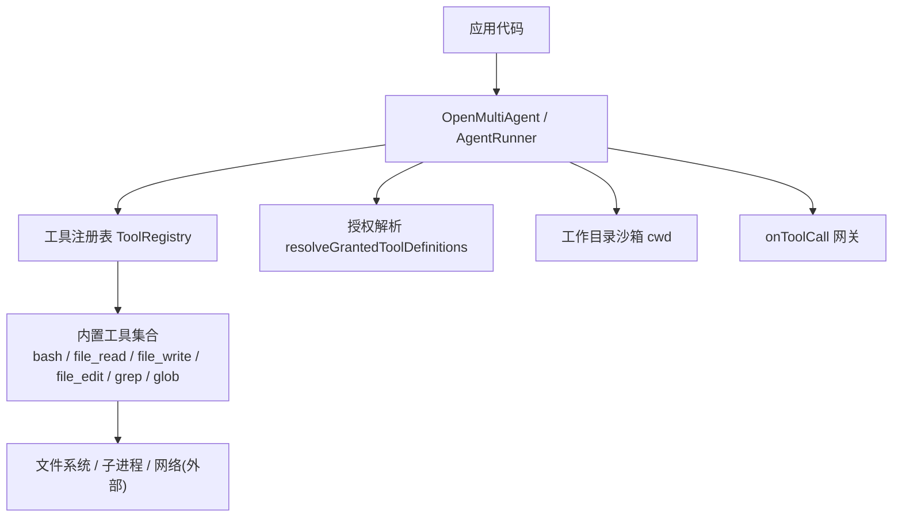
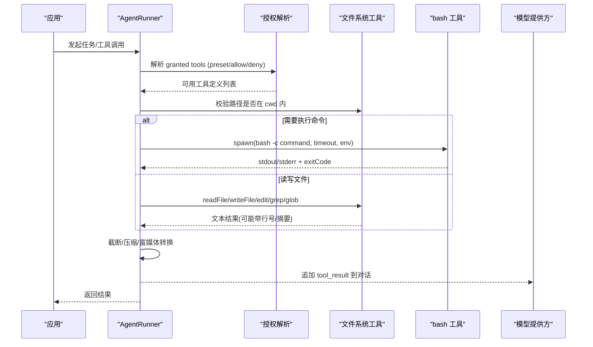
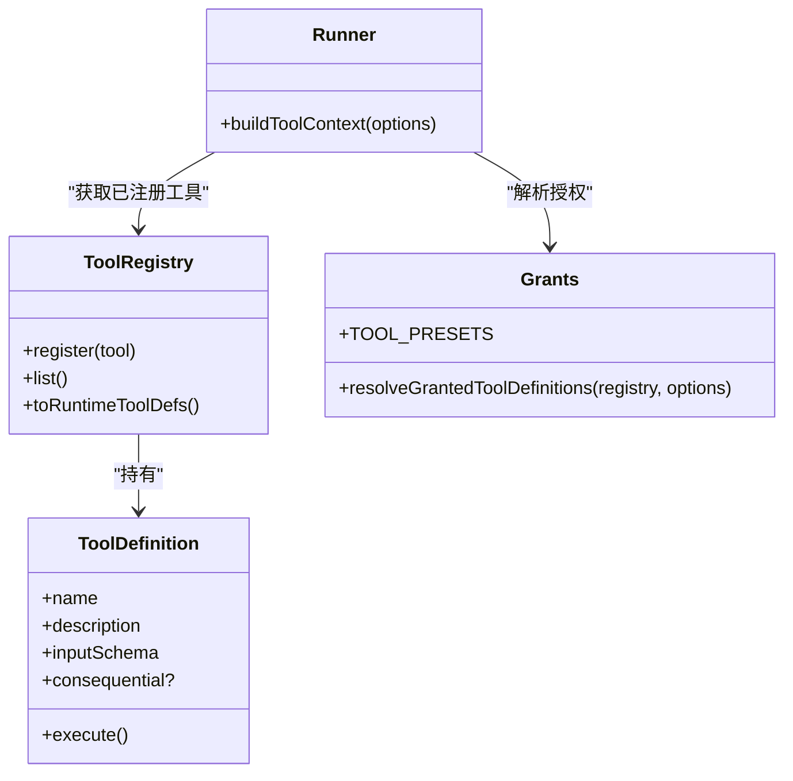

# 内置工具集

<cite>
**本文引用的文件**
- [README.md](file://packages/core/README.md)
- [tool-configuration.md](file://docs/tool-configuration.md)
- [index.ts（内置工具聚合）](file://packages/core/src/tool/built-in/index.ts)
- [bash.ts](file://packages/core/src/tool/built-in/bash.ts)
- [file-read.ts](file://packages/core/src/tool/built-in/file-read.ts)
- [file-write.ts](file://packages/core/src/tool/built-in/file-write.ts)
- [grants.ts](file://packages/core/src/tool/grants.ts)
- [types.ts](file://packages/core/src/types.ts)
- [runner.ts](file://packages/core/src/agent/runner.ts)
</cite>

## 目录
1. [简介](#简介)
2. [项目结构](#项目结构)
3. [核心组件](#核心组件)
4. [架构总览](#架构总览)
5. [详细组件分析](#详细组件分析)
6. [依赖关系分析](#依赖关系分析)
7. [性能考虑](#性能考虑)
8. [故障排查指南](#故障排查指南)
9. [结论](#结论)
10. [附录：常用场景与组合示例](#附录：常用场景与组合示例)

## 简介
本文件面向使用 Open Multi-Agent 的开发者，系统化说明框架提供的“内置工具集”的使用方法、安全限制、权限控制、错误处理与最佳实践。内置工具包括：
- 文件系统工具：读取、写入、编辑、搜索、匹配等
- 进程执行工具：命令执行、脚本运行
- 数据处理工具：JSON/结构化输出校验、文本压缩与截断
- 其他实用工具：代理委派、MCP 工具桥接、结果富媒体支持

所有内置工具默认禁用（default-deny），必须通过显式授权或预设启用；工具输出会进入模型对话上下文，需谨慎授予读/写/执行权限。

## 项目结构
内置工具位于 core 包的 tool/built-in 目录，并通过统一入口注册到工具注册表；工具授权策略由 grants 模块提供；运行时上下文与安全边界由 runner 与 types 定义。

图表来源
- [index.ts（内置工具聚合）:1-75](file://packages/core/src/tool/built-in/index.ts#L1-L75)
- [grants.ts:1-90](file://packages/core/src/tool/grants.ts#L1-L90)
- [runner.ts:1795-1811](file://packages/core/src/agent/runner.ts#L1795-L1811)
- [types.ts:544-570](file://packages/core/src/types.ts#L544-L570)

章节来源
- [README.md:224-308](file://packages/core/README.md#L224-L308)
- [tool-configuration.md:214-290](file://docs/tool-configuration.md#L214-L290)

## 核心组件
- 内置工具集合：提供 bash、file_read、file_write、file_edit、grep、glob 以及可选的 delegate_to_agent。
- 授权与预设：readonly/readwrite/full 三种预设，配合 allowlist/denylist 精确控制。
- 工作目录沙箱：文件系统工具路径必须在配置的 cwd 内解析，防止越权访问。
- 工具调用网关：onToolCall 可在每次调用前进行白名单/黑名单、风险分级、人工审批或挂起。
- 结果与上下文：工具返回数据可被截断、压缩，富媒体内容按适配器映射到模型侧。

章节来源
- [index.ts（内置工具聚合）:1-75](file://packages/core/src/tool/built-in/index.ts#L1-L75)
- [grants.ts:10-15](file://packages/core/src/tool/grants.ts#L10-L15)
- [tool-configuration.md:391-441](file://docs/tool-configuration.md#L391-L441)
- [tool-configuration.md:326-363](file://docs/tool-configuration.md#L326-L363)

## 架构总览
下图展示一次工具调用的完整链路：从编排器构建上下文、授权判定、沙箱校验、工具执行到结果回传与压缩。

图表来源
- [runner.ts:1795-1811](file://packages/core/src/agent/runner.ts#L1795-L1811)
- [grants.ts:33-89](file://packages/core/src/tool/grants.ts#L33-L89)
- [file-read.ts:17-112](file://packages/core/src/tool/built-in/file-read.ts#L17-L112)
- [file-write.ts:18-89](file://packages/core/src/tool/built-in/file-write.ts#L18-L89)
- [bash.ts:37-79](file://packages/core/src/tool/built-in/bash.ts#L37-L79)

## 详细组件分析

### 文件系统工具
- file_read
  - 功能：读取文件并返回带行号的内容；支持 offset/limit 分块读取大文件。
  - 参数：path（绝对路径）、offset（起始行，1-based）、limit（最大行数）。
  - 返回：字符串；错误时 isError=true。
  - 安全：路径必须在 cwd 内解析，拒绝越界路径。
  - 参考实现路径：[file-read.ts:17-112](file://packages/core/src/tool/built-in/file-read.ts#L17-L112)

- file_write
  - 功能：创建或覆盖文件，自动创建父目录。
  - 参数：path（绝对路径）、content（字符串）。
  - 返回：包含创建/更新状态、行数和字节数的提示；错误时 isError=true。
  - 安全：路径必须在 cwd 内解析；标记为 consequential。
  - 参考实现路径：[file-write.ts:18-89](file://packages/core/src/tool/built-in/file-write.ts#L18-L89)

- file_edit、grep、glob
  - 功能：就地编辑、正则搜索、模式匹配。
  - 安全：均受 cwd 沙箱约束。
  - 参考实现路径：[index.ts（内置工具聚合）:1-75](file://packages/core/src/tool/built-in/index.ts#L1-L75)

章节来源
- [file-read.ts:17-112](file://packages/core/src/tool/built-in/file-read.ts#L17-L112)
- [file-write.ts:18-89](file://packages/core/src/tool/built-in/file-write.ts#L18-L89)
- [index.ts（内置工具聚合）:1-75](file://packages/core/src/tool/built-in/index.ts#L1-L75)
- [tool-configuration.md:391-441](file://docs/tool-configuration.md#L391-L441)

### 进程执行工具（bash）
- 功能：以非交互式 shell 执行命令，捕获 stdout/stderr，支持超时和自定义工作目录。
- 参数：command、timeout（毫秒）、cwd。
- 返回：合并后的输出文本；exitCode≠0 时 isError=true。
- 安全与环境：
  - 环境变量白名单过滤，敏感变量名会被排除。
  - 超时/中止信号会终止整个进程树，避免后台进程泄漏。
  - 标记为 consequential，需显式授权。
- 参考实现路径：[bash.ts:37-79](file://packages/core/src/tool/built-in/bash.ts#L37-L79)、[bash.ts:96-207](file://packages/core/src/tool/built-in/bash.ts#L96-L207)

章节来源
- [bash.ts:37-79](file://packages/core/src/tool/built-in/bash.ts#L37-L79)
- [bash.ts:96-207](file://packages/core/src/tool/built-in/bash.ts#L96-L207)
- [tool-configuration.md:214-238](file://docs/tool-configuration.md#L214-L238)

### 数据处理与结果控制
- 输入/输出校验：工具可使用 inputSchema 与 outputSchema 对参数与结果进行 Zod 校验。
- 结果大小控制：maxToolOutputChars 可截断单个工具结果；compressToolResults 可对历史结果压缩以减少后续 token 消耗。
- 富媒体结果：可通过 modelOutput 返回 text/image/file，适配器负责映射到模型协议。
- 参考路径：
  - 结果控制与富媒体：[tool-configuration.md:507-649](file://docs/tool-configuration.md#L507-L649)
  - 类型定义中的 ToolResult：[types.ts:676-691](file://packages/core/src/types.ts#L676-L691)

章节来源
- [tool-configuration.md:507-649](file://docs/tool-configuration.md#L507-L649)
- [types.ts:676-691](file://packages/core/src/types.ts#L676-L691)

### 其他实用工具
- delegate_to_agent：团队编排中用于将任务委派给其他 agent（需在团队注册表中启用）。
- MCP 工具：通过 connectMCPTools 接入外部 MCP 服务，将其工具暴露给 agent。
- 参考路径：
  - 委派工具注册：[index.ts（内置工具聚合）:20-50](file://packages/core/src/tool/built-in/index.ts#L20-L50)
  - MCP 集成说明：[tool-configuration.md:675-709](file://docs/tool-configuration.md#L675-L709)

章节来源
- [index.ts（内置工具聚合）:20-50](file://packages/core/src/tool/built-in/index.ts#L20-L50)
- [tool-configuration.md:675-709](file://docs/tool-configuration.md#L675-L709)

## 依赖关系分析
- 工具注册与授权：
  - 内置工具在 index.ts 中集中导出并注册。
  - grants.ts 提供 TOOL_PRESETS 与 resolveGrantedToolDefinitions，决定最终可用工具集合。
- 运行时上下文：
  - runner.ts 构建 ToolUseContext，注入 agent、abortSignal、cwd、credentials 等。
  - types.ts 定义 ToolUseContext、ToolResult、OrchestratorConfig/AgentConfig 的关键字段。

图表来源
- [index.ts（内置工具聚合）:1-75](file://packages/core/src/tool/built-in/index.ts#L1-L75)
- [grants.ts:10-89](file://packages/core/src/tool/grants.ts#L10-L89)
- [runner.ts:1795-1811](file://packages/core/src/agent/runner.ts#L1795-L1811)

章节来源
- [grants.ts:10-89](file://packages/core/src/tool/grants.ts#L10-L89)
- [runner.ts:1795-1811](file://packages/core/src/agent/runner.ts#L1795-L1811)

## 性能考虑
- 大文件读取：使用 file_read 的 offset/limit 分块读取，避免一次性加载导致上下文爆炸。
- 结果压缩：开启 compressToolResults，减少历史结果的 token 占用。
- 超时与中止：bash 工具默认超时，结合 AbortSignal 及时释放资源。
- 富媒体传输：优先使用 URL 引用而非内联 base64，降低请求体大小。
- 工具输出上限：设置 maxToolOutputChars 控制单次结果长度。

章节来源
- [file-read.ts:25-45](file://packages/core/src/tool/built-in/file-read.ts#L25-L45)
- [tool-configuration.md:507-649](file://docs/tool-configuration.md#L507-L649)
- [bash.ts:47-60](file://packages/core/src/tool/built-in/bash.ts#L47-L60)

## 故障排查指南
- 工具未授权：若模型调用了一个未授予的工具，会返回“not granted”错误。检查 tools/toolPreset/disallowedTools 配置。
- 路径越界：文件系统工具抛出路径不在 cwd 的错误。确认 cwd 设置与路径是否为绝对路径。
- bash 超时/中止：检查 timeout 与 AbortSignal；必要时调整命令复杂度或拆分任务。
- 结果过大：启用 maxToolOutputChars 或 compressToolResults；对富媒体使用 URL 引用。
- 环境泄露：bash 仅允许白名单环境变量；如需更多变量，请在 onToolCall 中做策略控制。

章节来源
- [tool-configuration.md:214-238](file://docs/tool-configuration.md#L214-L238)
- [tool-configuration.md:391-441](file://docs/tool-configuration.md#L391-L441)
- [bash.ts:19-31](file://packages/core/src/tool/built-in/bash.ts#L19-L31)

## 结论
内置工具集提供了安全的文件系统操作、命令执行与数据处理能力，并通过默认禁用、沙箱、授权与网关机制确保最小权限原则。建议在生产环境中：
- 明确授予必要工具，避免全量开放。
- 合理设置 cwd 沙箱与 onToolCall 策略。
- 使用结果截断与压缩控制成本。
- 对高风险命令进行风险分类与人工审批。

## 附录：常用场景与组合示例
- 只读分析：授予 readonly 预设（file_read、grep、glob），配合 compressToolResults 与 maxToolOutputChars。
- 代码编辑：授予 readwrite 预设（含 file_edit），限制 cwd 到项目目录。
- 命令执行：授予 full 预设（含 bash），使用 onToolCall 对危险命令进行拦截或审批。
- 复杂流水线：组合 file_read → grep → file_edit → bash，逐步验证与回滚。
- 富媒体报告：工具返回 image/file 的 modelOutput，使用 URL 引用以降低开销。

章节来源
- [tool-configuration.md:251-289](file://docs/tool-configuration.md#L251-L289)
- [tool-configuration.md:507-649](file://docs/tool-configuration.md#L507-L649)
- [index.ts（内置工具聚合）:1-75](file://packages/core/src/tool/built-in/index.ts#L1-L75)