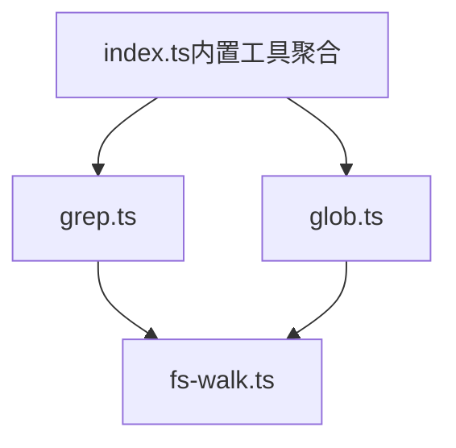
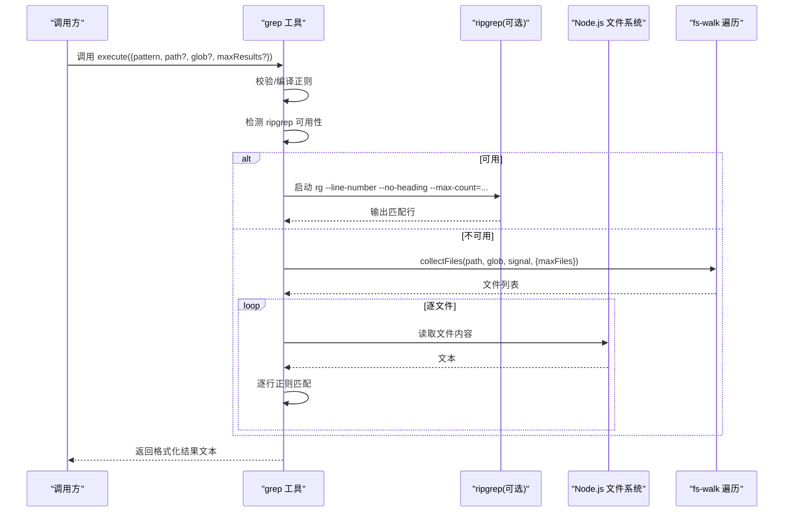
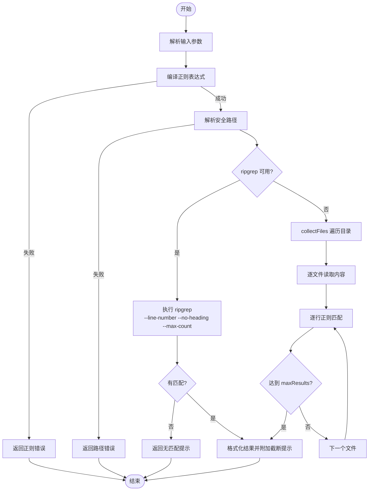
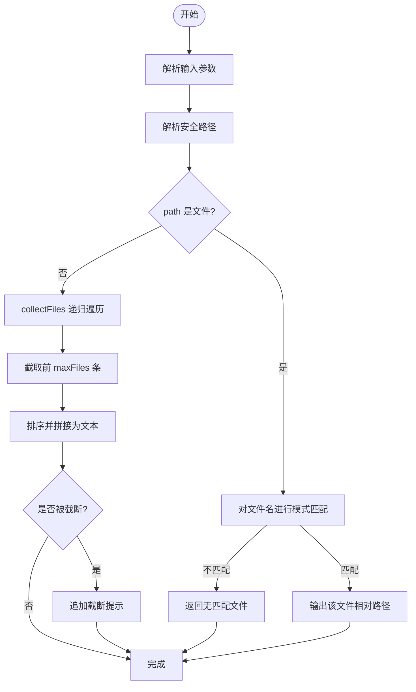
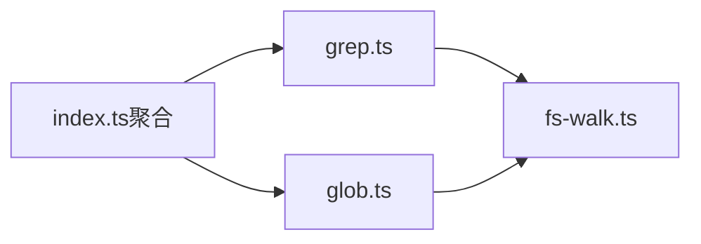

# 搜索查找工具

<cite>
**本文引用的文件**
- [grep.ts](file://packages/core/src/tool/built-in/grep.ts)
- [glob.ts](file://packages/core/src/tool/built-in/glob.ts)
- [fs-walk.ts](file://packages/core/src/tool/built-in/fs-walk.ts)
- [index.ts（内置工具聚合）](file://packages/core/src/tool/built-in/index.ts)
- [built-in-tools.test.ts](file://packages/core/tests/built-in-tools.test.ts)
</cite>

## 目录
1. [简介](#简介)
2. [项目结构](#项目结构)
3. [核心组件](#核心组件)
4. [架构总览](#架构总览)
5. [详细组件分析](#详细组件分析)
6. [依赖关系分析](#依赖关系分析)
7. [性能考虑](#性能考虑)
8. [故障排查指南](#故障排查指南)
9. [结论](#结论)
10. [附录：API 参考与示例](#附录api-参考与示例)

## 简介
本文件为“搜索查找工具”的完整使用文档，覆盖 grep 与 glob 两大工具的用途、参数、返回值、行为边界与最佳实践。grep 用于在文件内容中按正则表达式搜索匹配行；glob 用于列出符合文件名模式的文件路径（不读取文件内容）。两者均支持安全路径限制、跳过常见大目录、结果上限控制与可中断执行。

## 项目结构
搜索相关能力集中在 packages/core/src/tool/built-in 目录下：
- grep.ts：实现 grep 工具（优先调用外部 ripgrep，回退到 Node.js 递归实现）
- glob.ts：实现 glob 工具（列出匹配的文件路径）
- fs-walk.ts：提供统一的递归遍历与最小化 glob 匹配逻辑
- index.ts：聚合导出所有内置工具，便于统一注册

图表来源
- [grep.ts:29-108](file://packages/core/src/tool/built-in/grep.ts#L29-L108)
- [glob.ts:18-106](file://packages/core/src/tool/built-in/glob.ts#L18-L106)
- [fs-walk.ts:31-84](file://packages/core/src/tool/built-in/fs-walk.ts#L31-L84)
- [index.ts:15-44](file://packages/core/src/tool/built-in/index.ts#L15-L44)

章节来源
- [grep.ts:1-108](file://packages/core/src/tool/built-in/grep.ts#L1-L108)
- [glob.ts:1-106](file://packages/core/src/tool/built-in/glob.ts#L1-L106)
- [fs-walk.ts:1-100](file://packages/core/src/tool/built-in/fs-walk.ts#L1-L100)
- [index.ts:1-75](file://packages/core/src/tool/built-in/index.ts#L1-L75)

## 核心组件
- grep 工具：在文件或目录中按正则表达式搜索匹配行，返回“文件:行号:内容”形式的文本结果，支持 glob 过滤、最大结果数限制、可中断执行。
- glob 工具：列出目录或文件下匹配文件名模式的路径，不读取文件内容，支持递归、跳过常见大目录、结果上限与排序输出。
- 文件系统遍历：统一的 collectFiles 与 SKIP_DIRS，确保一致性与安全性。

章节来源
- [grep.ts:29-108](file://packages/core/src/tool/built-in/grep.ts#L29-L108)
- [glob.ts:18-106](file://packages/core/src/tool/built-in/glob.ts#L18-L106)
- [fs-walk.ts:11-84](file://packages/core/src/tool/built-in/fs-walk.ts#L11-L84)

## 架构总览
grep 的执行流程优先尝试外部 ripgrep 以获得高性能；若不可用则回退到 Node.js 递归实现。glob 通过统一的目录遍历模块收集文件并应用文件名模式匹配。

图表来源
- [grep.ts:69-108](file://packages/core/src/tool/built-in/grep.ts#L69-L108)
- [grep.ts:122-193](file://packages/core/src/tool/built-in/grep.ts#L122-L193)
- [grep.ts:205-273](file://packages/core/src/tool/built-in/grep.ts#L205-L273)
- [fs-walk.ts:31-84](file://packages/core/src/tool/built-in/fs-walk.ts#L31-L84)

## 详细组件分析

### grep 工具
- 功能要点
  - 正则表达式搜索：支持任意 JS 正则语法，错误正则立即返回错误。
  - 多行匹配：按行扫描匹配，每行独立判断。
  - 上下文显示：当前实现返回“文件:行号:匹配行”，不包含前后上下文行。
  - 结果过滤：可通过 glob 参数限定搜索范围（仅当 path 为目录时生效）。
  - 结果上限：默认限制返回行数，避免响应过大。
  - 性能策略：优先使用 ripgrep；不可用时回退到 Node.js 递归实现。
  - 安全与中止：基于工作目录的安全路径解析；支持 AbortSignal 中断。

- 输入参数
  - pattern: 字符串，必填，正则表达式
  - path: 字符串，可选，绝对目录或文件路径；默认使用工具工作目录
  - glob: 字符串，可选，文件名模式（如 "*.ts", "**/*.json"），仅在 path 为目录时生效
  - maxResults: 正整数，可选，最大匹配行数；默认值由实现定义

- 返回值
  - 成功：data 为多行文本，格式为“文件:行号:内容”；若无匹配返回“未找到匹配项”提示
  - 失败：isError=true，data 包含错误信息（如正则非法、路径不可访问等）

- 关键流程
  - 正则编译与校验
  - 路径安全校验
  - ripgrep 优先执行，否则 Node.js 递归
  - 结果截断与提示

图表来源
- [grep.ts:69-108](file://packages/core/src/tool/built-in/grep.ts#L69-L108)
- [grep.ts:122-193](file://packages/core/src/tool/built-in/grep.ts#L122-L193)
- [grep.ts:205-273](file://packages/core/src/tool/built-in/grep.ts#L205-L273)

章节来源
- [grep.ts:29-108](file://packages/core/src/tool/built-in/grep.ts#L29-L108)
- [grep.ts:122-193](file://packages/core/src/tool/built-in/grep.ts#L122-L193)
- [grep.ts:205-273](file://packages/core/src/tool/built-in/grep.ts#L205-L273)
- [built-in-tools.test.ts:709-769](file://packages/core/tests/built-in-tools.test.ts#L709-L769)

### glob 工具
- 功能要点
  - 列出匹配文件名的路径，不读取文件内容
  - 支持递归遍历子目录，跳过常见大目录（如 node_modules、.git、dist 等）
  - 支持单文件模式：当 path 指向文件时，仅对该文件名进行模式匹配
  - 结果排序与上限：结果按字典序排序，支持 maxFiles 限制与截断提示
  - 安全与中止：基于工作目录的安全路径解析；支持 AbortSignal 中断

- 输入参数
  - path: 字符串，可选，绝对目录或文件路径；默认使用工具工作目录
  - pattern: 字符串，可选，文件名模式（如 "*.ts", "**/*.json"）
  - maxFiles: 正整数，可选，最大返回路径数；默认值由实现定义

- 返回值
  - 成功：data 为多行文本，每行一个相对路径；若无匹配返回“无匹配文件”提示
  - 失败：isError=true，data 包含错误信息（如路径不可访问）

- 关键流程
  - 路径安全校验
  - 单文件/目录分支处理
  - 统一遍历 collectFiles 与 matchesGlob
  - 结果截断与排序

图表来源
- [glob.ts:18-106](file://packages/core/src/tool/built-in/glob.ts#L18-L106)
- [fs-walk.ts:31-84](file://packages/core/src/tool/built-in/fs-walk.ts#L31-L84)

章节来源
- [glob.ts:18-106](file://packages/core/src/tool/built-in/glob.ts#L18-L106)
- [fs-walk.ts:11-84](file://packages/core/src/tool/built-in/fs-walk.ts#L11-L84)
- [built-in-tools.test.ts:570-703](file://packages/core/tests/built-in-tools.test.ts#L570-L703)

### 文件系统遍历与模式匹配
- collectFiles：递归遍历目录，跳过指定目录集合，支持信号中断与最大文件数限制
- matchesGlob：最小化 glob 匹配，支持 *.ext 与 **/pattern 形式，大小写不敏感

章节来源
- [fs-walk.ts:11-100](file://packages/core/src/tool/built-in/fs-walk.ts#L11-L100)

## 依赖关系分析
- grep 与 glob 都依赖 fs-walk 提供的统一遍历与匹配逻辑，保证行为一致
- 两者均依赖路径安全模块（不在本节展开）与工作目录上下文
- 内置工具聚合模块将 grep 与 glob 暴露给上层注册机制

图表来源
- [grep.ts:15-17](file://packages/core/src/tool/built-in/grep.ts#L15-L17)
- [glob.ts:12-14](file://packages/core/src/tool/built-in/glob.ts#L12-L14)
- [index.ts:15-44](file://packages/core/src/tool/built-in/index.ts#L15-L44)

章节来源
- [index.ts:15-44](file://packages/core/src/tool/built-in/index.ts#L15-L44)

## 性能考虑
- 优先使用 ripgrep：具备更快的二进制搜索能力，适合大规模代码库
- 合理设置 maxResults/maxFiles：避免返回过多数据导致响应过大
- 使用 glob 缩小搜索范围：例如只搜索 *.ts 或特定子目录
- 利用 AbortSignal：在长时间任务中支持中断，避免资源浪费
- 跳过不必要目录：内置已跳过 node_modules、.git、dist 等
- 避免重复读取：glob 不读取文件内容，grep 仅在必要时读取匹配文件

[本节为通用指导，无需具体文件引用]

## 故障排查指南
- 正则表达式错误：检查 pattern 是否为合法正则；错误会直接返回错误信息
- 路径不可访问：确认路径存在且可读；错误会包含“无法访问路径”提示
- 无匹配结果：glob 返回“无匹配文件”，grep 返回“未找到匹配项”
- 结果被截断：注意返回文本末尾的截断提示，适当提高 maxResults/maxFiles
- ripgrep 进程错误：若外部进程异常，会返回错误提示并可重试 Node.js 回退路径

章节来源
- [grep.ts:79-88](file://packages/core/src/tool/built-in/grep.ts#L79-L88)
- [grep.ts:153-191](file://packages/core/src/tool/built-in/grep.ts#L153-L191)
- [glob.ts:84-90](file://packages/core/src/tool/built-in/glob.ts#L84-L90)
- [built-in-tools.test.ts:725-746](file://packages/core/tests/built-in-tools.test.ts#L725-L746)

## 结论
grep 与 glob 提供了高效、安全的文件内容与路径搜索能力。通过 ripgrep 优先策略、统一遍历与安全路径控制、结果上限与可中断执行，能够在大规模项目中稳定运行。建议结合 glob 缩小范围、合理设置上限、利用正则精确匹配，以获得最佳性能与体验。

[本节为总结性内容，无需具体文件引用]

## 附录：API 参考与示例

### grep 工具 API
- 名称：grep
- 描述：在文件内容中按正则表达式搜索匹配行，返回“文件:行号:内容”
- 输入参数
  - pattern: 字符串，必填，正则表达式
  - path: 字符串，可选，绝对目录或文件路径；默认使用工具工作目录
  - glob: 字符串，可选，文件名模式（如 "*.ts", "**/*.json"），仅在 path 为目录时生效
  - maxResults: 正整数，可选，最大匹配行数；默认值由实现定义
- 返回值
  - 成功：data 为多行文本；若无匹配返回“未找到匹配项”提示
  - 失败：isError=true，data 包含错误信息

章节来源
- [grep.ts:29-67](file://packages/core/src/tool/built-in/grep.ts#L29-L67)
- [grep.ts:69-108](file://packages/core/src/tool/built-in/grep.ts#L69-L108)
- [grep.ts:205-273](file://packages/core/src/tool/built-in/grep.ts#L205-L273)

### glob 工具 API
- 名称：glob
- 描述：列出目录或文件下匹配文件名模式的路径，不读取文件内容
- 输入参数
  - path: 字符串，可选，绝对目录或文件路径；默认使用工具工作目录
  - pattern: 字符串，可选，文件名模式（如 "*.ts", "**/*.json"）
  - maxFiles: 正整数，可选，最大返回路径数；默认值由实现定义
- 返回值
  - 成功：data 为多行文本，每行一个相对路径；若无匹配返回“无匹配文件”提示
  - 失败：isError=true，data 包含错误信息

章节来源
- [glob.ts:18-49](file://packages/core/src/tool/built-in/glob.ts#L18-L49)
- [glob.ts:51-106](file://packages/core/src/tool/built-in/glob.ts#L51-L106)

### 使用示例（来自测试用例的行为说明）
- glob：列出匹配 *.ts 的文件，不读取内容
- glob：省略 pattern 时列出所有文件
- glob：path 为单文件时仅匹配该文件名
- glob：单文件不匹配时返回“无匹配文件”
- glob：递归进入子目录并匹配深层文件
- glob：不跟随沙箱外的符号链接
- glob：路径不可访问时报错
- glob：超过 maxFiles 时返回截断提示
- grep：在文件中查找匹配行
- grep：无匹配时返回“未找到匹配项”
- grep：非法正则返回错误
- grep：递归搜索目录
- grep：通过 glob 过滤文件类型

章节来源
- [built-in-tools.test.ts:570-703](file://packages/core/tests/built-in-tools.test.ts#L570-L703)
- [built-in-tools.test.ts:709-769](file://packages/core/tests/built-in-tools.test.ts#L709-L769)