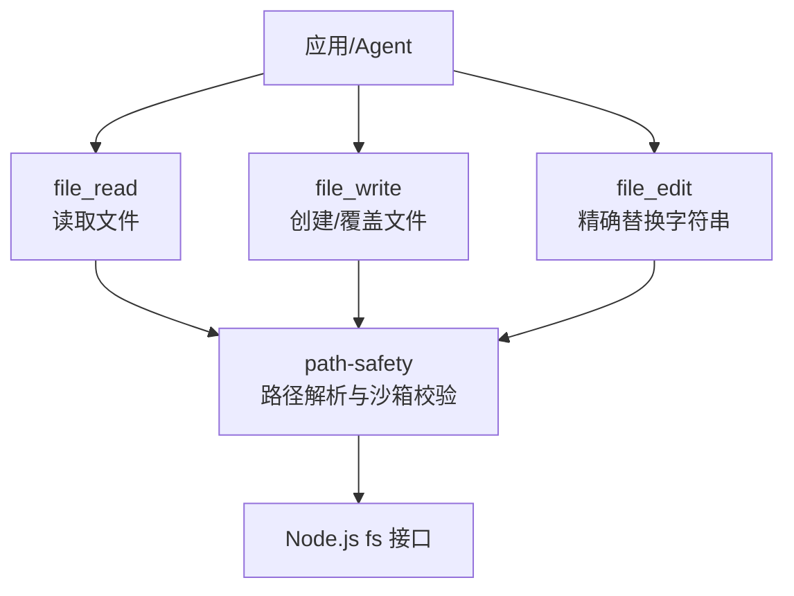
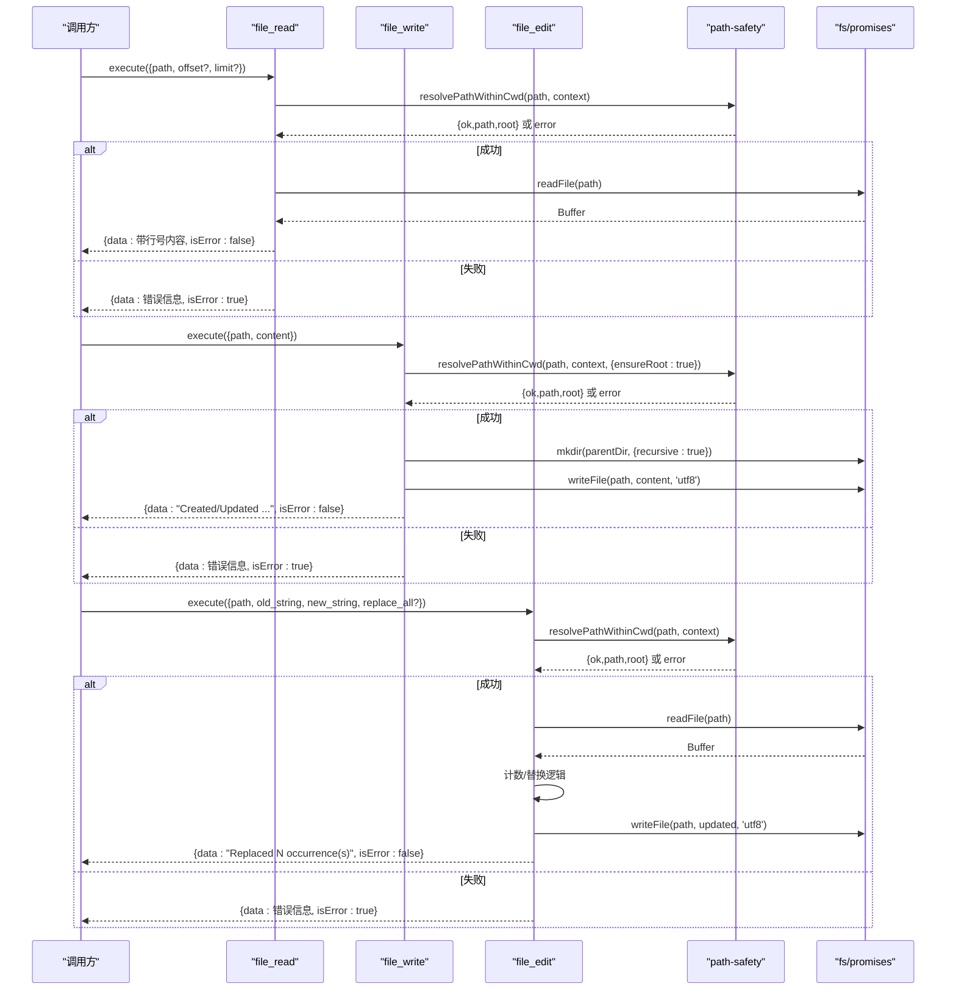
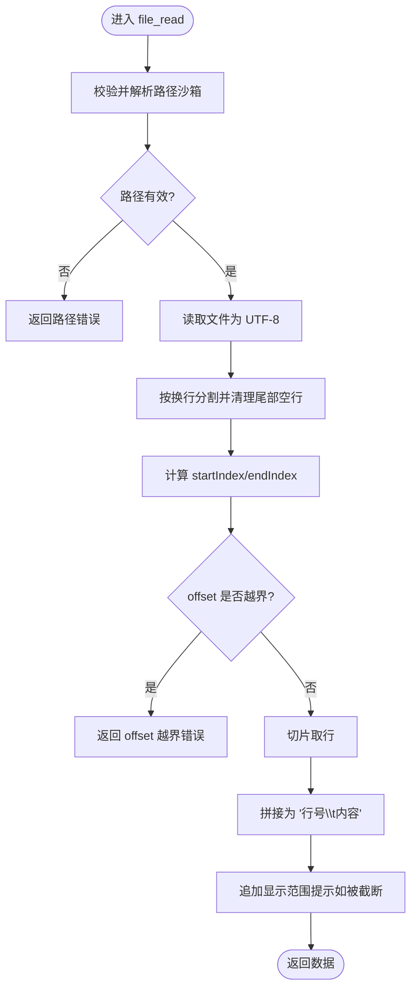
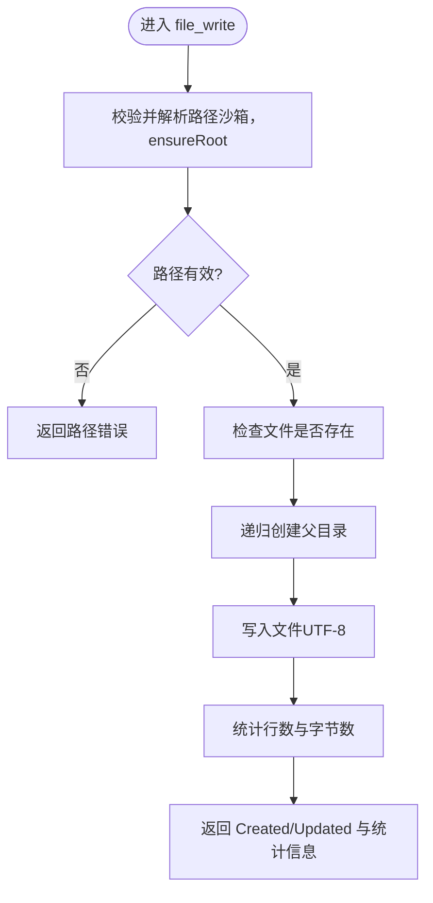
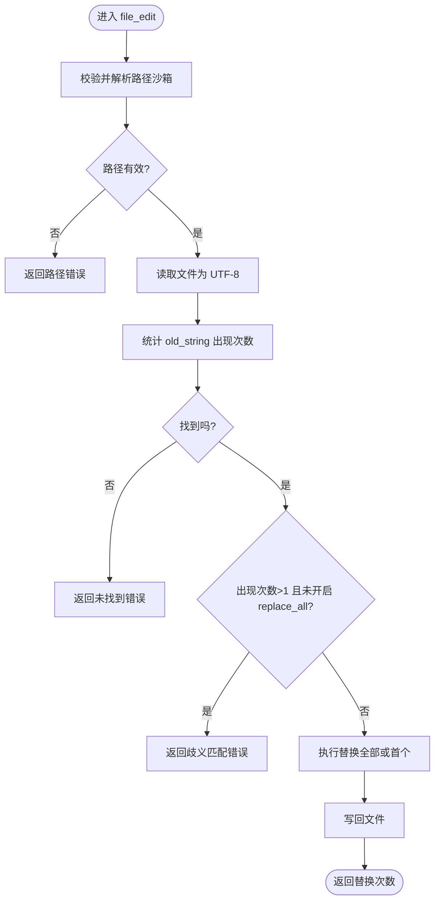
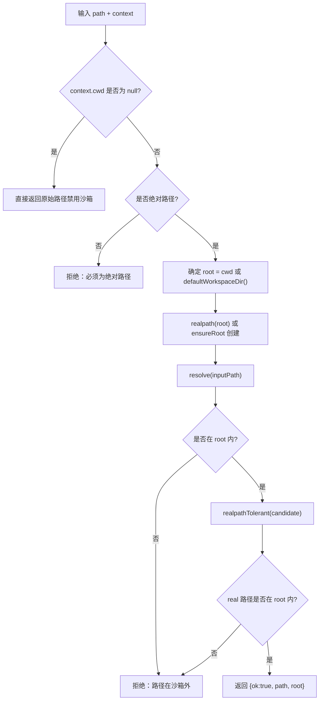
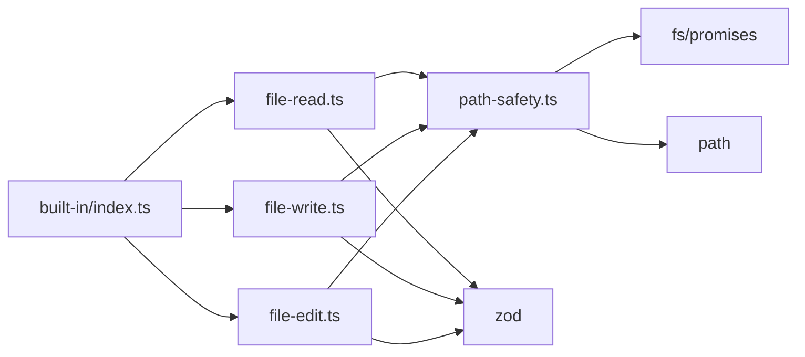

# 文件系统工具

<cite>
**本文引用的文件**
- [file-read.ts](file://packages/core/src/tool/built-in/file-read.ts)
- [file-write.ts](file://packages/core/src/tool/built-in/file-write.ts)
- [file-edit.ts](file://packages/core/src/tool/built-in/file-edit.ts)
- [path-safety.ts](file://packages/core/src/tool/built-in/path-safety.ts)
- [index.ts（内置工具集合）](file://packages/core/src/tool/built-in/index.ts)
- [types.ts（上下文与配置类型）](file://packages/core/src/types.ts)
- [built-in-tools.test.ts（测试用例）](file://packages/core/tests/built-in-tools.test.ts)
</cite>

## 目录
1. [简介](#简介)
2. [项目结构](#项目结构)
3. [核心组件](#核心组件)
4. [架构总览](#架构总览)
5. [详细组件分析](#详细组件分析)
6. [依赖关系分析](#依赖关系分析)
7. [性能注意事项](#性能注意事项)
8. [故障排查指南](#故障排查指南)
9. [结论](#结论)
10. [附录：API 参考与示例路径](#附录api-参考与示例路径)

## 简介
本文件面向使用 Open Multi Agent 内置文件系统工具的开发者，系统性说明 fileReadTool、fileWriteTool、fileEditTool 的功能、参数、错误处理、安全沙箱机制以及最佳实践。文档同时提供流程图与时序图帮助理解调用链路，并给出常见问题的定位方法。

## 项目结构
文件系统工具位于 core 包的内置工具集中，围绕“读取/写入/编辑”三类能力构建，并通过统一的路径安全模块进行沙箱校验。

图表来源
- [file-read.ts:17-111](file://packages/core/src/tool/built-in/file-read.ts#L17-L111)
- [file-write.ts:18-88](file://packages/core/src/tool/built-in/file-write.ts#L18-L88)
- [file-edit.ts:18-118](file://packages/core/src/tool/built-in/file-edit.ts#L18-L118)
- [path-safety.ts:30-97](file://packages/core/src/tool/built-in/path-safety.ts#L30-L97)

章节来源
- [index.ts（内置工具集合）:1-75](file://packages/core/src/tool/built-in/index.ts#L1-L75)
- [types.ts（上下文与配置类型）:544-557](file://packages/core/src/types.ts#L544-L557)

## 核心组件
- fileReadTool：按行号返回文件内容，支持 offset/limit 分页读取大文件。
- fileWriteTool：创建或覆盖文件，自动创建父目录；可区分新建与更新。
- fileEditTool：对已有文件进行精确字符串替换，默认要求匹配唯一，可选 replace_all。
- path-safety：统一的路径安全与沙箱控制，强制绝对路径、限制在 cwd 内、解析符号链接、按需自动创建沙箱根目录。

章节来源
- [file-read.ts:17-111](file://packages/core/src/tool/built-in/file-read.ts#L17-L111)
- [file-write.ts:18-88](file://packages/core/src/tool/built-in/file-write.ts#L18-L88)
- [file-edit.ts:18-118](file://packages/core/src/tool/built-in/file-edit.ts#L18-L118)
- [path-safety.ts:30-97](file://packages/core/src/tool/built-in/path-safety.ts#L30-L97)

## 架构总览
三个工具共享相同的执行模型：接收输入参数 -> 通过 path-safety 校验并解析为安全路径 -> 调用 Node.js fs 完成操作 -> 返回结构化结果（data + isError）。

图表来源
- [file-read.ts:47-111](file://packages/core/src/tool/built-in/file-read.ts#L47-L111)
- [file-write.ts:37-88](file://packages/core/src/tool/built-in/file-write.ts#L37-L88)
- [file-edit.ts:50-118](file://packages/core/src/tool/built-in/file-edit.ts#L50-L118)
- [path-safety.ts:30-97](file://packages/core/src/tool/built-in/path-safety.ts#L30-L97)

## 详细组件分析

### fileReadTool（读取文件）
- 功能要点
  - 以“行号\t内容”的格式返回内容，便于定位。
  - 支持 offset（从第几行开始，1 基）和 limit（最多返回行数），适合大文件分块读取。
  - 若未读取完整文件，会在末尾附加提示，告知显示范围。
- 参数
  - path：必须为绝对路径。
  - offset：可选，非负整数，1 基起始行。
  - limit：可选，正整数，最大返回行数。
- 行为与边界
  - 当 offset 超出文件行数时返回错误。
  - 读取失败（如不存在、无权限）返回错误信息。
- 错误处理
  - 捕获 fs 异常并转换为可读的错误消息，isError=true。
- 性能建议
  - 大文件务必使用 offset/limit 分段读取，避免一次性加载到内存。

图表来源
- [file-read.ts:47-111](file://packages/core/src/tool/built-in/file-read.ts#L47-L111)

章节来源
- [file-read.ts:17-111](file://packages/core/src/tool/built-in/file-read.ts#L17-L111)
- [built-in-tools.test.ts:92-154](file://packages/core/tests/built-in-tools.test.ts#L92-L154)

### fileWriteTool（创建/覆盖文件）
- 功能要点
  - 写入内容到指定绝对路径；若文件不存在则创建，存在则覆盖。
  - 自动创建缺失的父目录（等价于 mkdir -p）。
  - 返回“Created/Updated”及行数、字节数统计。
- 参数
  - path：必须为绝对路径。
  - content：要写入的完整内容。
- 行为与边界
  - 首次写入会确保沙箱根目录存在（仅写工具启用 ensureRoot）。
  - 写入失败（磁盘、权限等）返回错误。
- 错误处理
  - 目录创建失败、写入失败均捕获并返回错误信息。

图表来源
- [file-write.ts:37-88](file://packages/core/src/tool/built-in/file-write.ts#L37-L88)
- [path-safety.ts:30-97](file://packages/core/src/tool/built-in/path-safety.ts#L30-L97)

章节来源
- [file-write.ts:18-88](file://packages/core/src/tool/built-in/file-write.ts#L18-L88)
- [built-in-tools.test.ts:160-213](file://packages/core/tests/built-in-tools.test.ts#L160-L213)

### fileEditTool（精确替换）
- 功能要点
  - 在已有文件中精确替换 old_string 为 new_string。
  - 默认要求 old_string 在文件中唯一出现；否则报错，需提供更精确的匹配串或设置 replace_all=true。
  - 不依赖正则，避免转义问题与注入风险。
- 参数
  - path：必须为绝对路径。
  - old_string：原样匹配的旧字符串（含空白与换行）。
  - new_string：新字符串。
  - replace_all：可选布尔值，是否替换所有匹配项。
- 行为与边界
  - 找不到 old_string 时报错。
  - 多次匹配且未开启 replace_all 时报错。
  - 写入失败返回错误。
- 复杂度
  - 查找与替换基于线性扫描，时间复杂度 O(n)，空间复杂度 O(n)。

图表来源
- [file-edit.ts:50-118](file://packages/core/src/tool/built-in/file-edit.ts#L50-L118)

章节来源
- [file-edit.ts:18-118](file://packages/core/src/tool/built-in/file-edit.ts#L18-L118)
- [built-in-tools.test.ts:219-286](file://packages/core/tests/built-in-tools.test.ts#L219-L286)

### 路径安全与沙箱（path-safety）
- 默认工作区
  - 默认沙箱根为 <process.cwd()>/'.agent-workspace'，避免意外访问宿主项目敏感文件。
- 规则
  - 强制绝对路径；相对路径直接拒绝。
  - 将候选路径解析为真实路径（解析符号链接），并校验其位于沙箱根内。
  - 读工具不会自动创建沙箱根；写工具可通过 ensureRoot 自动创建。
  - 允许通过 context.cwd=null 禁用沙箱（谨慎使用）。
- 配置入口
  - ToolUseContext.cwd：每调用可设置工作目录。
  - OrchestratorConfig.defaultCwd / AgentConfig.cwd：全局或 per-agent 默认工作目录。

图表来源
- [path-safety.ts:30-97](file://packages/core/src/tool/built-in/path-safety.ts#L30-L97)

章节来源
- [path-safety.ts:1-125](file://packages/core/src/tool/built-in/path-safety.ts#L1-L125)
- [types.ts（上下文与配置类型）:544-557](file://packages/core/src/types.ts#L544-L557)
- [types.ts（默认工作目录）:2245-2252](file://packages/core/src/types.ts#L2245-L2252)

## 依赖关系分析
- 工具注册与导出
  - 内置工具通过 index.ts 统一导出，并提供 registerBuiltInTools 批量注册。
- 外部依赖
  - Node.js fs/promises：文件读写、目录创建、状态查询。
  - path：路径解析、相对/绝对判断、basename/dirname。
  - z：输入参数校验（zod）。
- 耦合点
  - 三个工具均依赖 path-safety 进行路径安全校验，形成强内聚、低耦合的工具集。

图表来源
- [index.ts（内置工具集合）:1-75](file://packages/core/src/tool/built-in/index.ts#L1-L75)
- [file-read.ts:17-111](file://packages/core/src/tool/built-in/file-read.ts#L17-L111)
- [file-write.ts:18-88](file://packages/core/src/tool/built-in/file-write.ts#L18-L88)
- [file-edit.ts:18-118](file://packages/core/src/tool/built-in/file-edit.ts#L18-L118)
- [path-safety.ts:1-125](file://packages/core/src/tool/built-in/path-safety.ts#L1-L125)

章节来源
- [index.ts（内置工具集合）:1-75](file://packages/core/src/tool/built-in/index.ts#L1-L75)

## 性能注意事项
- 大文件读取
  - 使用 fileReadTool 的 offset/limit 分页读取，避免一次性加载整个文件。
- 写入优化
  - fileWriteTool 会自动创建父目录，减少额外系统调用；但频繁小文件写入仍可能产生开销，建议批量化或合并写入。
- 替换成本
  - fileEditTool 采用线性扫描，适用于中小文件；超大文件建议先评估文件大小或使用流式处理方案（当前实现为全量读取）。
- I/O 并发
  - 避免在同一目录下高并发大量随机读写，必要时串行化关键写入。
- 编码
  - 所有工具均以 UTF-8 编码读写，避免多字节字符导致的行计数偏差。

[本节为通用指导，无需特定文件引用]

## 故障排查指南
- 常见错误与定位
  - “路径必须为绝对路径”：检查传入 path 是否以 / 开头（或在 Windows 上为盘符绝对路径）。
  - “路径在沙箱外”：确认 context.cwd 或默认工作目录是否正确；如需访问外部路径，请调整 OrchestratorConfig.defaultCwd 或 AgentConfig.cwd，或谨慎设置为 null 禁用沙箱。
  - “offset 超出文件末尾”：调小 offset 或增大 limit。
  - “未找到要替换的字符串”：核对 old_string 与原文件完全一致（包括空格、换行）。
  - “歧义匹配”：提供更多上下文使 old_string 唯一，或设置 replace_all=true。
  - “无法创建目录/写入失败”：检查目标路径权限、磁盘空间、防病毒软件拦截等。
- 调试技巧
  - 优先打印 data 字段中的错误信息；isError=true 表示失败。
  - 对于大文件，先用 fileReadTool 的 limit=10 验证路径与内容片段。
  - 使用 fileWriteTool 的返回值中的“Created/Updated”与行数/字节数确认写入结果。

章节来源
- [built-in-tools.test.ts:403-563](file://packages/core/tests/built-in-tools.test.ts#L403-L563)
- [file-read.ts:47-111](file://packages/core/src/tool/built-in/file-read.ts#L47-L111)
- [file-write.ts:37-88](file://packages/core/src/tool/built-in/file-write.ts#L37-L88)
- [file-edit.ts:50-118](file://packages/core/src/tool/built-in/file-edit.ts#L50-L118)

## 结论
内置文件系统工具提供了安全、易用且可扩展的文件读写与编辑能力。通过严格的路径沙箱与清晰的错误反馈，可在保证安全的前提下高效完成各类文件操作任务。推荐在生产环境中保持默认沙箱策略，仅在必要时放宽限制，并结合 offset/limit 与大文件策略优化性能。

[本节为总结性内容，无需特定文件引用]

## 附录：API 参考与示例路径
- fileReadTool
  - 参数：path（必填）、offset（可选）、limit（可选）
  - 示例路径（测试中使用的场景）
    - [读取带行号的内容:92-103](file://packages/core/tests/built-in-tools.test.ts#L92-L103)
    - [使用 offset/limit 分页读取:105-118](file://packages/core/tests/built-in-tools.test.ts#L105-L118)
    - [读取不存在文件时的错误:120-128](file://packages/core/tests/built-in-tools.test.ts#L120-L128)
    - [offset 越界错误:130-141](file://packages/core/tests/built-in-tools.test.ts#L130-L141)
    - [截断提示:143-153](file://packages/core/tests/built-in-tools.test.ts#L143-L153)
- fileWriteTool
  - 参数：path（必填）、content（必填）
  - 示例路径（测试中使用的场景）
    - [创建新文件:160-173](file://packages/core/tests/built-in-tools.test.ts#L160-L173)
    - [覆盖现有文件:175-188](file://packages/core/tests/built-in-tools.test.ts#L175-L188)
    - [自动创建深层目录:190-201](file://packages/core/tests/built-in-tools.test.ts#L190-L201)
    - [返回行数与字节数统计:203-213](file://packages/core/tests/built-in-tools.test.ts#L203-L213)
- fileEditTool
  - 参数：path（必填）、old_string（必填）、new_string（必填）、replace_all（可选）
  - 示例路径（测试中使用的场景）
    - [替换唯一字符串:219-234](file://packages/core/tests/built-in-tools.test.ts#L219-L234)
    - [未找到匹配串错误:236-247](file://packages/core/tests/built-in-tools.test.ts#L236-L247)
    - [歧义匹配错误:249-260](file://packages/core/tests/built-in-tools.test.ts#L249-L260)
    - [replace_all 替换所有匹配:262-275](file://packages/core/tests/built-in-tools.test.ts#L262-L275)
    - [编辑不存在文件错误:277-285](file://packages/core/tests/built-in-tools.test.ts#L277-L285)
- 沙箱与安全
  - 相对路径拒绝、沙箱外路径拒绝、默认工作目录、自动创建沙箱根等
  - 示例路径（测试中使用的场景）
    - [相对路径拒绝:403-412](file://packages/core/tests/built-in-tools.test.ts#L403-L412)
    - [沙箱外写入拒绝:414-422](file://packages/core/tests/built-in-tools.test.ts#L414-L422)
    - [沙箱外编辑拒绝:424-436](file://packages/core/tests/built-in-tools.test.ts#L424-L436)
    - [禁用沙箱的行为:438-458](file://packages/core/tests/built-in-tools.test.ts#L438-L458)
    - [默认工作目录解析:460-463](file://packages/core/tests/built-in-tools.test.ts#L460-L463)
    - [首次写入自动创建沙箱根:465-484](file://packages/core/tests/built-in-tools.test.ts#L465-L484)
    - [省略 cwd 时的默认工作目录:486-508](file://packages/core/tests/built-in-tools.test.ts#L486-L508)
    - [只读工具不自动创建沙箱根:510-530](file://packages/core/tests/built-in-tools.test.ts#L510-L530)
    - [默认工作目录防止读取父目录敏感文件:532-563](file://packages/core/tests/built-in-tools.test.ts#L532-L563)

章节来源
- [built-in-tools.test.ts:92-563](file://packages/core/tests/built-in-tools.test.ts#L92-L563)