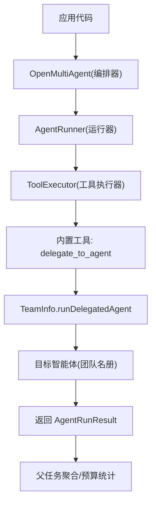
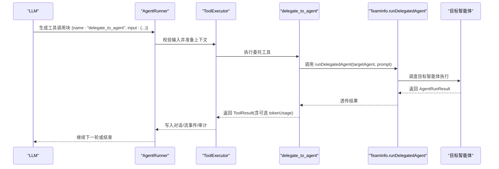
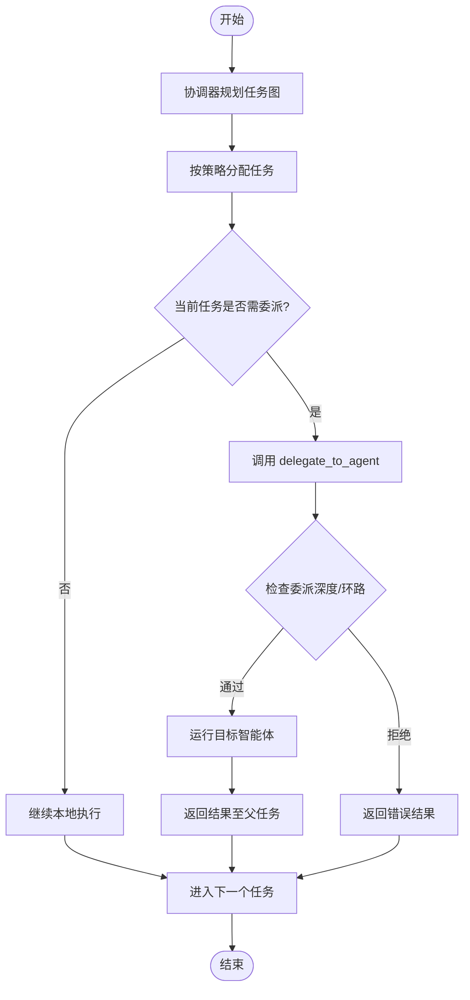
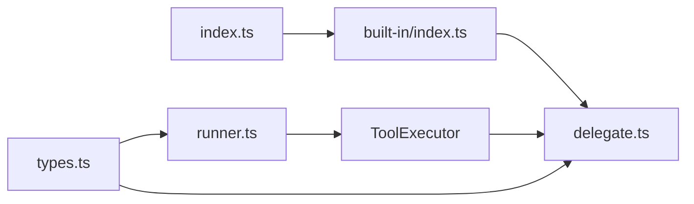

# 智能体委托工具

<cite>
**本文引用的文件**
- [README.md](file://README.md)
- [AGENTS.md](file://AGENTS.md)
- [index.ts](file://packages/core/src/index.ts)
- [types.ts](file://packages/core/src/types.ts)
- [tool-configuration.md](file://docs/tool-configuration.md)
- [external-agents.md](file://docs/external-agents.md)
- [built-in/index.ts](file://packages/core/src/tool/built-in/index.ts)
- [delegate.ts](file://packages/core/src/tool/built-in/delegate.ts)
- [runner.ts](file://packages/core/src/agent/runner.ts)
</cite>

## 目录
1. [简介](#简介)
2. [项目结构](#项目结构)
3. [核心组件](#核心组件)
4. [架构总览](#架构总览)
5. [详细组件分析](#详细组件分析)
6. [依赖关系分析](#依赖关系分析)
7. [性能考虑](#性能考虑)
8. [故障排查指南](#故障排查指南)
9. [结论](#结论)
10. [附录](#附录)

## 简介
本文件聚焦于“智能体委托工具”（内置工具 delegate_to_agent）在 Open Multi-Agent（OMA）中的使用方式与最佳实践。该工具用于在多智能体协作场景中，将任务委派给团队中的其他智能体执行，并回传结果。它仅在编排模式（runTeam/runTasks）中可用，且遵循默认拒绝的安全策略：必须显式授予目标智能体调用该工具的权限。

## 项目结构
- 公共入口与类型导出集中在 core 包的 index.ts，其中重新导出内置工具集合，包括 delegate_to_agent。
- 类型定义（如 TeamInfo、DelegationPoolView、ToolUseContext、ToolResultMetadata）位于 types.ts，描述委托上下文、深度限制、池容量视图以及结果元数据。
- 内置工具注册表位于 tool/built-in/index.ts，提供 includeDelegateTool 选项以决定是否注册委托工具。
- 委托工具实现位于 tool/built-in/delegate.ts，负责在受控环境下调用 runDelegatedAgent。
- 运行器 runner.ts 负责构建 ToolUseContext、注入 team.runDelegatedAgent、处理工具调用生命周期与压缩等。

图表来源
- [index.ts:165-179](file://packages/core/src/index.ts#L165-L179)
- [types.ts:518-668](file://packages/core/src/types.ts#L518-L668)
- [built-in/index.ts:20-75](file://packages/core/src/tool/built-in/index.ts#L20-L75)
- [runner.ts:1393-1429](file://packages/core/src/agent/runner.ts#L1393-L1429)

章节来源
- [index.ts:165-179](file://packages/core/src/index.ts#L165-L179)
- [types.ts:518-668](file://packages/core/src/types.ts#L518-L668)
- [built-in/index.ts:20-75](file://packages/core/src/tool/built-in/index.ts#L20-L75)
- [runner.ts:1393-1429](file://packages/core/src/agent/runner.ts#L1393-L1429)

## 核心组件
- 委托工具 delegate_to_agent
  - 作用：在当前任务上下文中，将提示词委派给团队名册中的另一个智能体执行，并返回其结果。
  - 可用性：仅在 runTeam/runTasks 的编排工作流中可用；独立 runAgent 不注册该工具。
  - 安全策略：默认拒绝，需通过 tools 或 toolPreset 显式授予。
- 团队上下文 TeamInfo
  - 包含 agents 列表、sharedMemory、delegationDepth/maxDelegationDepth、delegationChain、delegationPool 以及 runDelegatedAgent 回调。
  - delegationChain 用于检测自环（如 A→B→A），在消耗 maxDelegationDepth 之前拦截。
- 工具执行上下文 ToolUseContext
  - 注入 agent、team、abortSignal/Controller、credentials 等，供工具实现读取。
- 结果元数据 ToolResultMetadata
  - 可携带 tokenUsage，使嵌套委托的 Token 消耗计入父任务预算。

章节来源
- [types.ts:518-668](file://packages/core/src/types.ts#L518-L668)
- [tool-configuration.md:214-238](file://docs/tool-configuration.md#L214-L238)
- [AGENTS.md:72-83](file://AGENTS.md#L72-L83)

## 架构总览
下图展示了从 LLM 输出到工具调用的完整链路，以及委托工具如何触发子智能体执行并回传结果。

图表来源
- [runner.ts:1393-1429](file://packages/core/src/agent/runner.ts#L1393-L1429)
- [types.ts:628-653](file://packages/core/src/types.ts#L628-L653)
- [built-in/index.ts:20-75](file://packages/core/src/tool/built-in/index.ts#L20-L75)

## 详细组件分析

### 委托工具 API 与参数
- 工具名称：delegate_to_agent
- 输入参数（由 LLM 生成，经 Zod 校验后传入）：
  - targetAgent：目标智能体名称（必须在团队名册中）。
  - prompt：要传递给目标智能体的提示词。
  - 其他字段依具体实现而定（例如 traceParent 为内部字段，调用方不应设置）。
- 返回值：ToolResult，包含 data（通常为字符串摘要或结构化结果）、isError、metadata（可携带 tokenUsage）。
- 上下文能力：
  - 可通过 ToolUseContext.team.delegationDepth 与 maxDelegationDepth 控制嵌套层级。
  - 通过 delegationChain 防止循环委派。
  - 通过 delegationPool.availableRunSlots 感知并发容量。

章节来源
- [types.ts:620-668](file://packages/core/src/types.ts#L620-L668)
- [built-in/index.ts:20-75](file://packages/core/src/tool/built-in/index.ts#L20-L75)
- [runner.ts:1393-1429](file://packages/core/src/agent/runner.ts#L1393-L1429)

### 多智能体协作流程
- 协调器根据目标生成任务图，各任务分配给不同智能体。
- 某个智能体在执行过程中若需要专业分工，可调用 delegate_to_agent 将子任务委派给团队内更合适的智能体。
- 被委派的智能体完成后，结果回传到父任务，父任务可据此推进后续步骤或汇总最终答案。

图表来源
- [types.ts:628-653](file://packages/core/src/types.ts#L628-L653)
- [runner.ts:1393-1429](file://packages/core/src/agent/runner.ts#L1393-L1429)

### 授权与安全边界
- 默认拒绝：内置工具（包括 delegate_to_agent）不会自动可用，必须通过 tools 或 toolPreset 显式授予。
- 每调用门控 onToolCall：可在执行前对具体调用进行允许/拒绝/挂起决策。
- 委派仅存在于编排模式：standalone runAgent 不暴露该工具，避免误用。
- 外部代理与进程/ACP 后端：与委托机制在同一 DAG 中协作，但注意其自身权限模型与资源边界。

章节来源
- [tool-configuration.md:214-238](file://docs/tool-configuration.md#L214-L238)
- [tool-configuration.md:326-363](file://docs/tool-configuration.md#L326-L363)
- [AGENTS.md:72-83](file://AGENTS.md#L72-L83)
- [external-agents.md:1-18](file://docs/external-agents.md#L1-L18)

### 结果回传与预算追踪
- 委托工具可将子任务的 tokenUsage 附加到 ToolResult.metadata.tokenUsage，从而累计到父任务总用量，确保预算与成本跟踪准确。
- 流式事件与消息会包含工具结果，便于观测与回放。

章节来源
- [types.ts:655-668](file://packages/core/src/types.ts#L655-L668)
- [runner.ts:1075-1107](file://packages/core/src/agent/runner.ts#L1075-L1107)

## 依赖关系分析
- 模块耦合
  - index.ts 重新导出 delegateToAgentTool，使其成为公共 API 的一部分。
  - built-in/index.ts 提供 includeDelegateTool 开关，控制是否在注册阶段加入委托工具。
  - runner.ts 在工具执行时注入 team.runDelegatedAgent，并将工具调用与上下文绑定。
  - types.ts 定义了委托所需的上下文与约束（深度、链、池容量视图）。
- 外部依赖
  - 无额外运行时依赖；委托逻辑基于 OMA 编排器与团队池。

图表来源
- [index.ts:165-179](file://packages/core/src/index.ts#L165-L179)
- [built-in/index.ts:20-75](file://packages/core/src/tool/built-in/index.ts#L20-L75)
- [runner.ts:1393-1429](file://packages/core/src/agent/runner.ts#L1393-L1429)
- [types.ts:620-668](file://packages/core/src/types.ts#L620-L668)

章节来源
- [index.ts:165-179](file://packages/core/src/index.ts#L165-L179)
- [built-in/index.ts:20-75](file://packages/core/src/tool/built-in/index.ts#L20-L75)
- [runner.ts:1393-1429](file://packages/core/src/agent/runner.ts#L1393-L1429)
- [types.ts:620-668](file://packages/core/src/types.ts#L620-L668)

## 性能考虑
- 委派深度与环路保护：通过 delegationDepth/maxDelegationDepth 与 delegationChain 限制递归委派，避免无限循环与过度消耗。
- 并发容量：通过 delegationPool.availableRunSlots 感知池容量，避免过载。
- 预算与成本：利用 ToolResultMetadata.tokenUsage 将子任务 Token 消耗计入父任务，配合 orchestrator 的预算上限进行整体控制。
- 输出压缩：已处理的工具结果会被压缩以减少后续转轮的输入开销，降低延迟与成本。

章节来源
- [types.ts:620-668](file://packages/core/src/types.ts#L620-L668)
- [runner.ts:1759-1798](file://packages/core/src/agent/runner.ts#L1759-L1798)
- [runner.ts:1075-1107](file://packages/core/src/agent/runner.ts#L1075-L1107)

## 故障排查指南
- 工具未授予
  - 现象：调用 delegate_to_agent 返回“未授予”的错误结果。
  - 原因：未在 AgentConfig.tools 或 toolPreset 中声明该工具。
  - 解决：显式授予 delegate_to_agent，或在编排模式下启用 includeDelegateTool。
- 委派目标未知
  - 现象：targetAgent 不在团队名册中。
  - 解决：确认目标智能体名称与团队配置一致。
- 委派深度超限或环路
  - 现象：检测到 A→B→A 或超过 maxDelegationDepth。
  - 解决：调整委派策略，减少嵌套层级或重构任务图。
- 并发不足
  - 现象：availableRunSlots 为 0，无法启动委派。
  - 解决：提高池容量或错峰执行。
- 预算耗尽
  - 现象：Token/Cost 预算达到上限，委派提前终止。
  - 解决：调整预算或拆分任务。

章节来源
- [tool-configuration.md:214-238](file://docs/tool-configuration.md#L214-L238)
- [types.ts:620-668](file://packages/core/src/types.ts#L620-L668)
- [runner.ts:1393-1429](file://packages/core/src/agent/runner.ts#L1393-L1429)

## 结论
delegate_to_agent 是 OMA 在多智能体协作中的关键纽带，它将复杂目标分解为跨智能体的协同执行。通过严格的授权、深度与环路保护、预算与并发控制，以及结果与 Token 的精准回传，开发者可以在保证安全与可控的前提下，构建灵活而强大的智能体工作流。

## 附录

### 使用示例（概念性说明）
- 场景：研究团队中，研究员负责收集事实，分析师负责对比证据并给出建议。当研究员遇到需要特定领域知识的子问题时，可调用 delegate_to_agent 将子问题委派给领域专家智能体，获取结果后再回到分析师进行综合。
- 关键点：
  - 在团队配置中为相关智能体授予 delegate_to_agent。
  - 明确 targetAgent 与 prompt，确保目标智能体具备所需上下文。
  - 监控 delegationDepth 与 availableRunSlots，避免过深或过载。
  - 利用 ToolResultMetadata.tokenUsage 观察预算消耗。

[本节为概念性说明，不直接分析具体文件]

### 参考路径（代码片段位置）
- 内置工具导出与注册：[index.ts:165-179](file://packages/core/src/index.ts#L165-L179)、[built-in/index.ts:20-75](file://packages/core/src/tool/built-in/index.ts#L20-L75)
- 委托工具实现与上下文注入：[delegate.ts](file://packages/core/src/tool/built-in/delegate.ts)、[runner.ts:1393-1429](file://packages/core/src/agent/runner.ts#L1393-L1429)
- 类型与约束（TeamInfo、DelegationPoolView、ToolUseContext、ToolResultMetadata）：[types.ts:518-668](file://packages/core/src/types.ts#L518-L668)
- 工具授权与默认拒绝策略：[tool-configuration.md:214-238](file://docs/tool-configuration.md#L214-L238)
- 外部代理与协作背景：[external-agents.md:1-18](file://docs/external-agents.md#L1-L18)