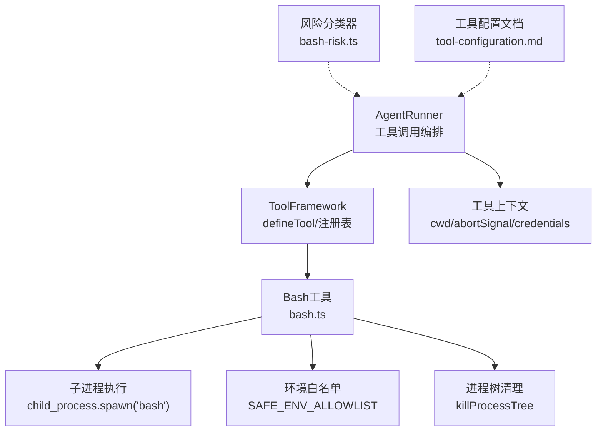
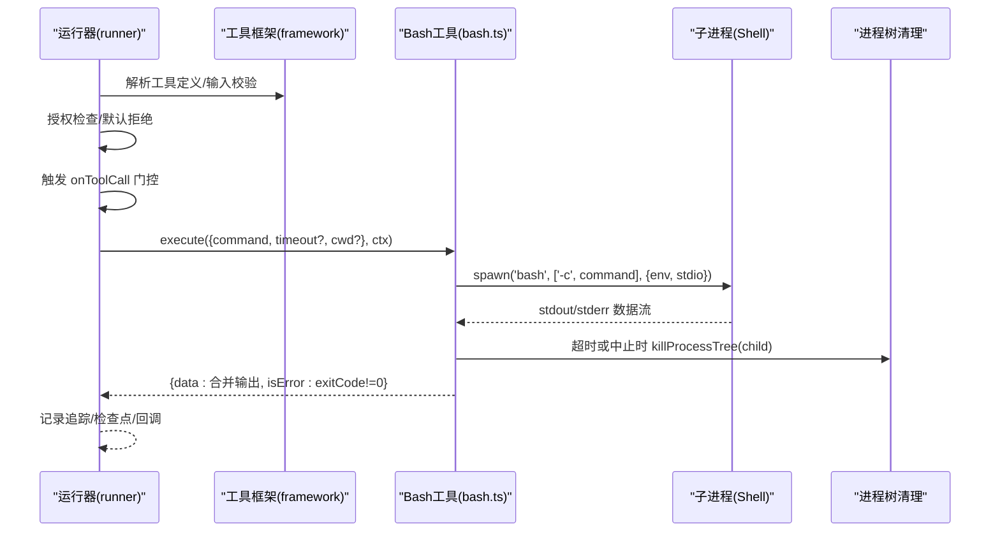
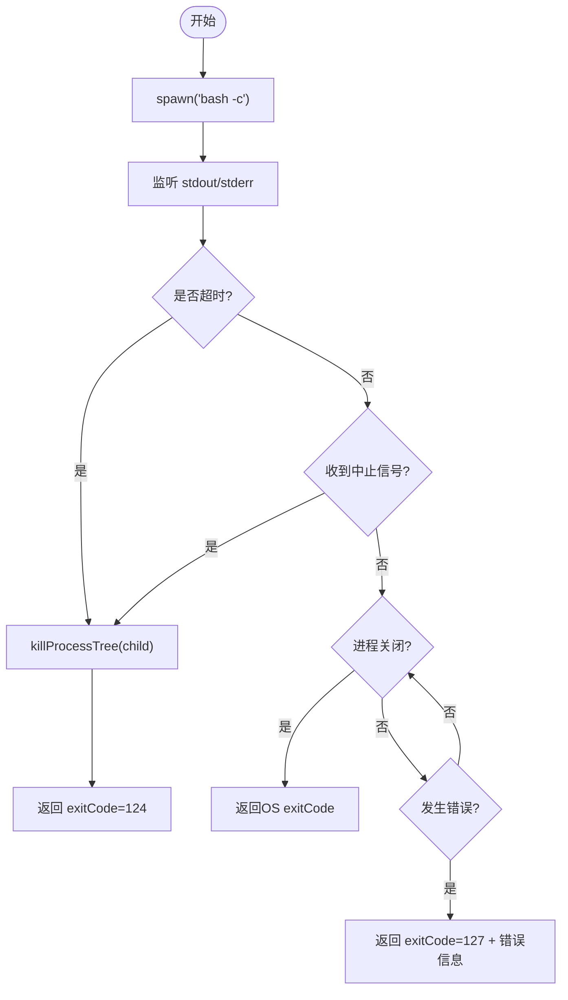
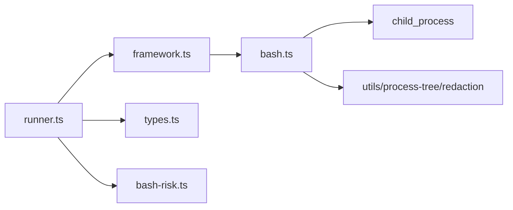

# 进程执行工具

<cite>
**本文引用的文件**
- [bash.ts](file://packages/core/src/tool/built-in/bash.ts)
- [bash-risk.ts](file://packages/core/src/tool/classifiers/bash-risk.ts)
- [framework.ts](file://packages/core/src/tool/framework.ts)
- [types.ts](file://packages/core/src/types.ts)
- [runner.ts](file://packages/core/src/agent/runner.ts)
- [tool-configuration.md](file://docs/tool-configuration.md)
</cite>

## 目录
1. [简介](#简介)
2. [项目结构](#项目结构)
3. [核心组件](#核心组件)
4. [架构总览](#架构总览)
5. [详细组件分析](#详细组件分析)
6. [依赖关系分析](#依赖关系分析)
7. [性能考虑](#性能考虑)
8. [故障排查指南](#故障排查指南)
9. [结论](#结论)
10. [附录：使用示例与最佳实践](#附录使用示例与最佳实践)

## 简介
本文件面向“进程执行工具”的使用者与维护者，聚焦内置 bash 工具的 API、执行模型、输出处理、安全策略与故障恢复。内容基于仓库中的实现与文档，覆盖命令参数、环境变量白名单、工作目录、超时控制、标准输出/错误输出捕获、退出码语义、沙箱限制、风险分级与审批门控等主题，并提供可操作的配置建议与排错指引。

## 项目结构
与进程执行相关的代码主要位于 core 包的 tool 层与 agent 运行器中：
- 工具定义与执行框架：packages/core/src/tool/framework.ts
- 内置 bash 工具实现：packages/core/src/tool/built-in/bash.ts
- Bash 风险分类器（可选）：packages/core/src/tool/classifiers/bash-risk.ts
- 工具上下文与默认工作目录：packages/core/src/types.ts
- 工具调用编排与上下文注入：packages/core/src/agent/runner.ts
- 工具配置与安全策略说明：docs/tool-configuration.md

图表来源
- [runner.ts:1364-1505](file://packages/core/src/agent/runner.ts#L1364-L1505)
- [framework.ts:71-117](file://packages/core/src/tool/framework.ts#L71-L117)
- [bash.ts:37-79](file://packages/core/src/tool/built-in/bash.ts#L37-L79)
- [bash.ts:100-196](file://packages/core/src/tool/built-in/bash.ts#L100-L196)
- [types.ts:531-557](file://packages/core/src/types.ts#L531-L557)

章节来源
- [framework.ts:71-117](file://packages/core/src/tool/framework.ts#L71-L117)
- [bash.ts:37-79](file://packages/core/src/tool/built-in/bash.ts#L37-L79)
- [bash.ts:100-196](file://packages/core/src/tool/built-in/bash.ts#L100-L196)
- [types.ts:531-557](file://packages/core/src/types.ts#L531-L557)
- [runner.ts:1364-1505](file://packages/core/src/agent/runner.ts#L1364-L1505)
- [tool-configuration.md:214-237](file://docs/tool-configuration.md#L214-L237)

## 核心组件
- 工具定义框架：通过 defineTool 声明 name、description、inputSchema、execute 等；支持 consequential 标记副作用工具、maxOutputChars 截断输出、自定义 LLM JSON Schema 等。
- Bash 工具：以非交互式 shell（bash -c）执行命令，支持 timeout、cwd；合并 stdout/stderr 并标注退出码；对敏感信息进行脱敏。
- 风险分类器：将 bash 命令按 safe/review/high 分级，便于在 onToolCall 门控中做放行/拒绝/人工审核。
- 工具上下文：注入 agent、team、abortSignal/abortController、cwd、runId/taskId、credentials 等。
- 运行器：负责工具授权校验、onToolCall 门控、结果回写、追踪埋点、检查点持久化等。

章节来源
- [framework.ts:71-117](file://packages/core/src/tool/framework.ts#L71-L117)
- [bash.ts:37-79](file://packages/core/src/tool/built-in/bash.ts#L37-L79)
- [bash-risk.ts:162-190](file://packages/core/src/tool/classifiers/bash-risk.ts#L162-L190)
- [types.ts:531-557](file://packages/core/src/types.ts#L531-L557)
- [runner.ts:1364-1505](file://packages/core/src/agent/runner.ts#L1364-L1505)

## 架构总览
下图展示一次 bash 工具调用的端到端流程：从运行器解析工具调用，到工具执行、子进程生命周期管理、输出聚合与返回。

图表来源
- [runner.ts:1364-1505](file://packages/core/src/agent/runner.ts#L1364-L1505)
- [framework.ts:71-117](file://packages/core/src/tool/framework.ts#L71-L117)
- [bash.ts:100-196](file://packages/core/src/tool/built-in/bash.ts#L100-L196)

## 详细组件分析

### Bash 工具 API 与参数
- 名称：bash
- 描述：执行 bash 命令并返回 stdout 与 stderr；适用于文件系统操作、脚本运行、包安装等需要 Shell 的场景；以非交互式模式运行；长耗时命令应设置 timeout。
- 输入参数
  - command: string，必选，要执行的 bash 命令。
  - timeout: number，可选，毫秒级超时；未设置时使用默认值。
  - cwd: string，可选，命令的工作目录。
- 返回值
  - data: string，stdout 与 stderr 的合并文本；当仅有 stdout 时直接返回其内容；若同时存在 stderr，则以分隔段标注；若无输出且成功则返回提示性文本；失败时会附加退出码信息。
  - isError: boolean，当 exitCode !== 0 时为 true。

章节来源
- [bash.ts:37-79](file://packages/core/src/tool/built-in/bash.ts#L37-L79)
- [bash.ts:214-240](file://packages/core/src/tool/built-in/bash.ts#L214-L240)

### 命令执行与进程生命周期
- 子进程启动：使用 child_process.spawn('bash', ['-c', command])，stdio 为 ['ignore','pipe','pipe']，仅捕获 stdout/stderr。
- 工作目录：通过 options.cwd 传入；未提供时由上层上下文决定。
- 环境变量：构建安全环境，仅允许白名单变量（如 HOME、PATH、SHELL、TERM 等），并过滤敏感键名。
- 超时控制：默认超时时间固定；到达后对子进程树进行强制终止，并返回约定退出码 124。
- 取消控制：监听 abortSignal，触发后同样对子进程树终止，并返回约定退出码 130。
- 正常完成：close 事件携带 OS 返回的 exit code；error 事件统一封装为 stderr 消息并返回 127。
- 平台差异：POSIX 下 detached 以便进程组清理；Windows 上通过 taskkill 方式终止。

图表来源
- [bash.ts:100-196](file://packages/core/src/tool/built-in/bash.ts#L100-L196)

章节来源
- [bash.ts:100-196](file://packages/core/src/tool/built-in/bash.ts#L100-L196)

### 环境变量与安全性
- 环境变量白名单：仅传递受信任的环境变量，避免泄露密钥或敏感配置。
- 敏感键过滤：结合敏感名检测函数，进一步过滤潜在敏感环境变量。
- 注意：bash 本身不在文件系统沙箱内；一旦授予 bash，即拥有宿主 Shell 能力。

章节来源
- [bash.ts:18-31](file://packages/core/src/tool/built-in/bash.ts#L18-L31)
- [bash.ts:198-207](file://packages/core/src/tool/built-in/bash.ts#L198-L207)
- [tool-configuration.md:214-237](file://docs/tool-configuration.md#L214-L237)

### 工作目录与沙箱
- 文件系统工具（file_read/write/edit/grep/glob）受 cwd 沙箱约束，路径必须绝对且在沙箱根内。
- bash 不受该路径沙箱约束；如需严格隔离，应使用容器/VM/seccomp 等进程级隔离方案。
- 默认工作目录：未显式设置时，文件系统工具使用 <process.cwd()>/.agent-workspace 作为沙箱根。

章节来源
- [types.ts:547-557](file://packages/core/src/types.ts#L547-L557)
- [tool-configuration.md:391-441](file://docs/tool-configuration.md#L391-L441)

### 输出捕获与处理
- 标准输出与错误输出分别收集，最终合并为单一字符串返回。
- 当同时存在 stderr 时，会以分隔段标注，便于区分。
- 无输出时的行为：成功返回提示文本；失败返回包含退出码的提示文本。
- 敏感信息脱敏：输出在进入上层前会进行敏感文本脱敏。

章节来源
- [bash.ts:214-240](file://packages/core/src/tool/built-in/bash.ts#L214-L240)
- [bash.ts:71-77](file://packages/core/src/tool/built-in/bash.ts#L71-L77)

### 退出码语义
- 124：超时被终止。
- 130：被外部中止信号终止。
- 127：子进程启动或管道错误。
- 其他：操作系统返回的实际退出码。

章节来源
- [bash.ts:165-169](file://packages/core/src/tool/built-in/bash.ts#L165-L169)
- [bash.ts:181-194](file://packages/core/src/tool/built-in/bash.ts#L181-L194)

### 工具上下文与资源控制
- 上下文字段：agent、team、abortSignal/abortController、cwd、runId/taskId、credentials。
- 取消：工具可通过 abortSignal 快速判断是否需要退出；也可通过 abortController.signal 直接驱动子进程终止。
- 凭据：通过 ToolUseContext.credentials 注入 per-agent 的密钥，避免闭包共享。

章节来源
- [types.ts:531-557](file://packages/core/src/types.ts#L531-L557)
- [runner.ts:1795-1810](file://packages/core/src/agent/runner.ts#L1795-L1810)

### 授权与门控（白名单/黑名单/风险分级）
- 默认拒绝：内置工具需显式授权；未授权的工具调用不会执行，返回明确错误。
- 预设与列表：支持 toolPreset（readonly/readwrite/full）、allowedTools、disallowedTools 组合控制。
- 风险分级：可使用 classifyBashCommand 将命令分为 safe/review/high，并在 onToolCall 中做放行/拒绝/人工审核。
- 后果性工具：bash 被标记为 consequential，可在未声明治理意图的运行中标记并触发确认流程。

章节来源
- [tool-configuration.md:214-237](file://docs/tool-configuration.md#L214-L237)
- [tool-configuration.md:326-389](file://docs/tool-configuration.md#L326-L389)
- [bash-risk.ts:162-190](file://packages/core/src/tool/classifiers/bash-risk.ts#L162-L190)
- [runner.ts:1391-1405](file://packages/core/src/agent/runner.ts#L1391-L1405)

## 依赖关系分析
- runner 依赖 framework 的工具注册与定义能力，以及 types 提供的上下文类型。
- bash 工具依赖 Node.js child_process 与内部工具模块（进程树清理、敏感信息脱敏）。
- 风险分类器独立于执行路径，供 onToolCall 门控使用。

图表来源
- [runner.ts:1364-1505](file://packages/core/src/agent/runner.ts#L1364-L1505)
- [framework.ts:71-117](file://packages/core/src/tool/framework.ts#L71-L117)
- [bash.ts:100-196](file://packages/core/src/tool/built-in/bash.ts#L100-L196)
- [bash-risk.ts:162-190](file://packages/core/src/tool/classifiers/bash-risk.ts#L162-L190)

章节来源
- [runner.ts:1364-1505](file://packages/core/src/agent/runner.ts#L1364-L1505)
- [framework.ts:71-117](file://packages/core/src/tool/framework.ts#L71-L117)
- [bash.ts:100-196](file://packages/core/src/tool/built-in/bash.ts#L100-L196)
- [bash-risk.ts:162-190](file://packages/core/src/tool/classifiers/bash-risk.ts#L162-L190)

## 性能考虑
- 子进程开销：每次 bash 调用都会创建子进程，频繁调用时应考虑批量化或复用脚本。
- 输出大小：超长输出会增加上下文与传输成本；可通过 maxOutputChars 或工具自身截断控制。
- 超时与取消：合理设置 timeout 与使用 abortSignal，避免僵尸进程与资源泄漏。
- 环境变量最小化：仅传递必要环境变量，减少污染与安全风险。

[本节为通用指导，不直接分析具体文件]

## 故障排查指南
- 命令无法执行
  - 现象：stderr 出现错误信息，exitCode=127。
  - 排查：检查 PATH、命令是否存在、权限与 shell 兼容性。
- 命令卡住或超时
  - 现象：长时间无输出后被终止，exitCode=124。
  - 排查：缩短 timeout、增加日志、检查是否有后台任务未结束。
- 被外部中断
  - 现象：exitCode=130。
  - 排查：检查上层是否触发了 abortSignal。
- 输出为空但失败
  - 现象：data 提示“无输出”，exitCode 非零。
  - 排查：确认命令是否将错误输出到 stderr；必要时调整命令使其输出诊断信息。
- 权限与环境问题
  - 现象：某些命令因权限不足失败。
  - 排查：避免使用 sudo；如需特权操作，应在受控环境中执行。

章节来源
- [bash.ts:181-194](file://packages/core/src/tool/built-in/bash.ts#L181-L194)
- [bash.ts:165-169](file://packages/core/src/tool/built-in/bash.ts#L165-L169)
- [bash.ts:214-240](file://packages/core/src/tool/built-in/bash.ts#L214-L240)

## 结论
内置 bash 工具提供了稳定可控的 Shell 执行能力：具备超时与取消、安全的环境变量白名单、清晰的退出码语义与输出格式。配合工具授权、风险分类与 onToolCall 门控，可以在灵活性与安全性之间取得平衡。对于不受信的执行场景，建议使用进程级隔离（容器/VM/seccomp）替代单纯的路径沙箱。

[本节为总结，不直接分析具体文件]

## 附录：使用示例与最佳实践
以下示例以“步骤+要点”的形式给出，便于快速上手与对照实现。

- 基本命令执行
  - 目标：执行只读命令并获取输出。
  - 要点：不传 timeout 时使用默认值；关注 exitCode 与 isError。
  - 参考实现位置：[bash.ts:37-79](file://packages/core/src/tool/built-in/bash.ts#L37-L79)

- 带工作目录的命令
  - 目标：在指定目录下执行脚本。
  - 要点：传入 cwd；确保路径存在且有执行权限。
  - 参考实现位置：[bash.ts:100-115](file://packages/core/src/tool/built-in/bash.ts#L100-L115)

- 超时与取消
  - 目标：防止长耗时命令阻塞。
  - 要点：设置 timeout；结合 abortSignal 实现外部取消。
  - 参考实现位置：[bash.ts:119-152](file://packages/core/src/tool/built-in/bash.ts#L119-L152)

- 管道与复合命令
  - 目标：使用 &&、||、;、| 组合多个命令。
  - 要点：风险分类器会将复合命令分段评估，高风险片段会导致整体高风险。
  - 参考实现位置：[bash-risk.ts:124-143](file://packages/core/src/tool/classifiers/bash-risk.ts#L124-L143)

- 脚本运行
  - 目标：执行本地脚本文件。
  - 要点：确保脚本可执行；注意工作目录与相对路径解析。
  - 参考实现位置：[bash.ts:100-115](file://packages/core/src/tool/built-in/bash.ts#L100-L115)

- 安全门控与风险分级
  - 目标：对危险命令进行拦截或人工审核。
  - 要点：使用 classifyBashCommand 在 onToolCall 中决策；high 直接拒绝，review 人工确认。
  - 参考实现位置：
    - [tool-configuration.md:326-389](file://docs/tool-configuration.md#L326-L389)
    - [bash-risk.ts:162-190](file://packages/core/src/tool/classifiers/bash-risk.ts#L162-L190)

- 环境变量控制
  - 目标：最小化暴露给子进程的环境。
  - 要点：仅传递白名单环境变量；避免传播敏感键。
  - 参考实现位置：[bash.ts:19-31](file://packages/core/src/tool/built-in/bash.ts#L19-L31), [bash.ts:198-207](file://packages/core/src/tool/built-in/bash.ts#L198-L207)

- 工作目录与沙箱
  - 目标：限制文件系统工具访问范围。
  - 要点：使用 defaultCwd 或 AgentConfig.cwd；注意 bash 不受路径沙箱约束。
  - 参考实现位置：
    - [types.ts:547-557](file://packages/core/src/types.ts#L547-L557)
    - [tool-configuration.md:391-441](file://docs/tool-configuration.md#L391-L441)

- 输出处理与脱敏
  - 目标：安全地消费命令输出。
  - 要点：合并 stdout/stderr；关注 isError；敏感信息会被脱敏。
  - 参考实现位置：[bash.ts:214-240](file://packages/core/src/tool/built-in/bash.ts#L214-L240), [bash.ts:71-77](file://packages/core/src/tool/built-in/bash.ts#L71-L77)

- 工具定义与注册
  - 目标：扩展或自定义工具。
  - 要点：使用 defineTool 声明 schema 与 execute；必要时标记 consequential。
  - 参考实现位置：[framework.ts:71-117](file://packages/core/src/tool/framework.ts#L71-L117)

- 运行器集成
  - 目标：理解工具调用如何被编排与审计。
  - 要点：授权检查、onToolCall 门控、追踪埋点、检查点持久化。
  - 参考实现位置：[runner.ts:1364-1505](file://packages/core/src/agent/runner.ts#L1364-L1505)