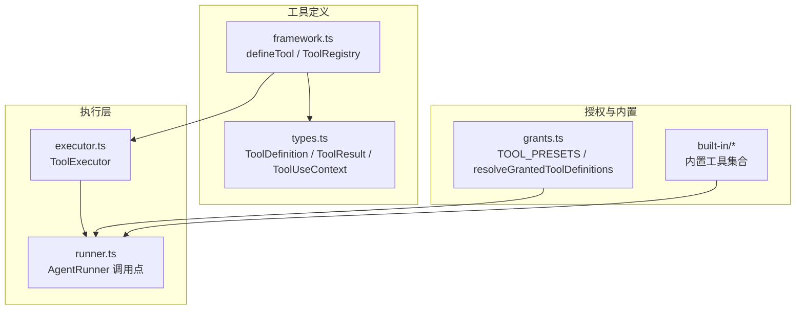
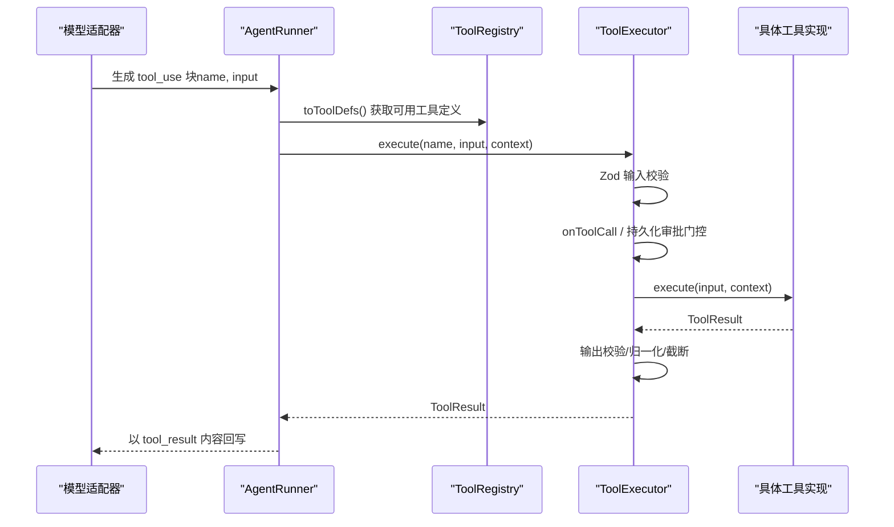
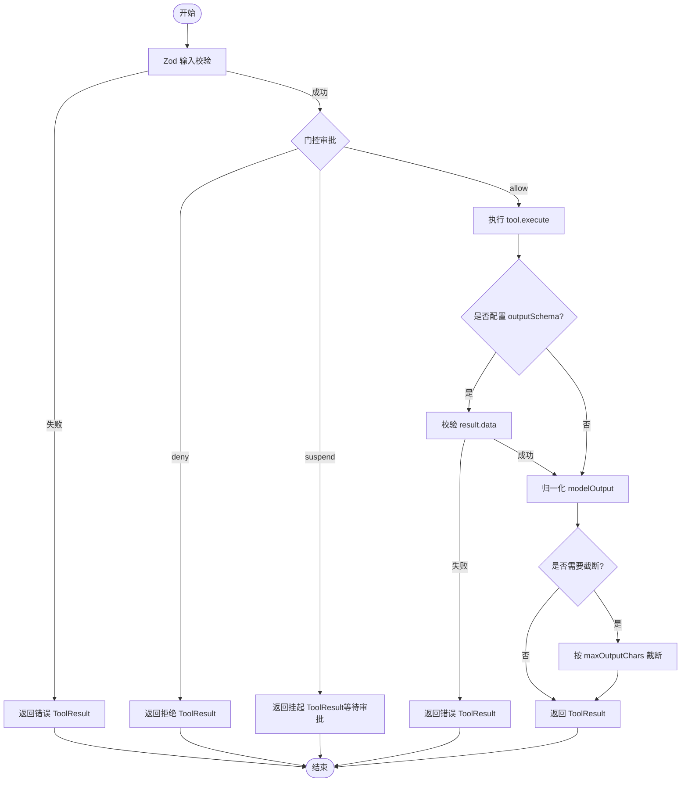
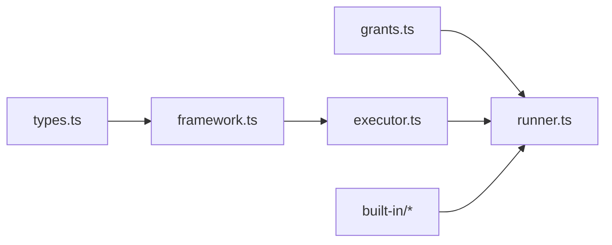

# 工具 API

<cite>
**本文引用的文件**
- [packages/core/src/tool/framework.ts](file://packages/core/src/tool/framework.ts)
- [packages/core/src/tool/executor.ts](file://packages/core/src/tool/executor.ts)
- [packages/core/src/types.ts](file://packages/core/src/types.ts)
- [packages/core/src/agent/runner.ts](file://packages/core/src/agent/runner.ts)
- [packages/core/src/tool/grants.ts](file://packages/core/src/tool/grants.ts)
- [packages/core/src/tool/built-in/index.ts](file://packages/core/src/tool/built-in/index.ts)
- [packages/core/src/tool/built-in/bash.ts](file://packages/core/src/tool/built-in/bash.ts)
- [packages/core/src/tool/built-in/file-read.ts](file://packages/core/src/tool/built-in/file-read.ts)
- [packages/core/src/tool/built-in/file-write.ts](file://packages/core/src/tool/built-in/file-write.ts)
- [packages/core/src/tool/built-in/file-edit.ts](file://packages/core/src/tool/built-in/file-edit.ts)
- [packages/core/src/tool/built-in/grep.ts](file://packages/core/src/tool/built-in/grep.ts)
- [packages/core/src/tool/built-in/glob.ts](file://packages/core/src/tool/built-in/glob.ts)
- [packages/core/src/tool/built-in/fs-walk.ts](file://packages/core/src/tool/built-in/fs-walk.ts)
- [packages/core/src/tool/built-in/delegate.ts](file://packages/core/src/tool/built-in/delegate.ts)
- [packages/core/src/tool/built-in/path-safety.ts](file://packages/core/src/tool/built-in/path-safety.ts)
</cite>

## 目录
1. [简介](#简介)
2. [项目结构](#项目结构)
3. [核心组件](#核心组件)
4. [架构总览](#架构总览)
5. [详细组件分析](#详细组件分析)
6. [依赖关系分析](#依赖关系分析)
7. [性能与并发](#性能与并发)
8. [故障排查](#故障排查)
9. [结论](#结论)
10. [附录：内置工具清单与用法](#附录内置工具清单与用法)

## 简介
本参考文档面向使用 Open Multi-Agent 工具系统的开发者，聚焦以下目标：
- 完整说明 defineTool() 的用法：工具定义、输入输出验证、执行逻辑实现。
- 提供 ToolExecutor 接口的实现指南：工具注册、参数校验、结果处理、错误处理、并发控制、可中断执行等。
- 解释内置工具的完整列表与使用方法：文件系统操作、网络请求（通过自定义工具）、进程执行（bash）等。
- 给出自定义工具开发示例：复杂参数校验、异步操作、资源管理、安全沙箱、可撤销执行等高级特性。

## 项目结构
工具系统位于 packages/core/src/tool 下，核心由“定义框架 + 执行器 + 授权策略”组成：
- 定义框架：defineTool()、ToolRegistry、Zod → JSON Schema 转换。
- 执行器：ToolExecutor，负责并发控制、输入/输出校验、门控审批、结果归一化与截断。
- 授权策略：TOOL_PRESETS、resolveGrantedToolDefinitions，决定哪些工具对某个 Agent 可用。
- 内置工具：文件系统、搜索、命令执行、代理委派等。
- 类型定义：ToolDefinition、ToolResult、ToolUseContext、LLMToolDef 等。

图表来源
- [packages/core/src/tool/framework.ts:71-117](file://packages/core/src/tool/framework.ts#L71-L117)
- [packages/core/src/tool/executor.ts:85-164](file://packages/core/src/tool/executor.ts#L85-L164)
- [packages/core/src/agent/runner.ts:1364-1395](file://packages/core/src/agent/runner.ts#L1364-L1395)
- [packages/core/src/tool/grants.ts:10-15](file://packages/core/src/tool/grants.ts#L10-L15)

章节来源
- [packages/core/src/tool/framework.ts:1-616](file://packages/core/src/tool/framework.ts#L1-L616)
- [packages/core/src/tool/executor.ts:1-519](file://packages/core/src/tool/executor.ts#L1-L519)
- [packages/core/src/agent/runner.ts:1364-1395](file://packages/core/src/agent/runner.ts#L1364-L1395)
- [packages/core/src/tool/grants.ts:1-90](file://packages/core/src/tool/grants.ts#L1-L90)

## 核心组件
- defineTool(config)
  - 作用：声明一个工具，包含名称、描述、输入 Zod 模式、可选输出 Zod 模式、可选 LLM 输入 JSON Schema、最大输出长度限制、以及 execute(input, context) 执行函数。
  - 关键点：consequential 标记为“有副作用”的工具；outputSchema 用于在返回非 string 数据时进行二次校验；llmInputSchema 可直接提供 LLM 侧的 JSON Schema，绕过自动转换。
  - 返回值：满足 ToolDefinition 的对象，供 ToolRegistry 注册。

- ToolRegistry
  - 作用：维护已注册工具集合，支持增删查、批量导出为 LLM 可用的工具定义（toToolDefs/toLLMTools），并区分运行时动态添加的工具。
  - 关键点：重复注册同名工具会抛错；toToolDefs 将 Zod 模式转换为 JSON Schema 供模型调用。

- ToolExecutor
  - 作用：执行工具调用，负责：
    - 并发控制：基于信号量的 maxConcurrency。
    - 输入校验：使用工具 inputSchema 做 Zod 校验。
    - 输出校验：当 tool.outputSchema 存在且 result.isError 为 false 时，校验 result.data。
    - 门控审批：onToolCall 钩子或持久化审批（durable approval）。
    - 结果归一化：确保 modelOutput 合法、错误消息为字符串、必要时截断超长输出。
    - 错误隔离：所有异常被捕获并以 isError: true 的 ToolResult 返回，不抛出。

- 授权策略（grants.ts）
  - TOOL_PRESETS：readonly/readwrite/full 三套预设，分别授予不同工具集。
  - resolveGrantedToolDefinitions：根据 preset、allowedTools、disallowedTools 计算最终可用工具集，同时排除框架级禁用工具。

章节来源
- [packages/core/src/tool/framework.ts:71-117](file://packages/core/src/tool/framework.ts#L71-L117)
- [packages/core/src/tool/framework.ts:127-261](file://packages/core/src/tool/framework.ts#L127-L261)
- [packages/core/src/tool/executor.ts:38-96](file://packages/core/src/tool/executor.ts#L38-L96)
- [packages/core/src/tool/executor.ts:181-338](file://packages/core/src/tool/executor.ts#L181-L338)
- [packages/core/src/tool/grants.ts:10-15](file://packages/core/src/tool/grants.ts#L10-L15)
- [packages/core/src/tool/grants.ts:35-89](file://packages/core/src/tool/grants.ts#L35-L89)

## 架构总览
下图展示了从 LLM 到工具执行的端到端流程，包括工具解析、授权、校验、执行、结果回传。

图表来源
- [packages/core/src/agent/runner.ts:1364-1395](file://packages/core/src/agent/runner.ts#L1364-L1395)
- [packages/core/src/tool/framework.ts:204-261](file://packages/core/src/tool/framework.ts#L204-L261)
- [packages/core/src/tool/executor.ts:112-164](file://packages/core/src/tool/executor.ts#L112-L164)
- [packages/core/src/tool/executor.ts:181-338](file://packages/core/src/tool/executor.ts#L181-L338)

## 详细组件分析

### defineTool() 与工具定义
- 必填字段
  - name：工具名，需全局唯一。
  - description：给模型看的工具描述。
  - inputSchema：Zod 模式，用于严格校验传入参数。
  - execute：执行函数，接收已校验的 input 和 ToolUseContext，返回 Promise<ToolResult>。
- 可选字段
  - consequential：标记该工具具有副作用，便于门控审批策略识别高风险调用。
  - outputSchema：对 ToolResult.data 做二次校验（仅对非错误结果生效）。
  - llmInputSchema：直接提供 LLM 侧 JSON Schema，跳过 Zod→JSON Schema 转换。
  - maxOutputChars：单工具输出字符上限，优先于代理级配置。
- 最佳实践
  - 使用 Zod 精确建模输入，避免宽松 schema 导致下游错误。
  - 对复杂对象输出也建议提供 outputSchema，保证稳定性。
  - 对可能产生大量输出的工具设置 maxOutputChars，防止上下文爆炸。

章节来源
- [packages/core/src/tool/framework.ts:71-117](file://packages/core/src/tool/framework.ts#L71-L117)
- [packages/core/src/tool/framework.ts:279-491](file://packages/core/src/tool/framework.ts#L279-L491)

### ToolRegistry：工具注册与导出
- register(tool, options?)：注册工具，重复名称抛错；runtimeAdded 标记可用于区分运行时动态工具。
- get/list/getAll/has/unregister/deregister：基础 CRUD。
- toToolDefs()/toLLMTools()：导出为 LLM 可用的工具定义，内部使用 zodToJsonSchema 转换。
- toRuntimeToolDefs()：仅导出运行时动态添加的工具定义。

章节来源
- [packages/core/src/tool/framework.ts:127-261](file://packages/core/src/tool/framework.ts#L127-L261)

### ToolExecutor：执行、校验、门控、结果处理
- 并发控制
  - maxConcurrency：默认 4，通过 Semaphore 限制并行度。
  - executeBatch：按并发限制并行执行多个工具调用，每个调用都产出结果（含错误）。
- 输入校验
  - 使用工具 inputSchema 做 safeParse，失败返回结构化错误信息。
- 门控审批
  - onToolCall：可在执行前允许/拒绝/挂起（suspend）调用。
  - 持久化审批：恢复检查 requestHash 与 decision，不一致则拒绝。
- 执行与输出
  - 调用 tool.execute，捕获异常并转为 isError: true 的 ToolResult。
  - 若 tool.outputSchema 存在且非错误结果，校验 result.data。
  - normalizeModelOutput：确保 modelOutput 合法；错误时 data/modelOutput 必须为字符串。
  - maybeTruncate：按 maxOutputChars 截断超长文本输出。
- 上下文与取消
  - 在执行前后检查 AbortSignal，支持长任务取消。

图表来源
- [packages/core/src/tool/executor.ts:181-338](file://packages/core/src/tool/executor.ts#L181-L338)
- [packages/core/src/tool/executor.ts:340-379](file://packages/core/src/tool/executor.ts#L340-L379)

章节来源
- [packages/core/src/tool/executor.ts:85-164](file://packages/core/src/tool/executor.ts#L85-L164)
- [packages/core/src/tool/executor.ts:181-338](file://packages/core/src/tool/executor.ts#L181-L338)
- [packages/core/src/tool/executor.ts:340-519](file://packages/core/src/tool/executor.ts#L340-L519)

### AgentRunner 集成点
- 构建 ToolUseContext：注入 agent、team、abortSignal、cwd、runId、taskId、credentials 等。
- 执行工具调用：executeToolCall 中调用 ToolExecutor，并将结果以 tool_result 形式回传给模型。
- 默认拒绝：未授权的 tool 不会执行，直接返回错误结果。

章节来源
- [packages/core/src/agent/runner.ts:1795-1811](file://packages/core/src/agent/runner.ts#L1795-L1811)
- [packages/core/src/agent/runner.ts:1364-1395](file://packages/core/src/agent/runner.ts#L1364-L1395)

### 授权与工具集
- TOOL_PRESETS：readonly/readwrite/full 三种预设，分别授予不同工具集合。
- resolveGrantedToolDefinitions：综合 preset、allowedTools、disallowedTools，过滤运行时工具与框架禁用工具，得到最终可用工具集。
- defaultToolPreset/defaultCwd：Agent 级别默认工具集与工作目录策略。

章节来源
- [packages/core/src/tool/grants.ts:10-15](file://packages/core/src/tool/grants.ts#L10-L15)
- [packages/core/src/tool/grants.ts:35-89](file://packages/core/src/tool/grants.ts#L35-L89)
- [packages/core/src/types.ts:2236-2252](file://packages/core/src/types.ts#L2236-L2252)

## 依赖关系分析
- framework.ts 依赖 types.ts 中的 ToolDefinition、ToolResult、ToolUseContext、LLMToolDef。
- executor.ts 依赖 framework.ts 的 ToolRegistry，以及 types.ts 的门控与结果类型。
- runner.ts 依赖 executor.ts 与 grants.ts，负责编排工具执行与授权。
- built-in/* 提供具体工具实现，并通过 registry 暴露给上层。

图表来源
- [packages/core/src/tool/framework.ts:13-22](file://packages/core/src/tool/framework.ts#L13-L22)
- [packages/core/src/tool/executor.ts:13-32](file://packages/core/src/tool/executor.ts#L13-L32)
- [packages/core/src/agent/runner.ts:53-70](file://packages/core/src/agent/runner.ts#L53-L70)

章节来源
- [packages/core/src/tool/framework.ts:13-22](file://packages/core/src/tool/framework.ts#L13-L22)
- [packages/core/src/tool/executor.ts:13-32](file://packages/core/src/tool/executor.ts#L13-L32)
- [packages/core/src/agent/runner.ts:53-70](file://packages/core/src/agent/runner.ts#L53-L70)

## 性能与并发
- 并发控制：ToolExecutor 默认并发度为 4，可通过 maxConcurrency 调整，避免资源争用。
- 输出截断：maxOutputChars 可限制输出大小，减少上下文压力；优先级：工具级 > 代理级。
- 流式处理：AgentRunner 会将工具结果以 tool_result 事件流式回传，降低延迟。
- 建议
  - 对 I/O 密集工具合理设置并发度。
  - 对大输出工具务必设置 maxOutputChars。
  - 使用 AbortSignal 支持长任务取消，避免资源泄漏。

[本节为通用指导，不直接分析具体文件]

## 故障排查
- 常见错误
  - 工具未注册：ToolExecutor 返回错误 ToolResult，提示未找到工具。
  - 输入校验失败：返回包含详细路径与消息的错误信息。
  - 输出校验失败：当配置了 outputSchema 且返回非错误结果时，会校验 data 并报错。
  - 门控拒绝：onToolCall 返回 deny 或持久化审批拒绝，返回错误 ToolResult。
  - 权限不足：未授权工具直接返回错误结果，不会执行。
- 调试建议
  - 开启 onToolCall 钩子记录输入与决策。
  - 使用日志记录 ToolResult.metadata 中的 toolCallGate 与 approvalDecision。
  - 检查 ToolRegistry 是否正确注册工具，避免重复命名冲突。
  - 对长任务使用 AbortSignal 并在工具内定期检查。

章节来源
- [packages/core/src/tool/executor.ts:112-133](file://packages/core/src/tool/executor.ts#L112-L133)
- [packages/core/src/tool/executor.ts:181-338](file://packages/core/src/tool/executor.ts#L181-L338)
- [packages/core/src/agent/runner.ts:1364-1395](file://packages/core/src/agent/runner.ts#L1364-L1395)

## 结论
Open Multi-Agent 的工具系统通过 defineTool() 提供统一的工具定义入口，结合 ToolRegistry 与 ToolExecutor 完成注册、校验、并发、门控与结果处理。配合 grants.ts 的授权策略与内置工具集，可实现安全可控、可扩展的工具生态。建议在开发自定义工具时遵循严格的输入输出校验、合理的并发与资源管理、以及完善的错误与审计机制。

[本节为总结性内容，不直接分析具体文件]

## 附录：内置工具清单与用法
以下为内置工具及其用途概览（名称来自预设与实现文件）：
- 文件系统读取：file_read
- 文件系统写入：file_write
- 文件编辑：file_edit
- 搜索匹配：grep
- 路径匹配：glob
- 文件系统遍历：fs_walk
- 命令执行：bash
- 代理委派：delegate_to_agent

这些工具通过 ToolRegistry 暴露，并由 AgentRunner 在授权后执行。工作目录默认受 path-safety 保护，可通过 defaultCwd 调整。

章节来源
- [packages/core/src/tool/grants.ts:10-15](file://packages/core/src/tool/grants.ts#L10-L15)
- [packages/core/src/tool/built-in/index.ts](file://packages/core/src/tool/built-in/index.ts)
- [packages/core/src/tool/built-in/file-read.ts](file://packages/core/src/tool/built-in/file-read.ts)
- [packages/core/src/tool/built-in/file-write.ts](file://packages/core/src/tool/built-in/file-write.ts)
- [packages/core/src/tool/built-in/file-edit.ts](file://packages/core/src/tool/built-in/file-edit.ts)
- [packages/core/src/tool/built-in/grep.ts](file://packages/core/src/tool/built-in/grep.ts)
- [packages/core/src/tool/built-in/glob.ts](file://packages/core/src/tool/built-in/glob.ts)
- [packages/core/src/tool/built-in/fs-walk.ts](file://packages/core/src/tool/built-in/fs-walk.ts)
- [packages/core/src/tool/built-in/bash.ts](file://packages/core/src/tool/built-in/bash.ts)
- [packages/core/src/tool/built-in/delegate.ts](file://packages/core/src/tool/built-in/delegate.ts)
- [packages/core/src/tool/built-in/path-safety.ts](file://packages/core/src/tool/built-in/path-safety.ts)