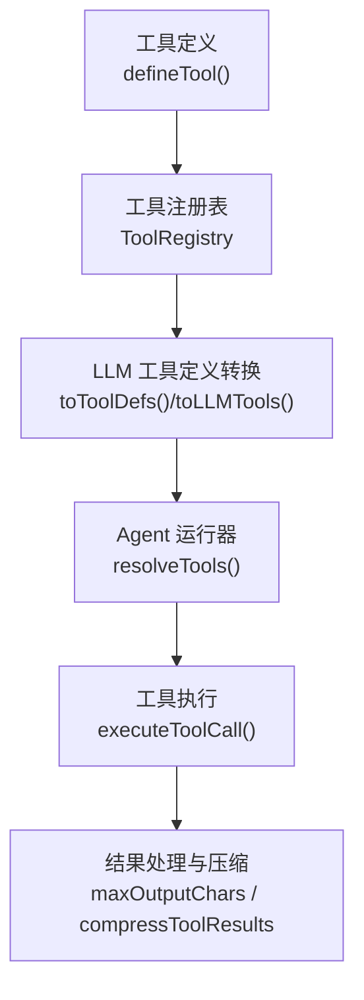
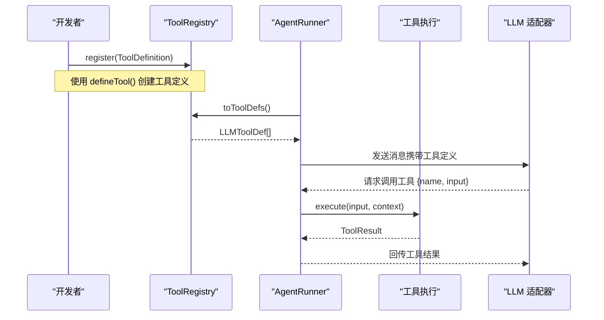
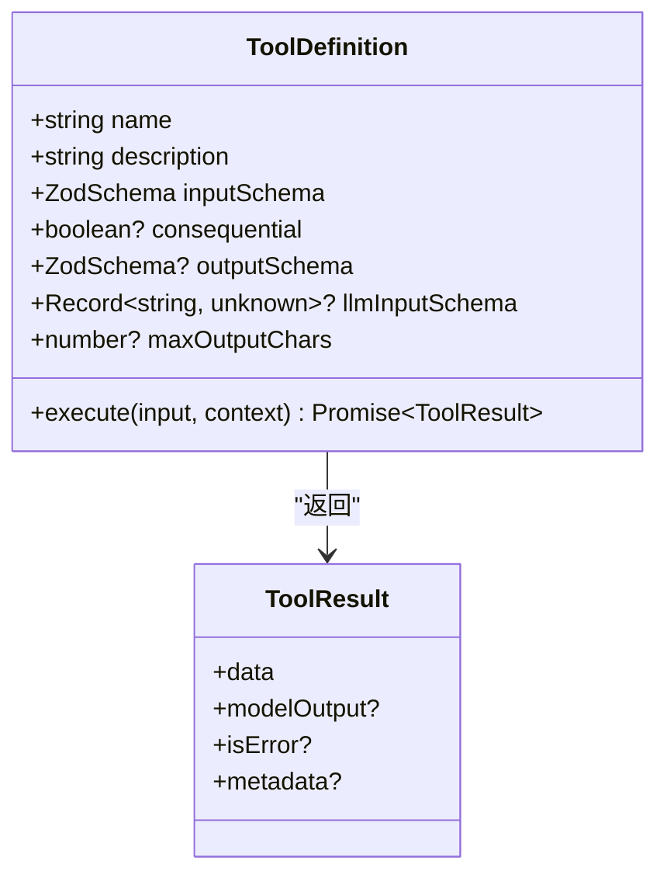
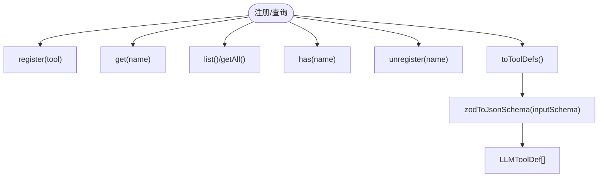
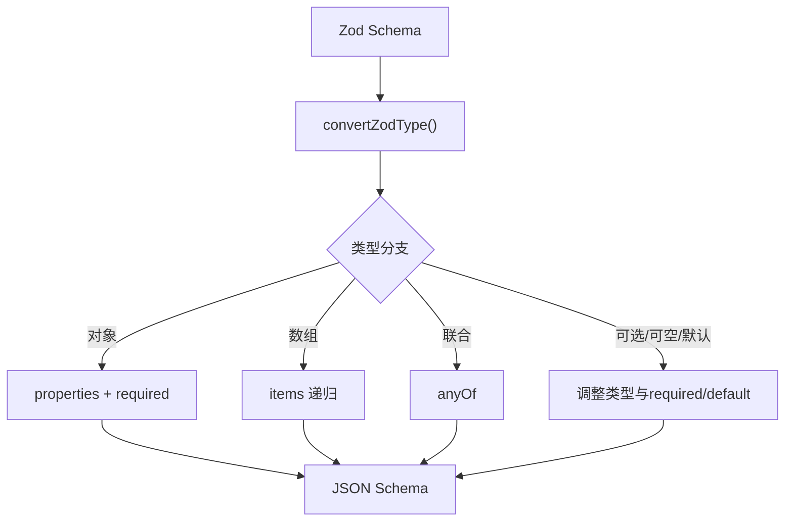
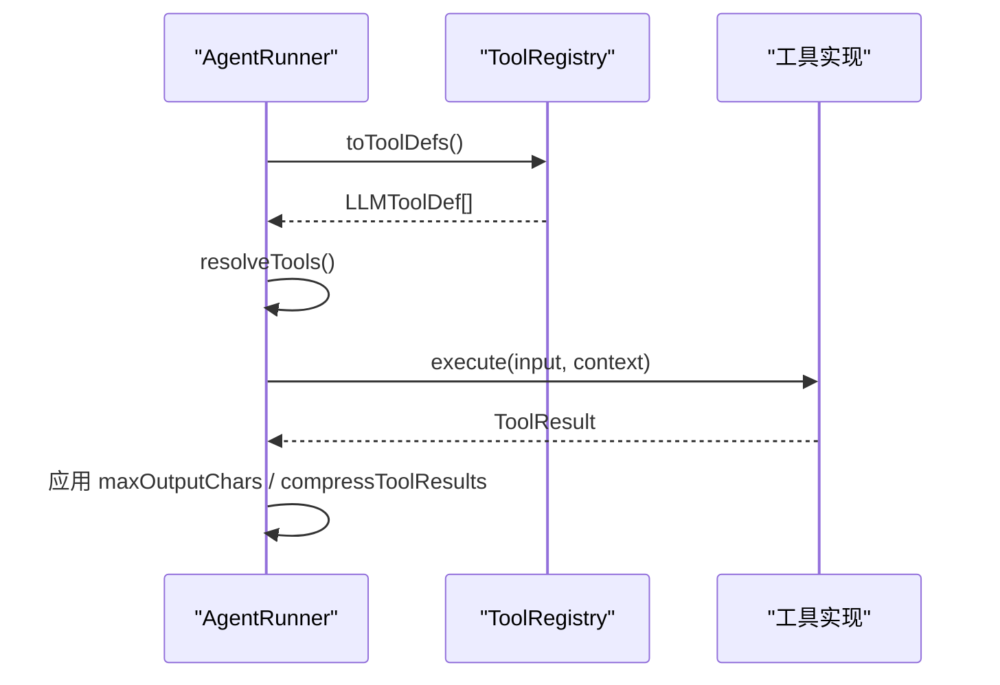
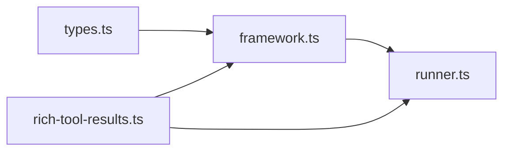

# 工具定义框架

<cite>
**本文引用的文件**
- [packages/core/src/tool/framework.ts](file://packages/core/src/tool/framework.ts)
- [packages/core/src/types.ts](file://packages/core/src/types.ts)
- [packages/core/src/agent/runner.ts](file://packages/core/src/agent/runner.ts)
- [packages/core/examples/patterns/rich-tool-results.ts](file://packages/core/examples/patterns/rich-tool-results.ts)
- [docs/tool-configuration.md](file://docs/tool-configuration.md)
</cite>

## 目录
1. [简介](#简介)
2. [项目结构](#项目结构)
3. [核心组件](#核心组件)
4. [架构总览](#架构总览)
5. [详细组件分析](#详细组件分析)
6. [依赖关系分析](#依赖关系分析)
7. [性能考量](#性能考量)
8. [故障排查指南](#故障排查指南)
9. [结论](#结论)
10. [附录](#附录)

## 简介
本文件系统性说明 open-multi-agent 的“工具定义框架”，聚焦 defineTool() 的完整用法、Zod 模式验证能力、工具注册与查询机制（ToolRegistry），以及工具在运行时的执行流程。文档面向不同技术背景的读者，提供从概念到代码级的分层解释，并辅以图示帮助理解。

## 项目结构
围绕工具定义框架的关键位置如下：
- 工具定义与转换：packages/core/src/tool/framework.ts
- 类型与上下文：packages/core/src/types.ts
- 工具解析与执行编排：packages/core/src/agent/runner.ts
- 示例与配置说明：packages/core/examples/patterns/rich-tool-results.ts、docs/tool-configuration.md

图表来源
- [packages/core/src/tool/framework.ts:71-117](file://packages/core/src/tool/framework.ts#L71-L117)
- [packages/core/src/tool/framework.ts:127-261](file://packages/core/src/tool/framework.ts#L127-L261)
- [packages/core/src/agent/runner.ts:817-827](file://packages/core/src/agent/runner.ts#L817-L827)
- [packages/core/src/agent/runner.ts:1364-1395](file://packages/core/src/agent/runner.ts#L1364-L1395)

章节来源
- [packages/core/src/tool/framework.ts:71-117](file://packages/core/src/tool/framework.ts#L71-L117)
- [packages/core/src/tool/framework.ts:127-261](file://packages/core/src/tool/framework.ts#L127-L261)
- [packages/core/src/agent/runner.ts:817-827](file://packages/core/src/agent/runner.ts#L817-L827)
- [packages/core/src/agent/runner.ts:1364-1395](file://packages/core/src/agent/runner.ts#L1364-L1395)

## 核心组件
- defineTool(config): 创建工具定义的工厂函数，返回满足 ToolDefinition 接口的对象。支持 name、description、inputSchema、consequential、outputSchema、llmInputSchema、maxOutputChars、execute。
- ToolRegistry: 工具注册表，提供 register/get/list/getAll/has/unregister/deregister/toToolDefs/toRuntimeToolDefs/toLLMTools 等方法。
- zodToJsonSchema(schema): 将 Zod 模式转换为 LLM 可用的 JSON Schema。
- ToolUseContext: 注入到每个工具执行的上下文，包含 agent、team、abortSignal/Controller、cwd、metadata、runId、taskId、toolCallId、credentials 等。
- ToolResult<TData>: 工具返回值，包含 data、modelOutput、isError、metadata。

章节来源
- [packages/core/src/tool/framework.ts:71-117](file://packages/core/src/tool/framework.ts#L71-L117)
- [packages/core/src/tool/framework.ts:127-261](file://packages/core/src/tool/framework.ts#L127-L261)
- [packages/core/src/tool/framework.ts:279-491](file://packages/core/src/tool/framework.ts#L279-L491)
- [packages/core/src/types.ts:511-516](file://packages/core/src/types.ts#L511-L516)
- [packages/core/src/types.ts:531-603](file://packages/core/src/types.ts#L531-L603)
- [packages/core/src/types.ts:676-734](file://packages/core/src/types.ts#L676-L734)

## 架构总览
下图展示了从工具定义到模型调用的关键路径：定义工具 → 注册到 ToolRegistry → 转换为 LLMToolDef → Agent 运行器选择可用工具 → 调用 execute → 输出控制与压缩。

图表来源
- [packages/core/src/tool/framework.ts:71-117](file://packages/core/src/tool/framework.ts#L71-L117)
- [packages/core/src/tool/framework.ts:127-261](file://packages/core/src/tool/framework.ts#L127-L261)
- [packages/core/src/agent/runner.ts:817-827](file://packages/core/src/agent/runner.ts#L817-L827)
- [packages/core/src/agent/runner.ts:1364-1395](file://packages/core/src/agent/runner.ts#L1364-L1395)

## 详细组件分析

### defineTool() 与 ToolDefinition
- name: 工具名称，必须唯一。
- description: 工具描述，用于模型理解工具用途。
- inputSchema: 输入校验模式（Zod）。运行时先校验再执行。
- consequential: 标记该工具具有真实副作用；未声明或为 false 视为无害。
- outputSchema: 对 ToolResult.data 的可选运行时校验。失败时返回错误 ToolResult。
- llmInputSchema: 直接作为 LLM 的 inputSchema（跳过 Zod→JSON Schema 转换），适用于 MCP 等外部工具。
- maxOutputChars: 单工具最大输出长度限制，超过会被截断（头+尾+标记）。
- execute(input, context): 执行函数，返回 Promise<ToolResult>。

图表来源
- [packages/core/src/types.ts:704-734](file://packages/core/src/types.ts#L704-L734)
- [packages/core/src/types.ts:676-691](file://packages/core/src/types.ts#L676-L691)

章节来源
- [packages/core/src/tool/framework.ts:71-117](file://packages/core/src/tool/framework.ts#L71-L117)
- [packages/core/src/types.ts:704-734](file://packages/core/src/types.ts#L704-L734)

### ToolRegistry 类
- register(tool, options?): 添加工具，重复名称抛错；可标记 runtimeAdded。
- get(name): 按名获取。
- list()/getAll(): 列出全部工具定义。
- has(name): 判断是否存在。
- unregister(name)/deregister(name): 移除工具。
- toToolDefs(): 将所有工具转为 LLMToolDef[]（优先使用 llmInputSchema，否则由 Zod 转换）。
- toRuntimeToolDefs(): 仅返回运行时动态添加的工具定义。
- toLLMTools(): 生成 Anthropic 风格的 input_schema 对象。

图表来源
- [packages/core/src/tool/framework.ts:127-261](file://packages/core/src/tool/framework.ts#L127-L261)
- [packages/core/src/tool/framework.ts:279-491](file://packages/core/src/tool/framework.ts#L279-L491)

章节来源
- [packages/core/src/tool/framework.ts:127-261](file://packages/core/src/tool/framework.ts#L127-L261)

### Zod 模式验证与 JSON Schema 转换
- 支持的类型与构造：字符串、数字、整数、布尔、null、日期、字面量、枚举、数组、元组、对象、记录、可选、可空、默认值、联合、判别联合、交叉、效果包装、any/unknown/never、管道等。
- 复杂对象：通过 z.object() 组合，自动推导 required 字段。
- 可选参数：z.optional()、z.nullable()、z.default() 影响 required 与类型。
- 默认值：z.default() 会在生成的 JSON Schema 中保留 default。
- 转换入口：zodToJsonSchema(schema)。

图表来源
- [packages/core/src/tool/framework.ts:279-491](file://packages/core/src/tool/framework.ts#L279-L491)

章节来源
- [packages/core/src/tool/framework.ts:279-491](file://packages/core/src/tool/framework.ts#L279-L491)

### 工具执行流程与上下文
- 工具解析：AgentRunner.resolveTools() 基于预设、白名单、黑名单与安全策略确定最终可用工具集。
- 工具调用：executeToolCall() 在授权集合内执行，若未授权则返回“未授权”错误结果。
- 上下文：ToolUseContext 注入 agent、team、abortSignal/Controller、cwd、metadata、runId、taskId、toolCallId、credentials 等。
- 输出控制：maxOutputChars 限制单工具输出长度；compressToolResults 对已消费结果进行压缩以节省上下文。

图表来源
- [packages/core/src/agent/runner.ts:817-827](file://packages/core/src/agent/runner.ts#L817-L827)
- [packages/core/src/agent/runner.ts:1364-1395](file://packages/core/src/agent/runner.ts#L1364-L1395)
- [packages/core/src/types.ts:531-603](file://packages/core/src/types.ts#L531-L603)

章节来源
- [packages/core/src/agent/runner.ts:817-827](file://packages/core/src/agent/runner.ts#L817-L827)
- [packages/core/src/agent/runner.ts:1364-1395](file://packages/core/src/agent/runner.ts#L1364-L1395)
- [packages/core/src/types.ts:531-603](file://packages/core/src/types.ts#L531-L603)

### 工具注册与使用示例
- 通过 customTools 注入：在 AgentConfig 中传入 defineTool() 创建的工具列表。
- 运行时注册：通过 agent.addTool(tool) 动态添加，始终可用（仍受 disallowedTools 约束）。
- 示例参考：rich-tool-results.ts 展示了如何定义带 modelOutput 的富结果工具并在 AgentConfig 中使用。

章节来源
- [docs/tool-configuration.md:443-467](file://docs/tool-configuration.md#L443-L467)
- [packages/core/examples/patterns/rich-tool-results.ts:23-59](file://packages/core/examples/patterns/rich-tool-results.ts#L23-L59)

### 后果性工具与确认
- consequential 标记：用于标识可能产生真实副作用的工具。
- 未声明运行的后果性检测：当最终授予的工具集中存在 consequential 工具时，结果会携带相应标志。
- 可选确认：可通过 requireConsequentialConfirmation 与 onToolCall 钩子实现人工确认或挂起决策。

章节来源
- [docs/tool-configuration.md:140-212](file://docs/tool-configuration.md#L140-L212)

### 内置工具与权限控制
- 默认拒绝：内置工具（如 bash、文件系统工具）需要显式授予（tools 或 toolPreset）。
- 预设与过滤：toolPreset 提供常见工具集；可与 allowedTools/disallowedTools 组合精细控制。
- 自定义工具豁免：customTools 或 addTool 注册的工具不受 grant 限制，但仍尊重 disallowedTools。

章节来源
- [docs/tool-configuration.md:214-289](file://docs/tool-configuration.md#L214-L289)

## 依赖关系分析
- framework.ts 依赖 types.ts 中的 ToolDefinition、ToolResult、ToolUseContext、LLMToolDef 等类型。
- runner.ts 依赖 ToolRegistry 与 grants 模块完成工具解析与执行。
- 示例 rich-tool-results.ts 依赖 defineTool 与 OpenMultiAgent 来演示富结果工具的使用。

图表来源
- [packages/core/src/tool/framework.ts:13-22](file://packages/core/src/tool/framework.ts#L13-L22)
- [packages/core/src/agent/runner.ts:53-70](file://packages/core/src/agent/runner.ts#L53-L70)
- [packages/core/examples/patterns/rich-tool-results.ts:14-16](file://packages/core/examples/patterns/rich-tool-results.ts#L14-L16)

章节来源
- [packages/core/src/tool/framework.ts:13-22](file://packages/core/src/tool/framework.ts#L13-L22)
- [packages/core/src/agent/runner.ts:53-70](file://packages/core/src/agent/runner.ts#L53-L70)
- [packages/core/examples/patterns/rich-tool-results.ts:14-16](file://packages/core/examples/patterns/rich-tool-results.ts#L14-L16)

## 性能考量
- 输出截断：通过 maxOutputChars 控制单工具输出大小，避免对话膨胀。
- 结果压缩：compressToolResults 对已消费的工具结果进行压缩，减少后续轮次的上下文成本。
- 工具数量与复杂度：过多或过复杂的工具定义会增加 JSON Schema 体积与解析开销，建议按需启用。

[本节为通用指导，不直接分析具体文件]

## 故障排查指南
- 重复工具名：ToolRegistry.register() 遇到同名工具会抛出错误，需确保名称唯一或先注销旧工具。
- 未授权工具调用：若模型请求了未授予的工具，执行器会返回“未授权”的错误结果，不会执行实现。
- 输出校验失败：ToolDefinition.outputSchema 校验失败会返回错误 ToolResult，便于模型自适应重试。
- 长输出导致上下文溢出：设置 maxOutputChars 或开启 compressToolResults。

章节来源
- [packages/core/src/tool/framework.ts:137-151](file://packages/core/src/tool/framework.ts#L137-L151)
- [packages/core/src/agent/runner.ts:1391-1395](file://packages/core/src/agent/runner.ts#L1391-L1395)
- [packages/core/src/types.ts:704-734](file://packages/core/src/types.ts#L704-L734)

## 结论
工具定义框架通过 defineTool() 提供统一的工具声明方式，结合 ToolRegistry 完成注册与转换，并由 AgentRunner 负责安全解析与执行。Zod 模式保障输入与输出的强类型校验，配合后果性标记与确认机制，可在灵活性与安全性之间取得平衡。合理运用输出控制与压缩策略，有助于在多轮对话中保持高效与稳定。

## 附录
- 快速上手步骤
  - 使用 defineTool() 定义工具，填写 name、description、inputSchema、execute。
  - 在 AgentConfig.customTools 中注入或通过 agent.addTool() 动态注册。
  - 如需绕过 Zod 转换，提供 llmInputSchema。
  - 为有副作用的工具设置 consequential，并结合 onToolCall 实现确认。
  - 通过 maxOutputChars 与 compressToolResults 控制输出规模。

- 参考示例
  - 富结果工具示例：rich-tool-results.ts
  - 工具配置与权限控制：docs/tool-configuration.md

章节来源
- [packages/core/examples/patterns/rich-tool-results.ts:23-59](file://packages/core/examples/patterns/rich-tool-results.ts#L23-L59)
- [docs/tool-configuration.md:443-467](file://docs/tool-configuration.md#L443-L467)
- [docs/tool-configuration.md:214-289](file://docs/tool-configuration.md#L214-L289)