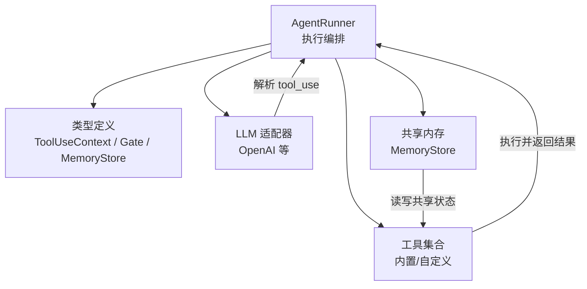
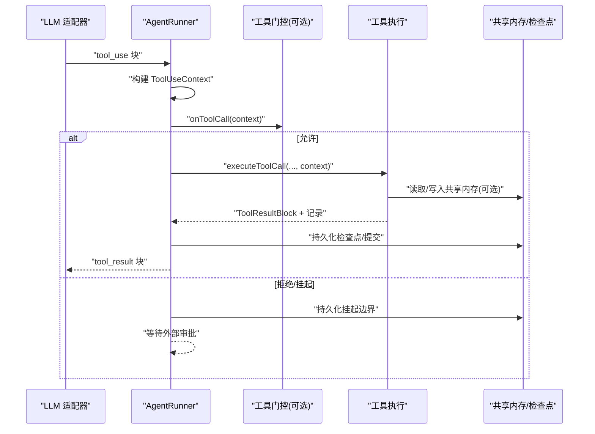
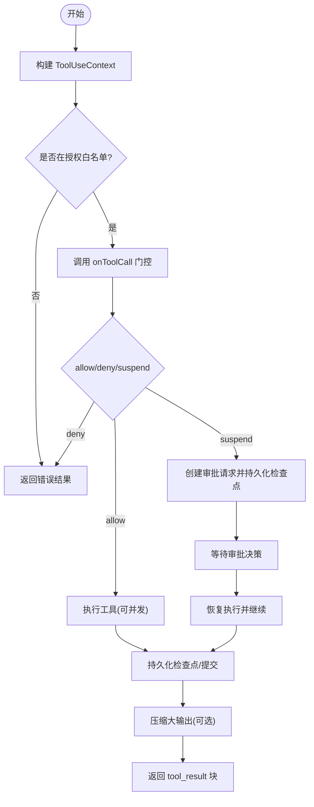
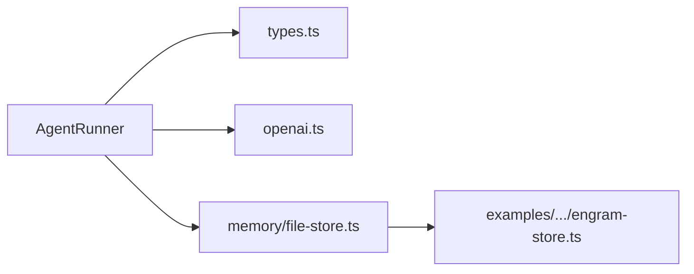

# 工具执行器

<cite>
**本文引用的文件**
- [runner.ts](file://packages/core/src/agent/runner.ts)
- [types.ts](file://packages/core/src/types.ts)
- [openai.ts](file://packages/core/src/llm/openai.ts)
- [file-store.ts](file://packages/core/src/memory/file-store.ts)
- [engram-store.ts](file://packages/core/examples/integrations/with-engram/engram-store.ts)
</cite>

## 目录
1. [简介](#简介)
2. [项目结构](#项目结构)
3. [核心组件](#核心组件)
4. [架构总览](#架构总览)
5. [详细组件分析](#详细组件分析)
6. [依赖关系分析](#依赖关系分析)
7. [性能考量](#性能考量)
8. [故障排查指南](#故障排查指南)
9. [结论](#结论)
10. [附录](#附录)

## 简介
本文件面向“工具执行器”的设计与实现，聚焦 ToolExecutor 接口（由框架在 AgentRunner 中驱动）的生命周期管理、ToolUseContext 上下文属性与用法、错误处理与恢复、并发与超时控制、以及安全沙箱与权限控制。文档同时提供自定义工具执行器的实践指引，覆盖异步操作、文件 I/O、网络请求等常见场景。

## 项目结构
围绕工具执行的核心代码主要位于 core 包的 agent 与 types 模块：
- 执行编排与生命周期：AgentRunner 负责模型调用、工具发现与授权、工具并行执行、检查点持久化、审批挂起与恢复。
- 类型与上下文：ToolUseContext、ToolCallGate、MemoryStore、TeamInfo 等定义工具执行所需的数据契约。
- LLM 适配器：将模型返回的工具调用块解析为统一 IR，供执行器消费。
- 共享内存：MemoryStore 抽象及文件/远程存储示例，用于团队级共享状态与审计。

图表来源
- [runner.ts:990-1103](file://packages/core/src/agent/runner.ts#L990-L1103)
- [types.ts:531-583](file://packages/core/src/types.ts#L531-L583)
- [openai.ts:296-331](file://packages/core/src/llm/openai.ts#L296-L331)

章节来源
- [runner.ts:990-1103](file://packages/core/src/agent/runner.ts#L990-L1103)
- [types.ts:531-583](file://packages/core/src/types.ts#L531-L583)
- [openai.ts:296-331](file://packages/core/src/llm/openai.ts#L296-L331)

## 核心组件
- AgentRunner：驱动完整智能体对话循环，包含模型调用、工具发现与授权、工具并行执行、检查点持久化、审批挂起与恢复、结果压缩与追踪。
- ToolUseContext：注入到每个工具执行的上下文，包含代理信息、团队信息、取消信号、工作目录、凭据、运行/任务 ID、共享内存访问等。
- ToolCallGate：可选的每调用门控，决定允许、拒绝或挂起工具调用。
- MemoryStore：跨代理共享的键值存储抽象，支持 TTL、CAS 等能力。

章节来源
- [runner.ts:1364-1395](file://packages/core/src/agent/runner.ts#L1364-L1395)
- [types.ts:531-583](file://packages/core/src/types.ts#L531-L583)
- [types.ts:592-618](file://packages/core/src/types.ts#L592-L618)
- [types.ts:2842-2872](file://packages/core/src/types.ts#L2842-L2872)

## 架构总览
下图展示一次工具调用的端到端流程：从模型响应中提取工具调用，经授权与门控后并行执行，必要时挂起等待审批，完成后持久化检查点并回写结果。

图表来源
- [runner.ts:990-1103](file://packages/core/src/agent/runner.ts#L990-L1103)
- [runner.ts:1364-1395](file://packages/core/src/agent/runner.ts#L1364-L1395)
- [types.ts:592-618](file://packages/core/src/types.ts#L592-L618)
- [types.ts:2842-2872](file://packages/core/src/types.ts#L2842-L2872)

## 详细组件分析

### 工具执行生命周期（AgentRunner）
- 工具发现与授权：根据配置生成可用工具集合并维护白名单；未授权的工具调用不会执行，直接返回错误结果。
- 上下文构建：为每次工具调用构造 ToolUseContext，注入代理信息、团队信息、取消信号、工作目录、凭据、runId/taskId 等。
- 并行执行：对 pendingToolCalls 使用 Promise.all 并发执行，提升吞吐。
- 审批与挂起：当门控返回 suspend 时，创建审批请求并持久化检查点，暂停执行直到决策到达。
- 结果回写与压缩：将工具结果以 tool_result 块回写模型上下文，并对大输出进行压缩以减少上下文膨胀。
- 追踪与度量：为每次工具执行创建 span，记录输入输出摘要、是否错误、门控动作等。

图表来源
- [runner.ts:990-1103](file://packages/core/src/agent/runner.ts#L990-L1103)
- [runner.ts:1364-1395](file://packages/core/src/agent/runner.ts#L1364-L1395)
- [runner.ts:1759-1790](file://packages/core/src/agent/runner.ts#L1759-L1790)

章节来源
- [runner.ts:990-1103](file://packages/core/src/agent/runner.ts#L990-L1103)
- [runner.ts:1364-1395](file://packages/core/src/agent/runner.ts#L1364-L1395)
- [runner.ts:1759-1790](file://packages/core/src/agent/runner.ts#L1759-L1790)

### ToolUseContext 属性与使用方法
- 代理信息：name、role、model，便于工具识别调用者身份与模型。
- 团队信息：team.name、agents、sharedMemory、delegationDepth 等，支持多代理协作与审计。
- 取消控制：abortSignal/abortController，支持简单检查或进程级终止。
- 工作目录：cwd，用于文件系统工具的沙箱根路径；null 表示禁用沙箱。
- 凭据：credentials，按代理隔离的密钥集合，自动脱敏。
- 标识：runId、taskId、toolCallId，用于追踪与幂等性。
- 共享内存：通过 team.sharedMemory 访问 MemoryStore，实现跨代理数据共享。

章节来源
- [runner.ts:1796-1811](file://packages/core/src/agent/runner.ts#L1796-L1811)
- [types.ts:531-583](file://packages/core/src/types.ts#L531-L583)
- [types.ts:628-636](file://packages/core/src/types.ts#L628-L636)

### 工具执行过程中的错误处理机制
- 默认拒绝：未授权的工具调用直接返回错误结果，不执行副作用。
- 异常捕获：工具执行期间抛出的异常会被捕获并转换为工具结果，标记 isError。
- 重试策略：任务级别支持 maxRetries、retryDelayMs、retryBackoff；工具层可通过幂等 key（toolCallId）配合外部系统实现幂等重试。
- 预算与循环检测：token 预算超限会触发 budget_exceeded；重复工具调用或文本会注入警告，防止死循环。
- 审批失败：不可恢复的审批失败会导致关闭式失败，避免不一致状态。

章节来源
- [runner.ts:1391-1395](file://packages/core/src/agent/runner.ts#L1391-L1395)
- [runner.ts:1204-1234](file://packages/core/src/agent/runner.ts#L1204-L1234)
- [types.ts:2083-2088](file://packages/core/src/types.ts#L2083-L2088)

### 性能优化技巧
- 并发控制：pendingToolCalls 使用 Promise.all 并发执行，提高吞吐；可通过上层调度限制并发度。
- 资源管理：通过 abortSignal/abortController 及时中断长耗时操作；LLM 调用具备 per-call timeout，避免卡死。
- 上下文压缩：对已消费的 tool_result 进行压缩，减少后续模型调用成本。
- 共享内存 TTL：MemoryStore 支持 setWithExpiry，结合 turnCount 实现过期清理，降低长期占用。

章节来源
- [runner.ts:990-1103](file://packages/core/src/agent/runner.ts#L990-L1103)
- [runner.ts:544-582](file://packages/core/src/agent/runner.ts#L544-L582)
- [runner.ts:1153-1178](file://packages/core/src/agent/runner.ts#L1153-L1178)
- [types.ts:2857-2868](file://packages/core/src/types.ts#L2857-L2868)

### 自定义工具执行器实现指南
- 基本步骤：
  - 注册工具名称与输入 Schema，确保被 resolveTools() 授予。
  - 在 executeToolCall 中读取 ToolUseContext，按需访问 credentials、team.sharedMemory、cwd。
  - 实现幂等：利用 toolCallId 作为外部幂等键，避免重复执行。
  - 处理取消：定期检查 abortSignal.aborted 或监听 abortController.signal。
  - 错误处理：捕获异常并返回结构化错误结果，设置 is_error。
  - 结果大小控制：遵循 maxOutputChars 限制，必要时分片或引用远端资源。
- 常见场景：
  - 异步操作：使用 async/await 并支持取消；在关键阶段检查取消信号。
  - 文件 I/O：基于 cwd 沙箱进行绝对路径校验；避免越权访问。
  - 网络请求：设置超时与重试上限；对敏感头与响应体进行脱敏。
  - 共享内存：通过 team.sharedMemory 读写键值，注意并发与 TTL。

章节来源
- [runner.ts:1364-1395](file://packages/core/src/agent/runner.ts#L1364-L1395)
- [runner.ts:1796-1811](file://packages/core/src/agent/runner.ts#L1796-L1811)
- [types.ts:531-583](file://packages/core/src/types.ts#L531-L583)
- [types.ts:2842-2872](file://packages/core/src/types.ts#L2842-L2872)

### 安全沙箱与权限控制
- 默认拒绝：仅执行在白名单中的工具；未授权调用返回错误结果。
- 工作目录沙箱：文件系统工具要求绝对路径且必须落在 cwd 内；symlink 也会被解析检查。
- 凭据隔离：每个代理持有独立的 credentials，避免子代理访问其他代理的密钥。
- 门控与审批：onToolCall 可对敏感工具进行 deny/suspend；suspend 需要外部审批后才执行。
- 审计与追踪：工具调用与结果会被记录到 trace，敏感字段自动脱敏。

章节来源
- [runner.ts:1391-1395](file://packages/core/src/agent/runner.ts#L1391-L1395)
- [types.ts:571-583](file://packages/core/src/types.ts#L571-L583)
- [types.ts:592-618](file://packages/core/src/types.ts#L592-L618)

## 依赖关系分析
- AgentRunner 依赖：
  - LLM 适配器：解析 tool_use 块并返回结构化输入。
  - 类型定义：ToolUseContext、ToolCallGate、MemoryStore 等契约。
  - 共享内存：用于团队级状态共享与审计。
- 外部集成：
  - OpenAI 适配器：流式解析函数调用参数，组装 tool_use 块。
  - 文件存储：FileStore 提供本地持久化；EngramStore 提供远程共享内存。

图表来源
- [runner.ts:990-1103](file://packages/core/src/agent/runner.ts#L990-L1103)
- [openai.ts:296-331](file://packages/core/src/llm/openai.ts#L296-L331)
- [file-store.ts:23-54](file://packages/core/src/memory/file-store.ts#L23-L54)
- [engram-store.ts:1-40](file://packages/core/examples/integrations/with-engram/engram-store.ts#L1-L40)

章节来源
- [runner.ts:990-1103](file://packages/core/src/agent/runner.ts#L990-L1103)
- [openai.ts:296-331](file://packages/core/src/llm/openai.ts#L296-L331)
- [file-store.ts:23-54](file://packages/core/src/memory/file-store.ts#L23-L54)
- [engram-store.ts:1-40](file://packages/core/examples/integrations/with-engram/engram-store.ts#L1-L40)

## 性能考量
- 并发执行：工具调用批量并发，注意外部资源限流与背压。
- 超时控制：per-call timeout 统一各供应商行为，避免长时间阻塞。
- 上下文压缩：对已消费结果进行压缩，降低后续模型调用成本。
- 共享内存 TTL：合理设置 expiresAtTurn，避免长期占用。
- 追踪开销：仅在启用 observability 时创建 span，生产环境按需开启。

[本节为通用指导，无需特定文件来源]

## 故障排查指南
- 工具未被执行：检查是否在授权白名单；确认 onToolCall 未返回 deny/suspend。
- 审批挂起：查看 pendingApprovals 与 approvalDecisions；确保外部审批服务正确消费并回写决策。
- 超时与取消：确认 abortSignal 是否被触发；检查 per-call timeout 配置是否过短。
- 大输出导致上下文膨胀：启用压缩或调整 maxOutputChars；考虑返回 URL 引用而非内联内容。
- 共享内存一致性：使用 compareAndSet 保证 CAS 语义；避免无锁竞争导致的脏写。

章节来源
- [runner.ts:1391-1395](file://packages/core/src/agent/runner.ts#L1391-L1395)
- [runner.ts:1046-1069](file://packages/core/src/agent/runner.ts#L1046-L1069)
- [runner.ts:544-582](file://packages/core/src/agent/runner.ts#L544-L582)
- [types.ts:2842-2872](file://packages/core/src/types.ts#L2842-L2872)

## 结论
工具执行器通过 AgentRunner 提供了完整的生命周期管理：从工具发现与授权、上下文注入、并发执行、审批挂起到结果回写与追踪。ToolUseContext 为工具提供了丰富的运行时信息，包括代理、团队、取消、凭据与共享内存访问。错误处理与恢复机制确保了健壮性与可恢复性；并发、超时与压缩等优化手段提升了整体性能。安全沙箱与权限控制则保障了工具执行的可控性与安全性。

[本节为总结，无需特定文件来源]

## 附录
- 参考实现：
  - FileStore：本地文件持久化的 MemoryStore 实现。
  - EngramStore：基于 REST API 的远程共享内存实现。
- 最佳实践：
  - 始终使用 toolCallId 实现幂等。
  - 在关键路径检查取消信号。
  - 对敏感数据进行脱敏与最小化暴露。
  - 合理设置超时与重试策略。

章节来源
- [file-store.ts:23-54](file://packages/core/src/memory/file-store.ts#L23-L54)
- [engram-store.ts:1-40](file://packages/core/examples/integrations/with-engram/engram-store.ts#L1-L40)