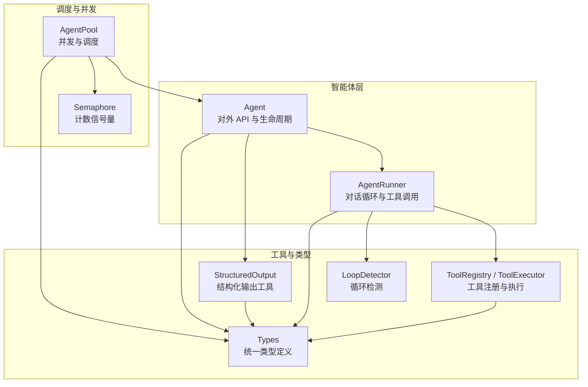
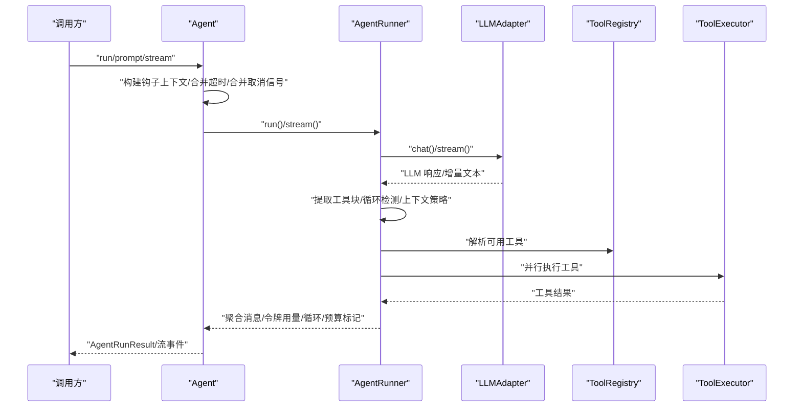
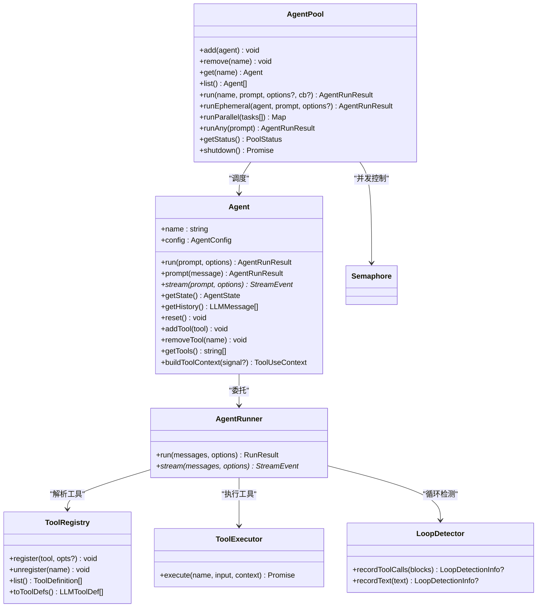
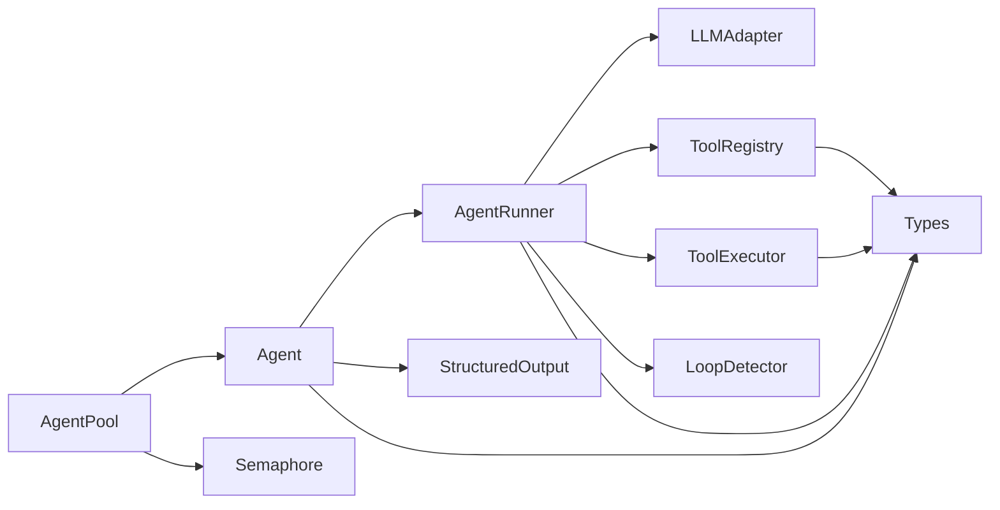

# 智能体 API

<cite>
**本文引用的文件**
- [agent.ts](file://src/agent/agent.ts)
- [runner.ts](file://src/agent/runner.ts)
- [pool.ts](file://src/agent/pool.ts)
- [loop-detector.ts](file://src/agent/loop-detector.ts)
- [structured-output.ts](file://src/agent/structured-output.ts)
- [types.ts](file://src/types.ts)
- [semaphore.ts](file://src/utils/semaphore.ts)
- [framework.ts](file://src/tool/framework.ts)
- [single-agent.ts](file://examples/basics/single-agent.ts)
- [structured-output.ts（示例）](file://examples/patterns/structured-output.ts)
- [agent-pool.test.ts](file://tests/agent-pool.test.ts)
- [agent-hooks.test.ts](file://tests/agent-hooks.test.ts)
- [onAgentStream.test.ts](file://tests/onAgentStream.test.ts)
</cite>

## 目录
1. [简介](#简介)
2. [项目结构](#项目结构)
3. [核心组件](#核心组件)
4. [架构总览](#架构总览)
5. [详细组件分析](#详细组件分析)
6. [依赖关系分析](#依赖关系分析)
7. [性能考量](#性能考量)
8. [故障排查指南](#故障排查指南)
9. [结论](#结论)
10. [附录](#附录)

## 简介
本文件为智能体系统（open-multi-agent）的全面 API 文档，聚焦于 Agent 类及其运行时能力，涵盖：
- Agent 的公共接口：创建、配置与执行（run、prompt、stream）
- AgentConfig 配置项详解：name、model、systemPrompt、maxTokens、temperature 等
- AgentPool 池化并发与调度机制
- LoopDetector 循环检测功能
- 结构化输出工具链：buildStructuredOutputInstruction、extractJSON、validateOutput
- 生命周期管理、状态跟踪与并发控制
- 钩子函数 beforeRun/afterRun、流式回调 onAgentStream、错误恢复
- 智能体间通信协议与消息格式

## 项目结构
该模块围绕“智能体”“运行器”“池化”“循环检测”“结构化输出”五大子系统组织，配合通用类型定义与工具类实现统一的跨提供商适配。

图表来源
- [agent.ts:94-670](file://src/agent/agent.ts#L94-L670)
- [runner.ts:348-1301](file://src/agent/runner.ts#L348-L1301)
- [pool.ts:58-370](file://src/agent/pool.ts#L58-L370)
- [loop-detector.ts:33-138](file://src/agent/loop-detector.ts#L33-L138)
- [structured-output.ts:21-127](file://src/agent/structured-output.ts#L21-L127)
- [types.ts:367-602](file://src/types.ts#L367-L602)
- [semaphore.ts:24-95](file://src/utils/semaphore.ts#L24-L95)
- [framework.ts:121-200](file://src/tool/framework.ts#L121-L200)

章节来源
- [agent.ts:94-670](file://src/agent/agent.ts#L94-L670)
- [runner.ts:348-1301](file://src/agent/runner.ts#L348-L1301)
- [pool.ts:58-370](file://src/agent/pool.ts#L58-L370)
- [loop-detector.ts:33-138](file://src/agent/loop-detector.ts#L33-L138)
- [structured-output.ts:21-127](file://src/agent/structured-output.ts#L21-L127)
- [types.ts:367-602](file://src/types.ts#L367-L602)
- [semaphore.ts:24-95](file://src/utils/semaphore.ts#L24-L95)
- [framework.ts:121-200](file://src/tool/framework.ts#L121-L200)

## 核心组件
- Agent：面向使用者的高层 API，封装历史会话、动态工具注册、流式输出、钩子与追踪。
- AgentRunner：核心对话循环引擎，负责 LLM 调用、工具解析与执行、上下文压缩、预算与循环检测。
- AgentPool：多智能体并发调度器，基于信号量与每实例互斥锁保障线程安全与资源控制。
- LoopDetector：滑动窗口循环检测器，识别重复工具调用与文本输出。
- StructuredOutput：结构化输出指令构建、JSON 提取与 Zod 校验。
- Types：统一的消息、事件、追踪、工具、配置等类型定义。

章节来源
- [agent.ts:94-670](file://src/agent/agent.ts#L94-L670)
- [runner.ts:348-1301](file://src/agent/runner.ts#L348-L1301)
- [pool.ts:58-370](file://src/agent/pool.ts#L58-L370)
- [loop-detector.ts:33-138](file://src/agent/loop-detector.ts#L33-L138)
- [structured-output.ts:21-127](file://src/agent/structured-output.ts#L21-L127)
- [types.ts:367-602](file://src/types.ts#L367-L602)

## 架构总览
下图展示从外部调用到内部运行器与工具执行的关键交互路径。

图表来源
- [agent.ts:205-409](file://src/agent/agent.ts#L205-L409)
- [runner.ts:673-1065](file://src/agent/runner.ts#L673-L1065)
- [types.ts:1065-1106](file://src/types.ts#L1065-L1106)

## 详细组件分析

### Agent 类 API
- 构造与注入
  - 接收 AgentConfig、ToolRegistry、ToolExecutor；共享同一 ToolRegistry 可实现团队级工具复用。
- 主要执行方法
  - run(prompt, runOptions?)：一次性对话，不修改持久历史。
  - prompt(message)：多轮对话，追加用户消息并更新历史。
  - stream(prompt, runOptions?)：流式输出，逐段返回事件。
- 状态与历史
  - getState()：快照当前状态（含消息与令牌用量）。
  - getHistory()：返回持久历史副本。
  - reset()：清空历史并重置为 idle。
- 动态工具管理
  - addTool(tool)：运行时注册新工具。
  - removeTool(name)：移除工具（无冲突）。
  - getTools()：列出当前已注册工具名。
- 生命周期与钩子
  - beforeRun(context)：在每次 run/prompt/stream 前被调用，可修改提示词。
  - afterRun(result)：成功完成后调用，可修改最终结果。
- 流式回调与追踪
  - runOptions.onTrace：可观测性追踪事件。
  - runOptions.onMessage：接收每条消息回调。
- 并发与取消
  - 支持 per-call AbortSignal 与全局超时（timeoutMs）。
  - 内部合并超时与调用者提供的取消信号。
- 结构化输出
  - 若配置了 outputSchema，则自动解析并校验最终 JSON，失败时重试一次并反馈错误。

章节来源
- [agent.ts:94-670](file://src/agent/agent.ts#L94-L670)
- [types.ts:367-531](file://src/types.ts#L367-L531)

### AgentRunner 运行器 API
- 静态配置 RunnerOptions
  - model、systemPrompt、maxTurns、maxTokens、temperature、topP、topK、minP、parallelToolCalls、frequencyPenalty、presencePenalty、extraBody、thinking、abortSignal、toolPreset、allowedTools、disallowedTools、agentName、agentRole、loopDetection、maxTokenBudget、contextStrategy、compressToolResults。
- 运行配置 RunOptions
  - onToolCall、onToolResult、onMessage、onWarning、onTrace、runId、taskId、traceAgent、abortSignal、team。
- 执行接口
  - run(messages, options?)：一次性完成所有轮次。
  - stream(initialMessages, options?)：异步生成器，产出 text、tool_use、tool_result、loop_detected、budget_exceeded、done、error 等事件。
- 上下文策略
  - sliding-window、summarize、compact、custom 四种策略，分别用于滑窗裁剪、摘要压缩、规则压缩与自定义压缩。
- 循环检测
  - 基于 LoopDetector 的工具签名与文本重复检测，支持 warn/inject/terminate 策略。
- 工具解析与执行
  - 三段式过滤（preset → allowlist → denylist），结合框架安全限制与运行时自定义工具。
  - 并行执行工具调用，收集工具结果与元数据（如嵌套调用产生的 tokenUsage）。

章节来源
- [runner.ts:67-197](file://src/agent/runner.ts#L67-L197)
- [runner.ts:628-1065](file://src/agent/runner.ts#L628-L1065)
- [runner.ts:1081-1283](file://src/agent/runner.ts#L1081-L1283)
- [types.ts:124-152](file://src/types.ts#L124-L152)

### AgentPool 池化与并发
- 注册与查询
  - add(agent)/remove(name)/get(name)/list()：命名注册表。
- 执行接口
  - run(name, prompt, runOptions?, streamCallback?)：按名称调度，串行化同名实例运行，受全局并发限制。
  - runEphemeral(agent, prompt, runOptions?)：对临时 Agent 实例仅受全局并发限制。
  - runParallel(tasks[])：并发执行多个任务，返回映射。
  - runAny(prompt)：轮询选择空闲实例执行。
- 并发控制
  - 全局信号量控制并发槽位。
  - 每个 Agent 实例持有独立信号量（1）以序列化同一实例的多次运行，避免竞态。
- 观测与关闭
  - getStatus()：统计各状态数量。
  - shutdown()：重置所有注册的 Agent。

章节来源
- [pool.ts:58-370](file://src/agent/pool.ts#L58-L370)
- [semaphore.ts:24-95](file://src/utils/semaphore.ts#L24-L95)

### LoopDetector 循环检测
- 窗口与阈值
  - maxRepetitions：连续重复阈值，默认 3。
  - loopDetectionWindow：滑动窗口大小，默认 4；实际窗口不小于阈值。
- 记录接口
  - recordToolCalls(blocks)：基于排序后的工具签名检测重复。
  - recordText(text)：标准化文本后检测重复。
- 返回信息
  - kind：tool_repetition 或 text_repetition。
  - repetitions：连续次数。
  - detail：人类可读描述。

章节来源
- [loop-detector.ts:33-138](file://src/agent/loop-detector.ts#L33-L138)

### 结构化输出工具链
- buildStructuredOutputInstruction(schema)
  - 将 Zod schema 转换为 JSON Schema，并拼接系统提示，要求模型只输出符合该模式的 JSON。
- extractJSON(raw)
  - 从原始文本中提取 JSON，支持直接 JSON、带 fenced 的 JSON、裸 JSON 对象/数组等三种模式。
- validateOutput(schema, data)
  - 使用 Zod 对解析后的数据进行校验，失败时抛出包含问题列表的错误。

章节来源
- [structured-output.ts:21-127](file://src/agent/structured-output.ts#L21-L127)

### 类关系图（代码级）

图表来源
- [agent.ts:94-670](file://src/agent/agent.ts#L94-L670)
- [runner.ts:348-1301](file://src/agent/runner.ts#L348-L1301)
- [pool.ts:58-370](file://src/agent/pool.ts#L58-L370)
- [loop-detector.ts:33-138](file://src/agent/loop-detector.ts#L33-L138)
- [framework.ts:121-200](file://src/tool/framework.ts#L121-L200)

## 依赖关系分析
- 组件耦合
  - Agent 依赖 AgentRunner、ToolRegistry、ToolExecutor、LoopDetector（通过 Runner）、StructuredOutput（通过 Agent）。
  - AgentPool 依赖 Agent 与 Semaphore，确保并发与实例级串行。
  - Runner 依赖 Adapter、ToolRegistry、ToolExecutor、LoopDetector、Types。
- 外部依赖
  - Zod 用于结构化输出校验。
  - 各 LLM 适配器实现 LLMAdapter 接口。
- 循环依赖
  - 未发现直接循环；Runner 与 Agent 通过组合而非继承解耦。

图表来源
- [agent.ts:94-670](file://src/agent/agent.ts#L94-L670)
- [runner.ts:348-1301](file://src/agent/runner.ts#L348-L1301)
- [pool.ts:58-370](file://src/agent/pool.ts#L58-L370)
- [types.ts:367-602](file://src/types.ts#L367-L602)

章节来源
- [agent.ts:94-670](file://src/agent/agent.ts#L94-L670)
- [runner.ts:348-1301](file://src/agent/runner.ts#L348-L1301)
- [pool.ts:58-370](file://src/agent/pool.ts#L58-L370)
- [types.ts:367-602](file://src/types.ts#L367-L602)

## 性能考量
- 并发控制
  - AgentPool 使用信号量限制全局并发，避免资源争用；每 Agent 实例使用独立信号量保证状态一致性。
- 上下文压缩
  - sliding-window：快速裁剪旧轮次，保持消息对齐。
  - summarize：摘要模型压缩旧上下文，适合长对话。
  - compact：规则压缩，保留决策（tool_use）与关键错误/结果。
  - custom：允许自定义压缩策略。
- 工具并行
  - 多工具调用并行执行，显著降低总延迟。
- 令牌预算
  - maxTokenBudget 与 maxTurns 双重保护，防止无限增长。
- 循环检测
  - 提前终止或注入警告，避免无效轮转消耗资源。

[本节为通用指导，无需特定文件引用]

## 故障排查指南
- 钩子函数导致异常
  - beforeRun 抛错会直接中止本次运行且不调用 LLM。
  - afterRun 抛错会将运行标记为失败。
- 流式回调异常
  - AgentPool.run() 中的 streamCallback 异常不会影响执行，但建议捕获并记录。
- 取消与超时
  - 支持 per-call AbortSignal 与全局 timeoutMs；两者合并生效。
- 循环检测
  - 当检测到重复工具调用或文本输出时，可能触发 warn/inject/terminate 行为，必要时调整策略或输入。
- 结构化输出
  - 首次验证失败会自动重试一次并反馈错误；若仍失败，最终结果的 structured 字段为空。

章节来源
- [agent-hooks.test.ts:112-140](file://tests/agent-hooks.test.ts#L112-L140)
- [onAgentStream.test.ts:114-132](file://tests/onAgentStream.test.ts#L114-L132)
- [runner.ts:824-862](file://src/agent/runner.ts#L824-L862)
- [agent.ts:437-516](file://src/agent/agent.ts#L437-L516)

## 结论
该智能体系统通过清晰的分层设计与完善的运行时能力，提供了从单智能体到多智能体协作的全栈支持。Agent 作为对外统一入口，封装了历史管理、动态工具、流式输出与可观测性；AgentRunner 则承担核心对话循环与工具编排；AgentPool 提供高可靠并发调度；LoopDetector 与结构化输出工具链进一步增强了鲁棒性与可预测性。配合丰富的钩子与回调，开发者可以灵活扩展与集成。

[本节为总结性内容，无需特定文件引用]

## 附录

### AgentConfig 配置项详解
- 基础
  - name：智能体名称（唯一标识）。
  - model：模型标识符。
  - systemPrompt：系统提示（可选）。
  - provider/baseURL/apiKey/region：提供商与认证（可选）。
- 工具与访问控制
  - customTools：自定义工具（可选）。
  - tools/disallowedTools/toolPreset：工具白名单/黑名单/预设。
- 推理与采样
  - maxTurns/maxTokens/temperature/topP/topK/minP/frequencyPenalty/presencePenalty/extraBody/thinking/parallelToolCalls。
- 超时与预算
  - timeoutMs：整次运行最大耗时。
  - maxTokenBudget：累计输入输出令牌上限。
- 上下文策略
  - contextStrategy：滑窗/摘要/紧凑/自定义压缩策略。
- 输出与钩子
  - outputSchema：结构化输出 Zod 模式（可选）。
  - beforeRun/afterRun：运行前后钩子（可选）。
- 循环检测
  - loopDetection：循环检测配置（可选）。
- 工具输出长度
  - maxToolOutputChars：全局工具输出截断阈值（可选）。
- 工具结果压缩
  - compressToolResults：是否压缩已消费工具结果（可选）。

章节来源
- [types.ts:367-531](file://src/types.ts#L367-L531)

### Agent 生命周期与状态
- 状态机
  - idle → running → completed | error
- 状态字段
  - status/messages/tokenUsage/error（可选）

章节来源
- [types.ts:568-574](file://src/types.ts#L568-L574)
- [agent.ts:622-628](file://src/agent/agent.ts#L622-L628)

### 流式处理与回调
- Agent.stream() 事件类型
  - text、tool_use、tool_result、loop_detected、budget_exceeded、done、error
- AgentPool.run() 回调隔离
  - streamCallback 异常不影响执行流程。

章节来源
- [runner.ts:184-187](file://src/agent/runner.ts#L184-L187)
- [onAgentStream.test.ts:114-132](file://tests/onAgentStream.test.ts#L114-L132)

### 智能体间通信协议与消息格式
- LLMMessage
  - role：'user' | 'assistant'
  - content：ContentBlock[]（TextBlock、ToolUseBlock、ToolResultBlock、ImageBlock、ReasoningBlock）
- ContentBlock
  - TextBlock、ToolUseBlock、ToolResultBlock、ImageBlock、ReasoningBlock
- 工具调用与结果
  - ToolUseBlock：id 唯一标识，name/input
  - ToolResultBlock：tool_use_id 关联，content/is_error
- 团队上下文
  - TeamInfo：团队名、成员、共享内存、委托深度与链路等（用于工具上下文注入）。

章节来源
- [types.ts:15-122](file://src/types.ts#L15-L122)
- [types.ts:251-271](file://src/types.ts#L251-L271)

### 使用示例参考
- 单智能体与流式输出
  - 示例：examples/basics/single-agent.ts
- 结构化输出
  - 示例：examples/patterns/structured-output.ts
- 池化并发与状态观测
  - 测试：tests/agent-pool.test.ts
- 钩子函数行为
  - 测试：tests/agent-hooks.test.ts
- 流式回调与取消
  - 测试：tests/onAgentStream.test.ts

章节来源
- [single-agent.ts:14-134](file://examples/basics/single-agent.ts#L14-L134)
- [structured-output.ts（示例）:17-74](file://examples/patterns/structured-output.ts#L17-L74)
- [agent-pool.test.ts:41-200](file://tests/agent-pool.test.ts#L41-L200)
- [agent-hooks.test.ts:68-200](file://tests/agent-hooks.test.ts#L68-L200)
- [onAgentStream.test.ts:75-133](file://tests/onAgentStream.test.ts#L75-L133)