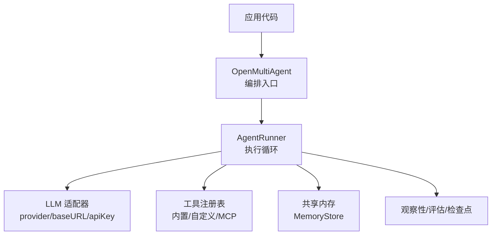
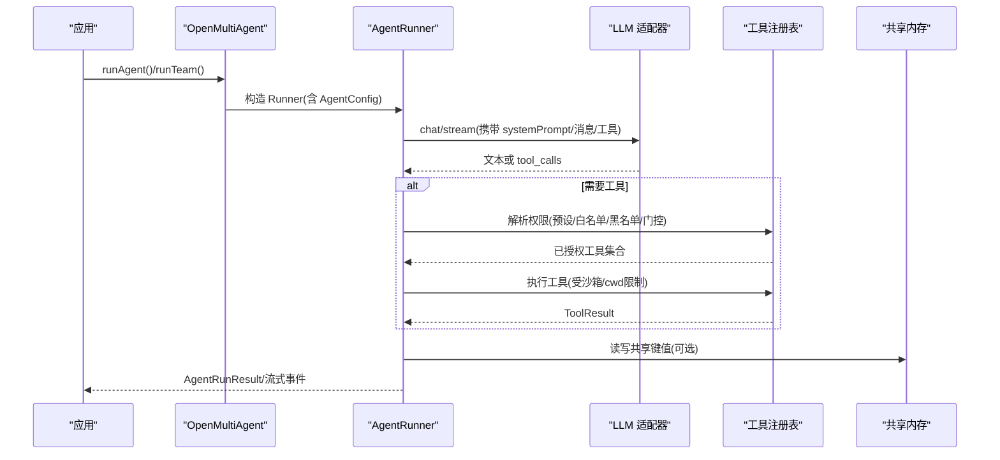
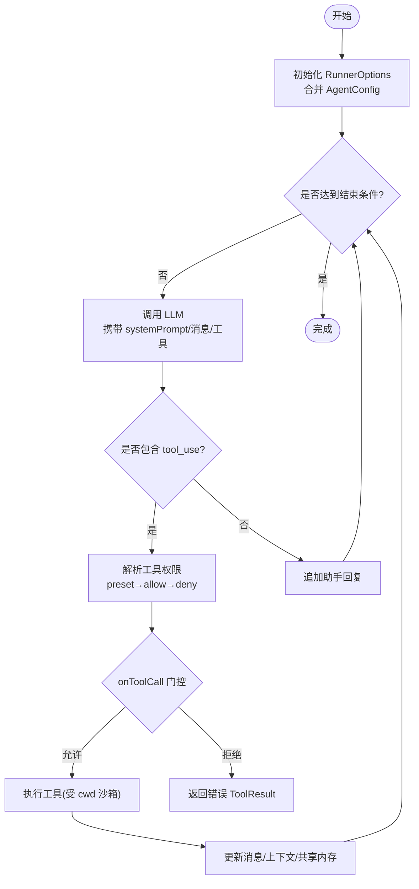
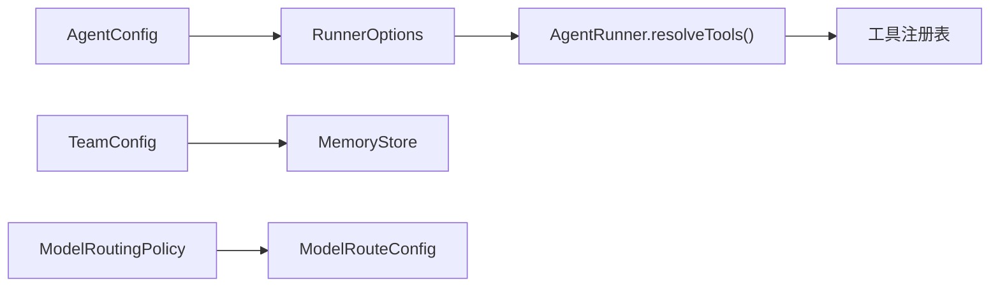

# Agent 配置接口

<cite>
**本文引用的文件**
- [README.md](file://README.md)
- [AGENTS.md](file://AGENTS.md)
- [types.ts](file://packages/core/src/types.ts)
- [runner.ts](file://packages/core/src/agent/runner.ts)
- [tool-configuration.md](file://docs/tool-configuration.md)
- [shared-memory.md](file://docs/shared-memory.md)
- [context-management.md](file://docs/context-management.md)
</cite>

## 目录
1. [简介](#简介)
2. [项目结构](#项目结构)
3. [核心组件](#核心组件)
4. [架构总览](#架构总览)
5. [详细组件分析](#详细组件分析)
6. [依赖关系分析](#依赖关系分析)
7. [性能考量](#性能考量)
8. [故障排查指南](#故障排查指南)
9. [结论](#结论)
10. [附录](#附录)

## 简介
本文件面向使用 Open Multi-Agent（OMA）的开发者，系统化说明 Agent 配置接口与运行期行为。重点覆盖：
- AgentConfig 接口的全部属性与语义，包括 name、model、systemPrompt、tools、memory 等
- 模型选择策略、系统提示词设计模式、工具权限配置
- Agent 执行上下文、状态管理与生命周期钩子
- 单智能体与团队协作场景的配置示例路径
- 配置验证规则与常见错误解决方案

## 项目结构
仓库采用多工作区组织，核心编排能力位于 @open-multi-agent/core。Agent 配置类型、执行器与文档分布如下：
- 类型定义：packages/core/src/types.ts
- 执行器与循环控制：packages/core/src/agent/runner.ts
- 工具与权限、沙箱、MCP 等：docs/tool-configuration.md
- 共享内存：docs/shared-memory.md
- 上下文压缩与推理保留：docs/context-management.md
- 顶层概览与入口：README.md、AGENTS.md

图表来源
- [runner.ts:80-160](file://packages/core/src/agent/runner.ts#L80-L160)
- [types.ts:890-1200](file://packages/core/src/types.ts#L890-L1200)

章节来源
- [README.md:46-97](file://README.md#L46-L97)
- [AGENTS.md:64-70](file://AGENTS.md#L64-L70)

## 核心组件
- AgentConfig：描述单个 Agent 的静态配置，包含模型、提示词、工具、采样参数、超时、循环检测、结构化输出、生命周期钩子等
- TeamConfig：团队配置，聚合多个 Agent 并启用共享内存、并发上限等
- RunnerOptions：AgentRunner 的运行选项，继承自 AgentConfig 并补充执行期细节（如并行工具调用、思考模式、回调等）
- MemoryStore：跨 Agent 共享键值存储，支持持久化与过期策略
- Tool 权限体系：预设、白名单、黑名单、每调用门控 onToolCall、默认禁止策略

章节来源
- [types.ts:890-1200](file://packages/core/src/types.ts#L890-L1200)
- [types.ts:1295-1310](file://packages/core/src/types.ts#L1295-L1310)
- [runner.ts:80-160](file://packages/core/src/agent/runner.ts#L80-L160)
- [types.ts:2838-2872](file://packages/core/src/types.ts#L2838-L2872)

## 架构总览
下图展示从应用到执行器的关键交互：应用通过 OpenMultiAgent 创建团队或运行单个 Agent；编排层将目标分解为任务图并调度；AgentRunner 驱动 LLM 调用、工具执行与循环控制；工具权限与沙箱确保最小授权；共享内存提供跨 Agent 协作；观察性与检查点保障可观测与可恢复。

图表来源
- [runner.ts:80-160](file://packages/core/src/agent/runner.ts#L80-L160)
- [runner.ts:817-827](file://packages/core/src/agent/runner.ts#L817-L827)
- [types.ts:890-1200](file://packages/core/src/types.ts#L890-L1200)
- [types.ts:2838-2872](file://packages/core/src/types.ts#L2838-L2872)

## 详细组件分析

### AgentConfig 属性详解
- 标识与角色
  - name：必填，Agent 名称
  - description：可选，一句话角色描述，用于受限的结构化清单
  - capabilities：可选，显式声明的能力标签，供选择器匹配
  - costTier / latencyClass：可选，相对成本与时延等级，仅用于路由/评分参考
  - permissionBoundary：可选，权限/信任边界标记，用于治理与路由
- 模型与提供者
  - model：可选（在编排中可继承 defaultModel），独立 new Agent 时必须设置
  - provider/baseURL/apiKey/region：可选，覆盖默认提供者与端点
  - adapter：可选，直接注入 LLMAdapter，跳过 createAdapter
  - backend：可选，外部后端（进程/ACP），替换 LLM 但参与 DAG/预算/记忆
- 提示词与上下文
  - history：可选，历史消息恢复
  - systemPrompt：可选，附加到每次对话的系统提示
  - contextStrategy：可选，上下文压缩策略（滑动窗口/摘要/紧凑/自定义）
  - preserveReasoningAsText / compressReasoningText：跨提供商推理块回退与截断
- 工具与权限
  - tools/disallowedTools：白名单/黑名单
  - toolPreset：预设 readonly/readwrite/full
  - customTools：自定义工具定义，绕过预设/白名单但仍受黑名单约束
  - onToolCall：每调用门控，返回 allow/deny/suspend
  - credentials：按 Agent 隔离的密钥包，通过 ToolUseContext.credentials 暴露给工具
  - cwd：文件系统工具沙箱根目录，null 禁用沙箱
- 运行控制
  - maxTurns/maxTokens/maxTokenBudget：轮次、输出 token、累计 token 预算
  - temperature/topP/topK/minP/frequencyPenalty/presencePenalty/parallelToolCalls：采样与并行工具调用
  - extraBody：透传给适配器的额外请求字段
  - thinking：扩展思考/推理配置（各提供商映射不同）
  - timeoutMs/callTimeoutMs：整体与单次调用超时
  - loopDetection：循环检测阈值与动作
  - maxToolOutputChars/compressToolResults：工具输出长度与已消费结果压缩
  - outputSchema：最终结构化输出校验
- 生命周期钩子
  - beforeRun：运行前重写 prompt/messages
  - afterRun：运行后处理结果

章节来源
- [types.ts:890-1200](file://packages/core/src/types.ts#L890-L1200)
- [types.ts:1200-1210](file://packages/core/src/types.ts#L1200-L1210)
- [types.ts:1216-1245](file://packages/core/src/types.ts#L1216-L1245)
- [types.ts:1264-1289](file://packages/core/src/types.ts#L1264-L1289)

### 模型选择策略
- 继承链：OrchestratorConfig.defaultModel → AgentConfig.model → 运行时路由
- 确定性路由：ModelRoutingPolicy 基于 phase/agent/taskRole/priority/leaf/hasDependencies 等条件匹配 ModelRouteConfig
- 失败回退：ModelRouteConfig.fallback 支持重试时顺序切换
- 注意：路由不改变 Agent 的工具授予与权限边界

章节来源
- [types.ts:2208-2223](file://packages/core/src/types.ts#L2208-L2223)
- [types.ts:1312-1358](file://packages/core/src/types.ts#L1312-L1358)

### 系统提示词设计模式
- 固定指令：systemPrompt 作为全局角色与约束
- 动态注入：beforeRun 根据输入重写 messages/prompt，实现上下文感知
- 跨提供商推理：preserveReasoningAsText + compressReasoningText 保证推理内容安全回退与体积控制
- 建议：将“不可变”的策略放入 systemPrompt，将“可变”的任务上下文放入 beforeRun 的动态消息

章节来源
- [types.ts:964-964](file://packages/core/src/types.ts#L964-L964)
- [types.ts:1197-1210](file://packages/core/src/types.ts#L1197-L1210)
- [context-management.md:74-114](file://docs/context-management.md#L74-L114)

### 工具权限配置
- 默认禁止：内置工具必须显式授予（tools/toolPreset），未授予则返回“未授权”错误
- 三层过滤：preset → allowedTools → disallowedTools → 框架安全轨
- 自定义工具：customTools 注册即授予，仍受 disallowedTools 约束
- 每调用门控：onToolCall 在输入校验后、执行前决定 allow/deny/suspend，支持持久化审批
- 沙箱：filesystem 工具受 cwd 限制；bash 不受沙箱限制
- 凭据隔离：credentials 按 Agent 隔离，避免跨 Agent 泄露

章节来源
- [tool-configuration.md:214-250](file://docs/tool-configuration.md#L214-L250)
- [tool-configuration.md:251-290](file://docs/tool-configuration.md#L251-L290)
- [tool-configuration.md:326-363](file://docs/tool-configuration.md#L326-L363)
- [tool-configuration.md:391-441](file://docs/tool-configuration.md#L391-L441)
- [tool-configuration.md:469-506](file://docs/tool-configuration.md#L469-L506)
- [runner.ts:817-827](file://packages/core/src/agent/runner.ts#L817-L827)

### 执行上下文、状态管理与生命周期钩子
- 执行上下文：RunnerOptions 携带 model/systemPrompt/采样参数/工具权限/回调等
- 状态机：AgentState 跟踪 idle/running/completed/error 及消息、token 用量、错误
- 结果：AgentRunResult 包含 success/output/messages/tokenUsage/toolCalls/structured/loopDetected/budgetExceeded/error
- 钩子：
  - beforeRun：运行前改写 prompt/messages
  - afterRun：运行后处理结果
  - onToolCall/onToolResult/onMessage：工具与消息级回调
  - onWarning：配置问题告警
  - onCheckpoint/onApprovalRequest：检查点与审批请求（内部）
- 循环检测：LoopDetectionConfig 支持 warn/terminate/自定义函数，重复触发会强制终止

图表来源
- [runner.ts:80-160](file://packages/core/src/agent/runner.ts#L80-L160)
- [runner.ts:817-827](file://packages/core/src/agent/runner.ts#L817-L827)
- [types.ts:1247-1289](file://packages/core/src/types.ts#L1247-L1289)
- [types.ts:1216-1245](file://packages/core/src/types.ts#L1216-L1245)

章节来源
- [runner.ts:193-241](file://packages/core/src/agent/runner.ts#L193-L241)
- [runner.ts:960-985](file://packages/core/src/agent/runner.ts#L960-L985)
- [runner.ts:1232-1269](file://packages/core/src/agent/runner.ts#L1232-L1269)
- [types.ts:1247-1289](file://packages/core/src/types.ts#L1247-L1289)
- [types.ts:1216-1245](file://packages/core/src/types.ts#L1216-L1245)

### 团队协作与共享内存
- TeamConfig：name、agents、sharedMemory（布尔或 MemoryStore）、maxConcurrency
- 共享内存：键名以 agentName/key 命名空间写入；支持 TTL 与原子 CAS（可选）
- 持久化：FileStore 零依赖原子写；可用 RedactingStore 对敏感值脱敏
- 典型用法：researcher 产出事实，writer 读取并整合

章节来源
- [types.ts:1295-1310](file://packages/core/src/types.ts#L1295-L1310)
- [types.ts:2838-2872](file://packages/core/src/types.ts#L2838-L2872)
- [shared-memory.md:1-47](file://docs/shared-memory.md#L1-L47)

### 配置示例路径
- 单智能体：参考 README 中的 runAgent 示例片段
- 团队协作：参考 README 中的 createTeam/runTeam 示例片段
- 工具权限与沙箱：参考 docs/tool-configuration.md 的预设、白/黑名单、onToolCall、cwd 示例
- 共享内存：参考 docs/shared-memory.md 的 FileStore/RedactingStore 示例
- 上下文压缩与推理保留：参考 docs/context-management.md 的 contextStrategy/preserveReasoningAsText 示例

章节来源
- [README.md:67-97](file://README.md#L67-L97)
- [tool-configuration.md:214-250](file://docs/tool-configuration.md#L214-L250)
- [tool-configuration.md:391-441](file://docs/tool-configuration.md#L391-L441)
- [shared-memory.md:1-47](file://docs/shared-memory.md#L1-L47)
- [context-management.md:1-55](file://docs/context-management.md#L1-L55)

## 依赖关系分析
- AgentConfig 与 RunnerOptions：RunnerOptions 继承并扩展 AgentConfig，统一传入 AgentRunner
- 工具权限：resolveGrantedToolDefinitions 依据 preset/allowedTools/disallowedTools 计算最终工具集
- 共享内存：TeamConfig.sharedMemoryStore 替代默认内存存储，支持持久化与脱敏
- 模型路由：ModelRoutingPolicy 在编排阶段影响实际使用的 model/provider/baseURL/apiKey/region

图表来源
- [runner.ts:817-827](file://packages/core/src/agent/runner.ts#L817-L827)
- [types.ts:1295-1310](file://packages/core/src/types.ts#L1295-L1310)
- [types.ts:1312-1358](file://packages/core/src/types.ts#L1312-L1358)

章节来源
- [runner.ts:817-827](file://packages/core/src/agent/runner.ts#L817-L827)
- [types.ts:1295-1310](file://packages/core/src/types.ts#L1295-L1310)
- [types.ts:1312-1358](file://packages/core/src/types.ts#L1312-L1358)

## 性能考量
- 上下文压缩：使用 contextStrategy（sliding-window/summarize/compact/custom）控制输入增长
- 工具输出控制：maxToolOutputChars 与 compressToolResults 减少长输出对上下文的占用
- 推理文本压缩：compressReasoningText 在跨提供商回退时控制 <thinking> 体积
- 并行工具调用：parallelToolCalls 提升吞吐，但需考虑本地服务器兼容性
- 预算与超时：maxTokenBudget、timeoutMs、callTimeoutMs 防止无限消耗与挂起

章节来源
- [context-management.md:1-55](file://docs/context-management.md#L1-L55)
- [types.ts:1010-1185](file://packages/core/src/types.ts#L1010-L1185)

## 故障排查指南
- 工具未执行
  - 现象：模型发起工具调用但未被执行
  - 原因：未授予内置工具（默认禁止）或不在白名单/预设中
  - 解决：添加 tools 或 toolPreset；确认 disallowedTools 未误删
- 权限被拒绝
  - 现象：onToolCall 返回 deny
  - 原因：业务门控拒绝（如高风险 bash）
  - 解决：调整 onToolCall 逻辑或使用风险分类器
- 沙箱路径错误
  - 现象：文件系统工具报路径越界
  - 原因：cwd 限制过严或未设置绝对路径
  - 解决：调整 AgentConfig.cwd 或 OrchestratorConfig.defaultCwd
- 上下文溢出
  - 现象：token 超限或响应缓慢
  - 原因：历史过长、工具结果过大
  - 解决：启用 contextStrategy、compressToolResults、maxToolOutputChars
- 推理丢失
  - 现象：跨提供商推理块未生效
  - 原因：目标适配器不支持原生回显
  - 解决：开启 preserveReasoningAsText，必要时调整 compressReasoningText
- 循环卡住
  - 现象：反复调用相同工具或输出重复
  - 原因：模型陷入局部策略
  - 解决：配置 loopDetection，必要时注入警告或终止

章节来源
- [tool-configuration.md:214-250](file://docs/tool-configuration.md#L214-L250)
- [tool-configuration.md:326-363](file://docs/tool-configuration.md#L326-L363)
- [tool-configuration.md:391-441](file://docs/tool-configuration.md#L391-L441)
- [context-management.md:1-55](file://docs/context-management.md#L1-L55)
- [types.ts:1216-1245](file://packages/core/src/types.ts#L1216-L1245)

## 结论
Agent 配置围绕“最小授权、可控上下文、可观测可恢复”展开。通过 AgentConfig 的丰富选项，可以精确控制模型、提示词、工具权限与执行行为；结合 TeamConfig 与 MemoryStore，可实现团队协作与知识共享；借助生命周期钩子与检查点，可在复杂流程中保持可控与可审计。生产环境建议：
- 显式授予工具，优先使用预设与白名单
- 使用 onToolCall 实施细粒度审批
- 配置上下文压缩与输出截断，控制成本
- 启用检查点与观察性，便于回放与排障

## 附录
- 快速上手：参考 README 中的 runAgent/runTeam 示例片段
- 工具与沙箱：参考 docs/tool-configuration.md
- 共享内存：参考 docs/shared-memory.md
- 上下文管理：参考 docs/context-management.md