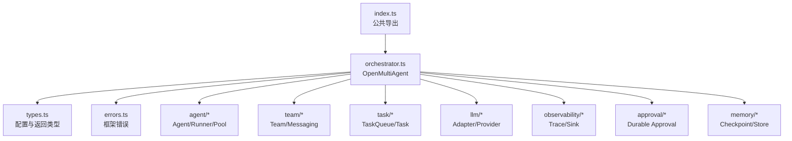
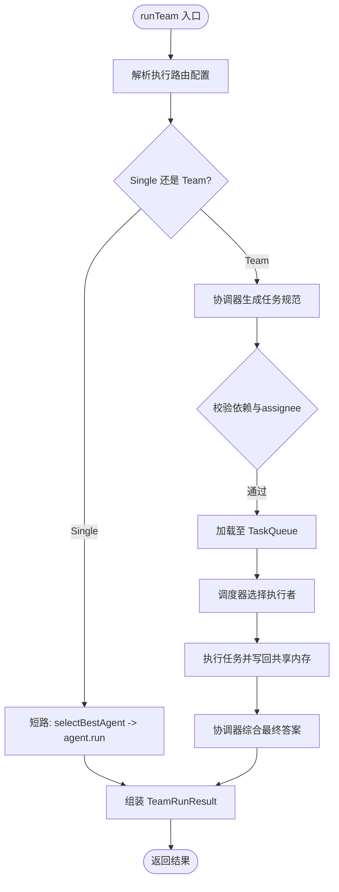
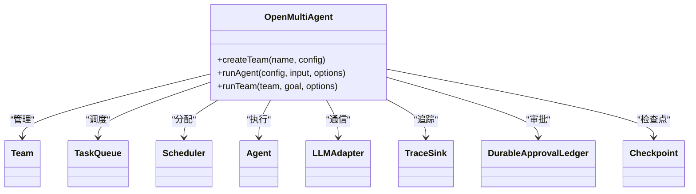

# OpenMultiAgent 类

<cite>
**本文引用的文件**
- [packages/core/src/index.ts](file://packages/core/src/index.ts)
- [packages/core/src/orchestrator/orchestrator.ts](file://packages/core/src/orchestrator/orchestrator.ts)
- [packages/core/src/types.ts](file://packages/core/src/types.ts)
- [packages/core/src/errors.ts](file://packages/core/src/errors.ts)
- [packages/core/README.md](file://packages/core/README.md)
</cite>

## 目录
1. [简介](#简介)
2. [项目结构](#项目结构)
3. [核心组件](#核心组件)
4. [架构总览](#架构总览)
5. [详细组件分析](#详细组件分析)
6. [依赖关系分析](#依赖关系分析)
7. [性能与预算控制](#性能与预算控制)
8. [故障排查指南](#故障排查指南)
9. [结论](#结论)
10. [附录：API 速查与示例路径](#附录api-速查与示例路径)

## 简介
OpenMultiAgent 是 @open-multi-agent/core 的顶层编排入口，负责将“目标”在运行时动态拆解为任务图、调度执行、聚合结果，并提供可观测性、审批、检查点、恢复等生产级能力。它对外暴露的主要接口包括：
- 构造函数配置（默认模型、提供者、并发度、调度策略、路由、预算、工具预设、检查点、恢复、可观测性等）
- createTeam() 创建并注册团队
- runAgent() 运行单个一次性 Agent
- runTeam() 自动编排团队执行（协调器模式）
- runTasks() 执行显式任务流水线（类型定义中声明）
- restore() / runFromPlan() 从检查点或计划恢复/重放（类型定义中声明）

## 项目结构
- 公共 API 出口集中在 barrel 文件，统一导出 OpenMultiAgent 及其相关类型、错误、调度器、路由器、可视化工具等。
- OpenMultiAgent 实现位于 orchestrator 模块，内部组合 Team、TaskQueue、Scheduler、AgentPool、Agent、LLM Adapter、Observability、Approval、Checkpoint 等子系统。
- 所有公开类型集中定义于 types.ts，便于消费者进行类型检查。



图表来源
- [packages/core/src/index.ts:57-130](file://packages/core/src/index.ts#L57-L130)
- [packages/core/src/orchestrator/orchestrator.ts:345-446](file://packages/core/src/orchestrator/orchestrator.ts#L345-L446)

章节来源
- [packages/core/src/index.ts:57-130](file://packages/core/src/index.ts#L57-L130)
- [packages/core/src/orchestrator/orchestrator.ts:345-446](file://packages/core/src/orchestrator/orchestrator.ts#L345-L446)

## 核心组件
- OpenMultiAgent：编排主类，管理团队、任务队列、调度器、代理池、Agent 生命周期、预算、路由、可观测性与恢复。
- Team：成员名单、共享内存、消息总线。
- TaskQueue：依赖感知的任务队列。
- Scheduler：任务到 Agent 的分配策略。
- Agent/Runner：对话与工具调用循环。
- LLM Adapter：模型适配层。
- Observability：追踪、指标、审计。
- Approval：持久化审批门控。
- Checkpoint/Store：检查点与状态持久化。

章节来源
- [packages/core/src/orchestrator/orchestrator.ts:345-446](file://packages/core/src/orchestrator/orchestrator.ts#L345-L446)
- [packages/core/src/types.ts:2131-2343](file://packages/core/src/types.ts#L2131-L2343)

## 架构总览
OpenMultiAgent 通过“协调器 + 调度器 + 执行路由器 + 预算控制 + 可观测性”的组合，实现从自然语言目标到可执行任务图的端到端编排。

```mermaid
sequenceDiagram
participant U as "调用方"
participant O as "OpenMultiAgent"
participant R as "ExecutionRouter"
participant P as "Semantic Profiler"
participant C as "Coordinator(Agent)"
participant Q as "TaskQueue"
participant S as "Scheduler"
participant A as "Agent(Worker)"
participant T as "TraceSink"
U->>O : runTeam(team, goal, options)
O->>R : resolveExecutionRoutingConfig()
R-->>O : decision(single|team)
alt hybrid 且候选 single
O->>P : profile(goal, roster, budget)
P-->>O : recommendation(single|team)
end
opt single 短路
O->>A : agent.run(goal)
A-->>O : result
else team 模式
O->>C : 构建协调器并生成任务
C-->>Q : 加载任务规范
loop 依赖就绪
O->>S : 选择执行 Agent
S-->>O : assignee
O->>A : 执行任务
A-->>O : 结果写入共享内存
end
O->>C : 汇总最终答案
end
O->>T : 关闭追踪并输出结果
O-->>U : TeamRunResult
```

图表来源
- [packages/core/src/orchestrator/orchestrator.ts:940-1600](file://packages/core/src/orchestrator/orchestrator.ts#L940-L1600)
- [packages/core/src/types.ts:1734-1830](file://packages/core/src/types.ts#L1734-L1830)

## 详细组件分析

### 构造函数与 OrchestratorConfig
OpenMultiAgent 构造函数接收 OrchestratorConfig，提供全局默认行为与资源限制。关键选项包括：
- defaultModel/defaultProvider/defaultBaseURL/defaultApiKey：默认模型与提供者、兼容 URL 与密钥。
- maxConcurrency：最大并发度。
- schedulingStrategy/schedulingWeights：调度策略与权重（round-robin、least-busy、capability-match、dependency-first、composite）。
- strictAssignees：是否拒绝协调器指定了不在团队中的 assignee。
- executionRouter：默认执行拓扑路由器（Single vs Team）。
- executionRouting：执行路由配置（strategy: deterministic/hybrid；confidenceThreshold；failurePolicy；profiler/model/adapter/timeoutMs）。
- maxDelegationDepth：委托链深度上限。
- maxTokenBudget/maxCostBudget/estimateCost：令牌与成本预算控制。
- defaultToolPreset：默认工具预设（readonly/readwrite/full）。
- defaultCwd：文件系统工具沙箱根目录。
- checkpoint/recovery：检查点与恢复策略。
- onProgress/onPlanReady/onAgentStream/onToolCall/onTrace：进度回调、计划审批、流式事件、工具调用门控、追踪。
- observability：可观测性 sinks 与捕获策略。
- evaluation：在线评估配置。

章节来源
- [packages/core/src/orchestrator/orchestrator.ts:372-446](file://packages/core/src/orchestrator/orchestrator.ts#L372-L446)
- [packages/core/src/types.ts:2131-2343](file://packages/core/src/types.ts#L2131-L2343)

### createTeam(name, config)
- 作用：创建并注册一个 Team，供后续 runTeam/runTasks 使用。
- 参数：
  - name：唯一团队名，重复会抛错。
  - config：TeamConfig（agents、sharedMemory、并发等）。
- 返回值：Team 实例，可用于进一步配置。

章节来源
- [packages/core/src/orchestrator/orchestrator.ts:764-774](file://packages/core/src/orchestrator/orchestrator.ts#L764-L774)

### runAgent(config, input, options?)
- 作用：以一次性 Agent 形式运行字符串提示或结构化消息历史。
- 参数：
  - config：AgentConfig（model、provider、tools、systemPrompt、上下文策略等）。
  - input：string 或 LLMMessage[]。
  - options：RunAgentOptions（abortSignal、预算、身份等）。
- 行为要点：
  - 应用默认工具预设与默认模型/提供者。
  - 支持预算超限检测与成本估算。
  - 支持可观测性追踪与在线评估。
  - 对具有“后果性工具”的 Agent 支持确认态封装。
- 返回：AgentRunResult（包含 output、tokenUsage、toolCalls、success、budgetExceeded 等）。

章节来源
- [packages/core/src/orchestrator/orchestrator.ts:791-913](file://packages/core/src/orchestrator/orchestrator.ts#L791-L913)
- [packages/core/src/types.ts:906-953](file://packages/core/src/types.ts#L906-L953)

### runTeam(team, goal, options?)
- 作用：自动编排团队执行的核心方法。协调器将目标分解为任务图，调度器按依赖并行执行，最后由协调器综合回答。
- 参数：
  - team：Team 实例。
  - goal：高层自然语言目标。
  - options：RunTeamOptions（coordinator、mode、executionRouter、executionRouting、governanceIntent、requiredRoles、requiredOrder、planOnly、modelRouting、verifyJudges、revealCoordinator 等）。
- 执行流程：
  1) 解析执行路由配置与预算。
  2) 若启用 hybrid 且候选 Single，则运行语义分析器（TaskProfiler）辅助决策。
  3) 若选择 Single：短路直接调用最佳 Agent。
  4) 若选择 Team：构造协调器，生成任务规范，校验依赖与 assignee，加载至 TaskQueue。
  5) 调度执行，逐步写入共享内存，最终合成答案。
  6) 产出 TeamRunResult，包含 routingDecision、semanticRoutingAssessment、governanceConclusion、tasks、agentResults、totalTokenUsage、metrics 等。
- 高级特性：
  - governanceIntent：required/preferred/none 强制角色拓扑。
  - planOnly：仅规划不执行。
  - modelRouting：在拓扑内选择具体模型。
  - verifyJudges：协调器任务可触发共识验证。
  - revealCoordinator：向 worker 注入团队上下文块。



图表来源
- [packages/core/src/orchestrator/orchestrator.ts:940-1600](file://packages/core/src/orchestrator/orchestrator.ts#L940-L1600)
- [packages/core/src/types.ts:1734-1830](file://packages/core/src/types.ts#L1734-L1830)

章节来源
- [packages/core/src/orchestrator/orchestrator.ts:940-1600](file://packages/core/src/orchestrator/orchestrator.ts#L940-L1600)
- [packages/core/src/types.ts:1734-1830](file://packages/core/src/types.ts#L1734-L1830)

### 执行路由器与协调器配置
- ExecutionRouter：自定义执行拓扑策略（决定 Single/Team），优先级低于 mode 与治理声明。
- ExecutionRoutingConfig：
  - strategy：deterministic 或 hybrid。
  - confidenceThreshold：阈值用于 hybrid 决策。
  - failurePolicy：fallback 或 fail。
  - profiler/model/adapter/timeoutMs：语义分析器与超时控制。
- CoordinatorConfig：协调器的模型、系统提示、工具、并发、超时、循环检测等。

章节来源
- [packages/core/src/types.ts:2170-2186](file://packages/core/src/types.ts#L2170-L2186)
- [packages/core/src/types.ts:2603-2665](file://packages/core/src/types.ts#L2603-L2665)

### 调度器配置
- schedulingStrategy：round-robin、least-busy、capability-match、dependency-first、composite。
- schedulingWeights：composite 策略下 fit/load 权重。
- strictAssignees：严格校验协调器指定的 assignee 是否在团队中。

章节来源
- [packages/core/src/types.ts:2131-2169](file://packages/core/src/types.ts#L2131-L2169)

### 可观测性与评估
- observability：sinks、capture、onDiagnostic。
- onProgress/onPlanReady/onAgentStream/onToolCall/onTrace：进程级回调与追踪。
- evaluation：在线评估生命周期。

章节来源
- [packages/core/src/orchestrator/orchestrator.ts:381-446](file://packages/core/src/orchestrator/orchestrator.ts#L381-L446)
- [packages/core/src/types.ts:2253-2257](file://packages/core/src/types.ts#L2253-L2257)

## 依赖关系分析
OpenMultiAgent 强耦合以下子系统：
- Team：成员与共享内存。
- TaskQueue：依赖管理与就绪事件。
- Scheduler：任务分配策略。
- Agent/Runner：对话与工具循环。
- LLM Adapter：模型通信。
- Observability：追踪与指标。
- Approval：持久化审批。
- Checkpoint/Store：检查点与恢复。



图表来源
- [packages/core/src/orchestrator/orchestrator.ts:345-446](file://packages/core/src/orchestrator/orchestrator.ts#L345-L446)

章节来源
- [packages/core/src/orchestrator/orchestrator.ts:345-446](file://packages/core/src/orchestrator/orchestrator.ts#L345-L446)

## 性能与预算控制
- 并发与调度：maxConcurrency 与 schedulingStrategy 影响吞吐与延迟；dependency-first 适合强依赖 DAG。
- 预算控制：
  - maxTokenBudget：每运行令牌上限。
  - maxCostBudget + estimateCost：成本上限，需实现成本估算函数。
  - per-call callTimeoutMs：单次 LLM 调用超时。
- 路由优化：
  - deterministic：无额外模型调用，快速决策。
  - hybrid：对 Single 候选进行语义分析，可能升级为 Team。
- 短路路径：当路由选择 Single，直接调用最佳 Agent，避免协调器开销。

章节来源
- [packages/core/src/orchestrator/orchestrator.ts:1263-1408](file://packages/core/src/orchestrator/orchestrator.ts#L1263-L1408)
- [packages/core/src/types.ts:2192-2221](file://packages/core/src/types.ts#L2192-L2221)

## 故障排查指南
常见错误与处理建议：
- InvalidTaskRequirementsError：任务要求未被满足（无可用 Agent 或 assignee 不满足硬性要求）。检查任务 requires 与 Agent capabilities。
- TokenBudgetExceededError/CostBudgetExceededError：超出令牌或成本预算。调整预算或拆分任务。
- LLMCallTimeoutError：单次 LLM 调用超时。增大 callTimeoutMs 或优化 prompt/tools。
- RoutingTimeoutError/RoutingProfilerFailedError：路由或语义分析器超时/失败。调整 timeoutMs 或回退到 deterministic。
- RoutingDeclarationRequiredError：Hybrid 路由需要显式治理声明。设置 governanceIntent 为 required/preferred。
- InvalidMessageError：传入消息不符合 LLMMessage[] 契约。检查 content 是否为 ContentBlock[]。
- UnsupportedToolCallError/UnsupportedToolResultContentError：模型返回的工具类型不被支持。检查 provider 与工具映射。

可观测性定位：
- 使用 onTrace/onProgress 获取阶段事件与错误信息。
- 使用 offline Run Viewer 回放任务 DAG 与 span 瀑布图。

章节来源
- [packages/core/src/errors.ts:11-180](file://packages/core/src/errors.ts#L11-L180)
- [packages/core/src/orchestrator/orchestrator.ts:1484-1599](file://packages/core/src/orchestrator/orchestrator.ts#L1484-L1599)

## 结论
OpenMultiAgent 提供了从目标到可执行任务图的完整编排能力，结合路由、调度、预算、审批、检查点与可观测性，适用于生产环境的多智能体系统。推荐实践：
- 明确治理意图（governanceIntent）以确保关键角色执行。
- 合理设置预算与超时，防止无限循环与资源耗尽。
- 使用 deterministic 路由以获得稳定性能；必要时开启 hybrid 提升质量。
- 利用 planOnly 预览任务图，再执行或重放。
- 通过 onProgress/onTrace 建立监控告警与问题定位。

## 附录：API 速查与示例路径
- 入口与导出：
  - OpenMultiAgent、Scheduler、DeterministicRouter、错误类等均在 barrel 文件中导出。
- 常用方法：
  - createTeam(name, config)
  - runAgent(config, input, options?)
  - runTeam(team, goal, options?)
  - runTasks()（类型定义中声明）
  - restore()/runFromPlan()（类型定义中声明）
- 配置项：
  - OrchestratorConfig：defaultModel、defaultProvider、maxConcurrency、schedulingStrategy、executionRouter、executionRouting、maxTokenBudget、maxCostBudget、estimateCost、defaultToolPreset、checkpoint、recovery、observability、evaluation 等。
  - RunTeamOptions：coordinator、mode、executionRouter、executionRouting、governanceIntent、requiredRoles、requiredOrder、planOnly、modelRouting、verifyJudges、revealCoordinator 等。
- 示例参考：
  - 单 Agent、团队协作、任务流水线、结构化输入、执行路由、模型路由、可观测性等示例可在 core README 与 examples 中找到。

章节来源
- [packages/core/src/index.ts:57-130](file://packages/core/src/index.ts#L57-L130)
- [packages/core/README.md:76-183](file://packages/core/README.md#L76-L183)
- [packages/core/src/types.ts:1514-1830](file://packages/core/src/types.ts#L1514-L1830)
- [packages/core/src/types.ts:2131-2343](file://packages/core/src/types.ts#L2131-L2343)