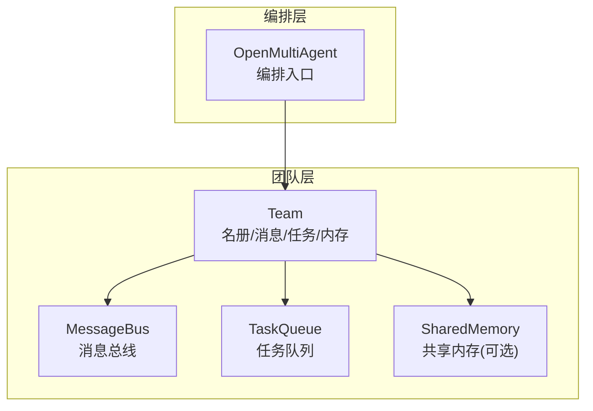
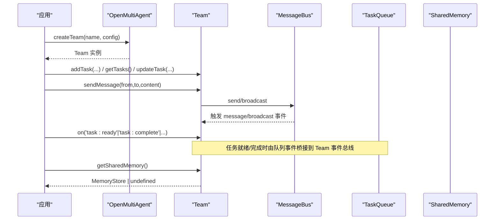
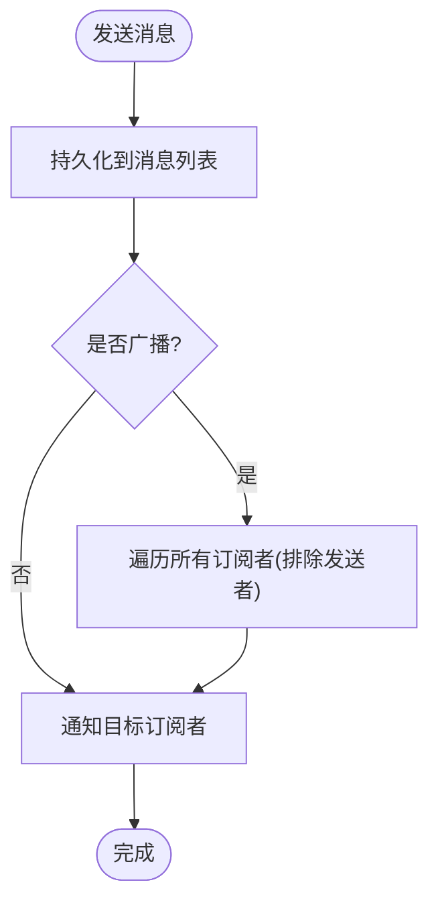
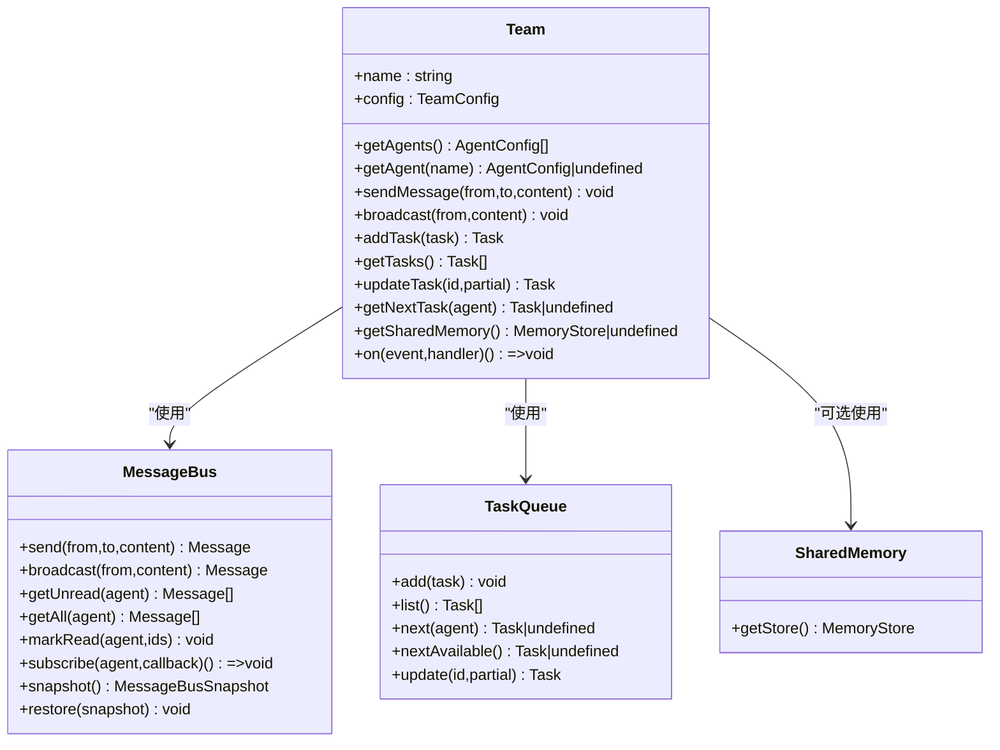

# Team 类

<cite>
**本文引用的文件**
- [packages/core/src/team/team.ts](file://packages/core/src/team/team.ts)
- [packages/core/src/team/messaging.ts](file://packages/core/src/team/messaging.ts)
- [packages/core/src/types.ts](file://packages/core/src/types.ts)
- [packages/core/src/index.ts](file://packages/core/src/index.ts)
- [packages/core/README.md](file://packages/core/README.md)
- [README.md](file://README.md)
</cite>

## 目录
1. [简介](#简介)
2. [项目结构](#项目结构)
3. [核心组件](#核心组件)
4. [架构总览](#架构总览)
5. [详细组件分析](#详细组件分析)
6. [依赖关系分析](#依赖关系分析)
7. [性能考虑](#性能考虑)
8. [故障排查指南](#故障排查指南)
9. [结论](#结论)
10. [附录](#附录)

## 简介
本文件为 Open Multi-Agent 中 Team 类的权威 API 文档，聚焦以下方面：
- Team 配置选项：agents 数组、sharedMemory 开关与自定义存储、并发度等。
- 生命周期管理：创建、运行（通过编排器）、销毁（释放资源）等操作说明。
- 团队协作通信：智能体间点对点消息、广播、读状态管理与快照恢复。
- 治理规则：执行拓扑选择、治理意图、角色顺序与预算降级策略。
- 完整示例路径：如何定义团队配置并执行团队协作任务。
- 最佳实践与性能优化建议：调度策略、并发控制、共享内存与可观测性。

## 项目结构
Team 位于 core 包的 team 层，负责维护智能体名册、消息总线、任务队列与可选的共享内存，并通过内部事件总线对外暴露生命周期事件。编排器（OpenMultiAgent）通过 createTeam/runTeam 将 Team 纳入动态工作流。

图示来源
- [packages/core/src/team/team.ts:89-152](file://packages/core/src/team/team.ts#L89-L152)
- [packages/core/src/team/messaging.ts:69-137](file://packages/core/src/team/messaging.ts#L69-L137)
- [packages/core/src/types.ts:1295-1310](file://packages/core/src/types.ts#L1295-L1310)

章节来源
- [packages/core/src/index.ts:145-151](file://packages/core/src/index.ts#L145-L151)
- [packages/core/src/team/team.ts:1-152](file://packages/core/src/team/team.ts#L1-L152)

## 核心组件
- Team：团队协调对象，持有 Agent 名册、MessageBus、TaskQueue 与 SharedMemory，并提供事件订阅。
- MessageBus：进程内消息总线，支持点对点发送、广播、按接收者追踪已读/未读、快照与恢复。
- TaskQueue：任务队列，提供添加、查询、更新、获取下一个可执行任务的能力。
- SharedMemory：跨智能体的键值共享存储，支持 TTL 与持久化后端。

章节来源
- [packages/core/src/team/team.ts:89-152](file://packages/core/src/team/team.ts#L89-L152)
- [packages/core/src/team/messaging.ts:69-137](file://packages/core/src/team/messaging.ts#L69-L137)
- [packages/core/src/types.ts:2805-2872](file://packages/core/src/types.ts#L2805-L2872)

## 架构总览
Team 作为“团队”容器，将多个 Agent 组织在一起，提供：
- 智能体注册与查找（O(1) 查找）。
- 智能体间通信（MessageBus）。
- 任务编排（TaskQueue + 外部调度器/编排器）。
- 共享上下文（SharedMemory）。
- 事件驱动的可观测性与集成点（task:ready、task:complete、message、broadcast 等）。

图示来源
- [packages/core/src/team/team.ts:121-152](file://packages/core/src/team/team.ts#L121-L152)
- [packages/core/src/team/messaging.ts:143-167](file://packages/core/src/team/messaging.ts#L143-L167)
- [packages/core/src/types.ts:1295-1310](file://packages/core/src/types.ts#L1295-L1310)

## 详细组件分析

### Team 类 API 与配置
- 构造与配置
  - name：团队名称。
  - agents：AgentConfig[]，智能体名册；Team 内部建立 name→config 映射以 O(1) 查找。
  - sharedMemory：布尔开关，启用默认内存存储。
  - sharedMemoryStore：自定义 MemoryStore，优先级高于 sharedMemory 布尔开关。
  - maxConcurrency：用于限制并行度的并发上限（在编排器/池层面配合使用）。
- 智能体管理
  - getAgents()：返回注册顺序的浅拷贝。
  - getAgent(name)：按名称查找。
- 消息通信
  - sendMessage(from,to,content)：点对点消息，持久化并同步通知订阅者。
  - broadcast(from,content)：广播给除发送者外的所有智能体。
  - getMessages(agentName)、getUnreadMessages(agentName)、markMessagesRead(agentName, ids)：读取与标记已读。
  - snapshotMessageBus()/restoreMessageBus(snapshot)：消息总线快照与恢复。
- 任务管理
  - addTask(task)：创建并加入队列，返回带 id/时间戳的任务。
  - getTasks()、getTasksByAssignee(agentName)：列出任务。
  - updateTask(taskId, partial)：更新 status/result/assignee。
  - getNextTask(agentName)：优先取显式指派任务，否则取任意待处理任务。
- 共享内存
  - getSharedMemory()：返回底层 MemoryStore（若启用）。
  - getSharedMemoryInstance()：内部访问 SharedMemory 实例。
- 事件系统
  - on(event, handler)：订阅内置事件（task:ready、task:complete、task:failed、all:complete、message、broadcast），返回取消订阅函数。
  - emit(event, data)：发射自定义事件。

章节来源
- [packages/core/src/team/team.ts:89-369](file://packages/core/src/team/team.ts#L89-L369)
- [packages/core/src/types.ts:1295-1310](file://packages/core/src/types.ts#L1295-L1310)

### 智能体通信机制（MessageBus）
- 消息模型
  - id、from、to（'*' 表示广播）、content、timestamp。
- 读写语义
  - send/from/to/content：持久化并按接收者投递。
  - broadcast：to='*'，发送给除发送者外的所有订阅者。
  - getUnread/getAll/markRead：按接收者维度维护已读集合。
  - getConversation(a,b)：双向对话历史。
- 订阅与通知
  - subscribe(agentName, callback)：按接收者订阅新消息，回调同步触发。
  - 快照与恢复：snapshot()/restore()/fromSnapshot() 支持检查点回放。

图示来源
- [packages/core/src/team/messaging.ts:143-167](file://packages/core/src/team/messaging.ts#L143-L167)
- [packages/core/src/team/messaging.ts:257-283](file://packages/core/src/team/messaging.ts#L257-L283)

章节来源
- [packages/core/src/team/messaging.ts:16-28](file://packages/core/src/team/messaging.ts#L16-L28)
- [packages/core/src/team/messaging.ts:69-137](file://packages/core/src/team/messaging.ts#L69-L137)
- [packages/core/src/team/messaging.ts:143-283](file://packages/core/src/team/messaging.ts#L143-L283)

### 团队协作模式下的治理与执行拓扑
- 执行拓扑选择
  - mode：'single' 或 'team'，覆盖自动路由。
  - executionRouter：每调用可插拔的执行拓扑路由器。
  - executionRouting：混合语义路由配置。
- 治理意图
  - governanceIntent：'required'/'preferred'/'none'，声明结构化角色拓扑。
  - requiredRoles：必须执行的智能体名。
  - requiredOrder：角色执行顺序（链式依赖）。
  - preferredUnderBudget：预算受限时的降级策略（attempt/degrade）。
- 结果字段
  - routingDecision：本次拓扑选择的解释性记录。
  - governanceConclusion/governanceReason：治理结论与原因。
  - planOnly：仅生成计划不执行。

章节来源
- [packages/core/src/types.ts:1730-1813](file://packages/core/src/types.ts#L1730-L1813)
- [packages/core/src/types.ts:1872-1923](file://packages/core/src/types.ts#L1872-L1923)
- [packages/core/README.md:169-185](file://packages/core/README.md#L169-L185)

### 生命周期管理
- 创建
  - 通过编排器 createTeam(name, TeamConfig) 创建 Team 实例。
  - Team 内部初始化：Agent 索引、MessageBus、TaskQueue、SharedMemory（可选）、EventBus。
- 运行
  - 典型流程：编排器根据目标自动生成任务图，调度器将任务分派给 Team 中的 Agent；Team 通过事件总线暴露 task:ready/task:complete 等事件。
  - 可通过 runTeam(goal, options) 指定治理意图、路由、计划预览等。
- 销毁
  - Team 本身无显式 destroy 方法；其持有的内存数据结构随进程回收。
  - 如需持久化/恢复，可使用 MessageBus 与 SharedMemory 的快照/恢复能力，以及 Checkpoint/Restore 机制。

章节来源
- [packages/core/src/team/team.ts:99-152](file://packages/core/src/team/team.ts#L99-L152)
- [packages/core/src/types.ts:2349-2377](file://packages/core/src/types.ts#L2349-L2377)
- [packages/core/README.md:97-111](file://packages/core/README.md#L97-L111)

### 代码示例（路径引用）
- 快速开始与团队协作示例
  - 根级示例：[README.md:74-93](file://README.md#L74-L93)
  - Core 包示例：[packages/core/README.md:76-99](file://packages/core/README.md#L76-L99)
- 治理意图与角色顺序
  - [packages/core/README.md:169-185](file://packages/core/README.md#L169-L185)
- 公开导出入口
  - [packages/core/src/index.ts:145-151](file://packages/core/src/index.ts#L145-L151)

## 依赖关系分析
- Team 依赖
  - MessageBus：实现智能体间通信与审计。
  - TaskQueue：任务排队与依赖解析。
  - SharedMemory：跨智能体共享上下文。
  - 类型定义：TeamConfig、RunTeamOptions、OrchestratorConfig 等。
- 编排器与 Team
  - OpenMultiAgent.createTeam 创建 Team；runTeam 驱动编排、调度与执行。
  - 编排器将队列事件桥接为 Team 事件，供上层监听。

图示来源
- [packages/core/src/team/team.ts:89-369](file://packages/core/src/team/team.ts#L89-L369)
- [packages/core/src/team/messaging.ts:69-137](file://packages/core/src/team/messaging.ts#L69-L137)
- [packages/core/src/types.ts:1295-1310](file://packages/core/src/types.ts#L1295-L1310)

章节来源
- [packages/core/src/team/team.ts:89-369](file://packages/core/src/team/team.ts#L89-L369)
- [packages/core/src/types.ts:1295-1310](file://packages/core/src/types.ts#L1295-L1310)

## 性能考虑
- 并发控制
  - TeamConfig.maxConcurrency：限制团队级别并发度，避免过载。
  - 编排器调度策略：dependency-first、least-busy、capability-match、composite 等，影响任务分配与吞吐。
- 共享内存
  - 使用自定义 MemoryStore（如 Redis/Postgres）提升可扩展性与持久性；注意网络延迟与一致性。
  - 合理设置 TTL（expiresAtTurn）避免数据膨胀。
- 消息总线
  - 订阅者回调同步触发，避免在回调中进行阻塞 I/O。
  - 大量广播场景下关注订阅者数量与处理成本。
- 任务队列
  - 明确 dependsOn 以减少不必要等待；合理使用 assignee 提高匹配效率。
- 可观测性
  - 利用 onAgentStream、trace 与 Run Viewer 观察任务 DAG 与耗时，定位瓶颈。

章节来源
- [packages/core/src/types.ts:2132-2180](file://packages/core/src/types.ts#L2132-L2180)
- [packages/core/src/types.ts:2824-2872](file://packages/core/src/types.ts#L2824-L2872)
- [packages/core/src/team/messaging.ts:257-283](file://packages/core/src/team/messaging.ts#L257-L283)

## 故障排查指南
- 任务无法执行
  - 检查 dependsOn 是否形成环或依赖缺失；确认 assignee 是否存在于团队名册。
  - 查看 task:ready 与 task:failed 事件，定位失败原因。
- 消息未送达
  - 确认 to 字段是否正确；广播时发送者不会收到自身消息。
  - 检查订阅是否在消息发送前注册；必要时使用 getAll/getUnread 调试。
- 共享内存异常
  - 校验 MemoryStore 实现是否满足接口（compareAndSet/setWithExpiry 可选）。
  - 检查 key 冲突与 TTL 过期逻辑。
- 治理意图未满足
  - 检查 governanceIntent、requiredRoles、requiredOrder 是否与团队名册一致。
  - 关注 governanceConclusion 与 governanceReason 字段。

章节来源
- [packages/core/src/team/team.ts:121-152](file://packages/core/src/team/team.ts#L121-L152)
- [packages/core/src/team/messaging.ts:173-218](file://packages/core/src/team/messaging.ts#L173-L218)
- [packages/core/src/types.ts:1730-1813](file://packages/core/src/types.ts#L1730-L1813)

## 结论
Team 类提供了多智能体协作的核心基础设施：稳定的名册管理、可靠的消息总线、灵活的任务队列与可扩展的共享内存。结合编排器的动态规划与调度策略，可在运行时从目标生成任务图并高效执行。通过治理意图与路由策略，可实现可控、可观测、可恢复的多智能体工作流。

## 附录
- 常用配置项速查
  - TeamConfig：name、agents、sharedMemory、sharedMemoryStore、maxConcurrency。
  - RunTeamOptions：mode、executionRouter、executionRouting、governanceIntent、requiredRoles、requiredOrder、preferredUnderBudget、planOnly。
  - OrchestratorConfig：schedulingStrategy、schedulingWeights、strictAssignees、executionRouter。
- 参考路径
  - 团队创建与运行示例：[packages/core/README.md:76-99](file://packages/core/README.md#L76-L99)
  - 治理意图用法：[packages/core/README.md:169-185](file://packages/core/README.md#L169-L185)
  - 类型定义：[packages/core/src/types.ts:1295-1310](file://packages/core/src/types.ts#L1295-L1310), [packages/core/src/types.ts:1730-1813](file://packages/core/src/types.ts#L1730-L1813), [packages/core/src/types.ts:2132-2180](file://packages/core/src/types.ts#L2132-L2180)