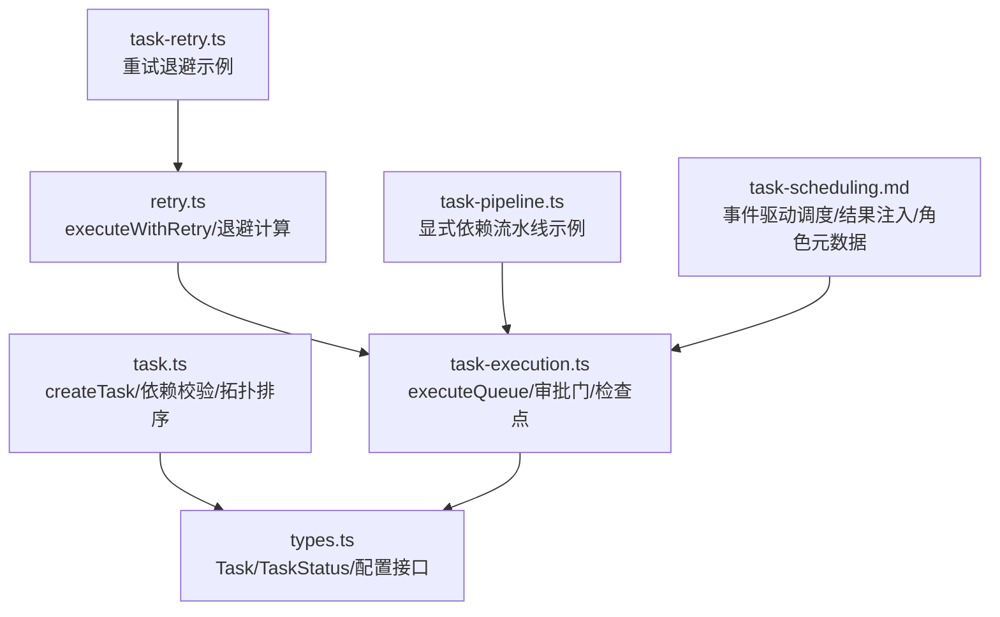
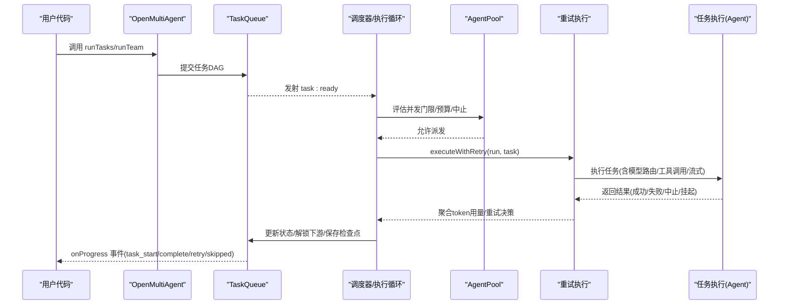
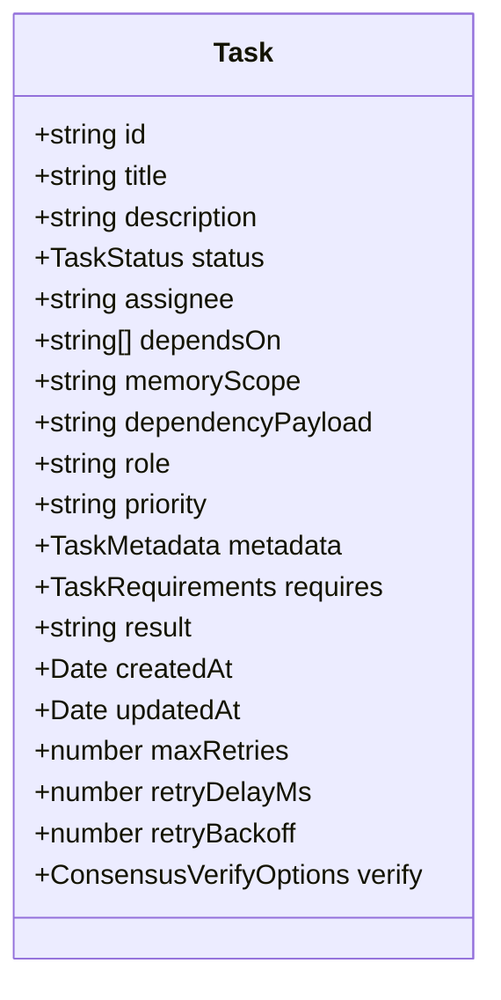
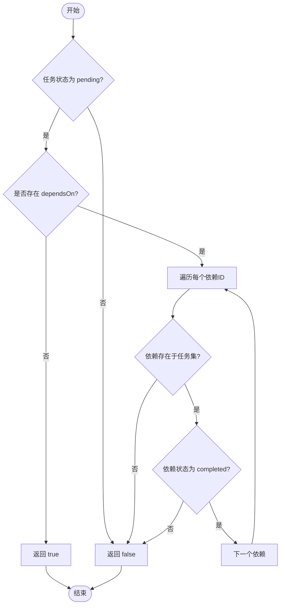
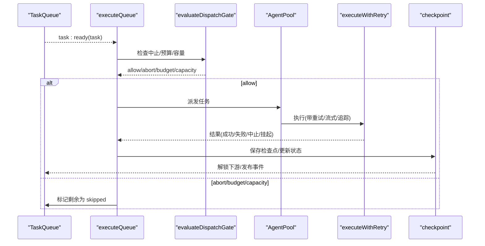
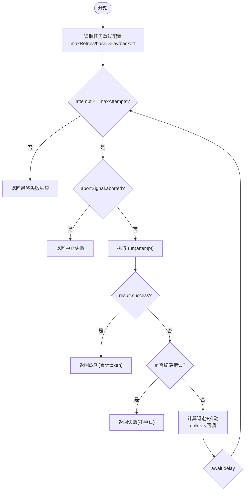
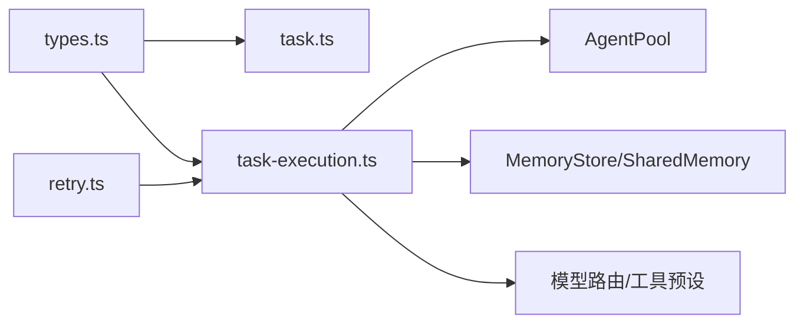

# 任务相关 API

<cite>
**本文引用的文件**
- [packages/core/src/task/task.ts](file://packages/core/src/task/task.ts)
- [packages/core/src/types.ts](file://packages/core/src/types.ts)
- [packages/core/src/orchestrator/task-execution.ts](file://packages/core/src/orchestrator/task-execution.ts)
- [packages/core/src/orchestrator/retry.ts](file://packages/core/src/orchestrator/retry.ts)
- [packages/core/examples/basics/task-pipeline.ts](file://packages/core/examples/basics/task-pipeline.ts)
- [packages/core/examples/patterns/task-retry.ts](file://packages/core/examples/patterns/task-retry.ts)
- [docs/task-scheduling.md](file://docs/task-scheduling.md)
</cite>

## 目录
1. [简介](#简介)
2. [项目结构](#项目结构)
3. [核心组件](#核心组件)
4. [架构总览](#架构总览)
5. [详细组件分析](#详细组件分析)
6. [依赖关系分析](#依赖关系分析)
7. [性能考量](#性能考量)
8. [故障排查指南](#故障排查指南)
9. [结论](#结论)
10. [附录](#附录)

## 简介
本文件面向使用 Open Multi Agent（OMA）的任务编排与执行的用户，聚焦以下目标：
- 详细说明 createTask() 的用法与 Task 接口的全部属性
- 解释任务依赖关系配置、状态管理、队列操作等核心能力
- 说明优先级设置、超时控制、重试机制等高级特性
- 提供复杂任务图构建与执行的完整示例指引
- 给出任务执行监控、调试技巧与常见问题排查方法

## 项目结构
与任务 API 相关的代码主要分布在 core 包中：
- 任务定义与工具函数：packages/core/src/task/task.ts
- 类型定义（Task、TaskStatus、OrchestratorConfig 等）：packages/core/src/types.ts
- 任务调度与执行循环：packages/core/src/orchestrator/task-execution.ts
- 重试与退避策略：packages/core/src/orchestrator/retry.ts
- 示例：任务流水线与重试模式
  - packages/core/examples/basics/task-pipeline.ts
  - packages/core/examples/patterns/task-retry.ts
- 调度文档：docs/task-scheduling.md

图表来源
- [packages/core/src/task/task.ts:1-262](file://packages/core/src/task/task.ts#L1-L262)
- [packages/core/src/types.ts:2003-2099](file://packages/core/src/types.ts#L2003-L2099)
- [packages/core/src/orchestrator/task-execution.ts:661-800](file://packages/core/src/orchestrator/task-execution.ts#L661-L800)
- [packages/core/src/orchestrator/retry.ts:1-139](file://packages/core/src/orchestrator/retry.ts#L1-L139)
- [packages/core/examples/basics/task-pipeline.ts:1-215](file://packages/core/examples/basics/task-pipeline.ts#L1-L215)
- [packages/core/examples/patterns/task-retry.ts:1-133](file://packages/core/examples/patterns/task-retry.ts#L1-L133)
- [docs/task-scheduling.md:1-203](file://docs/task-scheduling.md#L1-L203)

章节来源
- [packages/core/src/task/task.ts:1-262](file://packages/core/src/task/task.ts#L1-L262)
- [packages/core/src/types.ts:2003-2099](file://packages/core/src/types.ts#L2003-L2099)
- [packages/core/src/orchestrator/task-execution.ts:661-800](file://packages/core/src/orchestrator/task-execution.ts#L661-L800)
- [packages/core/src/orchestrator/retry.ts:1-139](file://packages/core/src/orchestrator/retry.ts#L1-L139)
- [packages/core/examples/basics/task-pipeline.ts:1-215](file://packages/core/examples/basics/task-pipeline.ts#L1-L215)
- [packages/core/examples/patterns/task-retry.ts:1-133](file://packages/core/examples/patterns/task-retry.ts#L1-L133)
- [docs/task-scheduling.md:1-203](file://docs/task-scheduling.md#L1-L203)

## 核心组件
- createTask：创建任务对象，生成唯一 ID、初始状态 pending、时间戳，并支持依赖、上下文范围、依赖载荷、重试、角色、优先级、元数据、硬性要求、验证等配置。
- Task 接口：描述任务的静态结构与运行时字段，包括 id/title/description/status/dependsOn/memoryScope/dependencyPayload/role/priority/metadata/requires/result/createdAt/updatedAt/maxRetries/retryDelayMs/retryBackoff/verify 等。
- 任务就绪判定与拓扑排序：isTaskReady/getTaskDependencyOrder 用于判断任务是否可启动以及按依赖顺序排列。
- 任务执行循环：executeQueue 基于事件驱动调度，维护 ready/in-flight 集合，通过 AgentPool 并发限制进行派发，处理预算、中止、检查点、恢复与计划修订。
- 重试机制：executeWithRetry 实现指数退避与抖动，支持最大重试次数、基础延迟、退避倍数，并在可重试错误时自动重试。

章节来源
- [packages/core/src/task/task.ts:23-75](file://packages/core/src/task/task.ts#L23-L75)
- [packages/core/src/types.ts:2003-2099](file://packages/core/src/types.ts#L2003-L2099)
- [packages/core/src/task/task.ts:98-182](file://packages/core/src/task/task.ts#L98-L182)
- [packages/core/src/orchestrator/task-execution.ts:661-800](file://packages/core/src/orchestrator/task-execution.ts#L661-L800)
- [packages/core/src/orchestrator/retry.ts:15-139](file://packages/core/src/orchestrator/retry.ts#L15-L139)

## 架构总览
下图展示了从任务创建到执行的关键流程：用户调用 runTasks 或 runTeam，内部通过 TaskQueue 管理任务 DAG；事件驱动调度器在依赖满足时触发 task:ready；调度器结合 AgentPool 并发限制进行派发；执行完成后更新状态、传播依赖解锁、保存检查点，必要时触发恢复与计划修订。

图表来源
- [packages/core/src/orchestrator/task-execution.ts:661-800](file://packages/core/src/orchestrator/task-execution.ts#L661-L800)
- [packages/core/src/orchestrator/retry.ts:46-139](file://packages/core/src/orchestrator/retry.ts#L46-L139)
- [docs/task-scheduling.md:1-203](file://docs/task-scheduling.md#L1-L203)

## 详细组件分析

### createTask() 与 Task 接口
- createTask(input) 返回一个 Task 实例，包含：
  - 基本字段：id、title、description、status='pending'、createdAt/updatedAt
  - 依赖与上下文：dependsOn、memoryScope、dependencyPayload
  - 执行配置：assignee、role、priority、requires、verify
  - 重试：maxRetries、retryDelayMs、retryBackoff
  - 业务元数据：metadata（受校验与脱敏规则约束）
- Task 状态 TaskStatus：'pending' | 'in_progress' | 'completed' | 'failed' | 'blocked' | 'skipped'
- 依赖载荷 dependencyPayload：
  - 'output'（默认）：注入上游任务的原始输出
  - 'structured'：仅注入结构化 JSON（来自上游 AgentRunResult.structured），缺失或非序列化将导致下游任务以机器可读的错误失败
  - 'both'：同时注入原始与结构化两部分
- memoryScope：
  - 'dependencies'（默认）：仅注入直接依赖的结果
  - 'all'：注入共享内存摘要

图表来源
- [packages/core/src/types.ts:2052-2099](file://packages/core/src/types.ts#L2052-L2099)
- [packages/core/src/task/task.ts:36-75](file://packages/core/src/task/task.ts#L36-L75)

章节来源
- [packages/core/src/task/task.ts:23-75](file://packages/core/src/task/task.ts#L23-L75)
- [packages/core/src/types.ts:2003-2099](file://packages/core/src/types.ts#L2003-L2099)

### 任务依赖与拓扑排序
- isTaskReady(task, allTasks, taskById)：当任务为 pending 且所有 dependsOn 指向的任务均为 completed 时，返回 true。若依赖不存在则视为不可解析，不认为就绪。
- getTaskDependencyOrder(tasks)：使用 Kahn 算法对任务进行拓扑排序，无环时返回完整顺序；存在环时返回部分有序结果。
- validateTaskDependencies(tasks)：检测未知依赖引用、自依赖与环，返回 errors 列表。

图表来源
- [packages/core/src/task/task.ts:98-114](file://packages/core/src/task/task.ts#L98-L114)
- [packages/core/src/task/task.ts:137-182](file://packages/core/src/task/task.ts#L137-L182)
- [packages/core/src/task/task.ts:206-261](file://packages/core/src/task/task.ts#L206-L261)

章节来源
- [packages/core/src/task/task.ts:98-182](file://packages/core/src/task/task.ts#L98-L182)
- [packages/core/src/task/task.ts:206-261](file://packages/core/src/task/task.ts#L206-L261)

### 任务执行与调度
- executeQueue(queue, ctx)：事件驱动执行循环，维护 readyTaskIds 与 inFlight 映射，监听 task:ready 与 all:complete，依据 AgentPool 并发限制与预算/中止信号进行派发。
- 审批门 evaluateDispatchGate(ctx, inFlightCount)：检查中止、预算超限、容量上限，决定 allow/abort/budget/capacity。
- 检查点与恢复：saveRunCheckpoint 持久化安全边界（如任务完成、工具调用提交点），restore 时跳过已完成任务并重放已提交结果。
- 计划修订：applyPlanPatch 可在任务结果后追加修复任务、重定向未开始任务、覆盖待执行分支，并通过 checkpoint 保证一致性。

图表来源
- [packages/core/src/orchestrator/task-execution.ts:661-800](file://packages/core/src/orchestrator/task-execution.ts#L661-L800)
- [packages/core/src/orchestrator/task-execution.ts:395-403](file://packages/core/src/orchestrator/task-execution.ts#L395-L403)
- [packages/core/src/orchestrator/task-execution.ts:186-277](file://packages/core/src/orchestrator/task-execution.ts#L186-L277)

章节来源
- [packages/core/src/orchestrator/task-execution.ts:661-800](file://packages/core/src/orchestrator/task-execution.ts#L661-L800)
- [packages/core/src/orchestrator/task-execution.ts:395-403](file://packages/core/src/orchestrator/task-execution.ts#L395-L403)
- [packages/core/src/orchestrator/task-execution.ts:186-277](file://packages/core/src/orchestrator/task-execution.ts#L186-L277)

### 重试机制与退避
- executeWithRetry(run, task, onRetry, delayFn, opts)：
  - 参数：run 为实际执行函数；task 携带 maxRetries、retryDelayMs、retryBackoff；onRetry 回调报告每次重试的 attempt、maxAttempts、error、nextDelayMs
  - 退避：computeRetryDelay(baseDelay, backoff, attempt) = min(baseDelay * backoff^(attempt-1), MAX_RETRY_DELAY_MS=30s)，并加入抖动避免风暴
  - 错误分类：可重试错误才重试；终端错误（认证/校验/中止/非 4xx 特定码）立即失败
  - 中止信号：在每次尝试前检查 abortSignal，避免继续等待或重试
  - 累计 token 用量：跨重试累加，便于计费与观测
- 典型配置：maxRetries=2、retryDelayMs=500、retryBackoff=2，表示最多重试两次，首次延迟 500ms，第二次 1000ms，均带抖动

图表来源
- [packages/core/src/orchestrator/retry.ts:15-24](file://packages/core/src/orchestrator/retry.ts#L15-L24)
- [packages/core/src/orchestrator/retry.ts:46-139](file://packages/core/src/orchestrator/retry.ts#L46-L139)

章节来源
- [packages/core/src/orchestrator/retry.ts:15-139](file://packages/core/src/orchestrator/retry.ts#L15-L139)

### 任务优先级与调度策略
- 任务优先级 priority：'low' | 'normal' | 'high' | 'critical'，可用于模型路由规则与调度参考
- 调度策略 schedulingStrategy：
  - 'round-robin'：轮询分配
  - 'least-busy'：选择当前活动任务最少的代理
  - 'capability-match'：基于声明能力与任务亲和度评分
  - 'dependency-first'：优先分配能解锁最多下游的任务
  - 'composite'：综合依赖关键性与负载，权重 fit/load 默认 0.7/0.3
- 严格指派 strictAssignees：拒绝协调器计划中不在团队名单中的 assignee，默认开启

章节来源
- [packages/core/src/types.ts:2131-2169](file://packages/core/src/types.ts#L2131-L2169)
- [docs/task-scheduling.md:98-134](file://docs/task-scheduling.md#L98-L134)

### 任务队列操作与结果
- 队列事件：task:ready、task:skipped、all:complete
- 结果索引：
  - TeamRunResult.agentResults：按代理名聚合
  - TeamRunResult.taskResults：按稳定任务 ID 索引，保留未合并的 AgentRunResult
- 依赖载荷注入：
  - output（默认）：原始输出
  - structured：仅结构化 JSON，缺失或非序列化会失败
  - both：同时注入原始与结构化

章节来源
- [docs/task-scheduling.md:27-64](file://docs/task-scheduling.md#L27-L64)

### 复杂任务图与编排示例
- 显式依赖流水线：设计 → 实现 → 测试 + 评审（并行），演示 dependsOn 与 memoryScope 的使用
- 重试模式：数据获取任务配置重试与指数退避，分析任务依赖其结果

章节来源
- [packages/core/examples/basics/task-pipeline.ts:1-215](file://packages/core/examples/basics/task-pipeline.ts#L1-L215)
- [packages/core/examples/patterns/task-retry.ts:1-133](file://packages/core/examples/patterns/task-retry.ts#L1-L133)

## 依赖关系分析
- 模块耦合：
  - task.ts 提供纯函数工具，低耦合，适合在 reducer/测试中使用
  - types.ts 集中定义 Task、TaskStatus、OrchestratorConfig 等，被多处引用
  - task-execution.ts 依赖 queue、pool、agent 配置、重试、检查点、恢复、预算等
  - retry.ts 独立封装重试逻辑，供执行循环复用
- 外部依赖：
  - AgentPool 作为并发权威，确保不会超过并发上限
  - MemoryStore/SharedMemory 用于检查点与共享上下文
  - 模型路由与工具预设影响任务执行路径

图表来源
- [packages/core/src/types.ts:2003-2169](file://packages/core/src/types.ts#L2003-L2169)
- [packages/core/src/task/task.ts:1-262](file://packages/core/src/task/task.ts#L1-L262)
- [packages/core/src/orchestrator/task-execution.ts:661-800](file://packages/core/src/orchestrator/task-execution.ts#L661-L800)
- [packages/core/src/orchestrator/retry.ts:1-139](file://packages/core/src/orchestrator/retry.ts#L1-L139)

章节来源
- [packages/core/src/types.ts:2003-2169](file://packages/core/src/types.ts#L2003-L2169)
- [packages/core/src/task/task.ts:1-262](file://packages/core/src/task/task.ts#L1-L262)
- [packages/core/src/orchestrator/task-execution.ts:661-800](file://packages/core/src/orchestrator/task-execution.ts#L661-L800)
- [packages/core/src/orchestrator/retry.ts:1-139](file://packages/core/src/orchestrator/retry.ts#L1-L139)

## 性能考量
- 并发控制：AgentPool 的并发上限是全局权威，避免死锁与资源争用
- 事件驱动：下游任务在依赖满足后立即启动，无需等待同批次无关任务
- 预算与中止：在执行前与完成后检查预算，超限则停止新任务派发，已在执行的任务继续结算
- 检查点：在安全边界写入快照，恢复时跳过已完成任务并重放已提交结果，减少重复执行
- 重试退避：指数退避+抖动降低重试风暴风险，最大延迟上限 30s

章节来源
- [docs/task-scheduling.md:8-25](file://docs/task-scheduling.md#L8-L25)
- [packages/core/src/orchestrator/task-execution.ts:661-800](file://packages/core/src/orchestrator/task-execution.ts#L661-L800)
- [packages/core/src/orchestrator/retry.ts:15-24](file://packages/core/src/orchestrator/retry.ts#L15-L24)

## 故障排查指南
- 常见错误与现象
  - 依赖未解析：dependsOn 引用了不存在或未完成的任务，isTaskReady 返回 false，任务保持 blocked/pending
  - 结构化依赖失败：dependencyPayload='structured' 但上游未产出可序列化结构化值，下游任务以机器可读错误失败
  - 预算超限：executeQueue 检测到预算超限，停止新派发并将剩余任务标记为 skipped
  - 重试耗尽：maxRetries 次后仍失败，返回最终失败结果，onProgress 会收到 task_retry 事件
  - 中止/取消：abortSignal 触发后，执行循环尽快退出，已在执行的任务继续结算
- 调试技巧
  - 订阅 onProgress 事件：task_start、task_complete、task_retry、task_skipped、approval_pending、plan_revision、budget_exceeded、error
  - 使用 taskResults 按任务 ID 查询未合并的 AgentRunResult，定位具体失败原因
  - 启用检查点：在崩溃或中断后恢复，观察哪些任务被跳过或重放
  - 审查依赖载荷：确认 dependencyPayload 与 memoryScope 是否符合预期
- 建议步骤
  - 先运行 validateTaskDependencies 检测环与未知依赖
  - 逐步缩小 DAG，验证最小可执行子图
  - 针对失败任务打印依赖链路与上下文（memoryScope/dependencyPayload）
  - 调整重试参数与预算上限，观察 onProgress 事件变化

章节来源
- [packages/core/src/task/task.ts:206-261](file://packages/core/src/task/task.ts#L206-L261)
- [docs/task-scheduling.md:27-64](file://docs/task-scheduling.md#L27-L64)
- [packages/core/src/orchestrator/task-execution.ts:661-800](file://packages/core/src/orchestrator/task-execution.ts#L661-L800)
- [packages/core/examples/patterns/task-retry.ts:47-67](file://packages/core/examples/patterns/task-retry.ts#L47-L67)

## 结论
本 API 提供了完整的任务创建、依赖管理、状态流转、并发调度、重试与检查点能力。通过 createTask() 与 Task 接口，用户可以灵活定义任务图；借助事件驱动的调度与 AgentPool 并发控制，系统在高吞吐场景下保持稳定；重试与退避增强了鲁棒性；检查点与恢复提升了可靠性。配合 onProgress 与 taskResults，可实现全面的监控与调试。

## 附录
- 快速参考
  - 创建任务：createTask({ title, description, dependsOn?, memoryScope?, dependencyPayload?, maxRetries?, retryDelayMs?, retryBackoff?, role?, priority?, metadata?, requires?, verify? })
  - 任务状态：pending → in_progress → completed/failed/blocked/skipped
  - 依赖载荷：output（默认）、structured、both
  - 重试：maxRetries、retryDelayMs、retryBackoff，支持指数退避与抖动
  - 调度策略：round-robin、least-busy、capability-match、dependency-first、composite
  - 审批门：onTaskDispatch（事件驱动）或 onApproval（兼容轮次）
  - 检查点：saveRunCheckpoint 在安全边界持久化，恢复时跳过已完成任务

章节来源
- [packages/core/src/task/task.ts:23-75](file://packages/core/src/task/task.ts#L23-L75)
- [packages/core/src/types.ts:2003-2169](file://packages/core/src/types.ts#L2003-L2169)
- [packages/core/src/orchestrator/retry.ts:15-139](file://packages/core/src/orchestrator/retry.ts#L15-L139)
- [docs/task-scheduling.md:98-164](file://docs/task-scheduling.md#L98-L164)