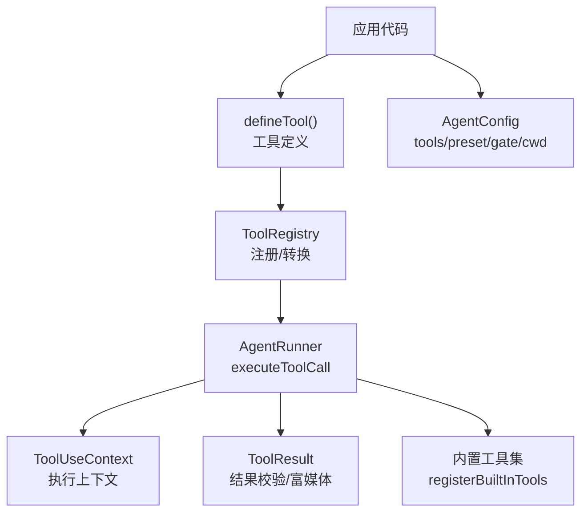
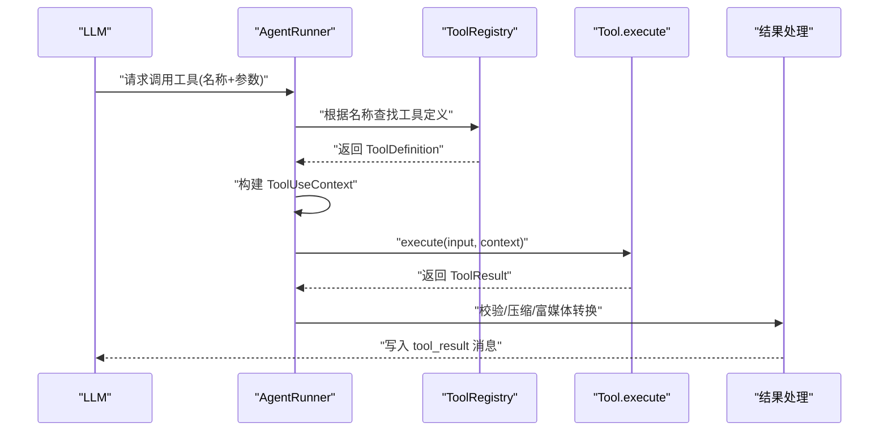
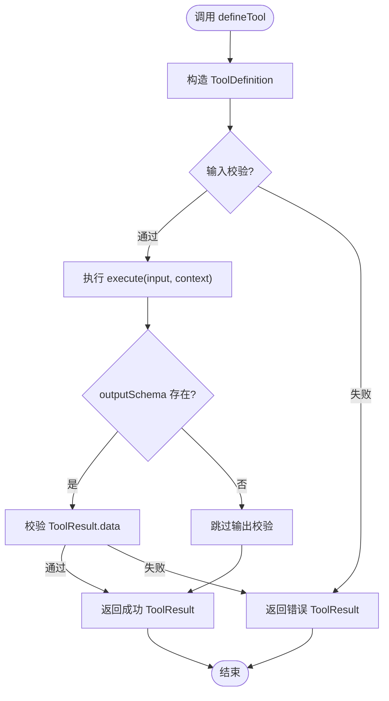
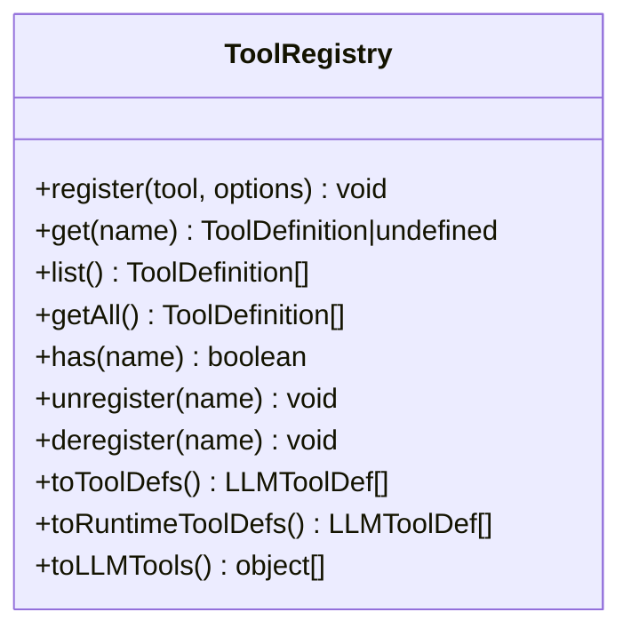
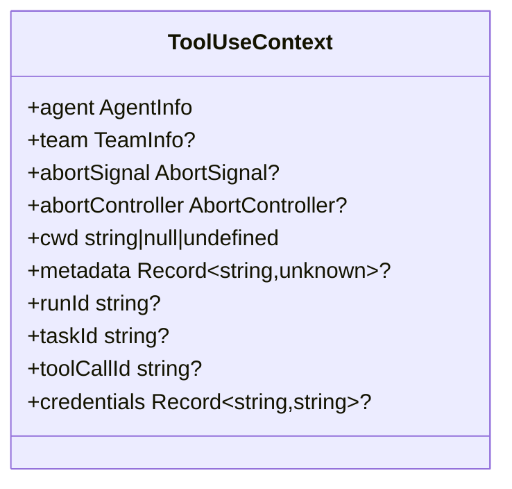
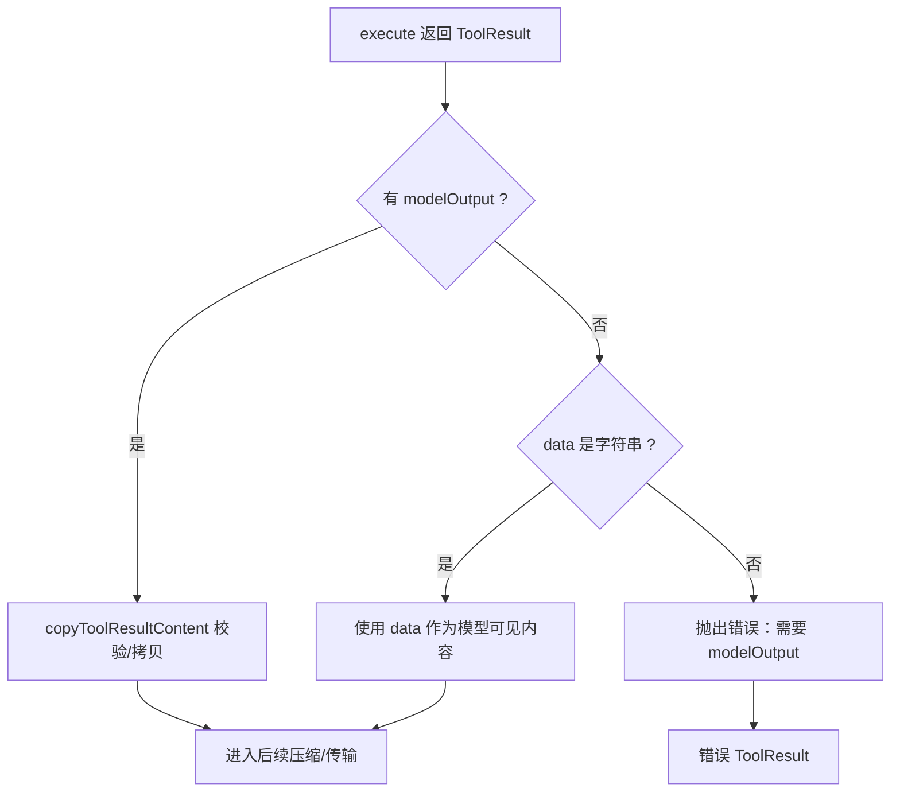
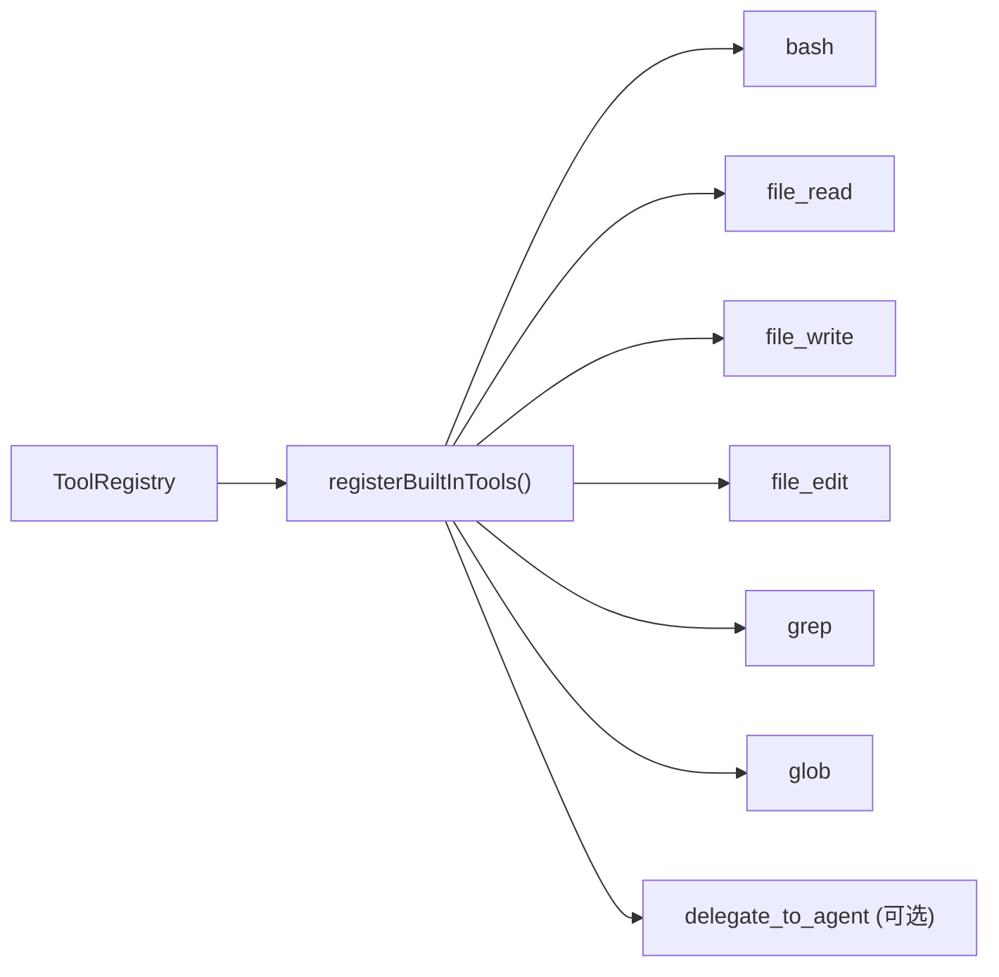
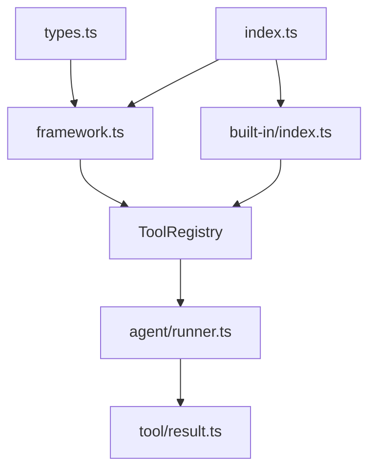

# 工具相关 API

<cite>
**本文引用的文件**
- [packages/core/src/tool/framework.ts](file://packages/core/src/tool/framework.ts)
- [packages/core/src/types.ts](file://packages/core/src/types.ts)
- [packages/core/src/agent/runner.ts](file://packages/core/src/agent/runner.ts)
- [packages/core/src/tool/result.ts](file://packages/core/src/tool/result.ts)
- [packages/core/src/tool/built-in/index.ts](file://packages/core/src/tool/built-in/index.ts)
- [packages/core/src/index.ts](file://packages/core/src/index.ts)
- [docs/tool-configuration.md](file://docs/tool-configuration.md)
</cite>

## 目录
1. [简介](#简介)
2. [项目结构](#项目结构)
3. [核心组件](#核心组件)
4. [架构总览](#架构总览)
5. [详细组件分析](#详细组件分析)
6. [依赖关系分析](#依赖关系分析)
7. [性能考虑](#性能考虑)
8. [故障排查指南](#故障排查指南)
9. [结论](#结论)
10. [附录](#附录)

## 简介
本文件面向“工具相关 API”，聚焦 defineTool() 的使用方式、ToolDefinition 接口属性、工具注册与执行上下文、错误处理与结果返回格式，以及安全配置与性能优化建议。文档同时提供完整的代码示例路径，帮助快速创建自定义工具并集成内置工具。

## 项目结构
围绕工具系统的关键位置如下：
- 工具定义与注册：packages/core/src/tool/framework.ts（defineTool、ToolRegistry、zodToJsonSchema）
- 类型与上下文：packages/core/src/types.ts（ToolDefinition、ToolUseContext、AgentConfig 等）
- 执行流程与上下文注入：packages/core/src/agent/runner.ts（executeToolCall、buildToolContext）
- 结果校验与富媒体输出：packages/core/src/tool/result.ts（copyToolResultContent、modelOutputFromToolResult 等）
- 内置工具集合：packages/core/src/tool/built-in/index.ts（registerBuiltInTools、BUILT_IN_TOOLS）
- 公共导出入口：packages/core/src/index.ts（对外暴露 defineTool、ToolRegistry、内置工具等）
- 工具配置与安全策略文档：docs/tool-configuration.md（默认拒绝、预设、白名单/黑名单、onToolCall 门控、工作目录沙箱等）

图表来源
- [packages/core/src/tool/framework.ts:71-117](file://packages/core/src/tool/framework.ts#L71-L117)
- [packages/core/src/agent/runner.ts:1364-1410](file://packages/core/src/agent/runner.ts#L1364-L1410)
- [packages/core/src/tool/built-in/index.ts:64-74](file://packages/core/src/tool/built-in/index.ts#L64-L74)
- [packages/core/src/tool/result.ts:78-127](file://packages/core/src/tool/result.ts#L78-L127)

章节来源
- [packages/core/src/index.ts:162-180](file://packages/core/src/index.ts#L162-L180)
- [docs/tool-configuration.md:214-238](file://docs/tool-configuration.md#L214-L238)

## 核心组件
- defineTool(config)：统一入口，生成 ToolDefinition，支持输入/输出校验、副作用标记、LLM 输入 Schema 覆盖、输出长度限制与 execute 实现。
- ToolRegistry：维护工具名到定义的映射，提供 toToolDefs/toLLMTools 将工具转换为 LLM 适配器所需的 JSON Schema；支持运行时添加与移除。
- ToolDefinition：描述工具名称、说明、输入 Schema、可选输出 Schema、副作用标记、LLM 输入 Schema 覆盖、最大输出字符数与执行函数。
- ToolUseContext：每次工具执行的上下文，包含调用者 Agent 信息、团队上下文、取消信号、工作目录、凭据、运行/任务 ID、工具调用稳定 ID 等。
- ToolResult：工具返回结果，支持纯文本 data 或富媒体 modelOutput（文本/图片/文件），并提供校验与摘要工具。
- 内置工具：bash、file_read、file_write、file_edit、grep、glob、delegate_to_agent，通过 registerBuiltInTools 注册。

章节来源
- [packages/core/src/tool/framework.ts:71-117](file://packages/core/src/tool/framework.ts#L71-L117)
- [packages/core/src/tool/framework.ts:127-261](file://packages/core/src/tool/framework.ts#L127-L261)
- [packages/core/src/types.ts:511-570](file://packages/core/src/types.ts#L511-L570)
- [packages/core/src/types.ts:704-734](file://packages/core/src/types.ts#L704-L734)
- [packages/core/src/tool/result.ts:78-127](file://packages/core/src/tool/result.ts#L78-L127)
- [packages/core/src/tool/built-in/index.ts:37-74](file://packages/core/src/tool/built-in/index.ts#L37-L74)

## 架构总览
下图展示从模型调用工具到执行与结果回传的完整链路：

图表来源
- [packages/core/src/agent/runner.ts:1364-1410](file://packages/core/src/agent/runner.ts#L1364-L1410)
- [packages/core/src/tool/framework.ts:204-214](file://packages/core/src/tool/framework.ts#L204-L214)
- [packages/core/src/tool/result.ts:122-127](file://packages/core/src/tool/result.ts#L122-L127)

## 详细组件分析

### defineTool() 与 ToolDefinition
- 作用：声明式定义工具，集中管理输入验证、输出验证、副作用标记、LLM 输入 Schema 覆盖、输出长度限制与执行逻辑。
- 关键属性
  - name：工具唯一名称
  - description：对模型的说明
  - inputSchema：Zod 输入校验 Schema（可被 llmInputSchema 覆盖为直接 JSON Schema）
  - consequential：是否允许真实副作用（影响治理与确认策略）
  - outputSchema：对 ToolResult.data 的运行时校验（非 Agent 最终答案校验）
  - llmInputSchema：直接提供给 LLM 的 JSON Schema，跳过 Zod→JSON Schema 转换
  - maxOutputChars：单工具输出截断上限（优先于 Agent 级设置）
  - execute：执行函数，接收已校验的 input 与 ToolUseContext，返回 Promise<ToolResult>

图表来源
- [packages/core/src/tool/framework.ts:71-117](file://packages/core/src/tool/framework.ts#L71-L117)
- [packages/core/src/types.ts:704-734](file://packages/core/src/types.ts#L704-L734)

章节来源
- [packages/core/src/tool/framework.ts:71-117](file://packages/core/src/tool/framework.ts#L71-L117)
- [packages/core/src/types.ts:704-734](file://packages/core/src/types.ts#L704-L734)

### 工具注册机制（ToolRegistry）
- 注册：register(tool, { runtimeAdded? })，重复名称会抛错，防止静默覆盖。
- 列表与查询：list()/getAll()、has(name)、get(name)、unregister/deregister(name)。
- 转换为 LLM 可用定义：toToolDefs()、toLLMTools()，支持 llmInputSchema 直出或基于 Zod 转换。
- 运行时工具：runtimeToolNames 记录动态添加的工具，toRuntimeToolDefs() 仅返回这些。

图表来源
- [packages/core/src/tool/framework.ts:127-261](file://packages/core/src/tool/framework.ts#L127-L261)

章节来源
- [packages/core/src/tool/framework.ts:127-261](file://packages/core/src/tool/framework.ts#L127-L261)

### 工具执行上下文（ToolUseContext）
- agent：调用者 Agent 的基本信息（name、role、model）。
- team：在多智能体团队中可用的团队上下文。
- abortSignal/abortController：用于取消长耗时操作。
- cwd：文件系统工具沙箱根目录（string/null/undefined 三种语义）。
- metadata/runId/taskId/toolCallId：追踪与幂等键（toolCallId 在恢复时稳定复用）。
- credentials：按 Agent 隔离的凭据包，避免共享密钥泄露。

图表来源
- [packages/core/src/types.ts:511-570](file://packages/core/src/types.ts#L511-L570)
- [packages/core/src/agent/runner.ts:1796-1810](file://packages/core/src/agent/runner.ts#L1796-L1810)

章节来源
- [packages/core/src/types.ts:511-570](file://packages/core/src/types.ts#L511-L570)
- [packages/core/src/agent/runner.ts:1796-1810](file://packages/core/src/agent/runner.ts#L1796-L1810)

### 错误处理与结果返回格式
- 输入校验失败：由框架在 execute 前拦截，返回错误 ToolResult。
- 输出校验失败：若定义了 outputSchema，校验失败返回错误 ToolResult。
- 未授权工具：默认拒绝，不会执行，返回错误 ToolResult。
- 富媒体结果：
  - modelOutput 可为字符串或非空数组（text/image/file）。
  - 非字符串 data 必须提供 modelOutput，否则抛错。
  - copyToolResultContent 对内容做严格校验与防御性拷贝。
  - summarizeToolResultContent 生成不含内联字节/URL 的文本摘要。

图表来源
- [packages/core/src/tool/result.ts:78-127](file://packages/core/src/tool/result.ts#L78-L127)

章节来源
- [packages/core/src/tool/result.ts:78-127](file://packages/core/src/tool/result.ts#L78-L127)
- [packages/core/src/agent/runner.ts:1391-1410](file://packages/core/src/agent/runner.ts#L1391-L1410)

### 内置工具与集成
- 内置工具：bash、file_read、file_write、file_edit、grep、glob、delegate_to_agent。
- 注册：registerBuiltInTools(registry, options)，可按需包含 delegate_to_agent。
- 默认拒绝：未显式授予的内置工具不可用；可通过 tools/toolPreset 授予。
- 工作目录沙箱：文件系统工具受 cwd 控制；bash 不受沙箱限制。

图表来源
- [packages/core/src/tool/built-in/index.ts:37-74](file://packages/core/src/tool/built-in/index.ts#L37-L74)

章节来源
- [packages/core/src/tool/built-in/index.ts:37-74](file://packages/core/src/tool/built-in/index.ts#L37-L74)
- [docs/tool-configuration.md:214-238](file://docs/tool-configuration.md#L214-L238)

### 工具安全配置
- 默认拒绝：未配置的 Agent 不获得任何内置工具。
- 预设与白/黑名单：toolPreset → tools → disallowedTools 组合精确控制。
- 后果性工具：consequential=true 的工具在未声明拓扑下可能触发确认策略。
- onToolCall 门控：在输入校验后、执行前进行细粒度审批（allow/deny/suspend）。
- 工作目录沙箱：filesystem 工具路径限制在 cwd；bash 无沙箱。
- 凭据隔离：通过 AgentConfig.credentials 向工具传递最小化密钥。

章节来源
- [docs/tool-configuration.md:140-213](file://docs/tool-configuration.md#L140-L213)
- [docs/tool-configuration.md:214-238](file://docs/tool-configuration.md#L214-L238)
- [docs/tool-configuration.md:251-289](file://docs/tool-configuration.md#L251-L289)
- [docs/tool-configuration.md:326-389](file://docs/tool-configuration.md#L326-L389)
- [docs/tool-configuration.md:391-441](file://docs/tool-configuration.md#L391-L441)
- [docs/tool-configuration.md:469-505](file://docs/tool-configuration.md#L469-L505)

### 性能优化建议
- 输出截断：使用 ToolDefinition.maxOutputChars 或 AgentConfig.maxToolOutputChars 控制过长输出。
- 结果压缩：开启 compressToolResults，对已消费结果进行压缩以减少后续 token 成本。
- 富媒体谨慎：inline base64 会增加请求体大小；优先使用 HTTP(S) 引用以降低开销。
- 批量与去重：合理设计工具粒度，减少不必要的多次调用。
- 超时与取消：利用 abortSignal/abortController 及时终止长耗时任务。

章节来源
- [docs/tool-configuration.md:507-673](file://docs/tool-configuration.md#L507-L673)
- [packages/core/src/types.ts:727-733](file://packages/core/src/types.ts#L727-L733)

## 依赖关系分析
- 定义层：defineTool 产出 ToolDefinition，依赖 types.ts 中的类型。
- 注册层：ToolRegistry 持有工具集合，负责转换为 LLM 所需 JSON Schema。
- 执行层：AgentRunner 解析 granted 工具名，构建 ToolUseContext，调用 execute，处理结果。
- 结果层：result.ts 提供富媒体校验、摘要与尺寸估算。
- 内置工具：built-in/index.ts 聚合并注册常用工具。
- 入口：index.ts 统一对外暴露 defineTool、ToolRegistry、内置工具等。

图表来源
- [packages/core/src/tool/framework.ts:71-117](file://packages/core/src/tool/framework.ts#L71-L117)
- [packages/core/src/agent/runner.ts:1364-1410](file://packages/core/src/agent/runner.ts#L1364-L1410)
- [packages/core/src/tool/result.ts:78-127](file://packages/core/src/tool/result.ts#L78-L127)
- [packages/core/src/tool/built-in/index.ts:64-74](file://packages/core/src/tool/built-in/index.ts#L64-L74)
- [packages/core/src/index.ts:162-180](file://packages/core/src/index.ts#L162-L180)

章节来源
- [packages/core/src/index.ts:162-180](file://packages/core/src/index.ts#L162-L180)

## 性能考虑
- 控制输出规模：优先使用 maxOutputChars 与 compressToolResults，避免大文本阻塞对话。
- 富媒体选择：尽量使用 URL 引用而非 inline base64，降低传输与存储成本。
- 取消与超时：在 execute 中监听 abortSignal，及时释放资源。
- 工具粒度：将复杂操作拆分为小工具，便于缓存与重试。
- 日志与观测：结合 trace 与 onToolCall 观察热点工具，定位瓶颈。

[本节为通用指导，无需特定文件引用]

## 故障排查指南
- 工具未被执行：检查是否已被授予（默认拒绝）、是否在 allowlist 中、是否被 denylist 排除。
- 输入校验失败：核对 inputSchema 与传入参数类型/必填项。
- 输出校验失败：检查 outputSchema 约束与返回数据。
- 富媒体报错：确保 modelOutput 非空且符合 text/image/file 规范；media_type 与 URL/base64 格式正确。
- 权限问题：确认 AgentConfig.credentials 是否正确注入，避免访问不到密钥。
- 沙箱路径错误：确认 cwd 设置与绝对路径是否落在沙箱内。

章节来源
- [packages/core/src/agent/runner.ts:1391-1410](file://packages/core/src/agent/runner.ts#L1391-L1410)
- [packages/core/src/tool/result.ts:78-127](file://packages/core/src/tool/result.ts#L78-L127)
- [docs/tool-configuration.md:214-238](file://docs/tool-configuration.md#L214-L238)
- [docs/tool-configuration.md:391-441](file://docs/tool-configuration.md#L391-L441)

## 结论
defineTool() 提供了统一的工具定义入口，配合 ToolRegistry 完成注册与 LLM 适配，AgentRunner 负责执行与上下文注入，result.ts 保障结果的安全与兼容性。通过默认拒绝、预设/白黑名单、onToolCall 门控与 cwd 沙箱，可实现精细的安全控制；借助输出截断、压缩与富媒体优化，可有效提升性能。建议在生产环境中结合治理策略与观测能力，持续评估工具的风险与成本。

[本节为总结，无需特定文件引用]

## 附录
- 完整示例路径（参考仓库中的示例）：
  - 自定义工具：packages/core/examples/patterns/rich-tool-results.ts
  - 风险分级 bash：packages/core/examples/patterns/risk-gated-bash.ts
  - MCP 集成：packages/core/examples/integrations/mcp-github.ts

[本节为指引，无需特定文件引用]