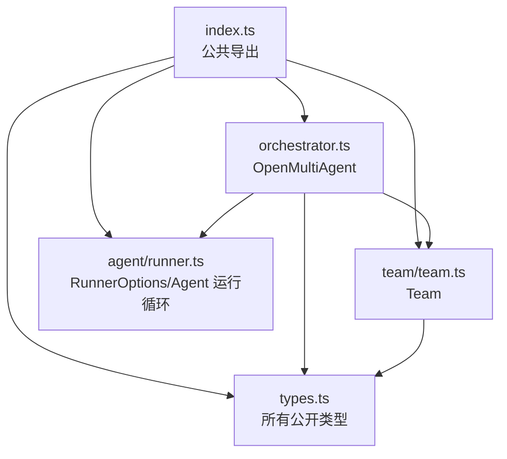
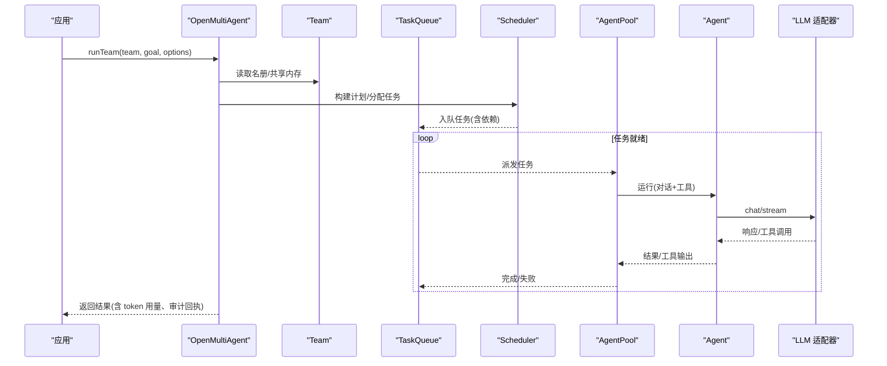
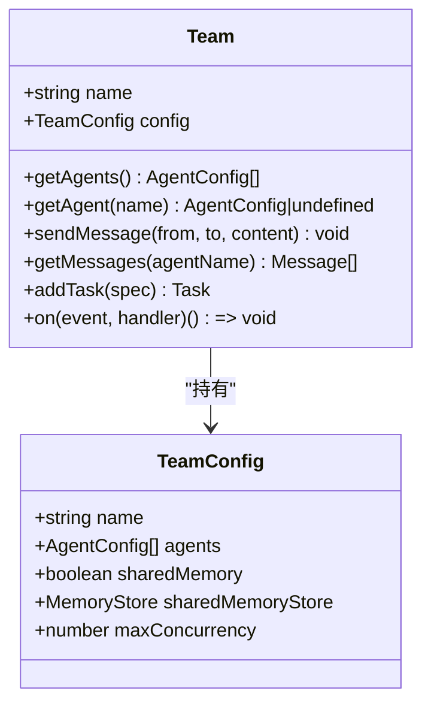
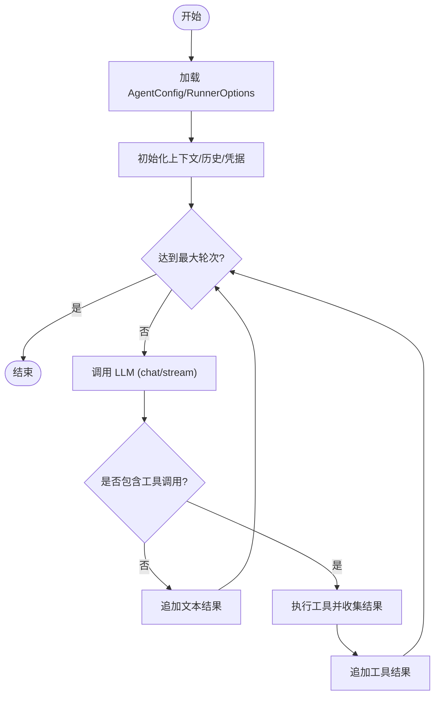
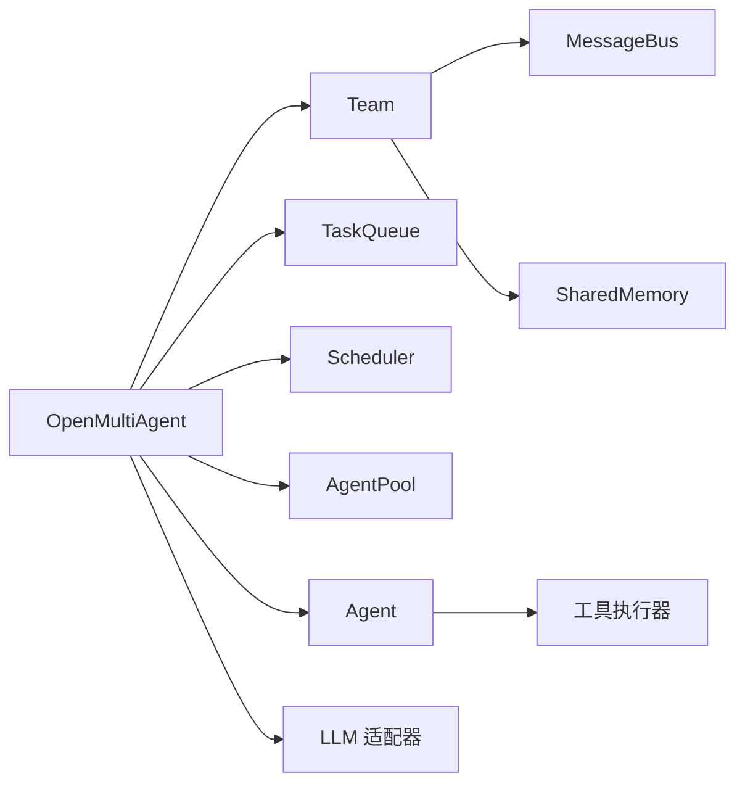

# 核心 API

<cite>
**本文引用的文件**
- [packages/core/src/index.ts](file://packages/core/src/index.ts)
- [packages/core/src/orchestrator/orchestrator.ts](file://packages/core/src/orchestrator/orchestrator.ts)
- [packages/core/src/team/team.ts](file://packages/core/src/team/team.ts)
- [packages/core/src/types.ts](file://packages/core/src/types.ts)
- [packages/core/README.md](file://packages/core/README.md)
- [packages/core/src/agent/runner.ts](file://packages/core/src/agent/runner.ts)
- [packages/core/src/memory/file-store.ts](file://packages/core/src/memory/file-store.ts)
</cite>

## 目录
1. [简介](#简介)
2. [项目结构](#项目结构)
3. [核心组件](#核心组件)
4. [架构总览](#架构总览)
5. [详细组件分析](#详细组件分析)
6. [依赖关系分析](#依赖关系分析)
7. [性能考量](#性能考量)
8. [故障排查指南](#故障排查指南)
9. [结论](#结论)
10. [附录：快速上手与示例路径](#附录快速上手与示例路径)

## 简介
本文件聚焦 Open Multi-Agent 的核心 API，围绕以下目标展开：
- OpenMultiAgent 类的完整接口与用法（构造函数、runAgent、runTeam、createTeam、runTasks、restore 等）
- Team 类的配置选项与生命周期管理
- Agent 配置接口的全部属性（模型选择、系统提示词、工具权限、上下文策略等）
- 完整的代码示例路径，展示如何创建智能体、团队并执行任务
- 错误处理模式与最佳实践建议

Open Multi-Agent 是一个面向 TypeScript 后端的编排框架，支持单智能体、显式任务图以及由协调器在运行时从目标生成动态工作流。它提供可观测性、检查点恢复、预算控制、审批与共识等生产级能力。

## 项目结构
核心包 @open-multi-agent/core 暴露统一的公共入口 index.ts，内部按职责分层组织：
- orchestrator：编排器（OpenMultiAgent）、调度、路由、治理、预算、恢复等
- team：团队（Team）、消息总线、任务队列
- agent：智能体（Agent）、运行循环、池化与并发控制
- tool：工具注册与执行、内置工具
- llm：适配器抽象与多提供商接入
- memory：共享内存、持久化存储、检查点
- observability：追踪、指标、执行回执、身份与状态分类
- task：任务定义、依赖校验、就绪顺序
- dashboard：离线 Run Viewer 渲染

图表来源
- [packages/core/src/index.ts:57-180](file://packages/core/src/index.ts#L57-L180)
- [packages/core/src/orchestrator/orchestrator.ts:1-42](file://packages/core/src/orchestrator/orchestrator.ts#L1-L42)
- [packages/core/src/team/team.ts:1-25](file://packages/core/src/team/team.ts#L1-L25)
- [packages/core/src/agent/runner.ts:76-141](file://packages/core/src/agent/runner.ts#L76-L141)
- [packages/core/src/types.ts:1295-1310](file://packages/core/src/types.ts#L1295-L1310)

章节来源
- [packages/core/src/index.ts:1-180](file://packages/core/src/index.ts#L1-L180)
- [packages/core/src/orchestrator/orchestrator.ts:1-42](file://packages/core/src/orchestrator/orchestrator.ts#L1-L42)
- [packages/core/src/team/team.ts:1-25](file://packages/core/src/team/team.ts#L1-L25)

## 核心组件
- OpenMultiAgent：编排器主入口，负责创建团队、规划与执行任务、预算与恢复、路由与治理、追踪与回执。
- Team：团队对象，维护智能体名册、消息总线、任务队列与可选共享内存，并提供事件桥接。
- Agent：单个智能体的对话与工具调用循环，支持多种采样参数、并行工具调用、思考模式、超时与中止信号。
- 类型体系：集中定义所有公开接口，包括 OrchestratorConfig、RunTeamOptions、RunTasksOptions、AgentConfig、TeamConfig、CheckpointOptions 等。

章节来源
- [packages/core/src/orchestrator/orchestrator.ts:1-42](file://packages/core/src/orchestrator/orchestrator.ts#L1-L42)
- [packages/core/src/team/team.ts:63-152](file://packages/core/src/team/team.ts#L63-L152)
- [packages/core/src/agent/runner.ts:76-141](file://packages/core/src/agent/runner.ts#L76-L141)
- [packages/core/src/types.ts:1295-1310](file://packages/core/src/types.ts#L1295-L1310)
- [packages/core/src/types.ts:2132-2236](file://packages/core/src/types.ts#L2132-L2236)
- [packages/core/src/types.ts:1514-1549](file://packages/core/src/types.ts#L1514-L1549)
- [packages/core/src/types.ts:1734-1787](file://packages/core/src/types.ts#L1734-L1787)

## 架构总览
OpenMultiAgent 将 Team、TaskQueue、Scheduler、AgentPool、Agent 等子系统组合起来，实现“描述目标而非图”的动态编排。默认并行执行独立任务，失败任务标记为 failed，其直接依赖保持 blocked，其他非依赖任务继续推进。

图表来源
- [packages/core/src/orchestrator/orchestrator.ts:1-42](file://packages/core/src/orchestrator/orchestrator.ts#L1-L42)
- [packages/core/src/team/team.ts:121-152](file://packages/core/src/team/team.ts#L121-L152)
- [packages/core/src/types.ts:2132-2179](file://packages/core/src/types.ts#L2132-L2179)

## 详细组件分析

### OpenMultiAgent 类
- 作用：编排器主入口，封装团队创建、任务执行、预算控制、检查点恢复、执行拓扑路由、治理声明、共识验证、追踪与回执。
- 关键方法（结合类型与文档）：
  - createTeam(name, config)：基于 TeamConfig 创建团队实例，支持共享内存与最大并发。
  - runAgent(agentConfigOrName, input, options?)：运行单个智能体，支持字符串或结构化消息输入。
  - runTeam(team, goal, options?)：以目标驱动自动编排，支持 mode、executionRouter、governanceIntent、requiredRoles、requiredOrder、planOnly 等。
  - runTasks(team, tasks, options?)：执行显式任务图，支持 checkpoint、maxTokenBudget、maxCostBudget、modelRouting、recovery 等。
  - restore(identityOrKey, options?)：从检查点恢复运行，支持重新合成协调结果。
- 构造参数（OrchestratorConfig）：
  - defaultProvider/defaultModel/defaultBaseURL/defaultApiKey：全局默认 LLM 提供者与模型。
  - maxConcurrency：全局并发上限。
  - schedulingStrategy/schedulingWeights：未指定 assignee 的任务分配策略与权重。
  - strictAssignees：是否拒绝不在名册中的指派。
  - executionRouter：默认执行拓扑路由器。
  - estimateCost：成本估算函数（配合 maxCostBudget）。
  - checkpoint/recovery：默认检查点与恢复策略。
  - fallbackToolGrant：对未声明工具的默认授予策略（默认拒绝）。
- 运行选项（RunTasksOptions/RunTeamOptions）：
  - abortSignal、maxTokenBudget、maxCostBudget、checkpoint、modelRouting、recovery。
  - RunTeamOptions 额外支持 coordinator、mode、executionRouter、executionRouting、governanceIntent、requiredRoles、requiredOrder、planOnly 等。
- 结果与可观测性：
  - 返回包含 totalTokenUsage、agentResults、routingDecision、governanceConclusion 等字段的结构化结果。
  - 通过 onProgress/onAgentStream 等回调获取实时事件。

章节来源
- [packages/core/src/orchestrator/orchestrator.ts:1-42](file://packages/core/src/orchestrator/orchestrator.ts#L1-L42)
- [packages/core/src/types.ts:2132-2236](file://packages/core/src/types.ts#L2132-L2236)
- [packages/core/src/types.ts:1514-1549](file://packages/core/src/types.ts#L1514-L1549)
- [packages/core/src/types.ts:1734-1787](file://packages/core/src/types.ts#L1734-L1787)
- [packages/core/src/types.ts:2349-2377](file://packages/core/src/types.ts#L2349-L2377)
- [packages/core/src/index.ts:57-180](file://packages/core/src/index.ts#L57-L180)

### Team 类
- 作用：团队对象，持有智能体名册、消息总线、任务队列与可选共享内存；对外暴露事件总线，桥接任务队列事件。
- 构造参数（TeamConfig）：
  - name：团队名称。
  - agents：AgentConfig[] 智能体配置列表。
  - sharedMemory：启用默认内存的共享内存。
  - sharedMemoryStore：自定义 MemoryStore 作为共享内存后端（优先于 sharedMemory）。
  - maxConcurrency：团队级并发上限。
- 生命周期与方法：
  - getAgents()/getAgent(name)：查询智能体名册。
  - sendMessage(from, to, content)/getMessages(agentName)：点对点消息收发与历史查询。
  - addTask()/on(event, handler)：添加任务与订阅事件（task_start/task_complete/error/all:complete）。
  - 内部使用 TaskQueue 与 MessageBus，并在构造时桥接事件到团队事件总线。

图表来源
- [packages/core/src/team/team.ts:63-152](file://packages/core/src/team/team.ts#L63-L152)
- [packages/core/src/types.ts:1295-1310](file://packages/core/src/types.ts#L1295-L1310)

章节来源
- [packages/core/src/team/team.ts:63-200](file://packages/core/src/team/team.ts#L63-L200)
- [packages/core/src/types.ts:1295-1310](file://packages/core/src/types.ts#L1295-L1310)

### Agent 配置接口（AgentConfig）与运行循环（RunnerOptions）
- AgentConfig 关键属性：
  - name：智能体名称。
  - history：历史消息，用于恢复对话上下文。
  - description：角色简述。
  - capabilities：能力标签，用于选择与匹配。
  - costTier/latencyClass：相对成本与时延等级。
  - model/provider/baseURL/apiKey：覆盖默认 LLM 设置。
  - systemPrompt：系统提示词。
  - tools/toolPreset：工具白名单或预设集合（默认拒绝内置工具，除非配置了 fallbackToolGrant）。
  - credentials：每智能体凭据作用域，避免越权访问。
  - contextStrategy：长对话上下文压缩策略（滑动窗口/摘要/紧凑）。
  - thinking：思考模式配置。
  - extraBody：透传给适配器的额外请求体字段。
  - callTimeoutMs：单次 LLM 调用超时。
- RunnerOptions（Agent 运行循环）：
  - model/systemPrompt/maxTurns/maxTokens/temperature/topP/topK/minP。
  - parallelToolCalls/frequencyPenalty/presencePenalty。
  - extraBody/thinking/abortSignal/callTimeoutMs。
  - Tool 访问控制：toolPreset/allowedTools 等。

图表来源
- [packages/core/src/agent/runner.ts:76-141](file://packages/core/src/agent/runner.ts#L76-L141)
- [packages/core/src/types.ts:889-980](file://packages/core/src/types.ts#L889-L980)

章节来源
- [packages/core/src/agent/runner.ts:76-141](file://packages/core/src/agent/runner.ts#L76-L141)
- [packages/core/src/types.ts:889-980](file://packages/core/src/types.ts#L889-L980)

### 执行拓扑与治理（runTeam 相关）
- 执行模式：
  - mode='single'：始终走单智能体路径。
  - mode='team'：强制走协调器生成的团队路径。
- 路由与治理：
  - executionRouter：每调用覆盖默认路由。
  - governanceIntent：required/preferred/none，决定是否需要声明角色与顺序。
  - requiredRoles/requiredOrder：声明必须执行的独立角色及其顺序。
  - planOnly：仅生成计划不执行，便于预览与回放。
- 结果中可观察 routingDecision/governanceConclusion，供合规与审计。

章节来源
- [packages/core/src/types.ts:1734-1787](file://packages/core/src/types.ts#L1734-L1787)
- [packages/core/README.md:149-185](file://packages/core/README.md#L149-L185)

### 检查点与恢复（checkpoint/restore）
- CheckpointOptions：
  - enabled：开关。
  - store：持久化存储（默认使用团队共享内存存储）。
  - key/runId：精确键或逻辑运行 ID。
- RestoreOptions：
  - goal：当检查点无目标时附加的目标。
  - coordinator：恢复时重新合成协调结果的配置（需与原 runTeam 一致）。
- FileStore：基于文件的持久化存储，适合进程内检查点场景。

章节来源
- [packages/core/src/types.ts:2349-2377](file://packages/core/src/types.ts#L2349-L2377)
- [packages/core/src/memory/file-store.ts:23-54](file://packages/core/src/memory/file-store.ts#L23-L54)

## 依赖关系分析
- OpenMultiAgent 依赖 Team、TaskQueue、Scheduler、AgentPool、Agent、LLM 适配器、检查点与恢复、治理与路由、追踪与回执等模块。
- Team 依赖 MessageBus、TaskQueue、SharedMemory。
- Agent 依赖 LLM 适配器与工具执行器。
- 类型集中在 types.ts，被各层引用以保持契约一致性。

图表来源
- [packages/core/src/orchestrator/orchestrator.ts:1-42](file://packages/core/src/orchestrator/orchestrator.ts#L1-L42)
- [packages/core/src/team/team.ts:1-25](file://packages/core/src/team/team.ts#L1-L25)
- [packages/core/src/index.ts:57-180](file://packages/core/src/index.ts#L57-L180)

章节来源
- [packages/core/src/orchestrator/orchestrator.ts:1-42](file://packages/core/src/orchestrator/orchestrator.ts#L1-L42)
- [packages/core/src/team/team.ts:1-25](file://packages/core/src/team/team.ts#L1-L25)
- [packages/core/src/index.ts:57-180](file://packages/core/src/index.ts#L57-L180)

## 性能考量
- 并发控制：
  - OrchestratorConfig.maxConcurrency：全局并发上限。
  - TeamConfig.maxConcurrency：团队级并发上限。
  - AgentRunner.parallelToolCalls：允许单轮并行工具调用（部分提供商支持）。
- 预算控制：
  - RunTasksOptions.maxTokenBudget：每运行令牌上限。
  - RunTasksOptions.maxCostBudget：每运行成本上限（需配合 estimateCost）。
- 调度策略：
  - schedulingStrategy：round-robin、least-busy、capability-match、dependency-first、composite。
  - schedulingWeights：composite 策略下 fit/load 权重。
- 上下文策略：
  - ContextStrategy：sliding-window/summarize/compact，控制长对话上下文大小。
- 检查点与恢复：
  - 在安全边界写入检查点，降低 I/O 频率；FileStore 适合进程内持久化。

章节来源
- [packages/core/src/types.ts:2132-2179](file://packages/core/src/types.ts#L2132-L2179)
- [packages/core/src/types.ts:1514-1549](file://packages/core/src/types.ts#L1514-L1549)
- [packages/core/src/types.ts:192-200](file://packages/core/src/types.ts#L192-L200)
- [packages/core/src/memory/file-store.ts:23-54](file://packages/core/src/memory/file-store.ts#L23-L54)

## 故障排查指南
- 常见错误类型（可从 errors.ts 导入）：
  - TokenBudgetExceededError/CostBudgetExceededError：预算超限。
  - InvalidMessageError/InvalidTaskRequirementsError：消息或任务要求无效。
  - LLMCallTimeoutError：LLM 调用超时。
  - UnsupportedToolCallError/UnsupportedToolResultContentError：工具调用或结果内容不被支持。
  - RoutingDeclarationRequiredError/RoutingProfilerFailedError/RoutingTimeoutError：路由相关错误。
- 诊断与恢复：
  - 使用 onProgress/onAgentStream 捕获实时事件，定位失败阶段。
  - 启用 checkpoint 并使用 restore 恢复中断的运行。
  - 通过 governanceConclusion/routingDecision 判断拓扑与治理是否满足预期。
- 工具权限：
  - 默认拒绝内置工具，需在 AgentConfig.tools/toolPreset 或 OrchestratorConfig.fallbackToolGrant 中显式授予。
  - 使用 ToolCallContext 进行细粒度授权决策。

章节来源
- [packages/core/src/types.ts:1514-1549](file://packages/core/src/types.ts#L1514-L1549)
- [packages/core/src/types.ts:2132-2236](file://packages/core/src/types.ts#L2132-L2236)
- [packages/core/src/types.ts:592-603](file://packages/core/src/types.ts#L592-L603)
- [packages/core/src/types.ts:2349-2377](file://packages/core/src/types.ts#L2349-L2377)

## 结论
Open Multi-Agent 提供了从单智能体到多智能体团队的统一编排 API，强调“描述目标而非图”的动态工作流能力。通过 Team、Agent、TaskQueue、Scheduler 的组合，实现了高并发、可观测、可恢复的生产级特性。借助 OrchestratorConfig、RunTeamOptions、RunTasksOptions、AgentConfig 等配置项，开发者可以精细控制模型、工具、预算、调度与治理，满足不同场景下的可靠性与安全性需求。

## 附录：快速上手与示例路径
- 快速入门与三种执行模式说明见 Core README。
- 单智能体、团队协作、显式任务管道示例可在 Core README 中找到对应示例路径。
- 结构化输入、执行路由、治理声明等进阶用法亦在 Core README 中给出示例片段与链接。

章节来源
- [packages/core/README.md:57-111](file://packages/core/README.md#L57-L111)
- [packages/core/README.md:113-185](file://packages/core/README.md#L113-L185)
- [packages/core/src/index.ts:10-51](file://packages/core/src/index.ts#L10-L51)