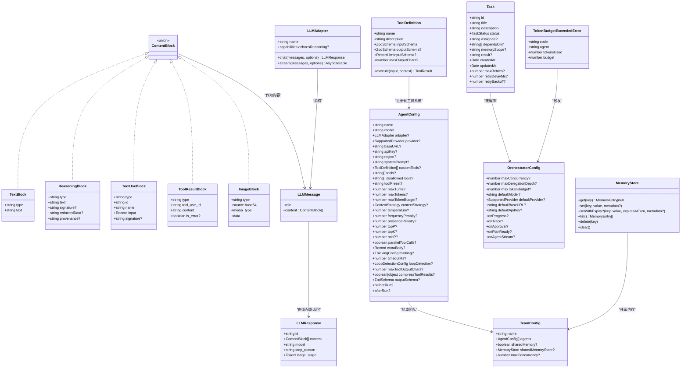
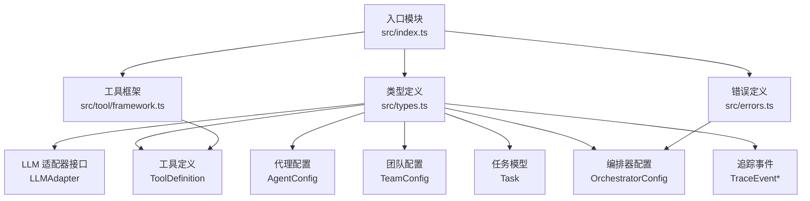

# 类型定义

<cite>
**本文引用的文件**
- [src/types.ts](file://src/types.ts)
- [src/index.ts](file://src/index.ts)
- [src/errors.ts](file://src/errors.ts)
- [src/tool/framework.ts](file://src/tool/framework.ts)
- [examples/basics/single-agent.ts](file://examples/basics/single-agent.ts)
- [examples/basics/multi-model-team.ts](file://examples/basics/multi-model-team.ts)
- [examples/basics/task-pipeline.ts](file://examples/basics/task-pipeline.ts)
</cite>

## 目录
1. [简介](#简介)
2. [项目结构与导出](#项目结构与导出)
3. [核心类型总览](#核心类型总览)
4. [架构概览](#架构概览)
5. [详细类型分析](#详细类型分析)
6. [依赖关系分析](#依赖关系分析)
7. [性能与类型安全考量](#性能与类型安全考量)
8. [故障排查指南](#故障排查指南)
9. [结论](#结论)

## 简介
本文件为 OpenMulti-Agent 框架的 TypeScript 类型参考文档，聚焦于公开接口与类型定义，覆盖内容块、消息与响应、工具系统、代理配置、团队配置、任务与编排器等核心类型。文档同时说明各类型的字段语义、数据约束、使用场景、枚举值以及错误类型与异常处理模式，并提供类型继承关系图与接口实现示例，帮助开发者在类型安全的前提下正确使用框架。

## 项目结构与导出
框架通过单一入口模块集中导出公共类型，便于下游模块按需导入，避免循环依赖：
- 入口模块集中导出所有公开类型，供消费者直接从核心包导入使用。
- 类型定义集中在统一的类型模块中，便于维护与版本演进。

章节来源
- [src/index.ts:129-198](file://src/index.ts#L129-L198)

## 核心类型总览
以下为核心公共类型清单（按功能域分组），后续章节将逐一详解其字段、约束与用法。

- 内容块与消息
  - ContentBlock 联合类型：ReasoningBlock、TextBlock、ToolUseBlock、ToolResultBlock、ImageBlock
  - LLMMessage：角色与内容块数组
  - LLMResponse：标准化响应结构
  - StreamEvent：流式事件类型
  - TokenUsage：输入/输出令牌用量
  - ContextStrategy：上下文压缩策略

- 工具系统
  - LLMToolDef：提供方可用工具定义
  - ToolDefinition<TInput>：可注册工具定义（含输入/输出 Zod 验证）
  - ToolResult：工具执行结果
  - ToolUseContext：工具执行上下文
  - AgentInfo、TeamInfo、DelegationPoolView：调用者与团队信息
  - ToolCallRecord、ToolResultMetadata：运行期统计与元数据

- 代理与团队
  - AgentConfig：代理静态配置
  - AgentState、AgentRunResult：代理生命周期状态与最终结果
  - TeamConfig、RunTeamOptions、TeamRunResult：团队配置与运行结果
  - LoopDetectionConfig、LoopDetectionInfo：环路检测配置与诊断

- 任务与编排
  - Task、TaskStatus、TaskExecutionMetrics、TaskExecutionRecord：任务模型与指标
  - OrchestratorConfig、OrchestratorEvent：编排器配置与进度事件
  - CoordinatorConfig：临时协调者配置

- 可观测性与追踪
  - TraceEventType 枚举：追踪事件类型
  - TraceEventBase 及各类 TraceEvent：追踪跨度数据

- 内存
  - MemoryEntry、MemoryStore：共享内存键值存储抽象

- LLM 适配器
  - LLMChatOptions、LLMStreamOptions、LLMAdapter：跨提供方适配器接口

- 错误类型
  - TokenBudgetExceededError：超出令牌预算错误

章节来源
- [src/types.ts:15-167](file://src/types.ts#L15-L167)
- [src/types.ts:194-328](file://src/types.ts#L194-L328)
- [src/types.ts:368-602](file://src/types.ts#L368-L602)
- [src/types.ts:609-729](file://src/types.ts#L609-L729)
- [src/types.ts:741-875](file://src/types.ts#L741-L875)
- [src/types.ts:882-969](file://src/types.ts#L882-L969)
- [src/types.ts:974-1054](file://src/types.ts#L974-L1054)
- [src/types.ts:1065-1106](file://src/types.ts#L1065-L1106)
- [src/errors.ts:8-19](file://src/errors.ts#L8-L19)

## 架构概览
下图展示核心类型之间的关系与依赖方向，帮助理解类型层次与职责边界。

图表来源
- [src/types.ts:15-167](file://src/types.ts#L15-L167)
- [src/types.ts:194-328](file://src/types.ts#L194-L328)
- [src/types.ts:368-602](file://src/types.ts#L368-L602)
- [src/types.ts:609-729](file://src/types.ts#L609-L729)
- [src/types.ts:741-875](file://src/types.ts#L741-L875)
- [src/types.ts:1065-1106](file://src/types.ts#L1065-L1106)
- [src/errors.ts:8-19](file://src/errors.ts#L8-L19)

## 详细类型分析

### 内容块与消息（ContentBlock、LLMMessage、LLMResponse、StreamEvent、TokenUsage、ContextStrategy）
- ContentBlock 联合类型包含文本、推理、工具调用、工具结果与图像五种变体，用于统一表示多模态对话内容。
- LLMMessage 定义单轮对话的消息结构，角色限定为用户或助手，内容为内容块数组。
- LLMResponse 提供标准化响应，包含唯一标识、内容块、模型名、停止原因与令牌用量。
- StreamEvent 表示流式生成过程中的增量事件，涵盖文本、推理、工具调用、工具结果、预算超限、完成与错误等类型。
- TokenUsage 记录单次调用的输入/输出令牌数。
- ContextStrategy 支持滑动窗口、摘要、紧凑压缩与自定义压缩回调四种策略，用于长会话上下文管理。

章节来源
- [src/types.ts:15-167](file://src/types.ts#L15-L167)

### 工具系统（LLMToolDef、ToolDefinition、ToolResult、ToolUseContext、AgentInfo、TeamInfo、DelegationPoolView、ToolCallRecord、ToolResultMetadata）
- LLMToolDef：提供方可用工具定义，包含名称、描述与输入 JSON Schema。
- ToolDefinition<TInput>：注册工具的完整定义，支持 Zod 输入验证、可选输出验证、LLM 输入 Schema 直通、最大输出字符限制与执行函数。
- ToolResult：工具执行结果，包含序列化数据、是否错误标志与可选元数据。
- ToolUseContext：工具执行上下文，包含调用者代理信息、团队信息（可选）、取消信号、工作目录提示与任意元数据。
- AgentInfo、TeamInfo、DelegationPoolView：分别描述调用者代理、团队上下文与委托池视图。
- ToolCallRecord：一次工具调用的记录，包含工具名、输入、输出与耗时。
- ToolResultMetadata：工具内部产生的令牌用量等侧通道元数据，用于累计预算。

章节来源
- [src/types.ts:194-328](file://src/types.ts#L194-L328)

### 代理与团队（AgentConfig、AgentState、AgentRunResult、TeamConfig、RunTeamOptions、TeamRunResult、LoopDetectionConfig、LoopDetectionInfo）
- AgentConfig：代理静态配置，涵盖模型、提供方、系统提示、工具集合、采样参数、推理配置、超时、环路检测、工具输出截断、结构化输出模式、钩子函数等。
- AgentState：代理运行时状态，包含状态枚举、消息历史、令牌用量与可选错误。
- AgentRunResult：代理运行结束后的最终结果，包含成功标志、输出文本、消息历史、令牌用量、工具调用记录、可选结构化解析结果、环路检测标记与预算超限标记。
- TeamConfig：团队静态配置，包含团队名、代理列表、共享内存开关或自定义存储、并发度。
- RunTeamOptions：团队运行时选项，支持仅计划模式、显示协调者信息等。
- TeamRunResult：团队运行聚合结果，包含成功标志、目标、任务列表、仅计划标记、按代理的结果映射与总令牌用量。
- LoopDetectionConfig、LoopDetectionInfo：环路检测配置与诊断信息，支持重复次数阈值、检测窗口与动作策略。

章节来源
- [src/types.ts:368-602](file://src/types.ts#L368-L602)
- [src/types.ts:609-729](file://src/types.ts#L609-L729)

### 任务与编排（Task、TaskStatus、TaskExecutionMetrics、TaskExecutionRecord、OrchestratorConfig、OrchestratorEvent、CoordinatorConfig）
- TaskStatus：任务状态枚举，包括待定、进行中、已完成、失败、阻塞、跳过。
- Task：离散工作单元，包含标识、标题、描述、状态、负责人、依赖任务、记忆范围、结果、创建/更新时间、重试策略等。
- TaskExecutionMetrics、TaskExecutionRecord：任务执行指标与可序列化快照，用于仪表盘展示。
- OrchestratorConfig：编排器顶层配置，包含并发度、委托深度、令牌预算、默认提供方/模型/密钥、进度与追踪回调、审批门与协调者回调等。
- OrchestratorEvent：编排器运行期间发出的进度事件，涵盖代理开始/完成、任务开始/完成/跳过/重试、预算超限、消息与错误等。
- CoordinatorConfig：临时协调者配置，覆盖模型、提供方、系统提示、工具集、采样参数、超时与环路检测等。

章节来源
- [src/types.ts:679-875](file://src/types.ts#L679-L875)

### 可观测性与追踪（TraceEventType、TraceEventBase、LLMCallTrace、ToolCallTrace、TaskTrace、AgentTrace、PlanReadyTrace、AgentStreamTrace、TraceEvent）
- TraceEventType：追踪事件类型枚举，包括 LLM 调用、工具调用、任务、代理、计划就绪与代理流事件。
- TraceEventBase：所有追踪事件共享的基础字段，包含运行 ID、事件类型、起止时间、持续时间、关联代理与任务。
- 各类 TraceEvent：具体事件类型携带更丰富的上下文，如模型、令牌用量、工具名与输入输出、任务标题与成功状态、计划任务数量与审批决策、流事件类型等。
- TraceEvent：追踪事件联合类型，便于统一处理。

章节来源
- [src/types.ts:882-969](file://src/types.ts#L882-L969)

### 内存（MemoryEntry、MemoryStore）
- MemoryEntry：键值存储项，包含键、值、元数据与创建时间，可选回合过期时间戳。
- MemoryStore：共享内存存储接口，支持读写、可选回合过期写入、列出、删除与清空。

章节来源
- [src/types.ts:974-1011](file://src/types.ts#L974-L1011)

### LLM 适配器（LLMChatOptions、LLMStreamOptions、LLMAdapter）
- LLMChatOptions：聊天调用通用选项，包含模型、工具、采样参数、推理配置、系统提示与取消信号等。
- LLMStreamOptions：流式调用选项，扩展聊天选项。
- LLMAdapter：跨提供方适配器接口，提供聊天与流式接口，可声明推理块回显能力。

章节来源
- [src/types.ts:1018-1106](file://src/types.ts#L1018-L1106)

### 错误类型（TokenBudgetExceededError）
- TokenBudgetExceededError：当代理或编排运行超过配置的令牌预算时抛出，包含代理名、已用令牌与预算。

章节来源
- [src/errors.ts:8-19](file://src/errors.ts#L8-L19)

## 依赖关系分析
- 类型导出路径：入口模块集中 re-export 所有公共类型，下游模块按需导入，避免循环依赖。
- 工具系统与 Zod：工具输入/输出验证基于 Zod，提供 JSON Schema 转换以适配 LLM 工具定义。
- 编排器与任务：任务模型与编排器配置解耦，任务通过依赖关系自动调度，支持并行与串行组合。
- 追踪系统：追踪事件贯穿 LLM 调用、工具调用、任务与代理，便于端到端可观测性。

图表来源
- [src/index.ts:129-198](file://src/index.ts#L129-L198)
- [src/types.ts:1065-1106](file://src/types.ts#L1065-L1106)
- [src/errors.ts:8-19](file://src/errors.ts#L8-L19)
- [src/tool/framework.ts:273-485](file://src/tool/framework.ts#L273-L485)

## 性能与类型安全考量
- 泛型与 Zod 验证
  - ToolDefinition<TInput> 使用泛型约束输入类型，确保工具注册与执行时的类型一致性。
  - 输入/输出均支持 Zod 验证，减少运行期错误与无效数据传播。
- 上下文压缩策略
  - ContextStrategy 的多种策略可有效控制长会话的上下文增长，降低令牌消耗与延迟。
- 并发与预算
  - OrchestratorConfig 与 AgentConfig 均提供令牌预算与超时控制，结合取消信号实现可控的资源上限。
- 流式事件
  - StreamEvent 与 onAgentStream 支持实时增量输出，提升交互体验与可观测性。
- 类型安全最佳实践
  - 使用只读属性与字面量联合类型（如角色、事件类型）防止意外修改与拼写错误。
  - 对可选字段使用明确的默认行为与边界检查，避免未定义分支导致的运行时异常。

## 故障排查指南
- 令牌预算超限
  - 现象：运行过程中抛出 TokenBudgetExceededError 或标记 budgetExceeded。
  - 处理：调整 AgentConfig.maxTokenBudget、OrchestratorConfig.maxTokenBudget 或优化上下文策略。
- 环路检测
  - 现象：连续重复的工具调用或文本输出被检测到。
  - 处理：配置 LoopDetectionConfig 的阈值与动作策略；必要时注入“你似乎卡住了”提示。
- 工具执行失败
  - 现象：ToolResult.isError 为真或输出不符合预期。
  - 处理：使用 ToolDefinition.outputSchema 进行运行期校验；在工具内部捕获异常并返回错误结果。
- 流式事件异常
  - 现象：流中断或事件类型不匹配。
  - 处理：在 onAgentStream 中对事件类型进行严格判断与降级处理。

章节来源
- [src/errors.ts:8-19](file://src/errors.ts#L8-L19)
- [src/types.ts:538-566](file://src/types.ts#L538-L566)
- [src/types.ts:184-187](file://src/types.ts#L184-L187)

## 结论
本文档系统梳理了 OpenMulti-Agent 框架的核心类型定义，覆盖内容块、消息与响应、工具系统、代理与团队、任务与编排、可观测性追踪、内存与 LLM 适配器等关键领域。通过明确字段语义、数据约束与使用场景，并结合错误类型与异常处理模式，开发者可在类型安全的前提下高效构建多代理协作系统。建议在实际项目中：
- 明确使用 Zod 进行输入/输出验证；
- 合理配置 ContextStrategy 与令牌预算；
- 利用追踪事件完善可观测性；
- 在工具与代理配置中遵循只读与最小暴露原则。