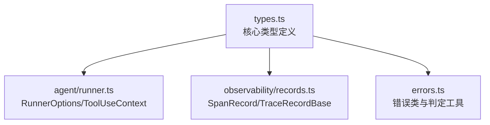
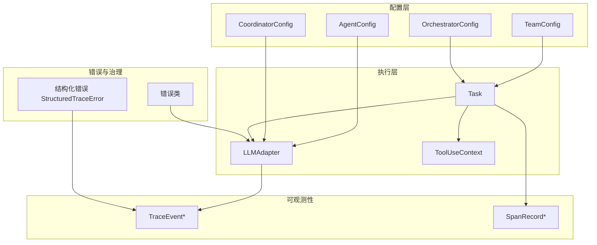
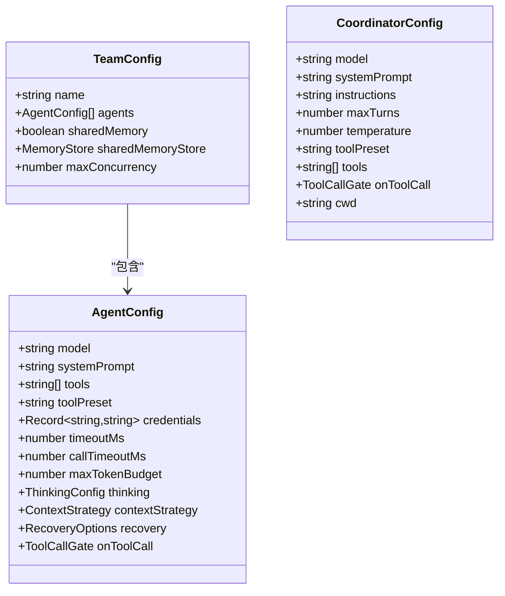
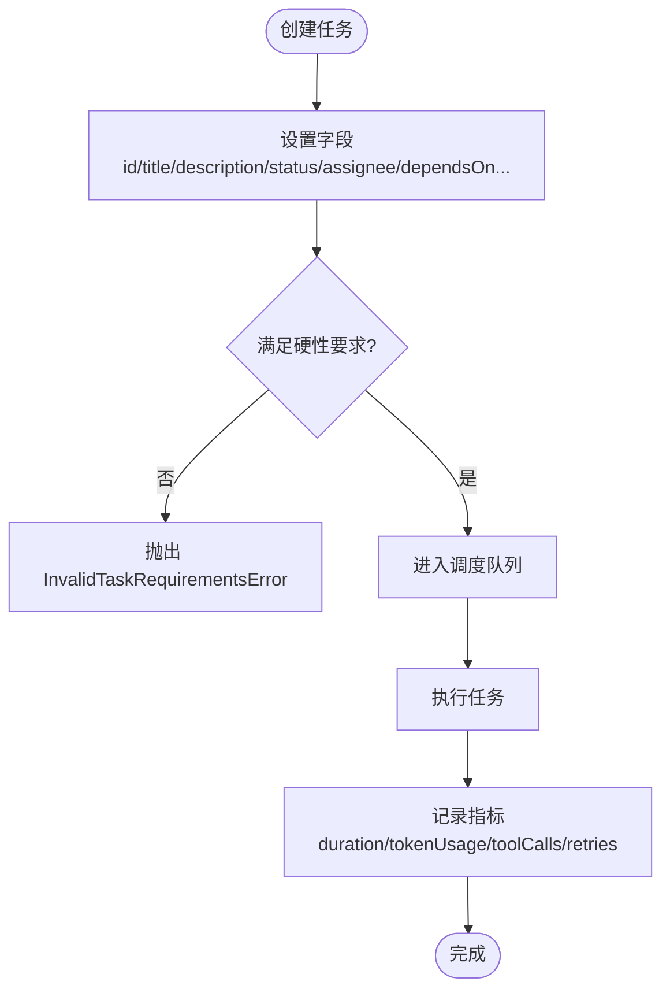
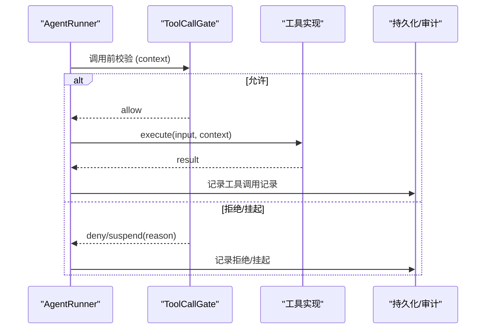
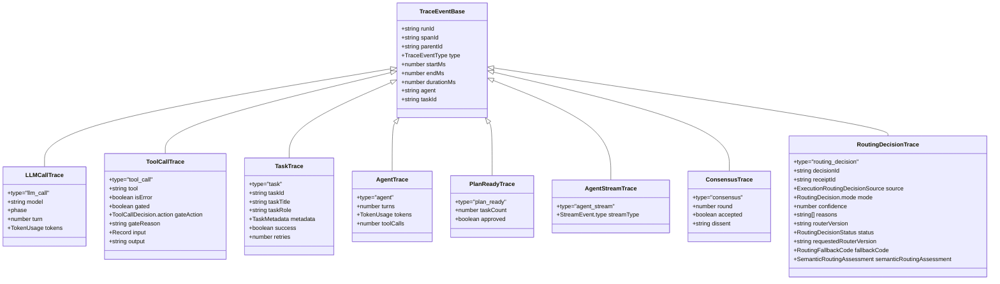
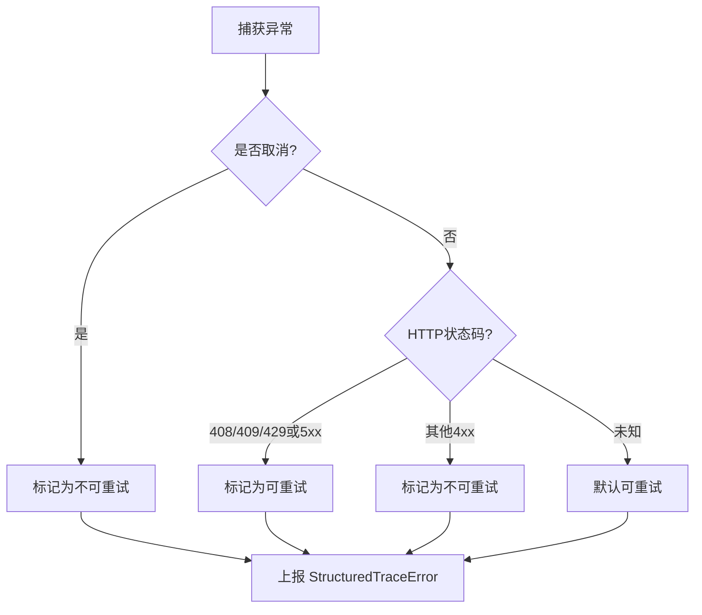
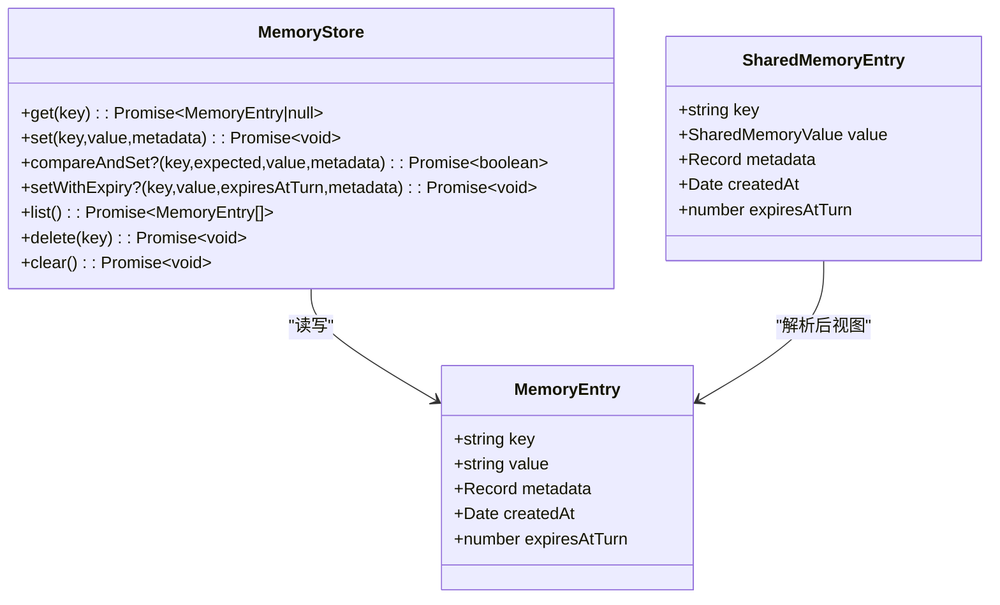
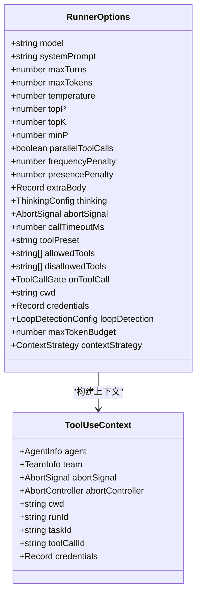
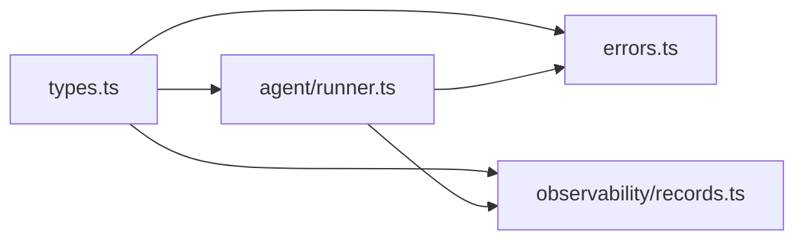

# 类型定义

<cite>
**本文引用的文件**
- [packages/core/src/types.ts](file://packages/core/src/types.ts)
- [packages/core/src/observability/records.ts](file://packages/core/src/observability/records.ts)
- [packages/core/src/errors.ts](file://packages/core/src/errors.ts)
- [packages/core/src/agent/runner.ts](file://packages/core/src/agent/runner.ts)
</cite>

## 目录
1. [简介](#简介)
2. [项目结构](#项目结构)
3. [核心组件](#核心组件)
4. [架构总览](#架构总览)
5. [详细组件分析](#详细组件分析)
6. [依赖关系分析](#依赖关系分析)
7. [性能注意事项](#性能注意事项)
8. [故障排查指南](#故障排查指南)
9. [结论](#结论)
10. [附录](#附录)

## 简介
本文件为 Open Multi-Agent（OMA）的类型定义参考文档，聚焦公共接口与关键类型的字段、数据类型与约束条件。内容覆盖 AgentConfig、TeamConfig、Task、ToolDefinition（对应 LLMToolDef）、追踪记录 TraceEvent/SpanRecord、错误类型与异常处理，以及 TypeScript 类型安全实践与扩展指南。目标是帮助读者在不深入源码的情况下，准确理解并安全使用 OMA 的类型系统。

## 项目结构
- 类型定义集中在 core 包的 types.ts，统一导出所有公共类型，便于下游按需导入并保持依赖无环。
- 可观测性 v2 的 SpanRecord 相关类型位于 observability/records.ts。
- 框架级错误类与工具函数位于 errors.ts。
- AgentRunner 的运行时选项与上下文类型在 agent/runner.ts 中补充。

**图表来源**
- [packages/core/src/types.ts:1-20](file://packages/core/src/types.ts#L1-L20)
- [packages/core/src/agent/runner.ts:76-160](file://packages/core/src/agent/runner.ts#L76-L160)
- [packages/core/src/observability/records.ts:1-56](file://packages/core/src/observability/records.ts#L1-L56)
- [packages/core/src/errors.ts:1-60](file://packages/core/src/errors.ts#L1-L60)

**章节来源**
- [packages/core/src/types.ts:1-20](file://packages/core/src/types.ts#L1-L20)

## 核心组件
本节概述关键类型及其职责：
- 内容与消息：TextBlock、ReasoningBlock、ToolUseBlock、ToolResultBlock、ImageBlock、ContentBlock、LLMMessage、AgentRunInput、AgentPromptInput、ContextStrategy。
- 运行身份与结果：TokenUsage、RunIdentity、TraceLink、RunIdentityOptions、RunStatusCode、RunStatus、StructuredTraceError。
- 工具与上下文：LLMToolDef、ToolUseContext、AgentInfo、ToolCallContext、ToolCallDecision、ToolCallGate、ToolCallGateMetadata。
- 智能体与团队：ThinkingConfig、AgentConfig（含模型/工具/凭据/超时/预算/恢复等）、TeamConfig、CoordinatorConfig。
- 任务与编排：Task、TaskStatus、TaskExecutionMetrics、TaskSnapshot、OrchestratorConfig、CheckpointOptions、RestoreOptions、各类快照。
- 可观测性：TraceEventBase 及派生事件（LLMCallTrace、ToolCallTrace、TaskTrace、AgentTrace、PlanReadyTrace、AgentStreamTrace、ConsensusTrace、RoutingDecisionTrace），以及 v2 SpanRecord 系列。
- 内存：SharedMemoryValue、SharedMemoryEntry、MemoryStore。
- LLM 适配器：LLMChatOptions、LLMStreamOptions、LLMAdapter。

**章节来源**
- [packages/core/src/types.ts:19-160](file://packages/core/src/types.ts#L19-L160)
- [packages/core/src/types.ts:221-322](file://packages/core/src/types.ts#L221-L322)
- [packages/core/src/types.ts:511-619](file://packages/core/src/types.ts#L511-L619)
- [packages/core/src/types.ts:740-763](file://packages/core/src/types.ts#L740-L763)
- [packages/core/src/types.ts:1295-1310](file://packages/core/src/types.ts#L1295-L1310)
- [packages/core/src/types.ts:2003-2099](file://packages/core/src/types.ts#L2003-L2099)
- [packages/core/src/types.ts:2131-2343](file://packages/core/src/types.ts#L2131-L2343)
- [packages/core/src/types.ts:2349-2593](file://packages/core/src/types.ts#L2349-L2593)
- [packages/core/src/types.ts:2671-2800](file://packages/core/src/types.ts#L2671-L2800)
- [packages/core/src/types.ts:2805-2872](file://packages/core/src/types.ts#L2805-L2872)
- [packages/core/src/types.ts:2878-2979](file://packages/core/src/types.ts#L2878-L2979)
- [packages/core/src/agent/runner.ts:76-160](file://packages/core/src/agent/runner.ts#L76-L160)
- [packages/core/src/observability/records.ts:1-56](file://packages/core/src/observability/records.ts#L1-L56)

## 架构总览
下图展示类型在系统中的角色与交互：应用通过 TeamConfig/AgentConfig 配置智能体与团队；OrchestratorConfig 驱动任务编排；Task 描述工作单元；LLMAdapter 提供模型调用；ToolUseContext 将运行期上下文注入工具；TraceEvent/SpanRecord 记录执行轨迹；错误类型用于分类与重试策略。

**图表来源**
- [packages/core/src/types.ts:1295-1310](file://packages/core/src/types.ts#L1295-L1310)
- [packages/core/src/types.ts:2003-2099](file://packages/core/src/types.ts#L2003-L2099)
- [packages/core/src/types.ts:2131-2343](file://packages/core/src/types.ts#L2131-L2343)
- [packages/core/src/types.ts:2601-2665](file://packages/core/src/types.ts#L2601-L2665)
- [packages/core/src/types.ts:2878-2979](file://packages/core/src/types.ts#L2878-L2979)
- [packages/core/src/types.ts:2671-2800](file://packages/core/src/types.ts#L2671-L2800)
- [packages/core/src/observability/records.ts:1-56](file://packages/core/src/observability/records.ts#L1-L56)
- [packages/core/src/errors.ts:1-120](file://packages/core/src/errors.ts#L1-L120)

## 详细组件分析

### 智能体与团队配置：AgentConfig、TeamConfig、CoordinatorConfig
- AgentConfig：定义单个智能体的模型、提供商、提示词、工具集、凭据、超时、预算、恢复策略、思考模式、上下文压缩等。支持 per-call 工具门控 onToolCall、工作目录 cwd、循环检测 loopDetection、最大 token 预算 maxTokenBudget 等。
- TeamConfig：团队名称、成员 AgentConfig 列表、共享内存开关或自定义 MemoryStore、并发度限制。
- CoordinatorConfig：协调器（自动计划生成）的模型、提示词、采样参数、工具预设、回调、工作目录、超时等。

**图表来源**
- [packages/core/src/types.ts:1295-1310](file://packages/core/src/types.ts#L1295-L1310)
- [packages/core/src/types.ts:906-950](file://packages/core/src/types.ts#L906-L950)
- [packages/core/src/types.ts:2601-2665](file://packages/core/src/types.ts#L2601-L2665)

**章节来源**
- [packages/core/src/types.ts:1295-1310](file://packages/core/src/types.ts#L1295-L1310)
- [packages/core/src/types.ts:906-950](file://packages/core/src/types.ts#L906-L950)
- [packages/core/src/types.ts:2601-2665](file://packages/core/src/types.ts#L2601-L2665)

### 任务与工作单元：Task、TaskStatus、TaskExecutionMetrics、TaskSnapshot
- Task：唯一 id、标题、描述、状态、执行者 assignee、依赖 dependsOn、记忆范围 memoryScope、依赖载荷 dependencyPayload、角色 role、优先级 priority、元数据 metadata、硬性要求 requires、结果 result、时间戳、重试次数与退避、共识验证 verify、计划修订关联等。
- TaskStatus：pending/in_progress/completed/failed/blocked/skipped。
- TaskExecutionMetrics：起止时间、耗时、token 用量、工具调用计数、重试次数。
- TaskSnapshot：序列化形式，用于检查点与回放。

**图表来源**
- [packages/core/src/types.ts:2003-2099](file://packages/core/src/types.ts#L2003-L2099)
- [packages/core/src/errors.ts:11-22](file://packages/core/src/errors.ts#L11-L22)

**章节来源**
- [packages/core/src/types.ts:2003-2099](file://packages/core/src/types.ts#L2003-L2099)

### 工具定义与执行上下文：LLMToolDef、ToolUseContext、ToolCallGate
- LLMToolDef：工具名、描述、输入 JSON Schema。
- ToolUseContext：注入到工具执行的上下文，包括调用方 Agent 信息、团队信息、取消信号、工作目录、凭据、runId/taskId/toolCallId 等。
- ToolCallGate：可选的门控回调，返回 allow/deny/suspend 决策，并可携带原因。

**图表来源**
- [packages/core/src/types.ts:511-619](file://packages/core/src/types.ts#L511-L619)
- [packages/core/src/agent/runner.ts:811-827](file://packages/core/src/agent/runner.ts#L811-L827)

**章节来源**
- [packages/core/src/types.ts:511-619](file://packages/core/src/types.ts#L511-L619)
- [packages/core/src/agent/runner.ts:811-827](file://packages/core/src/agent/runner.ts#L811-L827)

### 可观测性：TraceEvent 与 SpanRecord
- TraceEvent 系列：轻量级 span，包含 runId/spanId/parentId/type/startMs/endMs/durationMs/agent/taskId 等基础字段，以及具体事件类型（llm_call、tool_call、task、agent、plan_ready、agent_stream、consensus、routing_decision）。
- SpanRecord（v2）：稳定 schemaVersion=2，recordId/sequence/timestampUnixMs/runId/attempt/traceId/spanId/parentSpanId，以及 span_start/span_end 等记录类型，用于生产级可观测性。

**图表来源**
- [packages/core/src/types.ts:2671-2800](file://packages/core/src/types.ts#L2671-L2800)

**章节来源**
- [packages/core/src/types.ts:2671-2800](file://packages/core/src/types.ts#L2671-L2800)
- [packages/core/src/observability/records.ts:1-56](file://packages/core/src/observability/records.ts#L1-L56)

### 错误类型与异常处理
- 框架错误类：InvalidTaskRequirementsError、TokenBudgetExceededError、CostBudgetExceededError、LLMCallTimeoutError、RoutingTimeoutError、RoutingProfilerFailedError、RoutingDeclarationRequiredError、InvalidMessageError、UnsupportedToolCallError、UnsupportedToolResultContentError。
- 错误分类与重试：isRetryableError、isCancellationError、StructuredTraceError（kind/code/name/message/retryable/httpStatus/provider/attempt）。

**图表来源**
- [packages/core/src/errors.ts:183-239](file://packages/core/src/errors.ts#L183-L239)
- [packages/core/src/types.ts:298-322](file://packages/core/src/types.ts#L298-L322)

**章节来源**
- [packages/core/src/errors.ts:11-180](file://packages/core/src/errors.ts#L11-L180)
- [packages/core/src/errors.ts:183-239](file://packages/core/src/errors.ts#L183-L239)
- [packages/core/src/types.ts:298-322](file://packages/core/src/types.ts#L298-L322)

### 内存与共享状态：SharedMemory、MemoryStore
- SharedMemoryValue：可序列化的值类型（字符串、数字、布尔、null、数组、对象）。
- SharedMemoryEntry：键值对，带元数据与过期轮次。
- MemoryStore：键值存储抽象，支持 get/set/list/delete/clear，可选 compareAndSet 与 setWithExpiry。

**图表来源**
- [packages/core/src/types.ts:2805-2872](file://packages/core/src/types.ts#L2805-L2872)

**章节来源**
- [packages/core/src/types.ts:2805-2872](file://packages/core/src/types.ts#L2805-L2872)

### 运行选项与上下文：RunnerOptions、ToolUseContext
- RunnerOptions：模型、系统提示、最大轮次、采样参数、并行工具调用、频率/存在惩罚、额外请求体、思考模式、取消信号、每调用超时、工具白名单/黑名单、工作目录、凭据、循环检测、token 预算、上下文压缩等。
- ToolUseContext：工具执行时注入的上下文，包含调用方 Agent 信息、团队信息、取消信号、工作目录、凭据、runId/taskId/toolCallId 等。

**图表来源**
- [packages/core/src/agent/runner.ts:76-160](file://packages/core/src/agent/runner.ts#L76-L160)
- [packages/core/src/types.ts:511-583](file://packages/core/src/types.ts#L511-L583)

**章节来源**
- [packages/core/src/agent/runner.ts:76-160](file://packages/core/src/agent/runner.ts#L76-L160)
- [packages/core/src/types.ts:511-583](file://packages/core/src/types.ts#L511-L583)

## 依赖关系分析
- types.ts 作为单一类型出口，被 runner.ts、errors.ts、observability/records.ts 引用，形成以类型为核心的低耦合结构。
- runner.ts 依赖 types.ts 中的 RunnerOptions、ToolUseContext、LLMAdapter、StreamEvent 等，并在工具解析流程中使用工具注册表。
- errors.ts 依赖 types.ts 中的语义路由评估与任务需求问题类型，提供错误分类与重试判定。
- observability/records.ts 依赖 types.ts 中的 RunStatus、StructuredTraceError、TraceAttributeValue、TraceLink 等，确保 v2 记录兼容。

**图表来源**
- [packages/core/src/types.ts:1-20](file://packages/core/src/types.ts#L1-L20)
- [packages/core/src/agent/runner.ts:76-160](file://packages/core/src/agent/runner.ts#L76-L160)
- [packages/core/src/errors.ts:1-60](file://packages/core/src/errors.ts#L1-L60)
- [packages/core/src/observability/records.ts:1-56](file://packages/core/src/observability/records.ts#L1-L56)

**章节来源**
- [packages/core/src/types.ts:1-20](file://packages/core/src/types.ts#L1-L20)
- [packages/core/src/agent/runner.ts:76-160](file://packages/core/src/agent/runner.ts#L76-L160)
- [packages/core/src/errors.ts:1-60](file://packages/core/src/errors.ts#L1-L60)
- [packages/core/src/observability/records.ts:1-56](file://packages/core/src/observability/records.ts#L1-L56)

## 性能注意事项
- 合理设置 maxTurns、maxTokens、callTimeoutMs 与 maxTokenBudget，避免无限循环与资源耗尽。
- 使用 ContextStrategy（滑动窗口/摘要/压缩/自定义）控制长对话的上下文大小，减少 token 消耗。
- 利用工具门控 onToolCall 与工具预设（readonly/readwrite/full）限制副作用工具的使用范围。
- 启用 checkpoint 与恢复策略，提升中断恢复能力，降低重复执行成本。
- 使用可观测性 v2 记录进行性能分析与容量规划。

[本节为通用指导，不直接分析具体文件]

## 故障排查指南
- 常见错误类型与含义：
  - InvalidTaskRequirementsError：任务硬性要求未满足，需调整任务配置或代理能力。
  - TokenBudgetExceededError/CostBudgetExceededError：超出 token 或预估成本预算，需调小预算或优化提示词。
  - LLMCallTimeoutError/RoutingTimeoutError：单次调用或路由阶段超时，需调整超时阈值或网络环境。
  - InvalidMessageError/UnsupportedToolCallError/UnsupportedToolResultContentError：消息或工具调用格式不被后端支持，需适配或降级。
- 重试与取消：
  - isRetryableError 决定是否可以重试；isCancellationError 识别用户主动取消。
  - 结合 StructuredTraceError 的 kind/code/httpStatus 定位失败根因。
- 建议步骤：
  - 查看 TraceEvent/SpanRecord 中的错误信息与链路 ID。
  - 检查工具门控决策与审批流（onToolCall/onPlanReady/onApproval/onTaskDispatch）。
  - 核对 AgentConfig/OrchestratorConfig 的预算、超时与恢复策略。

**章节来源**
- [packages/core/src/errors.ts:11-180](file://packages/core/src/errors.ts#L11-L180)
- [packages/core/src/errors.ts:183-239](file://packages/core/src/errors.ts#L183-L239)
- [packages/core/src/types.ts:298-322](file://packages/core/src/types.ts#L298-L322)
- [packages/core/src/types.ts:2671-2800](file://packages/core/src/types.ts#L2671-L2800)

## 结论
OMA 的类型系统围绕“配置—执行—可观测—错误”四个维度展开，提供了从智能体与团队配置、任务编排、工具执行到追踪记录的完整类型契约。遵循这些类型定义与最佳实践，可以在保证类型安全的前提下，构建可靠、可观测、可扩展的多智能体系统。

[本节为总结，不直接分析具体文件]

## 附录

### TypeScript 类型使用最佳实践
- 优先使用联合类型与判别字段（如 TraceEventType、TaskStatus）进行分支判断，确保穷尽性检查。
- 使用只读属性（readonly）保护不可变数据结构，避免意外修改。
- 通过 ToolCallGate 与工具预设实现最小权限原则，限制工具访问范围。
- 使用 StructuredTraceError 与 TraceEvent/SpanRecord 记录错误与链路，便于排障与审计。
- 在长对话中使用 ContextStrategy 控制上下文大小，避免溢出与性能退化。

[本节为通用指导，不直接分析具体文件]

### 类型扩展与自定义类型开发指南
- 自定义工具：实现 LLMToolDef 的输入 Schema 与执行逻辑，并通过 ToolUseContext 获取运行期上下文。
- 自定义 LLMAdapter：实现 chat/stream 方法，遵循 LLMAdapter 接口，必要时声明 capabilities.echoesReasoning。
- 自定义 MemoryStore：实现 get/set/list/delete/clear，可选 compareAndSet/setWithExpiry 以支持 TTL 与原子更新。
- 自定义 ExecutionRouter：实现 decide 方法，基于 RosterSummaryEntry 与 RoutingContext 选择 Single/Team 拓扑。
- 扩展可观测性：在 onTrace 或 ObservabilityConfig sink 中消费 TraceEvent/SpanRecord，进行外部集成。

**章节来源**
- [packages/core/src/types.ts:511-619](file://packages/core/src/types.ts#L511-L619)
- [packages/core/src/types.ts:2878-2979](file://packages/core/src/types.ts#L2878-L2979)
- [packages/core/src/types.ts:2805-2872](file://packages/core/src/types.ts#L2805-L2872)
- [packages/core/src/types.ts:1694-1728](file://packages/core/src/types.ts#L1694-L1728)
- [packages/core/src/types.ts:2671-2800](file://packages/core/src/types.ts#L2671-L2800)
- [packages/core/src/observability/records.ts:1-56](file://packages/core/src/observability/records.ts#L1-L56)