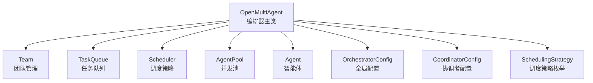
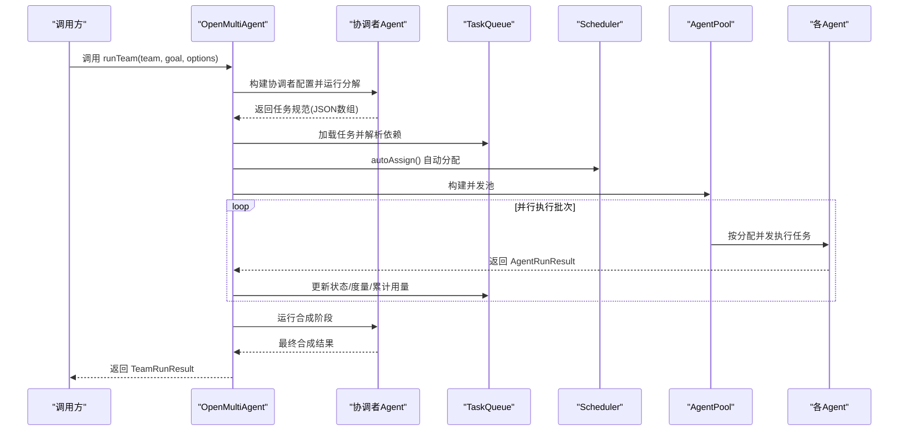
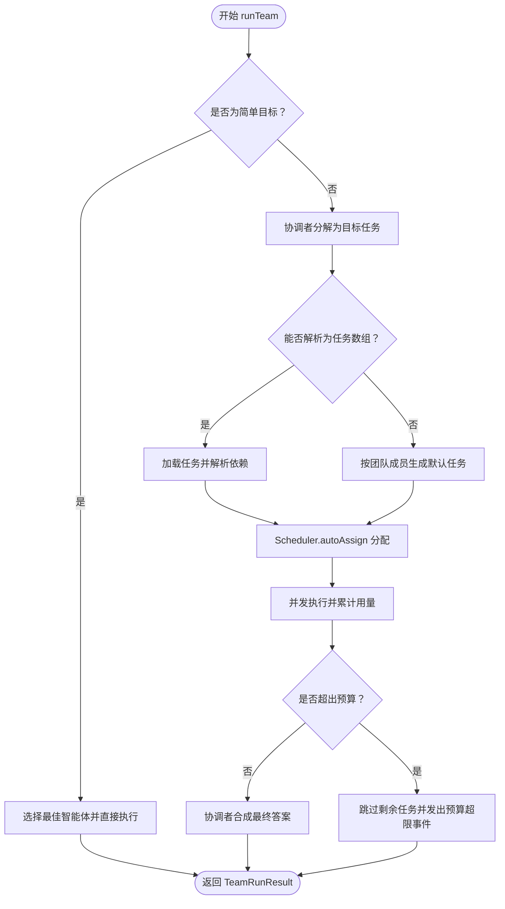
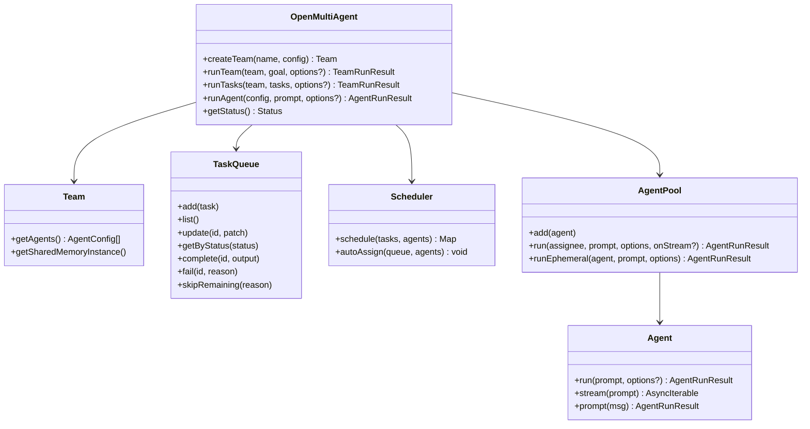

# 编排器 API

<cite>
**本文引用的文件**
- [orchestrator.ts](file://src/orchestrator/orchestrator.ts)
- [scheduler.ts](file://src/orchestrator/scheduler.ts)
- [types.ts](file://src/types.ts)
- [index.ts](file://src/index.ts)
- [errors.ts](file://src/errors.ts)
- [single-agent.ts](file://examples/basics/single-agent.ts)
- [team-collaboration.ts](file://examples/basics/team-collaboration.ts)
- [multi-model-team.ts](file://examples/basics/multi-model-team.ts)
- [task-retry.test.ts](file://tests/task-retry.test.ts)
</cite>

## 目录
1. [简介](#简介)
2. [项目结构](#项目结构)
3. [核心组件](#核心组件)
4. [架构总览](#架构总览)
5. [详细组件分析](#详细组件分析)
6. [依赖关系分析](#依赖关系分析)
7. [性能考量](#性能考量)
8. [故障排查指南](#故障排查指南)
9. [结论](#结论)
10. [附录](#附录)

## 简介
本文件为 OpenMultiAgent 编排器（OpenMultiAgent）的详细 API 文档，聚焦于主类 OpenMultiAgent 的公共方法与关键配置项，帮助开发者在单智能体对话、多智能体团队协作与自定义任务执行等场景中高效使用框架。文档覆盖以下要点：
- OpenMultiAgent 主类的公共方法：createTeam()、runTeam()、runTasks()、runAgent()、getStatus()、executeWithRetry()
- 参数类型、返回值、使用场景与最佳实践
- OrchestratorConfig 配置选项、SchedulingStrategy 枚举值与 CoordinatorConfig 设置
- 错误处理机制、性能优化建议与调试技巧
- 完整示例路径（以源码路径代替具体代码片段）

## 项目结构
OpenMultiAgent 的核心位于 orchestrator 子系统，围绕 Team、TaskQueue、Scheduler、AgentPool 与 Agent 组成端到端编排流水线；类型定义集中在 types.ts，公开导出入口在 index.ts。

图表来源
- [orchestrator.ts:900-932](file://src/orchestrator/orchestrator.ts#L900-L932)
- [scheduler.ts:96-105](file://src/orchestrator/scheduler.ts#L96-L105)
- [types.ts:757-875](file://src/types.ts#L757-L875)

章节来源
- [index.ts:57-59](file://src/index.ts#L57-L59)
- [types.ts:757-875](file://src/types.ts#L757-L875)

## 核心组件
- OpenMultiAgent：顶层编排器，负责团队创建、自动分解与执行、结果聚合与可观测性事件输出。
- Team：封装团队成员、共享内存与消息总线。
- TaskQueue：带依赖关系的任务工作队列，支持自动解阻与级联失败。
- Scheduler：任务分配策略集合，支持轮转、最少忙碌、能力匹配与关键路径优先。
- AgentPool：并发控制的执行池，统一注入委托工具以支持跨智能体委托。
- Agent：单智能体对话与工具调用循环，支持流式输出与上下文压缩。
- OrchestratorConfig：编排器全局配置，如最大并发、默认模型/提供商、预算与回调钩子。
- CoordinatorConfig：临时协调者配置，用于 runTeam() 的分解与合成阶段。
- SchedulingStrategy：调度策略枚举，供 Scheduler 使用。

章节来源
- [orchestrator.ts:900-932](file://src/orchestrator/orchestrator.ts#L900-L932)
- [scheduler.ts:24-36](file://src/orchestrator/scheduler.ts#L24-L36)
- [types.ts:757-875](file://src/types.ts#L757-L875)

## 架构总览
下图展示了 runTeam() 的端到端流程：协调者分解目标为任务、构建任务图、调度分配、并发执行、共享内存写入、最终合成与结果聚合。

图表来源
- [orchestrator.ts:1061-1374](file://src/orchestrator/orchestrator.ts#L1061-L1374)

章节来源
- [orchestrator.ts:1061-1374](file://src/orchestrator/orchestrator.ts#L1061-L1374)

## 详细组件分析

### OpenMultiAgent 主类 API

- 方法：createTeam(name, config)
  - 功能：注册并创建一个团队实例，用于后续 runTeam()/runTasks() 使用。
  - 参数
    - name: 团队唯一标识符（字符串）
    - config: TeamConfig（包含 agents、sharedMemory、maxConcurrency 等）
  - 返回：Team 实例
  - 使用场景：在执行任何编排前准备团队资源
  - 最佳实践：确保 name 唯一；按需启用 sharedMemory 以支持跨任务共享上下文
  - 参考路径
    - [createTeam:947-957](file://src/orchestrator/orchestrator.ts#L947-L957)

- 方法：runTeam(team, goal, options?)
  - 功能：对高层目标进行自动编排，分解为任务、分配执行、共享结果并合成最终答案。
  - 参数
    - team: Team 实例（由 createTeam 创建）
    - goal: 字符串，高层自然语言目标
    - options?: RunTeamOptions（可选）
      - abortSignal?: AbortSignal（取消信号）
      - coordinator?: CoordinatorConfig（协调者配置覆盖）
      - planOnly?: boolean（仅生成计划，不执行任务）
      - revealCoordinator?: boolean（在每个 worker 提示前注入团队上下文）
  - 返回：TeamRunResult
    - success: 是否全部成功
    - goal?: 原始目标
    - tasks?: 任务执行记录数组
    - agentResults: Map<agentName, AgentRunResult>
    - totalTokenUsage: 总计 token 使用
  - 使用场景：多智能体团队协作，自动分解与执行
  - 最佳实践
    - 大多数复杂目标会触发协调者分解；简单目标可能短路直连最佳匹配智能体
    - 使用 onProgress/onTrace 订阅进度与追踪事件
    - 合理设置 maxConcurrency 与 maxTokenBudget 控制成本与吞吐
  - 参考路径
    - [runTeam:1061-1374](file://src/orchestrator/orchestrator.ts#L1061-L1374)

- 方法：runTasks(team, tasks, options?)
  - 功能：显式提供任务列表，直接进入调度与执行阶段，无协调者参与。
  - 参数
    - team: Team 实例
    - tasks: 任务描述数组（title/description/assignee/dependsOn/memoryScope 等）
    - options?: { abortSignal? }
  - 返回：TeamRunResult
  - 使用场景：已有明确任务规划或自定义任务管线
  - 最佳实践：确保 dependsOn 正确指向上游任务；合理设置重试与退避参数
  - 参考路径
    - [runTasks:1390-1454](file://src/orchestrator/orchestrator.ts#L1390-L1454)

- 方法：runAgent(config, prompt, options?)
  - 功能：一次性运行单个智能体，适合简单查询或不需要团队编排的场景。
  - 参数
    - config: AgentConfig（模型、工具、上下文策略等）
    - prompt: 字符串，用户提示
    - options?: { abortSignal? }
  - 返回：AgentRunResult
  - 使用场景：快速单次推理或工具调用
  - 最佳实践：结合 onProgress/onTrace 观测单次运行；注意 maxTokenBudget 与超时
  - 参考路径
    - [runAgent:974-1034](file://src/orchestrator/orchestrator.ts#L974-L1034)

- 方法：getStatus()
  - 功能：返回轻量状态快照（团队数、活跃智能体、已完成任务数）。
  - 返回：{ teams, activeAgents, completedTasks }
  - 使用场景：监控与运维仪表盘
  - 最佳实践：completedTasks 不包含协调者的内部步骤，仅统计实际用户任务
  - 参考路径
    - [getStatus:1468-1474](file://src/orchestrator/orchestrator.ts#L1468-L1474)

- 方法：executeWithRetry(run, task, onRetry?, delayFn?)
  - 功能：对单次任务执行进行带指数退避的重试包装，累积 token 使用。
  - 参数
    - run: () => Promise<AgentRunResult>，实际执行函数
    - task: Task，携带 maxRetries/retryDelayMs/retryBackoff
    - onRetry?: (data) => void，每次重试前回调（含尝试次数、最大次数、错误与下次延迟）
    - delayFn?: (ms) => Promise<void>，可注入延迟函数（默认使用内置 sleep）
  - 返回：AgentRunResult（最后一次尝试结果，tokenUsage 累积）
  - 使用场景：为任务执行增加鲁棒性
  - 最佳实践：maxRetries 默认 0（不重试）；backoff ≥ 1；delay 上限 30 秒
  - 参考路径
    - [executeWithRetry:266-333](file://src/orchestrator/orchestrator.ts#L266-L333)
    - [computeRetryDelay:247-253](file://src/orchestrator/orchestrator.ts#L247-L253)
  - 单元测试参考
    - [task-retry.test.ts:81-368](file://tests/task-retry.test.ts#L81-L368)

章节来源
- [orchestrator.ts:947-1474](file://src/orchestrator/orchestrator.ts#L947-L1474)
- [orchestrator.ts:266-333](file://src/orchestrator/orchestrator.ts#L266-L333)
- [task-retry.test.ts:81-368](file://tests/task-retry.test.ts#L81-L368)

### OrchestratorConfig 配置项
- maxConcurrency?: number（默认 5）：并发执行上限
- maxDelegationDepth?: number（默认 3）：委托链深度限制
- maxTokenBudget?: number：整次运行的 token 预算
- defaultModel?: string（默认 'claude-opus-4-6'）
- defaultProvider?: SupportedProvider（默认 'anthropic'）
- defaultBaseURL?: string
- defaultApiKey?: string
- onProgress?: (event) => void：进度事件回调
- onTrace?: (event) => void | Promise<void>：追踪事件回调
- onApproval?: (completedTasks, nextTasks) => Promise<boolean>：批间审批门
- onPlanReady?: (tasks) => Promise<boolean>：计划审批门
- onAgentStream?: (agentName, event) => void：runTeam 流式事件回调

用途与最佳实践
- 在高并发场景下调大 maxConcurrency，但需关注令牌预算与模型配额
- 使用 onProgress/onTrace 收集结构化事件，便于可视化与审计
- onApproval 用于在每轮任务完成后进行人工/自动化审批
- onPlanReady 用于在任务计划生成后进行二次确认

章节来源
- [types.ts:757-813](file://src/types.ts#L757-L813)

### SchedulingStrategy 枚举与调度器
- 枚举值：'round-robin' | 'least-busy' | 'capability-match' | 'dependency-first'
- 作用：决定未分配任务如何映射到可用智能体
- 策略说明
  - round-robin：按索引轮转分配
  - least-busy：选择当前进行中任务数最少的智能体
  - capability-match：基于关键词重叠评分选择最匹配智能体
  - dependency-first：优先分配能解阻更多下游任务的任务
- 最佳实践
  - 复杂管线默认 'dependency-first'
  - 需要均衡负载时可选 'least-busy'
  - 需要强语义匹配时可选 'capability-match'

章节来源
- [scheduler.ts:24-36](file://src/orchestrator/scheduler.ts#L24-L36)
- [scheduler.ts:96-105](file://src/orchestrator/scheduler.ts#L96-L105)

### CoordinatorConfig 协调者配置
- model?: string（默认继承 OrchestratorConfig.defaultModel）
- adapter?: LLMAdapter（覆盖协调者适配器）
- provider/baseURL/apiKey?: 与 OrchestratorConfig 对齐
- systemPrompt?: string（完全覆盖协调者系统提示）
- instructions?: string（附加指令，当未覆盖 systemPrompt 时生效）
- maxTurns/maxTokens/temperature/frequencyPenalty/presencePenalty/topP/topK/minP/parallelToolCalls/extraBody/toolPreset/tools/disallowedTools/loopDetection/timeoutMs

用途与最佳实践
- 当需要更强的分解能力或特殊工具时，通过 tools/disallowedTools/extraBody 精细控制
- 使用 systemPrompt 定制分解风格与约束
- 通过 loopDetection/timeoutMs 提升稳定性

章节来源
- [types.ts:821-875](file://src/types.ts#L821-L875)

### 典型运行模式与示例路径
- 单智能体对话
  - 使用 runAgent 或直接使用 Agent 类进行流式/多轮对话
  - 示例路径
    - [single-agent.ts:34-59](file://examples/basics/single-agent.ts#L34-L59)
    - [single-agent.ts:93-103](file://examples/basics/single-agent.ts#L93-L103)
- 多智能体团队协作
  - 使用 createTeam + runTeam，自动分解与执行
  - 示例路径
    - [team-collaboration.ts:109-128](file://examples/basics/team-collaboration.ts#L109-L128)
    - [team-collaboration.ts:140-158](file://examples/basics/team-collaboration.ts#L140-L158)
- 自定义任务执行
  - 使用 runTasks 显式传入任务数组
  - 示例路径
    - [multi-model-team.ts:181-225](file://examples/basics/multi-model-team.ts#L181-L225)

章节来源
- [orchestrator.ts:947-1454](file://src/orchestrator/orchestrator.ts#L947-L1454)
- [single-agent.ts:34-103](file://examples/basics/single-agent.ts#L34-L103)
- [team-collaboration.ts:109-167](file://examples/basics/team-collaboration.ts#L109-L167)
- [multi-model-team.ts:181-243](file://examples/basics/multi-model-team.ts#L181-L243)

### 执行流程与决策逻辑（算法与控制流）
- runTeam 内部短路判定：若目标为“简单目标”（长度阈值内且不包含复杂信号），直接选择最佳智能体执行，避免协调者开销
- 协调者分解：解析 JSON 任务数组，构建任务图，解析 title→ID 依赖映射
- 调度与执行：Scheduler.autoAssign 分配任务，AgentPool 并发执行，共享内存写入，累计 token 用量
- 合成阶段：汇总完成/失败/跳过任务与共享内存摘要，生成最终回答
- 重试机制：executeWithRetry 基于任务级重试配置进行指数退避，最多 30 秒延迟

图表来源
- [orchestrator.ts:1079-1374](file://src/orchestrator/orchestrator.ts#L1079-L1374)
- [orchestrator.ts:1651-1710](file://src/orchestrator/orchestrator.ts#L1651-L1710)

章节来源
- [orchestrator.ts:1079-1374](file://src/orchestrator/orchestrator.ts#L1079-L1374)
- [orchestrator.ts:1651-1710](file://src/orchestrator/orchestrator.ts#L1651-L1710)

## 依赖关系分析

图表来源
- [orchestrator.ts:900-932](file://src/orchestrator/orchestrator.ts#L900-L932)
- [scheduler.ts:96-105](file://src/orchestrator/scheduler.ts#L96-L105)

章节来源
- [orchestrator.ts:900-932](file://src/orchestrator/orchestrator.ts#L900-L932)
- [scheduler.ts:96-105](file://src/orchestrator/scheduler.ts#L96-L105)

## 性能考量
- 并发与吞吐
  - 调整 OrchestratorConfig.maxConcurrency 以匹配硬件与配额；在复杂任务中适度提高可提升吞吐
- 令牌预算
  - 设置 OrchestratorConfig.maxTokenBudget 与 AgentConfig.maxTokenBudget，结合 onProgress 中的预算事件进行告警
- 重试与退避
  - 使用 Task.maxRetries/retryDelayMs/retryBackoff 为易失败环节增加弹性；注意累积 token 使用
- 上下文压缩
  - 在 AgentConfig.contextStrategy 中选择合适的策略（滑动窗口/摘要/紧凑），降低长对话的上下文开销
- 调度策略
  - 复杂管线优先 'dependency-first'，均衡负载可选 'least-busy'，强语义匹配可选 'capability-match'

[本节为通用指导，无需特定文件引用]

## 故障排查指南
- 预算超限
  - 现象：出现 'budget_exceeded' 事件与 TokenBudgetExceededError
  - 排查：检查 OrchestratorConfig.maxTokenBudget 与各 Agent 的 maxTokenBudget；查看 onProgress 中的事件数据
  - 参考
    - [errors.ts:8-19](file://src/errors.ts#L8-L19)
    - [orchestrator.ts:733-747](file://src/orchestrator/orchestrator.ts#L733-L747)
- 委托死锁
  - 现象：委托链导致并发槽位不足
  - 排查：增大 maxConcurrency；避免相互委托（A→B 且 B→A）
  - 参考
    - [orchestrator.ts:483-506](file://src/orchestrator/orchestrator.ts#L483-L506)
- 任务失败与重试
  - 现象：任务状态为 failed，onProgress 输出 error 事件
  - 排查：检查 onRetry 回调中的重试数据；调整重试参数；定位工具调用异常
  - 参考
    - [orchestrator.ts:692-702](file://src/orchestrator/orchestrator.ts#L692-L702)
    - [task-retry.test.ts:107-196](file://tests/task-retry.test.ts#L107-L196)
- 取消与超时
  - 使用 AbortSignal 在 runTeam/runAgent 中中断长时间运行；配合 AgentConfig.timeoutMs 防止本地模型卡顿
  - 参考
    - [types.ts:629-631](file://src/types.ts#L629-L631)
    - [types.ts:481-482](file://src/types.ts#L481-L482)

章节来源
- [errors.ts:8-19](file://src/errors.ts#L8-L19)
- [orchestrator.ts:483-506](file://src/orchestrator/orchestrator.ts#L483-L506)
- [orchestrator.ts:692-702](file://src/orchestrator/orchestrator.ts#L692-L702)
- [task-retry.test.ts:107-196](file://tests/task-retry.test.ts#L107-L196)
- [types.ts:629-631](file://src/types.ts#L629-L631)
- [types.ts:481-482](file://src/types.ts#L481-L482)

## 结论
OpenMultiAgent 通过“协调者分解 + 依赖感知调度 + 并行执行 + 共享内存”的组合，为多智能体协作提供了高扩展、可观测且可控成本的编排能力。合理配置 OrchestratorConfig、SchedulingStrategy 与 CoordinatorConfig，并结合 onProgress/onTrace 与预算/重试策略，可在复杂业务场景中获得稳定与高效的运行表现。

[本节为总结性内容，无需特定文件引用]

## 附录

### API 一览与最佳实践速查
- createTeam
  - 快速准备团队；确保 name 唯一
  - 参考：[orchestrator.ts:947-957](file://src/orchestrator/orchestrator.ts#L947-L957)
- runTeam
  - 自动分解与执行；利用 onProgress/onTrace；谨慎设置预算与并发
  - 参考：[orchestrator.ts:1061-1374](file://src/orchestrator/orchestrator.ts#L1061-L1374)
- runTasks
  - 显式任务；严格校验 dependsOn；合理设置重试
  - 参考：[orchestrator.ts:1390-1454](file://src/orchestrator/orchestrator.ts#L1390-L1454)
- runAgent
  - 单次推理；结合流式/多轮；注意超时与预算
  - 参考：[orchestrator.ts:974-1034](file://src/orchestrator/orchestrator.ts#L974-L1034)
- getStatus
  - 运维监控；completedTasks 仅统计实际任务
  - 参考：[orchestrator.ts:1468-1474](file://src/orchestrator/orchestrator.ts#L1468-L1474)
- executeWithRetry
  - 任务级重试；指数退避；延迟上限 30 秒
  - 参考：[orchestrator.ts:266-333](file://src/orchestrator/orchestrator.ts#L266-L333)，[task-retry.test.ts:81-368](file://tests/task-retry.test.ts#L81-L368)

### 示例路径清单
- 单智能体对话
  - [single-agent.ts:34-59](file://examples/basics/single-agent.ts#L34-L59)
  - [single-agent.ts:93-103](file://examples/basics/single-agent.ts#L93-L103)
- 多智能体团队协作
  - [team-collaboration.ts:109-128](file://examples/basics/team-collaboration.ts#L109-L128)
  - [team-collaboration.ts:140-158](file://examples/basics/team-collaboration.ts#L140-L158)
- 自定义任务执行
  - [multi-model-team.ts:181-225](file://examples/basics/multi-model-team.ts#L181-L225)