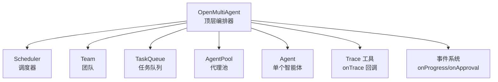
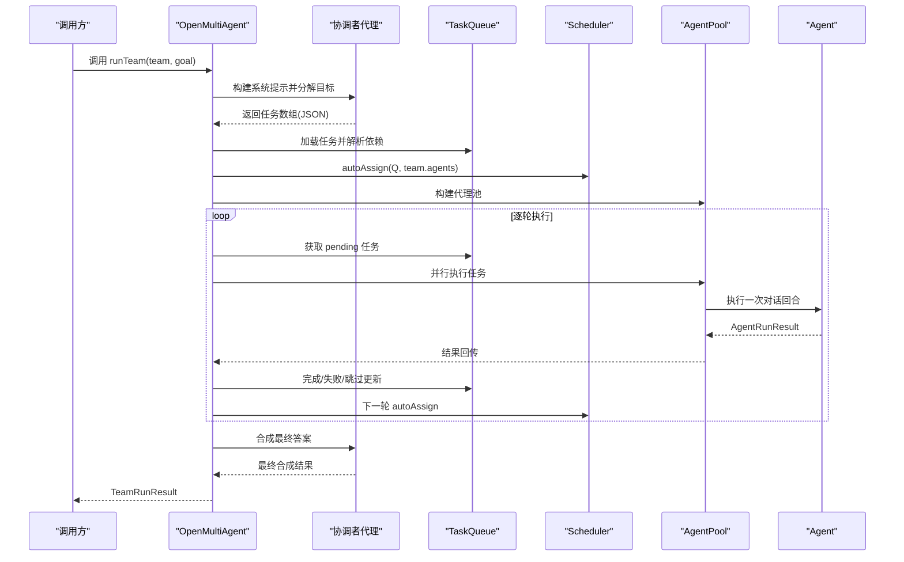
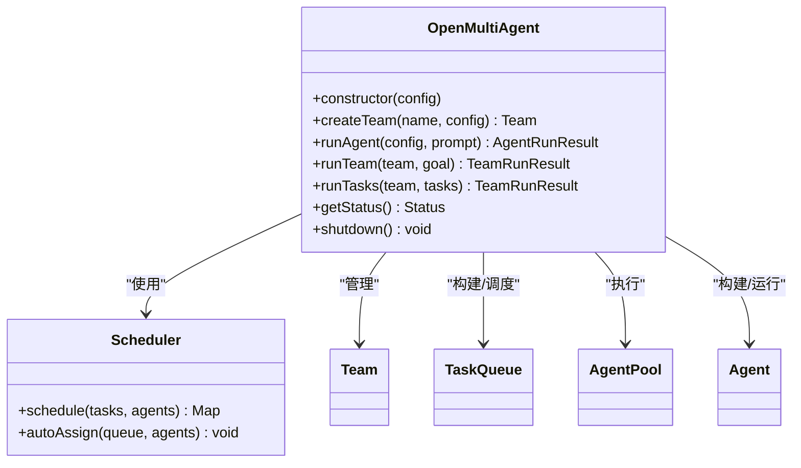

# 编排器 API

<cite>
**本文引用的文件**
- [orchestrator.ts](file://src/orchestrator/orchestrator.ts)
- [scheduler.ts](file://src/orchestrator/scheduler.ts)
- [types.ts](file://src/types.ts)
- [index.ts](file://src/index.ts)
- [orchestrator.test.ts](file://tests/orchestrator.test.ts)
- [01-single-agent.ts](file://examples/01-single-agent.ts)
- [02-team-collaboration.ts](file://examples/02-team-collaboration.ts)
- [10-task-retry.ts](file://examples/10-task-retry.ts)
- [11-trace-observability.ts](file://examples/11-trace-observability.ts)
</cite>

## 目录
1. [简介](#简介)
2. [项目结构](#项目结构)
3. [核心组件](#核心组件)
4. [架构总览](#架构总览)
5. [详细组件分析](#详细组件分析)
6. [依赖关系分析](#依赖关系分析)
7. [性能考量](#性能考量)
8. [故障排查指南](#故障排查指南)
9. [结论](#结论)
10. [附录](#附录)

## 简介
本文件为 OpenMultiAgent 编排器类的详细 API 文档，覆盖以下主题：
- OpenMultiAgent 类的公共 API：构造函数与所有公开方法的签名、参数类型、返回值与典型用法。
- OrchestratorConfig 配置项详解：defaultModel、maxConcurrency、defaultProvider、defaultBaseURL、defaultApiKey、onProgress、onTrace、onApproval、schedulerStrategy 等。
- 事件回调系统：onProgress、onTrace、onApproval 的接口规范与触发时机。
- 错误处理机制：异常类型、错误传播与恢复策略。
- 性能优化建议与最佳实践。

## 项目结构
OpenMultiAgent 位于 orchestrator 子模块中，是框架的顶层入口，负责团队管理、任务编排、调度与可观测性。其主要依赖如下：
- Agent：单个智能体执行单元。
- Team：团队容器，维护共享内存与消息总线。
- TaskQueue：有向无环依赖的任务队列。
- Scheduler：任务到代理的分配策略。
- ToolRegistry/ToolExecutor：工具注册与执行。
- Trace 工具：轻量级运行时观测事件。

图表来源
- [orchestrator.ts:514-1072](file://src/orchestrator/orchestrator.ts#L514-L1072)
- [scheduler.ts:127-353](file://src/orchestrator/scheduler.ts#L127-L353)

章节来源
- [orchestrator.ts:1-120](file://src/orchestrator/orchestrator.ts#L1-L120)
- [index.ts:57-59](file://src/index.ts#L57-L59)

## 核心组件
- OpenMultiAgent：顶层编排器，提供 createTeam、runTeam、runTasks、runAgent 等 API；支持进度回调、追踪回调与审批门控。
- Scheduler：封装四种调度策略（round-robin、least-busy、capability-match、dependency-first），用于将待执行任务分配给可用代理。
- OrchestratorConfig：顶层配置对象，定义默认模型、并发度、默认凭据、回调与调度策略等。
- OrchestratorEvent：进度事件类型集合，用于 onProgress 回调。
- TraceEvent：追踪事件类型集合，用于 onTrace 回调。

章节来源
- [orchestrator.ts:514-1072](file://src/orchestrator/orchestrator.ts#L514-L1072)
- [scheduler.ts:127-353](file://src/orchestrator/scheduler.ts#L127-L353)
- [types.ts:385-411](file://src/types.ts#L385-L411)
- [types.ts:364-383](file://src/types.ts#L364-L383)
- [types.ts:417-471](file://src/types.ts#L417-L471)

## 架构总览
OpenMultiAgent 的核心流程分为两类：
- 自动编排 runTeam：由临时“协调者”代理将高层目标分解为任务，构建依赖图，调度执行，最终合成结果。
- 显式任务 runTasks：直接加载任务列表，自动分配未分配任务，按依赖顺序执行。

图表来源
- [orchestrator.ts:641-740](file://src/orchestrator/orchestrator.ts#L641-L740)
- [orchestrator.ts:280-464](file://src/orchestrator/orchestrator.ts#L280-L464)
- [scheduler.ts:187-198](file://src/orchestrator/scheduler.ts#L187-L198)

## 详细组件分析

### OpenMultiAgent 类 API

- 构造函数
  - 签名：new OpenMultiAgent(config?: OrchestratorConfig)
  - 参数：
    - config: OrchestratorConfig（可选）
  - 默认值：
    - maxConcurrency: 5
    - defaultModel: 'claude-opus-4-6'
    - defaultProvider: 'anthropic'
    - defaultBaseURL、defaultApiKey、onProgress、onTrace、onApproval：可选
  - 返回：OpenMultiAgent 实例
  - 使用示例路径：
    - [01-single-agent.ts:21-30](file://examples/01-single-agent.ts#L21-L30)
    - [02-team-collaboration.ts:103-107](file://examples/02-team-collaboration.ts#L103-L107)

- createTeam(name: string, config: TeamConfig): Team
  - 功能：注册并返回一个 Team 实例，供后续 runTeam/runTasks 使用。
  - 参数：
    - name: 唯一团队标识符（重复会抛错）
    - config: TeamConfig（包含 agents、sharedMemory、maxConcurrency 等）
  - 返回：Team 实例
  - 异常：当 name 已存在时抛出错误
  - 使用示例路径：
    - [02-team-collaboration.ts:109-114](file://examples/02-team-collaboration.ts#L109-L114)
    - [orchestrator.test.ts:100-112](file://tests/orchestrator.test.ts#L100-L112)

- runAgent(config: AgentConfig, prompt: string): Promise<AgentRunResult>
  - 功能：一次性运行单个代理，不加入任何池或团队。
  - 参数：
    - config: AgentConfig（可覆盖 provider/baseURL/apiKey）
    - prompt: 字符串提示
  - 返回：AgentRunResult（包含 success、output、messages、tokenUsage、toolCalls 等）
  - 触发事件：onProgress('agent_start' | 'agent_complete')
  - 使用示例路径：
    - [01-single-agent.ts:34-49](file://examples/01-single-agent.ts#L34-L49)
    - [orchestrator.test.ts:133-145](file://tests/orchestrator.test.ts#L133-L145)

- runTeam(team: Team, goal: string): Promise<TeamRunResult>
  - 功能：自动编排团队执行，包含分解、调度、执行与合成。
  - 步骤：
    1) 协调者代理分解目标为任务数组（期望 JSON 数组）。
    2) 解析任务并构建 TaskQueue，解析 title→id 依赖映射。
    3) Scheduler.autoAssign 分配任务。
    4) AgentPool 并行执行，支持 onProgress、onTrace、onApproval。
    5) 协调者根据任务结果合成最终答案。
  - 返回：TeamRunResult（包含 success、agentResults、totalTokenUsage）
  - 使用示例路径：
    - [02-team-collaboration.ts:128-128](file://examples/02-team-collaboration.ts#L128-L128)
    - [orchestrator.test.ts:200-240](file://tests/orchestrator.test.ts#L200-L240)

- runTasks(team: Team, tasks: TaskSpec[]): Promise<TeamRunResult>
  - 功能：显式任务执行，不涉及协调者代理。
  - 参数：
    - tasks: 任务描述数组，每项包含 title、description、assignee、dependsOn、maxRetries、retryDelayMs、retryBackoff
  - 返回：TeamRunResult
  - 使用示例路径：
    - [02-team-collaboration.ts:119-119](file://examples/02-team-collaboration.ts#L119-L119)
    - [10-task-retry.ts:118-118](file://examples/10-task-retry.ts#L118-L118)

- getStatus(): { teams: number; activeAgents: number; completedTasks: number }
  - 功能：返回轻量状态快照（当前注册团队数、活跃代理数、已完成任务计数）
  - 注意：activeAgents 在每次 run 结束后不会持久化，因为 AgentPool 是按次运行的临时资源
  - 使用示例路径：
    - [orchestrator.test.ts:124-129](file://tests/orchestrator.test.ts#L124-L129)

- shutdown(): Promise<void>
  - 功能：清空已注册团队并重置完成任务计数
  - 注意：不会取消正在进行中的运行
  - 使用示例路径：
    - [orchestrator.test.ts:114-122](file://tests/orchestrator.test.ts#L114-L122)

章节来源
- [orchestrator.ts:514-1072](file://src/orchestrator/orchestrator.ts#L514-L1072)
- [01-single-agent.ts:21-64](file://examples/01-single-agent.ts#L21-L64)
- [02-team-collaboration.ts:103-168](file://examples/02-team-collaboration.ts#L103-L168)
- [10-task-retry.ts:73-133](file://examples/10-task-retry.ts#L73-L133)
- [orchestrator.test.ts:94-282](file://tests/orchestrator.test.ts#L94-L282)

### OrchestratorConfig 配置项详解
- maxConcurrency?: number
  - 作用：控制 AgentPool 的最大并发度（默认 5）
  - 影响：runTeam/runTasks 中并行执行的任务上限
- defaultModel?: string
  - 作用：默认模型名称（默认 'claude-opus-4-6'）
- defaultProvider?: 'anthropic' | 'copilot' | 'grok' | 'openai' | 'gemini'
  - 作用：默认提供商（默认 'anthropic'）
- defaultBaseURL?: string
  - 作用：默认基础 URL（用于兼容 OpenAI 兼容服务）
- defaultApiKey?: string
  - 作用：默认 API Key（用于适配不同提供商）
- onProgress?: (event: OrchestratorEvent) => void
  - 作用：接收结构化进度事件，避免轮询
  - 触发时机：任务开始/完成、代理开始/完成、错误、任务重试、任务跳过等
  - 事件类型参考：agent_start、agent_complete、task_start、task_complete、task_retry、task_skipped、message、error
- onTrace?: (event: TraceEvent) => void | Promise<void>
  - 作用：接收轻量可观测性事件（LLM 调用、工具调用、任务、代理）
  - 事件类型参考：llm_call、tool_call、task、agent
- onApproval?: (completedTasks: readonly Task[], nextTasks: readonly Task[]) => Promise<boolean>
  - 作用：在每轮任务完成后，决定是否允许下一轮任务开始
  - 触发条件：当前轮有成功完成的任务且下一轮仍有待执行任务
  - 行为：返回 true 继续，false 则标记剩余任务为 skipped
- schedulerStrategy?: SchedulingStrategy
  - 作用：调度策略（仅在内部使用，通过 Scheduler 构造传入）
  - 可选值：'round-robin' | 'least-busy' | 'capability-match' | 'dependency-first'

章节来源
- [types.ts:385-411](file://src/types.ts#L385-L411)
- [types.ts:364-383](file://src/types.ts#L364-L383)
- [types.ts:417-471](file://src/types.ts#L417-L471)
- [scheduler.ts:31-36](file://src/orchestrator/scheduler.ts#L31-L36)

### 事件回调系统

- onProgress 接口规范
  - 类型：(event: OrchestratorEvent) => void
  - OrchestratorEvent 类型：
    - agent_start：代理开始执行
    - agent_complete：代理完成执行
    - task_start：任务开始执行
    - task_complete：任务完成执行
    - task_retry：任务重试（携带 attempt/maxAttempts/error/nextDelayMs）
    - task_skipped：任务被跳过（如审批拒绝）
    - message：团队消息
    - error：错误事件（包含 agent/task/data）
  - 触发时机：
    - runTeam：分解阶段、执行阶段、合成阶段均会触发
    - runTasks：执行阶段
    - runAgent：开始与结束阶段
  - 使用示例路径：
    - [01-single-agent.ts:23-29](file://examples/01-single-agent.ts#L23-L29)
    - [02-team-collaboration.ts:63-97](file://examples/02-team-collaboration.ts#L63-L97)
    - [10-task-retry.ts:47-67](file://examples/10-task-retry.ts#L47-L67)

- onTrace 接口规范
  - 类型：(event: TraceEvent) => void | Promise<void>
  - TraceEvent 类型：
    - llm_call：一次对话回合的 LLM 调用
    - tool_call：一次工具调用
    - task：一次任务的完整生命周期（含重试次数）
    - agent：一次代理运行的完整生命周期
  - 使用示例路径：
    - [11-trace-observability.ts:45-74](file://examples/11-trace-observability.ts#L45-L74)

- onApproval 接口规范
  - 类型：(completedTasks: readonly Task[], nextTasks: readonly Task[]) => Promise<boolean>
  - 行为：返回 true 继续执行下一轮，false 则跳过剩余任务
  - 使用示例路径：
    - [orchestrator.test.ts:259-280](file://tests/orchestrator.test.ts#L259-L280)

章节来源
- [types.ts:364-383](file://src/types.ts#L364-L383)
- [types.ts:417-471](file://src/types.ts#L417-L471)
- [orchestrator.ts:280-464](file://src/orchestrator/orchestrator.ts#L280-L464)
- [01-single-agent.ts:23-29](file://examples/01-single-agent.ts#L23-L29)
- [02-team-collaboration.ts:63-97](file://examples/02-team-collaboration.ts#L63-L97)
- [10-task-retry.ts:47-67](file://examples/10-task-retry.ts#L47-L67)
- [11-trace-observability.ts:45-74](file://examples/11-trace-observability.ts#L45-L74)
- [orchestrator.test.ts:259-280](file://tests/orchestrator.test.ts#L259-L280)

### 错误处理机制
- 任务级重试与指数退避
  - 支持在任务级别设置 maxRetries、retryDelayMs、retryBackoff
  - 重试延迟计算：min(baseDelay * backoff^(attempt-1), MAX_RETRY_DELAY_MS)
  - 触发 onProgress('task_retry') 事件，携带 attempt/maxAttempts/error/nextDelayMs
  - 使用示例路径：
    - [10-task-retry.ts:88-105](file://examples/10-task-retry.ts#L88-L105)
    - [orchestrator.ts:127-194](file://src/orchestrator/orchestrator.ts#L127-L194)

- 执行队列中的错误传播
  - 当任务无分配代理或代理不存在时，标记为失败并触发 onProgress('error')
  - 任务失败后，其直接依赖保持 'blocked'，非依赖任务继续执行
  - 使用示例路径：
    - [orchestrator.ts:314-434](file://src/orchestrator/orchestrator.ts#L314-L434)

- 审批门控错误
  - onApproval 回调抛错时，标记剩余任务为 skipped 并终止执行
  - 使用示例路径：
    - [orchestrator.test.ts:259-280](file://tests/orchestrator.test.ts#L259-L280)

- 运行时异常
  - runTeam/runTasks 内部捕获异常并包装为 AgentRunResult（success=false）
  - 使用示例路径：
    - [orchestrator.ts:165-184](file://src/orchestrator/orchestrator.ts#L165-L184)

章节来源
- [orchestrator.ts:108-194](file://src/orchestrator/orchestrator.ts#L108-L194)
- [orchestrator.ts:280-464](file://src/orchestrator/orchestrator.ts#L280-L464)
- [orchestrator.test.ts:259-280](file://tests/orchestrator.test.ts#L259-L280)

### 调度策略（Scheduler）
- 策略类型：SchedulingStrategy
  - 'round-robin'：按索引轮转分配
  - 'least-busy'：优先分配给当前 in_progress 任务最少的代理
  - 'capability-match'：基于关键词匹配评分选择最合适的代理
  - 'dependency-first'：优先分配阻塞下游依赖最多的任务（关键路径）
- 主要方法：
  - schedule(tasks, agents): Map<string, string> 返回未分配 pending 任务到代理的映射
  - autoAssign(queue, agents): void 将映射直接写回到队列
- 使用示例路径：
  - [scheduler.ts:127-353](file://src/orchestrator/scheduler.ts#L127-L353)

章节来源
- [scheduler.ts:127-353](file://src/orchestrator/scheduler.ts#L127-L353)

## 依赖关系分析

图表来源
- [orchestrator.ts:514-1072](file://src/orchestrator/orchestrator.ts#L514-L1072)
- [scheduler.ts:127-353](file://src/orchestrator/scheduler.ts#L127-L353)

章节来源
- [orchestrator.ts:514-1072](file://src/orchestrator/orchestrator.ts#L514-L1072)
- [scheduler.ts:127-353](file://src/orchestrator/scheduler.ts#L127-L353)

## 性能考量
- 并发度控制
  - 通过 OrchestratorConfig.maxConcurrency 控制 AgentPool 并发度，默认 5。
  - 建议：根据代理模型的吞吐能力与外部服务限流策略调整，避免过载。
- 任务重试与退避
  - 任务级重试配置（maxRetries/retryDelayMs/retryBackoff）可提升稳定性，但会增加总耗时与费用。
  - 建议：对易波动的外部服务启用重试，对确定性任务关闭重试。
- 调度策略选择
  - dependency-first：适合复杂流水线，优先释放关键路径。
  - least-busy：均衡负载，减少热点代理。
  - capability-match：按任务特性匹配代理，提高成功率。
  - round-robin：简单公平，适合均匀工作量。
- 观测与诊断
  - 使用 onTrace 记录 llm_call/tool_call/task/agent 事件，结合 runId 进行关联分析。
  - 使用 onProgress 记录 task_retry/task_skipped 等关键事件，便于监控与告警。
- 资源清理
  - 使用 shutdown 清理团队与计数，避免实例长期持有状态导致内存膨胀。

[本节为通用指导，无需特定文件来源]

## 故障排查指南
- 团队名称冲突
  - 现象：创建同名团队时报错
  - 处理：更换唯一名称或先调用 shutdown
  - 参考路径：
    - [orchestrator.test.ts:107-112](file://tests/orchestrator.test.ts#L107-L112)

- 任务无分配代理
  - 现象：任务无 assignee 或代理不存在，标记失败并触发 error 事件
  - 处理：检查 Team.agents 名称与任务 assignee 是否一致
  - 参考路径：
    - [orchestrator.ts:314-342](file://src/orchestrator/orchestrator.ts#L314-L342)

- 审批拒绝导致任务跳过
  - 现象：onApproval 返回 false，剩余任务被标记 skipped
  - 处理：检查审批逻辑与 nextTasks 列表
  - 参考路径：
    - [orchestrator.test.ts:259-280](file://tests/orchestrator.test.ts#L259-L280)

- 任务重试过多
  - 现象：onProgress('task_retry') 持续出现
  - 处理：检查 retry 配置、外部服务稳定性、网络与限流
  - 参考路径：
    - [10-task-retry.ts:57-62](file://examples/10-task-retry.ts#L57-L62)

- 观测数据缺失
  - 现象：onTrace 未输出
  - 处理：确认配置了 onTrace，并确保 runTeam/runTasks/runAgent 调用链中传递了 trace 选项
  - 参考路径：
    - [11-trace-observability.ts:80-83](file://examples/11-trace-observability.ts#L80-L83)

章节来源
- [orchestrator.test.ts:107-112](file://tests/orchestrator.test.ts#L107-L112)
- [orchestrator.ts:314-342](file://src/orchestrator/orchestrator.ts#L314-L342)
- [orchestrator.test.ts:259-280](file://tests/orchestrator.test.ts#L259-L280)
- [10-task-retry.ts:57-62](file://examples/10-task-retry.ts#L57-L62)
- [11-trace-observability.ts:80-83](file://examples/11-trace-observability.ts#L80-L83)

## 结论
OpenMultiAgent 提供了从单代理到多代理协作的全栈编排能力，具备完善的事件回调与可观测性支持。通过合理的并发度、调度策略与任务重试配置，可在保证稳定性的同时最大化吞吐效率。建议在生产环境中结合 onTrace 与 onProgress 建立完善的监控与审计体系。

[本节为总结，无需特定文件来源]

## 附录

### API 速查表
- OpenMultiAgent
  - 构造函数：new OpenMultiAgent(config?)
  - createTeam(name, config): Team
  - runAgent(config, prompt): Promise<AgentRunResult>
  - runTeam(team, goal): Promise<TeamRunResult>
  - runTasks(team, tasks): Promise<TeamRunResult>
  - getStatus(): { teams, activeAgents, completedTasks }
  - shutdown(): Promise<void>
- OrchestratorConfig
  - maxConcurrency, defaultModel, defaultProvider, defaultBaseURL, defaultApiKey, onProgress, onTrace, onApproval, schedulerStrategy
- 事件与追踪
  - OrchestratorEvent：agent_start/agent_complete/task_start/task_complete/task_retry/task_skipped/message/error
  - TraceEvent：llm_call/tool_call/task/agent

章节来源
- [index.ts:57-59](file://src/index.ts#L57-L59)
- [types.ts:385-411](file://src/types.ts#L385-L411)
- [types.ts:364-383](file://src/types.ts#L364-L383)
- [types.ts:417-471](file://src/types.ts#L417-L471)