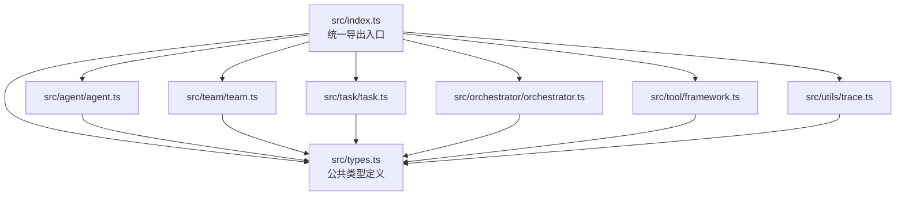
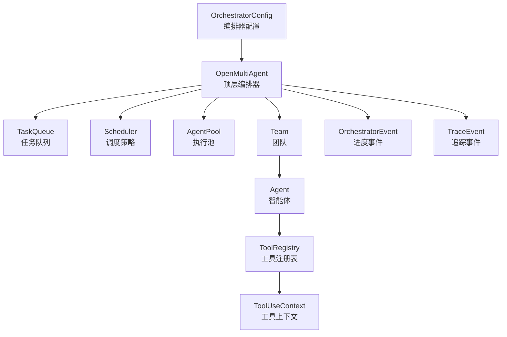
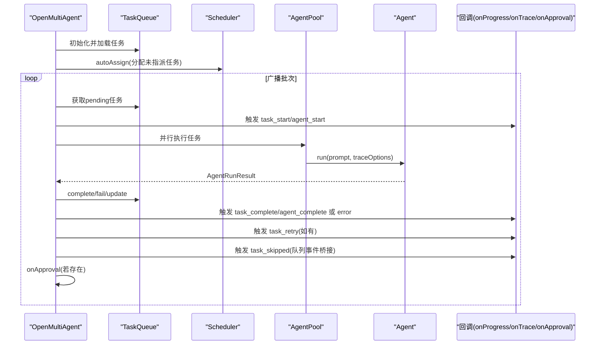
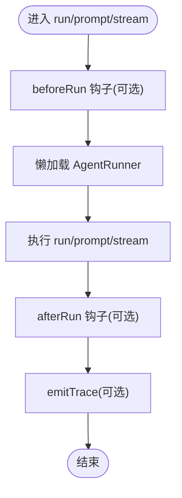
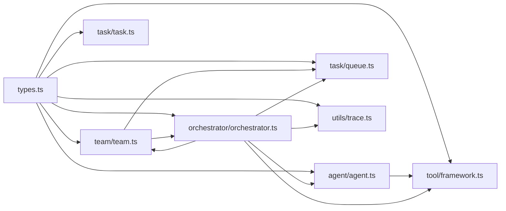

# 配置类型

<cite>
**本文档引用的文件**
- [src/types.ts](file://src/types.ts)
- [src/index.ts](file://src/index.ts)
- [src/agent/agent.ts](file://src/agent/agent.ts)
- [src/agent/runner.ts](file://src/agent/runner.ts)
- [src/team/team.ts](file://src/team/team.ts)
- [src/task/task.ts](file://src/task/task.ts)
- [src/task/queue.ts](file://src/task/queue.ts)
- [src/orchestrator/orchestrator.ts](file://src/orchestrator/orchestrator.ts)
- [src/tool/framework.ts](file://src/tool/framework.ts)
- [src/utils/trace.ts](file://src/utils/trace.ts)
- [examples/02-team-collaboration.ts](file://examples/02-team-collaboration.ts)
- [examples/11-trace-observability.ts](file://examples/11-trace-observability.ts)
- [package.json](file://package.json)
- [tsconfig.json](file://tsconfig.json)
</cite>

## 目录
1. [简介](#简介)
2. [项目结构](#项目结构)
3. [核心组件](#核心组件)
4. [架构总览](#架构总览)
5. [详细组件分析](#详细组件分析)
6. [依赖关系分析](#依赖关系分析)
7. [性能考量](#性能考量)
8. [故障排查指南](#故障排查指南)
9. [结论](#结论)
10. [附录](#附录)

## 简介
本文件为 Open Multi-Agent 框架的“配置类型”参考文档，覆盖所有公开类型定义与使用说明，包括：
- 配置接口：AgentConfig、TeamConfig、Task、OrchestratorConfig
- 回调函数类型：OnProgressCallback、OnTraceCallback、OnApprovalCallback
- 事件类型：OrchestratorEvent、TaskQueueEvent
- 工具相关类型：ToolDefinition、ToolResult、ToolUseContext
- 类型使用示例与类型安全最佳实践
- TypeScript 类型检查与类型推断指南

## 项目结构
框架采用“单模块导出”的设计，公共类型集中于 types.ts，并通过 index.ts 统一再导出，便于下游按需导入。

图表来源
- [src/index.ts:119-183](file://src/index.ts#L119-L183)
- [src/types.ts:1-543](file://src/types.ts#L1-L543)

章节来源
- [src/index.ts:119-183](file://src/index.ts#L119-L183)
- [src/types.ts:1-543](file://src/types.ts#L1-L543)

## 核心组件
本节对关键配置类型进行逐项说明，包括字段含义、数据类型、是否必需、默认值与取值范围。

- AgentConfig（单智能体静态配置）
  - name: 字符串；必需；智能体名称
  - model: 字符串；必需；模型标识
  - provider: 枚举；可选；支持 'anthropic' | 'copilot' | 'grok' | 'openai' | 'gemini'
  - baseURL: 字符串；可选；OpenAI 兼容 API 自定义基础地址
  - apiKey: 字符串；可选；API 密钥覆盖
  - systemPrompt: 字符串；可选；系统提示词
  - tools: 字符串数组；可选；允许使用的工具名列表
  - maxTurns: 数字；可选；最大对话轮次
  - maxTokens: 数字；可选；最大生成 token 数
  - temperature: 数字；可选；采样温度
  - timeoutMs: 数字；可选；整体运行超时（毫秒），用于本地模型兜底
  - loopDetection: LoopDetectionConfig；可选；循环检测配置
  - outputSchema: ZodSchema；可选；结构化输出模式，失败时自动重试一次
  - beforeRun: 钩子函数；可选；运行前钩子
  - afterRun: 钩子函数；可选；运行后钩子

- TeamConfig（团队静态配置）
  - name: 字符串；必需；团队名称
  - agents: AgentConfig 数组；必需；团队成员配置
  - sharedMemory: 布尔；可选；是否启用共享内存
  - maxConcurrency: 数字；可选；并发度限制

- Task（任务）
  - id: 字符串；必需；任务唯一标识
  - title: 字符串；必需；标题
  - description: 字符串；必需；描述
  - status: TaskStatus；必需；状态枚举
  - assignee: 字符串；可选；指派给的智能体名
  - dependsOn: 字符串数组；可选；前置任务 ID 列表
  - result: 字符串；可选；结果文本
  - createdAt: Date；必需；创建时间
  - updatedAt: Date；必需；更新时间
  - maxRetries: 数字；可选；最大重试次数（默认 0）
  - retryDelayMs: 数字；可选；首次重试延迟（默认 1000）
  - retryBackoff: 数字；可选；指数退避系数（默认 2）

- OrchestratorConfig（编排器顶层配置）
  - maxConcurrency: 数字；可选；全局并发度（默认 5）
  - defaultModel: 字符串；可选；默认模型
  - defaultProvider: 枚举；可选；默认提供商
  - defaultBaseURL: 字符串；可选；默认自定义基础地址
  - defaultApiKey: 字符串；可选；默认 API 密钥
  - onProgress: 回调；可选；进度事件回调
  - onTrace: 回调；可选；追踪事件回调
  - onApproval: 回调；可选；批次审批门控

章节来源
- [src/types.ts:194-241](file://src/types.ts#L194-L241)
- [src/types.ts:317-322](file://src/types.ts#L317-L322)
- [src/types.ts:340-358](file://src/types.ts#L340-L358)
- [src/types.ts:386-411](file://src/types.ts#L386-L411)

## 架构总览
下图展示配置类型在系统中的角色与交互：

图表来源
- [src/orchestrator/orchestrator.ts:514-541](file://src/orchestrator/orchestrator.ts#L514-L541)
- [src/team/team.ts:88-140](file://src/team/team.ts#L88-L140)
- [src/agent/agent.ts:81-114](file://src/agent/agent.ts#L81-L114)
- [src/tool/framework.ts:93-203](file://src/tool/framework.ts#L93-L203)
- [src/types.ts:370-383](file://src/types.ts#L370-L383)
- [src/types.ts:469-470](file://src/types.ts#L469-L470)

## 详细组件分析

### 配置接口详解

- AgentConfig
  - 作用：定义单个智能体的静态配置与行为边界
  - 关键点：
    - provider/baseURL/apiKey 支持覆盖与默认值注入
    - loopDetection 可启用循环检测
    - outputSchema 支持结构化输出与自动重试
    - 钩子函数 beforeRun/afterRun 提供运行期扩展点
  - 默认值与取值范围：
    - maxTurns/maxTokens/temperature：数值类型，具体范围由适配器决定
    - timeoutMs：毫秒正整数
    - loopDetection：可选对象，包含 maxRepetitions、loopDetectionWindow、onLoopDetected

- TeamConfig
  - 作用：定义团队成员、共享内存与并发度
  - 关键点：
    - agents 必须非空
    - sharedMemory 控制是否启用共享内存
    - maxConcurrency 影响任务并行度

- Task
  - 作用：表示可被编排的任务单元
  - 关键点：
    - dependsOn 决定拓扑顺序
    - 重试策略由 maxRetries/retryDelayMs/retryBackoff 控制
    - 状态机：pending → in_progress → completed|failed|blocked|skipped

- OrchestratorConfig
  - 作用：顶层编排器配置
  - 关键点：
    - onProgress/onTrace/onApproval 三类回调分别用于进度、可观测性与审批
    - defaultXxx 用于批量注入默认值

章节来源
- [src/types.ts:194-241](file://src/types.ts#L194-L241)
- [src/types.ts:317-322](file://src/types.ts#L317-L322)
- [src/types.ts:340-358](file://src/types.ts#L340-L358)
- [src/types.ts:386-411](file://src/types.ts#L386-L411)

### 回调函数类型

- OnProgressCallback
  - 签名：(event: OrchestratorEvent) => void
  - 参数：OrchestratorEvent
  - 说明：编排器运行期间的结构化进度事件流

- OnTraceCallback
  - 签名：(event: TraceEvent) => void | Promise<void>
  - 参数：TraceEvent
  - 说明：轻量级可观测性事件，包含 LLM 调用、工具执行、任务与智能体生命周期

- OnApprovalCallback
  - 签名：(completedTasks: readonly Task[], nextTasks: readonly Task[]) => Promise<boolean>
  - 参数：
    - completedTasks：本轮完成的任务集合
    - nextTasks：下一轮即将开始的任务集合
  - 返回：true 继续，false 中止并标记剩余任务为 skipped
  - 说明：批次间审批门控，避免无界执行

章节来源
- [src/types.ts:392-410](file://src/types.ts#L392-L410)
- [src/orchestrator/orchestrator.ts:287-295](file://src/orchestrator/orchestrator.ts#L287-L295)
- [src/orchestrator/orchestrator.ts:442-460](file://src/orchestrator/orchestrator.ts#L442-L460)
- [src/utils/trace.ts:12-27](file://src/utils/trace.ts#L12-L27)

### 事件类型定义

- OrchestratorEvent
  - 类型枚举：agent_start | agent_complete | task_start | task_complete | task_skipped | task_retry | message | error
  - 字段：
    - type: 事件类型
    - agent?: 智能体名
    - task?: 任务 ID
    - data?: 任意负载（根据事件类型语义不同）

- TaskQueueEvent
  - 类型枚举：task:ready | task:complete | task:failed | task:skipped | all:complete
  - 说明：任务队列发出的生命周期事件，Team 将其桥接为 OrchestratorEvent

章节来源
- [src/types.ts:370-383](file://src/types.ts#L370-L383)
- [src/task/queue.ts:17-31](file://src/task/queue.ts#L17-L31)
- [src/team/team.ts:110-139](file://src/team/team.ts#L110-L139)

### 工具相关类型

- ToolDefinition<TInput>
  - 结构：name/description/inputSchema(expects ZodSchema<TInput>)/execute
  - 用途：声明可注册的工具，输入经 Zod 校验后传入 execute

- ToolResult
  - 结构：data(string)/isError(boolean?)
  - 用途：工具执行返回值

- ToolUseContext
  - 结构：agent(TeamInfo)/team?(TeamInfo)/abortSignal/abortController/cwd/metadata
  - 用途：工具执行上下文，包含取消信号、工作目录与元数据

- AgentInfo/TeamInfo
  - 用途：在 ToolUseContext 中标识调用者身份

章节来源
- [src/types.ts:174-179](file://src/types.ts#L174-L179)
- [src/types.ts:163-166](file://src/types.ts#L163-L166)
- [src/types.ts:126-146](file://src/types.ts#L126-L146)
- [src/types.ts:149-160](file://src/types.ts#L149-L160)

### 类型使用示例与最佳实践

- 使用示例（来自示例文件）
  - 进度回调 onProgress：参见示例 02，演示如何处理 agent_start/agent_complete/task_start/task_complete/message/error 等事件
  - 追踪回调 onTrace：参见示例 11，演示如何处理 llm_call/tool_call/task/agent 四类 TraceEvent
  - 审批门控 onApproval：在编排器配置中提供，用于控制批次间继续执行

- 类型安全最佳实践
  - 使用 ZodSchema 作为 ToolDefinition 的 inputSchema，确保输入校验与类型推断
  - 在 AgentConfig.outputSchema 中启用结构化输出，配合自动重试提升稳定性
  - 使用 ToolUseContext.abortSignal/abortController 实现可取消的长任务
  - 对回调函数的错误进行隔离，避免影响主流程（框架已内置保护）

章节来源
- [examples/02-team-collaboration.ts:63-97](file://examples/02-team-collaboration.ts#L63-L97)
- [examples/11-trace-observability.ts:45-74](file://examples/11-trace-observability.ts#L45-L74)
- [src/orchestrator/orchestrator.ts:442-460](file://src/orchestrator/orchestrator.ts#L442-L460)
- [src/utils/trace.ts:12-27](file://src/utils/trace.ts#L12-L27)

### 处理逻辑与序列图

- 编排器执行队列（executeQueue）流程

图表来源
- [src/orchestrator/orchestrator.ts:280-464](file://src/orchestrator/orchestrator.ts#L280-L464)
- [src/team/team.ts:110-139](file://src/team/team.ts#L110-L139)

- 智能体运行与钩子流程

图表来源
- [src/agent/agent.ts:287-372](file://src/agent/agent.ts#L287-L372)
- [src/agent/runner.ts:79-102](file://src/agent/runner.ts#L79-L102)
- [src/utils/trace.ts:12-27](file://src/utils/trace.ts#L12-L27)

## 依赖关系分析

图表来源
- [src/types.ts:1-543](file://src/types.ts#L1-L543)
- [src/agent/agent.ts:26-45](file://src/agent/agent.ts#L26-L45)
- [src/team/team.ts:10-22](file://src/team/team.ts#L10-L22)
- [src/task/task.ts:9-10](file://src/task/task.ts#L9-L10)
- [src/task/queue.ts:9-10](file://src/task/queue.ts#L9-L10)
- [src/orchestrator/orchestrator.ts:44-65](file://src/orchestrator/orchestrator.ts#L44-L65)
- [src/tool/framework.ts:13-19](file://src/tool/framework.ts#L13-L19)
- [src/utils/trace.ts:5-6](file://src/utils/trace.ts#L5-L6)

章节来源
- [src/types.ts:1-543](file://src/types.ts#L1-L543)
- [src/index.ts:119-183](file://src/index.ts#L119-L183)

## 性能考量
- 并发与吞吐
  - OrchestratorConfig.maxConcurrency 控制全局并发度，默认 5
  - TeamConfig.maxConcurrency 控制团队内并发度
- 超时与稳定性
  - AgentConfig.timeoutMs 为单次运行设置硬上限，避免本地模型阻塞
  - Task 的重试策略（maxRetries/retryDelayMs/retryBackoff）降低偶发失败的影响
- 观测性与开销
  - onTrace 会带来额外的事件发射成本，建议仅在调试或生产监控需要时开启
  - emitTrace 对回调异常进行吞没，保证可观测性不影响主流程

## 故障排查指南
- 回调错误不中断执行
  - onTrace 回调的同步/异步错误均被吞没，避免可观测性导致崩溃
- 批次审批门控
  - onApproval 返回 false 会跳过剩余任务并标记为 skipped
- 循环检测
  - AgentConfig.loopDetection 可在重复工具调用或文本输出时触发警告或终止
- 任务依赖问题
  - 使用 validateTaskDependencies 检测未知依赖、自依赖与环形依赖
  - 使用 getTaskDependencyOrder 获取拓扑排序后的执行顺序

章节来源
- [src/utils/trace.ts:12-27](file://src/utils/trace.ts#L12-L27)
- [src/orchestrator/orchestrator.ts:442-460](file://src/orchestrator/orchestrator.ts#L442-L460)
- [src/types.ts:248-267](file://src/types.ts#L248-L267)
- [src/task/task.ts:184-239](file://src/task/task.ts#L184-L239)
- [src/task/task.ts:115-160](file://src/task/task.ts#L115-L160)

## 结论
本文档系统梳理了 Open Multi-Agent 框架的配置类型、回调与事件体系，以及工具与可观测性的集成方式。通过严格的类型约束与回调保护机制，框架在保证类型安全的同时提供了强大的扩展能力与运行时可见性。建议在生产环境中结合 onTrace 与 onProgress 进行可观测性建设，并合理配置并发与重试策略以获得稳定性能。

## 附录

### TypeScript 类型检查与类型推断指南
- 使用 defineTool 定义工具时，inputSchema 采用 ZodSchema<TInput>，可获得 execute 的输入类型自动推断
- 在 AgentConfig.outputSchema 中提供 ZodSchema，可使 AgentRunResult.structured 获得类型安全的解析结果
- 通过 ToolUseContext 的 abortSignal/abortController，实现工具执行的可取消性
- 在回调中使用类型守卫与模式匹配（switch）确保对事件类型的完备处理

章节来源
- [src/tool/framework.ts:71-83](file://src/tool/framework.ts#L71-L83)
- [src/agent/agent.ts:400-477](file://src/agent/agent.ts#L400-L477)
- [src/agent/runner.ts:79-102](file://src/agent/runner.ts#L79-L102)
- [examples/02-team-collaboration.ts:63-97](file://examples/02-team-collaboration.ts#L63-L97)
- [examples/11-trace-observability.ts:45-74](file://examples/11-trace-observability.ts#L45-L74)