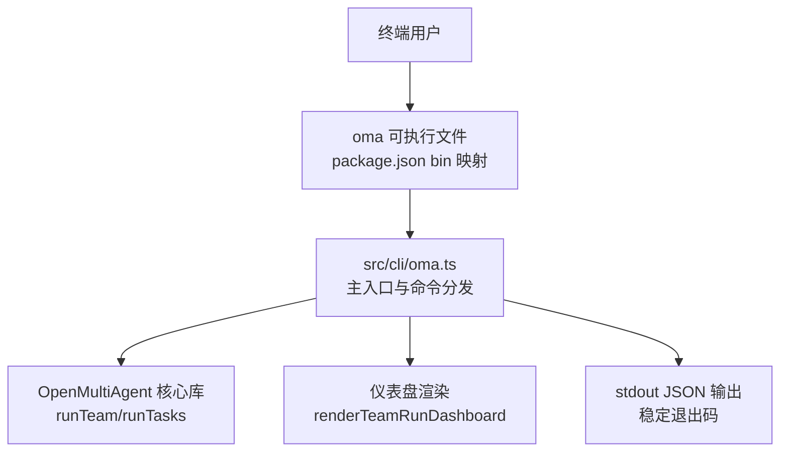
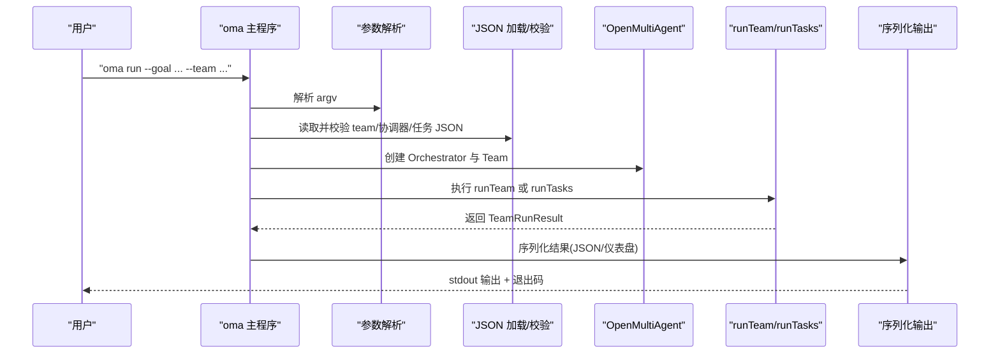
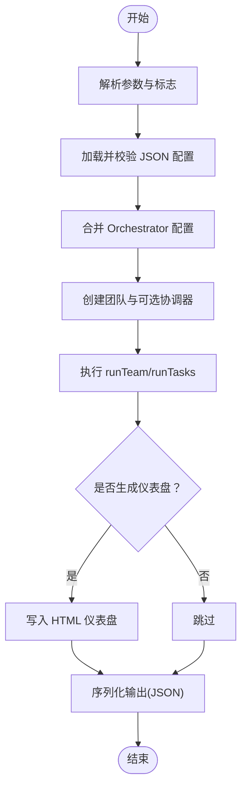
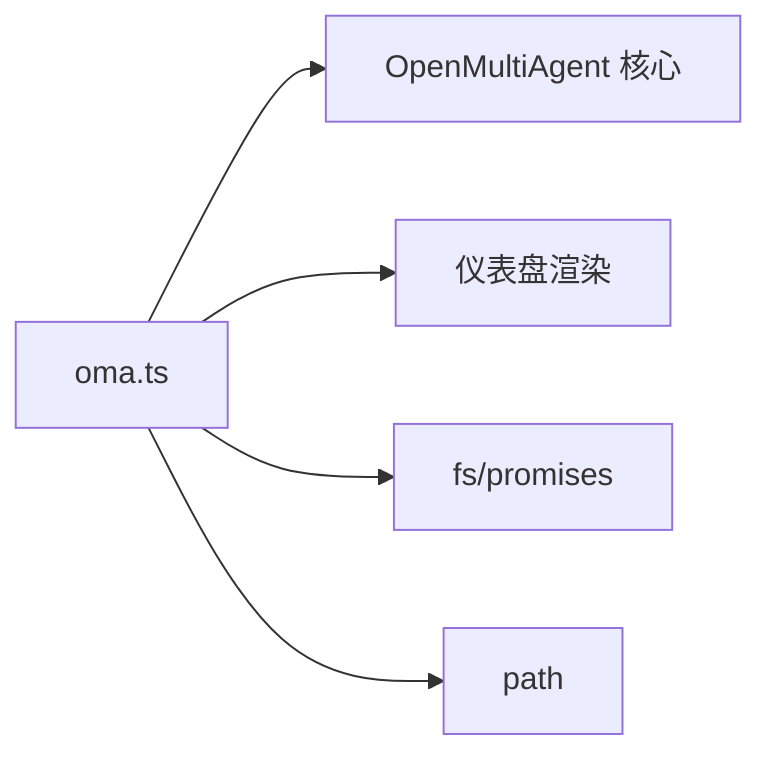

# CLI 工具

<cite>
**本文引用的文件**
- [oma.ts](file://src/cli/oma.ts)
- [cli.md](file://docs/cli.md)
- [package.json](file://package.json)
- [cli.test.ts](file://tests/cli.test.ts)
- [team-collaboration.ts](file://examples/basics/team-collaboration.ts)
- [azure-openai.ts](file://examples/providers/azure-openai.ts)
- [task-pipeline.ts](file://examples/basics/task-pipeline.ts)
- [news.json](file://examples/fixtures/competitive-monitoring/news.json)
- [incident-deploys.json](file://examples/fixtures/incident-deploys.json)
</cite>

## 目录
1. [简介](#简介)
2. [项目结构](#项目结构)
3. [核心组件](#核心组件)
4. [架构总览](#架构总览)
5. [详细组件分析](#详细组件分析)
6. [依赖关系分析](#依赖关系分析)
7. [性能考虑](#性能考虑)
8. [故障排除指南](#故障排除指南)
9. [结论](#结论)
10. [附录](#附录)

## 简介
本文件为 Open Multi-Agent 框架的命令行工具 oma 提供完整、可操作的使用与部署指南。oma 是一个面向 Shell 脚本与 CI 的轻量 CLI，提供稳定的 JSON 输出与退出码，专注于非交互式批处理运行。它不提供交互式会话、工作目录注入、人工审批或持久化能力；这些特性由应用代码保留。

 oma 支持以下主要命令：
- 运行团队任务（run）：基于目标自然语言描述，自动分解与并行执行
- 批量任务执行（task）：固定任务列表，无协调器分解
- 提供商辅助（provider）：列出支持的提供商、打印模板配置与环境变量提示

 oma 的输出为单行 JSON 文档，便于脚本解析；同时提供稳定退出码，便于自动化流程判断。

## 项目结构
oma CLI 位于 src/cli/oma.ts，通过 package.json 的 bin 字段注册为 oma 可执行文件。文档位于 docs/cli.md，测试位于 tests/cli.test.ts。示例与配置文件位于 examples/ 与 examples/fixtures/。

图表来源
- [oma.ts:355-463](file://src/cli/oma.ts#L355-L463)
- [package.json:17-19](file://package.json#L17-L19)

章节来源
- [oma.ts:1-491](file://src/cli/oma.ts#L1-L491)
- [cli.md:1-266](file://docs/cli.md#L1-L266)
- [package.json:17-19](file://package.json#L17-L19)

## 核心组件
- 命令解析与参数处理：支持长选项、键值对与布尔标志，兼容 getopts 风格的值绑定。
- 配置文件解析与校验：严格校验 TeamConfig、CoordinatorConfig、OrchestratorConfig 与任务数组的结构与字段类型。
- 运行时序列：根据命令加载配置、创建团队、执行 runTeam 或 runTasks，并输出标准化 JSON。
- 错误分类与退出码：区分使用错误、校验错误、I/O 错误与运行时错误，返回稳定退出码。
- 输出控制：支持美化输出与包含消息数组两种模式；可选生成团队运行仪表盘 HTML 文件。

章节来源
- [oma.ts:77-112](file://src/cli/oma.ts#L77-L112)
- [oma.ts:136-173](file://src/cli/oma.ts#L136-L173)
- [oma.ts:355-463](file://src/cli/oma.ts#L355-L463)
- [cli.test.ts:10-70](file://tests/cli.test.ts#L10-L70)

## 架构总览
oma CLI 的调用链路如下：

图表来源
- [oma.ts:355-463](file://src/cli/oma.ts#L355-L463)

## 详细组件分析

### 命令与参数
- 全局标志
  - --pretty：美化输出 JSON
  - --include-messages：在 agent 结果中包含完整消息数组（较大）
  - --dashboard：生成团队运行 DAG 仪表盘 HTML 文件
- 子命令
  - run：执行团队任务分解与并行执行
  - task：执行固定任务列表
  - provider：列出提供商或输出模板配置

章节来源
- [cli.md:29-74](file://docs/cli.md#L29-L74)
- [oma.ts:260-280](file://src/cli/oma.ts#L260-L280)

### 参数解析与优先级
- 参数格式
  - 长选项：--goal、--team、--file 等
  - 键值对：--team=./team.json
  - 布尔标志：--pretty、--include-messages 不带值
- 优先级
  - 外部任务文件中的 team 对象可被 --team 覆盖
  - 协调器配置文件（--coordinator）与团队文件中的协调器片段按顺序合并
  - Orchestrator 配置片段从团队文件与外部文件按顺序合并，后者覆盖前者

章节来源
- [cli.md:252-258](file://docs/cli.md#L252-L258)
- [oma.ts:395-404](file://src/cli/oma.ts#L395-L404)
- [oma.ts:437-439](file://src/cli/oma.ts#L437-L439)
- [oma.ts:338-344](file://src/cli/oma.ts#L338-L344)

### 配置文件格式与校验
- Team 文件
  - 支持两种形式：纯 TeamConfig 或 { team, orchestrator } 组合
  - 校验规则：根对象或 team 必须为对象；team.name 非空字符串；team.agents 非空数组且每个 agent 含非空 name 与 model
  - SDK 专用字段（如 sharedMemoryStore）不可从 JSON 设置
- 任务文件
  - 包含 orchestrator（可选）、team、tasks 数组
  - tasks 中每项需包含 title 与 description；可选 assignee、dependsOn、memoryScope、重试参数
  - 任务依赖使用标题字符串而非内部 ID
- 协调器与编排器 JSON
  - 任意 JSON 对象，仅支持可序列化配置；函数型回调不支持

章节来源
- [cli.md:77-173](file://docs/cli.md#L77-L173)
- [oma.ts:136-173](file://src/cli/oma.ts#L136-L173)
- [oma.ts:175-220](file://src/cli/oma.ts#L175-L220)

### 运行流程与序列
- run 流程
  - 读取并合并 Orchestrator 配置
  - 创建团队并可选传入 CoordinatorConfig
  - 执行 runTeam 并可选生成仪表盘
  - 序列化输出并返回成功/失败状态
- task 流程
  - 读取 tasks 与 team（可被 --team 覆盖）
  - 执行 runTasks 并序列化输出

图表来源
- [oma.ts:374-453](file://src/cli/oma.ts#L374-L453)

章节来源
- [oma.ts:374-453](file://src/cli/oma.ts#L374-L453)

### 错误处理与退出码
- 使用错误（2）：缺少必要参数、未知命令、文件不存在/权限不足
- 校验错误（2）：JSON 语法错误、配置结构不符合要求
- I/O 错误（2）：文件访问异常
- 运行时错误（3）：典型 LLM/API 抛出的未捕获异常
- 成功（0）：run/task 完成且 success 为真；help/provider 正常完成

章节来源
- [cli.md:228-236](file://docs/cli.md#L228-L236)
- [oma.ts:465-470](file://src/cli/oma.ts#L465-L470)

### 输出格式
- 成功输出：包含 command、success、totalTokenUsage、agentResults 等字段
- 错误输出：包含 error.kind 与 message
- 可选包含 agent 的 messages 数组（--include-messages）

章节来源
- [cli.md:175-225](file://docs/cli.md#L175-L225)
- [oma.ts:227-253](file://src/cli/oma.ts#L227-L253)

### 提供商辅助（provider）
- 列表：打印内置提供商 ID、API 密钥环境变量名、是否支持 baseURL、简要说明
- 模板：<provider> 输出示例 orchestrator/agent 字段与占位 env，用于快速搭建配置

章节来源
- [cli.md:60-70](file://docs/cli.md#L60-L70)
- [oma.ts:295-336](file://src/cli/oma.ts#L295-L336)

## 依赖关系分析
oma CLI 作为独立可执行文件，依赖于核心库的运行时接口与仪表盘渲染模块。其直接依赖包括：
- OpenMultiAgent 核心运行时
- 仪表盘渲染器
- Node.js 内置文件系统与路径模块

图表来源
- [oma.ts:13-21](file://src/cli/oma.ts#L13-L21)
- [oma.ts:346-353](file://src/cli/oma.ts#L346-L353)

章节来源
- [oma.ts:13-21](file://src/cli/oma.ts#L13-L21)
- [oma.ts:346-353](file://src/cli/oma.ts#L346-L353)

## 性能考虑
- 并发与资源
  - 通过 OrchestratorConfig 的并发参数控制并行度，避免过度并发导致 API 限流或资源争用
  - 在 CI 环境中建议适度降低并发，提升稳定性
- 输出体积
  - 默认不包含 messages；仅在需要调试时启用 --include-messages
- 仪表盘生成
  - 仪表盘 HTML 依赖网络资源，建议在离线环境自行托管或内联资源
- 日志与进度
  - CLI 无单独进度流；如需丰富遥测，请使用 TypeScript API 的事件回调

章节来源
- [cli.md:224-225](file://docs/cli.md#L224-L225)
- [cli.md:35-37](file://docs/cli.md#L35-L37)

## 故障排除指南
- 常见问题
  - 缺少必要参数：检查 --goal 与 --team 是否正确传递
  - JSON 无效：确认 JSON 语法与结构符合要求
  - 文件访问错误：检查文件路径与权限
  - API 密钥缺失：根据 provider 模板设置相应环境变量
- 诊断步骤
  - 使用 --pretty 查看结构化输出
  - 使用 --include-messages 获取完整消息数组进行定位
  - 使用 provider list/template 快速核对配置
- 退出码对照
  - 0：成功
  - 1：运行报告失败（需检查 result.json）
  - 2：输入/文件问题
  - 3：未预期错误（LLM/API 异常）

章节来源
- [cli.md:228-249](file://docs/cli.md#L228-L249)
- [oma.ts:465-470](file://src/cli/oma.ts#L465-L470)

## 结论
oma CLI 为 Open Multi-Agent 框架提供了简洁、可靠、可自动化集成的命令行入口。通过严格的配置校验、稳定的输出与退出码以及丰富的提供商辅助功能，它能够满足本地开发测试、CI/CD 集成与批量任务执行等多种场景的需求。建议在生产环境中结合并发控制、日志与仪表盘策略，确保稳定性与可观测性。

## 附录

### 常见使用场景与示例

- 本地开发测试
  - 使用 run 命令快速验证团队配置与目标分解
  - 示例：参考示例脚本与注释，设置所需 API 密钥后运行
  - 参考示例
    - [team-collaboration.ts:1-168](file://examples/basics/team-collaboration.ts#L1-L168)
    - [azure-openai.ts:1-180](file://examples/providers/azure-openai.ts#L1-L180)

- CI/CD 集成
  - 将 oma run/task 作为流水线步骤，解析 stdout JSON 并根据退出码判定成功/失败
  - 参考脚本风格与退出码处理
    - [cli.md:239-248](file://docs/cli.md#L239-L248)

- 批量任务执行
  - 使用 task 命令执行固定任务列表，支持依赖与重试参数
  - 参考示例
    - [task-pipeline.ts:169-207](file://examples/basics/task-pipeline.ts#L169-L207)

- 配置文件示例
  - Team 文件（纯 TeamConfig 与组合形式）
    - [cli.md:81-118](file://docs/cli.md#L81-L118)
  - 任务文件
    - [cli.md:130-161](file://docs/cli.md#L130-L161)
  - 示例数据集（用于任务输入）
    - [news.json:1-63](file://examples/fixtures/competitive-monitoring/news.json#L1-L63)
    - [incident-deploys.json:1-55](file://examples/fixtures/incident-deploys.json#L1-L55)

### 命令参考与示例

- 基本用法
  - 查看帮助：oma help
  - 运行团队任务：oma run --goal "<目标>" --team "<team.json>" [--orchestrator "<orch.json>"] [--coordinator "<coord.json>"] [--pretty] [--include-messages] [--dashboard]
  - 批量任务：oma task --file "<tasks.json>" [--team "<team.json>"] [--pretty] [--include-messages]
  - 提供商辅助：oma provider list | oma provider template <provider> [--pretty]

- 输出与退出码
  - 成功输出：包含 command、success、totalTokenUsage、agentResults
  - 错误输出：包含 error.kind 与 message
  - 退出码：0 成功；1 运行失败；2 使用/校验/I/O；3 内部错误

章节来源
- [cli.md:29-74](file://docs/cli.md#L29-L74)
- [cli.md:175-236](file://docs/cli.md#L175-L236)