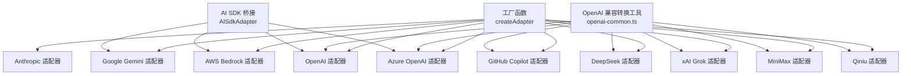
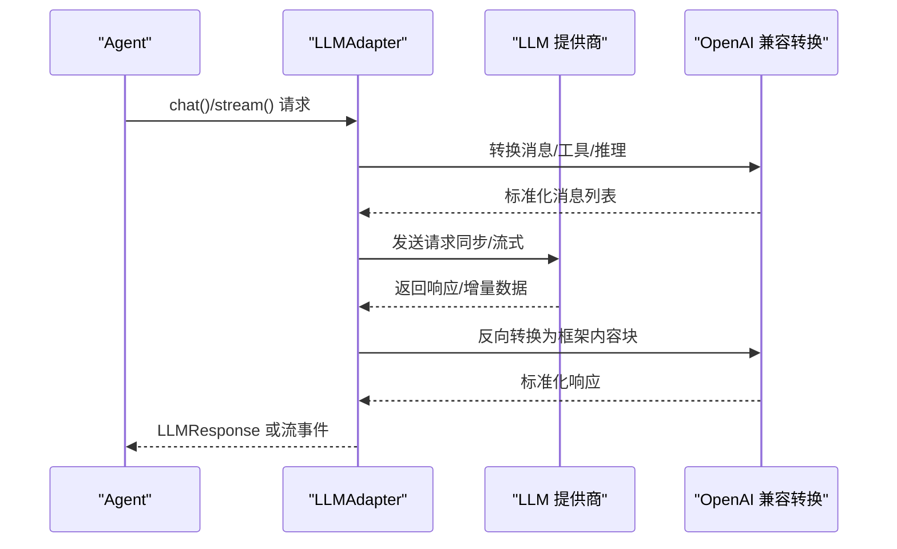
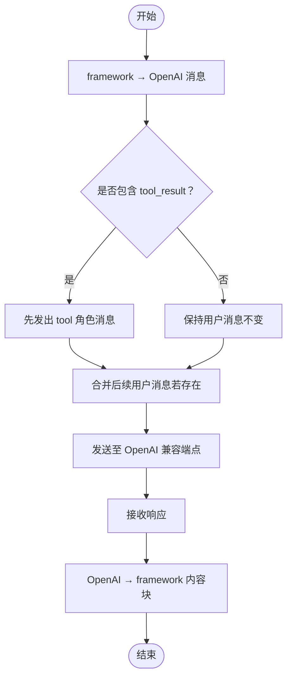
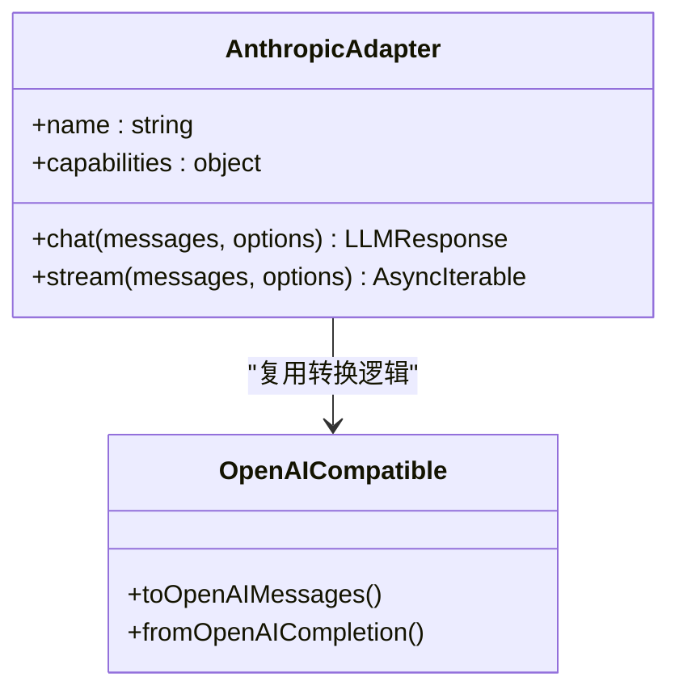
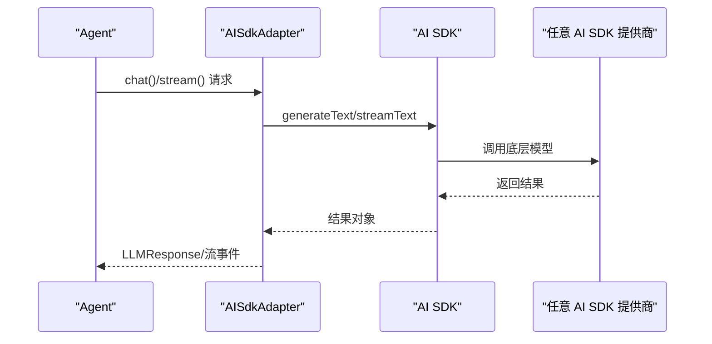
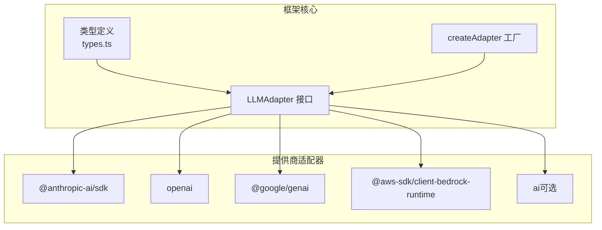

# LLM 适配器

<cite>
**本文档引用的文件**
- [adapter.ts](file://src/llm/adapter.ts)
- [openai-common.ts](file://src/llm/openai-common.ts)
- [ai-sdk.ts](file://src/llm/ai-sdk.ts)
- [anthropic.ts](file://src/llm/anthropic.ts)
- [openai.ts](file://src/llm/openai.ts)
- [gemini.ts](file://src/llm/gemini.ts)
- [azure-openai.ts](file://src/llm/azure-openai.ts)
- [copilot.ts](file://src/llm/copilot.ts)
- [bedrock.ts](file://src/llm/bedrock.ts)
- [deepseek.ts](file://src/llm/deepseek.ts)
- [grok.ts](file://src/llm/grok.ts)
- [minimax.ts](file://src/llm/minimax.ts)
- [qiniu.ts](file://src/llm/qiniu.ts)
- [README.md](file://README.md)
</cite>

## 目录
1. [简介](#简介)
2. [项目结构](#项目结构)
3. [核心组件](#核心组件)
4. [架构总览](#架构总览)
5. [详细组件分析](#详细组件分析)
6. [依赖关系分析](#依赖关系分析)
7. [性能考虑](#性能考虑)
8. [故障排除指南](#故障排除指南)
9. [结论](#结论)
10. [附录](#附录)

## 简介
本文件面向 Open Multi-Agent 框架的 LLM 适配器系统，系统性阐述适配器架构设计、统一接口抽象与各提供商实现细节。文档覆盖以下方面：
- 统一接口与工厂模式：通过统一的 LLMAdapter 接口屏蔽不同提供商差异，使用工厂函数按提供商类型动态加载具体实现。
- 支持的提供商：Anthropic Claude、OpenAI、Google Gemini、Azure OpenAI、AWS Bedrock、GitHub Copilot、xAI Grok、DeepSeek、MiniMax、Qiniu。
- OpenAI 兼容端点：Ollama、vLLM、LM Studio、OpenRouter、Groq 等本地与第三方服务。
- Vercel AI SDK 集成：通过 AISdkAdapter 桥接 AI SDK 的语言模型，实现跨生态提供商统一调用。
- 混合团队配置：在同一团队中混用多种提供商，实现多模型协同。
- 故障排除与性能优化：常见问题定位、错误处理策略与性能建议。

## 项目结构
适配器系统位于 src/llm 目录，采用“按提供商分模块”的组织方式，每个提供商一个独立文件，公共转换逻辑集中在 openai-common.ts 中；ai-sdk.ts 提供 Vercel AI SDK 桥接能力；adapter.ts 是统一工厂入口。

**图表来源**
- [adapter.ts:72-131](file://src/llm/adapter.ts#L72-L131)
- [openai-common.ts:1-426](file://src/llm/openai-common.ts#L1-L426)
- [ai-sdk.ts:186-353](file://src/llm/ai-sdk.ts#L186-L353)

**章节来源**
- [adapter.ts:1-132](file://src/llm/adapter.ts#L1-L132)
- [README.md:273-292](file://README.md#L273-L292)

## 核心组件
- 工厂函数 createAdapter：根据提供商字符串返回对应适配器实例，支持懒加载以减少安装负担。
- LLMAdapter 接口族：统一 chat() 同步请求与 stream() 流式输出，定义内容块、消息、响应与流事件等类型。
- OpenAI 兼容层：统一处理 OpenAI 家族（含 Azure OpenAI、Copilot、DeepSeek、Grok、MiniMax、Qiniu）的消息格式转换、工具调用与推理文本回放。
- AI SDK 桥接：AISdkAdapter 将框架消息映射到 AI SDK 的 ModelMessage，并桥接 generateText/streamText。

**章节来源**
- [adapter.ts:34-131](file://src/llm/adapter.ts#L34-L131)
- [openai-common.ts:9-426](file://src/llm/openai-common.ts#L9-L426)
- [ai-sdk.ts:186-353](file://src/llm/ai-sdk.ts#L186-L353)

## 架构总览
下图展示从 Agent 到 LLM 的调用链路与适配器交互：

**图表来源**
- [openai-common.ts:148-385](file://src/llm/openai-common.ts#L148-L385)
- [openai.ts:101-325](file://src/llm/openai.ts#L101-L325)
- [anthropic.ts:327-517](file://src/llm/anthropic.ts#L327-L517)
- [gemini.ts:392-502](file://src/llm/gemini.ts#L392-L502)
- [bedrock.ts:244-421](file://src/llm/bedrock.ts#L244-L421)

## 详细组件分析

### 工厂与统一接口
- 支持提供商集合：anthropic、azure-openai、bedrock、copilot、deepseek、grok、minimax、openai、gemini、qiniu。
- 环境变量回退策略：各适配器优先使用构造参数，其次读取对应环境变量；部分提供商（如 Bedrock）无需 API Key，凭 AWS 凭证链认证。
- OpenAI 兼容 baseURL：当 provider 为 openai 且传入 baseURL 时，可接入 Ollama、vLLM、LM Studio、OpenRouter、Groq 等本地或第三方兼容端点。
- 惰性加载：仅在请求特定提供商时才动态导入对应模块，避免不必要的依赖。

**章节来源**
- [adapter.ts:42-131](file://src/llm/adapter.ts#L42-L131)

### OpenAI 兼容转换层
- 输入转换：framework 消息 → OpenAI 消息数组；处理 mixed user 内容（tool_result + text/image），严格遵循 OpenAI 的工具调用顺序约束。
- 输出转换：OpenAI 响应 → framework 内容块；解析 tool_calls，必要时从文本提取工具调用；finish_reason 归一化。
- 推理文本回放：可选将 reasoning 块以 <thinking> 文本形式回放到请求中，便于某些模型正确处理。

**图表来源**
- [openai-common.ts:148-186](file://src/llm/openai-common.ts#L148-L186)
- [openai-common.ts:299-385](file://src/llm/openai-common.ts#L299-L385)

**章节来源**
- [openai-common.ts:53-385](file://src/llm/openai-common.ts#L53-L385)

### Anthropic Claude 适配器
- 特性：原生支持 reasoning 回声（signature/红名单），严格校验思考签名以维持多轮扩展思考对话。
- 输入转换：framework 内容块 → Anthropic ContentBlockParam；drop 不支持的块类型。
- 输出转换：Anthropic ContentBlock → framework 内容块；保留 signature 以便下轮继续。
- 思维预算：支持手动模式的 thinking.budgetTokens 参数校验与约束。

**图表来源**
- [anthropic.ts:300-518](file://src/llm/anthropic.ts#L300-L518)
- [openai-common.ts:148-385](file://src/llm/openai-common.ts#L148-L385)

**章节来源**
- [anthropic.ts:24-518](file://src/llm/anthropic.ts#L24-L518)

### OpenAI 适配器
- 特性：标准 OpenAI Chat Completions 协议；推理输入不被接受，需通过 reasoning 文本回放。
- 输入/输出：使用 openai-common 的转换函数；支持 parallel_tool_calls、min_p、reasoning_effort 等参数。
- 流式处理：累积增量文本与工具调用参数，最终生成完整响应。

**章节来源**
- [openai.ts:33-326](file://src/llm/openai.ts#L33-L326)
- [openai-common.ts:148-385](file://src/llm/openai-common.ts#L148-L385)

### Google Gemini 适配器
- 特性：使用 @google/genai SDK；支持 reasoning 回声（带 thoughtSignature）。
- 输入/输出：framework → Gemini Content.parts；识别 functionCall/functionResponse/part 类型；生成稳定伪 ID 补齐缺失的调用 ID。
- 思维配置：支持 includeThoughts 与 thinkingBudget。

**章节来源**
- [gemini.ts:28-503](file://src/llm/gemini.ts#L28-L503)

### Azure OpenAI 适配器
- 特性：基于 AzureOpenAI 客户端；部署名（deployment name）与 API 版本管理。
- 输入/输出：复用 OpenAI 兼容转换；部署名解析失败时抛出明确错误。
- 参数限制：Azure 托管端点不接受 top_k/min_p，已显式排除。

**章节来源**
- [azure-openai.ts:41-335](file://src/llm/azure-openai.ts#L41-L335)

### GitHub Copilot 适配器
- 特性：通过 OpenAI 兼容端点访问；支持交互式 OAuth2 设备码流程换取 GitHub Token，再换取短期 Copilot Session Token。
- 输入/输出：复用 OpenAI 兼容转换；支持 reasoning_effort。
- 成本倍数：内置模型乘数查询与格式化显示。

**章节来源**
- [copilot.ts:27-564](file://src/llm/copilot.ts#L27-L564)

### AWS Bedrock 适配器
- 特性：统一 Converse/ConverseStream API，支持 Claude、Llama、Mistral、Cohere、Titan 等多模型家族。
- 输入/输出：framework → Bedrock ContentBlock；reasoning 在当前版本不参与回声（保留为 never）。
- 推理与工具：推理内容与工具调用在流式过程中分别缓冲与拼接。

**章节来源**
- [bedrock.ts:28-421](file://src/llm/bedrock.ts#L28-L421)

### OpenAI 兼容提供商（薄封装）
- DeepSeek：默认 baseURL = https://api.deepseek.com/v1，环境变量 DEEPSEEK_API_KEY。
- Grok：默认 baseURL = https://api.x.ai/v1，环境变量 XAI_API_KEY。
- MiniMax：默认 baseURL = https://api.minimax.io/v1，环境变量 MINIMAX_API_KEY/ MINIMAX_BASE_URL。
- Qiniu：默认 baseURL = https://api.qnaigc.com/v1，环境变量 QINIU_API_KEY。

**章节来源**
- [deepseek.ts:8-29](file://src/llm/deepseek.ts#L8-L29)
- [grok.ts:8-29](file://src/llm/grok.ts#L8-L29)
- [minimax.ts:8-29](file://src/llm/minimax.ts#L8-L29)
- [qiniu.ts:8-29](file://src/llm/qiniu.ts#L8-L29)

### Vercel AI SDK 集成
- 适用场景：需要使用 AI SDK 的任意提供商（60+ 模型与主机），或希望在前端/Next.js 中结合 OMA 的 runTeam 与 AI SDK 的 useChat。
- 实现方式：AISdkAdapter 将框架消息映射为 AI SDK 的 ModelMessage，调用 generateText/streamText，并将结果映射回框架响应。
- 注意事项：当 AgentConfig 设置 adapter 时，忽略 provider、apiKey、baseURL、region；混合团队中仅设置 adapter 的代理使用 AI SDK。

**图表来源**
- [ai-sdk.ts:210-352](file://src/llm/ai-sdk.ts#L210-L352)

**章节来源**
- [ai-sdk.ts:1-368](file://src/llm/ai-sdk.ts#L1-L368)
- [README.md:294-315](file://README.md#L294-L315)

## 依赖关系分析
- 低耦合高内聚：各提供商适配器独立，仅共享 openai-common 的转换逻辑。
- 外部依赖：
  - @anthropic-ai/sdk（Anthropic）
  - openai（OpenAI/Azure/Copilot/DeepSeek/Grok/MiniMax/Qiniu）
  - @google/genai（Gemini）
  - @aws-sdk/client-bedrock-runtime（Bedrock）
  - ai（可选，用于 AI SDK 桥接）

**图表来源**
- [adapter.ts:34-131](file://src/llm/adapter.ts#L34-L131)
- [anthropic.ts:24-38](file://src/llm/anthropic.ts#L24-L38)
- [openai.ts:33-51](file://src/llm/openai.ts#L33-L51)
- [gemini.ts:28-52](file://src/llm/gemini.ts#L28-L52)
- [bedrock.ts:28-40](file://src/llm/bedrock.ts#L28-L40)
- [ai-sdk.ts:9-24](file://src/llm/ai-sdk.ts#L9-L24)

**章节来源**
- [adapter.ts:34-131](file://src/llm/adapter.ts#L34-L131)

## 性能考虑
- 流式优先：在长对话与工具调用密集场景，优先使用 stream() 获取增量输出，降低首字延迟。
- 工具调用批量化：合理设置 parallel_tool_calls（OpenAI 家族）与并发工具调用策略，提升吞吐。
- 上下文控制：通过 maxTokens、topP、temperature 等采样参数平衡质量与成本；配合上下文策略（滑动窗口/摘要/压缩）控制长度。
- 连接与超时：为长连接与网络抖动准备合理的超时与重试策略；AbortSignal 用于取消长时间运行的请求。
- 混合团队：在团队中按任务特性选择最优提供商，避免跨提供商频繁切换带来的额外开销。

## 故障排除指南
- 认证失败
  - Anthropic：检查 ANTHROPIC_API_KEY 是否正确设置。
  - OpenAI/Azure/Copilot/DeepSeek/Grok/MiniMax/Qiniu：确认对应 API Key 环境变量；Azure 需要 AZURE_OPENAI_API_KEY、AZURE_OPENAI_ENDPOINT、AZURE_OPENAI_API_VERSION。
  - Bedrock：确保 AWS 凭证链可用（环境变量、共享配置、IAM 角色），region 正确。
- Azure 部署名错误：当 provider 为 azure-openai 且未在 model 字段提供部署名时，会抛出明确错误；请设置 agent.model 为部署名称或 AZURE_OPENAI_DEPLOYMENT。
- 推理输入不生效
  - OpenAI/Azure/Copilot/DeepSeek/Grok/MiniMax/Qiniu：这些提供商不接受 reasoning 输入，需启用 reasoning 文本回放（见 openai-common 的回放选项）。
  - Anthropic/Gemini：支持原生 reasoning 回声，但需携带 signature；请确保上轮输出包含 signature 并在本轮正确传递。
- 工具调用解析异常
  - 若模型返回的 tool_calls JSON 不完整或格式错误，适配器会尝试从文本中提取工具调用；若仍失败，请检查工具定义与模型指令。
- 流式断连
  - Bedrock/Gemini/OpenAI：注意流式过程中的 usage 仅在最终块出现；若中途断连，需重新发起请求。
- Copilot 登录
  - 若未设置 GITHUB_COPILOT_TOKEN/GITHUB_TOKEN，将触发交互式设备码登录流程；请按提示完成授权。

**章节来源**
- [anthropic.ts:265-288](file://src/llm/anthropic.ts#L265-L288)
- [azure-openai.ts:72-84](file://src/llm/azure-openai.ts#L72-L84)
- [openai-common.ts:31-120](file://src/llm/openai-common.ts#L31-L120)
- [copilot.ts:109-169](file://src/llm/copilot.ts#L109-L169)

## 结论
本适配器系统通过统一接口与工厂模式，实现了对多家 LLM 提供商的一致抽象；借助 OpenAI 兼容层与 AI SDK 桥接，既覆盖主流云厂商与开源生态，又支持本地与第三方兼容端点。推荐在生产环境中结合流式输出、上下文控制与工具调用策略，实现高质量与低成本的多模型协作。

## 附录

### 配置清单与最佳实践
- 通用配置
  - provider：指定提供商（anthropic、openai、azure-openai、gemini、copilot、grok、deepseek、minimax、qiniu、bedrock）。
  - apiKey/baseURL/region：按提供商与部署方式设置；OpenAI 兼容端点通过 baseURL 指定。
  - model：各提供商模型名称；Azure 需填入部署名而非底层模型名。
  - systemPrompt：系统提示词；OpenAI 家族通过 prepend system 消息注入。
  - 采样参数：maxTokens、temperature、topP、topK、frequencyPenalty、presencePenalty、minP（OpenAI 家族）、parallel_tool_calls（OpenAI 家族）、thinking.effort（OpenAI 家族）。
- 最佳实践
  - 使用流式输出以获得更低首字延迟与更好的可观测性。
  - 对工具调用进行白名单与参数校验，避免模型误报。
  - 在团队中按任务特性混用提供商，例如推理强的模型搭配工具丰富的模型。
  - 为长对话启用上下文压缩与摘要策略，防止超出上下文窗口。

**章节来源**
- [README.md:273-315](file://README.md#L273-L315)
- [adapter.ts:42-131](file://src/llm/adapter.ts#L42-L131)