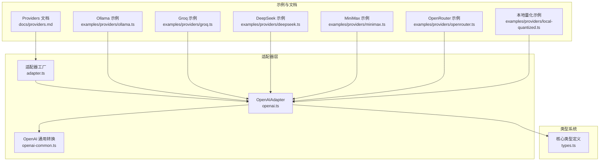
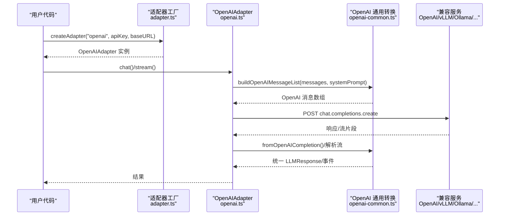
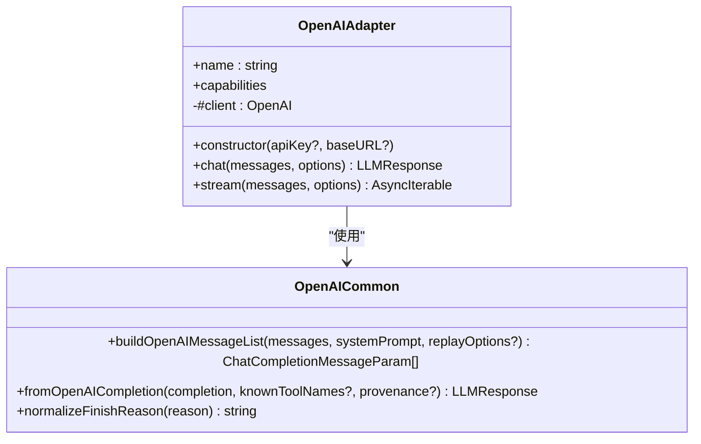
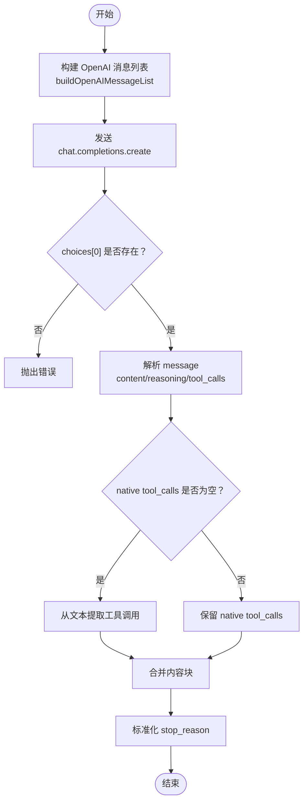
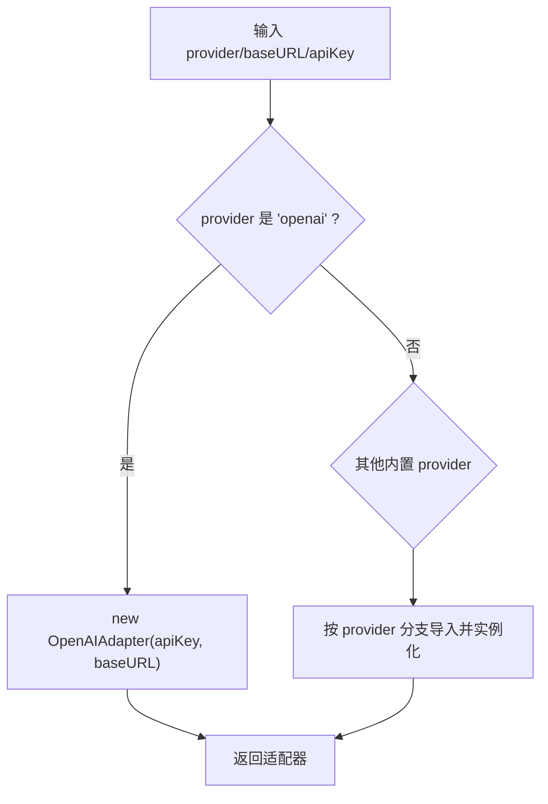
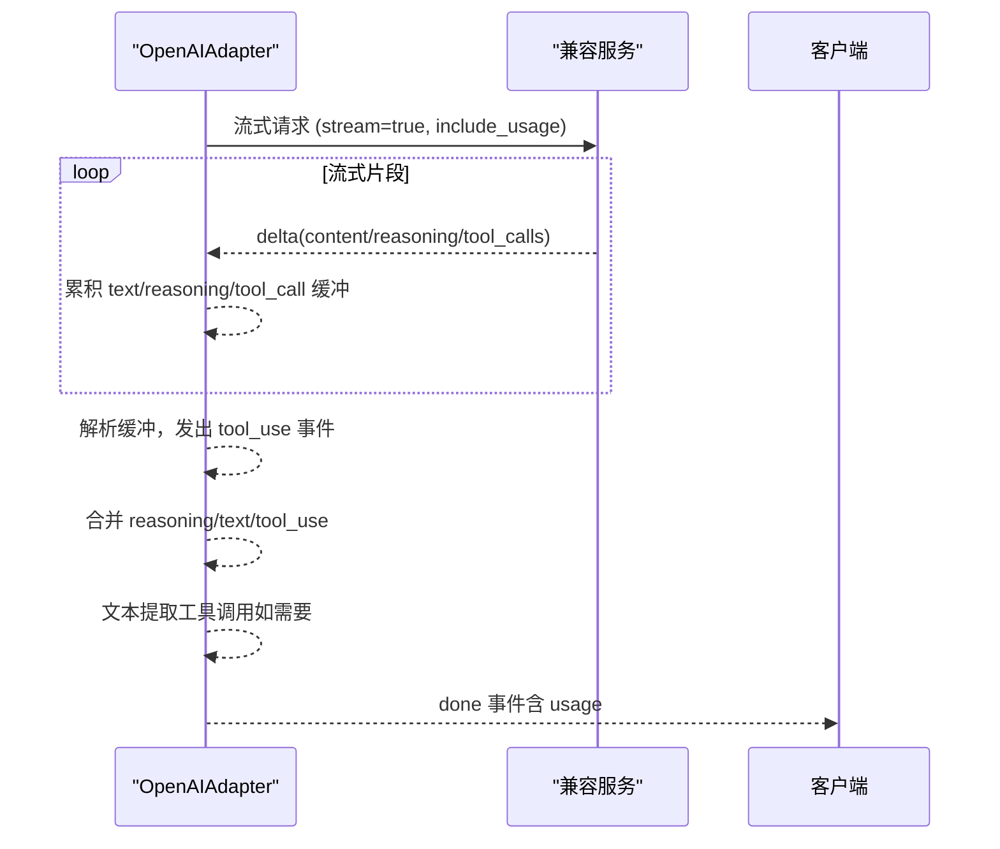
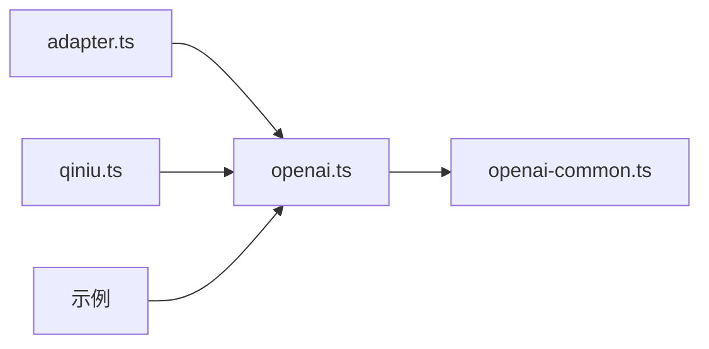

# OpenAI 兼容端点

<cite>
**本文引用的文件**
- [openai.ts](file://src/llm/openai.ts)
- [openai-common.ts](file://src/llm/openai-common.ts)
- [adapter.ts](file://src/llm/adapter.ts)
- [types.ts](file://src/types.ts)
- [ollama.ts 示例](file://examples/providers/ollama.ts)
- [groq.ts 示例](file://examples/providers/groq.ts)
- [deepseek.ts 示例](file://examples/providers/deepseek.ts)
- [minimax.ts 示例](file://examples/providers/minimax.ts)
- [openrouter.ts 示例](file://examples/providers/openrouter.ts)
- [local-quantized.ts 示例](file://examples/providers/local-quantized.ts)
- [providers.md 文档](file://docs/providers.md)
- [qiniu.ts 适配器](file://src/llm/qiniu.ts)
- [errors.ts 错误类型](file://src/errors.ts)
</cite>

## 目录
1. [简介](#简介)
2. [项目结构与核心组件](#项目结构与核心组件)
3. [架构总览](#架构总览)
4. [详细组件解析](#详细组件解析)
5. [依赖关系分析](#依赖关系分析)
6. [性能与优化建议](#性能与优化建议)
7. [故障排除指南](#故障排除指南)
8. [结论](#结论)
9. [附录：配置示例与最佳实践](#附录配置示例与最佳实践)

## 简介
本章节面向希望在 Open Multi-Agent 框架中使用 OpenAI 兼容端点（如 Ollama、vLLM、LM Studio、OpenRouter、Groq、DeepSeek、MiniMax 等）的用户，系统讲解如何通过 provider='openai' 与 baseURL 参数对接本地或第三方 OpenAI 兼容服务；说明模型名称映射、流式处理、工具调用与结构化输出的支持现状；并提供性能优化与故障排除建议。

## 项目结构与核心组件
- OpenAI 兼容适配器位于 LLM 子系统，负责将框架内部消息格式转换为 OpenAI Chat Completions 协议，并处理同步与流式响应。
- 通用转换逻辑集中在 openai-common.ts，统一处理 reasoning 内容回放、消息序列构建、完成结果解析等。
- 适配器工厂 adapter.ts 提供 createAdapter，按 provider 返回具体适配器实例，其中 openai 对应 OpenAIAdapter，且支持传入 baseURL 以接入本地或第三方兼容服务。
- 类型系统 types.ts 定义了内容块、消息、响应、流事件等核心数据结构，确保跨适配器的一致性。

**图表来源**
- [openai.ts:1-339](file://src/llm/openai.ts#L1-L339)
- [openai-common.ts:1-426](file://src/llm/openai-common.ts#L1-L426)
- [adapter.ts:1-132](file://src/llm/adapter.ts#L1-L132)
- [types.ts:1-200](file://src/types.ts#L1-L200)
- [ollama.ts 示例:1-201](file://examples/providers/ollama.ts#L1-L201)
- [groq.ts 示例:1-174](file://examples/providers/groq.ts#L1-L174)
- [deepseek.ts 示例:1-159](file://examples/providers/deepseek.ts#L1-L159)
- [minimax.ts 示例:1-160](file://examples/providers/minimax.ts#L1-L160)
- [openrouter.ts 示例:1-178](file://examples/providers/openrouter.ts#L1-L178)
- [local-quantized.ts 示例:1-125](file://examples/providers/local-quantized.ts#L1-L125)
- [providers.md 文档:1-81](file://docs/providers.md#L1-L81)

**章节来源**
- [openai.ts:1-339](file://src/llm/openai.ts#L1-L339)
- [openai-common.ts:1-426](file://src/llm/openai-common.ts#L1-L426)
- [adapter.ts:1-132](file://src/llm/adapter.ts#L1-L132)
- [types.ts:1-200](file://src/types.ts#L1-L200)
- [providers.md 文档:1-81](file://docs/providers.md#L1-L81)

## 架构总览
OpenAI 兼容端点的关键路径：
- 配置阶段：通过 createAdapter(provider='openai', baseURL, apiKey) 创建适配器实例。
- 请求阶段：将内部消息转换为 OpenAI 消息数组，附加 systemPrompt，发送 chat.completions.create。
- 响应阶段：解析完成响应或流式增量，生成统一的 LLMResponse 或流事件序列。

**图表来源**
- [adapter.ts:72-131](file://src/llm/adapter.ts#L72-L131)
- [openai.ts:101-134](file://src/llm/openai.ts#L101-L134)
- [openai.ts:150-325](file://src/llm/openai.ts#L150-L325)
- [openai-common.ts:412-425](file://src/llm/openai-common.ts#L412-L425)
- [openai-common.ts:299-385](file://src/llm/openai-common.ts#L299-L385)

**章节来源**
- [adapter.ts:72-131](file://src/llm/adapter.ts#L72-L131)
- [openai.ts:101-134](file://src/llm/openai.ts#L101-L134)
- [openai.ts:150-325](file://src/llm/openai.ts#L150-L325)
- [openai-common.ts:412-425](file://src/llm/openai-common.ts#L412-L425)
- [openai-common.ts:299-385](file://src/llm/openai-common.ts#L299-L385)

## 详细组件解析

### OpenAIAdapter：OpenAI 兼容适配器
- 职责：封装 openai SDK 的 chat.completions 接口，支持同步与流式两种模式；负责将框架内部内容块转换为 OpenAI wire format，并反向解析。
- 关键能力：
  - 同步聊天：chat() 发送非流式请求，返回完整 LLMResponse。
  - 流式聊天：stream() 发送流式请求，逐段产出 text、reasoning、tool_use 等事件，最终产出 done 事件。
  - 工具调用：支持 native tool_calls 与文本内工具调用提取两种路径。
  - reasoning 回放：通过 replayOptions 将 reasoning 内容以 <thinking> 形式注入请求（可选）。
- baseURL 支持：构造函数接受 baseURL，用于指向本地或第三方兼容服务端点。

**图表来源**
- [openai.ts:71-326](file://src/llm/openai.ts#L71-L326)
- [openai-common.ts:412-425](file://src/llm/openai-common.ts#L412-L425)
- [openai-common.ts:299-385](file://src/llm/openai-common.ts#L299-L385)

**章节来源**
- [openai.ts:71-326](file://src/llm/openai.ts#L71-L326)
- [openai-common.ts:299-385](file://src/llm/openai-common.ts#L299-L385)

### OpenAI 通用转换：消息与响应
- toOpenAITool：将框架工具定义映射为 OpenAI function 工具。
- toOpenAIMessages/buildOpenAIMessageList：将框架消息转换为 OpenAI 消息数组，处理 tool_result 展开、image 内容、reasoning 回放等。
- fromOpenAICompletion：解析 OpenAI 完成响应，提取 text、reasoning、tool_calls；当无 native tool_calls 时尝试从文本中提取工具调用。
- normalizeFinishReason：将 finish_reason 标准化为框架停用词集合。

**图表来源**
- [openai-common.ts:412-425](file://src/llm/openai-common.ts#L412-L425)
- [openai-common.ts:299-385](file://src/llm/openai-common.ts#L299-L385)

**章节来源**
- [openai-common.ts:148-186](file://src/llm/openai-common.ts#L148-L186)
- [openai-common.ts:299-385](file://src/llm/openai-common.ts#L299-L385)

### 适配器工厂：createAdapter 与 provider 映射
- createAdapter(provider, apiKey?, baseURL?, region?)：根据 provider 返回对应适配器实例。
- 对于 provider='openai'，baseURL 指向任意 OpenAI 兼容服务（本地 Ollama/vLLM/LM Studio，或第三方 OpenRouter/Groq 等）。
- 不同 provider 的 API Key 环境变量与默认 baseURL 规则不同，详见文档与示例。

**图表来源**
- [adapter.ts:72-131](file://src/llm/adapter.ts#L72-L131)

**章节来源**
- [adapter.ts:72-131](file://src/llm/adapter.ts#L72-L131)

### 类型系统：内容块与流事件
- ContentBlock：text、reasoning、tool_use、tool_result、image 等统一内容块类型。
- LLMMessage/LLMResponse：消息与响应的标准化结构。
- StreamEvent：text、reasoning、tool_use、done、error 等事件类型。
- 这些类型在 openai.ts 与 openai-common.ts 中被广泛使用，保证跨适配器一致性。

**章节来源**
- [types.ts:15-110](file://src/types.ts#L15-L110)
- [types.ts:160-187](file://src/types.ts#L160-L187)

### 流式处理：事件顺序与终止条件
- 事件顺序保证：零个或多个 text 事件、零个或多个 reasoning 事件、零个或多个 tool_use 事件，最后是一个 done 或 error 终止事件。
- tool_calls 在流中分片到达，适配器累积后在流结束后一次性发出 tool_use 事件。
- 若未产生 native tool_calls 但存在文本，且已提供工具清单，则尝试从文本中提取工具调用。

**图表来源**
- [openai.ts:150-325](file://src/llm/openai.ts#L150-L325)

**章节来源**
- [openai.ts:150-325](file://src/llm/openai.ts#L150-L325)

### 工具调用与结构化输出
- 原生支持：当模型返回 tool_calls 时，直接解析为 tool_use 内容块。
- 文本回退：若无 native tool_calls，但文本中包含符合工具签名的 JSON，将尝试提取并注入 tool_use。
- 并行工具调用：可通过 parallel_tool_calls 控制并发工具调用行为（部分本地服务需设为 false 以避免并发 delta 异常）。
- 结构化输出：框架通过工具调用与 JSON 提取机制实现“结构化输出”的常见场景。

**章节来源**
- [openai-common.ts:344-374](file://src/llm/openai-common.ts#L344-L374)
- [openai.ts:116-122](file://src/llm/openai.ts#L116-L122)

### baseURL 参数详解与模型名称映射
- baseURL：用于指向任意 OpenAI 兼容服务端点。对于本地服务（Ollama、vLLM、LM Studio、llama.cpp server），通常形如 http://localhost:PORT/v1。
- 模型名称映射：在 agent.config 中直接使用目标服务的模型标识（如 llama3.1、Qwen/Qwen2.5-7B-Instruct-AWQ 等），无需额外映射。
- 环境变量：当 provider='openai' 时，apiKey 默认从 OPENAI_API_KEY 读取；若服务忽略密钥（如本地 Ollama），可传入占位符字符串。

**章节来源**
- [adapter.ts:68-69](file://src/llm/adapter.ts#L68-L69)
- [ollama.ts 示例:54-56](file://examples/providers/ollama.ts#L54-L56)
- [local-quantized.ts 示例:58-61](file://examples/providers/local-quantized.ts#L58-L61)

## 依赖关系分析
- OpenAIAdapter 依赖 openai-common.ts 提供的消息构建与响应解析。
- 适配器工厂根据 provider 动态导入具体适配器类，保持最小安装面。
- QiniuAdapter 继承自 OpenAIAdapter，仅覆盖默认 baseURL 与 API Key 环境变量。

**图表来源**
- [adapter.ts:72-131](file://src/llm/adapter.ts#L72-L131)
- [openai.ts:71-326](file://src/llm/openai.ts#L71-L326)
- [openai-common.ts:1-426](file://src/llm/openai-common.ts#L1-426)
- [qiniu.ts 适配器:19-29](file://src/llm/qiniu.ts#L19-L29)

**章节来源**
- [adapter.ts:72-131](file://src/llm/adapter.ts#L72-L131)
- [qiniu.ts 适配器:19-29](file://src/llm/qiniu.ts#L19-L29)

## 性能与优化建议
- 本地量化模型的采样参数调优
  - 推荐参数：topP、topK、minP、frequencyPenalty、presencePenalty、parallelToolCalls、extraBody（如 vLLM 的 repetition_penalty）。
  - 作用：抑制重复循环与工具调用幻觉，提升稳定性。
- 并发与吞吐
  - 大多数本地服务器单次请求串行，maxConcurrency 建议为 1。
  - 云服务（Groq/OpenRouter 等）可适当提高并发。
- 超时控制
  - 本地模型推理较慢时，为 agent 配置较长 timeoutMs。
- 使用 include_usage
  - 流式请求开启 include_usage 可在最终片段获取准确 token 统计。

**章节来源**
- [local-quantized.ts 示例:69-96](file://examples/providers/local-quantized.ts#L69-L96)
- [openrouter.ts 示例:108-116](file://examples/providers/openrouter.ts#L108-L116)
- [groq.ts 示例:108-115](file://examples/providers/groq.ts#L108-L115)

## 故障排除指南
- 代理干扰本地服务
  - 使用 no_proxy=localhost 避免本地 vLLM/Ollama/LM Studio 被代理劫持。
- 工具调用不生效
  - 确认模型支持工具调用（Ollama 工具分类搜索）。
  - 更新 Ollama 至最新版本。
- 本地模型返回文本而非 tool_calls
  - 框架会自动从文本中提取工具调用；若仍失败，检查模型配置与提示词。
- 超时与资源限制
  - 为本地 agent 设置合理 timeoutMs；必要时降低 maxTokens 或温度参数。
- 错误类型
  - TokenBudgetExceededError：超出预算时抛出，便于上层中断流程。

**章节来源**
- [providers.md 文档:76-81](file://docs/providers.md#L76-L81)
- [errors.ts:8-19](file://src/errors.ts#L8-L19)

## 结论
通过 provider='openai' 与 baseURL，Open Multi-Agent 框架可以无缝对接本地与第三方 OpenAI 兼容服务。适配器层统一了消息格式与响应解析，流式接口提供了细粒度的增量反馈；工具调用与文本回退机制保障了在不同模型表现下的可用性。配合采样参数调优与超时策略，可在本地量化模型与云服务之间取得稳定与高效的运行效果。

## 附录：配置示例与最佳实践

### 本地服务（Ollama/vLLM/LM Studio/llama.cpp server）
- Ollama
  - baseURL: http://localhost:11434/v1
  - model: 本地已拉取的模型名（如 llama3.1）
  - apiKey: 可使用占位符（本地服务忽略）
- vLLM
  - baseURL: http://localhost:8000/v1
  - model: 服务器加载的模型名
- LM Studio
  - baseURL: http://localhost:1234/v1
- llama.cpp server
  - baseURL: http://localhost:8080/v1

**章节来源**
- [ollama.ts 示例:10-14](file://examples/providers/ollama.ts#L10-L14)
- [ollama.ts 示例:54-56](file://examples/providers/ollama.ts#L54-L56)

### 第三方 OpenAI 兼容服务
- OpenRouter
  - baseURL: https://openrouter.ai/api/v1
  - apiKey: OPENROUTER_API_KEY
  - model: 如 openai/gpt-4o-mini
- Groq
  - baseURL: https://api.groq.com/openai/v1
  - apiKey: GROQ_API_KEY
  - model: 如 llama-3.3-70b-versatile
- MiniMax（全球/中国）
  - baseURL: https://api.minimax.io/v1 或 https://api.minimaxi.com/v1（通过 MINIMAX_BASE_URL 切换）
  - apiKey: MINIMAX_API_KEY
  - model: MiniMax-M2.7
- DeepSeek
  - provider: 'deepseek'（非 openai），apiKey: DEEPSEEK_API_KEY
  - model: deepseek-chat 或 deepseek-reasoner
- Qiniu
  - provider: 'qiniu'，默认 baseURL: https://api.qnaigc.com/v1
  - apiKey: QINIU_API_KEY

**章节来源**
- [openrouter.ts 示例:22-35](file://examples/providers/openrouter.ts#L22-L35)
- [groq.ts 示例:21-36](file://examples/providers/groq.ts#L21-L36)
- [minimax.ts 示例:14-17](file://examples/providers/minimax.ts#L14-L17)
- [deepseek.ts 示例:24-27](file://examples/providers/deepseek.ts#L24-L27)
- [qiniu.ts 适配器:22-28](file://src/llm/qiniu.ts#L22-L28)

### 模型名称映射与兼容性注意
- 模型名直接使用服务端可用的名称，无需额外映射。
- 本地推理与云服务在采样参数与工具调用行为上可能有差异，需按示例调整。

**章节来源**
- [providers.md 文档:38-50](file://docs/providers.md#L38-L50)

### 流式处理、工具调用与结构化输出
- 流式：按 text/reasoning/tool_use/done/error 顺序产出事件，适合实时展示与交互。
- 工具调用：优先使用 native tool_calls，回退到文本提取；可配置 parallelToolCalls 与 extraBody。
- 结构化输出：通过工具调用与 JSON 提取实现常见结构化需求。

**章节来源**
- [openai.ts:150-325](file://src/llm/openai.ts#L150-L325)
- [openai-common.ts:344-374](file://src/llm/openai-common.ts#L344-L374)