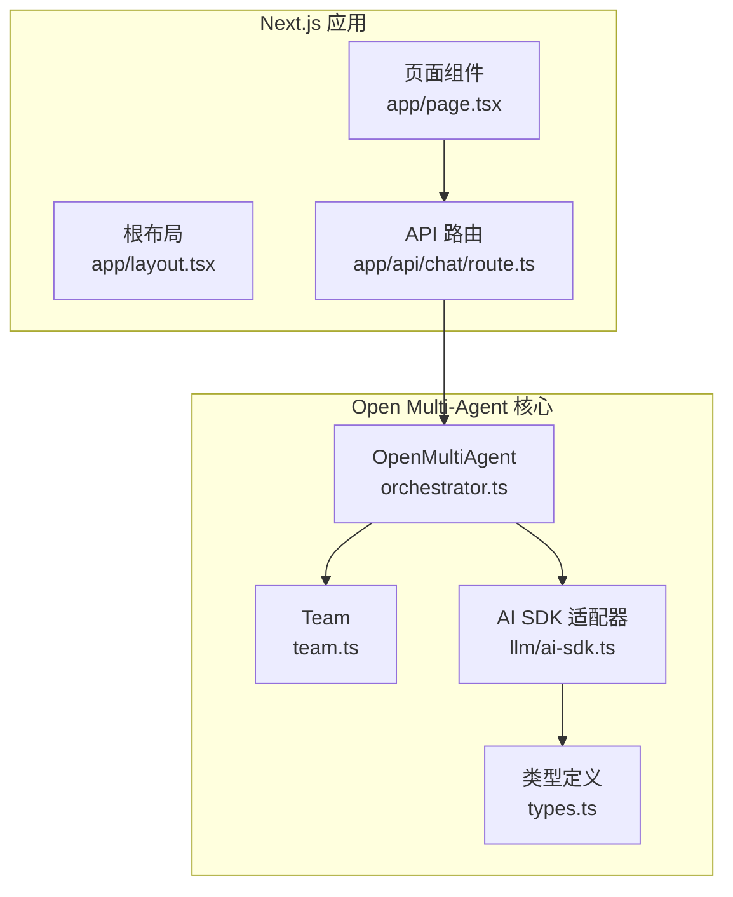
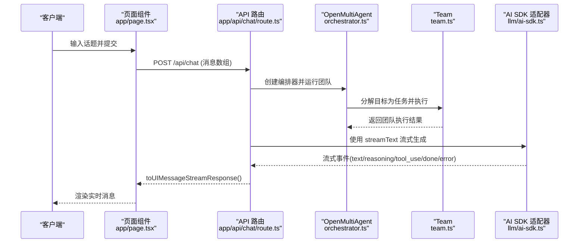
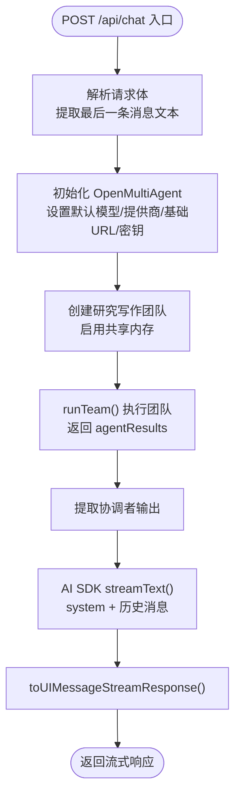
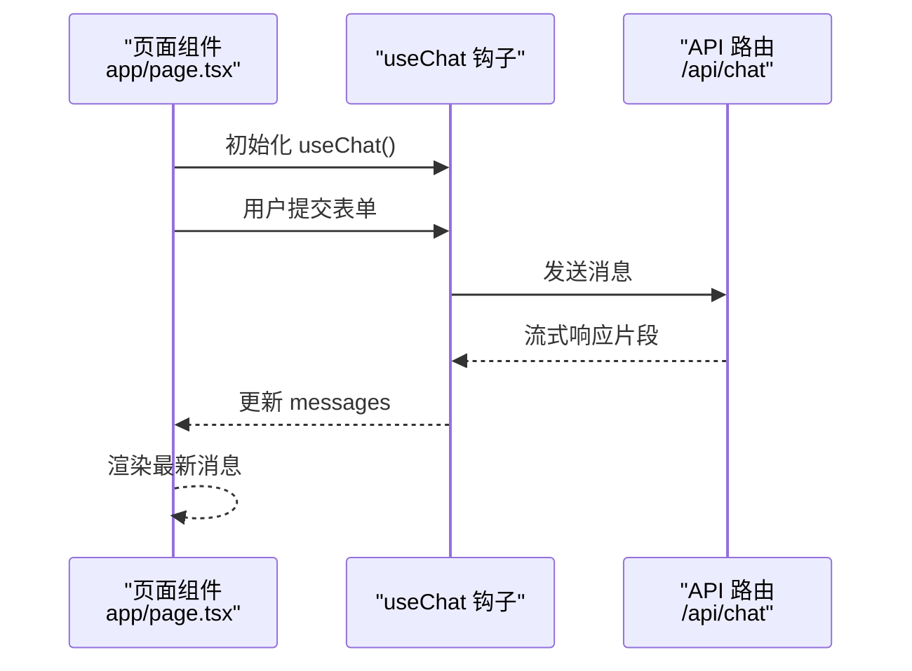
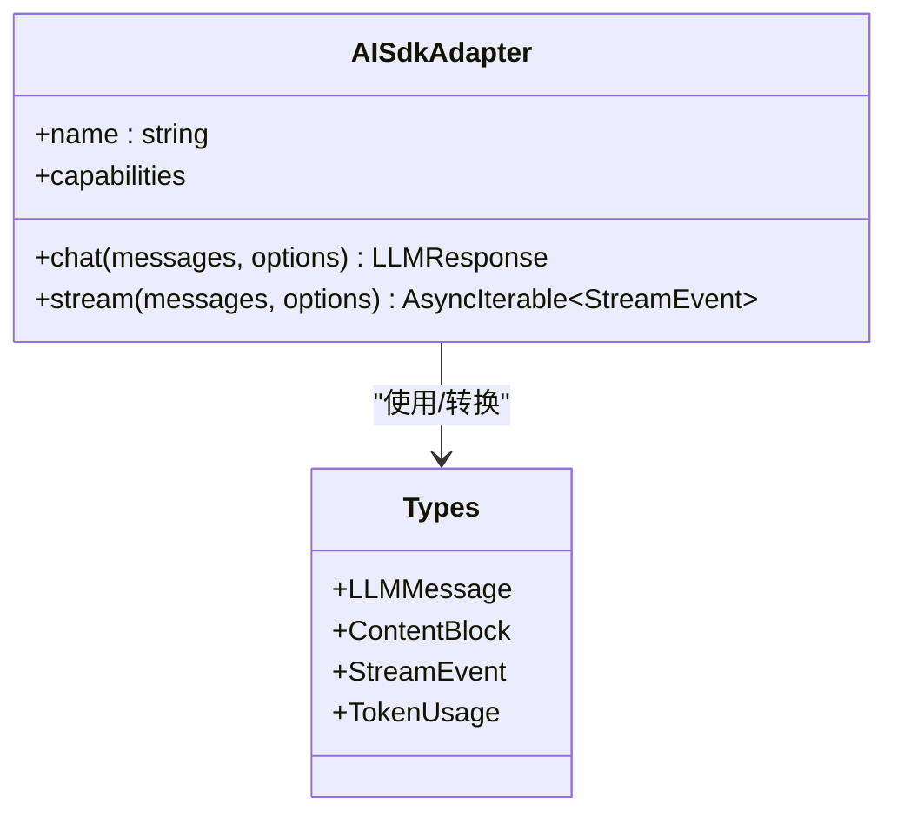
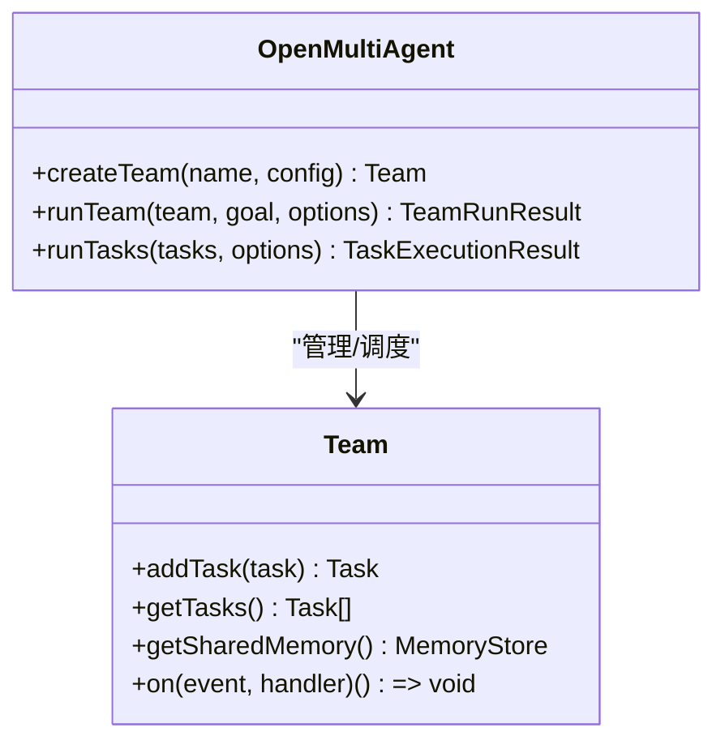
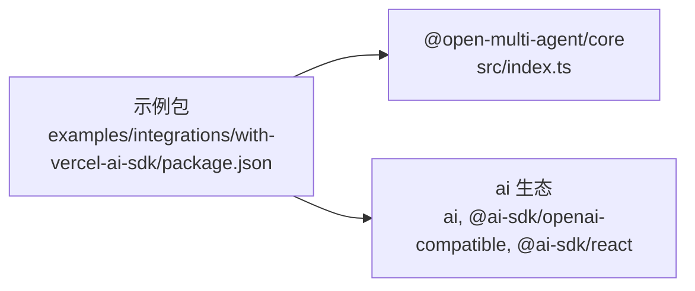

# Vercel AI SDK 集成

<cite>
**本文档引用的文件**
- [README.md](file://README.md)
- [README_zh.md](file://README_zh.md)
- [package.json](file://package.json)
- [src/index.ts](file://src/index.ts)
- [src/types.ts](file://src/types.ts)
- [src/llm/ai-sdk.ts](file://src/llm/ai-sdk.ts)
- [src/team/team.ts](file://src/team/team.ts)
- [src/orchestrator/orchestrator.ts](file://src/orchestrator/orchestrator.ts)
- [examples/integrations/with-vercel-ai-sdk/README.md](file://examples/integrations/with-vercel-ai-sdk/README.md)
- [examples/integrations/with-vercel-ai-sdk/package.json](file://examples/integrations/with-vercel-ai-sdk/package.json)
- [examples/integrations/with-vercel-ai-sdk/app/api/chat/route.ts](file://examples/integrations/with-vercel-ai-sdk/app/api/chat/route.ts)
- [examples/integrations/with-vercel-ai-sdk/app/page.tsx](file://examples/integrations/with-vercel-ai-sdk/app/page.tsx)
- [examples/integrations/with-vercel-ai-sdk/app/layout.tsx](file://examples/integrations/with-vercel-ai-sdk/app/layout.tsx)
</cite>

## 目录
1. [简介](#简介)
2. [项目结构](#项目结构)
3. [核心组件](#核心组件)
4. [架构总览](#架构总览)
5. [详细组件分析](#详细组件分析)
6. [依赖关系分析](#依赖关系分析)
7. [性能考量](#性能考量)
8. [故障排除指南](#故障排除指南)
9. [结论](#结论)
10. [附录](#附录)

## 简介
本文件面向希望在 Next.js 应用中同时使用 Open Multi-Agent（OMA）多智能体编排框架与 Vercel AI SDK 的开发者。文档系统性阐述“混合团队配置”的概念与实现方式，展示如何在同一应用中通过 OMA 完成研究型团队的协作编排，并通过 Vercel AI SDK 提供流式响应到聊天界面。内容涵盖：
- 混合团队配置：在 OMA 中创建具备共享记忆与任务队列的团队，协调多个代理完成复杂目标
- 集成配置步骤：从环境变量、依赖安装到 API 路由与前端 UI 的完整流程
- 数据流转换：从 OMA 的内部消息格式到 AI SDK 的 ModelMessage 的双向映射
- 性能与稳定性：并发控制、重试机制、令牌预算与超时设置
- 错误处理与最佳实践：异常捕获、进度回调、取消信号与可观测性

## 项目结构
该仓库采用模块化组织，核心代码位于 src 目录，示例集成位于 examples/integrations/with-vercel-ai-sdk。Next.js 示例展示了典型的前后端分离模式：后端 API 路由负责 OMA 编排与结果流式输出，前端页面通过 useChat 钩子渲染实时消息。

**图表来源**
- [examples/integrations/with-vercel-ai-sdk/app/page.tsx:1-98](file://examples/integrations/with-vercel-ai-sdk/app/page.tsx#L1-L98)
- [examples/integrations/with-vercel-ai-sdk/app/layout.tsx:1-15](file://examples/integrations/with-vercel-ai-sdk/app/layout.tsx#L1-L15)
- [examples/integrations/with-vercel-ai-sdk/app/api/chat/route.ts:1-92](file://examples/integrations/with-vercel-ai-sdk/app/api/chat/route.ts#L1-L92)
- [src/orchestrator/orchestrator.ts:1-120](file://src/orchestrator/orchestrator.ts#L1-L120)
- [src/team/team.ts:88-151](file://src/team/team.ts#L88-L151)
- [src/llm/ai-sdk.ts:1-30](file://src/llm/ai-sdk.ts#L1-L30)
- [src/types.ts:1-120](file://src/types.ts#L1-L120)

**章节来源**
- [examples/integrations/with-vercel-ai-sdk/README.md:1-60](file://examples/integrations/with-vercel-ai-sdk/README.md#L1-L60)
- [examples/integrations/with-vercel-ai-sdk/package.json:1-26](file://examples/integrations/with-vercel-ai-sdk/package.json#L1-L26)
- [examples/integrations/with-vercel-ai-sdk/app/api/chat/route.ts:1-92](file://examples/integrations/with-vercel-ai-sdk/app/api/chat/route.ts#L1-L92)
- [examples/integrations/with-vercel-ai-sdk/app/page.tsx:1-98](file://examples/integrations/with-vercel-ai-sdk/app/page.tsx#L1-L98)
- [examples/integrations/with-vercel-ai-sdk/app/layout.tsx:1-15](file://examples/integrations/with-vercel-ai-sdk/app/layout.tsx#L1-L15)

## 核心组件
- OpenMultiAgent：顶层编排器，负责创建团队、分解目标、调度任务、并发执行与结果汇总
- Team：团队实体，维护代理名单、消息总线、任务队列与可选共享内存
- AISdkAdapter：AI SDK 适配器，桥接 OMA 内部消息格式与 AI SDK 的 ModelMessage，并支持流式事件
- 类型系统：统一的内容块、消息、响应与流事件类型，确保跨组件一致性

**章节来源**
- [src/orchestrator/orchestrator.ts:1-120](file://src/orchestrator/orchestrator.ts#L1-L120)
- [src/team/team.ts:88-151](file://src/team/team.ts#L88-L151)
- [src/llm/ai-sdk.ts:186-353](file://src/llm/ai-sdk.ts#L186-L353)
- [src/types.ts:115-187](file://src/types.ts#L115-L187)

## 架构总览
下图展示了从用户输入到最终流式响应的关键路径：前端通过 useChat 发送消息，后端 API 路由调用 OMA 运行团队，再由 AI SDK 将结果以流的形式返回给浏览器。

**图表来源**
- [examples/integrations/with-vercel-ai-sdk/app/page.tsx:6-18](file://examples/integrations/with-vercel-ai-sdk/app/page.tsx#L6-L18)
- [examples/integrations/with-vercel-ai-sdk/app/api/chat/route.ts:51-91](file://examples/integrations/with-vercel-ai-sdk/app/api/chat/route.ts#L51-L91)
- [src/orchestrator/orchestrator.ts:561-800](file://src/orchestrator/orchestrator.ts#L561-L800)
- [src/llm/ai-sdk.ts:250-353](file://src/llm/ai-sdk.ts#L250-L353)

## 详细组件分析

### 组件 A：API 路由（Next.js 后端）
- 责任边界：接收前端消息，调用 OMA 执行团队任务，再通过 AI SDK 流式输出
- 关键点：
  - 使用 OpenAI 兼容模型封装（DeepSeek），统一 provider/baseURL/apiKey
  - 从最后一条 UI 消息提取文本作为目标输入
  - Phase 1：OMA runTeam() 执行团队协作，得到团队输出
  - Phase 2：AI SDK streamText() 将团队输出与对话历史合并，生成流式响应
  - 返回 toUIMessageStreamResponse() 以符合前端 useChat 的期望

**图表来源**
- [examples/integrations/with-vercel-ai-sdk/app/api/chat/route.ts:51-91](file://examples/integrations/with-vercel-ai-sdk/app/api/chat/route.ts#L51-L91)

**章节来源**
- [examples/integrations/with-vercel-ai-sdk/app/api/chat/route.ts:1-92](file://examples/integrations/with-vercel-ai-sdk/app/api/chat/route.ts#L1-L92)

### 组件 B：前端页面（Next.js 前端）
- 责任边界：渲染聊天界面，使用 useChat 管理消息状态与发送流程
- 关键点：
  - 监听 status 变化以显示加载态
  - 处理 error 并提示用户
  - 通过 sendMessage 文本消息触发后端 API

**图表来源**
- [examples/integrations/with-vercel-ai-sdk/app/page.tsx:6-18](file://examples/integrations/with-vercel-ai-sdk/app/page.tsx#L6-L18)

**章节来源**
- [examples/integrations/with-vercel-ai-sdk/app/page.tsx:1-98](file://examples/integrations/with-vercel-ai-sdk/app/page.tsx#L1-L98)

### 组件 C：AI SDK 适配器（消息格式转换）
- 责任边界：将 OMA 内部消息格式转换为 AI SDK ModelMessage，或将 AI SDK 流事件映射回 OMA 的流事件
- 关键点：
  - llmMessagesToAiSdkModelMessages：将文本、推理、工具调用等块映射为 AI SDK 的 ModelMessage 数组
  - AISdkAdapter.stream：逐段产出 text、reasoning、tool_use、done/error，聚合为最终 LLMResponse
  - finishReason 映射与 usage 归并，保证与 OMA 的统一语义

**图表来源**
- [src/llm/ai-sdk.ts:191-353](file://src/llm/ai-sdk.ts#L191-L353)
- [src/types.ts:115-187](file://src/types.ts#L115-L187)

**章节来源**
- [src/llm/ai-sdk.ts:1-368](file://src/llm/ai-sdk.ts#L1-L368)
- [src/types.ts:1-200](file://src/types.ts#L1-L200)

### 组件 D：编排器与团队（混合团队配置）
- 责任边界：创建团队、自动分配任务、并发执行、共享记忆与事件总线
- 关键点：
  - Team 支持共享内存 Store，便于代理间传递上下文
  - OpenMultiAgent.runTeam() 通过协调者将高层目标分解为任务，按依赖并行执行
  - 事件总线支持 onProgress 回调，便于前端或监控系统感知进度

**图表来源**
- [src/orchestrator/orchestrator.ts:947-957](file://src/orchestrator/orchestrator.ts#L947-L957)
- [src/team/team.ts:88-151](file://src/team/team.ts#L88-L151)

**章节来源**
- [src/orchestrator/orchestrator.ts:1-800](file://src/orchestrator/orchestrator.ts#L1-L800)
- [src/team/team.ts:1-346](file://src/team/team.ts#L1-L346)

## 依赖关系分析
- Next.js 示例依赖 @open-multi-agent/core 本地链接与 AI SDK 生态（ai、@ai-sdk/openai-compatible、@ai-sdk/react）
- OMA 核心导出统一的公共 API，前端仅需消费 types 与适配器即可

**图表来源**
- [examples/integrations/with-vercel-ai-sdk/package.json:10-18](file://examples/integrations/with-vercel-ai-sdk/package.json#L10-L18)
- [src/index.ts:57-124](file://src/index.ts#L57-L124)

**章节来源**
- [examples/integrations/with-vercel-ai-sdk/package.json:1-26](file://examples/integrations/with-vercel-ai-sdk/package.json#L1-L26)
- [src/index.ts:1-201](file://src/index.ts#L1-L201)

## 性能考量
- 并发与资源控制
  - AgentPool 通过信号量限制并发，避免过载
  - runTeam() 默认并行执行独立任务，受 maxConcurrency 控制
- 重试与退避
  - executeWithRetry 支持指数退避与最大尝试次数，降低瞬时失败影响
- 令牌预算
  - 累计 input/output 令牌，超过阈值触发预算耗尽事件，停止后续任务
- 超时与取消
  - API 路由设置 maxDuration，前端 useChat 支持取消信号中断流式传输
- 流式开销
  - AISdkAdapter.stream 将增量片段映射为 text/reasoning/tool_use，减少前端拼接成本

**章节来源**
- [src/orchestrator/orchestrator.ts:266-333](file://src/orchestrator/orchestrator.ts#L266-L333)
- [examples/integrations/with-vercel-ai-sdk/app/api/chat/route.ts:6-6](file://examples/integrations/with-vercel-ai-sdk/app/api/chat/route.ts#L6-L6)

## 故障排除指南
- 常见错误与定位
  - 令牌预算超限：检查 onProgress 中的 budget_exceeded 事件，调整 maxTokenBudget 或优化提示词
  - 任务失败：查看 onProgress 中的 error 事件，确认依赖是否满足、代理是否存在
  - 流式错误：AISdkAdapter.stream 捕获并抛出 error 事件，前端 useChat.error 可读取
- 建议排查步骤
  - 启用 onTrace 输出运行轨迹，结合 runId 定位具体任务与代理
  - 使用 abortSignal 在前端中断长时间运行的任务
  - 检查环境变量（如 DEEPSEEK_API_KEY）与 provider 配置是否一致
- 最佳实践
  - 为每个团队设置合理的 maxConcurrency 与 maxRetries
  - 使用 sharedMemory 存储关键中间结果，避免重复计算
  - 在 API 层设置 maxDuration，防止冷启动导致的超时

**章节来源**
- [src/orchestrator/orchestrator.ts:561-800](file://src/orchestrator/orchestrator.ts#L561-L800)
- [src/llm/ai-sdk.ts:348-352](file://src/llm/ai-sdk.ts#L348-L352)
- [examples/integrations/with-vercel-ai-sdk/app/api/chat/route.ts:51-91](file://examples/integrations/with-vercel-ai-sdk/app/api/chat/route.ts#L51-L91)

## 结论
通过本集成方案，开发者可以在 Next.js 中无缝结合 OMA 的多智能体编排能力与 Vercel AI SDK 的流式渲染体验。关键在于：
- 明确混合团队配置：在 OMA 中构建具备共享记忆与任务队列的团队
- 规范数据流转换：利用 AI SDK 适配器实现 OMA 与 AI SDK 的消息互操作
- 注重性能与稳定性：合理设置并发、重试与预算，配合流式渲染提升用户体验

## 附录

### 集成配置步骤（摘要）
- 安装依赖与本地链接
  - 在仓库根目录安装 OMA 依赖，进入示例目录安装 Next.js 与 AI SDK 相关依赖
- 设置环境变量
  - 配置提供商 API 密钥（如 DEEPSEEK_API_KEY）
- 启动开发服务器
  - 示例脚本 predev 会先构建 OMA 再启动 Next.js 开发服务器
- 访问应用
  - 打开 http://localhost:3000，输入主题，观察研究团队协作过程

**章节来源**
- [examples/integrations/with-vercel-ai-sdk/README.md:26-46](file://examples/integrations/with-vercel-ai-sdk/README.md#L26-L46)
- [examples/integrations/with-vercel-ai-sdk/package.json:4-8](file://examples/integrations/with-vercel-ai-sdk/package.json#L4-L8)

### API 路由配置要点
- 请求解析与输入提取
  - 从请求体解析 messages，提取最后一条消息文本作为目标
- OMA 编排
  - 创建 OpenMultiAgent 实例，配置默认模型/提供商/基础URL/密钥
  - 定义研究者与写作者代理，创建团队并运行 runTeam
- 结果流式输出
  - 从 runTeam 结果提取协调者输出
  - 使用 streamText 生成流，最终返回 toUIMessageStreamResponse

**章节来源**
- [examples/integrations/with-vercel-ai-sdk/app/api/chat/route.ts:51-91](file://examples/integrations/with-vercel-ai-sdk/app/api/chat/route.ts#L51-L91)

### 流式响应处理（前端）
- 使用 useChat 管理 messages、status 与 error
- 监听 status 切换以显示加载态
- 通过 sendMessage 触发后端 API，自动接收流式片段并更新 UI

**章节来源**
- [examples/integrations/with-vercel-ai-sdk/app/page.tsx:6-18](file://examples/integrations/with-vercel-ai-sdk/app/page.tsx#L6-L18)

### 数据流转换详解
- OMA → AI SDK
  - 将 LLMMessage 转换为 AI SDK 的 ModelMessage，处理文本、推理与工具调用
- AI SDK → OMA
  - 将流事件映射为 text/reasoning/tool_use/done/error，聚合为 LLMResponse
  - 统一 finishReason 与 usage，保持跨组件一致性

**章节来源**
- [src/llm/ai-sdk.ts:45-125](file://src/llm/ai-sdk.ts#L45-L125)
- [src/llm/ai-sdk.ts:250-353](file://src/llm/ai-sdk.ts#L250-L353)

### 框架差异与适用场景
- Open Multi-Agent
  - 适合需要多代理协作、任务分解与共享记忆的复杂工作流
  - 提供事件总线、令牌预算与可观测性，便于生产级部署
- Vercel AI SDK
  - 专注于前端流式渲染与 UI 集成，简化聊天界面开发
  - 通过适配器支持多家大模型提供商，便于快速切换

**章节来源**
- [README.md:217-264](file://README.md#L217-L264)
- [README_zh.md:211-258](file://README_zh.md#L211-L258)