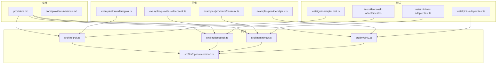
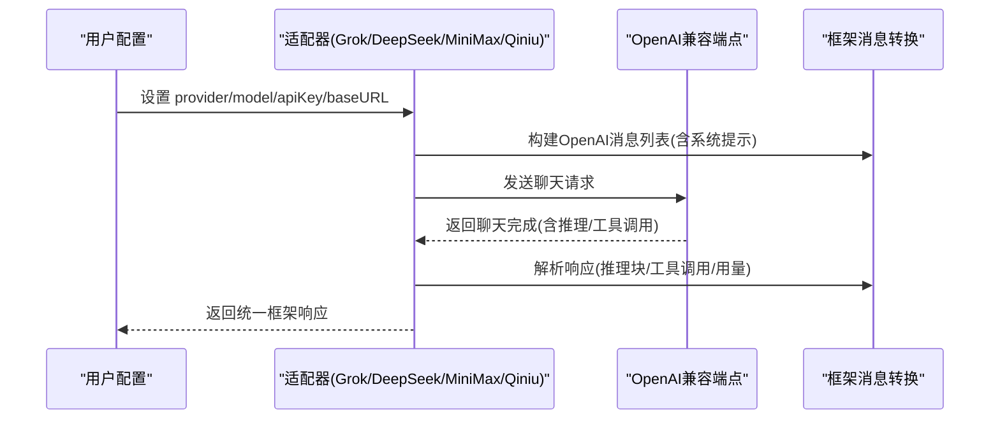
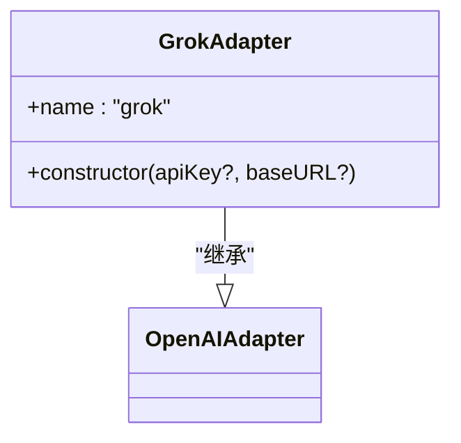
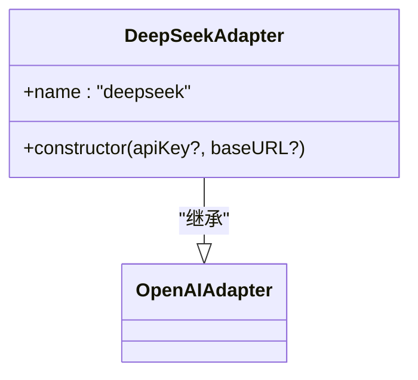
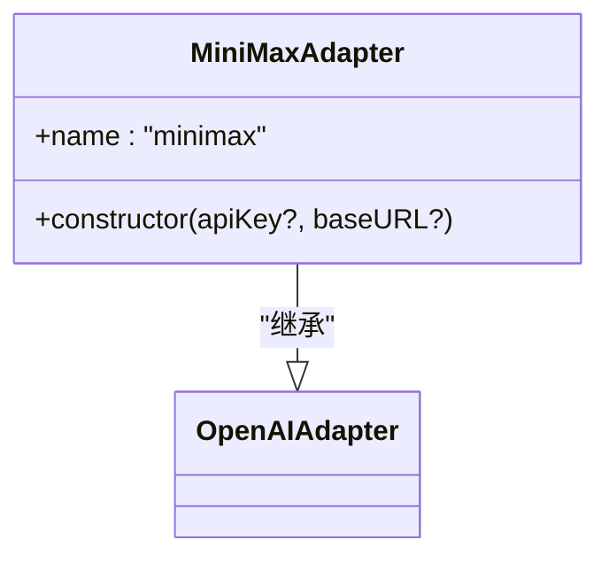
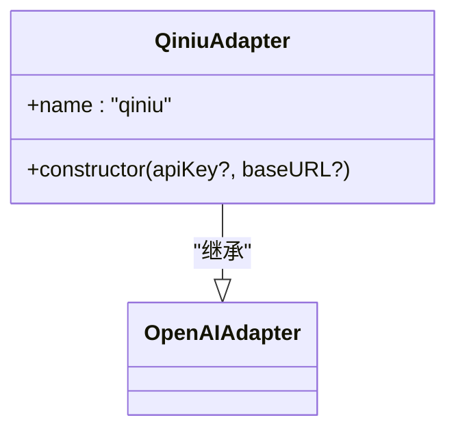
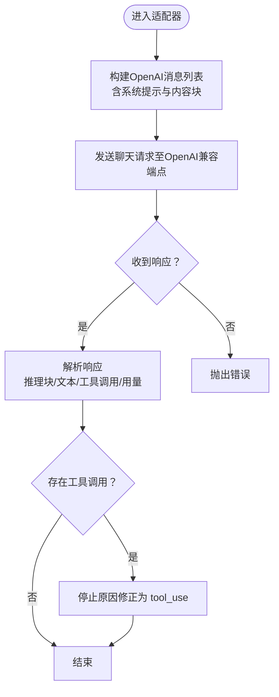
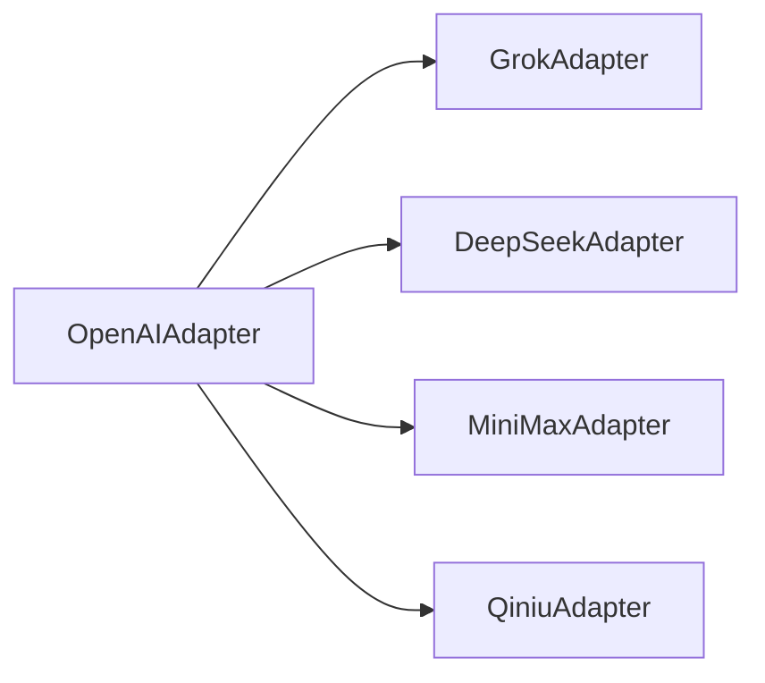

# 专业领域提供商

<cite>
**本文引用的文件**
- [providers.md](file://docs/providers.md)
- [minimax.md](file://docs/providers/minimax.md)
- [grok.ts](file://src/llm/grok.ts)
- [deepseek.ts](file://src/llm/deepseek.ts)
- [minimax.ts](file://src/llm/minimax.ts)
- [qiniu.ts](file://src/llm/qiniu.ts)
- [openai-common.ts](file://src/llm/openai-common.ts)
- [grok 示例](file://examples/providers/grok.ts)
- [deepseek 示例](file://examples/providers/deepseek.ts)
- [minimax 示例](file://examples/providers/minimax.ts)
- [qiniu 示例](file://examples/providers/qiniu.ts)
- [Grok 适配器测试](file://tests/grok-adapter.test.ts)
- [DeepSeek 适配器测试](file://tests/deepseek-adapter.test.ts)
- [MiniMax 适配器测试](file://tests/minimax-adapter.test.ts)
- [Qiniu 适配器测试](file://tests/qiniu-adapter.test.ts)
</cite>

## 目录
1. [简介](#简介)
2. [项目结构](#项目结构)
3. [核心组件](#核心组件)
4. [架构总览](#架构总览)
5. [详细组件分析](#详细组件分析)
6. [依赖关系分析](#依赖关系分析)
7. [性能考量](#性能考量)
8. [故障排除指南](#故障排除指南)
9. [结论](#结论)
10. [附录](#附录)

## 简介
本文件面向在 Open Multi-Agent 框架中使用专业领域 LLM 提供商（xAI Grok、DeepSeek、MiniMax、Qiniu）的用户，系统性说明各提供商的配置方式、API 密钥设置、地域限制与特殊功能，结合代码实现与示例，帮助您快速完成集成与排错，并给出性能对比与选型建议。

## 项目结构
围绕“专业领域提供商”的关键文件分布如下：
- 文档层：提供通用配置说明与提供商特有指南
- 代码层：各提供商适配器继承统一的 OpenAI 兼容适配器，复用消息转换与工具调用逻辑
- 示例层：展示多智能体团队协作场景下的完整配置与运行流程
- 测试层：验证适配器行为、默认参数与环境变量回退机制

图表来源
- [providers.md](file://docs/providers.md)
- [minimax.md](file://docs/providers/minimax.md)
- [grok.ts](file://src/llm/grok.ts)
- [deepseek.ts](file://src/llm/deepseek.ts)
- [minimax.ts](file://src/llm/minimax.ts)
- [qiniu.ts](file://src/llm/qiniu.ts)
- [openai-common.ts](file://src/llm/openai-common.ts)
- [grok 示例](file://examples/providers/grok.ts)
- [deepseek 示例](file://examples/providers/deepseek.ts)
- [minimax 示例](file://examples/providers/minimax.ts)
- [qiniu 示例](file://examples/providers/qiniu.ts)
- [Grok 适配器测试](file://tests/grok-adapter.test.ts)
- [DeepSeek 适配器测试](file://tests/deepseek-adapter.test.ts)
- [MiniMax 适配器测试](file://tests/minimax-adapter.test.ts)
- [Qiniu 适配器测试](file://tests/qiniu-adapter.test.ts)

章节来源
- [providers.md](file://docs/providers.md)
- [minimax.md](file://docs/providers/minimax.md)

## 核心组件
- 适配器基座：所有提供商均基于 OpenAI 兼容适配器，复用统一的消息格式转换、工具调用解析与推理块处理逻辑
- 提供商适配器：分别封装官方 OpenAI 兼容端点与默认密钥环境变量回退策略
- 示例与测试：覆盖从环境变量读取、默认端点、自定义端点、推理块回放等关键路径

章节来源
- [grok.ts](file://src/llm/grok.ts)
- [deepseek.ts](file://src/llm/deepseek.ts)
- [minimax.ts](file://src/llm/minimax.ts)
- [qiniu.ts](file://src/llm/qiniu.ts)
- [openai-common.ts](file://src/llm/openai-common.ts)

## 架构总览
下图展示了“框架配置 → 适配器 → OpenAI 兼容端点”的通用调用链路，以及 MiniMax 的地域差异化端点选择。

图表来源
- [grok.ts](file://src/llm/grok.ts)
- [deepseek.ts](file://src/llm/deepseek.ts)
- [minimax.ts](file://src/llm/minimax.ts)
- [qiniu.ts](file://src/llm/qiniu.ts)
- [openai-common.ts](file://src/llm/openai-common.ts)

## 详细组件分析

### xAI Grok（xAI）
- 适配器特性
  - 继承 OpenAI 兼容适配器，名称固定为“grok”
  - 默认端点：官方 xAI OpenAI 兼容接口
  - 默认密钥环境变量：XAI_API_KEY
  - 支持通过构造函数覆盖 apiKey 与 baseURL
- 配置要点
  - provider: 'grok'
  - model: 任一当前 Grok 模型名（示例中使用 grok-code-fast-1）
  - 环境变量：XAI_API_KEY
- 示例与测试
  - 示例展示三角色团队协作，使用 Grok 编码优化模型
  - 测试覆盖默认密钥回退、默认端点、可覆盖参数与 createAdapter 分派

图表来源
- [grok.ts](file://src/llm/grok.ts)

章节来源
- [grok.ts](file://src/llm/grok.ts)
- [grok 示例](file://examples/providers/grok.ts)
- [Grok 适配器测试](file://tests/grok-adapter.test.ts)

### DeepSeek
- 适配器特性
  - 继承 OpenAI 兼容适配器，名称固定为“deepseek”
  - 默认端点：官方 DeepSeek OpenAI 兼容接口
  - 默认密钥环境变量：DEEPSEEK_API_KEY
  - 支持模型：deepseek-chat（非思考模式，推荐编码）、deepseek-reasoner（思考模式，复杂推理）
- 配置要点
  - provider: 'deepseek'
  - model: deepseek-chat 或 deepseek-reasoner
  - 环境变量：DEEPSEEK_API_KEY
- 示例与测试
  - 示例展示三角色团队协作，使用 DeepSeek V3 模型
  - 测试覆盖默认密钥回退、默认端点、可覆盖参数与推理块溯源 stamp

图表来源
- [deepseek.ts](file://src/llm/deepseek.ts)

章节来源
- [deepseek.ts](file://src/llm/deepseek.ts)
- [deepseek 示例](file://examples/providers/deepseek.ts)
- [DeepSeek 适配器测试](file://tests/deepseek-adapter.test.ts)

### MiniMax（全球/中国）
- 适配器特性
  - 继承 OpenAI 兼容适配器，名称固定为“minimax”
  - 默认端点：全球版 api.minimax.io/v1
  - 中国内地用户需设置 MINIMAX_BASE_URL 以切换至 api.minimaxi.com/v1
  - 默认密钥环境变量：MINIMAX_API_KEY
- 配置要点
  - provider: 'minimax'
  - model: MiniMax-M2.7（或当前可用模型）
  - 环境变量：MINIMAX_API_KEY；如在中国内地需设置 MINIMAX_BASE_URL
- 示例与测试
  - 示例展示三角色团队协作，支持通过 MINIMAX_BASE_URL 切换地域端点
  - 测试覆盖默认密钥回退、默认全球端点、MINIMAX_BASE_URL 覆盖与可覆盖参数

图表来源
- [minimax.ts](file://src/llm/minimax.ts)

章节来源
- [minimax.ts](file://src/llm/minimax.ts)
- [minimax.md](file://docs/providers/minimax.md)
- [minimax 示例](file://examples/providers/minimax.ts)
- [MiniMax 适配器测试](file://tests/minimax-adapter.test.ts)

### Qiniu（七牛云）
- 适配器特性
  - 继承 OpenAI 兼容适配器，名称固定为“qiniu”
  - 默认端点：官方 Qiniu AI 推理 OpenAI 兼容接口
  - 默认密钥环境变量：QINIU_API_KEY
  - 支持模型族：示例中使用 deepseek-v3 与 deepseek-r1（思考模式），具体可用模型以账号授权为准
- 配置要点
  - provider: 'qiniu'
  - model: 由账号授权的任意可用模型
  - 环境变量：QINIU_API_KEY
- 示例与测试
  - 示例展示三角色团队协作，通过 Qiniu 端点路由多种模型
  - 测试覆盖默认密钥回退、默认端点、可覆盖参数

图表来源
- [qiniu.ts](file://src/llm/qiniu.ts)

章节来源
- [qiniu.ts](file://src/llm/qiniu.ts)
- [qiniu 示例](file://examples/providers/qiniu.ts)
- [Qiniu 适配器测试](file://tests/qiniu-adapter.test.ts)

### OpenAI 兼容消息与推理块处理
- 统一消息转换：将框架消息转换为 OpenAI Chat Completions 格式，处理工具结果、图像、文本混合等
- 推理块回放：支持将推理内容作为内联 <thinking> 文本回放到请求中（可选）
- 工具调用提取：当模型未返回原生 tool_calls 时，自动从文本中提取工具调用
- 停止原因归一化：将 OpenAI finish_reason 映射为框架统一词汇

图表来源
- [openai-common.ts](file://src/llm/openai-common.ts)

章节来源
- [openai-common.ts](file://src/llm/openai-common.ts)

## 依赖关系分析
- 适配器对 OpenAI 兼容适配器的继承关系确保了统一的协议与消息格式
- 各提供商适配器仅负责端点与密钥回退策略，不重复实现消息转换与工具调用解析
- 示例与测试共同验证配置路径与行为一致性

图表来源
- [grok.ts](file://src/llm/grok.ts)
- [deepseek.ts](file://src/llm/deepseek.ts)
- [minimax.ts](file://src/llm/minimax.ts)
- [qiniu.ts](file://src/llm/qiniu.ts)

章节来源
- [grok.ts](file://src/llm/grok.ts)
- [deepseek.ts](file://src/llm/deepseek.ts)
- [minimax.ts](file://src/llm/minimax.ts)
- [qiniu.ts](file://src/llm/qiniu.ts)

## 性能考量
- 端点稳定性与延迟
  - Grok/DeepSeek/Qiniu 均为 OpenAI 兼容端点，延迟与吞吐取决于提供商服务状态与地域就近性
  - MiniMax 在中国内地需设置 MINIMAX_BASE_URL 以降低网络时延
- 模型选择
  - 编码任务优先：DeepSeek V3（deepseek-chat）；复杂推理优先：DeepSeek V3（deepseek-reasoner）
  - Qiniu 可按账号授权灵活切换模型族，示例中 deepseek-v3 与 deepseek-r1 均可用
- 工具调用与推理块
  - 使用推理块回放（可选）可能增加请求体积，需权衡上下文长度与成本
- 并发与超时
  - 示例中通过串行执行便于观察输出；实际部署可按需要调整并发与超时设置

## 故障排除指南
- 环境变量未设置
  - Grok：确认 XAI_API_KEY 已设置
  - DeepSeek：确认 DEEPSEEK_API_KEY 已设置
  - MiniMax：确认 MINIMAX_API_KEY 已设置；若在中国内地，需设置 MINIMAX_BASE_URL
  - Qiniu：确认 QINIU_API_KEY 已设置
- 端点错误或被墙
  - MiniMax：检查 MINIMAX_BASE_URL 是否指向 api.minimaxi.com/v1（中国内地）
  - Grok/DeepSeek/Qiniu：确认网络可达官方 OpenAI 兼容端点
- 工具调用未触发
  - 检查模型是否支持工具调用（部分本地或特定模型可能不返回原生 tool_calls）
  - 框架会尝试从文本中提取工具调用，但准确性依赖模型输出质量
- 推理块未回放
  - 若需将推理内容作为内联文本回放，请启用相应选项（参考消息转换模块）

章节来源
- [providers.md](file://docs/providers.md)
- [minimax.md](file://docs/providers/minimax.md)
- [openai-common.ts](file://src/llm/openai-common.ts)

## 结论
- 对于专业领域 LLM，Open Multi-Agent 框架通过统一的 OpenAI 兼容适配器，实现了 Grok、DeepSeek、MiniMax、Qiniu 的一致接入体验
- 配置上仅需关注 provider、model、密钥与必要时的 baseURL（尤其是 MiniMax 中国内地）
- 示例与测试覆盖了关键路径，便于快速验证与排错
- 选型建议
  - 编码优先：DeepSeek V3（deepseek-chat）
  - 复杂推理：DeepSeek V3（deepseek-reasoner）
  - 团队协作与生产力任务：MiniMax M2.7（全球/中国按需切换端点）
  - 多模型聚合：Qiniu（按账号授权灵活切换模型族）

## 附录

### 配置清单与示例路径
- Grok
  - 环境变量：XAI_API_KEY
  - 示例路径：[grok 示例](file://examples/providers/grok.ts)
- DeepSeek
  - 环境变量：DEEPSEEK_API_KEY
  - 示例路径：[deepseek 示例](file://examples/providers/deepseek.ts)
- MiniMax
  - 环境变量：MINIMAX_API_KEY；中国内地需设置 MINIMAX_BASE_URL
  - 示例路径：[minimax 示例](file://examples/providers/minimax.ts)
  - 地域说明：[minimax.md](file://docs/providers/minimax.md)
- Qiniu
  - 环境变量：QINIU_API_KEY
  - 示例路径：[qiniu 示例](file://examples/providers/qiniu.ts)

### 关键实现与测试参考
- 适配器类与默认端点/密钥回退：[grok.ts](file://src/llm/grok.ts)、[deepseek.ts](file://src/llm/deepseek.ts)、[minimax.ts](file://src/llm/minimax.ts)、[qiniu.ts](file://src/llm/qiniu.ts)
- 消息转换与推理块处理：[openai-common.ts](file://src/llm/openai-common.ts)
- 行为验证（密钥回退、端点覆盖、createAdapter 分派）：[Grok 适配器测试](file://tests/grok-adapter.test.ts)、[DeepSeek 适配器测试](file://tests/deepseek-adapter.test.ts)、[MiniMax 适配器测试](file://tests/minimax-adapter.test.ts)、[Qiniu 适配器测试](file://tests/qiniu-adapter.test.ts)