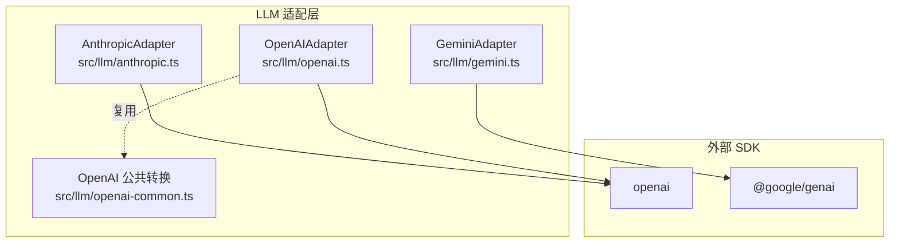
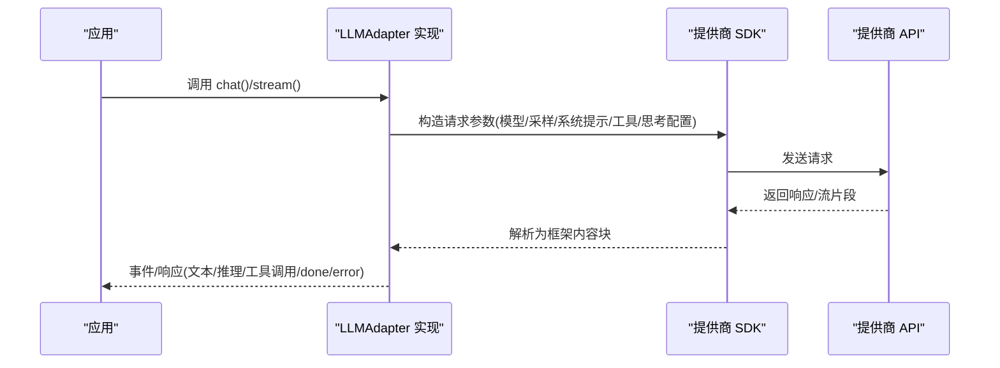
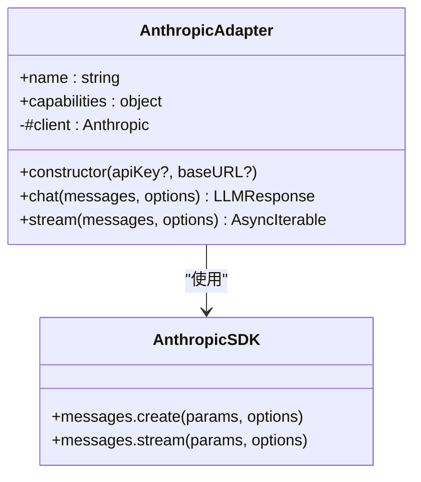
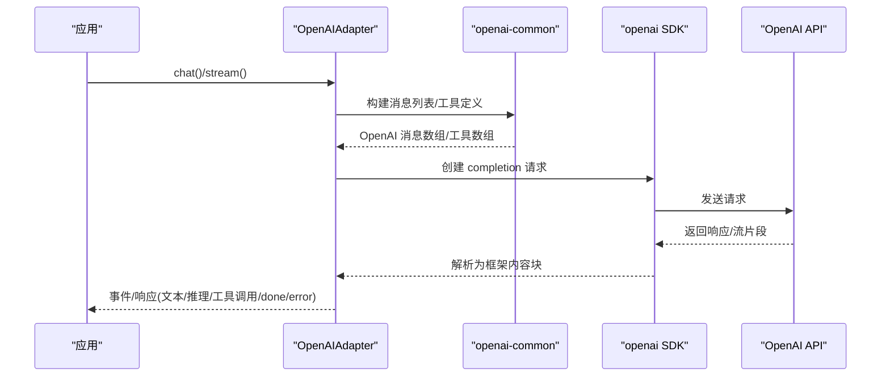
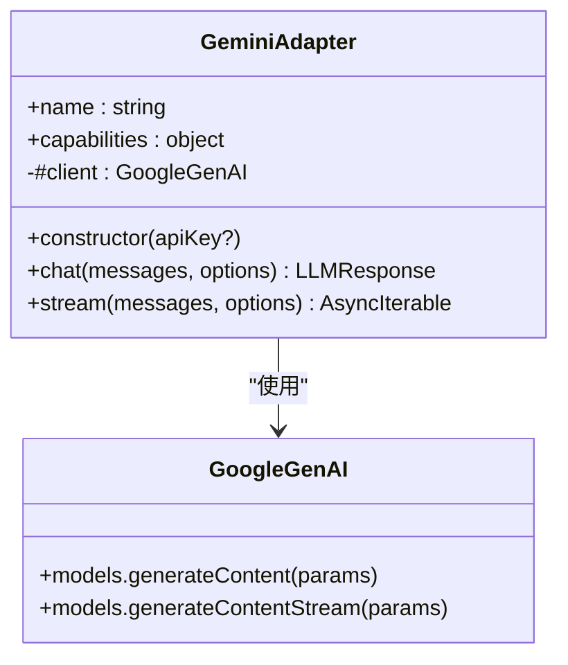
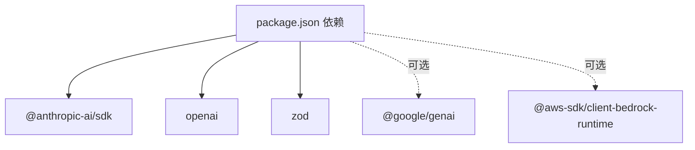

# 主流提供商

<cite>
**本文引用的文件**
- [anthropic.ts](file://src/llm/anthropic.ts)
- [openai.ts](file://src/llm/openai.ts)
- [gemini.ts](file://src/llm/gemini.ts)
- [openai-common.ts](file://src/llm/openai-common.ts)
- [providers.md](file://docs/providers.md)
- [anthropic-e2e.test.ts](file://tests/e2e/anthropic-e2e.test.ts)
- [openai-e2e.test.ts](file://tests/e2e/openai-e2e.test.ts)
- [gemini-e2e.test.ts](file://tests/e2e/gemini-e2e.test.ts)
- [package.json](file://package.json)
</cite>

## 目录
1. [简介](#简介)
2. [项目结构](#项目结构)
3. [核心组件](#核心组件)
4. [架构总览](#架构总览)
5. [详细组件分析](#详细组件分析)
6. [依赖关系分析](#依赖关系分析)
7. [性能考虑](#性能考虑)
8. [故障排除指南](#故障排除指南)
9. [结论](#结论)
10. [附录](#附录)

## 简介
本章节面向 Open Multi-Agent 框架中的三大主流 LLM 提供商：Anthropic Claude、OpenAI 和 Google Gemini。文档聚焦于以下方面：
- 配置方法与环境变量要求
- API 密钥设置与认证流程
- 模型选择与参数映射
- 流式处理支持与事件序列
- 错误处理与端到端测试用例
- 性能优化建议与最佳实践
- 各提供商的独特能力与限制

## 项目结构
围绕三大提供商的适配器位于 src/llm 目录下，分别对应 Anthropic、OpenAI 与 Gemini 的实现；同时，OpenAI 家族的通用转换逻辑集中在 openai-common.ts 中，便于 Copilot 等适配器复用。

图表来源
- [anthropic.ts:1-535](file://src/llm/anthropic.ts#L1-L535)
- [openai.ts:1-339](file://src/llm/openai.ts#L1-L339)
- [gemini.ts:1-504](file://src/llm/gemini.ts#L1-L504)
- [openai-common.ts:1-426](file://src/llm/openai-common.ts#L1-L426)

章节来源
- [anthropic.ts:1-535](file://src/llm/anthropic.ts#L1-L535)
- [openai.ts:1-339](file://src/llm/openai.ts#L1-L339)
- [gemini.ts:1-504](file://src/llm/gemini.ts#L1-L504)
- [openai-common.ts:1-426](file://src/llm/openai-common.ts#L1-L426)

## 核心组件
- AnthropicAdapter：封装 @anthropic-ai/sdk，支持同步与流式响应，具备“自身发出的推理内容可回显”的能力。
- OpenAIAdapter：封装 openai SDK，支持同步与流式响应，通过公共转换模块处理工具调用与推理文本回放。
- GeminiAdapter：封装 @google/genai SDK，支持同步与流式响应，具备“自身发出的推理内容可回显”的能力。
- OpenAI 公共转换模块：统一 OpenAI 家族的消息格式转换、推理文本回放策略与完成原因归一化。

章节来源
- [anthropic.ts:300-518](file://src/llm/anthropic.ts#L300-L518)
- [openai.ts:71-326](file://src/llm/openai.ts#L71-L326)
- [gemini.ts:366-503](file://src/llm/gemini.ts#L366-L503)
- [openai-common.ts:148-425](file://src/llm/openai-common.ts#L148-L425)

## 架构总览
三大适配器均实现统一的 LLMAdapter 接口，对外暴露 chat() 与 stream() 方法，内部通过各自 SDK 将框架的消息与工具定义转换为提供商原生格式，并在流式场景中逐段产出文本、推理与工具调用事件，最终以 done 或 error 终止。

图表来源
- [anthropic.ts:327-365](file://src/llm/anthropic.ts#L327-L365)
- [anthropic.ts:383-517](file://src/llm/anthropic.ts#L383-L517)
- [openai.ts:101-134](file://src/llm/openai.ts#L101-L134)
- [openai.ts:150-325](file://src/llm/openai.ts#L150-L325)
- [gemini.ts:392-403](file://src/llm/gemini.ts#L392-L403)
- [gemini.ts:426-502](file://src/llm/gemini.ts#L426-L502)

## 详细组件分析

### Anthropic Claude 适配器
- 认证与环境变量
  - 支持通过构造函数传入 apiKey，或读取环境变量 ANTHROPIC_API_KEY。
- 消息与工具映射
  - 将框架 ContentBlock 映射为 SDK 的 ContentBlockParam；对 reasoning 块进行签名校验与回显控制。
  - 工具定义映射为 SDK 的 Tool 对象。
- 思考模式（Thinking）
  - 支持手动模式的 budget_tokens 校验与约束；对 Claude Sonnet 3.7 及 4.x 模型生效；4.7+ 仅支持自适应模式。
- 参数与采样
  - 支持 max_tokens、temperature、top_p、top_k；extraBody 可透传额外字段。
- 流式处理
  - 使用 SDK 的消息流接口，按内容块增量输出 text、reasoning 与 tool_use 事件；最终以 done 包含完整响应。
- 错误处理
  - 非 2xx 抛出 SDK 异常；流式捕获异常并以 error 事件返回。

图表来源
- [anthropic.ts:300-518](file://src/llm/anthropic.ts#L300-L518)

章节来源
- [anthropic.ts:8-11](file://src/llm/anthropic.ts#L8-L11)
- [anthropic.ts:265-288](file://src/llm/anthropic.ts#L265-L288)
- [anthropic.ts:327-365](file://src/llm/anthropic.ts#L327-L365)
- [anthropic.ts:383-517](file://src/llm/anthropic.ts#L383-L517)

### OpenAI 适配器
- 认证与环境变量
  - 支持通过构造函数传入 apiKey，或读取环境变量 OPENAI_API_KEY。
- 消息与工具映射
  - 通过 openai-common.ts 的转换函数，将框架消息映射为 OpenAI Chat Completions 的消息数组；工具定义映射为 function 类型。
  - 对 assistant 消息中的 tool_use 块生成 tool_calls；对 user 消息中的 tool_result 块生成独立的 tool 角色消息。
- 推理文本回放
  - 通过 OpenAIReasoningReplayOptions 控制是否将框架 reasoning 内容以 <thinking> 形式回放到请求体中。
- 参数与采样
  - 支持 max_tokens、temperature、frequency_penalty、presence_penalty、top_p、top_k、min_p、parallel_tool_calls、reasoning_effort；extraBody 透传。
- 流式处理
  - 使用 SDK 的流式接口，逐段产出 text、reasoning 与 tool_use 事件；在流结束后汇总 usage 并以 done 返回完整响应。
- 错误处理
  - 非 2xx 抛出 SDK 异常；流式捕获异常并以 error 事件返回。

图表来源
- [openai.ts:101-134](file://src/llm/openai.ts#L101-L134)
- [openai.ts:150-325](file://src/llm/openai.ts#L150-L325)
- [openai-common.ts:148-425](file://src/llm/openai-common.ts#L148-L425)

章节来源
- [openai.ts:17-19](file://src/llm/openai.ts#L17-L19)
- [openai-common.ts:33-47](file://src/llm/openai-common.ts#L33-L47)
- [openai-common.ts:148-186](file://src/llm/openai-common.ts#L148-L186)
- [openai-common.ts:299-385](file://src/llm/openai-common.ts#L299-L385)
- [openai.ts:101-134](file://src/llm/openai.ts#L101-L134)
- [openai.ts:150-325](file://src/llm/openai.ts#L150-L325)

### Google Gemini 适配器
- 认证与环境变量
  - 支持通过构造函数传入 apiKey，或读取环境变量 GEMINI_API_KEY 或 GOOGLE_API_KEY。
- 消息与工具映射
  - 将框架消息映射为 Gemini 的 Content 数组；assistant 角色映射为 model；tool_result 以 functionResponse 形式出现在 user 角色中。
  - 工具定义映射为 Gemini 的 FunctionDeclaration 列表，置于单个 Tool 中。
- 思考模式（Thinking）
  - 支持 includeThoughts 默认开启与 thinkingBudget 透传；需要在多轮工具调用中回显 thoughtSignature。
- 参数与采样
  - 支持 maxOutputTokens、temperature、systemInstruction、tools/toolConfig、thinkingConfig；abortSignal 透传。
- 流式处理
  - 使用 SDK 的 generateContentStream，逐段产出 text、reasoning 与 tool_use 事件；在流结束后汇总 usage 并以 done 返回完整响应。
- 错误处理
  - 捕获异常并以 error 事件返回。

图表来源
- [gemini.ts:366-503](file://src/llm/gemini.ts#L366-L503)

章节来源
- [gemini.ts:11-14](file://src/llm/gemini.ts#L11-L14)
- [gemini.ts:87-176](file://src/llm/gemini.ts#L87-L176)
- [gemini.ts:205-214](file://src/llm/gemini.ts#L205-L214)
- [gemini.ts:392-403](file://src/llm/gemini.ts#L392-L403)
- [gemini.ts:426-502](file://src/llm/gemini.ts#L426-L502)

## 依赖关系分析
- 运行时依赖
  - @anthropic-ai/sdk、openai、zod
- 可选依赖（按需安装）
  - @google/genai（用于 Gemini）、@aws-sdk/client-bedrock-runtime（用于 Bedrock）
- 文档与示例
  - docs/providers.md 提供了三大提供商的配置要点与环境变量清单

图表来源
- [package.json:69-93](file://package.json#L69-L93)

章节来源
- [package.json:69-93](file://package.json#L69-L93)
- [providers.md:20-32](file://docs/providers.md#L20-L32)

## 性能考虑
- 流式处理优先：三大适配器均支持流式接口，建议在长文本与工具调用场景下启用，以降低首字节延迟并提升交互体验。
- 采样参数调优：根据任务类型调整 temperature、top_p、top_k、min_p、frequency_penalty、presence_penalty；对于本地推理，可结合 extraBody 透传服务器特定参数。
- 推理预算与成本：Anthropic 的 thinking.budgetTokens 需满足最小值与小于 max_tokens 的约束；Gemini 的 thinkingConfig 支持动态预算；合理设置可平衡推理质量与成本。
- 超时与并发：为本地模型设置合理的超时时间；在多代理场景下控制并发度，避免资源争用。
- 日志与可观测性：利用流式事件中的 usage 字段进行计费与性能监控。

## 故障排除指南
- 环境变量未设置
  - Anthropic：确保 ANTHROPIC_API_KEY 设置正确。
  - OpenAI：确保 OPENAI_API_KEY 设置正确。
  - Gemini：确保 GEMINI_API_KEY 或 GOOGLE_API_KEY 设置正确。
- 模型不可用或名称错误
  - Anthropic：使用官方模型名称（如 claude-haiku-4-5-20251001）。
  - OpenAI：使用实际可用的模型名称（如 gpt-4o-mini）。
  - Gemini：使用官方模型名称（如 gemini-2.0-flash）。
- 工具调用失败
  - 确认工具定义的 inputSchema 正确；OpenAI 家族在无原生 tool_calls 时会尝试从文本提取工具调用。
- 流式事件缺失
  - 检查流式参数与 SDK 版本；确保在流结束时聚合 usage 并发出 done 事件。
- 端到端验证
  - 可运行 E2E 测试（需设置对应环境变量并启用 RUN_E2E），验证 chat 与 stream 的基本行为。

章节来源
- [anthropic-e2e.test.ts:13-83](file://tests/e2e/anthropic-e2e.test.ts#L13-L83)
- [openai-e2e.test.ts:13-81](file://tests/e2e/openai-e2e.test.ts#L13-L81)
- [gemini-e2e.test.ts:13-65](file://tests/e2e/gemini-e2e.test.ts#L13-L65)

## 结论
三大提供商适配器在统一接口下提供了稳定的同步与流式能力，并针对各自生态的关键差异（如 Anthropic 的推理签名、OpenAI 的工具角色分离、Gemini 的思考签名与流式聚合）进行了细致处理。通过合理的参数配置、流式处理与错误处理策略，可在多代理协作场景中获得一致且高性能的体验。

## 附录

### 配置与环境变量清单
- Anthropic
  - provider: 'anthropic'
  - 环境变量: ANTHROPIC_API_KEY
  - 示例模型: claude-sonnet-4-6、claude-haiku-4-5-20251001
- OpenAI
  - provider: 'openai'
  - 环境变量: OPENAI_API_KEY
  - 示例模型: gpt-4o、gpt-4o-mini
- Google Gemini
  - provider: 'gemini'
  - 环境变量: GEMINI_API_KEY 或 GOOGLE_API_KEY
  - 示例模型: gemini-2.0-flash、gemini-2.5-pro

章节来源
- [providers.md:20-32](file://docs/providers.md#L20-L32)

### 参数映射与特殊功能
- 采样参数
  - Anthropic: max_tokens、temperature、top_p、top_k
  - OpenAI: max_tokens、temperature、frequency_penalty、presence_penalty、top_p、top_k、min_p、parallel_tool_calls、reasoning_effort
  - Gemini: maxOutputTokens、temperature、systemInstruction、tools/toolConfig、thinkingConfig
- 思考模式
  - Anthropic: 手动模式 budget_tokens 校验；4.7+ 仅支持自适应模式
  - Gemini: includeThoughts 默认开启；支持 thinkingBudget
  - OpenAI: reasoning_effort 由选项驱动
- 流式事件
  - 文本增量: text
  - 推理增量: reasoning
  - 工具调用: tool_use（组装完成后一次性发出）
  - 终止事件: done（携带完整响应与 usage）或 error（携带错误）

章节来源
- [anthropic.ts:265-288](file://src/llm/anthropic.ts#L265-L288)
- [openai.ts:109-122](file://src/llm/openai.ts#L109-L122)
- [gemini.ts:205-214](file://src/llm/gemini.ts#L205-L214)
- [openai-common.ts:398-406](file://src/llm/openai-common.ts#L398-L406)