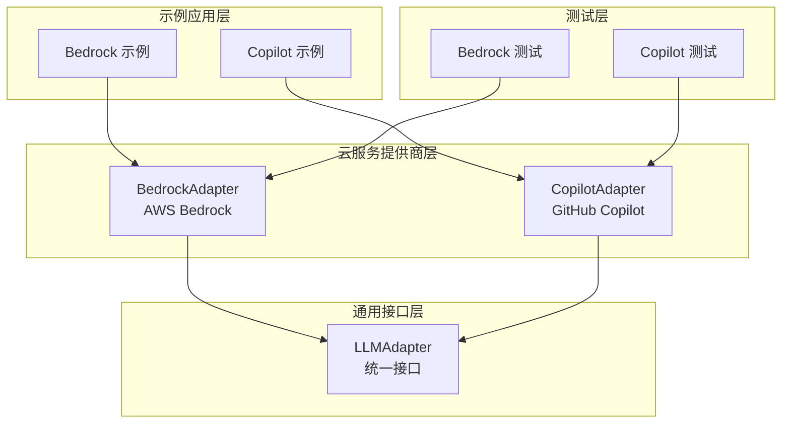
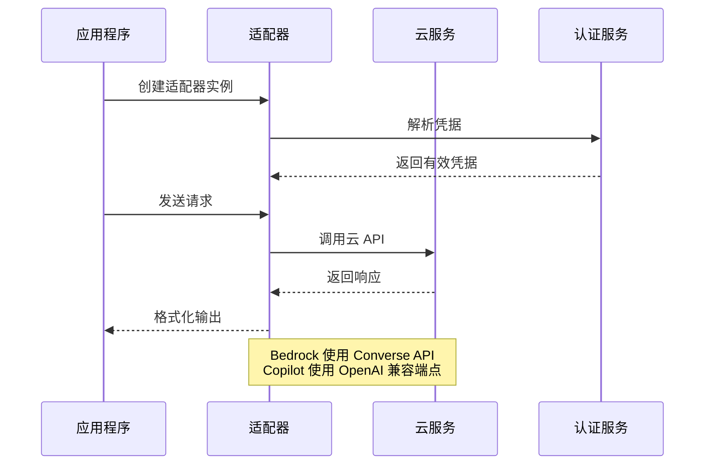
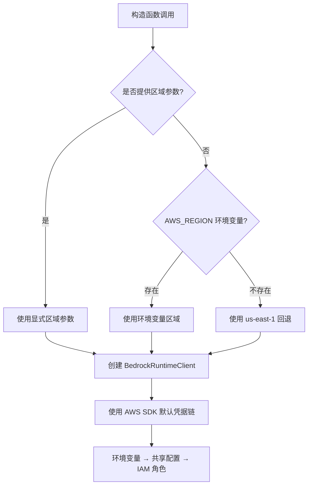
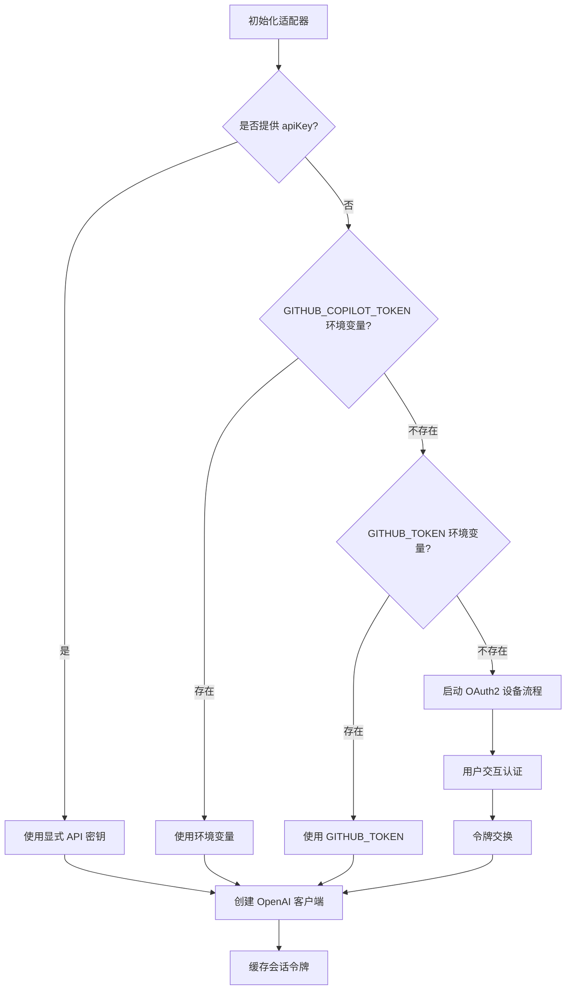
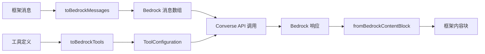

# 云服务提供商

<cite>
**本文档引用的文件**
- [bedrock.ts](file://src/llm/bedrock.ts)
- [copilot.ts](file://src/llm/copilot.ts)
- [bedrock.ts](file://examples/providers/bedrock.ts)
- [copilot.ts](file://examples/providers/copilot.ts)
- [providers.md](file://docs/providers.md)
- [bedrock-adapter.test.ts](file://tests/bedrock-adapter.test.ts)
- [copilot-adapter.test.ts](file://tests/copilot-adapter.test.ts)
- [package.json](file://package.json)
</cite>

## 目录
1. [简介](#简介)
2. [项目结构](#项目结构)
3. [核心组件](#核心组件)
4. [架构概览](#架构概览)
5. [详细组件分析](#详细组件分析)
6. [依赖关系分析](#依赖关系分析)
7. [性能考虑](#性能考虑)
8. [故障排除指南](#故障排除指南)
9. [结论](#结论)

## 简介

Open Multi-Agent 框架提供了对多个云服务提供商的统一支持，其中 AWS Bedrock 和 GitHub Copilot 是两个重要的云原生提供商。本文档深入介绍了这两个提供商的配置方法、认证机制、区域设置和特殊功能。

AWS Bedrock 作为元提供程序，通过统一的 Converse API（类 Anthropic 架构）路由到 Claude、Llama、Mistral、Cohere 和 Titan 模型系列。GitHub Copilot 则通过 OpenAI 兼容的 Copilot Chat Completions 端点提供企业级 AI 助手功能。

## 项目结构

框架采用模块化设计，每个云提供商都有独立的适配器实现：



**图表来源**
- [bedrock.ts:216-422](file://src/llm/bedrock.ts#L216-L422)
- [copilot.ts:228-462](file://src/llm/copilot.ts#L228-L462)

**章节来源**
- [bedrock.ts:1-50](file://src/llm/bedrock.ts#L1-L50)
- [copilot.ts:1-50](file://src/llm/copilot.ts#L1-L50)

## 核心组件

### AWS Bedrock 适配器

Bedrock 适配器实现了统一的 LLM 接口，支持以下核心功能：

- **多模型支持**：通过 Converse API 支持 Claude、Llama、Mistral、Cohere 和 Titan 模型家族
- **统一认证**：使用 AWS SDK 默认凭据链解析凭据
- **区域自动解析**：支持显式区域参数、环境变量和硬编码回退
- **流式处理**：完整的流式响应支持，包括工具调用和推理内容

### GitHub Copilot 适配器

Copilot 适配器提供了企业级 AI 助手功能：

- **OAuth2 设备流程**：支持交互式设备代码认证
- **令牌交换机制**：GitHub OAuth 令牌与 Copilot 会话令牌的转换
- **多模型支持**：支持 GPT-4o、Claude Sonnet、Gemini 等多种模型
- **企业功能**：支持团队协作和开发工具集成

**章节来源**
- [bedrock.ts:216-238](file://src/llm/bedrock.ts#L216-L238)
- [copilot.ts:228-253](file://src/llm/copilot.ts#L228-L253)

## 架构概览



**图表来源**
- [bedrock.ts:235-238](file://src/llm/bedrock.ts#L235-L238)
- [copilot.ts:291-298](file://src/llm/copilot.ts#L291-L298)

## 详细组件分析

### AWS Bedrock 配置与认证

#### 凭据解析顺序

Bedrock 适配器遵循以下凭据解析顺序：



**图表来源**
- [bedrock.ts:8-14](file://src/llm/bedrock.ts#L8-L14)
- [bedrock.ts:235-238](file://src/llm/bedrock.ts#L235-L238)

#### 区域设置策略

Bedrock 支持多种区域设置方式：

1. **构造函数参数**：直接传入区域字符串
2. **环境变量**：`AWS_REGION` 环境变量
3. **默认回退**：`us-east-1` 硬编码回退

#### 模型访问权限

Bedrock 适配器支持以下模型类型：

- **Claude 系列**：`anthropic.claude-*`
- **Llama 系列**：`meta.llama*`
- **Mistral 系列**：`mistral.mistral*`
- **Cohere 系列**：`cohere.command*`
- **Titan 系列**：`amazon.titan*`

**章节来源**
- [bedrock.ts:8-14](file://src/llm/bedrock.ts#L8-L14)
- [bedrock.ts:235-238](file://src/llm/bedrock.ts#L235-L238)

### GitHub Copilot 配置与认证

#### 多重认证机制

Copilot 适配器支持以下认证方式：



**图表来源**
- [copilot.ts:243-253](file://src/llm/copilot.ts#L243-L253)
- [copilot.ts:109-169](file://src/llm/copilot.ts#L109-L169)

#### OAuth2 设备流程

当没有可用的 GitHub 令牌时，系统会启动 OAuth2 设备流程：

1. **设备代码请求**：向 GitHub 请求设备代码
2. **用户授权**：提示用户在浏览器中完成授权
3. **轮询状态**：定期检查授权状态
4. **令牌交换**：获取访问令牌并转换为 Copilot 会话令牌

#### 企业级功能

Copilot 提供以下企业级功能：

- **团队协作**：支持多用户协作开发
- **开发工具集成**：与 VS Code、GitHub 等工具深度集成
- **模型选择**：支持多种 AI 模型的灵活选择
- **成本控制**：基于预付费请求的定价模式

**章节来源**
- [copilot.ts:109-169](file://src/llm/copilot.ts#L109-L169)
- [copilot.ts:243-253](file://src/llm/copilot.ts#L243-L253)

### 数据流处理

#### Bedrock 数据转换



**图表来源**
- [bedrock.ts:138-153](file://src/llm/bedrock.ts#L138-L153)
- [bedrock.ts:155-165](file://src/llm/bedrock.ts#L155-L165)

#### Copilot 数据处理

Copilot 适配器将框架消息转换为 OpenAI 兼容格式：

- **消息映射**：将框架消息转换为 OpenAI 消息格式
- **工具调用**：支持工具调用的解析和重建
- **流式处理**：完整的流式响应处理机制

**章节来源**
- [bedrock.ts:138-165](file://src/llm/bedrock.ts#L138-L165)
- [copilot.ts:304-328](file://src/llm/copilot.ts#L304-L328)

## 依赖关系分析

### 外部依赖

框架对外部依赖的管理采用可选依赖模式：

```mermaid
graph TB
subgraph "核心依赖"
A[@anthropic-ai/sdk]
B[openai]
C[zod]
end
subgraph "可选依赖"
D[@aws-sdk/client-bedrock-runtime]
E[@google/genai]
F[@modelcontextprotocol/sdk]
G[ai]
end
subgraph "开发依赖"
H[@vitest/coverage-v8]
I[tsx]
J[typescript]
end
A --> D
B --> F
C --> G
```

**图表来源**
- [package.json:69-107](file://package.json#L69-L107)

### 适配器依赖

每个适配器都依赖于相应的云服务 SDK：

- **Bedrock 适配器**：依赖 `@aws-sdk/client-bedrock-runtime`
- **Copilot 适配器**：依赖 `openai` SDK
- **其他适配器**：依赖对应的官方 SDK

**章节来源**
- [package.json:69-107](file://package.json#L69-L107)

## 性能考虑

### Bedrock 性能优化

1. **并发处理**：适配器设计为线程安全，可跨并发代理运行共享
2. **流式处理**：支持流式响应以减少延迟
3. **区域优化**：选择靠近用户的区域以降低网络延迟

### Copilot 性能特性

1. **令牌缓存**：会话令牌缓存避免重复认证
2. **并发刷新**：并发请求共享单个刷新操作
3. **成本优化**：基于预付费请求的定价模式

## 故障排除指南

### Bedrock 常见问题

#### 凭据配置问题

**问题**：无法连接到 Bedrock 服务
**解决方案**：
1. 确认 AWS 凭据正确配置
2. 检查 `AWS_REGION` 环境变量设置
3. 验证 IAM 角色权限

#### 模型 ID 问题

**问题**：模型调用失败
**解决方案**：
1. 检查模型 ID 是否正确
2. 对于新版本 Claude 模型，确认使用交叉区域推理配置前缀
3. 在 Bedrock 控制台验证模型可用性

#### 流式处理问题

**问题**：流式响应不完整
**解决方案**：
1. 检查网络连接稳定性
2. 验证 `@aws-sdk/client-bedrock-runtime` 版本兼容性
3. 确认流式 API 调用参数正确

### Copilot 常见问题

#### 认证问题

**问题**：Copilot 认证失败
**解决方案**：
1. 检查 GitHub 令牌有效性
2. 确认 Copilot 订阅状态
3. 重新执行 OAuth2 设备流程

#### 令牌管理问题

**问题**：会话令牌过期
**解决方案**：
1. 检查令牌过期时间
2. 确认自动刷新机制正常工作
3. 手动重新认证

#### 模型选择问题

**问题**：特定模型不可用
**解决方案**：
1. 检查模型列表中的可用性
2. 确认企业许可覆盖该模型
3. 联系 GitHub 支持确认权限

**章节来源**
- [bedrock-adapter.test.ts:64-86](file://tests/bedrock-adapter.test.ts#L64-L86)
- [copilot-adapter.test.ts:117-288](file://tests/copilot-adapter.test.ts#L117-L288)

## 结论

Open Multi-Agent 框架为 AWS Bedrock 和 GitHub Copilot 提供了完整的云服务集成方案。通过统一的适配器接口，开发者可以轻松地在不同云提供商之间切换，同时享受各自平台的独特功能。

AWS Bedrock 适配器通过其元提供程序架构，为用户提供了一致的 API 体验，无论底层使用的是哪种模型家族。GitHub Copilot 适配器则提供了企业级的 AI 助手功能，支持团队协作和开发工具集成。

两个适配器都经过充分的测试验证，包括凭据解析、数据转换、流式处理等关键功能。框架的设计确保了高可用性和良好的性能表现。

对于生产环境部署，建议：
1. 使用 IAM 角色而非长期凭据
2. 启用适当的监控和日志记录
3. 实施合理的超时和重试策略
4. 定期更新依赖包以获得最新功能和安全修复