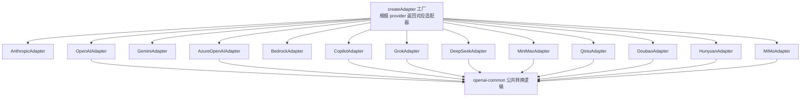
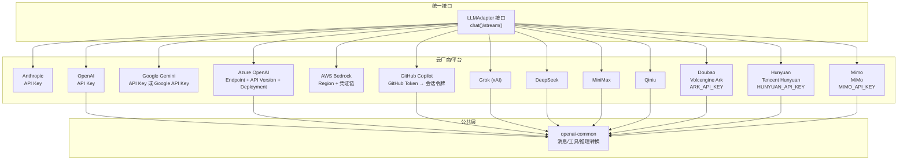
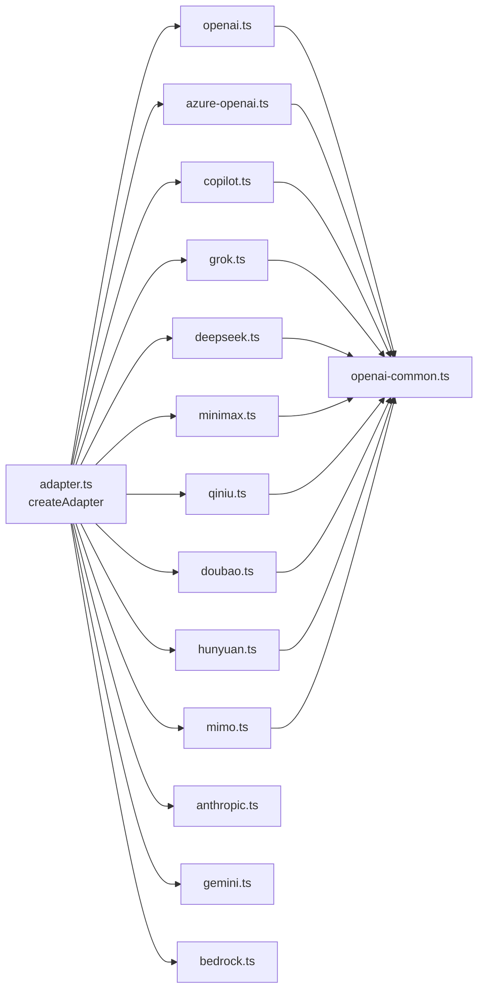

# 内置提供商

<cite>
**本文引用的文件**
- [src/llm/adapter.ts](file://src/llm/adapter.ts)
- [src/types.ts](file://src/types.ts)
- [src/llm/anthropic.ts](file://src/llm/anthropic.ts)
- [src/llm/openai.ts](file://src/llm/openai.ts)
- [src/llm/gemini.ts](file://src/llm/gemini.ts)
- [src/llm/azure-openai.ts](file://src/llm/azure-openai.ts)
- [src/llm/bedrock.ts](file://src/llm/bedrock.ts)
- [src/llm/copilot.ts](file://src/llm/copilot.ts)
- [src/llm/deepseek.ts](file://src/llm/deepseek.ts)
- [src/llm/grok.ts](file://src/llm/grok.ts)
- [src/llm/minimax.ts](file://src/llm/minimax.ts)
- [src/llm/qiniu.ts](file://src/llm/qiniu.ts)
- [src/llm/openai-common.ts](file://src/llm/openai-common.ts)
- [src/llm/doubao.ts](file://src/llm/doubao.ts)
- [src/llm/hunyuan.ts](file://src/llm/hunyuan.ts)
- [src/llm/mimo.ts](file://src/llm/mimo.ts)
- [examples/providers/azure-openai.ts](file://examples/providers/azure-openai.ts)
- [examples/providers/bedrock.ts](file://examples/providers/bedrock.ts)
- [examples/providers/copilot.ts](file://examples/providers/copilot.ts)
- [examples/providers/deepseek.ts](file://examples/providers/deepseek.ts)
- [examples/providers/doubao.ts](file://examples/providers/doubao.ts)
- [examples/providers/hunyuan.ts](file://examples/providers/hunyuan.ts)
- [examples/providers/mimo.ts](file://examples/providers/mimo.ts)
- [tests/doubao-adapter.test.ts](file://tests/doubao-adapter.test.ts)
- [tests/hunyuan-adapter.test.ts](file://tests/hunyuan-adapter.test.ts)
- [tests/mimo-adapter.test.ts](file://tests/mimo-adapter.test.ts)
</cite>

## 更新摘要
**所做更改**
- 新增 Doubao（字节跳动火山引擎）提供商适配器文档
- 新增 Hunyuan（腾讯混元）提供商适配器文档  
- 新增 Mimo（小米米墨）提供商适配器文档
- 更新支持提供商列表，包含三个新增提供商
- 更新架构图和依赖关系分析，反映新增提供商
- 添加三个提供商的配置示例和环境变量说明
- 更新故障排除指南，包含新增提供商的特定注意事项

## 目录
1. [简介](#简介)
2. [项目结构](#项目结构)
3. [核心组件](#核心组件)
4. [架构总览](#架构总览)
5. [详细组件分析](#详细组件分析)
6. [依赖关系分析](#依赖关系分析)
7. [性能考虑](#性能考虑)
8. [故障排除指南](#故障排除指南)
9. [结论](#结论)
10. [附录](#附录)

## 简介
本文件系统性梳理 Open Multi-Agent 框架内置的 LLM 提供商适配器，现已扩展至覆盖 Anthropic Claude、OpenAI、Google Gemini、Azure OpenAI、AWS Bedrock、GitHub Copilot、xAI Grok、DeepSeek、MiniMax、Qiniu、Doubao（字节跳动火山引擎）、Hunyuan（腾讯混元）、Mimo（小米米墨）等提供商。内容包括：
- 配置方法与环境变量解析顺序
- 模型选择与参数映射（采样、工具调用、推理）
- 流式处理支持与事件序列保证
- 错误处理策略与常见问题定位
- 性能优化建议与最佳实践

## 项目结构
框架通过统一的适配器接口对接多家 LLM 提供商，并在工厂函数中按提供商动态加载具体实现，避免不必要的依赖安装。现已支持 13 个内置提供商。

**图表来源**
- [src/llm/adapter.ts:42](file://src/llm/adapter.ts#L42)
- [src/llm/adapter.ts:118-125](file://src/llm/adapter.ts#L118-L125)
- [src/llm/openai-common.ts:1-426](file://src/llm/openai-common.ts#L1-L426)

**章节来源**
- [src/llm/adapter.ts:36-147](file://src/llm/adapter.ts#L36-L147)

## 核心组件
- 统一适配器接口：所有提供商实现相同的 LLMAdapter 接口，暴露 chat() 同步请求与 stream() 异步流式接口，返回标准化的 LLMResponse 与 StreamEvent。
- 类型系统：ContentBlock/TextBlock/ToolUseBlock/ToolResultBlock/ImageBlock/ReasoningBlock 等统一消息块类型，确保跨提供商的推理与工具调用语义一致。
- 通用 OpenAI 转换层：OpenAI 家族（OpenAI、Azure OpenAI、Copilot、Grok、DeepSeek、MiniMax、Qiniu、Doubao、Hunyuan、Mimo）共享 openai-common 的消息构建、工具定义、推理文本回放等逻辑。

**章节来源**
- [src/types.ts:15-110](file://src/types.ts#L15-L110)
- [src/llm/openai-common.ts:53-186](file://src/llm/openai-common.ts#L53-L186)

## 架构总览
下图展示各提供商的认证与请求路径差异，以及与公共转换层的关系。现已包含三个新增提供商。

**图表来源**
- [src/llm/adapter.ts:42](file://src/llm/adapter.ts#L42)
- [src/llm/adapter.ts:118-125](file://src/llm/adapter.ts#L118-L125)
- [src/llm/openai-common.ts:1-426](file://src/llm/openai-common.ts#L1-L426)

## 详细组件分析

### Doubao（字节跳动火山引擎）
- 认证与环境变量
  - 支持显式 apiKey 或 ARK_API_KEY 环境变量；默认 baseURL 为官方 Volcengine Ark 端点 https://ark.cn-beijing.volces.com/api/v3。
  - 支持自定义 baseURL 覆盖，默认端点适用于火山引擎 Ark API。
- 模型与参数
  - 继承 OpenAIAdapter，复用 OpenAI 家族的参数映射与工具调用机制。
  - 支持 doubao-seed-1-8-251228 等火山引擎提供的模型。
- 流式处理
  - 与 OpenAI 家族一致的事件序列；include_usage 最终块汇总。
- 错误处理
  - 非 2xx 抛出 SDK 错误；流式模式 include_usage 仅在最终块出现。

**章节来源**
- [src/llm/doubao.ts:19-28](file://src/llm/doubao.ts#L19-L28)
- [src/llm/doubao.ts:22-27](file://src/llm/doubao.ts#L22-L27)

### Hunyuan（腾讯混元）
- 认证与环境变量
  - 支持显式 apiKey 或 HUNYUAN_API_KEY 环境变量；默认 baseURL 为腾讯 MaaS / TokenHub 端点 https://tokenhub.tencentmaas.com/v1。
  - 支持 HUNYUAN_BASE_URL 环境变量或构造函数 baseURL 参数覆盖。
  - 支持两种独立的 OpenAI 兼容表面：当前 MaaS 平台和已宣布退役的腾讯云平台。
- 模型与参数
  - 继承 OpenAIAdapter，支持 hy3-preview、hunyuan-turbos 等模型。
  - 特殊能力：echoesReasoning: 'tool-use-only'，确保混元思维模式下的推理内容回填。
  - hy3-preview 的交错思维模式要求每轮工具调用都回填推理内容，否则思维链质量下降。
- 流式处理
  - 支持推理内容回填；工具调用一次性事件；最终聚合 done。
- 错误处理
  - 非 2xx 抛出 SDK 错误；需要遵循混元平台的特定规范。

**章节来源**
- [src/llm/hunyuan.ts:35-65](file://src/llm/hunyuan.ts#L35-L65)
- [src/llm/hunyuan.ts:43-55](file://src/llm/hunyuan.ts#L43-L55)

### Mimo（小米米墨）
- 认证与环境变量
  - 支持显式 apiKey 或 MIMO_API_KEY 环境变量；默认 baseURL 为官方按量付费端点 https://api.xiaomimimo.com/v1。
  - 支持 MIMO_BASE_URL 环境变量或构造函数 baseURL 参数覆盖，用于 Token Plan 集群。
  - 支持 Token Plan keys（tp-...）和按量付费密钥。
- 模型与参数
  - 继承 OpenAIAdapter，支持 mimo-v2.5-pro、mimo-v2.5、mimo-v2-pro、mimo-v2-omni 等模型。
  - 特殊能力：echoesReasoning: 'tool-use-only'，确保多轮工具调用对话中的推理内容回填。
  - 思维模式遵循与 DeepSeek 相同的 OpenAI 兼容推理内容回填契约。
- 流式处理
  - 支持推理内容回填；工具调用一次性事件；最终聚合 done。
- 错误处理
  - 非 2xx 抛出 SDK 错误；Token Plan 集群需要正确的 baseURL 配置。

**章节来源**
- [src/llm/mimo.ts:19-36](file://src/llm/mimo.ts#L19-L36)
- [src/llm/mimo.ts:22-26](file://src/llm/mimo.ts#L22-L26)

### Anthropic Claude
- 认证与环境变量
  - 支持显式 apiKey 或 ANTHROPIC_API_KEY 环境变量；支持自定义 baseURL。
- 模型与参数
  - 支持 thinking 配置（预算令牌与预算校验），并针对不同模型版本进行兼容性约束。
  - 采样参数：temperature、top_p、top_k；额外字段通过 extraBody 注入。
- 工具调用与推理
  - 支持 tool_use/tool_result；推理块携带签名以满足多轮扩展思考协议。
- 流式处理
  - 文本增量、推理增量、工具调用一次性事件；最终聚合为 done 事件。
- 错误处理
  - 非 2xx 抛出 SDK 错误，需外层捕获处理限流/上下文超限等。

**章节来源**
- [src/llm/anthropic.ts:8-11](file://src/llm/anthropic.ts#L8-L11)
- [src/llm/anthropic.ts:265-288](file://src/llm/anthropic.ts#L265-L288)
- [src/llm/anthropic.ts:327-365](file://src/llm/anthropic.ts#L327-L365)
- [src/llm/anthropic.ts:383-517](file://src/llm/anthropic.ts#L383-L517)

### OpenAI
- 认证与环境变量
  - 支持显式 apiKey 或 OPENAI_API_KEY 环境变量；支持自定义 baseURL。
- 模型与参数
  - reasoning_effort 映射到 thinking 配置；支持 top_k、min_p（本地兼容服务器）。
  - 并行工具调用 parallel_tool_calls；采样参数 temperature/top_p/top_k 等。
- 工具调用与推理
  - assistant 中 tool_use → tool_calls；user 中 tool_result → 独立 tool 角色消息；推理文本可回放到 <thinking> 块。
- 流式处理
  - 文本增量、推理增量、工具调用一次性事件；最终 include_usage 聚合为 done。
- 错误处理
  - 非 2xx 抛出 SDK 错误；流式模式 include_usage 仅在最终块出现。

**章节来源**
- [src/llm/openai.ts:17-19](file://src/llm/openai.ts#L17-L19)
- [src/llm/openai.ts:101-134](file://src/llm/openai.ts#L101-L134)
- [src/llm/openai.ts:150-325](file://src/llm/openai.ts#L150-L325)
- [src/llm/openai-common.ts:412-425](file://src/llm/openai-common.ts#L412-L425)

### Google Gemini
- 认证与环境变量
  - 支持显式 apiKey 或 GEMINI_API_KEY/GOOGLE_API_KEY 环境变量。
- 模型与参数
  - thinkingConfig 支持 includeThoughts 与 thinkingBudget；工具调用使用 functionDeclarations。
  - 角色映射 user/model；工具结果 functionResponse 必须在 user 角色中紧随 assistant 的 tool_calls。
- 流式处理
  - 思想摘要增量（reasoning）与工具调用一次性事件；最终聚合 done。
- 错误处理
  - finish_reason 映射至框架 stop_reason；工具调用缺失时尝试从文本提取。

**章节来源**
- [src/llm/gemini.ts:11-14](file://src/llm/gemini.ts#L11-L14)
- [src/llm/gemini.ts:392-403](file://src/llm/gemini.ts#L392-L403)
- [src/llm/gemini.ts:426-502](file://src/llm/gemini.ts#L426-L502)

### Azure OpenAI
- 认证与环境变量
  - 支持 AZURE_OPENAI_API_KEY、AZURE_OPENAI_ENDPOINT、AZURE_OPENAI_API_VERSION、AZURE_OPENAI_DEPLOYMENT；baseURL 作为 endpoint 使用。
- 模型与参数
  - model 字段应为部署名称（deployment name），非底层模型名；不支持 top_k/min_p。
- 流式处理
  - 与 OpenAI 家族一致的事件序列；include_usage 最终块汇总。
- 错误处理
  - 部署未找到、限流、上下文超限等非 2xx 错误需外层捕获。

**章节来源**
- [src/llm/azure-openai.ts:17-27](file://src/llm/azure-openai.ts#L17-L27)
- [src/llm/azure-openai.ts:72-84](file://src/llm/azure-openai.ts#L72-L84)
- [src/llm/azure-openai.ts:126-157](file://src/llm/azure-openai.ts#L126-L157)
- [src/llm/azure-openai.ts:172-335](file://src/llm/azure-openai.ts#L172-L335)

### AWS Bedrock
- 认证与环境变量
  - 无 API Key；通过 AWS SDK 默认凭证链（环境变量、共享配置、IAM 角色）解析；region 可通过构造函数或 AWS_REGION 环境变量指定。
- 模型与参数
  - 使用 Converse/ConverseStream 统一 schema；推理内容支持；工具调用通过 toolSpec。
- 流式处理
  - 文本增量、推理增量、工具调用一次性事件；最终聚合 done。
- 错误处理
  - 非 2xx 抛出 SDK 错误；部分模型需要跨区域推理配置前缀。

**章节来源**
- [src/llm/bedrock.ts:8-14](file://src/llm/bedrock.ts#L8-L14)
- [src/llm/bedrock.ts:244-282](file://src/llm/bedrock.ts#L244-L282)
- [src/llm/bedrock.ts:288-421](file://src/llm/bedrock.ts#L288-L421)

### GitHub Copilot
- 认证与环境变量
  - 支持 GITHUB_COPILOT_TOKEN 或 GITHUB_TOKEN；若均未提供则触发交互式 OAuth2 设备流程。
- 模型与参数
  - 通过 Copilot 会话令牌访问 OpenAI 兼容端点；推理 effort 通过 reasoning_effort；工具调用与 OpenAI 家族一致。
- 流式处理
  - 事件序列与 OpenAI 家族一致；include_usage 最终块汇总。
- 模型倍率
  - 提供模型倍率查询与格式化显示，用于计费参考。

**章节来源**
- [src/llm/copilot.ts:9-13](file://src/llm/copilot.ts#L9-L13)
- [src/llm/copilot.ts:260-288](file://src/llm/copilot.ts#L260-L288)
- [src/llm/copilot.ts:304-328](file://src/llm/copilot.ts#L304-L328)
- [src/llm/copilot.ts:334-461](file://src/llm/copilot.ts#L334-L461)
- [src/llm/copilot.ts:487-534](file://src/llm/copilot.ts#L487-L534)

### xAI Grok
- 认证与环境变量
  - 使用 XAI_API_KEY 环境变量；默认 baseURL 为官方 xAI 端点。
- 实现方式
  - 继承 OpenAIAdapter，复用 OpenAI 家族转换逻辑。

**章节来源**
- [src/llm/grok.ts:22-28](file://src/llm/grok.ts#L22-L28)

### DeepSeek
- 认证与环境变量
  - 使用 DEEPSEEK_API_KEY 环境变量；默认 baseURL 为官方 DeepSeek 端点。
- 实现方式
  - 继承 OpenAIAdapter，复用 OpenAI 家族转换逻辑。

**章节来源**
- [src/llm/deepseek.ts:22-28](file://src/llm/deepseek.ts#L22-L28)

### MiniMax
- 认证与环境变量
  - 使用 MINIMAX_API_KEY 环境变量；默认 baseURL 为官方 MiniMax 端点；可选 MINIMAX_BASE_URL 覆盖。
- 实现方式
  - 继承 OpenAIAdapter，复用 OpenAI 家族转换逻辑。

**章节来源**
- [src/llm/minimax.ts:22-28](file://src/llm/minimax.ts#L22-L28)

### Qiniu
- 认证与环境变量
  - 使用 QINIU_API_KEY 环境变量；默认 baseURL 为官方 Qiniu 端点。
- 实现方式
  - 继承 OpenAIAdapter，复用 OpenAI 家族转换逻辑。

**章节来源**
- [src/llm/qiniu.ts:22-28](file://src/llm/qiniu.ts#L22-L28)

### OpenAI 家族通用转换层（openai-common）
- 工具定义转换：LLMToolDef → ChatCompletionTool
- 消息转换：framework 消息 → OpenAI Chat Completions 消息数组；严格处理 tool_result 的位置约束。
- 推理文本回放：可选将推理块序列化为 <thinking> 文本注入请求。
- 响应转换：OpenAI Completion → LLMResponse；工具调用解析与文本工具调用提取回退。
- 结束原因归一化：finish_reason → stop_reason。

**章节来源**
- [src/llm/openai-common.ts:53-186](file://src/llm/openai-common.ts#L53-L186)
- [src/llm/openai-common.ts:299-385](file://src/llm/openai-common.ts#L299-L385)
- [src/llm/openai-common.ts:398-406](file://src/llm/openai-common.ts#L398-L406)

## 依赖关系分析
- 工厂函数 createAdapter 按提供商懒加载具体适配器类，避免无关 SDK 的安装负担。
- OpenAI 家族共享 openai-common，减少重复实现与维护成本。
- Bedrock 通过统一 Converse API 适配多模型家族，屏蔽底层差异。
- Doubao、Hunyuan、Mimo 作为 OpenAIAdapter 的薄封装，继承所有通用功能。

**图表来源**
- [src/llm/adapter.ts:76-147](file://src/llm/adapter.ts#L76-L147)
- [src/llm/openai-common.ts:1-426](file://src/llm/openai-common.ts#L1-L426)

**章节来源**
- [src/llm/adapter.ts:76-147](file://src/llm/adapter.ts#L76-L147)

## 性能考虑
- 流式优先：在长对话与工具调用场景中，优先使用 stream() 获取增量输出，降低首字节延迟与内存占用峰值。
- 工具调用并发控制：OpenAI 家族可通过 parallel_tool_calls 控制并发工具调用；某些本地服务可能需要串行以避免流式分片异常。
- 上下文压缩：结合 AgentConfig.contextStrategy（滑动窗口、摘要、紧凑压缩）控制历史长度，避免 token 超限导致重试与失败。
- 超时与中断：合理设置 AgentConfig.timeoutMs 与 AbortSignal，避免本地模型推理过慢阻塞整体流程。
- 推理预算：Anthropic thinking.budgetTokens 与 Gemini thinkingBudget 需小于 maxTokens，避免 API 拒绝。
- 令牌统计：关注 LLMResponse.usage 与工具执行内部 tokenUsage，统一计入总预算。
- **新增提供商优化**：
  - Doubao：火山引擎 Ark API 具有较低延迟，适合高并发场景。
  - Hunyuan：交错思维模式需要推理内容回填，建议启用工具调用模式以充分利用推理能力。
  - Mimo：支持 Token Plan 集群，可根据用量选择合适的计费模式。

## 故障排除指南
- 认证失败
  - Anthropic：检查 ANTHROPIC_API_KEY 是否正确；必要时设置 baseURL。
  - OpenAI/Azure/Grok/DeepSeek/MiniMax/Qiniu/Doubao/Hunyuan/Mimo：检查对应 API Key 环境变量；Azure 需确认部署名称与 API 版本。
  - Copilot：若未设置 GITHUB_COPILOT_TOKEN/GITHUB_TOKEN，首次运行将触发设备码登录流程，请确保网络可达。
  - Bedrock：确认 AWS 凭证链可用；region 正确；模型 ID 符合区域要求。
  - **新增提供商**：
    - Doubao：检查 ARK_API_KEY 环境变量；确认火山引擎 Ark API 可访问。
    - Hunyuan：区分 MaaS / TokenHub 和腾讯云平台；根据平台设置正确的 baseURL。
    - Mimo：Token Plan 需要正确的 MIMO_BASE_URL；按量付费使用默认端点。
- 请求被拒
  - Anthropic thinking 参数：budgetTokens ≥ 1024 且 < maxTokens；否则抛出明确错误。
  - Azure OpenAI：model 必须为部署名称；不支持 top_k/min_p。
  - Gemini：tool_result 必须紧跟在 assistant 的 tool_calls 之后；finish_reason 映射需注意 MAX_TOKENS → max_tokens。
  - **新增提供商**：
    - Doubao：确认模型名称正确；检查火山引擎配额限制。
    - Hunyuan：交错思维模式需要推理内容回填；检查 hy3-preview 模型支持。
    - Mimo：Token Plan 集群需要正确的集群 URL；检查模型可用性。
- 流式异常
  - OpenAI 家族：include_usage 仅在最终块出现；若未收到 usage，检查 stream_options 设置。
  - Bedrock：contentBlockStop 缺失时会安全回退；仍建议关注日志与 done 事件完整性。
  - **新增提供商**：
    - Doubao：流式响应格式与 OpenAI 兼容；检查网络连接稳定性。
    - Hunyuan：推理内容回填可能影响流式性能；建议合理设置超时。
    - Mimo：Token Plan 集群可能存在网络延迟；建议启用连接池。
- 代理与本地服务
  - OpenAI 兼容服务（Ollama/vLLM/LM Studio）需设置 baseURL；本地服务器通常需要非空 apiKey 占位符。
- 日志与可观测性
  - 使用 AgentConfig.beforeRun/afterRun 钩子记录上下文；结合 Orchestrator.onProgress 与 onTrace 追踪任务与预算。

**章节来源**
- [src/llm/anthropic.ts:271-283](file://src/llm/anthropic.ts#L271-L283)
- [src/llm/azure-openai.ts:135-142](file://src/llm/azure-openai.ts#L135-L142)
- [src/llm/gemini.ts:333-341](file://src/llm/gemini.ts#L333-L341)
- [src/llm/openai-common.ts:398-406](file://src/llm/openai-common.ts#L398-L406)

## 结论
该框架通过统一的适配器接口与公共转换层，实现了对多家 LLM 提供商的一致接入体验。新增的 Doubao、Hunyuan、Mimo 三大提供商进一步丰富了生态系统的多样性，满足不同地域和业务场景的需求。开发者只需关注模型选择、参数映射与流式事件处理，即可在不同提供商间平滑切换。建议在生产环境中启用流式处理、上下文压缩与超时控制，并结合各提供商的认证与参数约束进行规范化配置。

## 附录

### 配置示例与环境变量速查
- Anthropic
  - 环境变量：ANTHROPIC_API_KEY；可选 baseURL
  - 关键参数：model、maxTokens、temperature、topP、topK、thinking（budgetTokens、effort）
- OpenAI
  - 环境变量：OPENAI_API_KEY；可选 baseURL
  - 关键参数：model、maxTokens、temperature、topP、topK、minP、parallel_tool_calls、thinking.effort
- Google Gemini
  - 环境变量：GEMINI_API_KEY 或 GOOGLE_API_KEY
  - 关键参数：model、maxTokens、systemPrompt、thinking.enabled/budgetTokens
- Azure OpenAI
  - 环境变量：AZURE_OPENAI_API_KEY、AZURE_OPENAI_ENDPOINT、AZURE_OPENAI_API_VERSION、AZURE_OPENAI_DEPLOYMENT
  - 关键参数：baseURL（endpoint）、model（部署名）、maxTokens、temperature、topP、parallel_tool_calls、thinking.effort
- AWS Bedrock
  - 环境变量：AWS_ACCESS_KEY_ID、AWS_SECRET_ACCESS_KEY、AWS_REGION
  - 关键参数：region（构造函数或 AWS_REGION）、model（含跨区域前缀）、maxTokens、temperature、topP
- GitHub Copilot
  - 环境变量：GITHUB_COPILOT_TOKEN 或 GITHUB_TOKEN；首次运行触发设备码登录
  - 关键参数：model（Copilot 可用模型列表）、maxTokens、temperature、thinking.effort
- xAI Grok
  - 环境变量：XAI_API_KEY；默认 baseURL
  - 关键参数：model、maxTokens、temperature
- DeepSeek
  - 环境变量：DEEPSEEK_API_KEY；默认 baseURL
  - 关键参数：model（deepseek-chat/deepseek-reasoner）、maxTokens、temperature
- MiniMax
  - 环境变量：MINIMAX_API_KEY；默认 baseURL，可选 MINIMAX_BASE_URL
  - 关键参数：model、maxTokens、temperature
- Qiniu
  - 环境变量：QINIU_API_KEY；默认 baseURL
  - 关键参数：model、maxTokens、temperature
- **新增提供商**
  - Doubao（字节跳动火山引擎）
    - 环境变量：ARK_API_KEY；默认 baseURL：https://ark.cn-beijing.volces.com/api/v3
    - 关键参数：model（如 doubao-seed-1-8-251228）、maxTokens、temperature
  - Hunyuan（腾讯混元）
    - 环境变量：HUNYUAN_API_KEY；默认 baseURL：https://tokenhub.tencentmaas.com/v1
    - 可选环境变量：HUNYUAN_BASE_URL（用于腾讯云平台）
    - 关键参数：model（hy3-preview/hunyuan-turbos）、maxTokens、temperature、reasoning_effort
  - Mimo（小米米墨）
    - 环境变量：MIMO_API_KEY；默认 baseURL：https://api.xiaomimimo.com/v1
    - 可选环境变量：MIMO_BASE_URL（用于 Token Plan 集群）
    - 关键参数：model（mimo-v2.5-pro/mimo-v2.5）、maxTokens、temperature

**章节来源**
- [src/llm/adapter.ts:42](file://src/llm/adapter.ts#L42)
- [src/llm/adapter.ts:55-59](file://src/llm/adapter.ts#L55-L59)
- [src/llm/doubao.ts:22-27](file://src/llm/doubao.ts#L22-L27)
- [src/llm/hunyuan.ts:57-64](file://src/llm/hunyuan.ts#L57-L64)
- [src/llm/mimo.ts:28-35](file://src/llm/mimo.ts#L28-L35)

### 示例脚本与运行指引
- Azure OpenAI 多智能体团队协作
  - 环境变量：AZURE_OPENAI_API_KEY、AZURE_OPENAI_ENDPOINT、AZURE_OPENAI_API_VERSION、AZURE_OPENAI_DEPLOYMENT
  - 注意：model 字段必须为部署名称，而非底层模型名
- AWS Bedrock 多智能体团队协作
  - 环境变量：AWS_ACCESS_KEY_ID、AWS_SECRET_ACCESS_KEY、AWS_REGION
  - 注意：新模型可能需要跨区域推理配置前缀
- GitHub Copilot 多智能体团队协作
  - 环境变量：GITHUB_COPILOT_TOKEN 或 GITHUB_TOKEN；首次运行触发设备码登录
- DeepSeek 多智能体团队协作
  - 环境变量：DEEPSEEK_API_KEY
  - 可选模型：deepseek-chat（编码）、deepseek-reasoner（推理）
- **新增提供商示例**
  - Doubao 多智能体团队协作
    - 环境变量：ARK_API_KEY
    - 运行命令：npx tsx examples/providers/doubao.ts
    - 可用模型：doubao-seed-1-8-251228
  - Hunyuan 多智能体团队协作
    - 环境变量：HUNYUAN_API_KEY
    - 运行命令：npx tsx examples/providers/hunyuan.ts
    - 可用模型：hy3-preview（默认）、hunyuan-turbos-latest（腾讯云平台）
  - Mimo 多智能体团队协作
    - 环境变量：MIMO_API_KEY
    - 运行命令：npx tsx examples/providers/mimo.ts
    - 可用模型：mimo-v2.5-pro、mimo-v2.5、mimo-v2-pro、mimo-v2-omni

**章节来源**
- [examples/providers/azure-openai.ts:10-31](file://examples/providers/azure-openai.ts#L10-L31)
- [examples/providers/bedrock.ts:12-31](file://examples/providers/bedrock.ts#L12-L31)
- [examples/providers/copilot.ts:11-22](file://examples/providers/copilot.ts#L11-L22)
- [examples/providers/deepseek.ts:10-16](file://examples/providers/deepseek.ts#L10-L16)
- [examples/providers/doubao.ts:10-15](file://examples/providers/doubao.ts#L10-L15)
- [examples/providers/hunyuan.ts:10-23](file://examples/providers/hunyuan.ts#L10-L23)
- [examples/providers/mimo.ts:10-20](file://examples/providers/mimo.ts#L10-L20)

### 新增提供商技术特性对比
- **Doubao（火山引擎）**
  - 优势：低延迟、高并发、火山引擎生态集成
  - 适用场景：高性能推理、大规模部署
  - 配置要点：ARK_API_KEY 环境变量、默认端点配置
- **Hunyuan（腾讯混元）**
  - 优势：交错思维模式、强大的推理能力、多平台支持
  - 适用场景：复杂推理任务、工具调用密集应用
  - 配置要点：平台选择（MaaS/Tencent Cloud）、推理内容回填
- **Mimo（小米米墨）**
  - 优势：灵活计费模式、Token Plan 选择、多模型支持
  - 适用场景：成本敏感应用、弹性计算需求
  - 配置要点：集群选择（按量付费/Token Plan）、模型选择

**章节来源**
- [src/llm/doubao.ts:19-28](file://src/llm/doubao.ts#L19-L28)
- [src/llm/hunyuan.ts:35-65](file://src/llm/hunyuan.ts#L35-L65)
- [src/llm/mimo.ts:19-36](file://src/llm/mimo.ts#L19-L36)