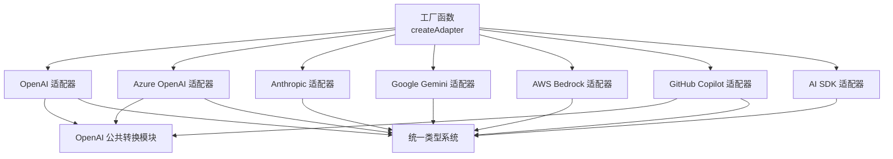
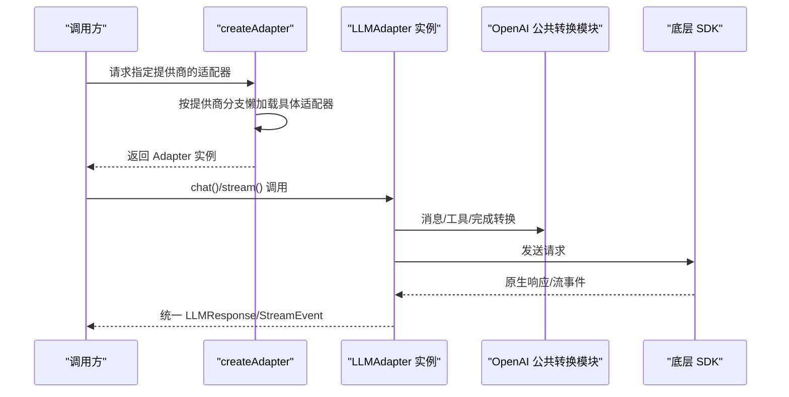
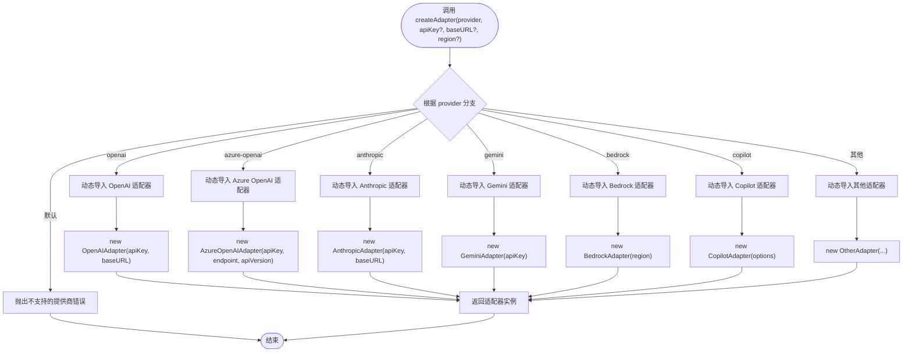
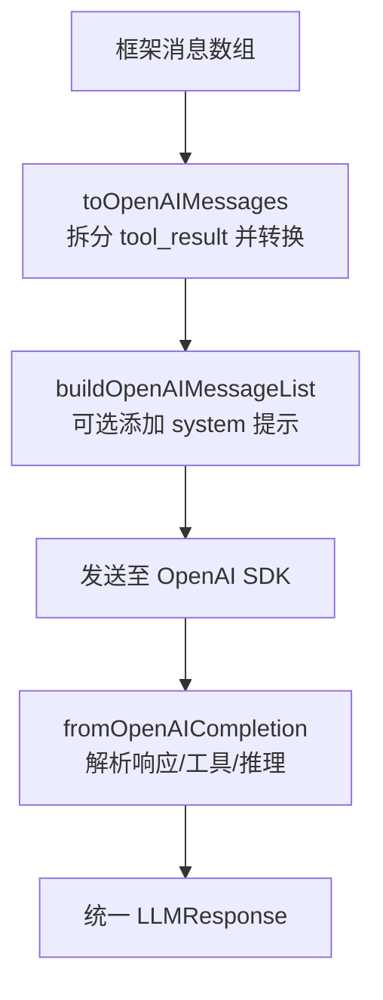
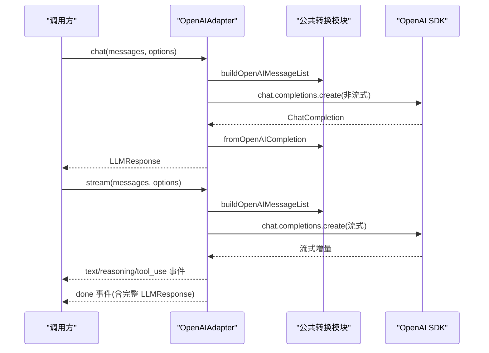
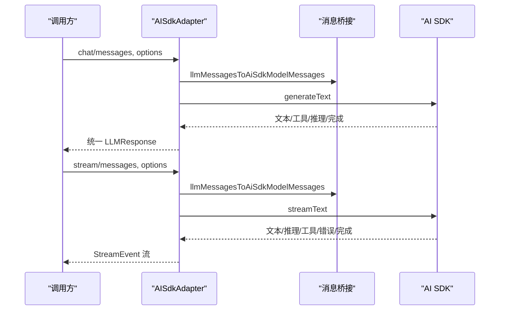
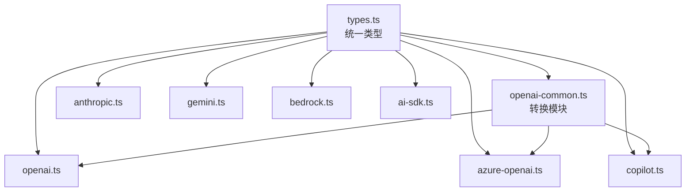

# 适配器架构设计

<cite>
**本文档引用的文件**
- [src/llm/adapter.ts](file://src/llm/adapter.ts)
- [src/llm/openai-common.ts](file://src/llm/openai-common.ts)
- [src/llm/openai.ts](file://src/llm/openai.ts)
- [src/llm/ai-sdk.ts](file://src/llm/ai-sdk.ts)
- [src/tokens.ts](file://src/tokens.ts)
- [src/tool/text-tool-extractor.ts](file://src/tool/text-tool-extractor.ts)
- [src/llm/anthropic.ts](file://src/llm/anthropic.ts)
- [src/llm/azure-openai.ts](file://src/llm/azure-openai.ts)
- [src/llm/bedrock.ts](file://src/llm/bedrock.ts)
- [src/llm/copilot.ts](file://src/llm/copilot.ts)
- [src/llm/gemini.ts](file://src/llm/gemini.ts)
- [src/ai-sdk.ts](file://src/ai-sdk.ts)
- [src/types.ts](file://src/types.ts)
- [examples/providers/azure-openai.ts](file://examples/providers/azure-openai.ts)
- [examples/providers/gemini.ts](file://examples/providers/gemini.ts)
</cite>

## 目录
1. [简介](#简介)
2. [项目结构](#项目结构)
3. [核心组件](#核心组件)
4. [架构总览](#架构总览)
5. [详细组件分析](#详细组件分析)
6. [依赖关系分析](#依赖关系分析)
7. [性能考虑](#性能考虑)
8. [故障排除指南](#故障排除指南)
9. [结论](#结论)
10. [附录](#附录)

## 简介
本文件系统性阐述 Open Multi-Agent 框架的 LLM 适配器架构，重点围绕统一接口抽象、工厂函数与懒加载策略、生命周期与错误处理、环境变量配置、支持的提供商及各自参数、OpenAI 兼容端点与 Vercel AI SDK 集成、以及扩展新提供商的指南与最佳实践。目标是帮助开发者在不改变上层调用方式的前提下，快速集成或替换不同 LLM 提供商，并获得一致的流式与非流式交互体验。

## 项目结构
- 适配器统一入口位于 LLM 子目录，通过工厂函数集中创建具体适配器实例，按需延迟导入，避免不必要的依赖安装与运行时开销。
- 通用 OpenAI 家族转换逻辑抽取到独立模块，被多个适配器复用，确保 wire-format 一致性。
- Vercel AI SDK 适配器提供桥接能力，允许直接使用 AI SDK 的语言模型，同时保持框架内统一的消息与事件模型。
- 类型系统集中于 types.ts，定义内容块、消息、响应、流事件、工具定义等核心数据结构，保证跨适配器的一致性。

图表来源
- [src/llm/adapter.ts:72-131](file://src/llm/adapter.ts#L72-L131)
- [src/llm/openai-common.ts:1-426](file://src/llm/openai-common.ts#L1-L426)
- [src/llm/openai.ts:1-339](file://src/llm/openai.ts#L1-L339)
- [src/llm/ai-sdk.ts:1-368](file://src/llm/ai-sdk.ts#L1-L368)
- [src/types.ts:1-800](file://src/types.ts#L1-L800)

章节来源
- [src/llm/adapter.ts:1-132](file://src/llm/adapter.ts#L1-L132)
- [src/llm/openai-common.ts:1-426](file://src/llm/openai-common.ts#L1-L426)
- [src/llm/openai.ts:1-339](file://src/llm/openai.ts#L1-L339)
- [src/llm/ai-sdk.ts:1-368](file://src/llm/ai-sdk.ts#L1-L368)
- [src/types.ts:1-800](file://src/types.ts#L1-L800)

## 核心组件
- 统一接口：所有适配器实现 LLMAdapter 接口（名称、能力声明、聊天与流式接口），确保上层调用一致。
- 工厂函数：createAdapter 基于提供商字符串返回对应适配器实例；支持懒加载，仅在首次使用时动态导入具体实现。
- 通用转换：OpenAI 兼容族共享转换逻辑（消息、工具、完成结果、结束原因归一化），降低各适配器差异。
- AI SDK 桥接：AISdkAdapter 将框架消息映射为 AI SDK ModelMessage，复用其生成与流式 API。
- 类型系统：types.ts 定义内容块、消息、响应、流事件、工具定义、思考配置等，贯穿整个适配器体系。

章节来源
- [src/llm/adapter.ts:34-131](file://src/llm/adapter.ts#L34-L131)
- [src/llm/openai-common.ts:53-425](file://src/llm/openai-common.ts#L53-L425)
- [src/llm/ai-sdk.ts:186-367](file://src/llm/ai-sdk.ts#L186-L367)
- [src/types.ts:15-187](file://src/types.ts#L15-L187)

## 架构总览
下图展示从工厂函数到具体适配器的调用链路，以及与公共转换模块的关系：

图表来源
- [src/llm/adapter.ts:72-131](file://src/llm/adapter.ts#L72-L131)
- [src/llm/openai-common.ts:148-425](file://src/llm/openai-common.ts#L148-L425)
- [src/llm/openai.ts:101-134](file://src/llm/openai.ts#L101-L134)

## 详细组件分析

### 工厂函数与懒加载策略
- 支持提供商集合：anthropic、azure-openai、bedrock、copilot、deepseek、grok、minimax、openai、gemini、qiniu。
- 参数解析：apiKey/baseURL/region 等参数按提供商约定解析；部分提供商（如 bedrock）忽略 baseURL 并以 region 作为区域参数。
- 懒加载：switch 分支中使用动态 import 加载具体适配器模块，避免一次性引入全部 SDK。
- 错误处理：未知提供商抛出明确错误，便于定位问题。

图表来源
- [src/llm/adapter.ts:72-131](file://src/llm/adapter.ts#L72-L131)

章节来源
- [src/llm/adapter.ts:36-131](file://src/llm/adapter.ts#L36-L131)

### OpenAI 兼容族转换模块
- 输入到 OpenAI：将框架消息转换为 OpenAI Chat Completions 消息数组；tool_result 内容块拆分为独立 tool 角色消息，满足严格顺序要求。
- 输出到框架：解析 OpenAI 完成结果，提取文本、工具调用、推理内容；当本地模型未使用原生 tool_calls 时，回退到从文本中提取工具调用。
- 结束原因归一化：将 finish_reason 映射到框架词汇表，确保上层行为一致。
- 思维回放控制：可选地将推理内容以 <thinking> 文本形式注入请求，兼容部分 OpenAI 家族模型。

图表来源
- [src/llm/openai-common.ts:148-425](file://src/llm/openai-common.ts#L148-L425)

章节来源
- [src/llm/openai-common.ts:53-425](file://src/llm/openai-common.ts#L53-L425)

### OpenAI 适配器
- 能力声明：echoesReasoning 为 'never'，推理内容需通过 <thinking> 文本回放。
- 非流式与流式接口：均复用公共转换模块；流式过程中累积文本与工具调用，最终生成 done 事件。
- 取消信号：通过 AbortSignal 中断长请求。
- 参数映射：温度、采样、工具调用、思维努力等参数映射到 SDK 调用。

图表来源
- [src/llm/openai.ts:101-325](file://src/llm/openai.ts#L101-L325)
- [src/llm/openai-common.ts:412-425](file://src/llm/openai-common.ts#L412-L425)

章节来源
- [src/llm/openai.ts:71-326](file://src/llm/openai.ts#L71-L326)
- [src/llm/openai-common.ts:299-406](file://src/llm/openai-common.ts#L299-L406)

### Azure OpenAI 适配器
- 区域部署端点与版本：通过 AzureOpenAI 客户端处理端点、API 版本与部署名；部署名必须在 agent 配置的 model 字段中填写。
- 与 OpenAI 兼容：沿用公共转换模块，结束原因归一化。
- 参数限制：某些参数（如 top_k、min_p）在托管端点不被接受，已在适配器中规避。

章节来源
- [src/llm/azure-openai.ts:91-335](file://src/llm/azure-openai.ts#L91-L335)

### Anthropic 适配器
- 思维签名：严格要求推理内容携带签名以便多轮扩展思维对话；仅回传自有发出的推理块。
- 工具调用：使用 input_json_delta 累积工具输入 JSON，组装完成后一次性发出 tool_use 事件。
- 参数映射：温度、top_p、top_k、思维配置等映射到 SDK 调用。

章节来源
- [src/llm/anthropic.ts:300-518](file://src/llm/anthropic.ts#L300-L518)

### Google Gemini 适配器
- 内容映射：将框架内容映射为 Part（文本、函数调用、函数结果、图像等），支持思维摘要与签名。
- 工具配置：使用 functionDeclarations 与 AUTO 模式自动调用工具。
- 流式处理：累积文本与工具调用，最终生成包含完整内容的 done 事件。

章节来源
- [src/llm/gemini.ts:366-503](file://src/llm/gemini.ts#L366-L503)

### AWS Bedrock 适配器
- 统一模式：使用 Converse/ConverseStream API，统一 Claude、Llama、Mistral、Cohere、Titan 等家族的消息格式。
- 思维回放：当前为 'never'，因框架尚未在入站路径提取签名字段，后续升级后可调整。
- 推理与工具：流式过程中累积推理文本与工具调用，最终生成 done 事件。

章节来源
- [src/llm/bedrock.ts:216-422](file://src/llm/bedrock.ts#L216-L422)

### GitHub Copilot 适配器
- 认证流程：支持 GitHub OAuth2 设备码流程，自动换取短期会话令牌；支持从环境变量读取现有令牌。
- 端点与头信息：指向 Copilot Chat Completions 端点，设置必要的编辑器标识头。
- 与 OpenAI 兼容：复用公共转换模块，结束原因归一化。

章节来源
- [src/llm/copilot.ts:228-462](file://src/llm/copilot.ts#L228-L462)

### Vercel AI SDK 集成
- 桥接适配器：AISdkAdapter 将框架消息映射为 AI SDK ModelMessage，使用 generateText/streamText。
- 事件模型：文本、推理、工具调用、错误、完成事件与框架一致。
- 供应商选项：通过 providerOptions 传递特定供应商参数（如 reasoningEffort、parallelToolCalls、minP）。

图表来源
- [src/llm/ai-sdk.ts:210-352](file://src/llm/ai-sdk.ts#L210-L352)
- [src/ai-sdk.ts:1-2](file://src/ai-sdk.ts#L1-L2)

章节来源
- [src/llm/ai-sdk.ts:186-367](file://src/llm/ai-sdk.ts#L186-L367)
- [src/ai-sdk.ts:1-2](file://src/ai-sdk.ts#L1-L2)

## 依赖关系分析
- 低耦合高内聚：工厂函数仅负责选择与懒加载，具体适配器内部封装 SDK 差异。
- 复用与共享：OpenAI 兼容族共享转换模块，减少重复实现与维护成本。
- 类型驱动：types.ts 作为单一真相源，确保跨适配器的数据结构一致。

图表来源
- [src/types.ts:1-800](file://src/types.ts#L1-L800)
- [src/llm/openai-common.ts:1-426](file://src/llm/openai-common.ts#L1-L426)
- [src/llm/openai.ts:1-339](file://src/llm/openai.ts#L1-L339)
- [src/llm/azure-openai.ts:1-339](file://src/llm/azure-openai.ts#L1-L339)
- [src/llm/anthropic.ts:1-535](file://src/llm/anthropic.ts#L1-L535)
- [src/llm/gemini.ts:1-504](file://src/llm/gemini.ts#L1-L504)
- [src/llm/bedrock.ts:1-425](file://src/llm/bedrock.ts#L1-L425)
- [src/llm/copilot.ts:1-565](file://src/llm/copilot.ts#L1-L565)
- [src/llm/ai-sdk.ts:1-368](file://src/llm/ai-sdk.ts#L1-L368)

章节来源
- [src/types.ts:1-800](file://src/types.ts#L1-L800)
- [src/llm/openai-common.ts:1-426](file://src/llm/openai-common.ts#L1-L426)

## 性能考虑
- 懒加载：仅在首次使用时导入适配器模块，减少冷启动时间与内存占用。
- 流式处理：优先使用流式接口，边产生边消费，降低首字节延迟与峰值内存。
- 工具调用聚合：在流式场景中累积工具输入 JSON，待完整后再发出 tool_use 事件，避免半成品工具调用。
- 取消信号：通过 AbortSignal 中断长时间请求，避免资源浪费。
- 令牌预算：结合工具输出压缩与上下文策略，控制输入增长，提升吞吐。

## 故障排除指南
- 不支持的提供商：检查 createAdapter 的 provider 是否在受支持列表中，避免拼写错误。
- 环境变量缺失：根据提供商要求设置相应环境变量（如 OPENAI_API_KEY、ANTHROPIC_API_KEY、GEMINI_API_KEY、AZURE_*、AWS_*、GITHUB_*）。
- Azure 部署名：确保 agent 配置的 model 字段为 Azure 部署名而非底层模型名。
- Bedrock 区域：未显式传入 region 时，将回退到 AWS_REGION 或 us-east-1。
- Copilot 认证：若未设置 GITHUB_COPILOT_TOKEN/GITHUB_TOKEN，将触发设备码登录流程。
- 本地 OpenAI 兼容：当本地服务器未返回原生 tool_calls 时，适配器会尝试从文本中提取工具调用，确保功能可用。

章节来源
- [src/llm/adapter.ts:44-131](file://src/llm/adapter.ts#L44-L131)
- [src/llm/azure-openai.ts:70-113](file://src/llm/azure-openai.ts#L70-L113)
- [src/llm/bedrock.ts:235-238](file://src/llm/bedrock.ts#L235-L238)
- [src/llm/copilot.ts:243-253](file://src/llm/copilot.ts#L243-L253)

## 结论
该适配器架构通过统一接口、工厂函数与懒加载策略，实现了对多家 LLM 提供商的无缝接入；借助共享的 OpenAI 兼容转换模块与完善的类型系统，确保了跨适配器的一致性与可维护性。同时，AI SDK 桥接为用户提供了更灵活的集成路径。遵循本文档的最佳实践，可在不修改上层调用方式的前提下，安全、高效地扩展新的提供商或切换现有提供商。

## 附录

### 支持的提供商与配置参数
- anthropic
  - apiKey：环境变量 ANTHROPIC_API_KEY
  - baseURL：可选，覆盖默认端点
- azure-openai
  - apiKey：环境变量 AZURE_OPENAI_API_KEY
  - endpoint：环境变量 AZURE_OPENAI_ENDPOINT
  - apiVersion：环境变量 AZURE_OPENAI_API_VERSION，默认 2024-10-21
  - model：应填入 Azure 部署名（非底层模型名）
- bedrock
  - region：构造函数参数或 AWS_REGION 环境变量，默认 us-east-1
  - baseURL：忽略（使用 AWS 默认凭据链）
- copilot
  - apiKey：优先使用 GITHUB_COPILOT_TOKEN，其次 GITHUB_TOKEN，否则触发设备码登录
  - baseURL：固定为 Copilot 端点，不可覆盖
- deepseek/minimax/grok/qiniu
  - apiKey：对应 PROVIDER_API_KEY 环境变量
  - baseURL：可选，用于 OpenAI 兼容端点（如本地 vLLM/Ollama）
- gemini
  - apiKey：优先 GEMINI_API_KEY，其次 GOOGLE_API_KEY
- openai
  - apiKey：环境变量 OPENAI_API_KEY
  - baseURL：可选，用于 OpenAI 兼容端点

章节来源
- [src/llm/adapter.ts:44-62](file://src/llm/adapter.ts#L44-L62)
- [src/llm/azure-openai.ts:17-27](file://src/llm/azure-openai.ts#L17-L27)
- [src/llm/bedrock.ts:8-14](file://src/llm/bedrock.ts#L8-L14)
- [src/llm/copilot.ts:9-14](file://src/llm/copilot.ts#L9-L14)
- [src/llm/gemini.ts:11-15](file://src/llm/gemini.ts#L11-L15)
- [src/llm/openai.ts:17-20](file://src/llm/openai.ts#L17-L20)

### OpenAI 兼容端点实现要点
- 使用 baseURL 指向本地或第三方 OpenAI 兼容服务（如 Ollama、vLLM、LM Studio）。
- 当本地模型未返回原生 tool_calls 时，适配器会尝试从文本中提取工具调用，保证工具调用链路可用。
- 结束原因归一化，确保上层行为一致。

章节来源
- [src/llm/openai.ts:94-134](file://src/llm/openai.ts#L94-L134)
- [src/llm/openai-common.ts:345-385](file://src/llm/openai-common.ts#L345-L385)

### Vercel AI SDK 集成选项
- 通过 AISdkAdapter 使用任意 @ai-sdk/* 提供的语言模型。
- 支持 generateText 与 streamText，事件模型与框架一致。
- 可通过 providerOptions 传递特定供应商参数（reasoningEffort、parallelToolCalls、minP 等）。

章节来源
- [src/llm/ai-sdk.ts:186-367](file://src/llm/ai-sdk.ts#L186-L367)
- [src/ai-sdk.ts:1-2](file://src/ai-sdk.ts#L1-L2)

### 扩展新提供商适配器指南
- 实现 LLMAdapter 接口：提供 name、capabilities、chat 与 stream 方法。
- 消息与工具映射：将框架内容块映射到目标 SDK 的消息与工具格式；必要时参考 openai-common 的转换思路。
- 流式处理：累积增量内容，最终发出 done 事件；错误时发出 error 事件。
- 取消信号：在 SDK 调用中传入 AbortSignal，支持中断。
- 环境变量与参数：遵循现有命名约定，提供清晰的错误提示。
- 单元测试：覆盖非流式与流式场景，验证事件序列与结束原因归一化。

章节来源
- [src/types.ts:160-187](file://src/types.ts#L160-L187)
- [src/llm/openai-common.ts:148-186](file://src/llm/openai-common.ts#L148-L186)

### 最佳实践建议
- 优先使用流式接口，提升用户体验与资源利用率。
- 合理设置 maxTokens 与采样参数，平衡质量与成本。
- 在团队协作场景中启用共享内存与上下文压缩策略，控制输入增长。
- 对工具调用进行白名单与输出长度限制，确保安全性与稳定性。
- 使用 AbortSignal 控制长请求，避免资源泄漏。
- 针对本地 OpenAI 兼容端点，开启工具调用回退逻辑，增强鲁棒性。

章节来源
- [src/llm/openai-common.ts:345-385](file://src/llm/openai-common.ts#L345-L385)
- [src/llm/openai.ts:140-325](file://src/llm/openai.ts#L140-L325)
- [src/types.ts:409-509](file://src/types.ts#L409-L509)

### 示例参考
- Azure OpenAI 团队协作示例：展示了如何配置 Azure 部署名与默认提供商。
- Google Gemini 团队协作示例：演示了使用官方 SDK 的适配器配置与运行流程。

章节来源
- [examples/providers/azure-openai.ts:1-180](file://examples/providers/azure-openai.ts#L1-L180)
- [examples/providers/gemini.ts:1-162](file://examples/providers/gemini.ts#L1-L162)