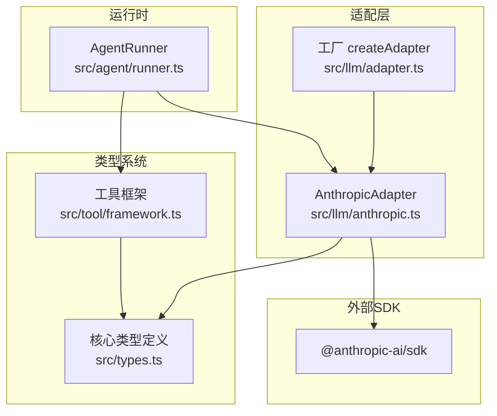
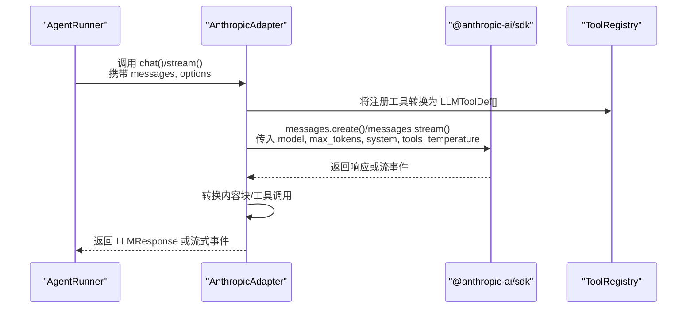
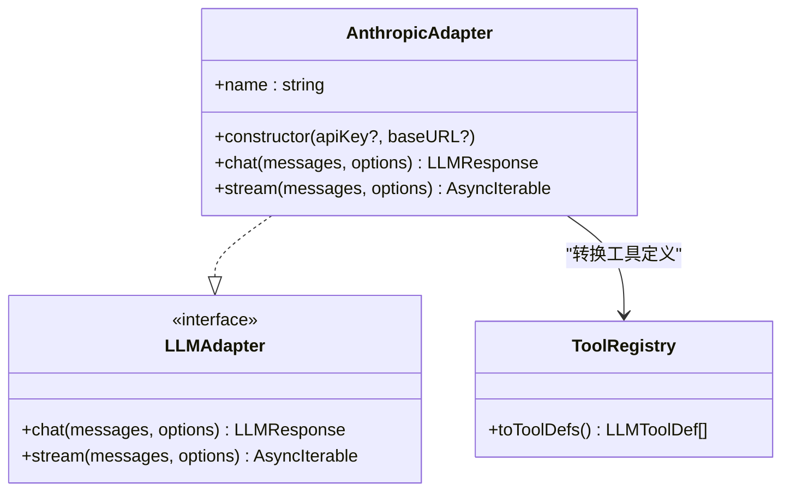
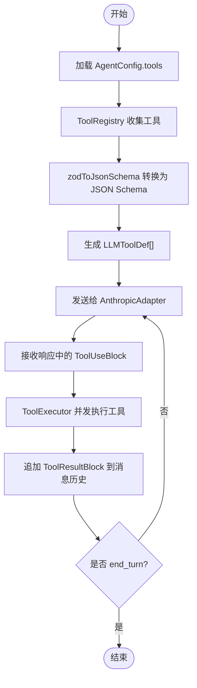
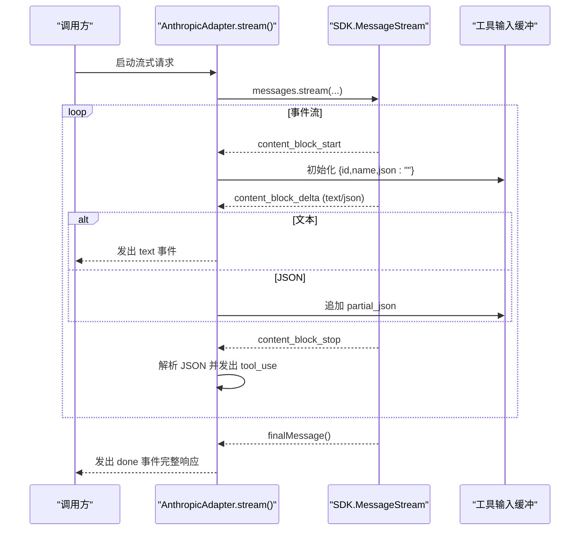
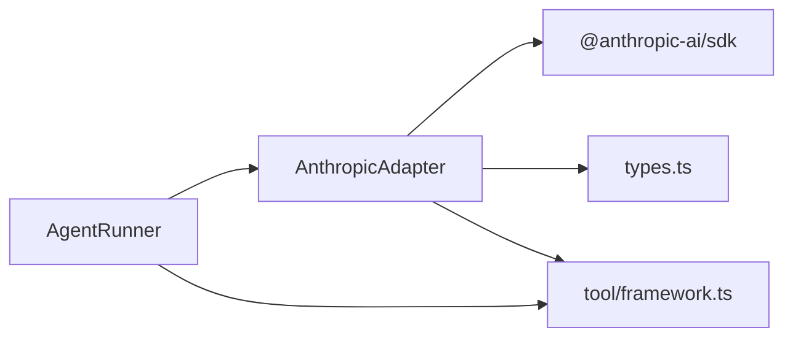

# Anthropic Claude 集成

<cite>
**本文引用的文件**
- [anthropic.ts](file://src/llm/anthropic.ts)
- [adapter.ts](file://src/llm/adapter.ts)
- [types.ts](file://src/types.ts)
- [framework.ts](file://src/tool/framework.ts)
- [runner.ts](file://src/agent/runner.ts)
- [anthropic-adapter.test.ts](file://tests/anthropic-adapter.test.ts)
- [anthropic-e2e.test.ts](file://tests/e2e/anthropic-e2e.test.ts)
- [09-structured-output.ts](file://examples/09-structured-output.ts)
- [CLAUDE.md](file://CLAUDE.md)
</cite>

## 目录
1. [简介](#简介)
2. [项目结构](#项目结构)
3. [核心组件](#核心组件)
4. [架构总览](#架构总览)
5. [详细组件分析](#详细组件分析)
6. [依赖关系分析](#依赖关系分析)
7. [性能考量](#性能考量)
8. [故障排查指南](#故障排查指南)
9. [结论](#结论)
10. [附录](#附录)

## 简介
本文件面向需要在 open-multi-agent 框架中集成 Anthropic Claude 的开发者，系统性说明 AnthropicAdapter 的实现细节与最佳实践，涵盖：
- API 密钥配置与环境变量解析
- 模型参数（如 temperature、maxTokens）传递
- 消息格式转换（文本、图像、工具调用）
- 工具调用与 JSON Schema 验证机制
- 流式与非流式响应处理
- 错误处理策略与重试机制
- 性能优化建议与配置示例

## 项目结构
与 Anthropic 集成相关的核心模块如下：
- LLM 适配层：AnthropicAdapter 实现统一的 LLMAdapter 接口，负责与 @anthropic-ai/sdk 交互
- 类型系统：types.ts 定义了内容块、消息、响应、工具定义等核心类型
- 工具框架：framework.ts 提供工具注册、Zod 到 JSON Schema 的转换
- 运行器：runner.ts 驱动对话循环，提取工具调用并执行
- 工厂：adapter.ts 提供 createAdapter 工厂方法按提供商实例化适配器
- 示例与测试：examples 与 tests 展示配置与行为验证

图表来源
- [anthropic.ts:187-373](file://src/llm/anthropic.ts#L187-L373)
- [adapter.ts:63-98](file://src/llm/adapter.ts#L63-L98)
- [types.ts:14-81](file://src/types.ts#L14-L81)
- [framework.ts:93-203](file://src/tool/framework.ts#L93-L203)
- [runner.ts:166-200](file://src/agent/runner.ts#L166-L200)

章节来源
- [anthropic.ts:1-390](file://src/llm/anthropic.ts#L1-L390)
- [adapter.ts:1-99](file://src/llm/adapter.ts#L1-L99)
- [types.ts:1-200](file://src/types.ts#L1-L200)
- [framework.ts:1-558](file://src/tool/framework.ts#L1-L558)
- [runner.ts:1-200](file://src/agent/runner.ts#L1-L200)

## 核心组件
- AnthropicAdapter：实现 LLMAdapter 接口，封装 @anthropic-ai/sdk 的调用，负责消息与工具定义的双向转换、流式事件聚合与错误透传。
- createAdapter：根据提供商字符串动态导入并实例化对应适配器，支持 Anthropic、OpenAI、Gemini、Grok、Copilot。
- 类型系统：统一的消息、内容块、工具定义、响应与流事件类型，确保跨适配器一致性。
- 工具框架：将 Zod 输入模式转换为 JSON Schema，并生成 LLM 可消费的工具定义。
- AgentRunner：驱动对话循环，提取工具调用、并发执行工具、追加结果并累计 token 使用量。

章节来源
- [anthropic.ts:187-373](file://src/llm/anthropic.ts#L187-L373)
- [adapter.ts:63-98](file://src/llm/adapter.ts#L63-L98)
- [types.ts:14-81](file://src/types.ts#L14-L81)
- [framework.ts:93-203](file://src/tool/framework.ts#L93-L203)
- [runner.ts:166-200](file://src/agent/runner.ts#L166-L200)

## 架构总览
下图展示从 AgentRunner 到 AnthropicAdapter，再到 @anthropic-ai/sdk 的调用链路，以及工具定义与消息格式的转换过程。

图表来源
- [runner.ts:191-200](file://src/agent/runner.ts#L191-L200)
- [anthropic.ts:210-239](file://src/llm/anthropic.ts#L210-L239)
- [anthropic.ts:256-372](file://src/llm/anthropic.ts#L256-L372)
- [framework.ts:162-171](file://src/tool/framework.ts#L162-L171)

## 详细组件分析

### AnthropicAdapter 实现细节
- API 密钥解析顺序
  - 优先使用构造函数传入的 apiKey
  - 否则回退到环境变量 ANTHROPIC_API_KEY
- 模型参数传递
  - model、maxTokens、systemPrompt、tools、temperature、abortSignal 均透传至 SDK
  - 若未显式设置 maxTokens，默认值为 4096
- 消息格式转换
  - 文本、图像、工具调用、工具结果在内部进行双向映射
  - 对于 SDK 不支持的块类型，采用“文本降级”策略避免数据丢失
- 工具定义转换
  - 将 LLMToolDef.inputSchema（已为 JSON Schema 对象）直接映射为 Anthropic 的 input_schema
- 流式处理
  - 使用 SDK 的 MessageStream，累积 input_json_delta 并在 content_block_stop 时解析为完整 JSON
  - 逐段发出 text 事件；在工具输入完整后发出 tool_use 事件；最终发出 done 事件附带完整响应
  - 异常通过 error 事件上抛

图表来源
- [anthropic.ts:187-373](file://src/llm/anthropic.ts#L187-L373)
- [types.ts:105-111](file://src/types.ts#L105-L111)
- [framework.ts:162-171](file://src/tool/framework.ts#L162-L171)

章节来源
- [anthropic.ts:8-22](file://src/llm/anthropic.ts#L8-L22)
- [anthropic.ts:192-197](file://src/llm/anthropic.ts#L192-L197)
- [anthropic.ts:210-239](file://src/llm/anthropic.ts#L210-L239)
- [anthropic.ts:256-372](file://src/llm/anthropic.ts#L256-L372)
- [anthropic.ts:118-140](file://src/llm/anthropic.ts#L118-L140)
- [anthropic.ts:149-175](file://src/llm/anthropic.ts#L149-L175)

### 工具调用与 JSON Schema 验证机制
- 工具定义来源
  - AgentConfig 中的 tools 字段指定可用工具名称
  - ToolRegistry 将注册的 ToolDefinition 转换为 LLMToolDef
- JSON Schema 转换
  - 使用 zodToJsonSchema 将 Zod 输入模式转换为 JSON Schema
  - AnthropicAdapter 在发送前将 LLMToolDef.inputSchema 直接映射为 Anthropic 的 input_schema
- 执行流程
  - AgentRunner 从响应中提取 ToolUseBlock，交由 ToolExecutor 并发执行
  - 工具执行结果以 ToolResultBlock 形式追加回消息历史，驱动下一轮对话

图表来源
- [types.ts:206-209](file://src/types.ts#L206-L209)
- [framework.ts:162-171](file://src/tool/framework.ts#L162-L171)
- [framework.ts:221-433](file://src/tool/framework.ts#L221-L433)
- [runner.ts:134-137](file://src/agent/runner.ts#L134-L137)

章节来源
- [types.ts:206-209](file://src/types.ts#L206-L209)
- [framework.ts:162-171](file://src/tool/framework.ts#L162-L171)
- [framework.ts:221-433](file://src/tool/framework.ts#L221-L433)
- [runner.ts:134-137](file://src/agent/runner.ts#L134-L137)

### 消息格式处理
- 内容块映射
  - TextBlock ↔ text
  - ToolUseBlock ↔ tool_use（含 id、name、input）
  - ToolResultBlock ↔ tool_result（含 tool_use_id、content、is_error）
  - ImageBlock ↔ image（base64，限定媒体类型）
- 消息数组映射
  - LLMMessage.role → Anthropic 的 role
  - LLMMessage.content → ContentBlockParam[]
- 未知块类型的降级策略
  - SDK 新增的块类型（如 thinking）将以文本形式降级，避免数据丢失

章节来源
- [anthropic.ts:61-109](file://src/llm/anthropic.ts#L61-L109)
- [anthropic.ts:118-123](file://src/llm/anthropic.ts#L118-L123)
- [anthropic.ts:149-175](file://src/llm/anthropic.ts#L149-L175)

### 流式处理与事件序列
- 事件类型
  - text：增量文本
  - tool_use：工具调用完成（输入 JSON 解析完毕）
  - done：流结束，附带完整 LLMResponse
  - error：异常事件
- JSON 输入累积
  - content_block_start 初始化缓冲
  - content_block_delta 累积 input_json_delta
  - content_block_stop 解析并发出 tool_use
- 最终消息
  - 通过 stream.finalMessage() 获取完整响应（包含 stop_reason、usage）

图表来源
- [anthropic.ts:256-372](file://src/llm/anthropic.ts#L256-L372)

章节来源
- [anthropic.ts:256-372](file://src/llm/anthropic.ts#L256-L372)

### 工厂与多提供商支持
- createAdapter 根据提供商字符串动态导入对应适配器
- Anthropic 的环境变量回退规则：ANTHROPIC_API_KEY
- 其他提供商的环境变量回退规则详见工厂注释

章节来源
- [adapter.ts:63-98](file://src/llm/adapter.ts#L63-L98)

## 依赖关系分析
- AnthropicAdapter 依赖
  - @anthropic-ai/sdk：实际的 Claude API 客户端
  - types.ts：统一的消息、内容块、工具定义与响应类型
  - tool/framework.ts：工具注册与 JSON Schema 转换
- 运行时耦合
  - AgentRunner 通过 LLMAdapter 抽象与具体适配器解耦
  - 工具执行通过 ToolExecutor 与 ToolRegistry 解耦

图表来源
- [anthropic.ts:24-48](file://src/llm/anthropic.ts#L24-L48)
- [types.ts:14-81](file://src/types.ts#L14-L81)
- [framework.ts:93-203](file://src/tool/framework.ts#L93-L203)
- [runner.ts:166-200](file://src/agent/runner.ts#L166-L200)

章节来源
- [anthropic.ts:24-48](file://src/llm/anthropic.ts#L24-L48)
- [types.ts:14-81](file://src/types.ts#L14-L81)
- [framework.ts:93-203](file://src/tool/framework.ts#L93-L203)
- [runner.ts:166-200](file://src/agent/runner.ts#L166-L200)

## 性能考量
- 并发控制
  - AgentPool（默认 5）与 ToolExecutor（默认 4）限制并发，避免资源争用
- 流式处理
  - 使用 SDK 的 MessageStream 自动处理 SSE 重连，减少网络抖动影响
- 请求参数
  - 合理设置 maxTokens 与 temperature，避免不必要的长输出与高随机性导致的重复生成
- 令牌统计
  - AgentRunner 与各适配器均维护 TokenUsage，便于成本与性能分析

章节来源
- [CLAUDE.md:56-59](file://CLAUDE.md#L56-L59)
- [anthropic.ts:210-239](file://src/llm/anthropic.ts#L210-L239)
- [runner.ts:139-145](file://src/agent/runner.ts#L139-L145)

## 故障排查指南
- 常见错误与处理
  - SDK 抛出的 APIError（如限流、上下文超限）需在调用方捕获并处理
  - 流式过程中异常通过 error 事件上抛，调用方可据此重试或降级
- 单元测试覆盖点
  - 文本消息、工具调用、工具结果、图像消息的双向转换
  - systemPrompt、tools、temperature、abortSignal 的透传
  - 流式事件的累积与解析（含错误 JSON 的降级）
  - 多工具调用场景
- 端到端测试
  - 示例脚本要求设置 ANTHROPIC_API_KEY，验证 chat() 与工具调用返回

章节来源
- [anthropic.ts:203-209](file://src/llm/anthropic.ts#L203-L209)
- [anthropic-adapter.test.ts:244-251](file://tests/anthropic-adapter.test.ts#L244-L251)
- [anthropic-adapter.test.ts:361-375](file://tests/anthropic-adapter.test.ts#L361-L375)
- [anthropic-e2e.test.ts:27-41](file://tests/e2e/anthropic-e2e.test.ts#L27-L41)

## 结论
AnthropicAdapter 通过清晰的类型抽象与严格的格式转换，实现了与 Anthropic Claude 的稳定集成。配合工具框架的 JSON Schema 转换与 AgentRunner 的对话循环，可高效构建具备工具调用能力的智能体系统。建议在生产环境中结合流式处理、并发控制与合理的参数配置，以获得更优的性能与稳定性。

## 附录

### 配置示例与最佳实践
- 标准 API 密钥配置
  - 优先通过构造函数传入 apiKey
  - 未提供时自动读取环境变量 ANTHROPIC_API_KEY
- 企业版/自定义端点
  - 可通过 baseURL 指定自定义端点（如兼容 OpenAI 协议的网关）
- 模型参数设置
  - model：如 claude-sonnet-4-6
  - maxTokens：未设置时默认 4096
  - temperature：采样温度
  - systemPrompt：系统提示词
  - tools：工具列表（需先在 ToolRegistry 注册）
- 工具定义与 JSON Schema
  - 使用 defineTool 定义工具，输入模式采用 Zod
  - 通过 ToolRegistry.toToolDefs() 生成 LLMToolDef[]
  - AnthropicAdapter 直接使用 input_schema
- 结构化输出
  - AgentConfig.outputSchema 可启用 Zod 验证与单次失败重试
- 错误处理与重试
  - SDK 抛出的 APIError 需在调用方捕获
  - 对于任务级失败，可使用 runTasks 的重试配置（最大重试次数、基础延迟、指数退避）
- 性能优化建议
  - 控制并发（AgentPool、ToolExecutor）
  - 合理设置 maxTokens 与 temperature
  - 使用流式接口提升交互体验

章节来源
- [anthropic.ts:8-22](file://src/llm/anthropic.ts#L8-L22)
- [anthropic.ts:192-197](file://src/llm/anthropic.ts#L192-L197)
- [adapter.ts:47-53](file://src/llm/adapter.ts#L47-L53)
- [types.ts:206-211](file://src/types.ts#L206-L211)
- [framework.ts:162-171](file://src/tool/framework.ts#L162-L171)
- [09-structured-output.ts:38-43](file://examples/09-structured-output.ts#L38-L43)
- [anthropic-e2e.test.ts:14-15](file://tests/e2e/anthropic-e2e.test.ts#L14-L15)