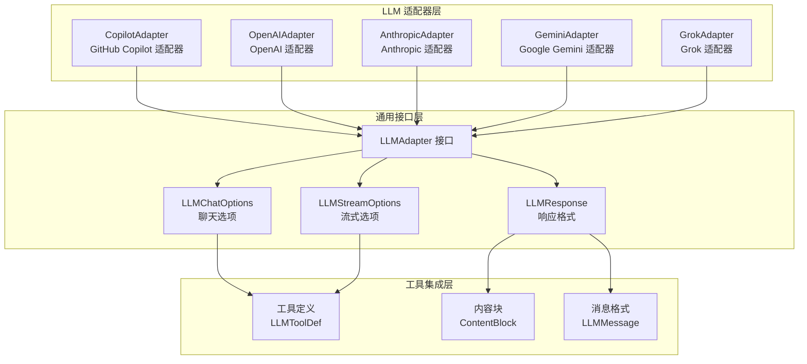
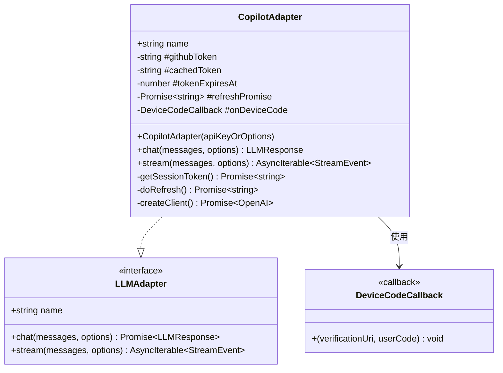
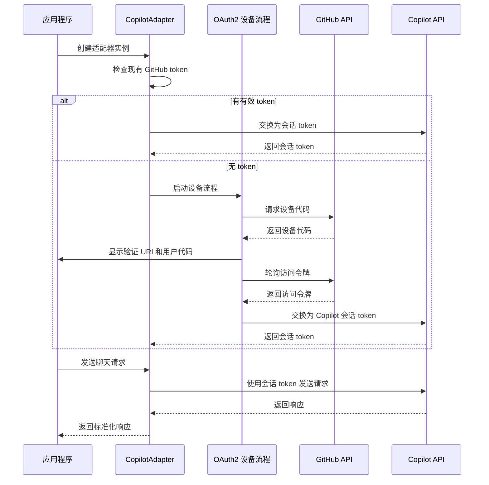
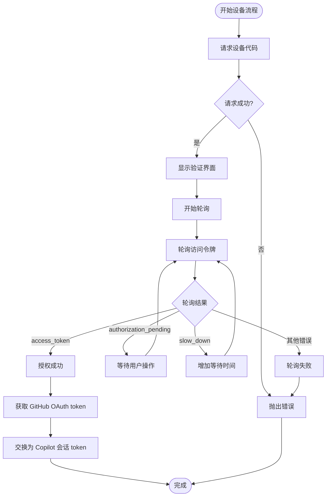
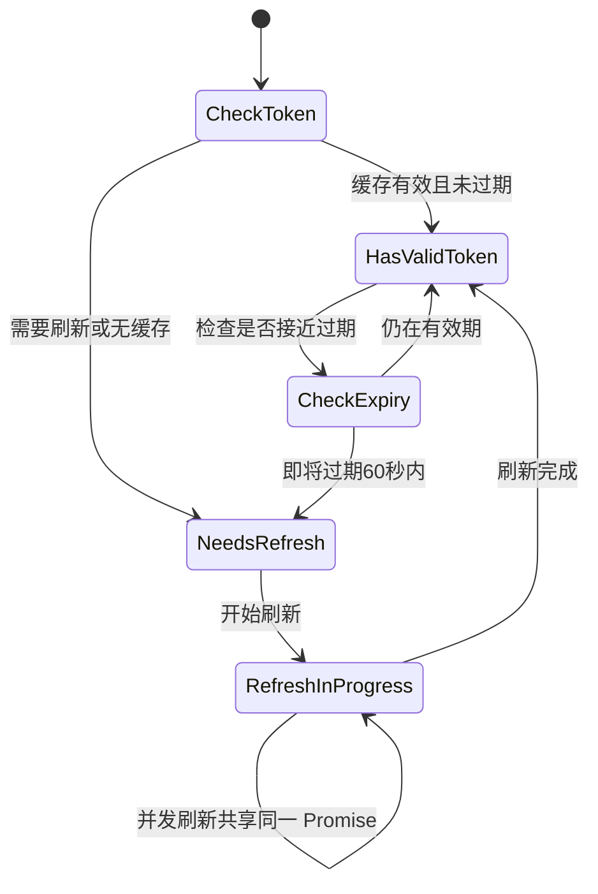
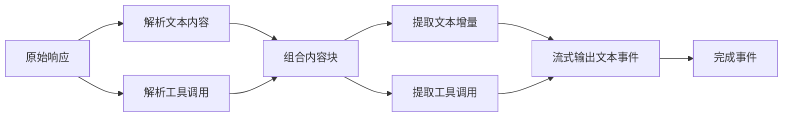
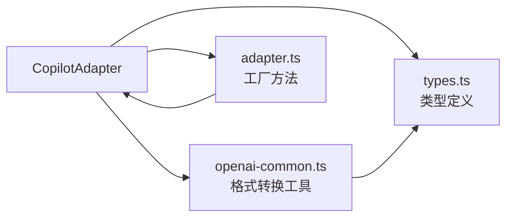

# GitHub Copilot 集成

<cite>
**本文档引用的文件**
- [copilot.ts](file://src/llm/copilot.ts)
- [adapter.ts](file://src/llm/adapter.ts)
- [openai-common.ts](file://src/llm/openai-common.ts)
- [types.ts](file://src/types.ts)
- [05-copilot-test.ts](file://examples/05-copilot-test.ts)
- [copilot-adapter.test.ts](file://tests/copilot-adapter.test.ts)
- [README.md](file://README.md)
- [package.json](file://package.json)
</cite>

## 目录
1. [简介](#简介)
2. [项目结构](#项目结构)
3. [核心组件](#核心组件)
4. [架构概览](#架构概览)
5. [详细组件分析](#详细组件分析)
6. [依赖关系分析](#依赖关系分析)
7. [性能考虑](#性能考虑)
8. [故障排除指南](#故障排除指南)
9. [结论](#结论)
10. [附录](#附录)

## 简介

GitHub Copilot 是一个基于 GitHub 的 AI 代码助手服务，通过 GitHub Copilot Adapter 可以在本框架中作为 LLM 提供商使用。该适配器实现了完整的 OAuth2 设备流程认证机制，支持 GitHub token 设置，并提供了与标准 API 密钥不同的认证方式。

Copilot Adapter 的主要特点：
- 支持多种认证方式：GitHub OAuth token、环境变量、交互式设备流程
- 实现了完整的 OAuth2 设备授权流程
- 提供会话令牌缓存和自动刷新机制
- 兼容 OpenAI Chat Completions API 格式
- 支持工具调用和流式响应

## 项目结构

本项目采用模块化设计，Copilot 集成位于 LLM 适配器层：



**图表来源**
- [adapter.ts:41-98](file://src/llm/adapter.ts#L41-L98)
- [types.ts:526-542](file://src/types.ts#L526-L542)

**章节来源**
- [README.md:137-178](file://README.md#L137-L178)
- [package.json:45-49](file://package.json#L45-L49)

## 核心组件

### CopilotAdapter 类

CopilotAdapter 是 GitHub Copilot 的主要适配器类，实现了 LLMAdapter 接口：



**图表来源**
- [copilot.ts:228-450](file://src/llm/copilot.ts#L228-L450)
- [types.ts:526-542](file://src/types.ts#L526-L542)

### 认证机制

CopilotAdapter 支持四种认证方式，按优先级顺序：

1. **构造函数参数**：直接传入 GitHub OAuth token
2. **环境变量 GITHUB_COPILOT_TOKEN**：首选的环境变量设置
3. **环境变量 GITHUB_TOKEN**：备用的 GitHub token
4. **交互式 OAuth2 设备流程**：当其他方式都不可用时触发

**章节来源**
- [copilot.ts:216-227](file://src/llm/copilot.ts#L216-L227)
- [copilot.ts:237-247](file://src/llm/copilot.ts#L237-L247)

## 架构概览

Copilot 集成的整体架构如下：



**图表来源**
- [copilot.ts:109-169](file://src/llm/copilot.ts#L109-L169)
- [copilot.ts:178-196](file://src/llm/copilot.ts#L178-L196)
- [copilot.ts:284-292](file://src/llm/copilot.ts#L284-L292)

## 详细组件分析

### OAuth2 设备流程实现

设备流程包含三个主要步骤：

1. **请求设备代码**：向 GitHub 发送设备代码请求
2. **用户授权**：通过回调显示验证 URI 和用户代码
3. **轮询令牌**：定期检查用户是否已完成授权



**图表来源**
- [copilot.ts:109-169](file://src/llm/copilot.ts#L109-L169)

### 会话令牌管理

CopilotAdapter 实现了智能的令牌缓存和刷新机制：



**图表来源**
- [copilot.ts:254-282](file://src/llm/copilot.ts#L254-L282)

### 响应处理和工具调用

CopilotAdapter 支持完整的工具调用功能，包括流式处理：



**图表来源**
- [copilot.ts:357-449](file://src/llm/copilot.ts#L357-L449)

**章节来源**
- [copilot.ts:298-449](file://src/llm/copilot.ts#L298-L449)

### 模型定价和多倍系数

Copilot 使用基于请求的定价模型，而非按令牌计费：

| 模型系列 | 多倍系数 | 描述 |
|---------|---------|------|
| GPT-4.1, GPT-4o, GPT-5 mini, Goldeneye, Raptor | 0x | 包含在套餐中 |
| Grok | 0.25x | 代码专用模型 |
| Claude Haiku, Gemini 3 Flash | 0.33x | 基础模型 |
| Claude Sonnet, Gemini 2.5 Pro, GPT-5.x | 1x | 标准付费模型 |
| Claude Opus (fast) | 30x | 快速 Opus 模型 |
| Claude Opus | 3x | 标准 Opus 模型 |

**章节来源**
- [copilot.ts:475-522](file://src/llm/copilot.ts#L475-L522)

## 依赖关系分析

### 外部依赖

Copilot 集成主要依赖以下外部库：

```mermaid
graph TB
subgraph "运行时依赖"
A[openai@^4.73.0<br/>OpenAI SDK]
B[@anthropic-ai/sdk@^0.52.0<br/>Anthropic SDK]
C[zod@^3.23.0<br/>数据验证]
end
subgraph "项目内部模块"
D[CopilotAdapter<br/>适配器实现]
E[LLMAdapter 接口<br/>统一接口]
F[OpenAI 公共工具<br/>格式转换]
end
D --> A
D --> E
D --> F
F --> A
```

**图表来源**
- [package.json:45-49](file://package.json#L45-L49)
- [copilot.ts:27-50](file://src/llm/copilot.ts#L27-L50)

### 内部模块依赖



**图表来源**
- [copilot.ts:45-50](file://src/llm/copilot.ts#L45-L50)
- [adapter.ts:18-32](file://src/llm/adapter.ts#L18-L32)

**章节来源**
- [package.json:45-66](file://package.json#L45-L66)
- [copilot.ts:27-50](file://src/llm/copilot.ts#L27-L50)

## 性能考虑

### 令牌缓存策略

CopilotAdapter 实现了高效的令牌缓存机制：
- **60秒提前刷新**：在令牌到期前60秒开始刷新，避免请求中断
- **并发刷新去重**：多个并发请求共享同一个刷新操作
- **内存缓存**：会话令牌存储在内存中，减少网络往返

### 流式处理优化

流式响应处理具有以下优化特性：
- **增量文本输出**：实时输出文本增量，降低延迟
- **工具调用缓冲**：合并工具调用参数，确保完整性
- **内存高效**：使用 Map 数据结构管理工具调用缓冲

### 错误处理策略

实现包含多层次的错误处理：
- **网络错误重试**：对临时性网络错误进行重试
- **超时控制**：支持 AbortSignal 控制请求超时
- **降级处理**：在设备流程失败时提供清晰的错误信息

## 故障排除指南

### 常见认证问题

**问题1：设备代码过期**
- **症状**：出现 "Device code expired" 错误
- **解决方案**：重新运行适配器，系统会自动重新启动设备流程
- **预防措施**：确保在设备代码过期前完成浏览器授权

**问题2：GitHub token 权限不足**
- **症状**：Copilot token 交换失败，返回 401 错误
- **解决方案**：检查 GitHub token 是否具有 copilot 权限范围
- **预防措施**：使用具有适当权限的 GitHub token

**问题3：环境变量未正确设置**
- **症状**：适配器无法找到有效的 GitHub token
- **解决方案**：
  1. 检查 `GITHUB_COPILOT_TOKEN` 或 `GITHUB_TOKEN` 环境变量
  2. 确认环境变量值不为空
  3. 验证环境变量在当前进程环境中可用

### 性能问题诊断

**问题1：频繁的令牌刷新**
- **症状**：应用日志中频繁出现令牌刷新信息
- **可能原因**：
  - 令牌过期时间设置过短
  - 高并发场景下的令牌竞争
- **解决方案**：
  - 检查并发请求的令牌共享机制
  - 优化应用的并发模式

**问题2：流式响应延迟**
- **症状**：流式响应出现明显的延迟
- **可能原因**：
  - 网络连接不稳定
  - Copilot API 响应较慢
- **解决方案**：
  - 检查网络连接质量
  - 实现适当的超时和重试机制

### 配置问题排查

**问题1：模型选择错误**
- **症状**：使用不支持的模型名称
- **解决方案**：参考支持的模型列表，使用正确的模型名称

**问题2：工具调用失败**
- **症状**：工具调用返回错误或无效结果
- **解决方案**：
  1. 检查工具定义的 JSON Schema
  2. 验证工具输入参数的格式
  3. 确认工具在 Copilot 中可用

**章节来源**
- [copilot-adapter.test.ts:217-232](file://tests/copilot-adapter.test.ts#L217-L232)
- [copilot.ts:163-168](file://src/llm/copilot.ts#L163-L168)

## 结论

GitHub Copilot Adapter 为本框架提供了完整的 GitHub Copilot 集成方案。其主要优势包括：

1. **灵活的认证机制**：支持多种认证方式，适应不同部署场景
2. **完善的错误处理**：包含全面的错误处理和重试机制
3. **高性能实现**：令牌缓存、并发去重等优化措施
4. **标准化接口**：完全兼容 LLMAdapter 接口，易于集成

建议的最佳实践：
- 在生产环境中使用 `GITHUB_COPILOT_TOKEN` 环境变量
- 实现适当的超时和重试机制
- 监控令牌刷新频率和 API 响应时间
- 根据业务需求选择合适的模型和定价计划

## 附录

### 配置示例

**环境变量设置**：
```bash
# 推荐方式：使用 GITHUB_COPILOT_TOKEN
export GITHUB_COPILOT_TOKEN=your_github_copilot_token

# 备用方式：使用 GITHUB_TOKEN
export GITHUB_TOKEN=your_github_token
```

**代码配置示例**：
```typescript
// 方式1：直接传入 token
const adapter = new CopilotAdapter('your_github_token');

// 方式2：使用环境变量
const adapter = new CopilotAdapter();

// 方式3：自定义设备流程回调
const adapter = new CopilotAdapter({
  apiKey: 'your_github_token',
  onDeviceCode: (uri, code) => {
    console.log(`请在浏览器中访问: ${uri}`);
    console.log(`输入验证码: ${code}`);
  }
});
```

**使用示例**：
```typescript
import { OpenMultiAgent } from '@jackchen_me/open-multi-agent';

const orchestrator = new OpenMultiAgent({
  defaultModel: 'gpt-4o',
  defaultProvider: 'copilot',
});

const result = await orchestrator.runAgent({
  name: 'assistant',
  model: 'gpt-4o',
  provider: 'copilot',
  systemPrompt: '你是一个有用的助手。保持答案简洁。',
  maxTurns: 1,
  maxTokens: 256,
}, '2 + 2 等于多少？');
```

**章节来源**
- [README.md:41](file://README.md#L41)
- [05-copilot-test.ts:14-49](file://examples/05-copilot-test.ts#L14-L49)