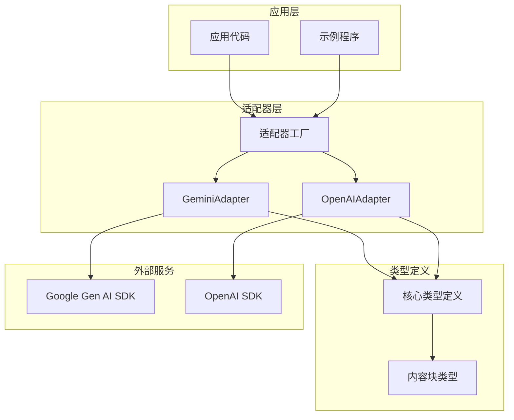
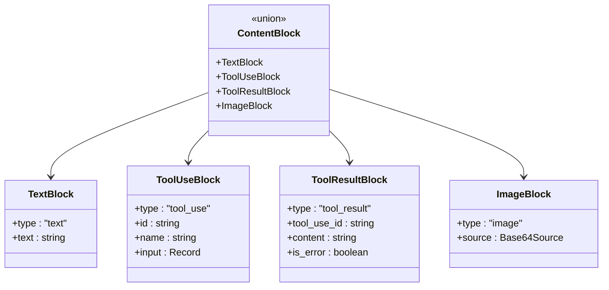
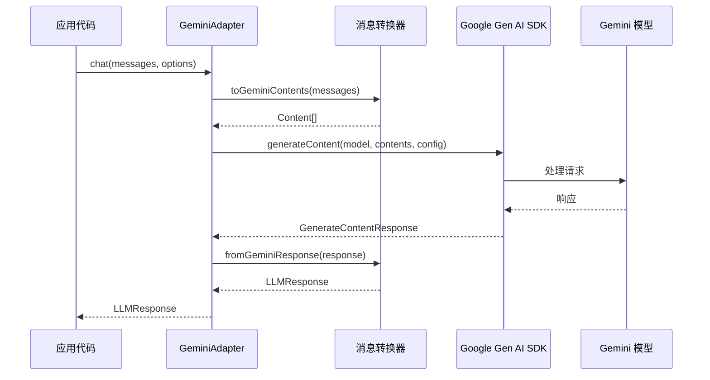
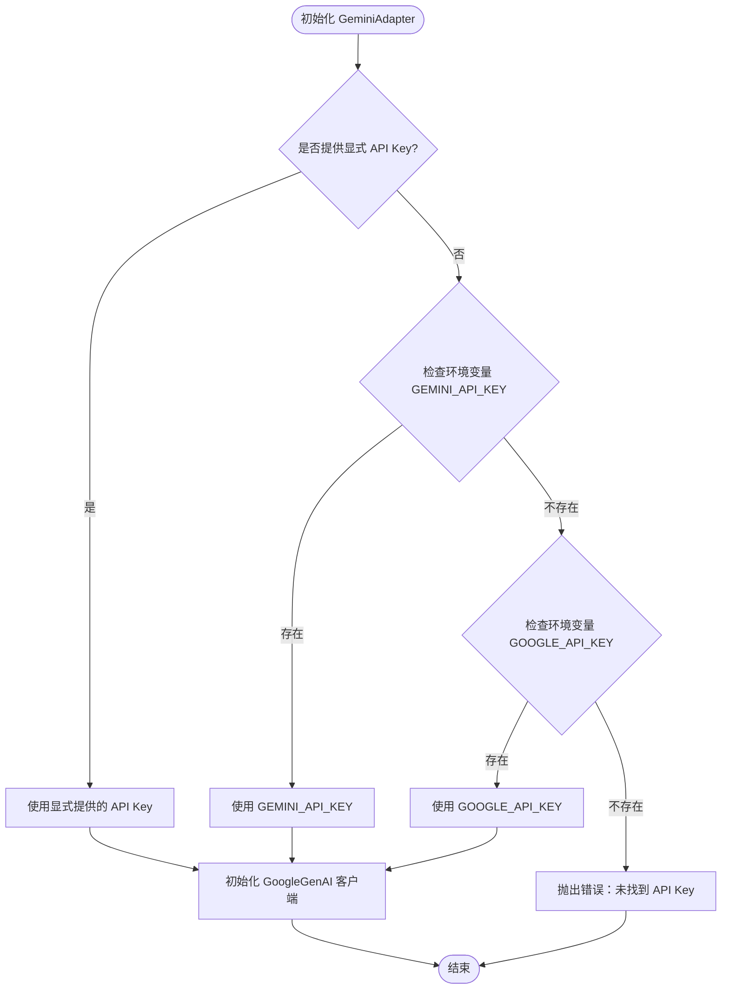
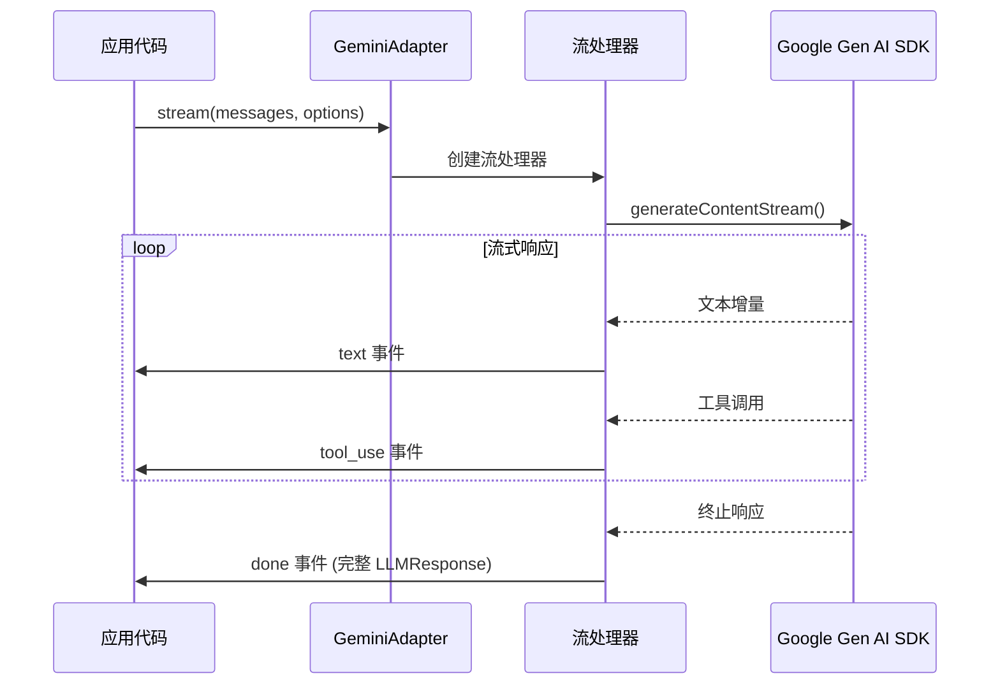
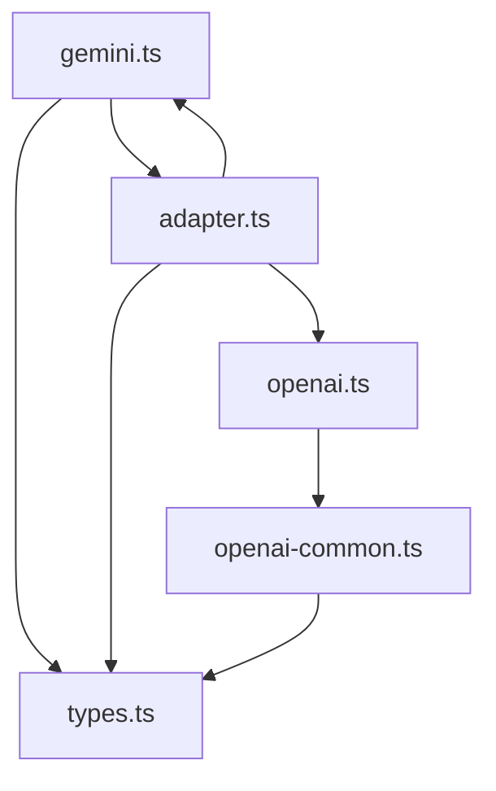

# Google Gemini 集成

<cite>
**本文档引用的文件**
- [gemini.ts](file://src/llm/gemini.ts)
- [types.ts](file://src/types.ts)
- [adapter.ts](file://src/llm/adapter.ts)
- [openai-common.ts](file://src/llm/openai-common.ts)
- [13-gemini.ts](file://examples/13-gemini.ts)
- [06-local-model.ts](file://examples/06-local-model.ts)
- [gemini-adapter.test.ts](file://tests/gemini-adapter.test.ts)
- [gemini-adapter-contract.test.ts](file://tests/gemini-adapter-contract.test.ts)
- [gemini-e2e.test.ts](file://tests/e2e/gemini-e2e.test.ts)
- [package.json](file://package.json)
</cite>

## 目录
1. [简介](#简介)
2. [项目结构](#项目结构)
3. [核心组件](#核心组件)
4. [架构概览](#架构概览)
5. [详细组件分析](#详细组件分析)
6. [依赖关系分析](#依赖关系分析)
7. [性能考虑](#性能考虑)
8. [故障排除指南](#故障排除指南)
9. [结论](#结论)
10. [附录](#附录)

## 简介

本文件详细说明了 Google Gemini LLM 集成的实现特点，重点涵盖以下方面：
- GeminiAdapter 的实现细节，包括 API 密钥配置和模型选择
- Gemini 的多模态能力，包括文本、图像和工具调用的处理方式
- Gemini 特有的内容块（ContentBlock）概念和数据结构
- 完整的配置示例和使用场景，包括本地模型兼容性说明
- 与 OpenAI 兼容接口的区别和优势，提供迁移指南和最佳实践

## 项目结构

该项目采用模块化设计，Gemini 集成位于 `src/llm/gemini.ts`，并通过适配器工厂模式统一管理不同 LLM 提供商的接入。整体结构如下：



**图表来源**
- [adapter.ts:63-98](file://src/llm/adapter.ts#L63-L98)
- [gemini.ts:249-379](file://src/llm/gemini.ts#L249-L379)

**章节来源**
- [adapter.ts:1-99](file://src/llm/adapter.ts#L1-L99)
- [package.json:45-67](file://package.json#L45-L67)

## 核心组件

### GeminiAdapter 类

GeminiAdapter 是 Google Gemini 的适配器实现，实现了统一的 LLMAdapter 接口。其核心特性包括：

- **线程安全**：单个实例可在并发代理运行中共享使用
- **无状态客户端**：底层 SDK 客户端在请求间保持无状态
- **统一 API 接口**：提供 chat() 和 stream() 两种调用方式

### 内容块（ContentBlock）系统

框架定义了统一的内容块类型系统，支持多种内容类型：



**图表来源**
- [types.ts:14-53](file://src/types.ts#L14-L53)

**章节来源**
- [gemini.ts:249-379](file://src/llm/gemini.ts#L249-L379)
- [types.ts:14-81](file://src/types.ts#L14-L81)

## 架构概览

Gemini 集成采用分层架构设计，确保与上游框架的解耦和与下游 SDK 的松耦合：



**图表来源**
- [gemini.ts:271-282](file://src/llm/gemini.ts#L271-L282)
- [gemini.ts:74-134](file://src/llm/gemini.ts#L74-L134)
- [gemini.ts:194-237](file://src/llm/gemini.ts#L194-L237)

## 详细组件分析

### API 密钥配置

GeminiAdapter 支持灵活的 API 密钥配置机制：



**图表来源**
- [gemini.ts:254-258](file://src/llm/gemini.ts#L254-L258)

配置优先级：
1. 构造函数参数传入的 API Key
2. 环境变量 `GEMINI_API_KEY`
3. 环境变量 `GOOGLE_API_KEY`

**章节来源**
- [gemini.ts:11-14](file://src/llm/gemini.ts#L11-L14)
- [gemini.ts:254-258](file://src/llm/gemini.ts#L254-L258)
- [gemini-adapter.test.ts:30-82](file://tests/gemini-adapter.test.ts#L30-L82)

### 模型选择与配置

GeminiAdapter 支持多种 Gemini 模型，包括但不限于：

- `gemini-2.5-flash`: 快速响应模型
- `gemini-2.0-flash`: 通用闪存模型  
- `gemini-3-flash`: 新一代闪存模型
- `gemini-3-pro`: 专业级模型
- `gemini-3.1-pro`: 最新专业模型

模型配置选项：
- `maxTokens`: 最大输出令牌数（默认 4096）
- `temperature`: 采样温度
- `systemPrompt`: 系统指令
- `tools`: 工具定义数组

**章节来源**
- [gemini.ts:155-167](file://src/llm/gemini.ts#L155-L167)
- [gemini-e2e.test.ts:15](file://tests/e2e/gemini-e2e.test.ts#L15)

### 多模态能力实现

GeminiAdapter 完整支持多模态输入，包括文本、图像和工具调用：

#### 文本处理
- 直接映射到 Gemini 的 `text` 部件
- 保持原有的文本流式传输特性

#### 图像处理
- 将 base64 编码的图像转换为 `inlineData` 部件
- 支持多种媒体类型（PNG、JPG 等）

#### 工具调用处理
- `tool_use` 块转换为 `functionCall` 部件
- `tool_result` 块转换为 `functionResponse` 部件
- 自动处理工具调用 ID 的解析和回溯

**章节来源**
- [gemini.ts:117-124](file://src/llm/gemini.ts#L117-L124)
- [gemini.ts:91-115](file://src/llm/gemini.ts#L91-L115)
- [gemini-adapter-contract.test.ts:123-133](file://tests/gemini-adapter-contract.test.ts#L123-L133)

### 内容块（ContentBlock）概念详解

ContentBlock 是框架的核心抽象，定义了统一的消息格式：

```mermaid
erDiagram
CONTENT_BLOCK {
string type
string id
string name
record input
string tool_use_id
string content
boolean is_error
object source
}
TEXT_BLOCK {
string type = "text"
string text
}
TOOL_USE_BLOCK {
string type = "tool_use"
string id
string name
record input
}
TOOL_RESULT_BLOCK {
string type = "tool_result"
string tool_use_id
string content
boolean is_error
}
IMAGE_BLOCK {
string type = "image"
string media_type
string data
}
CONTENT_BLOCK ||--|| TEXT_BLOCK : "包含"
CONTENT_BLOCK ||--|| TOOL_USE_BLOCK : "包含"
CONTENT_BLOCK ||--|| TOOL_RESULT_BLOCK : "包含"
CONTENT_BLOCK ||--|| IMAGE_BLOCK : "包含"
```

**图表来源**
- [types.ts:14-53](file://src/types.ts#L14-L53)

**章节来源**
- [types.ts:14-53](file://src/types.ts#L14-L53)

### 流式处理机制

GeminiAdapter 提供完整的流式处理支持，遵循统一的事件序列：



**图表来源**
- [gemini.ts:305-377](file://src/llm/gemini.ts#L305-L377)

流式处理保证：
- 文本增量事件按顺序到达
- 工具调用事件按调用顺序到达
- 终止事件携带完整的响应信息

**章节来源**
- [gemini.ts:288-304](file://src/llm/gemini.ts#L288-L304)
- [gemini.ts:305-377](file://src/llm/gemini.ts#L305-L377)

## 依赖关系分析

### 外部依赖

项目对外部依赖采用可选依赖策略，确保灵活性：

```mermaid
graph TB
subgraph "核心依赖"
NodeJS[Node.js >= 18.0.0]
Zod[Zod 数据验证]
end
subgraph "必需依赖"
Anthropic[Anthropic SDK]
OpenAI[OpenAI SDK]
end
subgraph "可选依赖"
GeminiSDK[@google/genai ^1.48.0]
end
subgraph "开发依赖"
TestSuite[Vitest 测试框架]
TypeScript[TypeScript 编译器]
end
NodeJS --> GeminiSDK
NodeJS --> OpenAI
NodeJS --> Anthropic
NodeJS --> Zod
```

**图表来源**
- [package.json:45-67](file://package.json#L45-L67)

### 内部依赖关系



**图表来源**
- [gemini.ts:28-49](file://src/llm/gemini.ts#L28-L49)
- [adapter.ts:18-32](file://src/llm/adapter.ts#L18-L32)

**章节来源**
- [package.json:45-67](file://package.json#L45-L67)
- [adapter.ts:18-99](file://src/llm/adapter.ts#L18-L99)

## 性能考虑

### 并发处理
- GeminiAdapter 是线程安全的，可安全地在多个并发任务中共享
- 底层 SDK 客户端在每次请求间保持无状态，减少内存占用

### 流式传输优化
- 使用流式 API 减少延迟，提高用户体验
- 按需处理增量内容，避免一次性加载大量数据

### 缓存策略
- 建议在应用层面实现适当的缓存机制
- 对于重复的工具调用结果，可考虑本地缓存以减少 API 调用

## 故障排除指南

### 常见问题及解决方案

#### API 密钥配置问题
- **问题**：适配器无法初始化
- **原因**：未设置有效的 API Key
- **解决**：检查环境变量或构造函数参数

#### 模型不可用
- **问题**：调用模型时返回错误
- **原因**：指定的模型名称不正确或权限不足
- **解决**：确认模型名称拼写正确，并检查 API 权限

#### 工具调用失败
- **问题**：工具调用返回错误或无响应
- **原因**：工具定义不匹配或工具执行异常
- **解决**：验证工具定义的 JSON Schema 和工具实现

**章节来源**
- [gemini-adapter.test.ts:30-91](file://tests/gemini-adapter.test.ts#L30-L91)
- [gemini-adapter-contract.test.ts:140-181](file://tests/gemini-adapter-contract.test.ts#L140-L181)

## 结论

Google Gemini 集成提供了完整的多模态 LLM 能力，具有以下优势：

1. **统一接口**：通过标准化的 ContentBlock 系统，简化了多模态内容的处理
2. **灵活配置**：支持多种配置选项，满足不同应用场景的需求
3. **流式处理**：提供高效的流式传输机制，改善用户体验
4. **多模态支持**：原生支持文本、图像等多种内容类型的处理
5. **工具集成**：完善的工具调用机制，支持复杂的自动化工作流

该实现为开发者提供了强大的 Gemini 集成功能，同时保持了与框架其他组件的良好兼容性。

## 附录

### 配置示例

#### 基础配置
```typescript
// 使用环境变量配置
const adapter = new GeminiAdapter();

// 显式指定 API Key
const adapterWithKey = new GeminiAdapter('your-api-key-here');
```

#### 模型配置示例
```typescript
const options = {
  model: 'gemini-2.5-flash',
  maxTokens: 1024,
  temperature: 0.7,
  systemPrompt: '你是一个有用的助手',
  tools: [
    {
      name: 'weather_tool',
      description: '获取天气信息',
      inputSchema: {
        type: 'object',
        properties: {
          city: { type: 'string' }
        },
        required: ['city']
      }
    }
  ]
};
```

#### 本地模型兼容性
虽然 Gemini 本身是云端服务，但框架支持通过 OpenAI 兼容接口连接本地模型：

```typescript
// 连接到本地 Ollama 模型
const localAdapter = new OpenAIAdapter('ollama', 'http://localhost:11434/v1');
```

**章节来源**
- [13-gemini.ts:13-37](file://examples/13-gemini.ts#L13-L37)
- [06-local-model.ts:51-68](file://examples/06-local-model.ts#L51-L68)

### 迁移指南

从其他 LLM 提供商迁移到 Gemini 的步骤：

1. **安装依赖**
   ```bash
   npm install @google/genai
   ```

2. **更新配置**
   - 移除旧的 API Key 环境变量
   - 设置新的 Gemini API Key 环境变量

3. **代码修改**
   - 更新适配器创建方式
   - 调整模型名称和配置选项

4. **测试验证**
   - 运行现有测试确保功能正常
   - 验证多模态功能的正确性

### 最佳实践

1. **错误处理**
   - 实现适当的重试机制
   - 处理网络超时和 API 限制

2. **性能优化**
   - 合理设置 maxTokens 参数
   - 使用流式处理改善响应时间

3. **安全性**
   - 不要在客户端代码中硬编码 API Key
   - 使用环境变量管理敏感信息

4. **监控**
   - 记录 API 调用统计信息
   - 监控响应时间和错误率