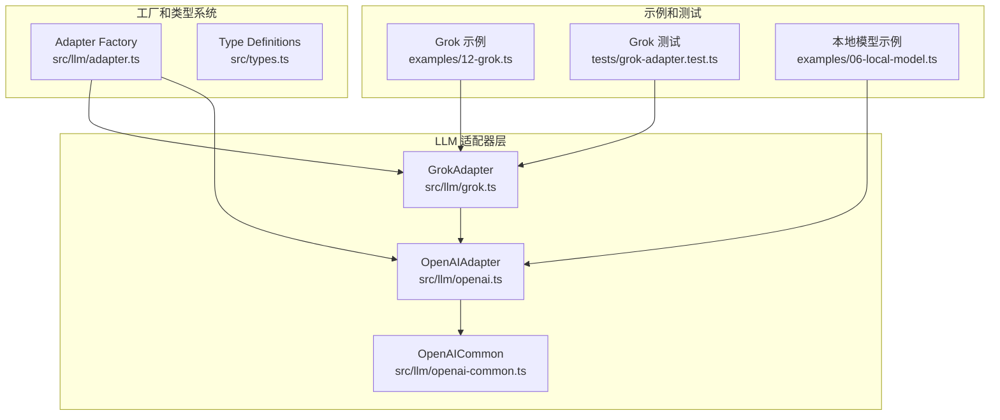
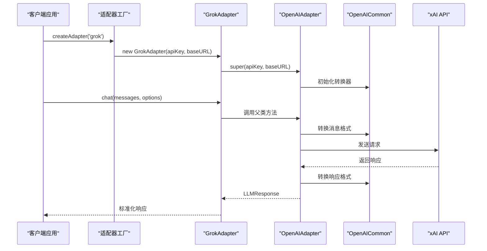
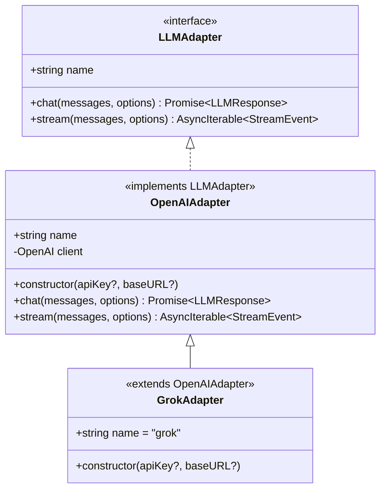
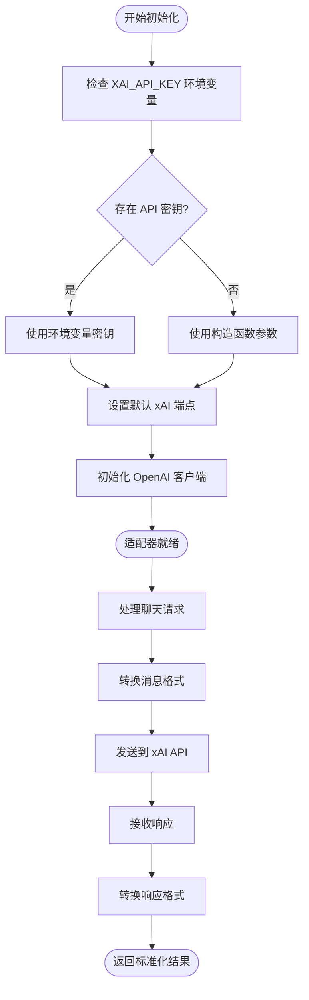
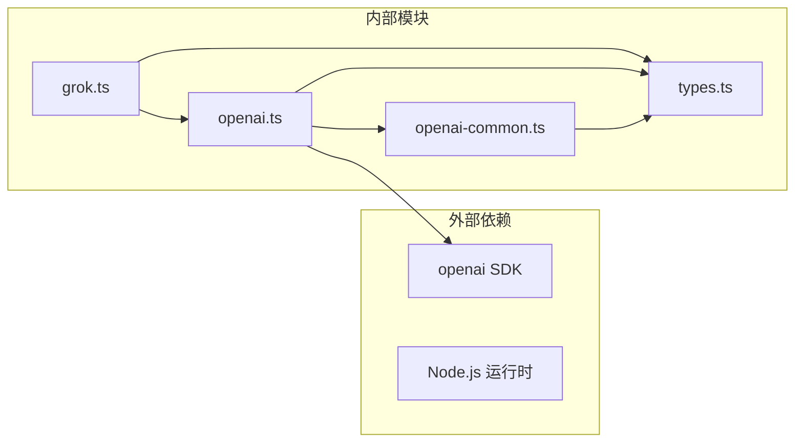

# Grok 集成

<cite>
**本文档引用的文件**
- [grok.ts](file://src/llm/grok.ts)
- [openai-common.ts](file://src/llm/openai-common.ts)
- [openai.ts](file://src/llm/openai.ts)
- [adapter.ts](file://src/llm/adapter.ts)
- [types.ts](file://src/types.ts)
- [12-grok.ts](file://examples/12-grok.ts)
- [grok-adapter.test.ts](file://tests/grok-adapter.test.ts)
- [06-local-model.ts](file://examples/06-local-model.ts)
- [README.md](file://README.md)
</cite>

## 目录
1. [简介](#简介)
2. [项目结构](#项目结构)
3. [核心组件](#核心组件)
4. [架构概览](#架构概览)
5. [详细组件分析](#详细组件分析)
6. [依赖关系分析](#依赖关系分析)
7. [性能考虑](#性能考虑)
8. [故障排除指南](#故障排除指南)
9. [结论](#结论)

## 简介

Grok 集成是 open-multi-agent 框架中的一个关键功能模块，它提供了对 xAI Grok 模型的无缝支持。Grok 是由 xAI 开发的高性能语言模型系列，特别专注于代码生成和编程任务。本集成通过 GrokAdapter 类实现了对 Grok 模型的完整支持，包括同步聊天、流式响应、工具调用等功能。

Grok 集成的核心特点包括：
- 基于 OpenAI 兼容接口的无缝集成
- 自动化的 API 密钥管理和环境变量支持
- 完整的工具调用协议支持
- 流式响应处理能力
- 与框架其他组件的深度集成

## 项目结构

Grok 集成在项目中的组织结构如下：



**图表来源**
- [grok.ts:1-30](file://src/llm/grok.ts#L1-L30)
- [openai.ts:1-293](file://src/llm/openai.ts#L1-L293)
- [adapter.ts:1-99](file://src/llm/adapter.ts#L1-L99)

**章节来源**
- [grok.ts:1-30](file://src/llm/grok.ts#L1-L30)
- [adapter.ts:1-99](file://src/llm/adapter.ts#L1-L99)

## 核心组件

### GrokAdapter 类

GrokAdapter 是 Grok 集成的核心组件，它继承自 OpenAIAdapter 并专门针对 xAI API 进行了定制。这个类提供了以下关键功能：

#### 主要特性
- **线程安全设计**：可以在多个代理之间共享实例
- **默认端点配置**：自动使用官方 xAI API 端点
- **环境变量支持**：自动读取 XAI_API_KEY 环境变量
- **可选覆盖机制**：允许自定义 baseURL 和 API 密钥

#### 构造函数参数
- `apiKey?: string` - 可选的 API 密钥覆盖
- `baseURL?: string` - 可选的自定义基础 URL

#### 实现细节
GrokAdapter 通过硬编码官方 xAI 端点 (`https://api.x.ai/v1`) 和 XAI_API_KEY 环境变量来确保与官方 API 的兼容性。

**章节来源**
- [grok.ts:19-28](file://src/llm/grok.ts#L19-L28)

### OpenAI 兼容层

GrokAdapter 继承自 OpenAIAdapter，这意味着它完全兼容 OpenAI 的 Chat Completions API。这种设计提供了以下优势：

#### 协议兼容性
- **消息格式**：完全遵循 OpenAI 的消息格式规范
- **工具调用**：支持标准的 tool_calls 协议
- **流式处理**：提供一致的流式响应接口
- **错误处理**：使用相同的错误处理模式

#### 转换层
OpenAICommon 模块提供了必要的数据格式转换功能，确保与框架内部的数据结构保持一致。

**章节来源**
- [openai-common.ts:1-295](file://src/llm/openai-common.ts#L1-L295)
- [openai.ts:68-78](file://src/llm/openai.ts#L68-L78)

## 架构概览

Grok 集成采用分层架构设计，确保了良好的可扩展性和维护性：



**图表来源**
- [adapter.ts:63-98](file://src/llm/adapter.ts#L63-L98)
- [grok.ts:22-28](file://src/llm/grok.ts#L22-L28)
- [openai.ts:91-110](file://src/llm/openai.ts#L91-L110)

## 详细组件分析

### GrokAdapter 类结构



**图表来源**
- [types.ts:526-542](file://src/types.ts#L526-L542)
- [openai.ts:68-78](file://src/llm/openai.ts#L68-L78)
- [grok.ts:19-28](file://src/llm/grok.ts#L19-L28)

### 配置和初始化流程



**图表来源**
- [grok.ts:22-28](file://src/llm/grok.ts#L22-L28)
- [openai.ts:73-78](file://src/llm/openai.ts#L73-L78)

### 数据流处理

GrokAdapter 在数据处理方面遵循严格的格式转换规则：

#### 输入消息转换
- 将框架内部的消息格式转换为 OpenAI 兼容格式
- 处理工具调用的特殊消息类型
- 支持多模态内容（文本和图像）

#### 输出响应处理
- 将 OpenAI 响应转换为框架统一格式
- 提取工具调用信息
- 标准化停止原因

**章节来源**
- [openai-common.ts:64-95](file://src/llm/openai-common.ts#L64-L95)
- [openai-common.ts:178-255](file://src/llm/openai-common.ts#L178-L255)

## 依赖关系分析

### 外部依赖

Grok 集成主要依赖以下外部组件：



**图表来源**
- [grok.ts:8](file://src/llm/grok.ts#L8)
- [openai.ts:33](file://src/llm/openai.ts#L33)

### 内部耦合关系

Grok 集成与其他模块的交互关系：

#### 工厂模式集成
- 通过适配器工厂实现延迟加载
- 支持动态提供商选择
- 统一的初始化流程

#### 类型系统集成
- 完全符合 LLMAdapter 接口规范
- 使用统一的消息和响应格式
- 支持流式事件处理

**章节来源**
- [adapter.ts:63-98](file://src/llm/adapter.ts#L63-L98)
- [types.ts:526-542](file://src/types.ts#L526-L542)

## 性能考虑

### 本地模型支持

虽然 Grok 主要作为云端服务提供，但框架同样支持本地部署的 OpenAI 兼容模型：

#### 支持的本地服务器
- **Ollama**：`http://localhost:11434/v1`
- **vLLM**：`http://localhost:8000/v1`
- **LM Studio**：`http://localhost:1234/v1`
- **llama.cpp**：`http://localhost:8080/v1`

#### 本地模型配置
```typescript
const localAgent: AgentConfig = {
  name: 'local',
  model: 'llama3.1',
  provider: 'openai', // 使用 OpenAI 兼容协议
  baseURL: 'http://localhost:11434/v1',
  apiKey: 'ollama', // 占位符，Ollama 忽略实际值
  tools: ['bash', 'file_read'],
  timeoutMs: 120_000, // 2 分钟超时
}
```

### 性能优化建议

#### 1. 连接池管理
- GrokAdapter 是线程安全的，可以安全地在多个代理间共享
- 避免为每个请求创建新的适配器实例

#### 2. 缓存策略
- 对于重复的查询，考虑实现应用级缓存
- 合理设置模型参数以平衡质量和性能

#### 3. 错误重试
- 利用框架的内置重试机制
- 设置合理的超时时间防止长时间阻塞

**章节来源**
- [06-local-model.ts:51-68](file://examples/06-local-model.ts#L51-L68)
- [README.md:214-226](file://README.md#L214-L226)

## 故障排除指南

### 常见问题和解决方案

#### 1. API 密钥问题
**问题**：`XAI_API_KEY` 环境变量未正确设置
**解决方案**：
- 确保环境变量已正确设置
- 检查密钥的有效性和权限范围
- 验证网络连接是否正常

#### 2. 网络连接问题
**问题**：无法连接到 xAI API
**解决方案**：
- 检查防火墙设置
- 验证代理配置
- 确认网络连通性

#### 3. 工具调用失败
**问题**：模型无法正确执行工具调用
**解决方案**：
- 确保使用的模型支持工具调用
- 检查工具定义的 JSON Schema
- 验证工具名称的一致性

#### 4. 本地模型兼容性
**问题**：本地模型不支持工具调用
**解决方案**：
- 确认模型在 Ollama 的 Tools 分类中
- 更新到最新版本的 Ollama
- 检查模型配置是否正确

### 调试技巧

#### 1. 日志记录
启用详细的日志记录来跟踪请求和响应：
- 记录 API 请求的详细信息
- 监控响应时间和错误率
- 跟踪工具调用的执行情况

#### 2. 性能监控
- 监控 token 使用量
- 跟踪响应延迟
- 分析并发性能

**章节来源**
- [README.md:228-232](file://README.md#L228-L232)

## 结论

Grok 集成通过 GrokAdapter 提供了对 xAI Grok 模型的完整支持，具有以下优势：

### 技术优势
- **简洁的设计**：基于继承的最小实现，减少了代码复杂性
- **强大的兼容性**：完全兼容 OpenAI 的 API 规范
- **灵活的配置**：支持多种部署方式和配置选项
- **完善的测试**：包含全面的单元测试和集成测试

### 使用场景
- **代码生成**：利用 Grok 的代码优化能力
- **多代理协作**：在团队协作中发挥重要作用
- **本地部署**：支持 OpenAI 兼容的本地模型
- **生产环境**：提供稳定可靠的 API 集成

### 最佳实践
- 正确设置环境变量和 API 密钥
- 合理配置模型参数以平衡性能和质量
- 实施适当的错误处理和重试机制
- 监控使用情况和性能指标

Grok 集成为 open-multi-agent 框架提供了强大的语言模型支持，使得开发者能够轻松地构建复杂的多代理应用程序。