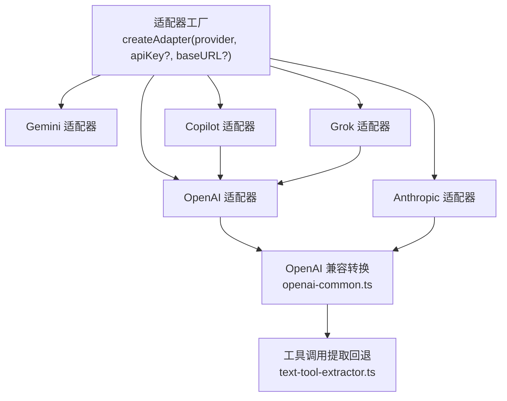
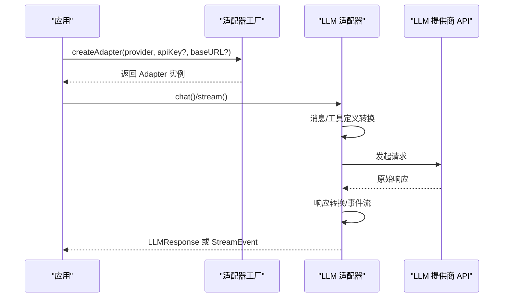
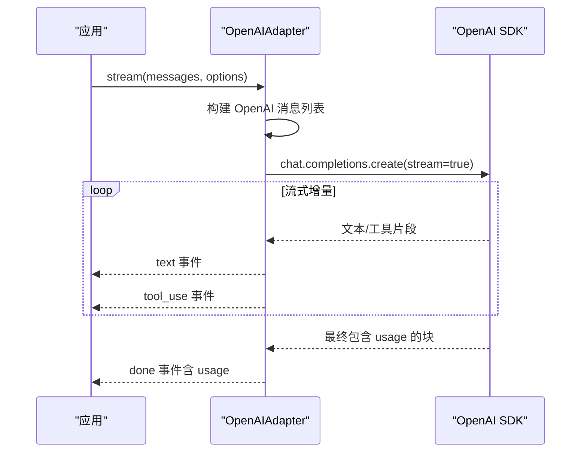
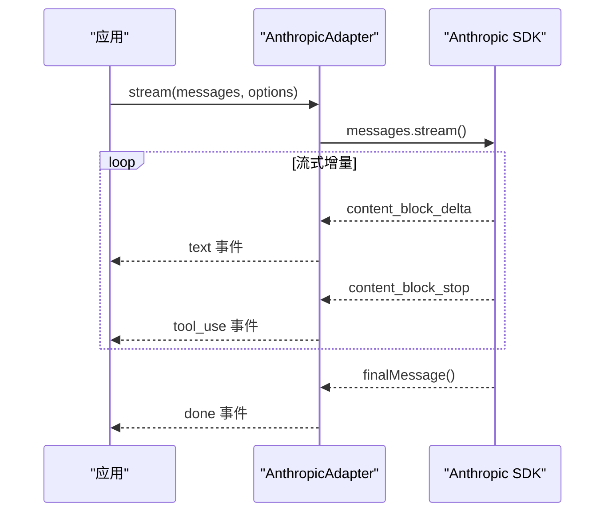
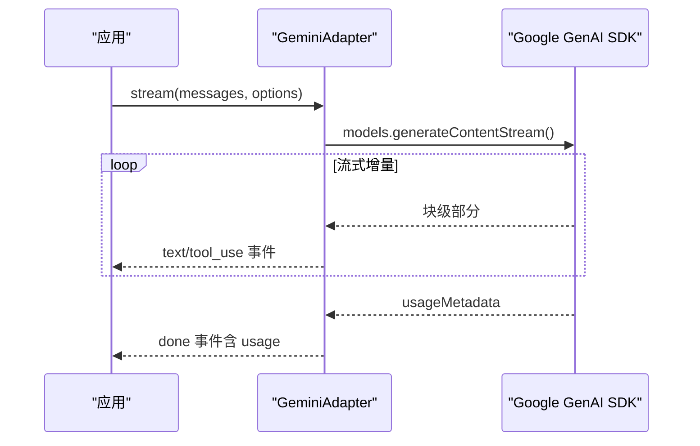
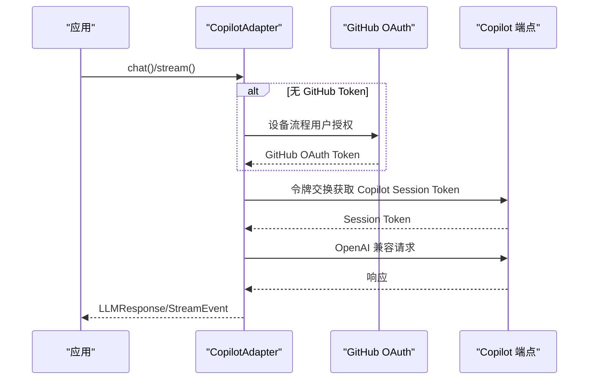
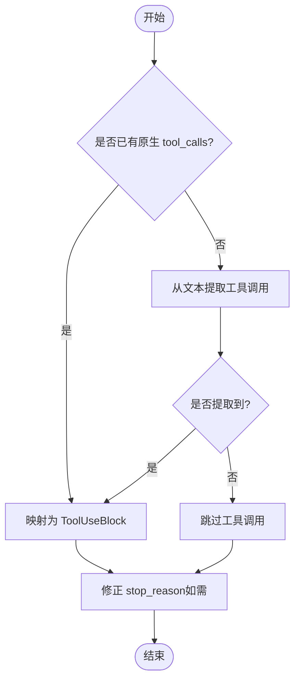
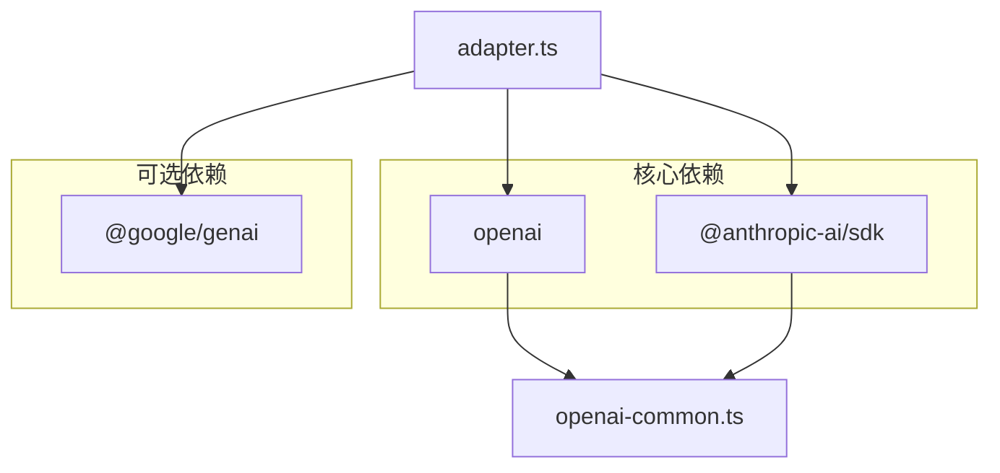

# LLM 集成

<cite>
**本文引用的文件**   
- [src/llm/adapter.ts](file://src/llm/adapter.ts)
- [src/llm/openai.ts](file://src/llm/openai.ts)
- [src/llm/anthropic.ts](file://src/llm/anthropic.ts)
- [src/llm/gemini.ts](file://src/llm/gemini.ts)
- [src/llm/copilot.ts](file://src/llm/copilot.ts)
- [src/llm/grok.ts](file://src/llm/grok.ts)
- [src/llm/openai-common.ts](file://src/llm/openai-common.ts)
- [src/tool/text-tool-extractor.ts](file://src/tool/text-tool-extractor.ts)
- [src/types.ts](file://src/types.ts)
- [examples/06-local-model.ts](file://examples/06-local-model.ts)
- [examples/12-grok.ts](file://examples/12-grok.ts)
- [examples/13-gemini.ts](file://examples/13-gemini.ts)
- [tests/llm-adapters.test.ts](file://tests/llm-adapters.test.ts)
- [tests/openai-adapter.test.ts](file://tests/openai-adapter.test.ts)
- [tests/anthropic-adapter.test.ts](file://tests/anthropic-adapter.test.ts)
- [package.json](file://package.json)
</cite>

## 目录
1. [简介](#简介)
2. [项目结构](#项目结构)
3. [核心组件](#核心组件)
4. [架构总览](#架构总览)
5. [详细组件分析](#详细组件分析)
6. [依赖关系分析](#依赖关系分析)
7. [性能考量](#性能考量)
8. [故障排查指南](#故障排查指南)
9. [结论](#结论)
10. [附录](#附录)

## 简介
本文件面向 Open Multi-Agent 框架中的 LLM 集成子系统，系统性阐述适配器工厂模式的设计与实现，统一的 LLM 接口规范，以及对多家 LLM 提供商（Anthropic、OpenAI、Gemini、Copilot、Grok）的集成方式。同时提供本地模型（Ollama、vLLM、LM Studio）通过 OpenAI 兼容接口接入的实践指南，并说明工具调用处理机制与文本提取回退方案。

## 项目结构
LLM 集成位于 src/llm 目录，采用“适配器工厂 + 多提供商适配器”的分层设计：
- 适配器工厂：根据提供商字符串动态加载对应适配器，支持延迟导入以减少不必要的依赖。
- 统一接口：所有适配器实现 LLMAdapter 接口，保证 chat() 与 stream() 的一致性行为。
- 转换与回退：通过 openai-common.ts 实现 OpenAI Wire Format 的双向转换；通过 text-tool-extractor.ts 提供本地模型输出的工具调用提取回退。

**图表来源**
- [src/llm/adapter.ts:63-98](file://src/llm/adapter.ts#L63-L98)
- [src/llm/openai.ts:68-78](file://src/llm/openai.ts#L68-L78)
- [src/llm/anthropic.ts:187-197](file://src/llm/anthropic.ts#L187-L197)
- [src/llm/gemini.ts:249-258](file://src/llm/gemini.ts#L249-L258)
- [src/llm/copilot.ts:228-292](file://src/llm/copilot.ts#L228-L292)
- [src/llm/grok.ts:19-28](file://src/llm/grok.ts#L19-L28)
- [src/llm/openai-common.ts:34-95](file://src/llm/openai-common.ts#L34-L95)
- [src/tool/text-tool-extractor.ts:196-219](file://src/tool/text-tool-extractor.ts#L196-L219)

**章节来源**
- [src/llm/adapter.ts:18-98](file://src/llm/adapter.ts#L18-L98)
- [src/types.ts:518-542](file://src/types.ts#L518-L542)

## 核心组件
- 适配器工厂 createAdapter：按提供商返回具体适配器实例，支持可选 apiKey 与 baseURL。
- LLMAdapter 接口：定义 chat() 与 stream() 两个核心方法，统一响应格式与事件流。
- OpenAI 兼容转换：toOpenAITool、toOpenAIMessages、fromOpenAICompletion、buildOpenAIMessageList、normalizeFinishReason。
- 工具调用提取回退：extractToolCallsFromText，用于本地模型输出的 JSON/标签提取。

**章节来源**
- [src/llm/adapter.ts:41-98](file://src/llm/adapter.ts#L41-L98)
- [src/types.ts:518-542](file://src/types.ts#L518-L542)
- [src/llm/openai-common.ts:34-295](file://src/llm/openai-common.ts#L34-L295)
- [src/tool/text-tool-extractor.ts:196-219](file://src/tool/text-tool-extractor.ts#L196-L219)

## 架构总览
下图展示从应用侧到各提供商的调用路径与数据转换：

**图表来源**
- [src/llm/adapter.ts:63-98](file://src/llm/adapter.ts#L63-L98)
- [src/llm/openai.ts:91-110](file://src/llm/openai.ts#L91-L110)
- [src/llm/anthropic.ts:210-239](file://src/llm/anthropic.ts#L210-L239)
- [src/llm/gemini.ts:271-282](file://src/llm/gemini.ts#L271-L282)
- [src/llm/copilot.ts:298-318](file://src/llm/copilot.ts#L298-L318)
- [src/llm/grok.ts:19-28](file://src/llm/grok.ts#L19-L28)

## 详细组件分析

### 适配器工厂与统一接口
- 支持提供商：'anthropic' | 'copilot' | 'grok' | 'openai' | 'gemini'
- API 密钥环境变量回退：
  - anthropic → ANTHROPIC_API_KEY
  - openai → OPENAI_API_KEY
  - gemini → GEMINI_API_KEY / GOOGLE_API_KEY
  - grok → XAI_API_KEY
  - copilot → GITHUB_COPILOT_TOKEN / GITHUB_TOKEN，或交互式 OAuth2 设备流程
- baseURL 支持：
  - openai/grok：支持自定义 base URL（常用于本地 OpenAI 兼容服务）
  - copilot：忽略传入 baseURL 并打印警告
- 统一接口：
  - chat()：同步返回完整 LLMResponse
  - stream()：异步迭代 StreamEvent，保证顺序与最终 done/error 结束

**章节来源**
- [src/llm/adapter.ts:41-98](file://src/llm/adapter.ts#L41-L98)
- [src/types.ts:518-542](file://src/types.ts#L518-L542)

### OpenAI 适配器
- 功能要点
  - 使用 OpenAI SDK Chat Completions API
  - 将框架内容块映射为 OpenAI wire format（含 tool_calls、tool 角色消息、image_url）
  - 支持同步 chat() 与流式 stream()，包含 usage 回传
  - 流式阶段：累积 text 与 tool_calls，最终一次性发出 done 事件
  - 工具调用回退：当无原生 tool_calls 时，尝试从文本中提取（依赖 openai-common 与 text-tool-extractor）
- 关键实现位置
  - chat()：构建消息列表、调用 SDK、转换响应
  - stream()：逐段产出 text/tool_use，最后 done 包含 usage

**图表来源**
- [src/llm/openai.ts:125-279](file://src/llm/openai.ts#L125-L279)
- [src/llm/openai-common.ts:282-294](file://src/llm/openai-common.ts#L282-L294)

**章节来源**
- [src/llm/openai.ts:68-280](file://src/llm/openai.ts#L68-L280)
- [src/llm/openai-common.ts:178-255](file://src/llm/openai-common.ts#L178-L255)

### Anthropic 适配器
- 功能要点
  - 使用 @anthropic-ai/sdk 的 messages.create 与 stream
  - 内容块映射：text、tool_use、tool_result、image
  - 流式阶段：content_block_start/delta/stop 事件，最终由 stream.finalMessage() 汇总
  - 默认 max_tokens 未指定时使用 4096
- 关键实现位置
  - chat()：构建消息与工具定义，调用 SDK
  - stream()：基于 SDK MessageStream 事件流，组装 tool_use 后发出

**图表来源**
- [src/llm/anthropic.ts:256-372](file://src/llm/anthropic.ts#L256-L372)

**章节来源**
- [src/llm/anthropic.ts:187-373](file://src/llm/anthropic.ts#L187-L373)

### Gemini 适配器
- 功能要点
  - 使用 @google/genai（v1.x），非旧版 @google/generative-ai
  - 角色映射：framework 的 assistant ↔ Gemini 的 model
  - 工具定义映射：functionDeclarations 形式，自动启用 AUTO 模式
  - 流式阶段：generateContentStream，需自行聚合 usage 与内容
  - 生成稳定伪 ID 以满足框架 ToolUseBlock 合同
- 关键实现位置
  - chat()：generateContent
  - stream()：generateContentStream，聚合 usage 与 stop_reason

**图表来源**
- [src/llm/gemini.ts:305-377](file://src/llm/gemini.ts#L305-L377)

**章节来源**
- [src/llm/gemini.ts:249-378](file://src/llm/gemini.ts#L249-L378)

### Copilot 适配器
- 功能要点
  - 基于 OpenAI 兼容端点（api.githubcopilot.com），内部通过 GitHub Token 交换短时会话令牌
  - 支持 apiKey、GITHUB_COPILOT_TOKEN、GITHUB_TOKEN 三种认证来源，或交互式设备流程
  - baseURL 参数会被忽略并警告
  - 与 OpenAI 兼容：复用 openai-common 的转换逻辑
- 关键实现位置
  - 认证：设备流程、令牌交换、缓存与刷新
  - chat()/stream()：内部创建 OpenAI 客户端并走 OpenAI 兼容路径

**图表来源**
- [src/llm/copilot.ts:109-169](file://src/llm/copilot.ts#L109-L169)
- [src/llm/copilot.ts:284-292](file://src/llm/copilot.ts#L284-L292)
- [src/llm/openai-common.ts:282-294](file://src/llm/openai-common.ts#L282-L294)

**章节来源**
- [src/llm/copilot.ts:228-450](file://src/llm/copilot.ts#L228-L450)

### Grok 适配器
- 功能要点
  - Grok 是 xAI 的 OpenAI 兼容模型系列
  - GrokAdapter 继承 OpenAIAdapter，硬编码官方端点与 XAI_API_KEY 环境变量回退
  - 支持 baseURL 覆盖（代理/未来变更）
- 关键实现位置
  - 构造函数：优先使用传入 apiKey，否则回退 XAI_API_KEY，最后传入 baseURL（默认官方端点）

**章节来源**
- [src/llm/grok.ts:19-29](file://src/llm/grok.ts#L19-L29)

### 统一接口规范与事件流
- chat()：返回 LLMResponse，包含 id、content（Text/ToolUse/ToolResult/Image）、model、stop_reason、usage
- stream()：产出事件序列，保证
  - 0 个或多个 text 事件
  - 0 个或多个 tool_use 事件（在参数完全拼接后一次性发出）
  - 恰一个终止事件：done（成功）或 error（失败）
- stop_reason 规范化：'stop'→'end_turn'、'tool_calls'→'tool_use'、'length'→'max_tokens'

**章节来源**
- [src/types.ts:518-542](file://src/types.ts#L518-L542)
- [src/llm/openai-common.ts:268-276](file://src/llm/openai-common.ts#L268-L276)

### OpenAI 兼容转换与工具回退
- 转换模块
  - toOpenAITool：将 LLMToolDef 映射为 OpenAI function
  - toOpenAIMessages：将框架消息映射为 OpenAI 消息数组，拆分 tool_result 为独立 tool 角色消息
  - fromOpenAICompletion：将 OpenAI ChatCompletion 转为 LLMResponse，含工具回退与 finish_reason 规范化
  - buildOpenAIMessageList：在必要时前置 system 消息
- 工具回退
  - 当本地模型未返回原生 tool_calls，而是将 JSON 输出在文本中时，从文本中提取工具调用（支持多种常见格式与标签）

**图表来源**
- [src/llm/openai-common.ts:178-255](file://src/llm/openai-common.ts#L178-L255)
- [src/tool/text-tool-extractor.ts:196-219](file://src/tool/text-tool-extractor.ts#L196-L219)

**章节来源**
- [src/llm/openai-common.ts:34-295](file://src/llm/openai-common.ts#L34-L295)
- [src/tool/text-tool-extractor.ts:1-220](file://src/tool/text-tool-extractor.ts#L1-L220)

### 本地模型集成指南（Ollama、vLLM、LM Studio）
- 统一方法：使用 provider:'openai' + baseURL 指向本地 OpenAI 兼容端点
  - Ollama：http://localhost:11434/v1
  - vLLM：http://localhost:8000/v1
  - LM Studio：http://localhost:1234/v1
  - llama.cpp：http://localhost:8080/v1
- 注意事项
  - 即使本地无需鉴权，仍需提供非空 apiKey（例如 'ollama'），因为 OpenAI SDK 会对 apiKey 进行校验
  - 可设置较长超时（timeoutMs）以应对本地推理不确定性
- 示例参考
  - examples/06-local-model.ts 展示了混合云模型与本地模型的团队协作

**章节来源**
- [examples/06-local-model.ts:1-201](file://examples/06-local-model.ts#L1-L201)
- [src/types.ts:194-211](file://src/types.ts#L194-L211)

## 依赖关系分析
- 适配器工厂与提供商
  - adapter.ts 仅导出类型与工厂函数，运行时按需延迟导入各适配器，避免强制安装其他 SDK
- 第三方依赖
  - @anthropic-ai/sdk、openai 为核心依赖
  - @google/genai 为可选 peer 依赖（可通过包管理器选择性安装）
- 测试覆盖
  - llm-adapters.test.ts：工厂与通用转换逻辑
  - openai-adapter.test.ts：OpenAI 适配器 chat/stream 行为
  - anthropic-adapter.test.ts：Anthropic 适配器 chat/stream 行为

**图表来源**
- [package.json:45-66](file://package.json#L45-L66)
- [src/llm/adapter.ts:63-98](file://src/llm/adapter.ts#L63-L98)

**章节来源**
- [package.json:45-66](file://package.json#L45-L66)
- [tests/llm-adapters.test.ts:1-47](file://tests/llm-adapters.test.ts#L1-L47)

## 性能考量
- 流式传输
  - OpenAI/Gemini/Copilot：开启 include_usage，以便在 done 事件中一次性获得 token 统计
  - Anthropic：使用 SDK 的 MessageStream，避免手动拼接
- 并发与线程安全
  - 所有适配器声明为线程安全，可在多 agent 并发场景共享实例
- 本地模型
  - 建议设置合理超时（timeoutMs），避免阻塞
  - 对于高延迟本地服务，适当降低并发度或使用队列控制

[本节为通用指导，不直接分析具体文件]

## 故障排查指南
- 无法初始化适配器
  - 检查提供商名称是否在受支持集合内
  - 检查环境变量是否正确设置（如 ANTHROPIC_API_KEY、OPENAI_API_KEY、GEMINI_API_KEY、XAI_API_KEY、GITHUB_COPILOT_TOKEN/GITHUB_TOKEN）
- Copilot 认证问题
  - 若未提供 GitHub Token，将触发交互式设备流程；确保网络可达并允许浏览器访问
  - baseURL 会被忽略并打印警告
- 本地模型未返回工具调用
  - 确认模型已正确配置为返回原生 tool_calls；若仅输出 JSON 文本，系统会尝试从文本提取
  - 检查工具输入 schema 是否与模型期望一致
- 流式中断或错误
  - 检查网络连通性与代理设置
  - 在应用侧监听 error 事件并进行重试或降级处理

**章节来源**
- [src/llm/adapter.ts:41-98](file://src/llm/adapter.ts#L41-L98)
- [src/llm/copilot.ts:274-282](file://src/llm/copilot.ts#L274-L282)
- [src/llm/openai-common.ts:215-235](file://src/llm/openai-common.ts#L215-L235)
- [tests/openai-adapter.test.ts:316-326](file://tests/openai-adapter.test.ts#L316-L326)
- [tests/anthropic-adapter.test.ts:361-375](file://tests/anthropic-adapter.test.ts#L361-L375)

## 结论
该 LLM 集成体系通过适配器工厂模式实现了对多家提供商的一致抽象，配合 OpenAI 兼容转换与文本提取回退，既保证了云端模型的高质量体验，也提供了本地模型的灵活接入路径。统一的接口规范与事件流设计，使得上层编排与工具执行逻辑保持稳定，便于扩展更多提供商与优化性能。

[本节为总结性内容，不直接分析具体文件]

## 附录

### 配置清单与环境变量
- Anthropic
  - apiKey：ANTHROPIC_API_KEY
- OpenAI
  - apiKey：OPENAI_API_KEY
- Gemini
  - apiKey：GEMINI_API_KEY 或 GOOGLE_API_KEY
- Grok
  - apiKey：XAI_API_KEY
- Copilot
  - apiKey：GITHUB_COPILOT_TOKEN 或 GITHUB_TOKEN
  - 交互式设备流程：当两者均不可用时触发

**章节来源**
- [src/llm/adapter.ts:48-53](file://src/llm/adapter.ts#L48-L53)
- [src/llm/copilot.ts:9-13](file://src/llm/copilot.ts#L9-L13)

### 示例参考
- 本地模型（Ollama + Claude）团队协作：examples/06-local-model.ts
- Grok 多智能体协作：examples/12-grok.ts
- Gemini 快速验证：examples/13-gemini.ts

**章节来源**
- [examples/06-local-model.ts:1-201](file://examples/06-local-model.ts#L1-L201)
- [examples/12-grok.ts:1-154](file://examples/12-grok.ts#L1-L154)
- [examples/13-gemini.ts:1-49](file://examples/13-gemini.ts#L1-L49)