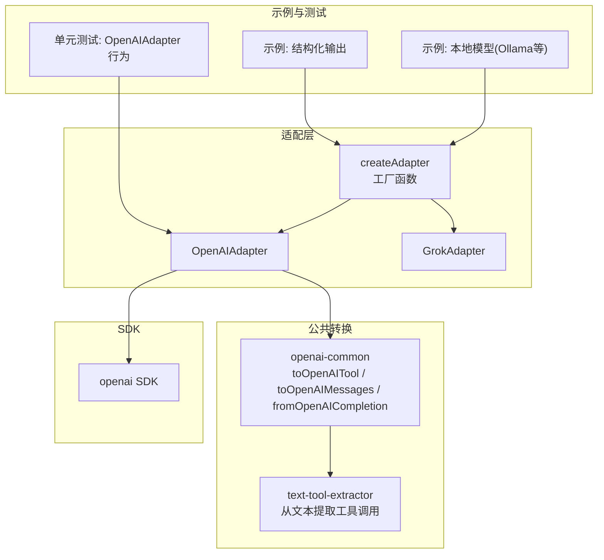
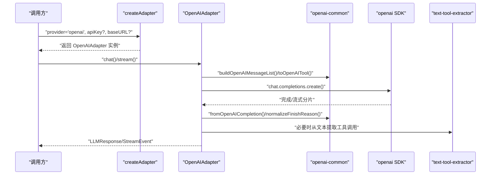
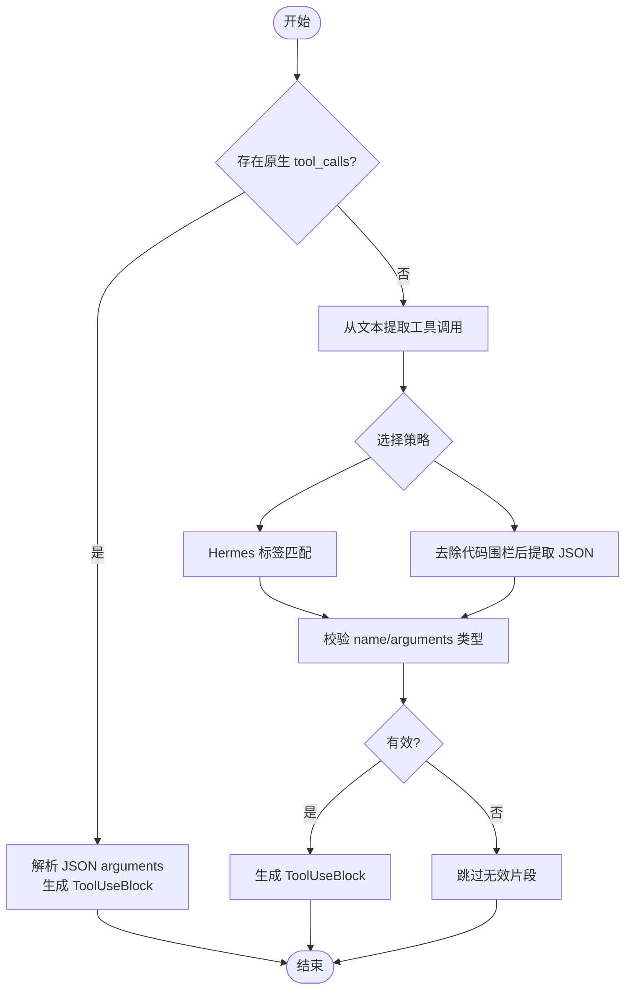
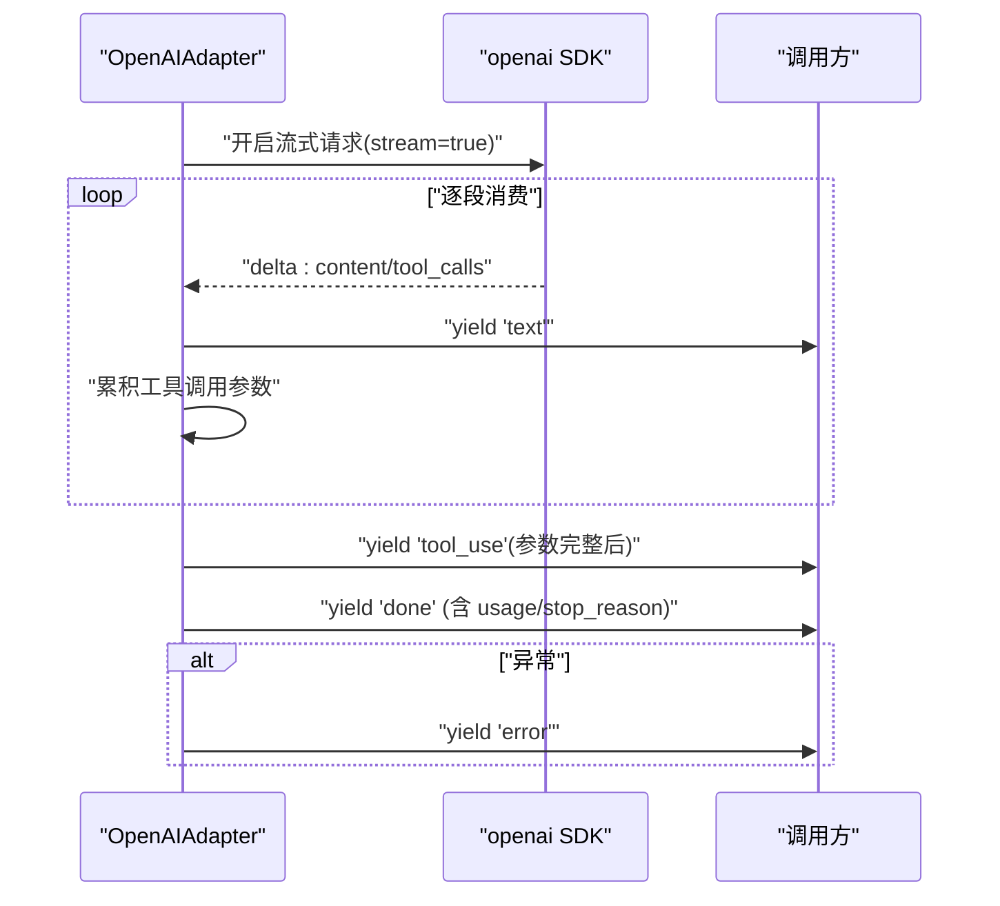
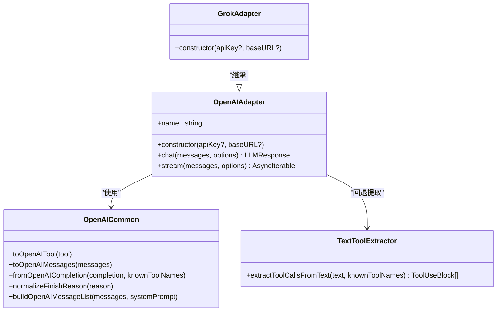

# OpenAI 集成

<cite>
**本文引用的文件**
- [openai.ts](file://src/llm/openai.ts)
- [openai-common.ts](file://src/llm/openai-common.ts)
- [adapter.ts](file://src/llm/adapter.ts)
- [text-tool-extractor.ts](file://src/tool/text-tool-extractor.ts)
- [types.ts](file://src/types.ts)
- [06-local-model.ts](file://examples/06-local-model.ts)
- [09-structured-output.ts](file://examples/09-structured-output.ts)
- [openai-adapter.test.ts](file://tests/openai-adapter.test.ts)
- [grok.ts](file://src/llm/grok.ts)
- [package.json](file://package.json)
</cite>

## 目录
1. [简介](#简介)
2. [项目结构](#项目结构)
3. [核心组件](#核心组件)
4. [架构总览](#架构总览)
5. [组件详解](#组件详解)
6. [依赖关系分析](#依赖关系分析)
7. [性能与优化](#性能与优化)
8. [故障排查指南](#故障排查指南)
9. [结论](#结论)
10. [附录](#附录)

## 简介
本文件面向需要在多智能体框架中集成 OpenAI 或 OpenAI 兼容接口（如 Ollama、vLLM、LM Studio 等）的开发者，系统性说明：
- OpenAIAdapter 的实现细节与行为边界
- 与“OpenAI 兼容适配器”（如 GrokAdapter）的关系与差异
- API 密钥配置与 baseURL 的作用与设置方法
- 工具调用的完整实现：JSON Schema 验证、本地模型回退提取、响应处理
- 流式响应的处理机制：事件监听与聚合
- 错误处理、重试策略与性能优化最佳实践

## 项目结构
围绕 OpenAI 集成的关键文件与职责如下：
- 适配器工厂：根据 provider 返回具体适配器实例，并支持 baseURL 传入
- OpenAI 适配器：封装 openai SDK 调用，负责消息格式转换、工具调用、流式处理
- 公共转换模块：统一 OpenAI wire-format 与框架内部类型之间的互转
- 工具调用回退提取器：当本地模型未返回原生 tool_calls 时，从文本中解析工具调用
- 示例与测试：演示本地模型接入、结构化输出与适配器行为验证

图表来源
- [adapter.ts:63-98](file://src/llm/adapter.ts#L63-L98)
- [openai.ts:68-280](file://src/llm/openai.ts#L68-L280)
- [openai-common.ts:34-294](file://src/llm/openai-common.ts#L34-L294)
- [text-tool-extractor.ts:196-220](file://src/tool/text-tool-extractor.ts#L196-L220)
- [06-local-model.ts:1-201](file://examples/06-local-model.ts#L1-L201)
- [09-structured-output.ts:1-74](file://examples/09-structured-output.ts#L1-L74)
- [openai-adapter.test.ts:1-200](file://tests/openai-adapter.test.ts#L1-L200)

章节来源
- [adapter.ts:18-98](file://src/llm/adapter.ts#L18-L98)
- [openai.ts:17-110](file://src/llm/openai.ts#L17-L110)
- [openai-common.ts:34-294](file://src/llm/openai-common.ts#L34-L294)
- [text-tool-extractor.ts:196-220](file://src/tool/text-tool-extractor.ts#L196-L220)
- [06-local-model.ts:1-201](file://examples/06-local-model.ts#L1-L201)
- [09-structured-output.ts:1-74](file://examples/09-structured-output.ts#L1-L74)
- [openai-adapter.test.ts:1-200](file://tests/openai-adapter.test.ts#L1-L200)

## 核心组件
- OpenAIAdapter：实现 LLMAdapter 接口，封装 openai SDK 的 chat.completions 调用；支持同步与流式两种模式；负责消息格式转换、工具调用、停止原因归一化、token 使用统计。
- OpenAI 兼容适配器：通过继承 OpenAIAdapter 并复用其转换逻辑，仅在构造时覆盖 baseURL 与 API Key 解析策略。例如 GrokAdapter 默认指向官方 xAI 端点。
- 公共转换模块：toOpenAITool、toOpenAIMessages、fromOpenAICompletion、normalizeFinishReason、buildOpenAIMessageList 等，确保不同 Provider 的 wire-format 与框架内部 ContentBlock 一致。
- 工具调用回退提取器：extractToolCallsFromText，用于本地模型未返回原生 tool_calls 的场景，从文本中解析工具调用并生成 ToolUseBlock。
- 适配器工厂：createAdapter，按 provider 返回对应适配器实例；OpenAI 与 Grok 支持 baseURL 参数以对接本地或第三方兼容服务。

章节来源
- [openai.ts:68-280](file://src/llm/openai.ts#L68-L280)
- [openai-common.ts:34-294](file://src/llm/openai-common.ts#L34-L294)
- [text-tool-extractor.ts:196-220](file://src/tool/text-tool-extractor.ts#L196-L220)
- [adapter.ts:63-98](file://src/llm/adapter.ts#L63-L98)
- [grok.ts:19-29](file://src/llm/grok.ts#L19-L29)

## 架构总览
下图展示 OpenAIAdapter 在框架中的位置与交互路径，以及与 openai SDK 的对接关系。

图表来源
- [adapter.ts:63-98](file://src/llm/adapter.ts#L63-L98)
- [openai.ts:91-110](file://src/llm/openai.ts#L91-L110)
- [openai.ts:125-280](file://src/llm/openai.ts#L125-L280)
- [openai-common.ts:178-255](file://src/llm/openai-common.ts#L178-L255)
- [text-tool-extractor.ts:196-220](file://src/tool/text-tool-extractor.ts#L196-L220)

## 组件详解

### OpenAIAdapter 实现要点
- API 密钥与 baseURL
  - 构造函数接收 apiKey 与 baseURL；若未显式提供，优先使用环境变量 OPENAI_API_KEY。
  - baseURL 可用于指向 OpenAI 兼容服务端点，如 Ollama、vLLM、LM Studio 等。
- 同步请求 chat()
  - 将框架消息转换为 OpenAI 消息列表，发送非流式请求；返回 LLMResponse。
  - 工具定义转换为 OpenAI function tool；停止原因进行归一化。
- 流式请求 stream()
  - 发送流式请求并逐段消费；累积文本增量与工具调用参数；在流结束后聚合为最终内容块。
  - 若本地模型未返回原生 tool_calls，回退到从文本提取工具调用。
  - 终止事件包含完整 usage 与 stop_reason 归一化后的结果。

章节来源
- [openai.ts:73-78](file://src/llm/openai.ts#L73-L78)
- [openai.ts:91-110](file://src/llm/openai.ts#L91-L110)
- [openai.ts:125-280](file://src/llm/openai.ts#L125-L280)
- [openai-common.ts:282-294](file://src/llm/openai-common.ts#L282-L294)

### OpenAI 兼容适配器（GrokAdapter）
- 继承 OpenAIAdapter，仅在构造时指定默认 baseURL 与 API Key 来源（XAI_API_KEY），其余行为与 OpenAIAdapter 完全一致。
- 适用于使用官方 xAI 端点的 Grok 模型。

章节来源
- [grok.ts:19-29](file://src/llm/grok.ts#L19-L29)

### 工具调用：JSON Schema 验证与回退提取
- JSON Schema 验证
  - 工具定义在请求阶段转换为 OpenAI function tool 的 parameters 字段，由模型侧进行校验。
- 回退提取
  - 当本地模型未返回原生 tool_calls 时，fromOpenAICompletion 会检查已知工具名白名单并尝试从文本中解析工具调用。
  - text-tool-extractor 提供多种提取策略：Hermes 标签、代码围栏包裹的 JSON、裸 JSON 对象等，并对输入进行严格校验（仅接受对象且非数组）。

图表来源
- [openai-common.ts:215-235](file://src/llm/openai-common.ts#L215-L235)
- [text-tool-extractor.ts:196-220](file://src/tool/text-tool-extractor.ts#L196-L220)

章节来源
- [openai-common.ts:178-255](file://src/llm/openai-common.ts#L178-L255)
- [text-tool-extractor.ts:196-220](file://src/tool/text-tool-extractor.ts#L196-L220)

### 流式响应处理机制
- 事件序列保证
  - 文本增量事件 text
  - 工具调用事件 tool_use（在参数完整拼接后发出）
  - 终止事件 done 或 error
- 状态聚合
  - 在流过程中累积 completionId、model、usage、文本与工具调用参数。
  - 流结束后统一生成 LLMResponse，并将 stop_reason 归一化。
- 异常处理
  - 捕获异常并发出 error 事件，避免中断上层流程。

图表来源
- [openai.ts:125-280](file://src/llm/openai.ts#L125-L280)

章节来源
- [openai.ts:125-280](file://src/llm/openai.ts#L125-L280)

### API 密钥与 baseURL 配置
- API 密钥解析顺序
  - OpenAIAdapter 构造函数优先使用传入的 apiKey；否则读取环境变量 OPENAI_API_KEY。
- baseURL 作用
  - 用于指向 OpenAI 兼容接口（如 Ollama、vLLM、LM Studio 等），示例中使用 http://localhost:11434/v1、http://localhost:8000/v1、http://localhost:1234/v1 等。
- 适配器工厂
  - createAdapter 支持传入 baseURL，OpenAI 与 Grok 适配器均透传该参数；Copilot 适配器忽略 baseURL 并给出警告。

章节来源
- [openai.ts:73-78](file://src/llm/openai.ts#L73-L78)
- [adapter.ts:63-98](file://src/llm/adapter.ts#L63-L98)
- [06-local-model.ts:54-56](file://examples/06-local-model.ts#L54-L56)

### 本地模型支持与兼容接口
- 本地部署方案
  - Ollama、vLLM、LM Studio、llama.cpp 等均提供 OpenAI 兼容的 /v1 端点。
  - 通过 provider: 'openai' + baseURL 指向对应服务即可复用 OpenAIAdapter。
- 示例参考
  - 示例 06 展示了如何使用 baseURL 指向 Ollama，并配置模型名称与超时时间。

章节来源
- [06-local-model.ts:9-14](file://examples/06-local-model.ts#L9-L14)
- [06-local-model.ts:54-68](file://examples/06-local-model.ts#L54-L68)

### 结构化输出与 JSON Schema
- AgentConfig.outputSchema
  - 通过 Zod Schema 定义期望输出结构，框架在运行时自动解析并验证。
- 适配器侧配合
  - OpenAIAdapter 不直接解析结构化输出，但会正确传递工具调用与文本内容，使上层逻辑可基于这些信息进行二次解析与验证。

章节来源
- [09-structured-output.ts:25-30](file://examples/09-structured-output.ts#L25-L30)
- [types.ts:194-200](file://src/types.ts#L194-L200)

## 依赖关系分析
- 依赖 openai SDK：用于调用 chat.completions 接口，支持同步与流式两种模式。
- GrokAdapter 依赖 OpenAIAdapter：通过继承共享转换逻辑，仅覆盖端点与密钥来源。
- 适配器工厂：按 provider 动态导入具体适配器，避免不必要的依赖安装。

图表来源
- [openai.ts:68-280](file://src/llm/openai.ts#L68-L280)
- [openai-common.ts:34-294](file://src/llm/openai-common.ts#L34-L294)
- [text-tool-extractor.ts:196-220](file://src/tool/text-tool-extractor.ts#L196-L220)
- [grok.ts:19-29](file://src/llm/grok.ts#L19-L29)

章节来源
- [package.json:45-49](file://package.json#L45-L49)
- [grok.ts:8](file://src/llm/grok.ts#L8)

## 性能与优化
- 流式处理优先
  - 使用 stream() 可以尽早感知文本增量与工具调用，提升交互体验与可观测性。
- 合理设置超时与并发
  - 本地模型通常较慢，建议在 AgentConfig 中设置合理的 timeoutMs；同时控制并发度以避免资源争用。
- 减少不必要的工具调用
  - 仅在必要时提供 tools，避免模型在无用工具上浪费 token。
- 使用 include_usage
  - OpenAIAdapter 在流式请求中启用 include_usage，以便在最终分片中获取准确的 token 统计。

章节来源
- [openai.ts:132-145](file://src/llm/openai.ts#L132-L145)
- [06-local-model.ts:67](file://examples/06-local-model.ts#L67)

## 故障排查指南
- 常见问题与定位
  - 本地模型未返回原生 tool_calls：检查是否启用了正确的工具定义与模型版本；必要时依赖文本回退提取。
  - baseURL 配置错误：确认 /v1 端点可用，且模型名称正确。
  - API 密钥无效：检查 OPENAI_API_KEY 或传入的 apiKey 是否正确。
- 错误事件与重试
  - 流式过程中出现错误会发出 error 事件；框架层面可在任务级实现重试策略（见下节）。
- 单元测试参考
  - 测试覆盖了 chat() 参数传递、工具定义转换、温度参数、AbortSignal 传递、工具调用解析与回退提取等关键路径。

章节来源
- [openai-adapter.test.ts:101-200](file://tests/openai-adapter.test.ts#L101-L200)
- [openai.ts:274-278](file://src/llm/openai.ts#L274-L278)

## 结论
- OpenAIAdapter 提供了与 openai SDK 的无缝集成，具备完善的工具调用与流式处理能力。
- 通过 baseURL 与适配器工厂，可轻松对接 Ollama、vLLM、LM Studio 等本地部署方案。
- GrokAdapter 复用 OpenAIAdapter 的转换逻辑，仅在端点与密钥来源上做差异化处理。
- 在本地模型场景下，建议结合工具调用回退提取与结构化输出验证，提升鲁棒性与可维护性。

## 附录

### API 密钥与 baseURL 配置清单
- OpenAIAdapter
  - apiKey：优先使用传入值；否则读取 OPENAI_API_KEY
  - baseURL：指向 OpenAI 兼容服务端点（如 Ollama、vLLM、LM Studio）
- GrokAdapter
  - 默认 baseURL：官方 xAI 端点
  - API Key：优先使用传入值；否则读取 XAI_API_KEY

章节来源
- [openai.ts:73-78](file://src/llm/openai.ts#L73-L78)
- [grok.ts:22-27](file://src/llm/grok.ts#L22-L27)
- [adapter.ts:63-98](file://src/llm/adapter.ts#L63-L98)

### 重试策略与最佳实践
- 任务级重试
  - 框架在执行器层实现了通用的指数退避重试机制，支持自定义最大重试次数、基础延迟与退避因子。
- 适配器级健壮性
  - 流式处理中捕获异常并发出 error 事件，便于上层统一处理。
  - 工具调用回退提取减少因模型不规范输出导致的失败。

章节来源
- [openai.ts:274-278](file://src/llm/openai.ts#L274-L278)
- [openai-common.ts:215-235](file://src/llm/openai-common.ts#L215-L235)