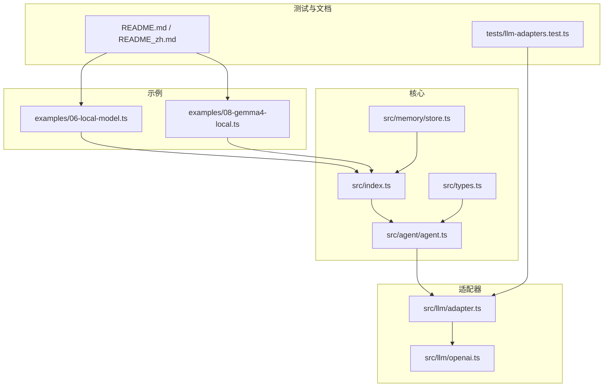
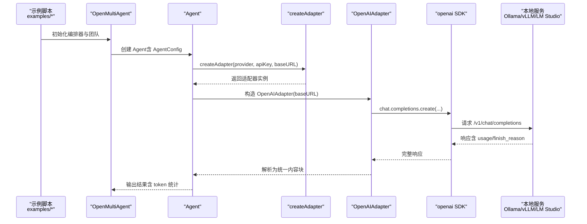
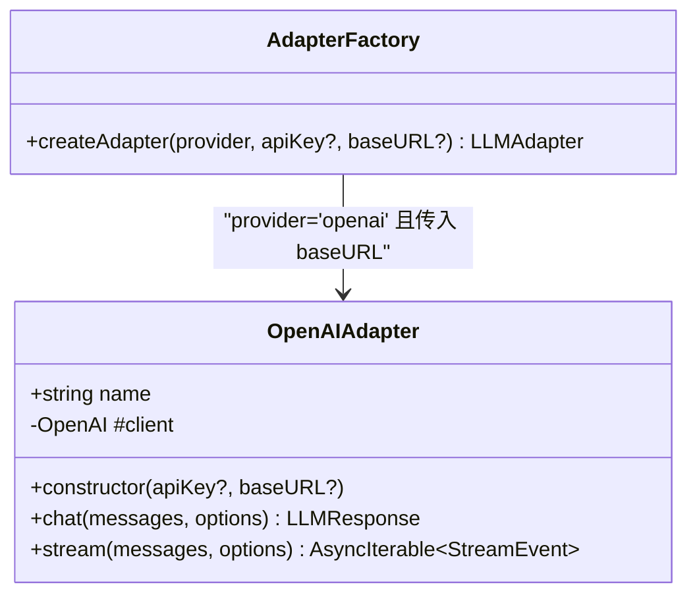
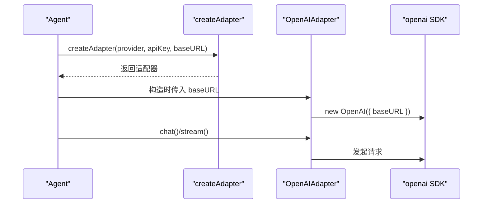
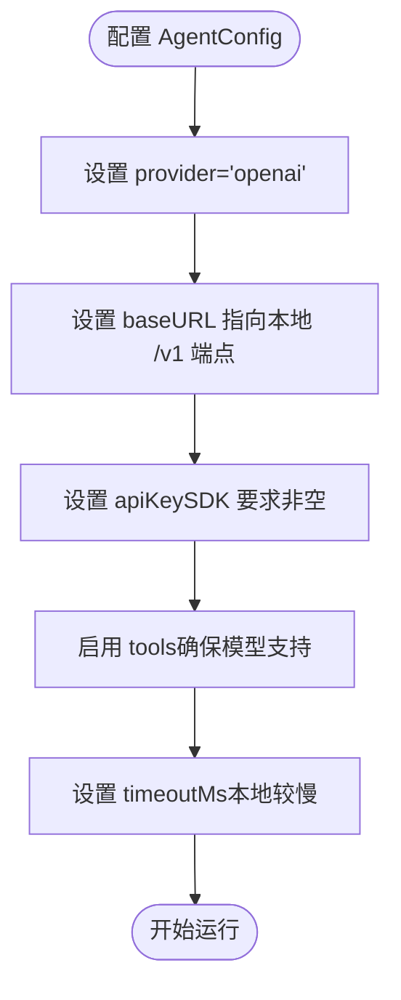
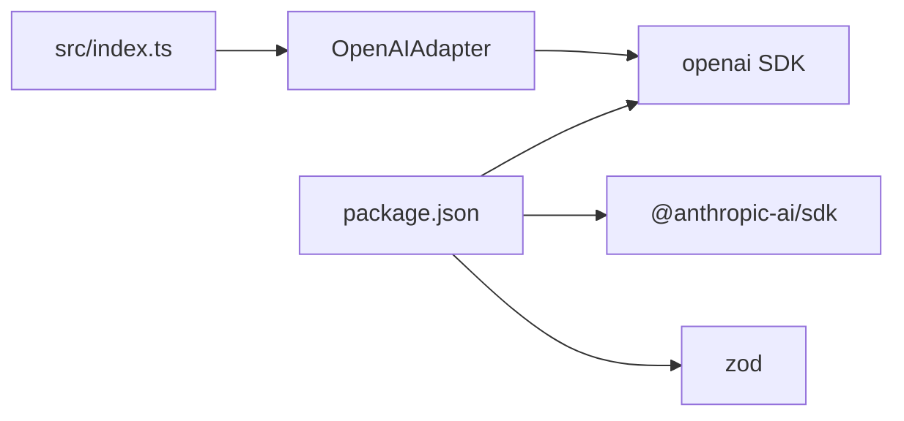

# 本地模型支持

<cite>
**本文引用的文件**
- [examples/06-local-model.ts](file://examples/06-local-model.ts)
- [examples/08-gemma4-local.ts](file://examples/08-gemma4-local.ts)
- [src/llm/adapter.ts](file://src/llm/adapter.ts)
- [src/llm/openai.ts](file://src/llm/openai.ts)
- [src/index.ts](file://src/index.ts)
- [src/types.ts](file://src/types.ts)
- [src/agent/agent.ts](file://src/agent/agent.ts)
- [src/memory/store.ts](file://src/memory/store.ts)
- [tests/llm-adapters.test.ts](file://tests/llm-adapters.test.ts)
- [README.md](file://README.md)
- [README_zh.md](file://README_zh.md)
- [package.json](file://package.json)
</cite>

## 目录
1. [简介](#简介)
2. [项目结构](#项目结构)
3. [核心组件](#核心组件)
4. [架构总览](#架构总览)
5. [详细组件分析](#详细组件分析)
6. [依赖分析](#依赖分析)
7. [性能考虑](#性能考虑)
8. [故障排除指南](#故障排除指南)
9. [结论](#结论)
10. [附录](#附录)

## 简介
本文件面向希望在本地运行 LLM 并与多智能体编排系统集成的用户，系统性说明如何通过 baseURL 参数对接本地 LLM 服务，覆盖 Ollama、vLLM、LM Studio、llama.cpp 等 OpenAI 兼容接口的部署方案。文档包含配置要点、性能优化策略、与云端 API 的差异与优势、部署与环境设置建议、局限性与最佳实践，以及故障排除与调优指南。

## 项目结构
围绕“本地模型支持”的关键目录与文件如下：
- 示例层：examples/06-local-model.ts 与 examples/08-gemma4-local.ts 展示了如何在团队任务与自动编排场景中使用本地模型
- 适配器层：src/llm/adapter.ts 负责按 provider 创建具体适配器；src/llm/openai.ts 实现 OpenAI 兼容协议适配
- 类型与配置：src/types.ts 定义 AgentConfig、LLM 接口与消息结构；src/agent/agent.ts 在运行期解析 baseURL 并创建适配器
- 内存存储：src/memory/store.ts 提供共享内存能力（与本地模型无直接关系，但影响团队协作）
- 测试与文档：tests/llm-adapters.test.ts 验证适配器工厂行为；README.md/README_zh.md 提供使用说明与故障排除

图表来源
- [src/index.ts:107-109](file://src/index.ts#L107-L109)
- [src/llm/adapter.ts:63-98](file://src/llm/adapter.ts#L63-L98)
- [src/llm/openai.ts:68-78](file://src/llm/openai.ts#L68-L78)
- [src/agent/agent.ts:126-132](file://src/agent/agent.ts#L126-L132)
- [src/types.ts:194-241](file://src/types.ts#L194-L241)
- [src/memory/store.ts:31-35](file://src/memory/store.ts#L31-L35)
- [tests/llm-adapters.test.ts:21-47](file://tests/llm-adapters.test.ts#L21-L47)
- [README.md:212-244](file://README.md#L212-L244)
- [examples/06-local-model.ts:1-23](file://examples/06-local-model.ts#L1-L23)
- [examples/08-gemma4-local.ts:1-27](file://examples/08-gemma4-local.ts#L1-L27)

章节来源
- [src/index.ts:107-109](file://src/index.ts#L107-L109)
- [src/llm/adapter.ts:63-98](file://src/llm/adapter.ts#L63-L98)
- [src/llm/openai.ts:68-78](file://src/llm/openai.ts#L68-L78)
- [src/agent/agent.ts:126-132](file://src/agent/agent.ts#L126-L132)
- [src/types.ts:194-241](file://src/types.ts#L194-L241)
- [src/memory/store.ts:31-35](file://src/memory/store.ts#L31-L35)
- [tests/llm-adapters.test.ts:21-47](file://tests/llm-adapters.test.ts#L21-L47)
- [README.md:212-244](file://README.md#L212-L244)
- [examples/06-local-model.ts:1-23](file://examples/06-local-model.ts#L1-L23)
- [examples/08-gemma4-local.ts:1-27](file://examples/08-gemma4-local.ts#L1-L27)

## 核心组件
- 适配器工厂 createAdapter：根据 provider 返回对应适配器实例，并支持传入 baseURL 以接入本地 OpenAI 兼容服务
- OpenAIAdapter：封装 openai SDK，支持同步与流式对话，处理工具调用与内容块转换
- Agent 配置 AgentConfig：支持 provider、model、baseURL、apiKey、timeoutMs 等字段，用于本地模型接入
- 运行时注入：Agent 在首次执行时按 AgentConfig.baseURL 创建适配器，从而将请求路由至本地服务

章节来源
- [src/llm/adapter.ts:63-98](file://src/llm/adapter.ts#L63-L98)
- [src/llm/openai.ts:68-78](file://src/llm/openai.ts#L68-L78)
- [src/types.ts:194-241](file://src/types.ts#L194-L241)
- [src/agent/agent.ts:126-132](file://src/agent/agent.ts#L126-L132)

## 架构总览
下图展示了“本地模型”在系统中的位置与交互路径：示例通过 OpenMultiAgent 创建团队与任务，Agent 在运行时基于 AgentConfig.baseURL 选择 OpenAI 兼容适配器，最终由 openai SDK 访问本地服务端点。

图表来源
- [examples/06-local-model.ts:107-117](file://examples/06-local-model.ts#L107-L117)
- [examples/08-gemma4-local.ts:160-173](file://examples/08-gemma4-local.ts#L160-L173)
- [src/agent/agent.ts:126-132](file://src/agent/agent.ts#L126-L132)
- [src/llm/adapter.ts:63-98](file://src/llm/adapter.ts#L63-L98)
- [src/llm/openai.ts:91-110](file://src/llm/openai.ts#L91-L110)

## 详细组件分析

### 组件一：适配器工厂与 OpenAI 兼容适配器
- 适配器工厂 createAdapter 支持 provider 与 baseURL 参数，当 provider 为 'openai' 且传入 baseURL 时，将构造 OpenAIAdapter 并将其 baseURL 注入底层 openai SDK
- OpenAIAdapter 在构造函数中接收 baseURL，并在 chat/stream 中直接透传给 SDK，从而将请求发送到本地服务

图表来源
- [src/llm/adapter.ts:63-98](file://src/llm/adapter.ts#L63-L98)
- [src/llm/openai.ts:68-78](file://src/llm/openai.ts#L68-L78)

章节来源
- [src/llm/adapter.ts:63-98](file://src/llm/adapter.ts#L63-L98)
- [src/llm/openai.ts:68-78](file://src/llm/openai.ts#L68-L78)

### 组件二：Agent 运行时与 baseURL 注入
- Agent 在首次执行时调用 createAdapter，并将 AgentConfig.baseURL 作为第三个参数传入
- OpenAIAdapter 将该 baseURL 传递给 openai SDK，使后续请求走本地服务

图表来源
- [src/agent/agent.ts:126-132](file://src/agent/agent.ts#L126-L132)
- [src/llm/adapter.ts:63-98](file://src/llm/adapter.ts#L63-L98)
- [src/llm/openai.ts:73-78](file://src/llm/openai.ts#L73-L78)

章节来源
- [src/agent/agent.ts:126-132](file://src/agent/agent.ts#L126-L132)
- [src/llm/adapter.ts:63-98](file://src/llm/adapter.ts#L63-L98)
- [src/llm/openai.ts:73-78](file://src/llm/openai.ts#L73-L78)

### 组件三：AgentConfig 与本地模型配置要点
- provider：可选 'openai' 以接入 OpenAI 兼容服务
- baseURL：指向本地服务的 /v1 端点，如 Ollama 的 http://localhost:11434/v1、vLLM 的 http://localhost:8000/v1、LM Studio 的 http://localhost:1234/v1、llama.cpp 的 http://localhost:8080/v1
- apiKey：即使本地服务不需要鉴权，OpenAI SDK 仍要求非空字符串，可填入任意占位符（示例中使用 'ollama'）
- timeoutMs：本地推理可能较慢，建议设置合理的超时时间避免阻塞
- tools：本地模型需具备工具调用能力（部分模型需在特定分类中）

图表来源
- [src/types.ts:194-241](file://src/types.ts#L194-L241)
- [examples/06-local-model.ts:51-68](file://examples/06-local-model.ts#L51-L68)
- [examples/08-gemma4-local.ts:45-68](file://examples/08-gemma4-local.ts#L45-L68)

章节来源
- [src/types.ts:194-241](file://src/types.ts#L194-L241)
- [examples/06-local-model.ts:51-68](file://examples/06-local-model.ts#L51-L68)
- [examples/08-gemma4-local.ts:45-68](file://examples/08-gemma4-local.ts#L45-L68)

### 组件四：示例与默认配置
- 示例 06 展示了“本地 Ollama + 云端 Claude”的混合团队流水线，强调使用 provider='openai' + baseURL 指向 Ollama 的 /v1 端点
- 示例 08 展示了完全本地的 Gemma 4 模型，既可显式流水线 runTasks()，也可自动编排 runTeam()

章节来源
- [examples/06-local-model.ts:1-23](file://examples/06-local-model.ts#L1-L23)
- [examples/06-local-model.ts:107-117](file://examples/06-local-model.ts#L107-L117)
- [examples/08-gemma4-local.ts:1-27](file://examples/08-gemma4-local.ts#L1-L27)
- [examples/08-gemma4-local.ts:160-173](file://examples/08-gemma4-local.ts#L160-L173)

## 依赖分析
- 依赖 openai SDK：OpenAIAdapter 通过 openai SDK 的 Chat Completions API 与本地服务通信
- 依赖项：package.json 显示对 @anthropic-ai/sdk、openai、zod 的依赖，以及可选的 @google/genai

图表来源
- [src/llm/openai.ts:33](file://src/llm/openai.ts#L33)
- [src/index.ts:57](file://src/index.ts#L57)
- [package.json:45-57](file://package.json#L45-L57)

章节来源
- [src/llm/openai.ts:33](file://src/llm/openai.ts#L33)
- [src/index.ts:57](file://src/index.ts#L57)
- [package.json:45-57](file://package.json#L45-L57)

## 性能考虑
- 并发与吞吐：本地服务通常串行处理请求，示例中将 maxConcurrency 设为 1，避免并发导致的资源争用
- 超时控制：本地推理可能较慢，建议在 AgentConfig 中设置 timeoutMs，防止长时间阻塞
- 工具调用降级：若本地模型未严格遵循 tool_calls 协议，框架会尝试从文本中回退提取工具调用
- 代理干扰：若系统配置了 HTTP 代理，可通过 no_proxy=localhost 来绕过代理，确保请求直达本地服务

章节来源
- [examples/08-gemma4-local.ts:108-111](file://examples/08-gemma4-local.ts#L108-L111)
- [examples/08-gemma4-local.ts:164-167](file://examples/08-gemma4-local.ts#L164-L167)
- [README.md:212-244](file://README.md#L212-L244)
- [README_zh.md:213-245](file://README_zh.md#L213-L245)

## 故障排除指南
- 模型不触发工具调用：确认模型属于 Ollama 的 Tools 分类；使用最新 Ollama 版本（旧版本存在工具调用缺陷）
- 代理干扰：使用 no_proxy=localhost 运行，避免 OpenAI SDK 通过代理访问本地服务
- 超时与卡顿：为本地 Agent 设置合理的 timeoutMs；必要时降低温度与最大 token，缩短生成时间
- baseURL 与 provider：确保 provider='openai' 且 baseURL 指向正确的 /v1 端点；不同本地服务端口不同（Ollama: 11434、vLLM: 8000、LM Studio: 1234、llama.cpp: 8080）

章节来源
- [README.md:228-232](file://README.md#L228-L232)
- [README_zh.md:229-233](file://README_zh.md#L229-L233)
- [examples/06-local-model.ts:9-14](file://examples/06-local-model.ts#L9-L14)
- [examples/08-gemma4-local.ts:24-26](file://examples/08-gemma4-local.ts#L24-L26)

## 结论
通过 baseURL 参数与 OpenAI 兼容接口，本项目实现了对多种本地 LLM 部署方案的一致接入。配合合理的并发与超时控制、工具调用回退机制以及代理绕过策略，可在本地环境中稳定地运行多智能体编排任务，同时获得零 API 成本与更高的隐私与可控性优势。

## 附录

### A. 部署与配置清单（概念性）
- Ollama
  - 启动服务并拉取模型
  - baseURL 指向 http://localhost:11434/v1
  - AgentConfig.apiKey 填写任意非空占位符
- vLLM
  - 启动服务并暴露 /v1 端点
  - baseURL 指向 http://localhost:8000/v1
- LM Studio
  - 启动服务并暴露 /v1 端点
  - baseURL 指向 http://localhost:1234/v1
- llama.cpp
  - 启动服务并暴露 /v1 端点
  - baseURL 指向 http://localhost:8080/v1

章节来源
- [examples/06-local-model.ts:9-14](file://examples/06-local-model.ts#L9-L14)
- [examples/08-gemma4-local.ts:37-38](file://examples/08-gemma4-local.ts#L37-L38)

### B. 关键流程验证（测试参考）
- 适配器工厂行为：createAdapter('openai') 返回 OpenAIAdapter 实例
- OpenAI 兼容消息转换与结束原因归一化逻辑在测试中有覆盖

章节来源
- [tests/llm-adapters.test.ts:21-47](file://tests/llm-adapters.test.ts#L21-L47)