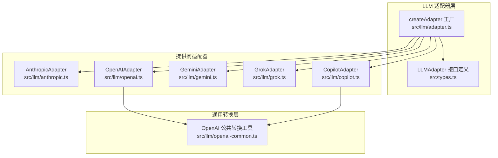
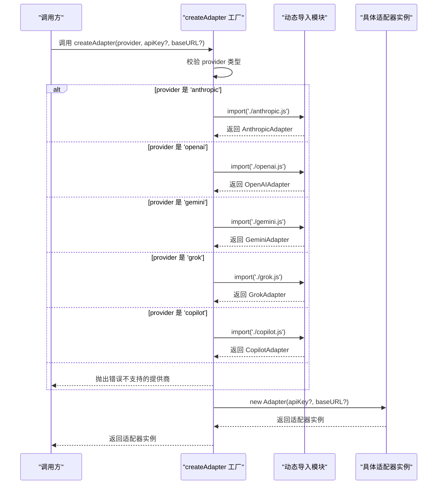
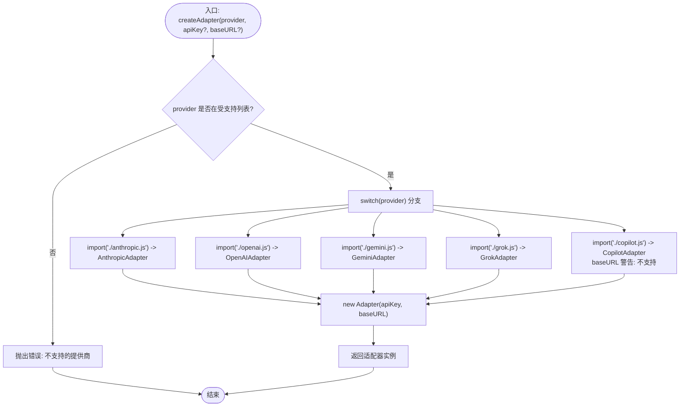
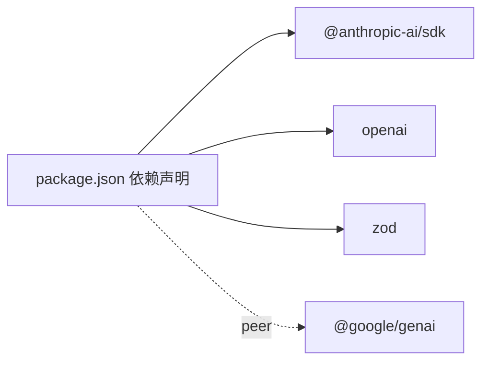

# 适配器工厂

<cite>
**本文档引用的文件**
- [adapter.ts](file://src/llm/adapter.ts)
- [anthropic.ts](file://src/llm/anthropic.ts)
- [copilot.ts](file://src/llm/copilot.ts)
- [gemini.ts](file://src/llm/gemini.ts)
- [grok.ts](file://src/llm/grok.ts)
- [openai.ts](file://src/llm/openai.ts)
- [openai-common.ts](file://src/llm/openai-common.ts)
- [types.ts](file://src/types.ts)
- [llm-adapters.test.ts](file://tests/llm-adapters.test.ts)
- [package.json](file://package.json)
- [05-copilot-test.ts](file://examples/05-copilot-test.ts)
- [12-grok.ts](file://examples/12-grok.ts)
- [13-gemini.ts](file://examples/13-gemini.ts)
</cite>

## 目录
1. [简介](#简介)
2. [项目结构](#项目结构)
3. [核心组件](#核心组件)
4. [架构总览](#架构总览)
5. [详细组件分析](#详细组件分析)
6. [依赖关系分析](#依赖关系分析)
7. [性能考量](#性能考量)
8. [故障排除指南](#故障排除指南)
9. [结论](#结论)
10. [附录](#附录)

## 简介
本文件面向 LLM 适配器工厂系统，重点阐述 createAdapter 工厂函数的设计原理与实现机制，说明如何根据提供商类型动态加载对应的适配器实现。文档涵盖以下关键内容：
- 支持的提供商类型：anthropic、copilot、grok、openai、gemini
- API 密钥的环境变量回退机制
- 延迟加载（懒加载）的优势与实现方式
- 各提供商的创建示例与最佳实践

## 项目结构
该系统围绕“适配器工厂 + 多提供商适配器”的分层架构组织，核心位于 src/llm 目录，通过统一接口 LLMAdapter 对外暴露一致的聊天与流式接口，内部以延迟加载的方式按需引入各提供商 SDK，避免不必要的依赖安装。

图表来源
- [adapter.ts:63-98](file://src/llm/adapter.ts#L63-L98)
- [anthropic.ts:187-373](file://src/llm/anthropic.ts#L187-L373)
- [openai.ts:68-280](file://src/llm/openai.ts#L68-L280)
- [gemini.ts:249-378](file://src/llm/gemini.ts#L249-L378)
- [grok.ts:19-29](file://src/llm/grok.ts#L19-L29)
- [copilot.ts:228-450](file://src/llm/copilot.ts#L228-L450)
- [openai-common.ts:1-295](file://src/llm/openai-common.ts#L1-L295)

章节来源
- [adapter.ts:1-99](file://src/llm/adapter.ts#L1-L99)
- [types.ts:518-542](file://src/types.ts#L518-L542)

## 核心组件
- createAdapter 工厂函数：根据提供商字符串返回对应适配器实例，支持延迟加载与环境变量回退。
- LLMAdapter 接口：统一的聊天与流式接口，屏蔽各提供商差异。
- OpenAI 公共转换工具：为 OpenAI 与 Copilot 提供统一的消息与工具定义转换逻辑。
- 各提供商适配器：分别封装 Anthropic、OpenAI、Gemini、Grok、Copilot 的具体实现细节。

章节来源
- [adapter.ts:41-98](file://src/llm/adapter.ts#L41-L98)
- [types.ts:518-542](file://src/types.ts#L518-L542)
- [openai-common.ts:1-295](file://src/llm/openai-common.ts#L1-L295)

## 架构总览
工厂函数在运行时根据 provider 参数进行分支选择，使用动态 import 实现延迟加载，避免一次性载入所有提供商 SDK。每个适配器负责：
- 解析 API 密钥（优先参数，其次环境变量）
- 将框架内部消息与工具定义转换为提供商 SDK 的请求格式
- 将 SDK 响应转换为框架统一的响应结构
- 支持同步聊天与流式生成两种调用路径

图表来源
- [adapter.ts:63-98](file://src/llm/adapter.ts#L63-L98)

## 详细组件分析

### 工厂函数 createAdapter 设计与实现
- 支持提供商类型：'anthropic' | 'copilot' | 'grok' | 'openai' | 'gemini'
- API 密钥回退策略：
  - anthropic → ANTHROPIC_API_KEY
  - openai → OPENAI_API_KEY
  - gemini → GEMINI_API_KEY 或 GOOGLE_API_KEY
  - grok → XAI_API_KEY
  - copilot → GITHUB_COPILOT_TOKEN 或 GITHUB_TOKEN，或交互式 OAuth2 设备流程
- baseURL 支持：openai、grok 支持自定义 base URL；copilot 不支持（会发出警告）
- 错误处理：未知提供商类型抛出错误，确保编译期可穷尽校验（通过 never 类型断言）

图表来源
- [adapter.ts:63-98](file://src/llm/adapter.ts#L63-L98)

章节来源
- [adapter.ts:41-98](file://src/llm/adapter.ts#L41-L98)

### Anthropic 适配器
- 角色与内容块映射：将框架 ContentBlock 映射到 Anthropic SDK 的 wire format，支持 text、tool_use、tool_result、image。
- 工具定义：将 LLMToolDef 重构成 Anthropic 的 Tool 结构。
- 流式处理：基于 MessageStream，累积 tool_use 输入 JSON，最终一次性发出 tool_use 事件。
- 线程安全：单实例可跨并发运行共享，底层 SDK 客户端无状态。

章节来源
- [anthropic.ts:187-373](file://src/llm/anthropic.ts#L187-L373)

### OpenAI 适配器
- 消息与工具转换：通过 openai-common 将框架消息转换为 OpenAI Chat Completions 格式，并处理 tool_result 分离为独立 tool 角色消息。
- 流式处理：累积文本增量与 tool_calls JSON，最终组装完成响应。
- 本地模型兼容：当模型未返回原生 tool_calls 时，尝试从文本中提取工具调用（fallback）。
- 线程安全：单实例可跨并发运行共享。

章节来源
- [openai.ts:68-280](file://src/llm/openai.ts#L68-L280)
- [openai-common.ts:64-294](file://src/llm/openai-common.ts#L64-L294)

### Gemini 适配器
- 角色映射：assistant → model，user → user。
- 工具与结果：将 tool_use 映射为 functionCall，tool_result 映射为 functionResponse，并构建名称映射以满足 Gemini 的要求。
- 流式处理：累积文本与 functionCall，最终生成完整响应；为缺失 call ID 的场景生成伪随机 ID。
- 线程安全：单实例可跨并发运行共享。

章节来源
- [gemini.ts:249-378](file://src/llm/gemini.ts#L249-L378)

### Grok 适配器
- 继承 OpenAIAdapter：复用 OpenAI 的消息与工具转换逻辑。
- 默认端点：官方 xAI API 端点，可通过 baseURL 覆盖。
- API 密钥：默认读取 XAI_API_KEY。

章节来源
- [grok.ts:19-29](file://src/llm/grok.ts#L19-L29)

### Copilot 适配器
- 认证流程：优先使用传入的 GitHub OAuth 令牌；否则尝试 GITHUB_COPILOT_TOKEN；再尝试 GITHUB_TOKEN；最后启动交互式 OAuth2 设备流程。
- 客户端：基于 OpenAI SDK，指向 Copilot Chat Completions 端点，携带特定头部。
- 流式处理：累积文本增量与 tool_calls JSON，最终组装完成响应。
- 并发控制：缓存与自动刷新的会话令牌，串行化并发刷新以避免竞态。

章节来源
- [copilot.ts:228-450](file://src/llm/copilot.ts#L228-L450)

### OpenAI 公共转换工具
- toOpenAITool：将 LLMToolDef 转换为 OpenAI function 工具定义。
- toOpenAIMessages：将框架消息转换为 OpenAI 消息数组，处理 tool_result 分离与 image 内容转换。
- fromOpenAICompletion：将 OpenAI 响应转换为框架统一 LLMResponse，包含工具调用解析与文本工具调用提取（fallback）。
- normalizeFinishReason：将 OpenAI finish_reason 归一化为框架词汇表。
- buildOpenAIMessageList：在必要时前置 system 消息。

章节来源
- [openai-common.ts:37-294](file://src/llm/openai-common.ts#L37-L294)

## 依赖关系分析
- 运行时依赖：@anthropic-ai/sdk、openai、zod。
- 可选依赖：@google/genai（peerDependencies，可选安装）。
- 包导出：通过 package.json 的 exports 字段暴露主入口，便于外部按需导入。

图表来源
- [package.json:45-66](file://package.json#L45-L66)

章节来源
- [package.json:45-66](file://package.json#L45-L66)

## 性能考量
- 延迟加载优势：
  - 仅在实际需要时才动态导入对应提供商模块，避免一次性载入所有 SDK，显著减少冷启动时间与内存占用。
  - 降低包体积与安装复杂度，用户只需安装所需的提供商 SDK。
- 并发与线程安全：
  - 各适配器实例可跨并发共享，底层 SDK 客户端无状态，减少对象创建开销。
- 流式处理优化：
  - 在流式场景下累积增量数据，避免频繁对象分配与字符串拼接。
  - 对于 Gemini，通过累积 token 使用量与 finish_reason，在终端事件中一次性返回完整响应，减少中间事件数量。

## 故障排除指南
- 不支持的提供商类型
  - 现象：调用 createAdapter 抛出错误。
  - 处理：确认 provider 参数是否为受支持的枚举值之一。
  - 参考：[adapter.ts:92-96](file://src/llm/adapter.ts#L92-L96)
- API 密钥未设置
  - Anthropic：检查 ANTHROPIC_API_KEY。
  - OpenAI：检查 OPENAI_API_KEY。
  - Gemini：检查 GEMINI_API_KEY 或 GOOGLE_API_KEY。
  - Grok：检查 XAI_API_KEY。
  - Copilot：检查 GITHUB_COPILOT_TOKEN 或 GITHUB_TOKEN，或触发交互式 OAuth2 设备流程。
  - 参考：[adapter.ts:48-53](file://src/llm/adapter.ts#L48-L53)
- Copilot baseURL 不生效
  - 现象：传入 baseURL 会被忽略并输出警告。
  - 处理：移除 baseURL 参数或直接使用默认端点。
  - 参考：[adapter.ts:74-76](file://src/llm/adapter.ts#L74-L76)
- 流式工具调用解析异常
  - 现象：工具调用 JSON 片段解析失败。
  - 处理：适配器会容错为空对象，确保流式过程不中断。
  - 参考：[anthropic.ts:315-328](file://src/llm/anthropic.ts#L315-L328)、[openai.ts:217-226](file://src/llm/openai.ts#L217-L226)、[copilot.ts:406-414](file://src/llm/copilot.ts#L406-L414)
- 本地模型未返回原生工具调用
  - 现象：文本中包含工具调用但无 tool_calls。
  - 处理：启用文本工具调用提取（fallback）。
  - 参考：[openai.ts:248-257](file://src/llm/openai.ts#L248-L257)、[openai-common.ts:222-235](file://src/llm/openai-common.ts#L222-L235)

章节来源
- [adapter.ts:48-96](file://src/llm/adapter.ts#L48-L96)
- [anthropic.ts:315-328](file://src/llm/anthropic.ts#L315-L328)
- [openai.ts:217-257](file://src/llm/openai.ts#L217-L257)
- [copilot.ts:406-414](file://src/llm/copilot.ts#L406-L414)
- [openai-common.ts:222-235](file://src/llm/openai-common.ts#L222-L235)

## 结论
createAdapter 工厂通过延迟加载与严格的提供商类型约束，实现了对多提供商 LLM 的统一接入。配合 OpenAI 公共转换层与各适配器的细粒度实现，系统在保证功能一致性的同时，最大化地降低了依赖成本与运行时开销。建议在生产环境中：
- 明确指定 provider 与 API 密钥来源，避免运行时回退带来的不确定性。
- 对于 Copilot，优先使用预置的 GitHub OAuth 令牌，避免交互式设备流程影响自动化任务。
- 在需要本地推理或私有部署时，合理配置 baseURL 并确保 SDK 正确安装。

## 附录

### 支持的提供商类型与环境变量回退
- anthropic：ANTHROPIC_API_KEY
- openai：OPENAI_API_KEY
- gemini：GEMINI_API_KEY 或 GOOGLE_API_KEY
- grok：XAI_API_KEY
- copilot：GITHUB_COPILOT_TOKEN 或 GITHUB_TOKEN，或交互式 OAuth2 设备流程

章节来源
- [adapter.ts:48-53](file://src/llm/adapter.ts#L48-L53)

### 延迟加载（懒加载）的优势
- 减少不必要的依赖安装与打包体积
- 降低冷启动时间与内存占用
- 提升开发体验与部署灵活性

章节来源
- [adapter.ts:55-56](file://src/llm/adapter.ts#L55-L56)

### 创建示例与最佳实践
- 单个提供商示例
  - Copilot：[05-copilot-test.ts:14-38](file://examples/05-copilot-test.ts#L14-L38)
  - Grok：[12-grok.ts:91-117](file://examples/12-grok.ts#L91-L117)
  - Gemini：[13-gemini.ts:13-37](file://examples/13-gemini.ts#L13-L37)
- 最佳实践
  - 明确 provider 与 baseURL（如需）
  - 优先使用环境变量而非硬编码密钥
  - 在并发场景下复用适配器实例
  - 针对本地模型启用文本工具调用提取（fallback）

章节来源
- [05-copilot-test.ts:14-38](file://examples/05-copilot-test.ts#L14-L38)
- [12-grok.ts:91-117](file://examples/12-grok.ts#L91-L117)
- [13-gemini.ts:13-37](file://examples/13-gemini.ts#L13-L37)