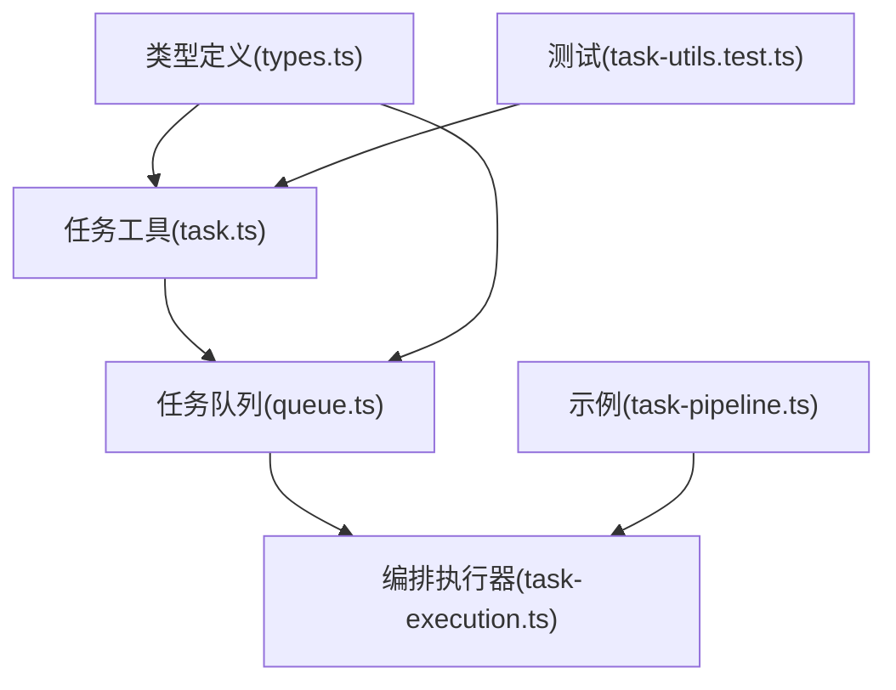
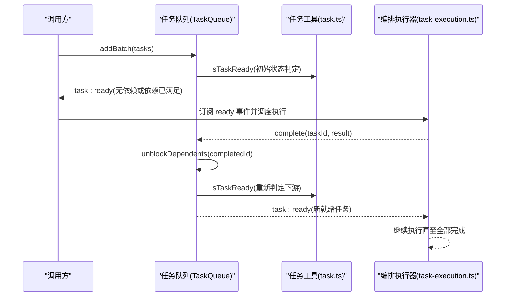
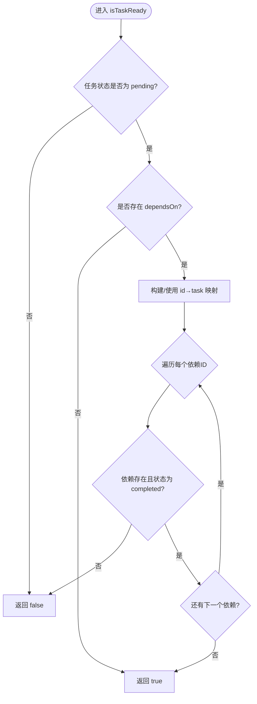
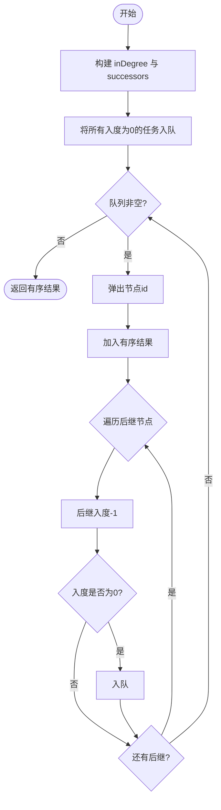
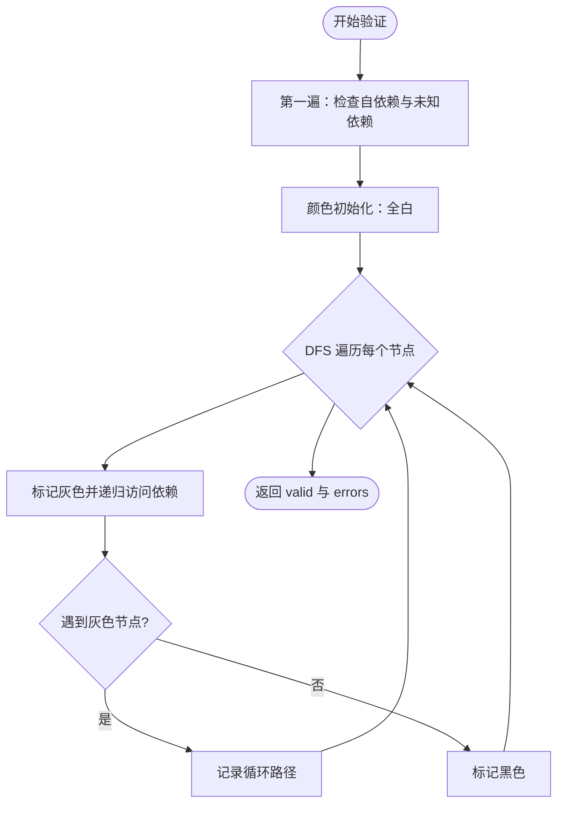
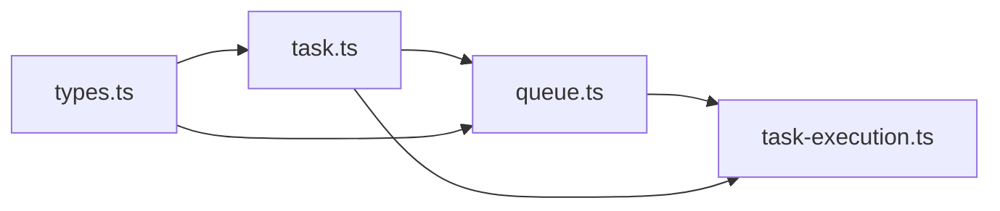

# 任务依赖管理

<cite>
**本文引用的文件**
- [packages/core/src/task/task.ts](file://packages/core/src/task/task.ts)
- [packages/core/src/task/queue.ts](file://packages/core/src/task/queue.ts)
- [packages/core/src/orchestrator/task-execution.ts](file://packages/core/src/orchestrator/task-execution.ts)
- [packages/core/src/types.ts](file://packages/core/src/types.ts)
- [packages/core/examples/basics/task-pipeline.ts](file://packages/core/examples/basics/task-pipeline.ts)
- [packages/core/tests/task-utils.test.ts](file://packages/core/tests/task-utils.test.ts)
</cite>

## 目录
1. [简介](#简介)
2. [项目结构](#项目结构)
3. [核心组件](#核心组件)
4. [架构总览](#架构总览)
5. [详细组件分析](#详细组件分析)
6. [依赖关系分析](#依赖关系分析)
7. [性能考虑](#性能考虑)
8. [故障排查指南](#故障排查指南)
9. [结论](#结论)
10. [附录](#附录)

## 简介
本文件系统性介绍 Open Multi-Agent 的任务依赖管理机制，重点覆盖：
- dependsOn 属性的使用与依赖声明方式
- isTaskReady 的工作原理与执行条件判断
- getTaskDependencyOrder 的拓扑排序（Kahn 算法）实现与应用场景
- validateTaskDependencies 的依赖图验证机制（循环依赖检测、未知依赖引用检查等）
- 依赖图的数据结构设计（邻接表、入度计算等）
- 复杂依赖关系的处理示例（并行执行、串行执行、条件依赖）
- 依赖关系优化的最佳实践与性能考量

## 项目结构
与任务依赖管理直接相关的代码主要分布在以下模块：
- 任务工具函数与算法：task.ts
- 依赖感知任务队列：queue.ts
- 编排执行器：task-execution.ts
- 类型定义：types.ts
- 示例与测试：examples/basics/task-pipeline.ts、tests/task-utils.test.ts

图表来源
- [packages/core/src/task/task.ts:1-262](file://packages/core/src/task/task.ts#L1-L262)
- [packages/core/src/task/queue.ts:1-905](file://packages/core/src/task/queue.ts#L1-L905)
- [packages/core/src/orchestrator/task-execution.ts:1-800](file://packages/core/src/orchestrator/task-execution.ts#L1-L800)
- [packages/core/src/types.ts:2051-2083](file://packages/core/src/types.ts#L2051-L2083)
- [packages/core/examples/basics/task-pipeline.ts:120-180](file://packages/core/examples/basics/task-pipeline.ts#L120-L180)
- [packages/core/tests/task-utils.test.ts:40-156](file://packages/core/tests/task-utils.test.ts#L40-L156)

章节来源
- [packages/core/src/task/task.ts:1-262](file://packages/core/src/task/task.ts#L1-L262)
- [packages/core/src/task/queue.ts:1-905](file://packages/core/src/task/queue.ts#L1-L905)
- [packages/core/src/orchestrator/task-execution.ts:1-800](file://packages/core/src/orchestrator/task-execution.ts#L1-L800)
- [packages/core/src/types.ts:2051-2083](file://packages/core/src/types.ts#L2051-L2083)
- [packages/core/examples/basics/task-pipeline.ts:120-180](file://packages/core/examples/basics/task-pipeline.ts#L120-L180)
- [packages/core/tests/task-utils.test.ts:40-156](file://packages/core/tests/task-utils.test.ts#L40-L156)

## 核心组件
- 任务模型与依赖字段
  - Task 接口包含 id、title、description、status、assignee、dependsOn、memoryScope、dependencyPayload 等。其中 dependsOn 用于声明前置任务 ID 列表。
- 任务工具函数
  - createTask：创建任务并复制 dependsOn 数组，避免外部修改影响内部状态。
  - isTaskReady：判断任务是否可立即执行。
  - getTaskDependencyOrder：基于 Kahn 算法对任务进行拓扑排序。
  - validateTaskDependencies：校验依赖图合法性（自依赖、未知依赖、环）。
- 任务队列
  - TaskQueue：维护任务集合与状态转换；在任务完成时自动解除下游阻塞，并发出事件。
- 编排执行器
  - executeQueue：订阅“任务就绪”事件，按并发限制调度执行，并在完成后触发依赖解锁。

章节来源
- [packages/core/src/types.ts:2051-2083](file://packages/core/src/types.ts#L2051-L2083)
- [packages/core/src/task/task.ts:23-114](file://packages/core/src/task/task.ts#L23-L114)
- [packages/core/src/task/task.ts:120-182](file://packages/core/src/task/task.ts#L120-L182)
- [packages/core/src/task/task.ts:188-261](file://packages/core/src/task/task.ts#L188-L261)
- [packages/core/src/task/queue.ts:64-105](file://packages/core/src/task/queue.ts#L64-L105)
- [packages/core/src/orchestrator/task-execution.ts:661-800](file://packages/core/src/orchestrator/task-execution.ts#L661-L800)

## 架构总览
下图展示了依赖管理的整体流程：从任务创建、依赖校验、拓扑排序到执行与依赖解锁。

图表来源
- [packages/core/src/task/queue.ts:85-105](file://packages/core/src/task/queue.ts#L85-L105)
- [packages/core/src/task/queue.ts:433-441](file://packages/core/src/task/queue.ts#L433-L441)
- [packages/core/src/task/queue.ts:726-748](file://packages/core/src/task/queue.ts#L726-L748)
- [packages/core/src/task/task.ts:98-114](file://packages/core/src/task/task.ts#L98-L114)
- [packages/core/src/orchestrator/task-execution.ts:661-800](file://packages/core/src/orchestrator/task-execution.ts#L661-L800)

## 详细组件分析

### dependsOn 属性与依赖声明
- 作用：通过字符串数组声明当前任务的前置任务 ID。
- 语义：只有当所有 dependsOn 中的任务均处于 completed 状态时，当前任务才可执行。
- 数据流：
  - 创建任务时复制 dependsOn，避免共享可变状态。
  - 加入队列时根据当前任务集判定初始状态为 pending 或 blocked。
  - 任务完成后，队列扫描下游任务并尝试解除阻塞。

章节来源
- [packages/core/src/types.ts:2051-2083](file://packages/core/src/types.ts#L2051-L2083)
- [packages/core/src/task/task.ts:36-75](file://packages/core/src/task/task.ts#L36-L75)
- [packages/core/src/task/queue.ts:85-105](file://packages/core/src/task/queue.ts#L85-L105)
- [packages/core/src/task/queue.ts:433-441](file://packages/core/src/task/queue.ts#L433-L441)

### isTaskReady：任务就绪判定
- 判定规则：
  - 任务状态必须为 pending。
  - 若存在 dependsOn，则每个依赖必须在 allTasks 中存在且状态为 completed。
  - 若依赖缺失（未知 ID），视为不可就绪。
- 性能优化：支持传入预构建的 id→task 映射，将 O(n²) 降为 O(n)。

图表来源
- [packages/core/src/task/task.ts:98-114](file://packages/core/src/task/task.ts#L98-L114)

章节来源
- [packages/core/src/task/task.ts:98-114](file://packages/core/src/task/task.ts#L98-L114)
- [packages/core/tests/task-utils.test.ts:44-71](file://packages/core/tests/task-utils.test.ts#L44-L71)

### getTaskDependencyOrder：拓扑排序（Kahn 算法）
- 目标：输出一个线性顺序，使得每个任务出现在其所有依赖之后。
- 数据结构：
  - inDegree：记录每个任务的入度（依赖数量）。
  - successors：邻接表，记录某任务完成后可以解锁哪些下游任务。
- 算法步骤：
  - 初始化：统计入度，构建后继关系。
  - 队列：将所有入度为 0 的任务加入队列。
  - 弹出：每次弹出一个节点，加入结果序列，并将其后继的入度减一；若后继入度变为 0，则入队。
  - 结果：若图中存在环，部分任务无法被排序，返回部分有序结果。

图表来源
- [packages/core/src/task/task.ts:137-182](file://packages/core/src/task/task.ts#L137-L182)

章节来源
- [packages/core/src/task/task.ts:120-182](file://packages/core/src/task/task.ts#L120-L182)
- [packages/core/tests/task-utils.test.ts:77-113](file://packages/core/tests/task-utils.test.ts#L77-L113)

### validateTaskDependencies：依赖图验证
- 检查项：
  - 自依赖：任务在其 dependsOn 中引用自身。
  - 未知依赖：dependsOn 引用了不存在的任务 ID。
  - 循环依赖：通过 DFS 着色法（白=未访问、灰=访问中、黑=已完成）检测回边。
- 返回值：valid 布尔值与 errors 错误信息数组。

图表来源
- [packages/core/src/task/task.ts:206-261](file://packages/core/src/task/task.ts#L206-L261)

章节来源
- [packages/core/src/task/task.ts:188-261](file://packages/core/src/task/task.ts#L188-L261)
- [packages/core/tests/task-utils.test.ts:119-156](file://packages/core/tests/task-utils.test.ts#L119-L156)

### 依赖图的数据结构
- 邻接表：successors[id] = 下游任务 ID 列表，表示“完成 id 后可解锁这些任务”。
- 入度表：inDegree[id] 表示该任务有多少个尚未完成的依赖。
- 映射表：taskById 提供 O(1) 查找任务对象，提升 isTaskReady 与解锁过程效率。

章节来源
- [packages/core/src/task/task.ts:140-159](file://packages/core/src/task/task.ts#L140-L159)
- [packages/core/src/task/queue.ts:726-748](file://packages/core/src/task/queue.ts#L726-L748)

### 复杂依赖关系处理示例
- 串行执行：A → B → C，B 依赖 A，C 依赖 B。
- 并行执行：A 完成后，B 与 C 同时运行（B 和 C 都只依赖 A）。
- 条件依赖：通过 memoryScope 控制注入上下文范围；dependencyPayload 控制依赖结果格式（output/structured/both）。
- 示例参考：
  - 基础流水线示例展示了设计→实现→测试与评审的并行分支。
  - 测试用例覆盖了钻石型依赖与循环依赖场景。

章节来源
- [packages/core/examples/basics/task-pipeline.ts:120-180](file://packages/core/examples/basics/task-pipeline.ts#L120-L180)
- [packages/core/tests/task-utils.test.ts:90-113](file://packages/core/tests/task-utils.test.ts#L90-L113)
- [packages/core/src/types.ts:2051-2083](file://packages/core/src/types.ts#L2051-L2083)

## 依赖关系分析
- 耦合与内聚：
  - task.ts 提供纯函数，内聚度高，便于复用与测试。
  - queue.ts 封装状态机与事件驱动，与 task.ts 松耦合。
  - task-execution.ts 订阅队列事件，解耦执行逻辑与依赖解析。
- 直接/间接依赖：
  - queue.ts 依赖 task.ts 的 isTaskReady 与 validateTaskDependencies。
  - task-execution.ts 依赖 queue.ts 的事件与快照能力。
- 循环依赖：
  - 通过 validateTaskDependencies 在计划阶段检测，避免运行时死锁。
- 外部集成点：
  - 编排器通过 executeQueue 协调 AgentPool 并发与预算门控。

图表来源
- [packages/core/src/task/task.ts:1-262](file://packages/core/src/task/task.ts#L1-L262)
- [packages/core/src/task/queue.ts:1-905](file://packages/core/src/task/queue.ts#L1-L905)
- [packages/core/src/orchestrator/task-execution.ts:1-800](file://packages/core/src/orchestrator/task-execution.ts#L1-L800)
- [packages/core/src/types.ts:2051-2083](file://packages/core/src/types.ts#L2051-L2083)

章节来源
- [packages/core/src/task/task.ts:1-262](file://packages/core/src/task/task.ts#L1-L262)
- [packages/core/src/task/queue.ts:1-905](file://packages/core/src/task/queue.ts#L1-L905)
- [packages/core/src/orchestrator/task-execution.ts:1-800](file://packages/core/src/orchestrator/task-execution.ts#L1-L800)
- [packages/core/src/types.ts:2051-2083](file://packages/core/src/types.ts#L2051-L2083)

## 性能考虑
- 时间复杂度
  - isTaskReady：O(n)（借助预建映射），避免重复 Map 构建。
  - getTaskDependencyOrder：O(V+E)，V 为任务数，E 为依赖边数。
  - validateTaskDependencies：O(V+E)，DFS 着色一次遍历。
- 空间复杂度
  - 邻接表与入度表占用 O(V+E)。
  - 任务映射表占用 O(V)。
- 并发与调度
  - 编排器通过 AgentPool 的并发上限与预算门控限制实际并行度。
  - 依赖-first 策略优先调度能解锁最多下游的任务，适合强依赖 DAG。
- 建议
  - 在批量添加任务前，使用 getTaskDependencyOrder 预排序可减少多次状态重算。
  - 合理设置 maxConcurrency，避免过多并行导致资源争用。
  - 使用 dependencyPayload 与 memoryScope 精细控制上下文注入，减少不必要的数据传递。

[本节为通用性能讨论，不直接分析具体文件]

## 故障排查指南
- 常见错误
  - 未知依赖引用：validateTaskDependencies 会报告 unknown dependency。
  - 自依赖：报告 depends on itself。
  - 循环依赖：报告 cyclic dependency，并给出路径。
- 定位方法
  - 查看 validateTaskDependencies 返回的 errors 数组。
  - 检查队列事件：task:failed、task:skipped 以及 all:complete。
  - 检查任务快照与进度：getProgress 可了解各状态任务数量。
- 恢复策略
  - 使用 PlanPatch 追加修复任务、重定向或跳过失败分支。
  - 持久化 checkpoint，支持中断后恢复执行。

章节来源
- [packages/core/src/task/task.ts:206-261](file://packages/core/src/task/task.ts#L206-L261)
- [packages/core/src/task/queue.ts:433-505](file://packages/core/src/task/queue.ts#L433-L505)
- [packages/core/src/task/queue.ts:619-667](file://packages/core/src/task/queue.ts#L619-L667)
- [packages/core/src/orchestrator/task-execution.ts:186-277](file://packages/core/src/orchestrator/task-execution.ts#L186-L277)

## 结论
Open Multi-Agent 的任务依赖管理以清晰的依赖声明（dependsOn）、严格的图验证（validateTaskDependencies）、高效的拓扑排序（getTaskDependencyOrder）与事件驱动的解锁机制为核心。配合编排器的并发控制与预算门控，系统能够安全、高效地执行复杂的 DAG 任务流。通过合理的依赖设计与性能调优，可在保证正确性的前提下最大化并行度与吞吐。

[本节为总结性内容，不直接分析具体文件]

## 附录
- 关键 API 与用法参考
  - 任务创建与依赖：createTask、dependsOn
  - 就绪判定：isTaskReady
  - 拓扑排序：getTaskDependencyOrder
  - 依赖验证：validateTaskDependencies
  - 队列操作：add/addBatch、complete/fail/skip、on 事件订阅
  - 编排执行：executeQueue 与并发/预算门控

章节来源
- [packages/core/src/task/task.ts:23-261](file://packages/core/src/task/task.ts#L23-L261)
- [packages/core/src/task/queue.ts:85-105](file://packages/core/src/task/queue.ts#L85-L105)
- [packages/core/src/orchestrator/task-execution.ts:661-800](file://packages/core/src/orchestrator/task-execution.ts#L661-L800)
- [packages/core/examples/basics/task-pipeline.ts:120-180](file://packages/core/examples/basics/task-pipeline.ts#L120-L180)
- [packages/core/tests/task-utils.test.ts:40-156](file://packages/core/tests/task-utils.test.ts#L40-L156)