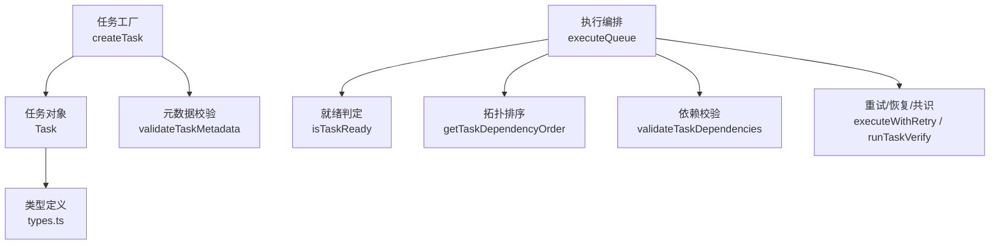
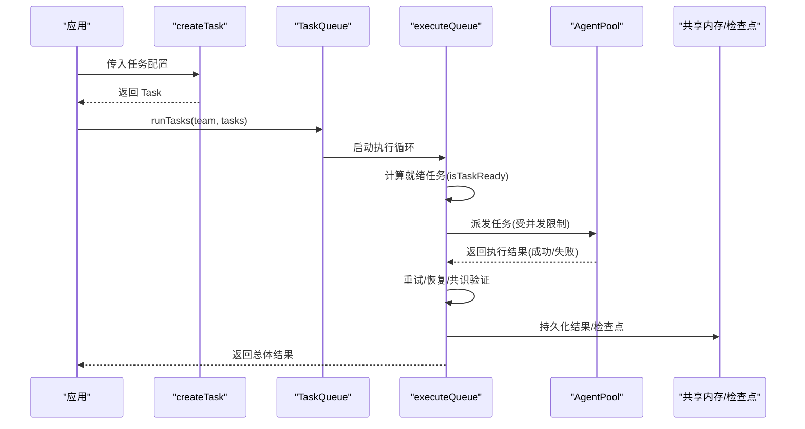
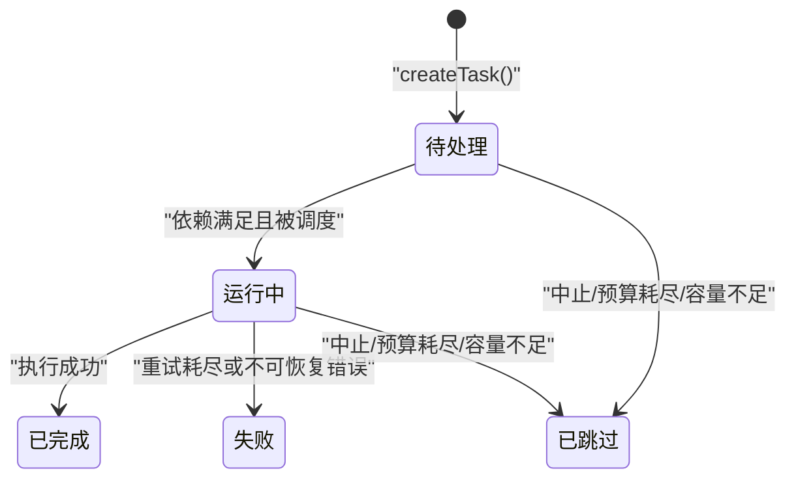
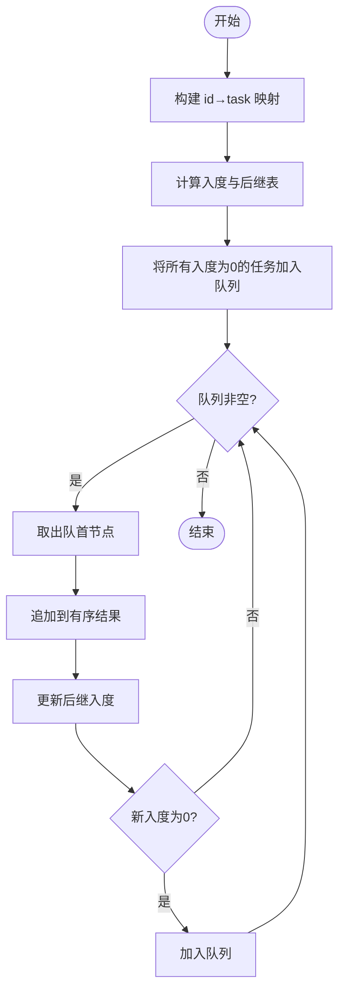
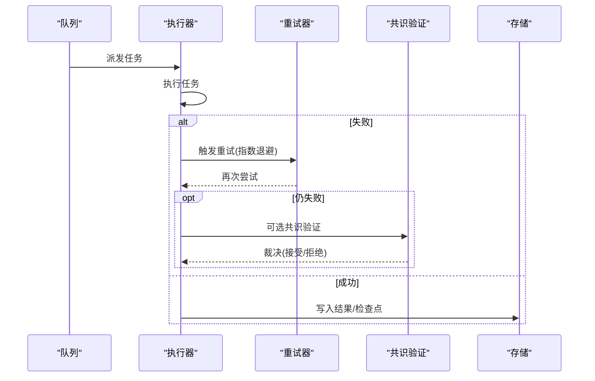
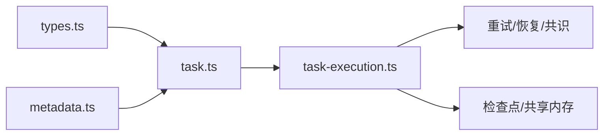

# 任务定义

<cite>
**本文引用的文件**
- [packages/core/src/task/task.ts](file://packages/core/src/task/task.ts)
- [packages/core/src/task/metadata.ts](file://packages/core/src/task/metadata.ts)
- [packages/core/src/types.ts](file://packages/core/src/types.ts)
- [packages/core/src/orchestrator/task-execution.ts](file://packages/core/src/orchestrator/task-execution.ts)
- [packages/core/examples/basics/task-pipeline.ts](file://packages/core/examples/basics/task-pipeline.ts)
- [packages/core/examples/patterns/task-retry.ts](file://packages/core/examples/patterns/task-retry.ts)
</cite>

## 目录
1. [简介](#简介)
2. [项目结构](#项目结构)
3. [核心组件](#核心组件)
4. [架构总览](#架构总览)
5. [详细组件分析](#详细组件分析)
6. [依赖关系分析](#依赖关系分析)
7. [性能考虑](#性能考虑)
8. [故障排查指南](#故障排查指南)
9. [结论](#结论)
10. [附录：示例与最佳实践](#附录示例与最佳实践)

## 简介
本章节聚焦 Open Multi-Agent 中“任务”的定义、创建与生命周期管理。内容涵盖：
- Task 接口属性与配置项（标题、描述、状态、依赖、优先级、重试策略、元数据、需求校验、共识验证等）
- createTask 工厂函数的用法与约束
- 任务元数据的结构与验证机制
- 任务生命周期状态转换（pending、running、completed、failed 等）及触发条件
- 任务设计最佳实践（可复用模板、复杂依赖处理、合理重试策略）
- 通过示例展示不同类型任务的创建与配置方式

## 项目结构
围绕任务系统的关键代码分布在以下位置：
- 任务工厂与工具函数：packages/core/src/task/task.ts
- 任务元数据校验：packages/core/src/task/metadata.ts
- 类型定义（Task、TaskMetadata、TaskRequirements、TaskStatus 等）：packages/core/src/types.ts
- 执行编排与调度（含重试、检查点、恢复、共识验证等）：packages/core/src/orchestrator/task-execution.ts
- 示例：显式依赖流水线与带退避的重试模式
  - packages/core/examples/basics/task-pipeline.ts
  - packages/core/examples/patterns/task-retry.ts

图表来源
- [packages/core/src/task/task.ts:23-75](file://packages/core/src/task/task.ts#L23-L75)
- [packages/core/src/task/metadata.ts:52-83](file://packages/core/src/task/metadata.ts#L52-L83)
- [packages/core/src/orchestrator/task-execution.ts:661-800](file://packages/core/src/orchestrator/task-execution.ts#L661-L800)

章节来源
- [packages/core/src/task/task.ts:23-75](file://packages/core/src/task/task.ts#L23-L75)
- [packages/core/src/task/metadata.ts:52-83](file://packages/core/src/task/metadata.ts#L52-L83)
- [packages/core/src/types.ts:1925-1941](file://packages/core/src/types.ts#L1925-L1941)

## 核心组件
- 任务工厂 createTask：生成不可变态的任务对象，包含 ID、标题、描述、初始状态 pending、时间戳、依赖、内存作用域、依赖载荷、重试参数、角色、优先级、元数据、需求与共识验证选项。
- 就绪判定 isTaskReady：仅当任务为 pending 且所有依赖已完成时返回 true；缺失的依赖视为不可解析。
- 拓扑排序 getTaskDependencyOrder：基于 Kahn 算法对任务进行拓扑排序，保证依赖先于后继。
- 依赖校验 validateTaskDependencies：检测未知依赖、自依赖与环依赖。
- 元数据校验 validateTaskMetadata：限制键名格式、长度、数组元素类型与数量，并脱敏敏感文本。
- 执行编排 executeQueue：负责任务派发、并发控制、重试、检查点、恢复、共识验证与结果持久化。

章节来源
- [packages/core/src/task/task.ts:23-75](file://packages/core/src/task/task.ts#L23-L75)
- [packages/core/src/task/task.ts:98-114](file://packages/core/src/task/task.ts#L98-L114)
- [packages/core/src/task/task.ts:137-182](file://packages/core/src/task/task.ts#L137-L182)
- [packages/core/src/task/task.ts:206-261](file://packages/core/src/task/task.ts#L206-L261)
- [packages/core/src/task/metadata.ts:52-83](file://packages/core/src/task/metadata.ts#L52-L83)
- [packages/core/src/orchestrator/task-execution.ts:661-800](file://packages/core/src/orchestrator/task-execution.ts#L661-L800)

## 架构总览
下图展示了从任务创建到执行落地的关键路径：应用层调用 createTask 构造任务，交由 orchestrator.runTasks 进入 executeQueue；队列根据依赖关系计算就绪任务，按并发上限派发执行；执行过程中支持重试、检查点、恢复与共识验证；最终将结果写入共享内存并保存检查点。

图表来源
- [packages/core/src/task/task.ts:23-75](file://packages/core/src/task/task.ts#L23-L75)
- [packages/core/src/orchestrator/task-execution.ts:661-800](file://packages/core/src/orchestrator/task-execution.ts#L661-L800)

## 详细组件分析

### 任务接口与配置项
- 标识与描述
  - id：唯一标识（由工厂生成）
  - title：任务标题
  - description：任务描述
- 状态与时间
  - status：初始为 pending；后续在运行期间由编排器更新为 running/completed/failed/skipped 等
  - createdAt/updatedAt：创建与更新时间戳
- 执行上下文
  - assignee：指定代理名称（可选）
  - role：角色标签（可选）
  - memoryScope：内存作用域，'dependencies' 或 'all'
  - dependencyPayload：依赖载荷选择，'output' | 'structured' | 'both'
- 依赖与优先级
  - dependsOn：依赖任务 ID 列表
  - priority：'low' | 'normal' | 'high' | 'critical'
- 重试策略
  - maxRetries：最大重试次数
  - retryDelayMs：基础延迟毫秒数
  - retryBackoff：退避倍数
- 元数据与需求
  - metadata：业务元数据（经校验与脱敏）
  - requires：任务需求（用于代理选择与校验）
- 共识验证
  - verify：共识验证选项（judges、quorum、maxRounds、verdictSchema 等）

章节来源
- [packages/core/src/task/task.ts:23-75](file://packages/core/src/task/task.ts#L23-L75)
- [packages/core/src/types.ts:1925-1941](file://packages/core/src/types.ts#L1925-L1941)
- [packages/core/src/types.ts:1957-1978](file://packages/core/src/types.ts#L1957-L1978)

### 任务元数据结构与验证
- 键名规则：必须以字母开头，允许字母、数字、下划线、点、短横线，长度不超过 64；禁止使用保留前缀“oma.”与凭据风格键名。
- 值类型：字符串、数字、布尔值，或同构的字符串/数字/布尔数组。
- 长度限制：字符串最大 1024 字符；数组最多 16 个元素；元数据条目最多 16 个。
- 安全：自动脱敏敏感文本；冻结对象防止篡改。
- 追踪属性：元数据会被展平为以“oma.task.meta.”为前缀的追踪属性。

章节来源
- [packages/core/src/task/metadata.ts:52-83](file://packages/core/src/task/metadata.ts#L52-L83)
- [packages/core/src/task/metadata.ts:85-93](file://packages/core/src/task/metadata.ts#L85-L93)

### 任务生命周期与状态转换
- 初始状态：pending（由 createTask 设置）
- 就绪条件：status 为 pending 且所有 dependsOn 指向的任务均为 completed
- 运行阶段：被调度后进入 running（由执行器在派发时设置）
- 完成阶段：执行成功后标记为 completed，并写入 result
- 失败阶段：达到最大重试次数或不可恢复错误时标记为 failed
- 跳过阶段：因中止、预算耗尽、容量不足等原因被跳过（skipped）

图表来源
- [packages/core/src/task/task.ts:23-75](file://packages/core/src/task/task.ts#L23-L75)
- [packages/core/src/task/task.ts:98-114](file://packages/core/src/task/task.ts#L98-L114)
- [packages/core/src/orchestrator/task-execution.ts:661-800](file://packages/core/src/orchestrator/task-execution.ts#L661-L800)

### 依赖关系与拓扑排序
- 依赖图构建：仅统计存在于当前任务集合中的依赖边
- 入度计数与后继表：用于 Kahn 算法
- 拓扑顺序：无依赖任务优先；若存在环，返回可排序子集，建议在生产路径先调用依赖校验
- 就绪判定：仅当所有依赖均存在且 completed 时才认为就绪

图表来源
- [packages/core/src/task/task.ts:137-182](file://packages/core/src/task/task.ts#L137-L182)

章节来源
- [packages/core/src/task/task.ts:137-182](file://packages/core/src/task/task.ts#L137-L182)
- [packages/core/src/task/task.ts:206-261](file://packages/core/src/task/task.ts#L206-L261)

### 重试策略与执行流程
- 重试触发：任务执行失败时，依据 maxRetries、retryDelayMs、retryBackoff 进行指数退避重试
- 事件上报：每次重试会触发 task_retry 事件，包含尝试次数、最大次数、错误信息与下次延迟
- 恢复与检查点：在执行边界与任务完成后保存检查点，支持崩溃恢复与计划修订
- 共识验证：可选 per-task verify，使用 judges 进行多轮质询与裁决

图表来源
- [packages/core/src/orchestrator/task-execution.ts:661-800](file://packages/core/src/orchestrator/task-execution.ts#L661-L800)
- [packages/core/examples/patterns/task-retry.ts:88-105](file://packages/core/examples/patterns/task-retry.ts#L88-L105)

章节来源
- [packages/core/examples/patterns/task-retry.ts:88-105](file://packages/core/examples/patterns/task-retry.ts#L88-L105)
- [packages/core/src/orchestrator/task-execution.ts:661-800](file://packages/core/src/orchestrator/task-execution.ts#L661-L800)

### 任务需求与代理选择
- requires：声明任务需求（如能力、模型、工具等），用于代理选择与运行时校验
- 校验：执行前会校验任务需求是否满足，不满足则抛出 InvalidTaskRequirementsError
- 默认与路由：结合模型路由与代理默认配置，动态选择最合适的代理执行

章节来源
- [packages/core/src/orchestrator/task-execution.ts:46-58](file://packages/core/src/orchestrator/task-execution.ts#L46-L58)
- [packages/core/src/errors.ts:11-20](file://packages/core/src/errors.ts#L11-L20)

## 依赖关系分析
- 模块耦合
  - task.ts 依赖 types.ts 的类型定义与 metadata.ts 的元数据校验
  - task-execution.ts 依赖 types.ts、task.ts、metadata.ts、重试/共识/恢复/检查点等模块
- 外部依赖
  - 共享内存与检查点存储
  - 代理池与模型路由
- 潜在风险
  - 循环依赖会导致拓扑排序不完整，需提前校验
  - 未满足的需求会导致代理选择失败

图表来源
- [packages/core/src/task/task.ts:23-75](file://packages/core/src/task/task.ts#L23-L75)
- [packages/core/src/task/metadata.ts:52-83](file://packages/core/src/task/metadata.ts#L52-L83)
- [packages/core/src/orchestrator/task-execution.ts:661-800](file://packages/core/src/orchestrator/task-execution.ts#L661-L800)

章节来源
- [packages/core/src/task/task.ts:23-75](file://packages/core/src/task/task.ts#L23-L75)
- [packages/core/src/orchestrator/task-execution.ts:661-800](file://packages/core/src/orchestrator/task-execution.ts#L661-L800)

## 性能考虑
- 并发控制：executeQueue 通过 AgentPool 的并发上限限制同时运行的任务数，避免资源争用
- 拓扑排序复杂度：O(n + e)，适合大规模任务图
- 检查点写入：仅在安全边界与任务完成后写入，降低开销；失败不影响主流程
- 重试退避：指数退避减少瞬时拥塞，提高成功率

[本节提供通用指导，无需特定文件引用]

## 故障排查指南
- 依赖问题
  - 未知依赖或自依赖：使用 validateTaskDependencies 提前发现
  - 循环依赖：拓扑排序无法完整排序，需修正依赖图
- 代理选择失败
  - 检查 requires 是否满足团队代理能力
  - 查看模型路由与默认工具预设是否匹配
- 重试与恢复
  - 观察 task_retry 事件，确认重试次数与延迟
  - 检查检查点是否成功保存，必要时启用持久化存储
- 共识验证
  - 调整 quorum、maxRounds、verdictSchema 与 judgePrompt，确保裁决逻辑符合预期

章节来源
- [packages/core/src/task/task.ts:206-261](file://packages/core/src/task/task.ts#L206-L261)
- [packages/core/src/orchestrator/task-execution.ts:661-800](file://packages/core/src/orchestrator/task-execution.ts#L661-L800)

## 结论
Open Multi-Agent 的任务系统通过清晰的接口与严格的校验机制，提供了强大的任务建模与执行能力。createTask 简化了任务初始化，isTaskReady 与拓扑排序确保依赖正确性，validateTaskDependencies 保障图结构健康，executeQueue 负责并发、重试、检查点与共识验证。遵循本文的最佳实践，可以构建稳定、可观测、可恢复的多智能体工作流。

[本节总结性内容，无需特定文件引用]

## 附录：示例与最佳实践

### 示例一：显式依赖流水线
- 场景：设计 → 实现 → 测试 + 评审（并行）
- 关键点：
  - 使用 dependsOn 建立明确依赖链
  - 通过 memoryScope 控制共享内存可见性
  - 利用 onProgress 观察任务就绪与完成

章节来源
- [packages/core/examples/basics/task-pipeline.ts:123-179](file://packages/core/examples/basics/task-pipeline.ts#L123-L179)
- [packages/core/examples/basics/task-pipeline.ts:189-215](file://packages/core/examples/basics/task-pipeline.ts#L189-L215)

### 示例二：带指数退避的重试
- 场景：数据获取任务失败时自动重试，分析任务依赖其结果
- 关键点：
  - 配置 maxRetries、retryDelayMs、retryBackoff
  - 监听 task_retry 事件记录重试过程
  - 依赖任务仅在依赖完成后执行

章节来源
- [packages/core/examples/patterns/task-retry.ts:88-105](file://packages/core/examples/patterns/task-retry.ts#L88-L105)
- [packages/core/examples/patterns/task-retry.ts:118-133](file://packages/core/examples/patterns/task-retry.ts#L118-L133)

### 最佳实践清单
- 任务模板
  - 将常用任务封装为工厂函数，统一标题、描述、重试策略与元数据
  - 使用 role 与 requires 明确任务职责与能力要求
- 复杂依赖
  - 先调用 validateTaskDependencies 检测环与未知依赖
  - 使用 getTaskDependencyOrder 输出执行顺序，便于调试与可视化
- 重试策略
  - 对外部不稳定操作（网络、I/O）设置合理的 maxRetries 与指数退避
  - 对幂等操作可适度增加重试次数；对非幂等操作谨慎重试
- 元数据
  - 使用 metadata 记录业务上下文（如实验版本、数据集标签），注意长度与类型限制
  - 避免使用敏感键名与保留前缀
- 共识验证
  - 对关键决策启用 verify，设置合适的 quorum 与 maxRounds
  - 使用 verdictSchema 约束裁决结构，提升一致性

[本节提供通用指导，无需特定文件引用]