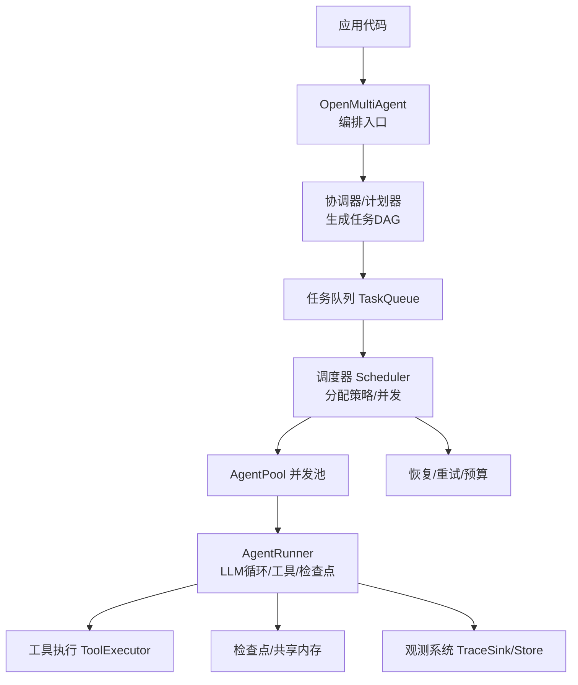
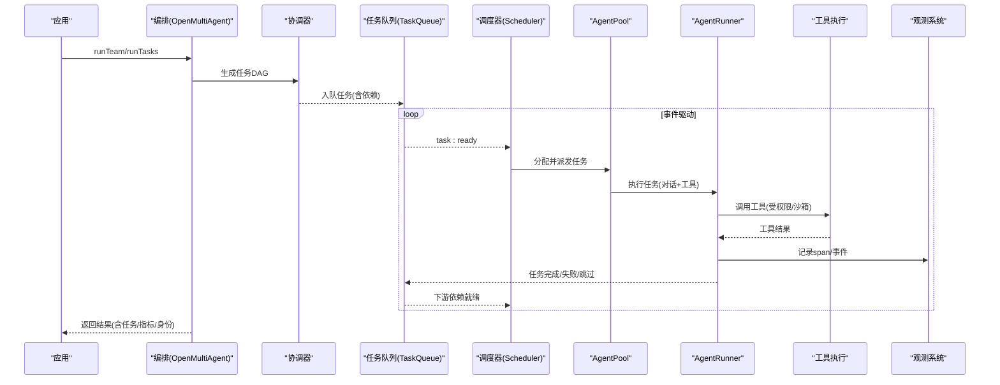
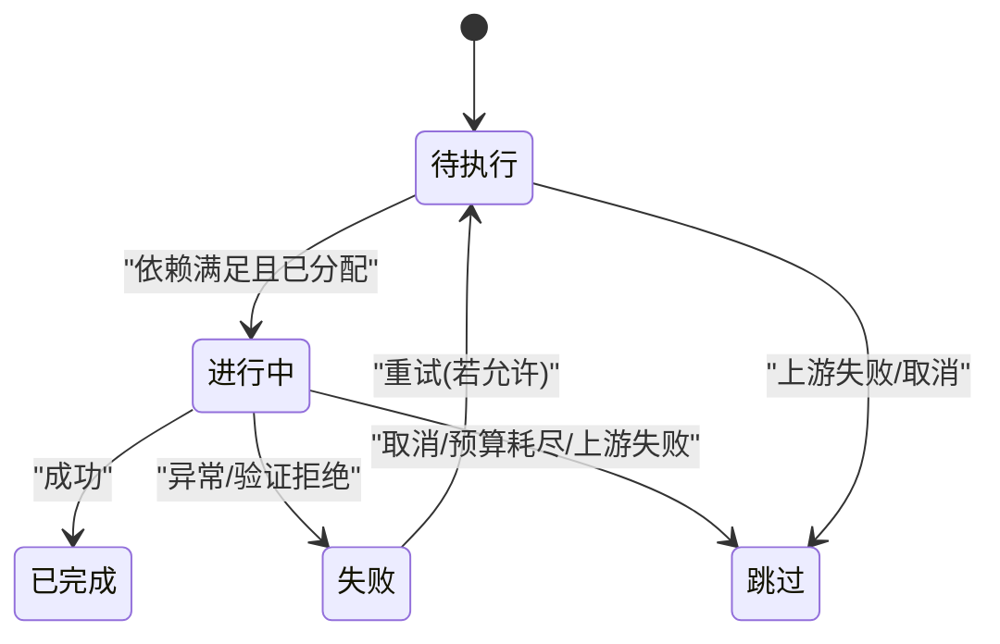
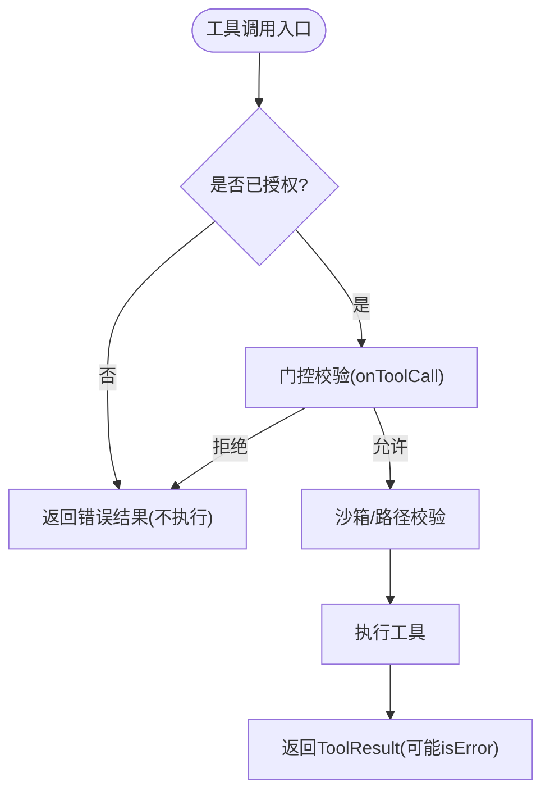
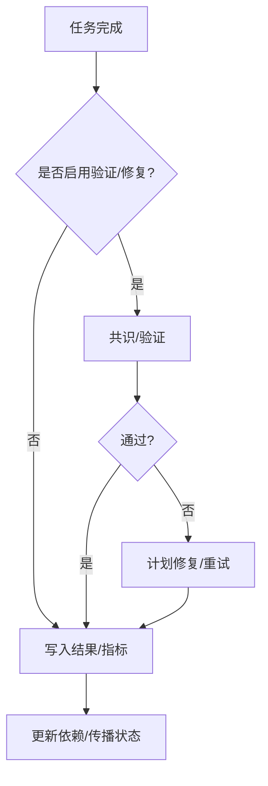
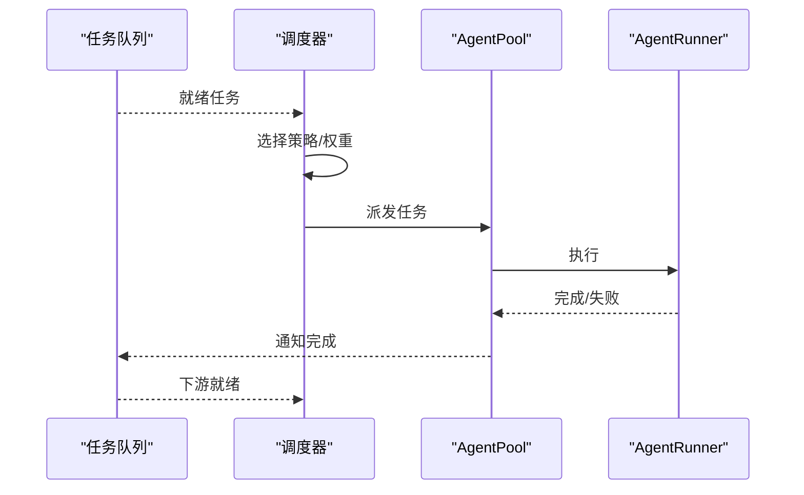
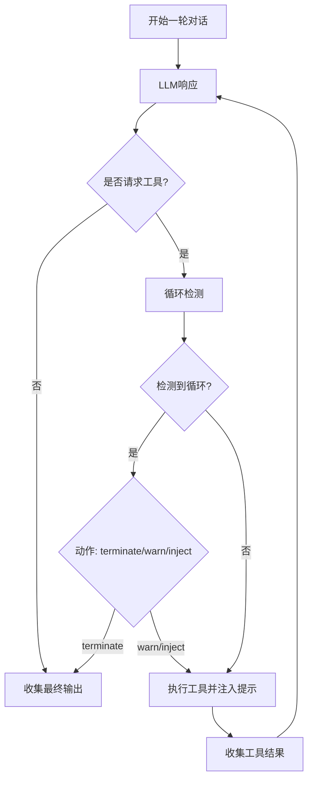
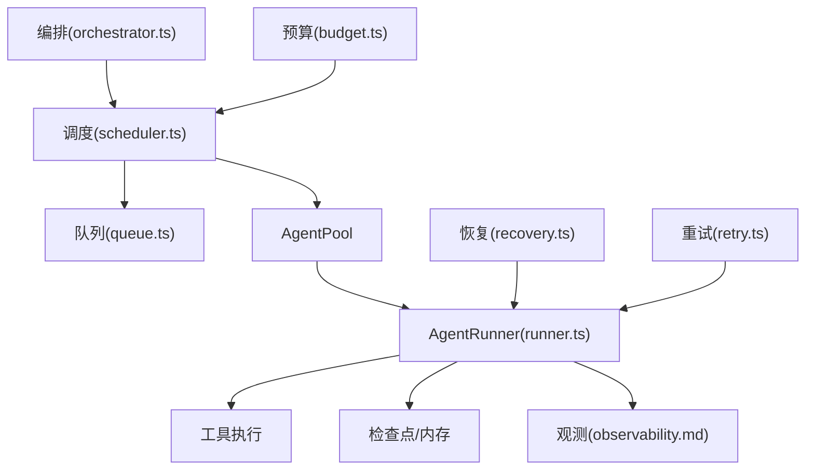

# 任务执行

<cite>
**本文引用的文件**
- [README.md](file://README.md)
- [AGENTS.md](file://AGENTS.md)
- [index.ts](file://packages/core/src/index.ts)
- [types.ts](file://packages/core/src/types.ts)
- [runner.ts](file://packages/core/src/agent/runner.ts)
- [task-scheduling.md](file://docs/task-scheduling.md)
- [observability.md](file://docs/observability.md)
- [queue.ts](file://packages/core/src/task/queue.ts)
- [task.ts](file://packages/core/src/task/task.ts)
- [scheduler.ts](file://packages/core/src/orchestrator/scheduler.ts)
- [orchestrator.ts](file://packages/core/src/orchestrator/orchestrator.ts)
- [task-execution.ts](file://packages/core/src/orchestrator/task-execution.ts)
- [recovery.ts](file://packages/core/src/orchestrator/recovery.ts)
- [retry.ts](file://packages/core/src/orchestrator/retry.ts)
- [budget.ts](file://packages/core/src/orchestrator/budget.ts)
- [memory-store.ts](file://packages/core/src/memory/file-store.ts)
</cite>

## 目录
1. [简介](#简介)
2. [项目结构](#项目结构)
3. [核心组件](#核心组件)
4. [架构总览](#架构总览)
5. [详细组件分析](#详细组件分析)
6. [依赖关系分析](#依赖关系分析)
7. [性能与优化](#性能与优化)
8. [故障排查指南](#故障排查指南)
9. [结论](#结论)
10. [附录：编排示例](#附录编排示例)

## 简介
本章节聚焦 Open Multi-Agent（OMA）的任务执行机制，覆盖从任务创建到完成的完整生命周期：状态转换、执行上下文、结果处理、错误恢复、重试策略、智能体协作、监控追踪以及并行与资源池化等优化手段。OMA 通过协调器在运行时生成任务有向无环图（DAG），由调度器驱动事件驱动的 DAG 执行，AgentRunner 负责单任务的 LLM 对话循环、工具调用与检查点持久化，最终聚合为可回放、可审计的运行结果。

## 项目结构
- 入口与公共 API：`packages/core/src/index.ts` 暴露 `OpenMultiAgent`、`Team`、`TaskQueue`、`Scheduler`、`AgentPool`、`ToolExecutor`、观测与存储等能力。
- 类型契约：`packages/core/src/types.ts` 定义任务、运行结果、事件、检查点、配置等核心类型。
- 任务执行核心：`packages/core/src/agent/runner.ts` 实现 AgentRunner 的流式对话、工具执行、循环检测、预算控制与检查点。
- 任务队列与调度：`packages/core/src/task/queue.ts`、`packages/core/src/task/task.ts`、`packages/core/src/orchestrator/scheduler.ts` 提供就绪集合、依赖解析、分配策略与事件驱动执行。
- 编排与恢复：`packages/core/src/orchestrator/orchestrator.ts`、`task-execution.ts`、`recovery.ts`、`retry.ts`、`budget.ts` 负责计划、执行、恢复、重试与预算。
- 内存与检查点：`packages/core/src/memory/file-store.ts` 提供进程内文件级持久化，配合检查点用于中断恢复。
- 文档：`docs/task-scheduling.md`、`docs/observability.md` 描述调度、审批、进度事件、追踪与离线查看器。

图表来源
- [index.ts:57-159](file://packages/core/src/index.ts#L57-L159)
- [task-scheduling.md:1-26](file://docs/task-scheduling.md#L1-L26)
- [runner.ts:837-904](file://packages/core/src/agent/runner.ts#L837-L904)

章节来源
- [index.ts:57-159](file://packages/core/src/index.ts#L57-L159)
- [AGENTS.md:64-70](file://AGENTS.md#L64-L70)

## 核心组件
- 编排入口与团队：`OpenMultiAgent`、`Team`，支持 `runAgent`、`runTasks`、`runTeam` 三种模式。
- 任务模型与队列：`Task`、`TaskStatus`、`TaskQueue`，维护依赖、就绪集、完成传播与跳过逻辑。
- 调度与分配：`Scheduler`、`AgentSelector`，支持多种分配策略（轮询、最少忙、能力匹配、依赖优先、复合）。
- 执行器与循环：`AgentRunner`，驱动多轮 LLM 调用、工具执行、循环检测、预算限制与检查点。
- 恢复与重试：`recovery.ts`、`retry.ts`、`budget.ts`，在任务结果屏障处进行修复、重试与预算控制。
- 观测与回放：`observability.md` 描述的 v2 追踪、批处理导出、离线 Run Viewer。

章节来源
- [index.ts:57-159](file://packages/core/src/index.ts#L57-L159)
- [types.ts:2003-2099](file://packages/core/src/types.ts#L2003-L2099)
- [task-scheduling.md:1-26](file://docs/task-scheduling.md#L1-L26)
- [runner.ts:837-904](file://packages/core/src/agent/runner.ts#L837-L904)

## 架构总览
下图展示任务从创建到完成的端到端流程：协调器生成计划，调度器按依赖事件驱动执行，AgentRunner 管理对话与工具，检查点保障可恢复性，观测系统记录全链路指标。

图表来源
- [task-scheduling.md:1-26](file://docs/task-scheduling.md#L1-L26)
- [runner.ts:837-904](file://packages/core/src/agent/runner.ts#L837-L904)
- [observability.md:1-42](file://docs/observability.md#L1-L42)

## 详细组件分析

### 任务生命周期与状态机
- 状态集合：`pending`、`in_progress`、`completed`、`failed`、`blocked`、`skipped`。
- 关键转换：
  - 依赖满足后进入就绪；调度器分配后进入 `in_progress`。
  - 成功完成标记 `completed`；失败或不可恢复错误标记 `failed`。
  - 被上游失败/取消/预算耗尽影响时标记 `skipped`。
- 依赖传播：失败或跳过立即级联至下游，独立分支继续执行。

图表来源
- [types.ts:2003-2099](file://packages/core/src/types.ts#L2003-L2099)
- [task-scheduling.md:1-26](file://docs/task-scheduling.md#L1-L26)

章节来源
- [types.ts:2003-2099](file://packages/core/src/types.ts#L2003-L2099)
- [task-scheduling.md:1-26](file://docs/task-scheduling.md#L1-L26)

### 执行上下文与安全边界
- 工作目录与沙箱：文件系统内置工具默认在 `<cwd>/.agent-workspace` 下受限访问；可通过配置禁用或放宽。
- 工具授权与门控：内置工具默认拒绝，需显式授予；每调用前执行门控（Zod 校验后、执行前），拒绝返回错误值而非抛出。
- 凭据隔离：通过 `credentials` 注入 per-agent 密钥，工具仅能读取自身作用域。
- 外部后端：进程/ACP 后端拥有自己的执行循环，但队列、调度、内存、预算行为保持一致。

图表来源
- [AGENTS.md:72-83](file://AGENTS.md#L72-L83)
- [types.ts:544-570](file://packages/core/src/types.ts#L544-L570)

章节来源
- [AGENTS.md:72-83](file://AGENTS.md#L72-L83)
- [types.ts:544-570](file://packages/core/src/types.ts#L544-L570)

### 结果处理与错误恢复
- 结果格式：`AgentRunResult` 包含 `success`、`output`、`messages`、`tokenUsage`、`toolCalls`、`structured`、`loopDetected`、`budgetExceeded` 等字段；`TeamRunResult` 提供 `tasks`、`taskResults`、`totalTokenUsage`、`identity`、`status`。
- 错误分类：工具错误以值形式返回（`isError: true`），不向上抛出；LLM API 异常会传播；任务失败级联至依赖者。
- 恢复与重试：
  - 检查点在“安全边界”（回合/工具提交）持久化，恢复时重放已提交结果，未提交则重新执行。
  - 任务结果屏障支持追加式计划修复（PlanRevision）、共识验证拒绝后的修复。
  - 重试基于 `maxRetries`、`retryDelayMs`、`retryBackoff` 配置。
- 预算控制：令牌/成本预算超限触发 `budget_exhausted` 状态，停止新任务派发，已在途任务继续结算。

图表来源
- [types.ts:1445-1475](file://packages/core/src/types.ts#L1445-L1475)
- [types.ts:2082-2099](file://packages/core/src/types.ts#L2082-L2099)
- [observability.md:12-42](file://docs/observability.md#L12-L42)

章节来源
- [types.ts:1264-1280](file://packages/core/src/types.ts#L1264-L1280)
- [types.ts:1445-1475](file://packages/core/src/types.ts#L1445-L1475)
- [types.ts:2082-2099](file://packages/core/src/types.ts#L2082-L2099)
- [observability.md:12-42](file://docs/observability.md#L12-L42)

### 智能体协作与调度
- 协作关系：协调器产出任务图，调度器按依赖事件驱动执行；`AgentPool` 作为并发权威，统一管控代理实例与委托调用。
- 分配策略：支持轮询、最少忙、能力匹配、依赖优先、复合策略；所有策略先硬过滤任务要求再排序。
- 审批门控：两种互斥模式——每任务派发门控 `onTaskDispatch` 或历史批次审批 `onApproval`。
- 结果聚合：`agentResults` 按代理名合并；`taskResults` 按稳定任务 ID 保留每个任务的原始结果。

图表来源
- [task-scheduling.md:1-26](file://docs/task-scheduling.md#L1-L26)
- [task-scheduling.md:98-134](file://docs/task-scheduling.md#L98-L134)
- [task-scheduling.md:135-164](file://docs/task-scheduling.md#L135-L164)

章节来源
- [task-scheduling.md:1-26](file://docs/task-scheduling.md#L1-L26)
- [task-scheduling.md:98-134](file://docs/task-scheduling.md#L98-L134)
- [task-scheduling.md:135-164](file://docs/task-scheduling.md#L135-L164)

### 监控与追踪
- 三层遥测：实时进度事件、结构化追踪跨度、离线 Run Viewer。
- 运行身份：每次执行返回 `identity`（runId、attempt、traceId、rootSpanId）与 `status`（ok/error/cancelled/timeout/budget_exhausted/rejected/skipped）。
- 追踪存储：v2 TraceRecord 批处理，支持 InMemory/FileTraceStore；导出器与 Sink 解耦，失败不影响业务结果。
- 运行查看器：基于结果与追踪数据生成静态 HTML，展示 DAG、瀑布图、指标与脱敏详情。

图表来源
- [observability.md:1-42](file://docs/observability.md#L1-L42)
- [observability.md:185-223](file://docs/observability.md#L185-L223)
- [observability.md:224-384](file://docs/observability.md#L224-L384)
- [observability.md:670-732](file://docs/observability.md#L670-L732)

章节来源
- [observability.md:1-42](file://docs/observability.md#L1-L42)
- [observability.md:185-223](file://docs/observability.md#L185-L223)
- [observability.md:224-384](file://docs/observability.md#L224-L384)
- [observability.md:670-732](file://docs/observability.md#L670-L732)

### 复杂逻辑与算法要点
- 循环检测：跟踪重复的工具调用与文本输出，支持 terminate/warn/inject/continue 动作；二次检测到相同模式强制终止。
- 上下文压缩：支持对工具结果与推理文本进行压缩，控制输入增长。
- 超时控制：每调用超时 `callTimeoutMs` 与整体超时 `timeoutMs` 组合，前者产生专用超时错误。
- 依赖载荷：可选择注入依赖的 `output`、`structured` 或 `both`，结构化注入失败将导致依赖任务验证错误。

图表来源
- [runner.ts:1232-1269](file://packages/core/src/agent/runner.ts#L1232-L1269)
- [runner.ts:566-582](file://packages/core/src/agent/runner.ts#L566-L582)
- [types.ts:1092-1117](file://packages/core/src/types.ts#L1092-L1117)

章节来源
- [runner.ts:1232-1269](file://packages/core/src/agent/runner.ts#L1232-L1269)
- [runner.ts:566-582](file://packages/core/src/agent/runner.ts#L566-L582)
- [types.ts:1092-1117](file://packages/core/src/types.ts#L1092-L1117)

## 依赖关系分析
- 编排层依赖调度与队列，调度依赖 AgentPool 并发控制。
- AgentRunner 依赖工具执行、检查点与观测系统。
- 恢复/重试/预算模块与任务结果屏障耦合，确保一致性与可恢复性。
- 观测系统通过 Sink/Exporter 解耦，不影响业务执行。

图表来源
- [index.ts:57-159](file://packages/core/src/index.ts#L57-L159)
- [task-scheduling.md:1-26](file://docs/task-scheduling.md#L1-L26)
- [observability.md:185-223](file://docs/observability.md#L185-L223)

章节来源
- [index.ts:57-159](file://packages/core/src/index.ts#L57-L159)
- [task-scheduling.md:1-26](file://docs/task-scheduling.md#L1-L26)
- [observability.md:185-223](file://docs/observability.md#L185-L223)

## 性能与优化
- 并行执行：事件驱动 DAG，下游任务在依赖满足后立即启动，无需等待同批无关任务。
- 资源池化：`AgentPool` 的信号量是并发权威，包括临时委托调用；避免超并发导致的资源争用。
- 超时控制：每调用超时与整体超时组合，防止卡死；本地大模型或长推理输出应设置更宽松阈值。
- 检查点粒度：仅在安全边界（回合/工具提交）持久化，降低 I/O 开销；恢复时重放已提交结果。
- 观测批处理：默认队列与批大小限制，丢弃优先级可控，避免阻塞业务执行。

章节来源
- [task-scheduling.md:1-26](file://docs/task-scheduling.md#L1-L26)
- [runner.ts:566-582](file://packages/core/src/agent/runner.ts#L566-L582)
- [observability.md:572-599](file://docs/observability.md#L572-L599)

## 故障排查指南
- 常见问题定位：
  - 任务一直 pending：检查依赖是否满足、是否有审批门控阻止派发。
  - 任务频繁失败：查看工具授权、沙箱路径、凭据注入；确认工具返回值是否为错误值。
  - 预算耗尽：关注 `budget_exhausted` 事件与状态；调整预算或拆分任务。
  - 循环警告：根据循环检测动作调整提示或参数；必要时终止。
- 恢复与重试：
  - 使用检查点恢复：恢复后跳过已完成任务，重放未提交工具结果。
  - 配置重试策略：设置 `maxRetries`、`retryDelayMs`、`retryBackoff`。
- 观测与回放：
  - 使用 Run Viewer 查看 DAG 与瀑布图；结合 TraceStore 查询失败原因。
  - 导出执行收据（ExecutionReceipt）用于治理与审计。

章节来源
- [task-scheduling.md:166-184](file://docs/task-scheduling.md#L166-L184)
- [observability.md:12-42](file://docs/observability.md#L12-L42)
- [observability.md:670-732](file://docs/observability.md#L670-L732)

## 结论
OMA 的任务执行机制以“目标即图”为核心：协调器在运行时生成任务 DAG，调度器以事件驱动方式推进执行，AgentRunner 在多轮对话中安全地调用工具并持久化检查点。通过严格的授权与沙箱、可配置的恢复与重试、完善的观测与回放，OMA 提供了生产可用的多智能体编排能力。实际落地时，建议结合依赖载荷、角色元数据、审批门控与预算控制，构建稳健的工作流。

## 附录：编排示例
以下示例展示如何编排一个包含提取、审查、汇总的多阶段任务，并处理异常情况：
- 步骤
  - 定义任务：Extract（依赖无）、Review（依赖 Extract）、Synthesize（依赖 Review）。
  - 配置依赖载荷：Review 使用 `dependencyPayload: 'structured'` 获取 Extract 的结构化结果。
  - 设置重试与预算：为易错任务配置 `maxRetries`、`retryDelayMs`、`retryBackoff`；设置全局 `maxTokenBudget`。
  - 审批门控：使用 `onTaskDispatch` 在派发前做轻量审批；或使用 `onApproval` 维持批次语义。
  - 观测与回放：开启追踪与 FileTraceStore，运行结束后生成 Run Viewer HTML。
  - 异常处理：当 Review 因结构化验证失败而失败时，触发计划修复或重试；若预算耗尽，剩余任务标记为 skipped。

章节来源
- [task-scheduling.md:27-64](file://docs/task-scheduling.md#L27-L64)
- [task-scheduling.md:135-164](file://docs/task-scheduling.md#L135-L164)
- [observability.md:670-732](file://docs/observability.md#L670-L732)