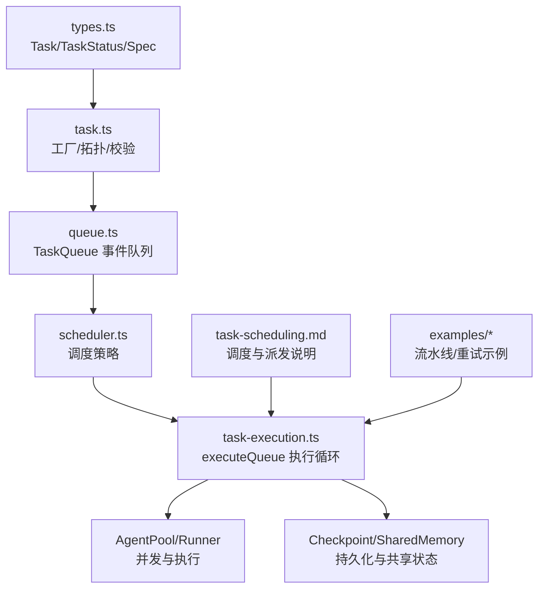
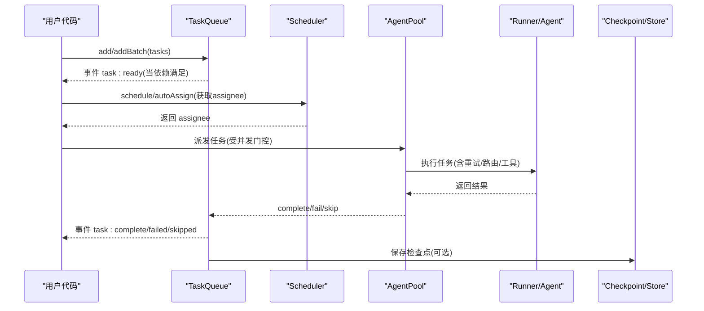
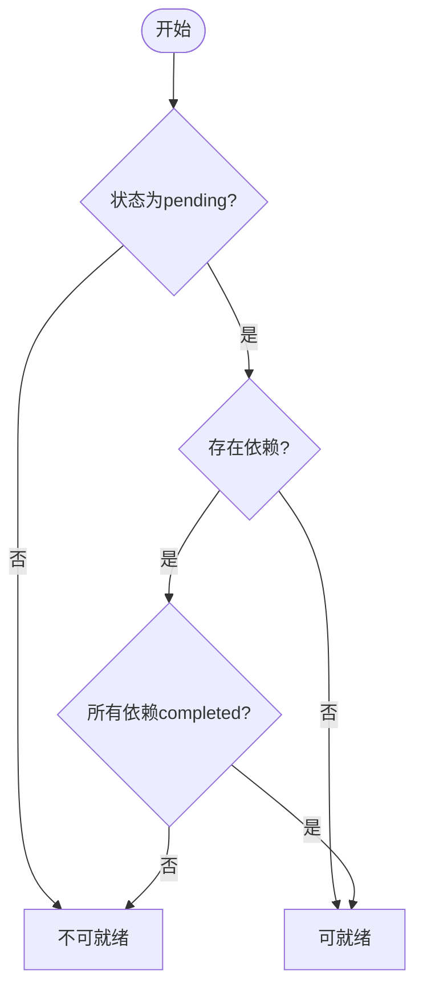
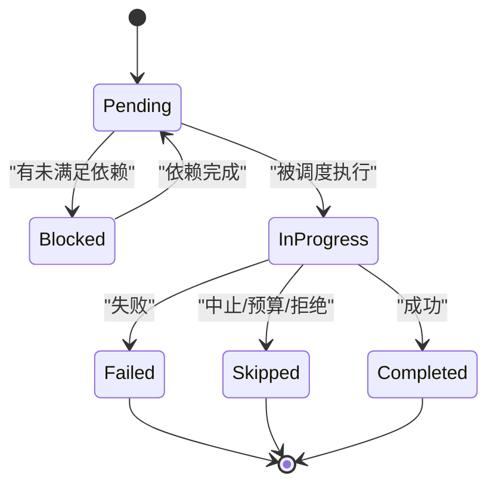
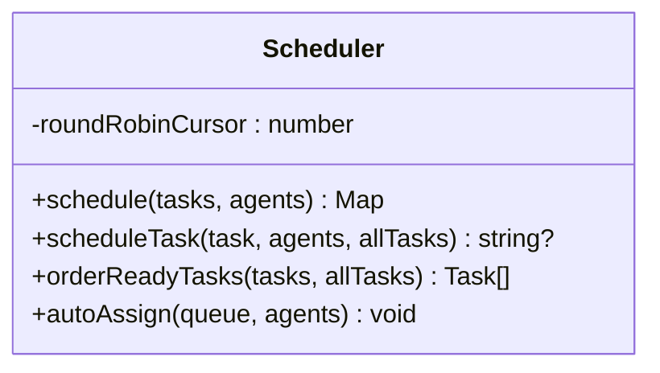
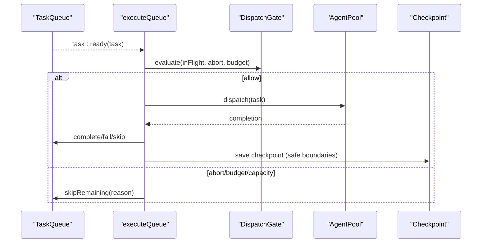
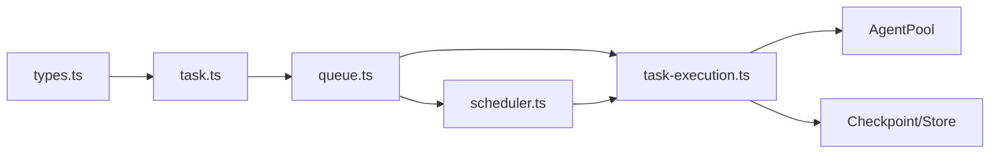

# 任务管理

<cite>
**本文引用的文件**
- [packages/core/src/types.ts](file://packages/core/src/types.ts)
- [packages/core/src/task/task.ts](file://packages/core/src/task/task.ts)
- [packages/core/src/task/queue.ts](file://packages/core/src/task/queue.ts)
- [packages/core/src/orchestrator/scheduler.ts](file://packages/core/src/orchestrator/scheduler.ts)
- [packages/core/src/orchestrator/task-execution.ts](file://packages/core/src/orchestrator/task-execution.ts)
- [docs/task-scheduling.md](file://docs/task-scheduling.md)
- [packages/core/examples/basics/task-pipeline.ts](file://packages/core/examples/basics/task-pipeline.ts)
- [packages/core/examples/patterns/task-retry.ts](file://packages/core/examples/patterns/task-retry.ts)
</cite>

## 目录
1. [简介](#简介)
2. [项目结构](#项目结构)
3. [核心组件](#核心组件)
4. [架构总览](#架构总览)
5. [详细组件分析](#详细组件分析)
6. [依赖关系分析](#依赖关系分析)
7. [性能考量](#性能考量)
8. [故障排查指南](#故障排查指南)
9. [结论](#结论)
10. [附录](#附录)

## 简介
本章节面向 Open Multi-Agent（OMA）的任务管理系统，聚焦以下目标：
- 深入说明 Task 接口的定义与用法，包括任务创建、依赖关系配置、元数据处理等。
- 解释任务队列的管理机制：优先级调度、状态跟踪、并发控制。
- 介绍任务的执行上下文、结果处理、错误恢复机制。
- 提供最佳实践：任务设计模式、性能优化、监控告警。
- 给出实际编排示例，展示复杂工作流的处理方式。
- 解释任务与智能体、工具的协作关系。

## 项目结构
OMA 的任务系统由“类型定义 + 任务工具 + 任务队列 + 调度器 + 执行循环”构成，配合文档与示例形成完整闭环：
- 类型定义：Task、TaskStatus、RunTaskSpec、TaskRequirements、TaskMetadata 等集中在 types.ts。
- 任务工具：createTask、isTaskReady、getTaskDependencyOrder、validateTaskDependencies 等纯函数在 task.ts。
- 任务队列：TaskQueue 维护任务生命周期、事件驱动、快照/恢复、计划补丁。
- 调度器：Scheduler 提供多种策略（round-robin、least-busy、capability-match、dependency-first、composite）。
- 执行循环：executeQueue 负责事件驱动的执行、并发门控、预算/中止、检查点、恢复策略。
- 文档与示例：task-scheduling.md 描述调度与派发；examples 演示流水线与重试。

图表来源
- [packages/core/src/types.ts:2003-2084](file://packages/core/src/types.ts#L2003-L2084)
- [packages/core/src/task/task.ts:36-182](file://packages/core/src/task/task.ts#L36-L182)
- [packages/core/src/task/queue.ts:64-180](file://packages/core/src/task/queue.ts#L64-L180)
- [packages/core/src/orchestrator/scheduler.ts:142-214](file://packages/core/src/orchestrator/scheduler.ts#L142-L214)
- [packages/core/src/orchestrator/task-execution.ts:661-760](file://packages/core/src/orchestrator/task-execution.ts#L661-L760)
- [docs/task-scheduling.md:1-26](file://docs/task-scheduling.md#L1-L26)

章节来源
- [packages/core/src/types.ts:2003-2084](file://packages/core/src/types.ts#L2003-L2084)
- [packages/core/src/task/task.ts:36-182](file://packages/core/src/task/task.ts#L36-L182)
- [packages/core/src/task/queue.ts:64-180](file://packages/core/src/task/queue.ts#L64-L180)
- [packages/core/src/orchestrator/scheduler.ts:142-214](file://packages/core/src/orchestrator/scheduler.ts#L142-L214)
- [packages/core/src/orchestrator/task-execution.ts:661-760](file://packages/core/src/orchestrator/task-execution.ts#L661-L760)
- [docs/task-scheduling.md:1-26](file://docs/task-scheduling.md#L1-L26)

## 核心组件
- Task 接口与运行规格：包含标题、描述、状态、依赖、内存作用域、依赖载荷、角色、优先级、元数据、硬性要求、重试配置、验证选项等。
- 任务工具：创建任务、判断就绪、拓扑排序、依赖图校验。
- 任务队列：事件驱动的状态机，支持添加、完成、失败、跳过、快照/恢复、计划补丁、进度查询。
- 调度器：多策略将待派发的任务映射到可用智能体，支持按依赖关键路径、负载、能力匹配、综合评分等。
- 执行循环：订阅队列事件，基于 AgentPool 并发门控派发任务，集成预算、中止、检查点、恢复策略。

章节来源
- [packages/core/src/types.ts:1386-1443](file://packages/core/src/types.ts#L1386-L1443)
- [packages/core/src/types.ts:2003-2084](file://packages/core/src/types.ts#L2003-L2084)
- [packages/core/src/task/task.ts:36-182](file://packages/core/src/task/task.ts#L36-L182)
- [packages/core/src/task/queue.ts:64-180](file://packages/core/src/task/queue.ts#L64-L180)
- [packages/core/src/orchestrator/scheduler.ts:142-214](file://packages/core/src/orchestrator/scheduler.ts#L142-L214)
- [packages/core/src/orchestrator/task-execution.ts:661-760](file://packages/core/src/orchestrator/task-execution.ts#L661-L760)

## 架构总览
下图展示了从任务创建到执行完成的端到端流程，以及关键交互点：
- 任务通过 createTask 或 runTasks 输入规范生成。
- TaskQueue 维护状态并触发 ready/complete/failed/skipped/all:complete 事件。
- Scheduler 根据策略为任务选择智能体。
- executeQueue 订阅事件，结合 AgentPool 并发门控派发执行。
- 执行过程中进行重试、模型路由、工具调用、共识验证、检查点保存与恢复。

图表来源
- [packages/core/src/task/task.ts:36-75](file://packages/core/src/task/task.ts#L36-L75)
- [packages/core/src/task/queue.ts:85-105](file://packages/core/src/task/queue.ts#L85-L105)
- [packages/core/src/orchestrator/scheduler.ts:191-214](file://packages/core/src/orchestrator/scheduler.ts#L191-L214)
- [packages/core/src/orchestrator/task-execution.ts:661-760](file://packages/core/src/orchestrator/task-execution.ts#L661-L760)
- [packages/core/src/orchestrator/task-execution.ts:186-277](file://packages/core/src/orchestrator/task-execution.ts#L186-L277)

## 详细组件分析

### Task 接口与任务规格
- 任务标识与生命周期：id、title、description、status、createdAt/updatedAt。
- 依赖与作用域：dependsOn、memoryScope（dependencies 或 all）、dependencyPayload（output/structured/both）。
- 角色与优先级：role、priority（low/normal/high/critical），用于模型路由与调度。
- 元数据与硬性要求：metadata（受校验与脱敏）、requires（requiredTools/requiredCapabilities/requiredBackend/requiredProvider）。
- 重试与验证：maxRetries、retryDelayMs、retryBackoff、verify（共识验证选项）。
- 运行规格：RunTaskSpec 是 runTasks 的输入形态，兼容上述字段。

章节来源
- [packages/core/src/types.ts:2003-2084](file://packages/core/src/types.ts#L2003-L2084)
- [packages/core/src/types.ts:1386-1443](file://packages/core/src/types.ts#L1386-L1443)

### 任务工具：创建、就绪判断、拓扑排序、依赖校验
- createTask：生成带 UUID、初始 pending 状态、时间戳及可选项的任务对象。
- isTaskReady：检查任务是否 pending 且所有 dependsOn 已完成。
- getTaskDependencyOrder：Kahn 算法对任务进行拓扑排序，无环时输出线性顺序。
- validateTaskDependencies：检测未知依赖、自依赖、环依赖。

图表来源
- [packages/core/src/task/task.ts:98-114](file://packages/core/src/task/task.ts#L98-L114)

章节来源
- [packages/core/src/task/task.ts:36-75](file://packages/core/src/task/task.ts#L36-L75)
- [packages/core/src/task/task.ts:98-114](file://packages/core/src/task/task.ts#L98-L114)
- [packages/core/src/task/task.ts:137-182](file://packages/core/src/task/task.ts#L137-L182)
- [packages/core/src/task/task.ts:206-261](file://packages/core/src/task/task.ts#L206-L261)

### 任务队列：状态机、事件、快照/恢复、计划补丁
- 状态：pending、blocked、in_progress、completed、failed、skipped。
- 事件：task:ready、task:complete、task:failed、task:skipped、all:complete。
- 操作：add/addBatch、complete/fail/skip、skipRemaining、update。
- 快照/恢复：snapshot/fromSnapshot，支持 resetInProgress 以恢复崩溃后任务。
- 计划补丁：applyPlanPatch（追加任务、重定向、覆盖）、publishPlanRevision 发布变更。
- 级联：fail/skip 会级联下游 blocked/pending 任务。

图表来源
- [packages/core/src/types.ts:2003-2004](file://packages/core/src/types.ts#L2003-L2004)
- [packages/core/src/task/queue.ts:64-180](file://packages/core/src/task/queue.ts#L64-L180)
- [packages/core/src/task/queue.ts:433-505](file://packages/core/src/task/queue.ts#L433-L505)

章节来源
- [packages/core/src/task/queue.ts:64-180](file://packages/core/src/task/queue.ts#L64-L180)
- [packages/core/src/task/queue.ts:433-505](file://packages/core/src/task/queue.ts#L433-L505)
- [packages/core/src/task/queue.ts:514-545](file://packages/core/src/task/queue.ts#L514-L545)
- [packages/core/src/task/queue.ts:557-667](file://packages/core/src/task/queue.ts#L557-L667)

### 调度器：五种策略与任务排序
- round-robin：按智能体索引轮询分配。
- least-busy：选择当前 in_progress 最少的智能体。
- capability-match：基于硬性要求过滤，再按能力/关键词打分。
- dependency-first：优先分配能解锁最多下游任务的关键路径任务。
- composite：综合关键路径、能力契合度与当前负载加权评分。
- orderReadyTasks：对 ready 集按依赖关键路径排序（适用于依赖敏感策略）。

图表来源
- [packages/core/src/orchestrator/scheduler.ts:142-214](file://packages/core/src/orchestrator/scheduler.ts#L142-L214)
- [packages/core/src/orchestrator/scheduler.ts:223-268](file://packages/core/src/orchestrator/scheduler.ts#L223-L268)
- [packages/core/src/orchestrator/scheduler.ts:305-508](file://packages/core/src/orchestrator/scheduler.ts#L305-L508)

章节来源
- [packages/core/src/orchestrator/scheduler.ts:142-214](file://packages/core/src/orchestrator/scheduler.ts#L142-L214)
- [packages/core/src/orchestrator/scheduler.ts:223-268](file://packages/core/src/orchestrator/scheduler.ts#L223-L268)
- [packages/core/src/orchestrator/scheduler.ts:305-508](file://packages/core/src/orchestrator/scheduler.ts#L305-L508)

### 执行循环：事件驱动、并发门控、预算/中止、检查点与恢复
- 事件驱动：订阅 task:ready，立即尝试派发；完成后自动解除下游阻塞。
- 并发门控：AgentPool 的并发限制是唯一并发权威；dispatch gate 检查中止、预算、容量。
- 预算/中止：达到预算或收到中止信号则停止新派发，等待在途任务结束后标记剩余为 skipped。
- 检查点：保存任务完成、工具边界、审批请求等，支持恢复时跳过已记录任务并重放提交结果。
- 恢复策略：onTaskOutcome 可提出 plan patch（追加/重定向/覆盖），经校验与批准后可应用并持久化。

图表来源
- [packages/core/src/orchestrator/task-execution.ts:661-760](file://packages/core/src/orchestrator/task-execution.ts#L661-L760)
- [packages/core/src/orchestrator/task-execution.ts:395-403](file://packages/core/src/orchestrator/task-execution.ts#L395-L403)
- [packages/core/src/orchestrator/task-execution.ts:186-277](file://packages/core/src/orchestrator/task-execution.ts#L186-L277)
- [docs/task-scheduling.md:166-184](file://docs/task-scheduling.md#L166-L184)

章节来源
- [packages/core/src/orchestrator/task-execution.ts:661-760](file://packages/core/src/orchestrator/task-execution.ts#L661-L760)
- [packages/core/src/orchestrator/task-execution.ts:395-403](file://packages/core/src/orchestrator/task-execution.ts#L395-L403)
- [packages/core/src/orchestrator/task-execution.ts:186-277](file://packages/core/src/orchestrator/task-execution.ts#L186-L277)
- [docs/task-scheduling.md:166-184](file://docs/task-scheduling.md#L166-L184)

### 任务与智能体、工具的协作
- 任务指派：Scheduler 根据策略与硬性要求选择智能体；若无法满足则抛出 NO_ELIGIBLE_AGENT。
- 工具上下文：buildTaskAgentTeamInfo 构建 TeamInfo，包含共享内存、委派工具、委派深度等。
- 委派执行：runDelegatedAgent 使用池的 runEphemeral 运行临时 Agent，避免死锁并保持并发门控。
- 结果注入：dependencyPayload 控制依赖结果注入形式（output/structured/both），结构化值需可序列化且有限制大小。

章节来源
- [packages/core/src/orchestrator/scheduler.ts:510-557](file://packages/core/src/orchestrator/scheduler.ts#L510-L557)
- [packages/core/src/orchestrator/task-execution.ts:82-184](file://packages/core/src/orchestrator/task-execution.ts#L82-L184)
- [docs/task-scheduling.md:27-64](file://docs/task-scheduling.md#L27-L64)

### 最佳实践
- 任务设计模式
  - 明确依赖链：使用 dependsOn 表达 DAG，避免隐式耦合。
  - 合理设置 memoryScope：默认 dependencies 仅注入直接依赖结果；必要时用 all 访问共享记忆摘要。
  - 结构化传递：使用 dependencyPayload=structured 确保下游获得强类型数据。
  - 角色与优先级：role/priority 有助于模型路由与调度决策。
- 性能优化
  - 选择合适调度策略：依赖密集用 dependency-first；异构任务用 least-busy；需要综合评分用 composite。
  - 控制并发：通过 maxConcurrency 与 AgentPool 限制并行度，避免资源争用。
  - 重用共享内存：减少重复 IO，注意 TTL 与版本一致性。
- 监控告警
  - onProgress：监听 task_start/complete/retry/error 等事件，记录指标与异常。
  - 检查点：启用 checkpoint 以便中断恢复与审计。
  - 预算与中止：设置 token/cost 预算，及时中止超支任务。

章节来源
- [packages/core/src/orchestrator/scheduler.ts:142-214](file://packages/core/src/orchestrator/scheduler.ts#L142-L214)
- [packages/core/src/orchestrator/task-execution.ts:661-760](file://packages/core/src/orchestrator/task-execution.ts#L661-L760)
- [docs/task-scheduling.md:98-133](file://docs/task-scheduling.md#L98-L133)
- [docs/task-scheduling.md:166-184](file://docs/task-scheduling.md#L166-L184)

### 实际编排示例
- 流水线示例：design → implement → test + review（并行），展示 dependsOn 与 memoryScope 的使用。
- 重试示例：fetcher 配置 maxRetries/retryDelayMs/retryBackoff，analyst 依赖其结果，演示 onProgress 中的 task_retry 事件。

章节来源
- [packages/core/examples/basics/task-pipeline.ts:120-179](file://packages/core/examples/basics/task-pipeline.ts#L120-L179)
- [packages/core/examples/patterns/task-retry.ts:88-105](file://packages/core/examples/patterns/task-retry.ts#L88-L105)

## 依赖关系分析
- 模块耦合
  - task.ts 提供纯函数，被 queue.ts 复用，降低耦合。
  - queue.ts 依赖 task.ts 的工具函数，并通过事件与 scheduler.ts、task-execution.ts 解耦。
  - scheduler.ts 依赖 agent-selector 与 types，不直接持有队列状态。
  - task-execution.ts 组合 queue、scheduler、pool、checkpoint，承担编排职责。
- 外部依赖
  - AgentPool 作为并发权威，统一限制并发。
  - Checkpoint/SharedMemory 提供持久化与跨任务共享状态。
- 潜在风险
  - 循环依赖：validateTaskDependencies 会在生产路径前检测。
  - 资源竞争：通过 AgentPool 与 dispatch gate 控制并发与准入。

图表来源
- [packages/core/src/types.ts:2003-2084](file://packages/core/src/types.ts#L2003-L2084)
- [packages/core/src/task/task.ts:36-182](file://packages/core/src/task/task.ts#L36-L182)
- [packages/core/src/task/queue.ts:64-180](file://packages/core/src/task/queue.ts#L64-L180)
- [packages/core/src/orchestrator/scheduler.ts:142-214](file://packages/core/src/orchestrator/scheduler.ts#L142-L214)
- [packages/core/src/orchestrator/task-execution.ts:661-760](file://packages/core/src/orchestrator/task-execution.ts#L661-L760)

章节来源
- [packages/core/src/task/task.ts:36-182](file://packages/core/src/task/task.ts#L36-L182)
- [packages/core/src/task/queue.ts:64-180](file://packages/core/src/task/queue.ts#L64-L180)
- [packages/core/src/orchestrator/scheduler.ts:142-214](file://packages/core/src/orchestrator/scheduler.ts#L142-L214)
- [packages/core/src/orchestrator/task-execution.ts:661-760](file://packages/core/src/orchestrator/task-execution.ts#L661-L760)

## 性能考量
- 事件驱动执行：下游任务在依赖满足后立即启动，无需等待同批其他任务，提升吞吐。
- 调度策略选择：依赖密集场景使用 dependency-first；长尾任务用 least-busy；复杂约束用 composite。
- 并发控制：AgentPool 的并发上限是关键瓶颈，需根据资源与延迟调优。
- 检查点写入：仅在安全边界写入，避免阻塞主流程；失败降级不影响运行。
- 结构化依赖载荷：限制大小与序列化成本，避免过大 payload 影响性能。

[本节为通用指导，不直接分析具体文件]

## 故障排查指南
- 常见错误
  - 依赖缺失或引用未知 ID：validateTaskDependencies 会报告问题。
  - 循环依赖：DFS 着色检测并返回错误信息。
  - 无合格智能体：NO_ELIGIBLE_AGENT，检查 requires 与智能体能力/后端/提供者。
  - 预算超限/中止：dispatch gate 阻止新派发，剩余任务标记 skipped。
- 恢复与审计
  - 检查点：查看 completedTaskResults、inFlightTasks、pendingApprovals。
  - 计划修订：查看 planRevisions，确认修复补丁是否应用。
  - 事件追踪：onProgress 中记录 task_start/complete/retry/error 等事件。

章节来源
- [packages/core/src/task/task.ts:206-261](file://packages/core/src/task/task.ts#L206-L261)
- [packages/core/src/orchestrator/scheduler.ts:546-557](file://packages/core/src/orchestrator/scheduler.ts#L546-L557)
- [packages/core/src/orchestrator/task-execution.ts:395-403](file://packages/core/src/orchestrator/task-execution.ts#L395-L403)
- [packages/core/src/orchestrator/task-execution.ts:186-277](file://packages/core/src/orchestrator/task-execution.ts#L186-L277)

## 结论
Open Multi-Agent 的任务管理系统以“类型 + 工具 + 队列 + 调度 + 执行”为核心，提供：
- 明确的 Task 模型与丰富的运行时配置（依赖、元数据、硬性要求、重试、验证）。
- 事件驱动的队列与灵活的状态机，支持快照/恢复与计划补丁。
- 多策略调度器，适配不同工作负载与约束。
- 健壮的并发控制、预算/中止、检查点与恢复机制。
- 完善的监控与示例，便于落地复杂编排与运维。

[本节为总结性内容，不直接分析具体文件]

## 附录
- 参考文档
  - 调度与派发：docs/task-scheduling.md
- 示例
  - 基础流水线：packages/core/examples/basics/task-pipeline.ts
  - 重试模式：packages/core/examples/patterns/task-retry.ts

[本节为补充信息，不直接分析具体文件]